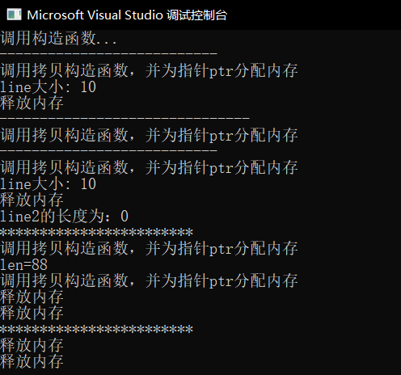
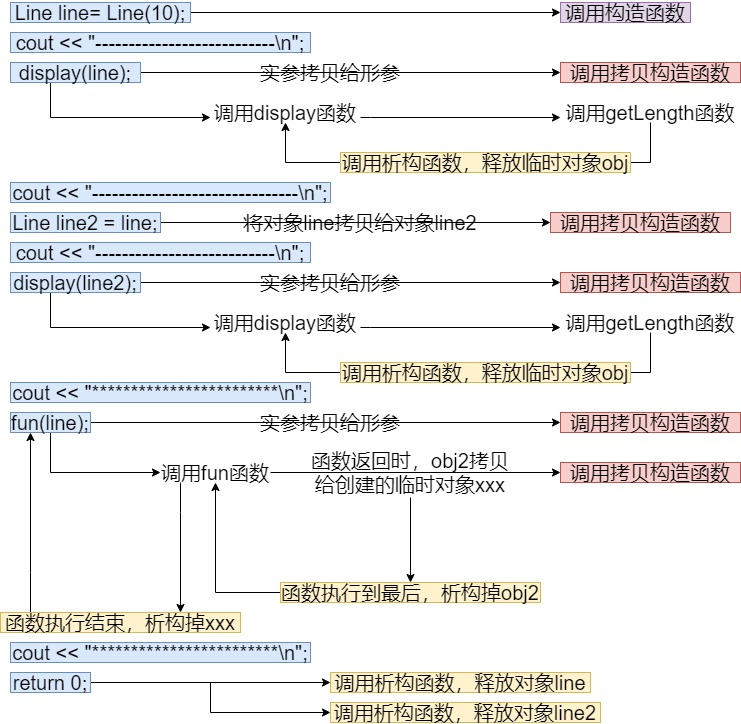
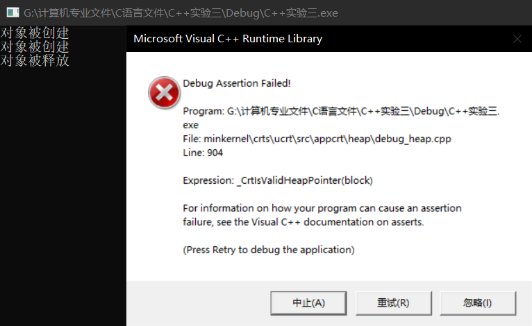
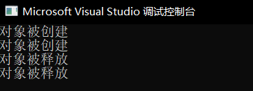
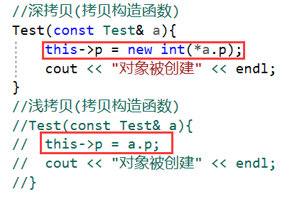
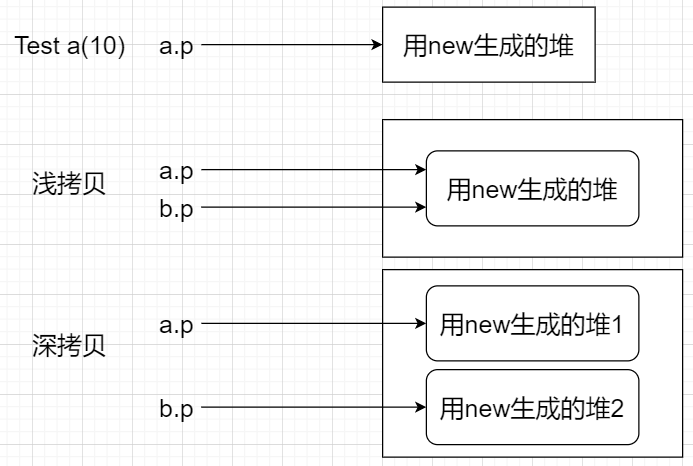

# 1.拷贝构造函数

何时调用拷贝构造函数？有以下三种情况：

+ 直接将对象line2拷贝给line，即通过另一个对象进行初始化

+ 函数调用时候实参对象拷贝给形参
+ 函数返回值为对象line时候，调用拷贝构造函数

如果类带有指针变量，并有动态内存分配，则它必须有一个拷贝构造函数。拷贝构造函数的最常见形式如下：

```cpp
类名 (const 类名 &obj){ // obj 是一个对象引用，该对象是用于初始化另一个对象的
拷贝构造函数的主体;
}
```

```cpp
#include <iostream>
using namespace std;
class Line {
public:
	int length;
	int getLength();
	Line(int len); // 普通的构造函数
	Line(const Line &obj); // 拷贝构造函数
	~Line(); // 析构函数
private:
	int *ptr;
};
// 构造函数定义
Line::Line(int len) {
	cout << "调用构造函数..." << endl;
	ptr = new int; // 为指针分配内存
	*ptr = len;
}
// 拷贝构造函数定义
Line::Line(const Line &obj) {
	// &obj是对象line的一个引用，用这个对象的引用来初始化另一个对象
	cout << "调用拷贝构造函数，并为指针ptr分配内存" << endl;
	ptr = new int;
	*ptr = *obj.ptr; // 拷贝值
}
// 析构函数定义
Line::~Line() {
	cout << "释放内存\n";
	delete ptr;
}
// 普通成员函数定义
int Line::getLength() {
	return *ptr;
}
void display(Line obj) {
	cout << "line大小: " << obj.getLength() << endl;
}
Line fun(Line obj2) {
	int len = obj2.length = 88;
	cout << "len=" << len << endl;
	return obj2;
}

int main() {
	Line line = Line(10);
	cout << "---------------------------\n";
	display(line);
	cout << "-------------------------------\n";
	Line line2 = line; // 调用拷贝构造函数
	cout << "---------------------------\n";
	display(line2);
	cout << "line2的长度为：" << line2.length << endl;
	cout << "************************\n";
	fun(line);
	cout << "************************\n";
	return 0;
}
```



执行过程如下：



# 2.深拷贝和浅拷贝

```cpp
#include <iostream>
using namespace std;
class Test{
private:
	int* p;
public:
	Test(int x){
		this->p = new int(x);
		cout << "对象被创建" << endl;
	}
	~Test(){
		if (p != NULL)
		{
			delete p;
		}
		cout << "对象被释放" << endl;
	}
	//深拷贝(拷贝构造函数)
	Test(const Test& a){
		this->p = new int(*a.p);
		cout << "对象被创建" << endl;
	}
	//浅拷贝(拷贝构造函数)
	//Test(const Test& a){
	//
	//  this->p = a.p;
	//  cout << "对象被创建" << endl;
	//}
};

int main(){
	Test a(10);
	//我们手动的写拷贝构造函数,C++编译器会调用我们手动写的
	Test b = a;
	return 0;
}
```

如果注释深拷贝函数，执行浅拷贝，那么会发生异常：



如果注释浅拷贝函数，执行深拷贝，那么输出结果为：



两者区别如下：





在默认情况下，使用的是浅拷贝，但是一旦在类中有初始化堆的语句，就要小心这里，很可能默认的浅拷贝让新生成的指针与原先指向同一块内存。而重新定义拷贝构造函数使用深拷贝就可以避免这一点。