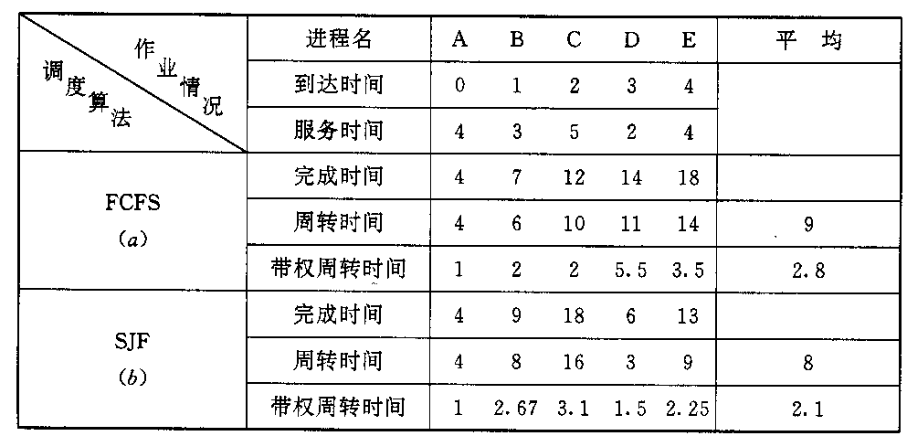
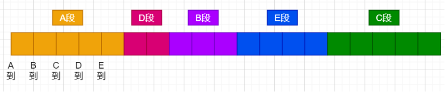
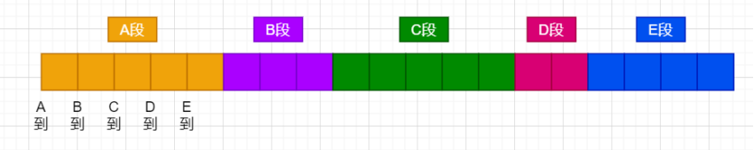
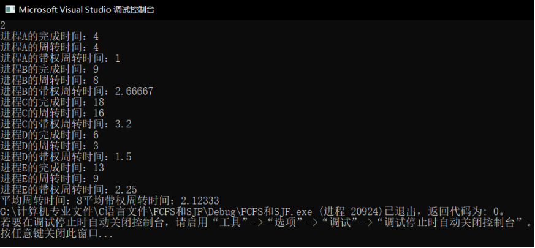
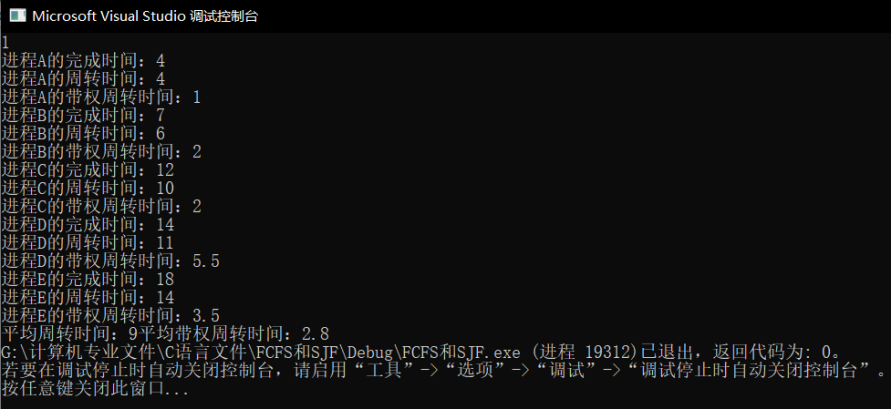

# 实验原理
实现FCFS和SJF调度算法，实验环境为VS2017



# 图解
SJF：

FCFS：


# 源程序
```cpp
#include <iostream>
#include <string.h>
using namespace std;
typedef struct node{
	char name[4];
	float reachTime;
	float serverTime;
	float startTime;
	float finishTime;
	float crylingTime;
	float authorizedCrylingTime;
}* Process,Nodes;

void FCFS(Process pro);
void SJF(Process pro);

void FCFS(Process pro){
	float avgtime = 0;
	float avgatime = 0;
	// 计算完成时间
	pro[0].finishTime = pro[0].reachTime + pro[0].serverTime;
	for (int i = 1; i < 5; i++){
		pro[i].finishTime = pro[i - 1].finishTime + pro[i].serverTime;
	}
	// 计算周转时间、带权周转时间
	for (int i = 0; i < 5; i++){
		pro[i].crylingTime = pro[i].finishTime - pro[i].reachTime;
		avgtime = avgtime + pro[i].crylingTime;
		pro[i].authorizedCrylingTime = pro[i].crylingTime / pro[i].serverTime;
		avgatime = avgatime + pro[i].authorizedCrylingTime;
	}
	// 输出
	for (int j = 0; j < 5; j++){
		cout << "进程" << pro[j].name << "的完成时间：" << pro[j].finishTime << endl;
		cout << "进程" << pro[j].name << "的周转时间：" << pro[j].crylingTime << endl;
		cout << "进程" << pro[j].name << "的带权周转时间：" << pro[j].authorizedCrylingTime << endl;
	}
	cout << "平均周转时间：" << avgtime/5;
	cout << "平均带权周转时间：" << avgatime/5;
}

void SJF(Process pro){
	float avgtime = 0;
	float avgatime = 0;
	int flag[5] = { 0,1,2,3,4 };   // 设置执行顺序
	for (int i = 1; i < 5; i++)
		for (int j = i+1; j < 5; j++)
		if (pro[flag[i]].serverTime > pro[flag[j]].serverTime){
			int t = flag[i];
			flag[i] = j;
			flag[j] = flag[j];
		}
	flag[0] = 0;
	flag[1] = 3;
	flag[2] = 1;
	flag[3] = 4;
	flag[4] = 2;
	// 计算完成时间
	pro[0].finishTime = pro[0].reachTime + pro[0].serverTime;
	for (int i = 1; i < 5; i++){
		pro[flag[i]].finishTime = pro[flag[i - 1]].finishTime + pro[flag[i]].serverTime;
	}
	// 计算周转时间、带权周转时间
	for (int i = 0; i < 5; i++){
		pro[flag[i]].crylingTime = pro[flag[i]].finishTime - pro[flag[i]].reachTime;
		avgtime = avgtime + pro[flag[i]].crylingTime;
		pro[flag[i]].authorizedCrylingTime = pro[flag[i]].crylingTime / pro[flag[i]].serverTime;
		avgatime = avgatime + pro[flag[i]].authorizedCrylingTime;
	}

	// 输出
	for (int j = 0; j < 5; j++){
		cout << "进程" << pro[j].name << "的完成时间：" << pro[j].finishTime << endl;
		cout << "进程" << pro[j].name << "的周转时间：" << pro[j].crylingTime << endl;
		cout << "进程" << pro[j].name << "的带权周转时间：" << pro[j].authorizedCrylingTime << endl;
	}
	cout << "平均周转时间：" << avgtime/5;
	cout << "平均带权周转时间：" << avgatime/5;
}
int main(){
	Nodes pro[5];
	pro[0] = { "A", 0, 4};
	pro[1] = { "B", 1, 3};
	pro[2] = { "C", 2, 5};
	pro[3] = { "D", 3, 2};
	pro[4] = { "E", 4, 4};

	int choose;
	cin >> choose;
	if (choose == 1)
		FCFS(pro);
	else if (choose == 2)
		SJF(pro);
	else
		cout << "Please input number between 1 or 2" << endl;
	return 0;
}
```
# 输出结果
SJF：

FCFS：
