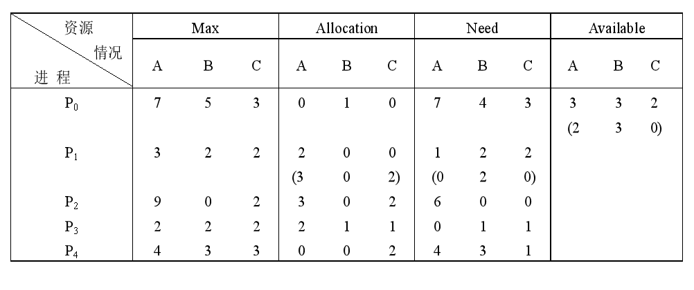
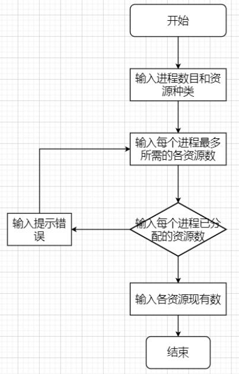
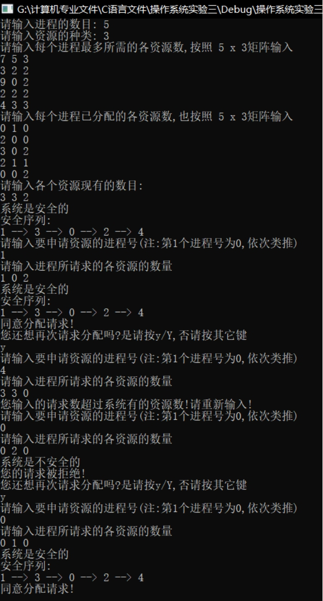

# 实验原理

用银行家算法实现资源分配：



# 流程图



# 源程序

```cpp
#include <iostream>
using namespace std;
#define MAXPROCESS 50						//最大进程数
#define MAXRESOURCE 100						//最大资源数
int AVAILABLE[MAXRESOURCE];					//可用资源数组
int MAX[MAXPROCESS][MAXRESOURCE];           //最大需求矩阵
int ALLOCATION[MAXPROCESS][MAXRESOURCE];    //分配矩阵
int NEED[MAXPROCESS][MAXRESOURCE];          //需求矩阵
int REQUEST[MAXPROCESS][MAXRESOURCE];       //进程需要资源数
bool FINISH[MAXPROCESS];                    //系统是否有足够的资源分配
int p[MAXPROCESS];                          //记录序列
int m,n;                                    //m个进程,n个资源
// 函数声明
void Init();
bool Safe();
void Bank();
/*
给出系统拥有的每种资源数，已经分配给每个进程的资源数，
还有每个进程最多需要每种资源的个数，让你判断当前系统是不是安全的
*/
void  Init() {
	int i, j;
	cout << "请输入进程的数量: ";
	cin >> m;
	cout << "请输入资源的种类: ";
	cin >> n;
	cout << "请输入Max,按照 " << m << "x" << n << "矩阵输入 " << endl;
	for (i = 0; i < m; i++)
		for (j = 0; j < n; j++)
			cin >> MAX[i][j];
	cout << "请输入Allocation,按照 " << m << "x" << n << "矩阵输入" << endl;
	for (i = 0; i < m; i++) {
		for (j = 0; j < n; j++) {
			cin >> ALLOCATION[i][j];
			NEED[i][j] = MAX[i][j] - ALLOCATION[i][j];
			if (NEED[i][j] < 0) {
				cout << "您输入的第" << i + 1 << "个进程所拥有的第" << j + 1 << "个资源数错误,请重新输入: " << endl;
				j--;
				continue;
			}
		}
	}
	cout << "请输入各个资源现有的数量: " << endl;
	for (i = 0; i < n; i++) {
		cin >> AVAILABLE[i];
	}
}
// 银行家算法的主体
void Bank() {
	int i, cusneed;
	char again;
	while (true) {
	Restart:
		cout << "请输入Request：" << endl;
		cin >> cusneed;
		cout << "请输入Request的数量num：" << endl;
		for (i = 0; i < n; i++) {
			cin >> REQUEST[cusneed][i];
		}
		for (i = 0; i < n; i++) {
			if (REQUEST[cusneed][i] > NEED[cusneed][i]) {
				cout << "您输入的请求数超过进程的需求量!请重新输入! " << endl;
				goto  Restart;
			}
			if (REQUEST[cusneed][i] > AVAILABLE[i]) {
				cout << "您输入的请求数超过系统有的资源数!请重新输入! " << endl;
				goto  Restart;
			}
		}
		for (i = 0; i < n; i++) {
			AVAILABLE[i] -= REQUEST[cusneed][i];
			ALLOCATION[cusneed][i] += REQUEST[cusneed][i];
			NEED[cusneed][i] -= REQUEST[cusneed][i];
		}
		if (Safe()) {
			cout << "同意分配请求!" << endl;
		}
		else {
			cout << "您的请求被拒绝!" << endl;
			for (i = 0; i < n; i++) {
				AVAILABLE[i] += REQUEST[cusneed][i];
				ALLOCATION[cusneed][i] -= REQUEST[cusneed][i];
				NEED[cusneed][i] += REQUEST[cusneed][i];
			}
		}
		for (i = 0; i < m; i++) {
			FINISH[i] = false;
		}
		cout << "您还想再次请求分配吗?是请按y/Y,否请按其它键 " << endl;
		cin >> again;
		if (again == 'y' || again == 'Y') {
			continue;
		}
		break;
	}
}

bool Safe() {
	int i, j, k, l = 0;
	int Work[MAXRESOURCE];                     /* 工作数组 */
	for (i = 0; i < n; i++)
		Work[i] = AVAILABLE[i];
	for (i = 0; i < m; i++) {
		FINISH[i] = false;
	}
	for (i = 0; i < m; i++) {
		if (FINISH[i] == true)
			continue;
		else {
			for (j = 0; j < n; j++)
				if (NEED[i][j] > Work[j])
					break;
			if (j == n) {
				FINISH[i] = true;
				for (k = 0; k < n; k++) {
					Work[k] += ALLOCATION[i][k];
				}
				p[l++] = i;
				i = -1;
			}
			else {
				continue;
			}
		}
		if (l == m) {
			cout << "系统是安全的 " << endl;
			cout << "安全序列: " << endl;
			for (i = 0; i < l; i++) {
				cout << p[i];
				if (i != l - 1) {
					cout << " --> ";
				}
			}
			cout << "" << endl;
			return true;
		}
	}
	cout << "系统是不安全的" << endl;
	return false;
}
int main() {
	Init();
	Safe();
	Bank();
	getchar();
	return 0;
}
```

# 实验结果

