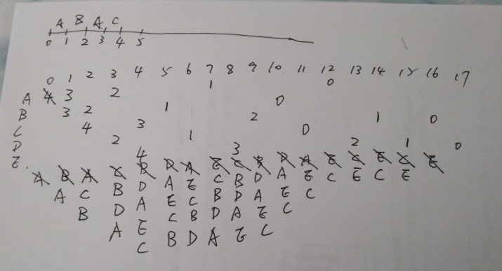

# 实验原理
时间片轮转算法：

q = 1和q = 4时进程的周转时间

# 流程图
时间片轮转过程：

流程图：


# 源程序
```cpp
#include <iostream>
#include <string>
#define MAX 20  
using namespace std;

//进程数据结构
struct PCB {
	string name;                    
	int arrive;                    
	int need;                      
	int count = 0;              
	bool status = true; 
	bool isOK = false;
};

PCB p[MAX];                   //定义进程数组
PCB queue[MAX];               //循环队列，存在覆盖的可能
int front = -1, rear = -1;    //队头、队尾指针

int main() {

	while (1) {
		int num, time, all = 0;
		int latest = 0;
		string isGoOn;
		string detail;
		cout << "请输入进程个数：";
		cin >> num;
		if (num > 20) {
			cout << "进程数超过最大值！" << endl;
			break;
			system("pause");
		}
		if (num <= 0) {
			cout << "输入进程数应大于0！" << endl;
			system("pause");
		}
		for (int i = 0; i < num; i++) {    //进行重置，用于重复输入
			p[i].status = true;
			p[i].isOK = false;
			p[i].count = 0;
		}

		cout << "请输入时间片大小：";
		cin >> time;
		if (time <= 0) {
			cout << "时间片应大于0" << endl;
			system("pause");
		}
		cout << "是否输出详细调度过程(y/n)：";
		cin >> detail;

		cout << "请依次输入进程名、进程到达时间和进程要求运行时间：";
		for (int i = 0; i < num; i++) {
			cin >> p[i].name >> p[i].arrive >> p[i].need;
			all += p[i].need;   //总时间
			if (latest < p[i].arrive)
				latest = p[i].arrive;
		}

		if (detail == "y")
			cout << "进程名" << "\t" << "已运行" << "\t" << "状态" << "\t" << "当前时刻" << endl;
		else
			cout << "进程名" << "\t" << "完成时刻" << endl;

		//根据进程到达时间进行排序，有利于时间片未用完的情况
		for (int i = 0; i < num; i++)
			for (int j = i + 1; j < num; j++) {
				if (p[i].arrive > p[j].arrive) {
					PCB temp = p[i];
					p[i] = p[j];
					p[j] = temp;
				}
			}

		int t = 0;
		while (t < all + latest) { 
			if (t <= latest) {
				for (int i = 0; i < num; i++) {
					if (p[i].isOK == false && t >= p[i].arrive) {
						p[i].isOK = true;
						rear = (rear + 1) % MAX;
						queue[rear] = p[i];
					}
				}
			}

			if ((rear - front) != 0) {
				front = (front + 1) % MAX;
				if ((queue[front].need - queue[front].count) <= time) {
					if (detail != "y")
						cout << queue[front].name << "\t" << t + queue[front].need - queue[front].count << endl;
					queue[front].status = false;
					t += (queue[front].need - queue[front].count);
					queue[front].count = queue[front].need;
					if (detail == "y")                                                   
						cout << queue[front].name << "\t" << queue[front].count << "\t" << queue[front].status << "\t" << t << endl;
					continue;
				}
				else {
					queue[front].count += time;
					t += time;    //t以time为单位自增
					if (t <= latest + time) { 
						for (int i = 0; i < num; i++) {
							if (p[i].isOK == false && t >= p[i].arrive) { 
								p[i].isOK = true; 
								rear = (rear + 1) % MAX;
								queue[rear] = p[i];
							}
						}
					}

					rear = (rear + 1) % MAX;
					queue[rear] = queue[front];
					if (detail == "y")
						cout << queue[front].name << "\t" << queue[front].count << "\t" << queue[front].status << "\t" << t << endl;
					continue;
				}
			}
			t++;
		}
		cout << "你想执行新进程吗(y/n)？";
		cin >> isGoOn;
		if (isGoOn == "y") {
			continue;
		}

		if (isGoOn == "n")
			system("pause");
		else {
			cout << "请输入：y/s" << endl;
			system("pause");
		}
	}
	return 0;
}
```
# 实验结果
