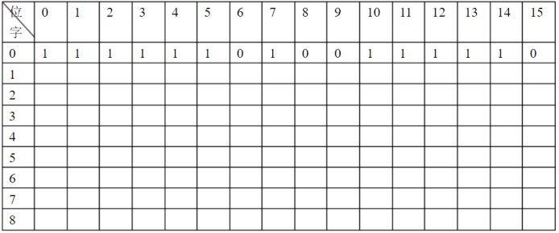
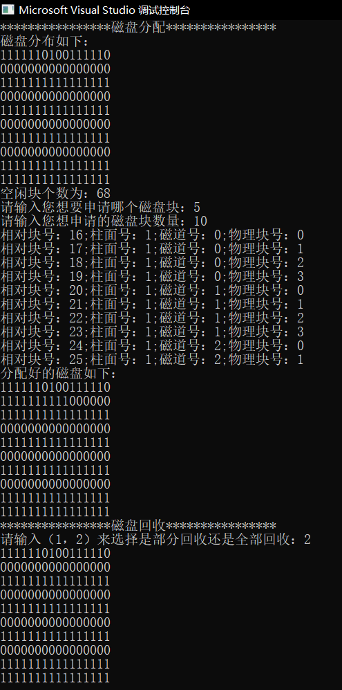

# 实验原理
用位示图管理磁盘空间，设计一个申请与申请与回收一个或几个磁盘块的分配与回收算法。要求打印或显示程序运行前和运行后的位示图，以及分配和回收磁盘的物理过程

提示：

(1)磁盘的位示图用若干个字节构成，每一位对应 一个磁盘块，1表示占用，0表示空闲。为了简单，假定现有一个磁盘组，共40个柱面。每个柱面四个磁道，每个磁道又划分成4个物理记录。假定字长为16位，其位示图如下图所示：


(2)申请一个磁盘块时，由分配程序查位示图，找出一个为0的位，并计算磁盘的物理地址(即求出它的柱面号，磁道号和扇区号)
由位示图计算磁盘的相对块号的公式如下：

+ 相对块号=字号\*16+位号

之后再将相对块号转换成磁盘的物理地址：

- 柱面号=相对块号/16的商，也即柱面号=字号
- 磁道号=(相对块号/16的余数)/4的商,也即(位号/4)的商
- 物理块号=(相对块号/16的余数)/4的余数,也即(位号/4)的余数

(3)当释放一个相对物理块时，运行回收程序，计算该块在位示图中的位置

计算公式如下：

先由磁盘地址计算相对块号:

+ 相对块号=柱面号\*16+磁道号\*4+物理块号

再计算字号和位号:

- 字号=相对块号/16的商,也即字号=柱面号
- 位号=磁道号\*物理块数/每磁道+物理块号

(4)按照用户要求，申请分配一系列磁盘块，运行分配程序，完成分配将分配相对块号返回用户，并将相对块号转换成磁盘绝对地址给以显示和系统各表和用户已分配的情况进行显示

(5)设计一个回收算法，将上述已分配的给用户的各盘块释放，并显示系统各表

# 源程序
```cpp
#include <string.h> 
#include <stdio.h> 
#define ROW 10
#define COLUMN 16
#define AREA 192
int a[ROW][COLUMN] = { 1,1,1,1,1,1,0,1,0,0,1,1,1,1,1,0,
0,0,0,0,0,0,0,0,0,0,0,0,0,0,0,0,
1,1,1,1,1,1,1,1,1,1,1,1,1,1,1,1,
0,0,0,0,0,0,0,0,0,0,0,0,0,0,0,0,
1,1,1,1,1,1,1,1,1,1,1,1,1,1,1,1,
0,0,0,0,0,0,0,0,0,0,0,0,0,0,0,0,
1,1,1,1,1,1,1,1,1,1,1,1,1,1,1,1,
0,0,0,0,0,0,0,0,0,0,0,0,0,0,0,0,
1,1,1,1,1,1,1,1,1,1,1,1,1,1,1,1,
1,1,1,1,1,1,1,1,1,1,1,1,1,1,1,1,
};
int b[ROW][COLUMN] = { 0 };
int c[AREA][3] = { 0 };
int static y;
// 函数声明
void distribute();
void callbackall();
void callbackpointed();

// 分配
void distribute() {
	static int i, j, k, p, m, n, q;
	printf("请输入您想要申请哪个磁盘块：");
	scanf("%d", &k);
	printf("请输入您想申请的磁盘块数量：");
	scanf("%d", &j);
	if (k + j > y) {
		printf("输入错误！！！\n ");
		distribute();
	}
	else {
		for (i = k; i < k + j; i++) {
			q = c[i - 1][1];
			m = q / 16;		// 柱面号
			n = q % 16;		// n/4是磁道号，n%4是物理块号
			p = m * 16 + n;		// 将相对块号保存在p中
			a[m][n] = 1; b[m][n] = 1;
			printf("相对块号：%d;柱面号：%d;磁道号：%d;物理块号：%d\n", p, m, n / 4, n % 4);
		}
		printf("分配好的磁盘如下：\n");
		for (i = 0; i < ROW; i++) {
			for (j = 0; j < COLUMN; j++){
				printf("%d", a[i][j]);
			}
			printf("\n");
		}
	}
}
// 回收
void callbackall() {
	int i, j;
	for (i = 0; i < ROW; i++) {
		for (j = 0; j < COLUMN; j++) {
			if (!b[i][j])
				continue;
			else
			{
				a[i][j] = 0;
			}
		}
	}
	for (i = 0; i < ROW; i++) {
		for (j = 0; j < COLUMN; j++) {
			printf("%d", a[i][j]);
		}
		printf("\n");
	}
}
void callbackpointed() {	// 部分回收
	static int i, k, q, m, j, p;
	printf("请输入您想要释放哪个磁盘块：");
	scanf("%d", &k);
	printf("请输入您想释放的磁盘块数量：");
	scanf("%d", &j);
	for (i = k; i < k + j; i++) {
		q = c[i - 1][1];
		m = q / 16;
		p = q % 16;
		a[m][p] = 0;
	}
	for (i = 0; i < ROW; i++) {
		for (j = 0; j < COLUMN; j++) {
			printf("%d", a[i][j]);
		}
		printf("\n");
	}
}
void main(){
	static int i, j, n, p,num;
	printf("****************磁盘分配****************\n");
	printf("磁盘分布如下：\n");
	for (i = 0; i < ROW; i++){
		for (j = 0; j < COLUMN; j++){
			printf("%d", a[i][j]);
		}
		printf("\n");
	}
	for (i = 0; i < ROW; i++){
		for (j = 0; j < COLUMN; j++){
			if (a[i][j])
				continue;
			else{
				c[p][0] = p + 1;
				c[p][1] = i * 16 + j;	// 得到相对块号
				p++;
			}
		}
	}
	y = p;
	printf("空闲块个数为：%d\n", p);
	distribute();		// 分配
	printf("****************磁盘回收****************\n");
	printf("请输入（1，2）来选择是部分回收还是全部回收：");
	scanf("%d", &num);
	switch (num){
	case 1:
		callbackpointed();		// 部分回收
		break;
	case 2:
		callbackall();		// 全部回收
		break;
	default:
		break;
	}
}
```
# 实验结果
