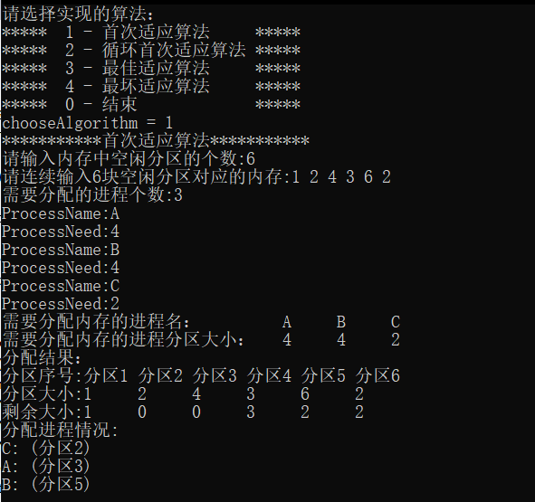

# 实验原理

## 首次适应算法(First Fit)
 我们以空闲分区链为例来说明采用FF算法时的分配情况。FF算法要求空闲分区链以地址递增的次序链接。

+ 在分配内存时，从链首开始顺序查找，直至找到一个大小能满足要求的空闲分区为止；
+ 然后再按照作业的大小，从该分区中划出一块内存空间分配给请求者，余下的空闲分区仍留在空闲链中。
+ 若从链首直至链尾都不能找到一个能满足要求的分区，则此次内存分配失败，返回。

首次适应算法倾向于优先利用内存中低址部分的空闲分区，从而保留了高址部分的大空闲区。这给为以后到达的大作业分配大的内存空间创造了条件。其缺点是低址部分不断被划分，会留下许多难以利用的、很小的空闲分区，而每次查找又都是从低址部分开始，这无疑会增加查找可用空闲分区时的开销。

## 循环首次适应算法(Next Fit)
该算法是由首次适应算法演变而成的。在为进程分配内存空间时，不再是每次都从链首开始查找，而是从上次找到的空闲分区的下一个空闲分区开始查找，直至找到一个能满足要求的空闲分区，从中划出一块与请求大小相等的内存空间分配给作业。

 为实现该算法，应设置一起始查寻指针，用于指示下一次起始查寻的空闲分区，并采用循环查找方式，即如果最后一个(链尾)空闲分区的大小仍不能满足要求，则应返回到第一个空闲分区，比较其大小是否满足要求。找到后，应调整起始查寻指针。

 该算法能使内存中的空闲分区分布得更均匀，从而减少了查找空闲分区时的开销，但这样会缺乏大的空闲分区。 

## 最佳适应算法(Best Fit)
所谓“最佳”是指每次为作业分配内存时，总是把能满足要求、又是最小的空闲分区分配给作业，避免“大材小用”。为了加速寻找，该算法要求将所有的空闲分区按其容量以从小到大的顺序形成一空闲分区链。这样，第一次找到的能满足要求的空闲区，必然是最佳的。

 孤立地看，最佳适应算法似乎是最佳的，然而在宏观上却不一定。因为每次分配后所切割下来的剩余部分总是最小的，这样，在存储器中会留下许多难以利用的小空闲区。 

## 最坏适应算法(Worst Fit)
最坏适应分配算法要扫描整个空闲分区表或链表，总是挑选一个最大的空闲区分割给作业使用，其优点是可使剩下的空闲区不至于太小，产生碎片的几率最小，对中、小作业有利，同时最坏适应分配算法查找效率很高。该算法要求将所有的空闲分区按其容量以从大到小的顺序形成一空闲分区链，查找时只要看第一个分区能否满足作业要求。

但是该算法的缺点也是明显的，它会使存储器中缺乏大的空闲分区。最坏适应算法与前面所述的首次适应算法、循环首次适应算法、最佳适应算法一起，也称为顺序搜索法。 

# 实验代码

```cpp
#include <iostream>
#include <fstream>
#include <iomanip>
using namespace std;

#define MAXNUMBER 100
static int PartitionNum;  //内存中空闲分区的个数
static int ProcessNum; //需要分配的进程个数
static int FreePartition[MAXNUMBER];  //空闲分区对应的内存
static int ProcessNeed[MAXNUMBER];  //需要分配的进程大小

static int LeftFreePartition[MAXNUMBER];
static int LeftProcessNeed[MAXNUMBER];

static char ProcessName[MAXNUMBER];
static char NameProcessToPartition[MAXNUMBER][MAXNUMBER];

typedef struct
{
	int partitionSize;
	int id;
}sortNeed;
void display();
void FirstFit();
void NextFit();
void BestFit();
void WorstFit();
void display();

void Initial() {
	cout << "请输入内存中空闲分区的个数:";
	cin >> PartitionNum;
	cout << "请连续输入" << PartitionNum << "块空闲分区对应的内存:";
	for (int i = 0; i < PartitionNum; i++){
		cin >> FreePartition[i];
	}
	cout << "需要分配的进程个数:";
	cin >> ProcessNum;
	for (int i = 0; i < ProcessNum; i++){
		cout << "ProcessName:";
		cin >> ProcessName[i];
		cout << "ProcessNeed:";
		cin >> ProcessNeed[i];
	}
	for (int i = 0; i < ProcessNum; i++){
		for (int j = 0; j < PartitionNum; j++){
			NameProcessToPartition[i][j] = NULL;
			LeftFreePartition[j] = FreePartition[j];
		}
	}
	for (int i = 0; i < ProcessNum; i++){
		LeftProcessNeed[i] = ProcessNeed[i];
	}
}

// 首次适应算法
void FirstFit()
{
	cout << "***********首次适应算法***********" << endl;
	Initial();

	int i, j;
	for (i = 0; i < ProcessNum; i++)   //逐个遍历每个进程
	{
		for (j = 0; j < PartitionNum; j++)   //每次都从分区的首地址开始查找
		{
			if (LeftProcessNeed[i] <= LeftFreePartition[j] && LeftFreePartition != 0)  //当系统内存分区足够大的时候，即分配给进程资源
			{
				LeftFreePartition[j] -= LeftProcessNeed[i];   //扣除分配给进程的资源
				LeftProcessNeed[i] = 0;  //当且仅当系统内存分区足够时才执行，即当前进程大小置0
				NameProcessToPartition[i][j] = ProcessName[i];  //存储各个进程所在的分区位置
				break;   //!!!很重要，一个进程分区完后，应该立即break，进行下一个进程的判断
			}
		}
	}

	display();

}
// 循环首次适应算法
void NextFit()
{
	cout << "***********循环首次适应算法***********" << endl;
	Initial();
	int i, nextPoint = 0;
	bool isWhile;
	for (i = 0; i < ProcessNum; i++)
	{
		isWhile = true;
		while (isWhile)     //每次都从当前分区的下一个分区开始查找
		{
			if (LeftFreePartition[nextPoint] >= LeftProcessNeed[i])
			{
				LeftFreePartition[nextPoint] -= LeftProcessNeed[i];
				LeftProcessNeed[i] = 0;
				NameProcessToPartition[i][nextPoint] = ProcessName[i];
				nextPoint++;
				if (nextPoint > PartitionNum - 1)
				{
					nextPoint = 0;  //当j遍历到分区末尾的时候，返回首位置
				}
				isWhile = false;
			}
			else
				nextPoint++;
		}
	}
	display();
}
// 最佳适应算法
void BestFit()
{
	//思想：利用冒泡排序对分区大小进行排序，但不改变原分区的位置
	//创建一个结构体，包括分区大小和所对应的id，排序过程中，每改变顺序一次，id随着改变
	//关键：每次分配完一个进程的内存大小后，都要重新排序
	cout << "***********最佳适应算法***********" << endl;
	Initial();
	int i, j, temp, tempID;

	sortNeed best[MAXNUMBER];
	for (i = 0; i < PartitionNum; i++)
	{
		//初始化结构体
		best[i].partitionSize = FreePartition[i];
		best[i].id = i;
	}

	//int count2 = 0;

	for (i = 0; i < ProcessNum; i++)
	{
		for (int s = PartitionNum - 1; s > 0; s--)   //冒泡排序(每次分配完一个进程后，都需要重新排序)
		{
			for (int t = 0; t < s; t++)
			{
				if (best[s].partitionSize < best[t].partitionSize)
				{
					temp = best[s].partitionSize;
					best[s].partitionSize = best[t].partitionSize;
					best[t].partitionSize = temp;

					tempID = best[s].id;
					best[s].id = best[t].id;
					best[t].id = tempID;
				}
			}
		}

		for (j = 0; j < PartitionNum; j++)
		{
			if (LeftProcessNeed[i] <= best[j].partitionSize)
			{
				best[j].partitionSize -= LeftProcessNeed[i];
				LeftProcessNeed[i] = 0;

				NameProcessToPartition[i][best[j].id] = ProcessName[i];
				//count2++;
				break;
			}
		}
		LeftFreePartition[best[j].id] = best[j].partitionSize;
	}
	//cout<<count2<<endl;

	display();
}
// 最坏适应算法
void WorstFit()
{
	cout << "***********最坏适应算法***********" << endl;
	Initial();
	int i, j, s, t, tempSize, tempID;
	sortNeed Worst[MAXNUMBER];

	for (i = 0; i < PartitionNum; i++)
	{
		Worst[i].partitionSize = FreePartition[i];
		Worst[i].id = i;
	}

	for (i = 0; i < ProcessNum; i++)
	{
		for (s = PartitionNum - 1; s > 0; s--)
		{
			for (t = 0; t < s; t++)
			{
				if (Worst[s].partitionSize > Worst[t].partitionSize)
				{
					tempSize = Worst[s].partitionSize;
					Worst[s].partitionSize = Worst[t].partitionSize;
					Worst[t].partitionSize = tempSize;

					tempID = Worst[s].id;
					Worst[s].id = Worst[t].id;
					Worst[t].id = tempID;
				}
			}
		}

		for (j = 0; j < PartitionNum; j++)
		{
			if (LeftProcessNeed[i] <= Worst[j].partitionSize)
			{
				Worst[j].partitionSize -= LeftProcessNeed[i];
				LeftProcessNeed[j] = 0;

				NameProcessToPartition[i][Worst[j].id] = ProcessName[i];
				break;
			}
		}
		LeftFreePartition[Worst[j].id] = Worst[j].partitionSize;
	}

	display();

}
// 输出分配结果
void display()
{
	int i;
	cout << "需要分配内存的进程名：" << setw(10);
	for (i = 0; i < ProcessNum; i++)
	{
		cout << ProcessName[i] << setw(6);
	}
	cout << endl;
	cout << "需要分配内存的进程分区大小：" << setw(4);
	for (i = 0; i < ProcessNum; i++)
	{
		cout << ProcessNeed[i] << setw(6);
	}
	cout << endl;
	cout << "分配结果：" << endl;

	cout << "分区序号:";
	for (i = 0; i < PartitionNum; i++)
	{
		cout << "分区" << i + 1 << " ";
	}
	cout << endl << "分区大小:";
	for (i = 0; i < PartitionNum; i++)
	{
		cout << FreePartition[i] << "     ";
	}
	cout << endl << "剩余大小:";
	for (i = 0; i < PartitionNum; i++)
	{
		cout << LeftFreePartition[i] << "     ";
	}
	cout << endl << "分配进程情况:" << endl;
	for (i = 0; i < PartitionNum; i++)
	{
		for (int j = 0; j < ProcessNum; j++)
		{
			if (NameProcessToPartition[j][i] != NULL)
			{
				cout << NameProcessToPartition[j][i] << ": (分区" << i + 1 << ")" << endl;
			}
		}
	}
	cout << endl << "********结束**********" << endl;
}

int main()
{
	int chooseAlgorithm = 5;
	while (chooseAlgorithm)
	{
		cout << "请选择实现的算法：" << endl;
		cout << "*****  1 - 首次适应算法     *****" << endl;
		cout << "*****  2 - 循环首次适应算法 *****" << endl;
		cout << "*****  3 - 最佳适应算法     *****" << endl;
		cout << "*****  4 - 最坏适应算法     *****" << endl;
		cout << "*****  0 - 结束             *****" << endl;

		cout << "chooseAlgorithm = ";
		cin >> chooseAlgorithm;
		switch (chooseAlgorithm){
		case 0:
			break;
		case 1:
			FirstFit();
			break;
		case 2:
			NextFit();
			break;
		case 3:
			BestFit();
			break;
		case 4:
			WorstFit();
			break;
		default:cout << "请输入正确的序号：" << endl;
		}
	}
	system("pause");
	return 0;
}
```

# 实验结果



