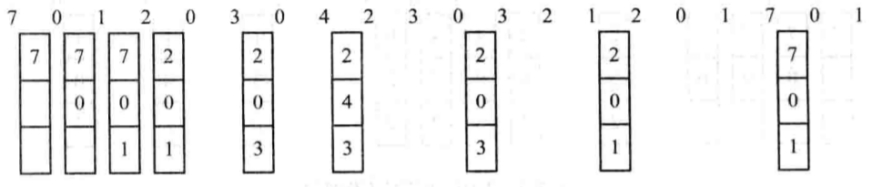
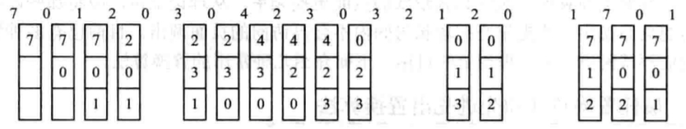
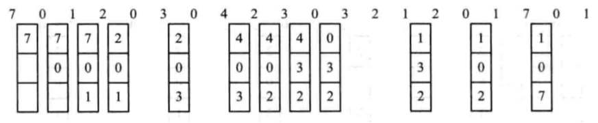
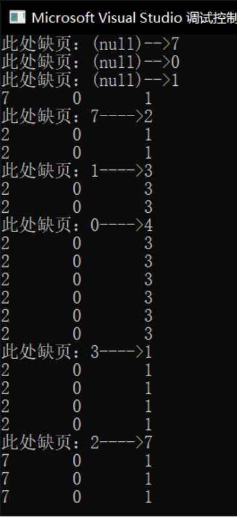
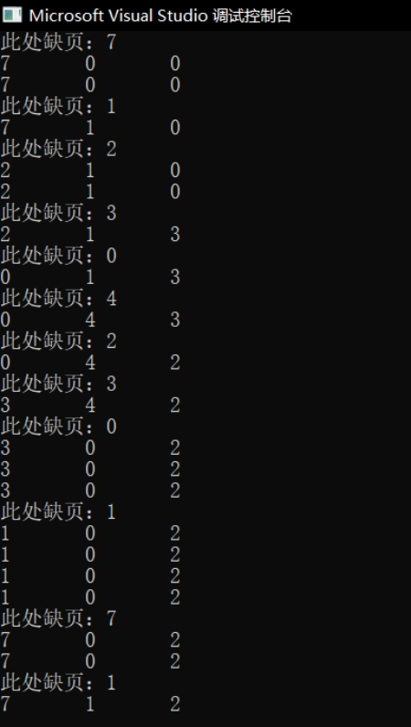
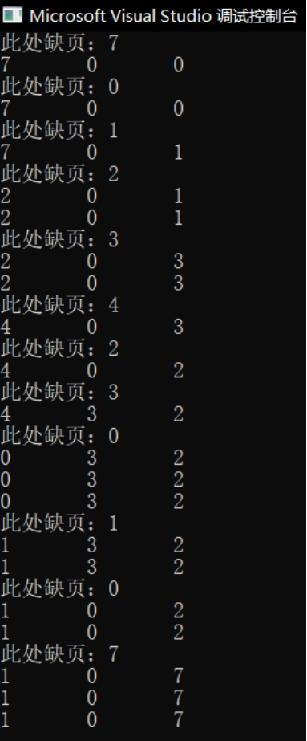

# 实验原理

模拟请求分页虚拟存储器管理技术中的硬件地址变换、缺页中断以及页式淘汰算法，处理缺页中断

采用最佳置换算法实现分页管理的缺页调度；

采用先进先出算法实现分页管理的缺页调度；

采用LRU算法实现分页管理的缺页调度。

## 最佳置换算法（OPT）



## 先进先出置换算法（FIFO）



## LRU算法



# 源程序及运行结果

## OPT

```cpp
#include <iostream>
#include <stdio.h>
#include <stdlib.h>
#define N 20
#define B 3
using namespace std;

int pageArr[N] = { 7,0,1,2,0,3,0,4,2,3,0,3,2,1,2,0,1,7,0,1 };
int block[B] = { 0 };
typedef struct FLAG {
	int flags[B];
	int counts;
} FLAG;

void opt(int pageArr[], int block[]);
int inBlock(int which);
int findFar(int next);
void Replace(int index, int value);
void disPlay();

void opt(int pageArr[], int block[]) {
	int getIndex;
	for (int i = 0; i < N; i++) {
		if (i < 3) {
			block[i] = pageArr[i];
			printf("此处缺页：(null)-->%d\n", pageArr[i]);
		}
		else {
			if (i == 3)
				disPlay();
			if (inBlock(pageArr[i]) != -1) {
				//下一个页面if在物理块中返回index并跳过,反-1
				disPlay();
				continue;
			}
			getIndex = findFar(i + 1);
			if (getIndex == -1) {
				cout << "error,not replace obj!" << '\t';
			}
			else {
				Replace(getIndex, pageArr[i]);
				disPlay();

			}
		}
	}
	return;
}
void Replace(int index, int value) {
	printf("此处缺页：%d---->%d\n", block[index], value);
	block[index] = value;
	return;
}
int findFar(int next) {
	int index = -1;
	FLAG myflag;
	myflag.flags[0] = 0;
	myflag.flags[1] = 0;
	myflag.flags[2] = 0;
	myflag.counts = 0;
	int stop = N - next;
	while (stop--) {
		index = inBlock(pageArr[next++]);
		if (index != -1) {
			myflag.flags[index] = 1;
			myflag.counts++;
		}
		else if (myflag.counts == B - 1) {
			break;
		}
	}
	for (index = 0; index < B; index++) {
		if (myflag.flags[index] == 0)
			break;
	}
	return index;
}
int inBlock(int which) {
	for (int i = 0; i < B; i++) {
		if (block[i] == which)
			return i;
	}
	return -1;
}
void disPlay() {
	int i = 0;
	while (i < B) {
		printf("%d\t", block[i++]);
	}
	printf("\n");
	return;
}
int main() {
	opt(pageArr, block);
	return 0;
}
```



## FIFO

```cpp
#include <iostream>
#include <stdio.h>
#include <stdlib.h>
#define N 20
#define B 3
typedef struct flag {
	int blocks[B];
	int index;
}FLAG;
using namespace std;

int pageArr[N] = { 7,0,1,2,0,3,0,4,2,3,0,3,2,1,2,0,1,7,0,1 };
int block[B] = { 0 };
FLAG bflag = { {0,0,0},-1 };

void disPlay();
int inBlock(int value);
void fifo();
int checkFlag();

void fifo() {
	int i = 0;
	int getIndex;
	int getflag;
	while (i < N) {
		getIndex = inBlock(pageArr[i]);
		if (getIndex == -1) {
			//缺页返回-1，不缺页返回index并下一个
			cout << "此处缺页：" << pageArr[i] << "\n";
			if ((getflag = checkFlag()) != -1) {
				//检查待久的
				block[getflag] = pageArr[i];
			}
			else {
				block[i%B] = pageArr[i];
			}
		}
		else {
			bflag.blocks[getIndex] = 1;
		}
		disPlay();
		i++;
	}
}
int inBlock(int value) {
	int index = -1;
	for (int i = 0; i < B; i++) {
		if (block[i] == value) {
			index = i;
			break;
		}
	}
	return index;
}
void disPlay() {
	for (int i = 0; i < B; i++) {
		cout << block[i] << '\t';
	}
	printf("\n");
}

int checkFlag() {
	int i = 0;
	int index = -1;
	while (i < B) {
		if (bflag.blocks[i] == 1) {
			bflag.blocks[i] = 0;
			index = i;
			break;
		}
		i++;
	}
	return index;
}
int main() {
	fifo();
	return 0;
}
```



## LRU

```cpp
#include <iostream>
#include <stdio.h>
#define N 20
#define B 3
using namespace std;
typedef struct flag {
	int fblock[B];	//记录各个块时间戳
	int pflag;
}FLAG;

int pageArr[N] = { 7,0,1,2,0,3,0,4,2,3,0,3,2,1,2,0,1,7,0,1 };
int block[B] = { 0 };
FLAG myflag = { {0},0 };

void lru();
int inBlock(int value);
void disPlay();
int findMaxTime();
void addStamp();

void lru() {
	int i;
	int getIndex;
	int maxOfIndex;
	for (i = 0; i < N; i++) {
		if (i < B) {//前三个页
			block[i] = pageArr[i];
			myflag.fblock[i] = B - i;
			cout << "此处缺页：" << pageArr[i] << "\n";
		}
		else {
			getIndex = inBlock(pageArr[i]);
			if (getIndex == -1) {//缺页
				maxOfIndex = findMaxTime();
				block[maxOfIndex] = pageArr[i];
				myflag.pflag = maxOfIndex;
				cout << "此处缺页：" << pageArr[i] << "\n";
			}
			else {
				myflag.pflag = getIndex;
			}
			addStamp();
		}
		disPlay();
	}
}
void addStamp() {
	int i = 0;
	while (i < B) {
		if (i != myflag.pflag)
			myflag.fblock[i]++;
		else
			myflag.fblock[i] = 0;
		i++;
	}
}
int inBlock(int value) {
	int index = -1;
	int i = 0;
	while (i < B) {
		if (block[i] == value) {
			index = i;
			break;
		}
		i++;
	}
	return index;
}
void disPlay() {
	for (int i = 0; i < B; i++) {
		printf("%d\t", block[i]);
	}
	printf("\n");
}
int findMaxTime() {
	int i = 0;
	int index = 0;
	for (i = 1; i < B; i++) {
		if (myflag.fblock[index] < myflag.fblock[i])
			index = i;
	}
	return index;
}
int main() {
	lru();
	return 0;
}
```

