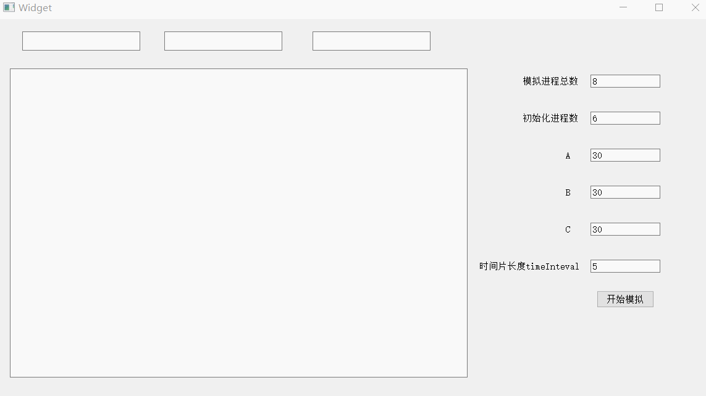
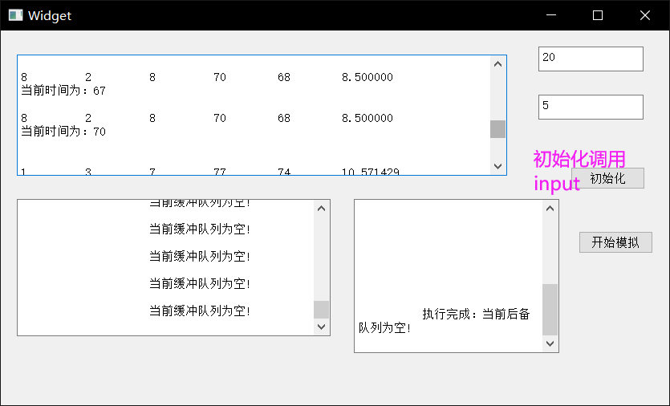

# 进程管理

## 基本源程序

`ProcessManager.h`：

```cpp
#pragma once
//*********************************
//Author: JonnyLong
//Date: 2020/9/15
/*
关键信息输入：
    进程总个数:m
    初始化进程个数:n
    A类资源总数:a
    B类资源总数:b
    C类资源总数:c
    时间片长度:timeInteval
*/
//*********************************
#include <string>
#include <iostream>
#include <random>
using namespace std;
struct PCB {
    int id;			//进程序号
    int ra;			//所需资源 A 的数量
    int rb;			//所需资源 B 的数量
    int rc;			//所需资源 C 的数量
    int ntime;		//所需的时间片个数
    int rtime;		//已经运行的时间片个数
    char state;		//进程状态
    struct PCB *next;
};

class ProcessManager {
public:
    int m;
    int n;
    int a, b, c;
    int timeInteval;
    //-------------------------------
    // h是CPU运行次数
    int h = 0;
    int i = 0;
    //---------------------------------
    //hready，hblock 分别为指向就绪和阻塞队列
    PCB *hready;
    PCB *hblock;
    string outputStr;

    void input(int, int, int, int, int, int);
    PCB *insert(PCB * head, PCB * pcb);
    string disp(PCB *head);
    PCB *running(PCB *head);
    void testblock();
    string testnew();
};
```

`ProcessManager.cpp`：

```cpp
#include "ProcessManager.h"

void ProcessManager::input(int m, int n, int a, int b, int c, int time_Inteval) {
    this->m = m;
    this->n = n;
    this->timeInteval = time_Inteval;
    //必须初始化PCB指针
    for (int i = 1; i <= n; i++) {
        PCB *p = new PCB;
        p->id = i;
        p->ra = rand() % (a / 2);		//随机处理
        p->rb = rand() % (b / 2);
        p->rc = rand() % (c / 2);
        p->ntime = rand() % 25 + 1;
        p->rtime = 0;
        if (((a - (p->ra)) >= 0) && ((b - (p->rb)) >= 0) && ((c - (p->rc)) >= 0)) {
            //a,b,c分别代表当前剩余的资源数
            a = a - (p->ra);
            b = b - (p->rb);
            c = c - (p->rc);
            //将状态变为写(W)
            p->state = 'W';
            //将进程插入就绪队列
            hready = insert(hready, p);
        }
        else {
            //否则插入到阻塞队列
            p->state = 'B';
            hblock = insert(hblock, p);
        }
    }
    this->i = n + 1;
}
//注意这里每一次调用只能加入一块
PCB * ProcessManager::insert(PCB * head, PCB * pcb)
{
    PCB *p1, *p2;
    p1 = head;
    p2 = pcb;
    //cout << "未插入：head:" << head << endl << "p1:" << p1 << endl;
    if (head == NULL) {
        head = p2;
        p2->next = NULL;
    }
    else {
        while (p1->next != NULL) {
            p1 = p1->next;
        }
        p1->next = p2;
        p2->next = NULL;
    }
    //cout << "insert方法中的:" << head->id << endl;
    //cout << "插入后：head:" << head << endl << "p1:" << p1 << endl;
    //cout << "insert函数中返回的head地址:" << head << endl;
    return head;
}
//遍历队列中的信息
string ProcessManager::disp(PCB *head) {
    PCB *p = head;
    string str;
    if (head != NULL) //链表非空
    {
        do
        {
            str += "进程ID 进程状态 A资源数 B资源数 C资源数 需要时间片 已运行时间片\n";
            str += to_string(p->id);
            str += "\t";
            str += (p->state);
            str += "\t";
            str += to_string(p->ra);
            str += "\t";
            str += to_string(p->rb);
            str += "\t";
            str += to_string(p->rc);
            str += "\t";
            str += to_string(p->ntime);
            str += "\t";
            str += to_string(p->rtime);
            str += "\r\n";
            p = p->next;
        } while (p != NULL);
    }
    else
    {
        str += "\t\t\t\t该队列中没有进程！\n";
    }
    return str;
}

PCB * ProcessManager::running(PCB * head) {
    PCB *p1 = head;
    PCB *p2 = p1;
    outputStr = "";
    if (p1 != NULL) {
        p2 = p1;
        p1->state = 'R';	//进程状态由就绪转向运行
        if (p1->ntime - p1->rtime >= timeInteval) {
            p1->rtime += timeInteval;
        }
        else {
            p1->rtime = p1->ntime;
        }
        h += timeInteval;
        outputStr += "~~~~~~~~~~~~~~~~ 当前正在运行的进程ID是： " + to_string(p1->id) + " ~~~~~~~~~~~~~~~~~~\r\n";
        outputStr += "进程ID 进程状态 A资源数 B资源数 C资源数 需要时间片 已运行时间片\n";
        outputStr += "  ";
        outputStr += to_string(p1->id);
        outputStr += "\t";
        outputStr += (p1->state);
        outputStr += "\t";
        outputStr += to_string(p1->ra);
        outputStr += "\t";
        outputStr += to_string(p1->rb);
        outputStr += "\t";
        outputStr += to_string(p1->rc);
        outputStr += "\t";
        outputStr += to_string(p1->ntime);
        outputStr += "\t";
        outputStr += to_string(p1->rtime);
        outputStr += "\t\n";
        p1 = p1->next;
        head = p1;
    }
    //如果已经运行的时间片到达所需次数
    if (p2->ntime == p2->rtime) {
        outputStr += "\n\t\t\t\tID号为：";
        outputStr += to_string(p2->id);
        outputStr += "的进程已经完成！！！\n\n";
        a = a + (p2->ra);
        b = b + (p2->rb);
        c = c + (p2->rc);
        //p2 = NULL;
        delete p2;
    }
    else
    {
        p2->state = 'W';
        head = insert(head, p2);
    }
    return head;
}

void ProcessManager::testblock() {
    PCB *p1, *p2;
    p1 = hblock;
    p2 = hblock;
    string str;
    while ((hblock != NULL) && (p1 != NULL)) {
        //如果满足所有进程资源都有剩余
        if ((a - (p1->ra) >= 0) && (b - (p1->rb) >= 0) && (c - (p1->rc) >= 0)) {
            if (p1 == hblock) {
                hblock = p1->next;
                p1->state = 'W';
                //将阻塞的进程插入就绪队列
                hready = insert(hready, p1);
                a = a - (p1->ra);
                b = b - (p1->rb);
                c = c - (p1->rc);
                str = "\tID号为：";
                str += to_string(p1->id);
                str += "的进程由阻塞队列转入就绪队列！\r\n";
                p1 = hblock;
            }
            else {
                p2->next = p1->next;
                p1->state = 'W';
                hready = insert(hready, p1);
                str = "\tID号为： ";
                str += to_string(p1->id);
                str += "的进程由阻塞队列转入就绪队列！ \r\n";
                p1 = p2->next;
            }
        }
        else {
            p2 = p1;
            p1 = p1->next;
        }
        cout << str;
    }
}

string ProcessManager::testnew() {
    string str;
    //如果随机数小于等于 7，则产生新进程，否则不产生
    PCB * p = new PCB;
    p->id = i++;
    p->ra = (rand() % (a - 3));
    p->rb = (rand() % (b - 3));
    p->rc = (rand() % (c - 3));
    p->ntime = (rand() % 5 + 1);
    //字符串处理
    str = "\n-----------新的进程申请加入-----------\n";
    str += "进程ID:";
    str += to_string(p->id);
    str += "\r\n所需A类资源数：";
    str += to_string(p->ra);
    str += "\r\n所需B类资源数：";
    str += to_string(p->ra);
    str += "\r\n所需C类资源数：";
    str += to_string(p->ra);
    str += "\r\n所需时间片个数：";
    str += to_string(p->ntime);
    str += "\r\n";
    p->rtime = 0;
    p->next = NULL;
    if (((a - (p->ra)) >= 0) && ((b - (p->rb)) >= 0) && ((c - (p->rc)) >= 0)) {
        //进程满足要求，进入就绪队列
        a = a - (p->ra);
        b = b - (p->rb);
        c = c - (p->rc);
        p->state = 'w';
        str += "当前进程状态：";
        str += p->state;
        hready = insert(hready, p);
        str += "\n\t\t\t资源满足新进程需求，该进程进入就绪队列！";
    }
    else {
        //进程不满足要求，进入阻塞队列
        p->state = 'B';
        hblock = insert(hblock, p);
        str += "当前进程状态：";
        str += (p->state);
        str += "\n资源不能满足新进程需求，该进程进入阻塞队列！";
    }
    return str;
}
```

## QT测试

`widget.h`：

```cpp
#ifndef WIDGET_H
#define WIDGET_H

#include <QWidget>

namespace Ui {
class Widget;
}

class Widget : public QWidget
{
    Q_OBJECT

public:
    explicit Widget(QWidget *parent = 0);
    ~Widget();

private slots:
    void on_pushButton_clicked();

private:
    Ui::Widget *ui;
};

#endif // WIDGET_H
```

`widget.cpp`：

```cpp
#include "widget.h"
#include "ui_widget.h"
#include "ProcessManager.h"
#include <QPushButton>
#include <QLineEdit>
#include <QTime>
#include <QFile>
#include <QTextStream>

Widget::Widget(QWidget *parent) :
    QWidget(parent),
    ui(new Ui::Widget)
{
    ui->setupUi(this);
}

Widget::~Widget()
{
    delete ui;
}

void Widget::on_pushButton_clicked()
{
    ui->textBrowser->clear();
    QLineEdit *str1= ui->lineEdit_1;
    QLineEdit *str2= ui->lineEdit_2;
    QLineEdit *str3= ui->lineEdit_3;
    QLineEdit *str4= ui->lineEdit_4;
    QLineEdit *str5= ui->lineEdit_5;
    QLineEdit *str6= ui->lineEdit_6;
    ProcessManager *pro=new ProcessManager();
    int m=(str1->text()).toInt();
    int n=(str2->text()).toInt();
    int a=(str3->text()).toInt();
    int b=(str4->text()).toInt();
    int c=(str5->text()).toInt();
    int timeInteval=(str6->text()).toInt();
    pro->input(m,n,a,b,c,timeInteval);

    string hreadys=pro->disp(pro->hready);
    string hblocks=pro->disp(pro->hblock);
    QString strs1=QString::fromStdString(hreadys);
    ui->textBrowser->append(strs1);
    QString strs2=QString::fromStdString(hblocks);
    ui->textBrowser->append(strs2);

    while (true) {
        pro->hready = pro->running(pro->hready);
        QString qs=QString::fromStdString(pro->outputStr);
        ui->textBrowser->append(qs);

        //注意这里的判断一定要放在running操作后
        if (pro->hready == NULL)
            break;


        //输出A、B、C资源数到小方框内
        ui->textBrowser_2->clear();
        ui->textBrowser_3->clear();
        ui->textBrowser_4->clear();
        int sra=pro->hready->ra;
        int srb=pro->hready->rb;
        int src=pro->hready->rc;
        QString str1=QString::number(sra,10);
        QString str2=QString::number(srb,10);
        QString str3=QString::number(src,10);

        ui->textBrowser_2->append(str1);
        ui->textBrowser_3->append(str2);
        ui->textBrowser_4->append(str3);


        QTime reachtime=QTime::currentTime().addMSecs(1000);
        while(QTime::currentTime()<reachtime){
            QCoreApplication::processEvents(QEventLoop::AllEvents,1000);
        }

    }

    //pro->testblock();
    //将剩余的进程加入到就绪队列中
    while (pro->m != pro->n) {
        QString qs=QString::fromStdString(pro->testnew());
        ui->textBrowser->append(qs);
        pro->n++;
        
        QTime reachtime=QTime::currentTime().addMSecs(2000);
        while(QTime::currentTime()<reachtime){
            QCoreApplication::processEvents(QEventLoop::AllEvents,2000);
        }
        
    }


    //输出为txt
    QFile myfile("mytest.txt");
    if (!myfile.open(QIODevice::WriteOnly | QIODevice::Text))
        return;
    QTextStream out(&myfile);
    out<<ui->textBrowser->toPlainText()<<endl;
}
```




# 作业调度

## 基本源程序

`JobScheduling.h`：

```cpp
#pragma once
//*********************************
//Author: JonnyLong
//Date: 2020/9/15
/*
关键信息输入：
    作业数:jobnum
    时间片长度:timeInteval
*/
//*********************************
#include <string>
#include <iostream>
#include <Windows.h>
#include <random>
using namespace std;
struct JCB {
    int id;				//作业序号
    int reachTime;		//作业到达时间
    int needTime;		//所需的时间片个数
    int finishTime;		//完成时间
    int crylingTime;	//作业周转时间
    double authorizedCrylingTime;		//作业带权周转时间
    char state;			//作业状态
    struct JCB *next;
};
class JobScheduling {
public:
    int jobnum;			//作业数
    int timeInteval;	//时间片长度
    JCB *hready;		//后备队列
    JCB *hinfo;			//输入后的消息队列
    JCB *hrun;			//正在执行中的缓冲区
    int h = 0;
    string outputStr;
    double avgCrylingTime;
    double avgAuthorizedCrylingTime;

    void input(int jobnum, int time_Inteval);
    JCB *insert(JCB *head, JCB *jcb);
    string disp(JCB *head);
    void schedulingInit();
    JCB *FCFS_Sort(JCB *head);
    JCB *SJF_Sort(JCB *head);
    void calc(JCB *head);
    JCB *running(JCB *hrun, JCB *hready);
    string testHrun(JCB *head);
    string testHready(JCB *head);
};
```

`JobScheduling.cpp`：

```cpp
#include "jobscheduling.h"

void JobScheduling::input(int job_num, int time_Inteval) {
    this->jobnum = job_num;
    this->timeInteval = time_Inteval;
    string str;
    for (int i = 1; i <= job_num; i++) {
        //初始化作业信息，直到到达要初始化的作业总个数
        JCB *p = new JCB;
        p->id = i;
        p->reachTime = rand() % 5;
        p->needTime = rand() % 9 + 1; //所需服务时间
        p->finishTime = p->reachTime + p->needTime;	//完成时间
        p->next = NULL;
        hinfo = insert(hinfo, p);
    }
    return;
}

JCB * JobScheduling::insert(JCB * head, JCB * jcb)
{
    JCB *p2, *p1;
    p1 = head;
    p2 = jcb;
    if (head == NULL)
    {
        head = p2;
        p2->next = NULL;
    }
    else
    {
        while (p1->next != NULL) {
            p1 = p1->next;
        }
        p1->next = p2;
        p2->next = NULL;
    }
    return head;
}

string JobScheduling::disp(JCB * head) {
    JCB *p = head;
    string str;
    str += "作业ID 作业到达时间 需要时间\n";
    if (head != NULL) //链表非空
    {
        do
        {
            str += "\t";
            str += to_string(p->id);
            str += "\t";
            str += to_string(p->reachTime);
            str += "\t";
            str += to_string(p->needTime);
            str += "\r\n";
            p = p->next;
        } while (p != NULL);
    }
    else
    {
        str += "\t\t该 队 列 中 没 有 作 业 ！\r\n";
    }
    return str;
}

void JobScheduling::schedulingInit()
{
    //深拷贝结构体到链表hready
    JCB *p1 = hinfo;
    while (p1 != NULL) {
        JCB *p = new JCB();
        (*p) = (*p1);
        hready = insert(hready, p);
        p1 = p1->next;
    }
}

JCB * JobScheduling::FCFS_Sort(JCB *head)
{
    if (head == NULL) {
        return NULL;
    }
    if (head->next == NULL) {
        cout << "min is head";
        return head;
    }
    JCB *min_pre = NULL;
    JCB *min = head;
    JCB *tmp = head;
    JCB *new_list = NULL;
    JCB *tail_sort = NULL;
    while (head) {
        min = head;
        tmp = head;
        while (tmp->next != NULL) {
            if (min->reachTime > tmp->next->reachTime) {
                min = tmp->next;
                min_pre = tmp;
            }
            tmp = tmp->next;
        }
        if (min == head) {
            head = head->next;
        }
        else {
            min_pre->next = min->next;
            min->next = NULL;
        }

        if (new_list == NULL) {
            tail_sort = min;
            new_list = tail_sort;
        }
        else {
            tail_sort->next = min;
            tail_sort = min;
        }
    }
    return new_list;
}

JCB * JobScheduling::SJF_Sort(JCB * head)
{
    if (head == NULL) {
        return NULL;
    }
    if (head->next == NULL) {
        return head;
    }
    JCB *min_pre = NULL;
    JCB *min = head;
    JCB *tmp = head;
    JCB *new_list = NULL;
    JCB *tail_sort = NULL;
    while (head) {
        min = head;
        tmp = head;
        while (tmp->next != NULL) {
            if (min->needTime > tmp->next->needTime) {
                min = tmp->next;
                min_pre = tmp;
            }
            tmp = tmp->next;
        }
        if (min == head) {
            head = head->next;
        }
        else {
            min_pre->next = min->next;
            min->next = NULL;
        }

        if (new_list == NULL) {
            tail_sort = min;
            new_list = tail_sort;
        }
        else {
            tail_sort->next = min;
            tail_sort = min;
        }
    }
    return new_list;
}

void JobScheduling::calc(JCB *head)
{
    JCB *p1, *p2, *pc;
    p1 = head;
    p2 = head->next;
    int n=0;
    avgCrylingTime=0;
    avgAuthorizedCrylingTime=0;
    //string str;
    //计算完成时间
    p1->finishTime = head->reachTime + head->needTime;
    while (p2 != NULL) {
        p2->finishTime = p1->finishTime + p2->needTime;
        p1 = p2;
        p2 = p2->next;
    }
    pc = head;
    while (pc != NULL) {
        pc->crylingTime = pc->finishTime - pc->reachTime;
        pc->authorizedCrylingTime = pc->crylingTime / (pc->needTime*1.0);
        avgCrylingTime=avgCrylingTime+pc->crylingTime;
        avgAuthorizedCrylingTime=avgAuthorizedCrylingTime+pc->authorizedCrylingTime;
        n++;
        pc = pc->next;
    }
    avgCrylingTime=avgCrylingTime/(n*1.0);
    avgAuthorizedCrylingTime=avgAuthorizedCrylingTime/(n*1.0);
}

JCB * JobScheduling::running(JCB * hrun, JCB * hready)
{
    outputStr = "";
    JCB *p1 = hready;
    if (p1 != NULL) {
        hready = p1->next;
        hrun = insert(hrun, p1);
        while ((hrun->finishTime - h) != 0) {
            if (hrun->finishTime - h >= timeInteval) {
                h += timeInteval;
            }
            else {
                h = hrun->finishTime;
            }
            outputStr += "\n";
            outputStr += to_string(hrun->id);
            outputStr += "\t";
            outputStr += to_string(hrun->reachTime);
            outputStr += "\t";
            outputStr += to_string(hrun->needTime);
            outputStr += "\t";
            outputStr += to_string(hrun->finishTime);
            outputStr += "\t";
            outputStr += to_string(hrun->crylingTime);
            outputStr += "\t";
            outputStr += to_string(hrun->authorizedCrylingTime);
            outputStr += "\t\n";
            outputStr += "当前时间为：";
            outputStr += to_string(h);
            outputStr += "\n";
        }
        hrun = NULL;
    }
    return hready;
}

string JobScheduling::testHrun(JCB * head)
{
    string str;
    if (hrun == NULL) {
        str += "\t\t当前缓冲队列为空!\n";
    }
    else {
        str += "\t\t正在执行缓冲队列中的作业!\n";
    }
    return str;
}

string JobScheduling::testHready(JCB * head)
{
    string str;
    if (hready == NULL)
        str += "\t执行完成：当前后备队列为空!\n";
    return str;
}
```

## QT测试

`widget.cpp`：

```cpp
#include "widget.h"
#include "ui_widget.h"
#include "jobscheduling.h"
#include <QPushButton>
#include <QTime>
#include <QApplication>

Widget::Widget(QWidget *parent) :
    QWidget(parent),
    ui(new Ui::Widget)
{
    ui->setupUi(this);
    QPushButton * startBtn=ui->pushButton_1;
    connect(startBtn,SIGNAL(clicked()),this,SLOT(on_pushButton_1_clicked()));
}

Widget::~Widget()
{
    delete ui;
}


void Widget::on_pushButton_1_clicked()
{
    ui->textBrowser->clear();
    QTextEdit *str1= ui->textEdit_1;
    QTextEdit *str2= ui->textEdit_2;
    JobScheduling *job = new JobScheduling();
    int job_num=(str1->toPlainText()).toInt();
    int time_Inteval=(str2->toPlainText()).toInt();
    job->input(job_num,time_Inteval);

    job->schedulingInit();
    job->hready = job->FCFS_Sort(job->hready);
    string s1 = job->disp(job->hinfo);
    QString strs=QString::fromStdString(s1);
    ui->textBrowser->append(strs);

    job->calc(job->hready);
    while (true){
        if (job->hready == NULL)
            break;
        job->hready=job->running(job->hrun, job->hready);
        QString qs=QString::fromStdString(job->outputStr);
        ui->textBrowser->append(qs);

        //这里的qs1和qs2可以分别打到另外两块不同的textBrowser上
        QString qs1=QString::fromStdString(job->testHrun(job->hrun));
        QString qs2=QString::fromStdString(job->testHready(job->hready));
        ui->textBrowser_2->append(qs1);
        ui->textBrowser_3->append(qs2);
        /*
        //时间等待操作，默认是1s
        QTime reachtime=QTime::currentTime().addMSecs(1000);
        while(QTime::currentTime()<reachtime){
            QCoreApplication::processEvents(QEventLoop::AllEvents,1000);
        }
        */
    }
    QString qs=QString::fromStdString(job->testHready(job->hready));
    ui->textBrowser->append(qs);

    //平均
    QString qs2=QString::number(job->avgCrylingTime);
    ui->textBrowser->append(qs2);
    QString qs3=QString::number(job->avgAuthorizedCrylingTime);
    ui->textBrowser->append(qs3);
}
```



