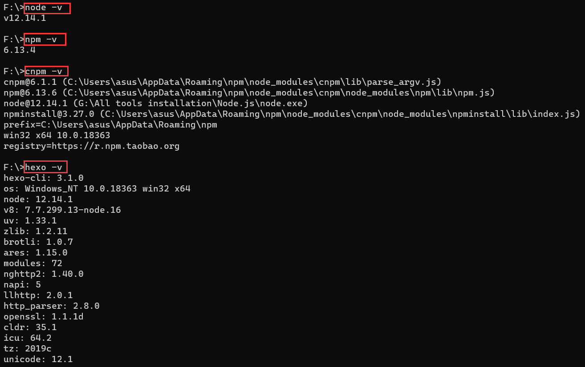
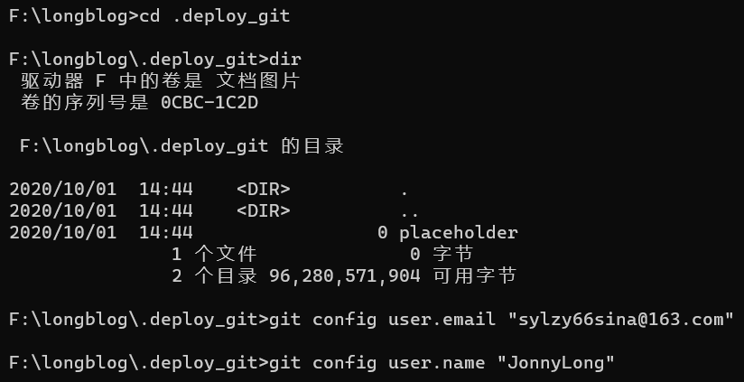
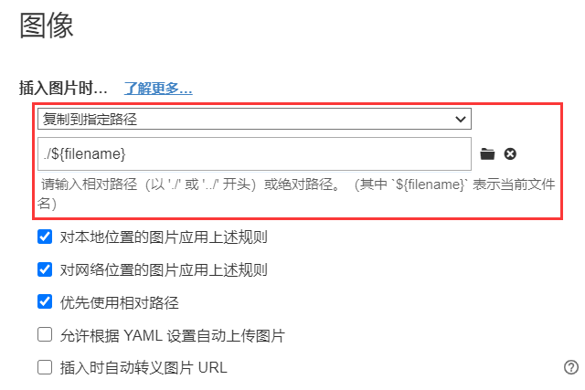

# 相关安装

+ `node.js`
+ `npm`
+ `hexo`

1.`node -v`：查看`node`版本

2.`npm -v`：查看`npm`版本

3.`npm install -g cnpm --registry=http://registry.npm.taobao.org`：安装淘宝的`cnpm`管理器

4.`cnpm -v`：查看`cnpm`版本

5.`cnpm install -g hexo-cli`：安装`hexo`框架

6.`hexo -v`：查看`hexo`版本

安装完成后查看是否成功



# 初始化博客

1.`hexo init`

2.`hexo s`：启动本地服务，打开`http://localhost:4000`，查看是否生成成功

3.`cnpm install --save hexo-deployer-git`：在博客目录下安装git部署

4.创建远端仓库，并在本地的`_config.yml`文件中加入以下配置

```yaml
# Deployment
## Docs: https://hexo.io/docs/deployment.html
deploy:
  type: 'git'
  repo: 'https://gitee.com/jonnylong/JonnyLong.git'
```

5.`hexo cl`：清空缓存的配置和生成的相关文件

`hexo s`：启动本地服务

`hexo d`：推送到远端

6.推送到远端过程中可能会让你设置git

```bash
git config --global user.email "you@example.com"
git config --global user.name "Your Name"
```

那么这时候应该进入到`.deploy_git`目录下，执行语句



# 修改根目录下的`_config.yml`文件

1.Site

```yaml
# Site
title: LongBlog
subtitle: ''
description: 'Long的博客，欢迎访问'
keywords:
author: Jonny Long
language: en
timezone: ''
```

2.URL

```yaml
# URL
## If your site is put in a subdirectory, set url as 'http://yoursite.com/child' and root as '/child/'
url: http://jonnylong.github.io
root: /
permalink: :year/:month/:day/:title/
permalink_defaults:
pretty_urls:
  trailing_index: true # Set to false to remove trailing 'index.html' from permalinks
  trailing_html: true # Set to false to remove trailing '.html' from permalinks
```

3.theme

```bash
# Extensions
## Plugins: https://hexo.io/plugins/
## Themes: https://hexo.io/themes/
theme: fluid
```

整体如下：

```yaml
# Hexo Configuration
## Docs: https://hexo.io/docs/configuration.html
## Source: https://github.com/hexojs/hexo/

# Site
title: Hexo
subtitle: ''
description: ''
keywords:
author: John Doe
language: en
timezone: ''

# URL
## If your site is put in a subdirectory, set url as 'http://example.com/child' and root as '/child/'
url: http://example.com
root: /
permalink: :year/:month/:day/:title/
permalink_defaults:
pretty_urls:
  trailing_index: true # Set to false to remove trailing 'index.html' from permalinks
  trailing_html: true # Set to false to remove trailing '.html' from permalinks

# Directory
source_dir: source
public_dir: public
tag_dir: tags
archive_dir: archives
category_dir: categories
code_dir: downloads/code
i18n_dir: :lang
skip_render:

# Writing
new_post_name: :title.md # File name of new posts
default_layout: post
titlecase: false # Transform title into titlecase
external_link:
  enable: true # Open external links in new tab
  field: site # Apply to the whole site
  exclude: ''
filename_case: 0
render_drafts: false
post_asset_folder: true
relative_link: false
future: true
highlight:
  enable: true
  line_number: true
  auto_detect: false
  tab_replace: ''
  wrap: true
  hljs: false
prismjs:
  enable: false
  preprocess: true
  line_number: true
  tab_replace: ''

# Home page setting
# path: Root path for your blogs index page. (default = '')
# per_page: Posts displayed per page. (0 = disable pagination)
# order_by: Posts order. (Order by date descending by default)
index_generator:
  path: ''
  per_page: 10
  order_by: -date

# Category & Tag
default_category: uncategorized
category_map:
tag_map:

# Metadata elements
## https://developer.mozilla.org/en-US/docs/Web/HTML/Element/meta
meta_generator: true

# Date / Time format
## Hexo uses Moment.js to parse and display date
## You can customize the date format as defined in
## http://momentjs.com/docs/#/displaying/format/
date_format: YYYY-MM-DD
time_format: HH:mm:ss
## updated_option supports 'mtime', 'date', 'empty'
updated_option: 'mtime'

# Pagination
## Set per_page to 0 to disable pagination
per_page: 10
pagination_dir: page

# Include / Exclude file(s)
## include:/exclude: options only apply to the 'source/' folder
include:
exclude:
ignore:

# Extensions
## Plugins: https://hexo.io/plugins/
## Themes: https://hexo.io/themes/
theme: fluid

# Deployment
## Docs: https://hexo.io/docs/deployment.html
deploy:
  type: 'git'
  repo: 'https://gitee.com/jonnylong/JonnyLong.git'
```

# 修改主题目录下的`_config.yml`文件

这个按照官方给的文档修改即可：https://hexo.fluid-dev.com/docs/guide/

这是我自己加上的友情链接：

```yaml
#---------------------------
# 友链页
# Links Page
#---------------------------
links:
  banner_img: /img/214-3.png
  banner_img_height: 100  # available: 0 - 100
  banner_mask_alpha: 0.3  # available: 0 - 1.0
  subtitle:  # 打字机内容
  items:  # intro 与 image 可省略
    - {
      title: 'CSDN',
      intro: '作者的第三方博客',
      link: 'https://blog.csdn.net/qq_14813265',
      image: '/img/CSDN.png'
    }
    - {
      title: '语雀',
      intro: '作者的一些笔记',
      link: 'https://www.yuque.com/jonnylong',
      image: '/img/语雀.png'
    }
    - {
      title: '墙裂',
      intro: 'V-VPN，配合Clash使用',
      link: 'https://cn.joysaid.com/',
      image: '/img/墙裂.png'
    }
    - {
      title: 'AirPortal',
      intro: '小文件传输',
      link: 'https://airportal.cn/',
      image: '/img/AirPortal.png'
    }
    - {
      title: 'LaTex编辑器',
      intro: 'LaTex的数学公式',
      link: 'https://www.latexlive.com/',
      image: '/img/letex.png'
    }
    - {
      title: 'Leetcode',
      intro: 'Leetcode中国站，刷题专用',
      link: 'https://leetcode-cn.com/u/fang-cao-qi-qi-ying-wu-zhou/',
      image: '/img/leetcode.png'
    }
    - {
      title: 'Fluid Repo',
      intro: '主题 GitHub 仓库',
      link: 'https://github.com/fluid-dev/hexo-theme-fluid',
      image: '/img/favicon.png'
    }
```

# 图片加载

1.把主页配置文件`_config.yml` 里的`post_asset_folder:`这个选项设置为`true`

2.安装一个图片路径转换的插件，这个插件名字是`hexo-asset-image`

```bash
npm install https://github.com/CodeFalling/hexo-asset-image --save
```

但是这个插件的内容需要修改【不然可能会出Bug】

打开`/node_modules/hexo-asset-image/index.js`，将内容更换为下面的代码：

```js
'use strict';
var cheerio = require('cheerio');

// http://stackoverflow.com/questions/14480345/how-to-get-the-nth-occurrence-in-a-string
function getPosition(str, m, i) {
  return str.split(m, i).join(m).length;
}

var version = String(hexo.version).split('.');
hexo.extend.filter.register('after_post_render', function(data){
  var config = hexo.config;
  if(config.post_asset_folder){
    	var link = data.permalink;
	if(version.length > 0 && Number(version[0]) == 3)
	   var beginPos = getPosition(link, '/', 1) + 1;
	else
	   var beginPos = getPosition(link, '/', 3) + 1;
	// In hexo 3.1.1, the permalink of "about" page is like ".../about/index.html".
	var endPos = link.lastIndexOf('/') + 1;
    link = link.substring(beginPos, endPos);

    var toprocess = ['excerpt', 'more', 'content'];
    for(var i = 0; i < toprocess.length; i++){
      var key = toprocess[i];
 
      var $ = cheerio.load(data[key], {
        ignoreWhitespace: false,
        xmlMode: false,
        lowerCaseTags: false,
        decodeEntities: false
      });

      $('img').each(function(){
		if ($(this).attr('src')){
			// For windows style path, we replace '\' to '/'.
			var src = $(this).attr('src').replace('\\', '/');
			if(!/http[s]*.*|\/\/.*/.test(src) &&
			   !/^\s*\//.test(src)) {
			  // For "about" page, the first part of "src" can't be removed.
			  // In addition, to support multi-level local directory.
			  var linkArray = link.split('/').filter(function(elem){
				return elem != '';
			  });
			  var srcArray = src.split('/').filter(function(elem){
				return elem != '' && elem != '.';
			  });
			  if(srcArray.length > 1)
				srcArray.shift();
			  src = srcArray.join('/');
			  $(this).attr('src', config.root + link + src);
			  console.info&&console.info("update link as:-->"+config.root + link + src);
			}
		}else{
			console.info&&console.info("no src attr, skipped...");
			console.info&&console.info($(this));
		}
      });
      data[key] = $.html();
    }
  }
});
```

3.设置Typora下的图像路径，这样每次插入图片时候，就会自动创建一个与该文件名相同的文件夹，用于存放图片：





这里这样做的目的是为了和`hexo-asset-image`插件寻找的路径相匹配，否则无法加载图片。不要使用绝对路径！

