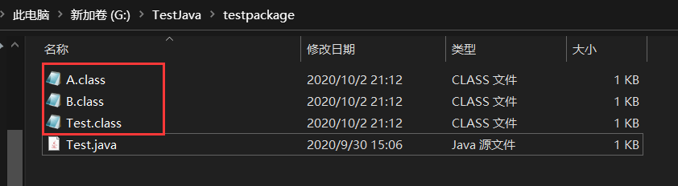
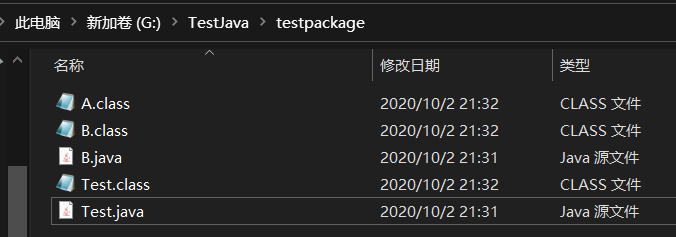

# 配置环境变量

!> 要使用这些工具，必须先进行工具的配置，否则输入命令后没有反应

`JAVA_HOME`：`G:\All tools installation\JDK8`

`Path`：`%JAVA_HOME%\bin;%JAVA_HOME%\lib`

# Javac和Java

Javac命令是用来编译类的，Java命令是用来执行编译好的类的

## 编译包下文件

例如：

```java
package testpackage;

/**
 * @author Jonny Long
 * @date 2020/9/30 14:29
 */
class A {
    int m;

    int getM() {
        return m;
    }

    int seeM() {
        return m;
    }
}

class B extends A {
    int m=200;

    int getM() {
        return m + 10;
    }
}

public class Test {
    public static void main(String[] args) {
        B b = new B();
        b.m = 20;
        System.out.println(b.getM());
        A a = b;
        a.m = -100;
        System.out.println(a.getM());
        System.out.println(b.seeM());
    }
}
```

试着编译以上程序：

```bash
G:\TestJava>javac testpackage/Test.java

G:\TestJava>java testpackage.Test
30
30
-100
```

得到三个`.class`文件：



## 编译多个文件

`B.java`下：

```java
package testpackage;

/**
 * @author Jonny Long
 * @date 2020/9/30 14:29
 */
class A {
    int m;

    int getM() {
        return m;
    }

    int seeM() {
        return m;
    }
}

public class B extends A {
    int m=200;

    int getM() {
        return m + 10;
    }
}
```

`Test.java`下：

```java
package testpackage;

public class Test {
    public static void main(String[] args) {
        B b = new B();
        b.m = 20;
        System.out.println(b.getM());
        A a = b;
        a.m = -100;
        System.out.println(a.getM());
        System.out.println(b.seeM());
    }
}
```

试着编译以上程序：

```bash
G:\TestJava>javac testpackage/*.java

G:\TestJava>java testpackage.B
错误: 在类 testpackage.B 中找不到 main 方法, 请将 main 方法定义为:
   public static void main(String[] args)
否则 JavaFX 应用程序类必须扩展javafx.application.Application

G:\TestJava>java testpackage.Test
30
30
-100
```



# Jar

用法: `jar {ctxui}[vfmn0PMe] [jar-file] [manifest-file] [entry-point] [-C dir] files ...`

选项:

+ -c  创建新档案
+ -t  列出档案目录
+ -x  从档案中提取指定的 (或所有) 文件
+ -u  更新现有档案
+ -v  在标准输出中生成详细输出
+ -f  指定档案文件名
+ -m  包含指定清单文件中的清单信息
+ -n  创建新档案后执行 Pack200 规范化
+ -e  为捆绑到可执行 jar 文件的独立应用程序指定应用程序入口点
+ -0  仅存储; 不使用任何 ZIP 压缩
+ -P  保留文件名中的前导 '/' (绝对路径) 和 ".." (父目录) 组件
+ -M  不创建条目的清单文件
+ -i  为指定的 jar 文件生成索引信息
+ -C  更改为指定的目录并包含以下文件

如果任何文件为目录, 则对其进行递归处理。

清单文件名, 档案文件名和入口点名称的指定顺序与 'm', 'f' 和 'e' 标记的指定顺序相同。

示例 1: 将两个类文件归档到一个名为 `classes.jar` 的档案中:

```bash
jar cvf classes.jar Foo.class Bar.class
```

示例 2: 使用现有的清单文件 `mymanifest` 并将 foo/ 目录中的所有文件归档到 `classes.jar` 中:

```bash
jar cvfm classes.jar mymanifest -C foo/ .
```


