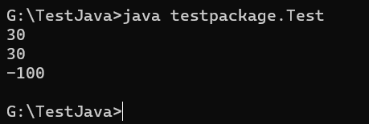
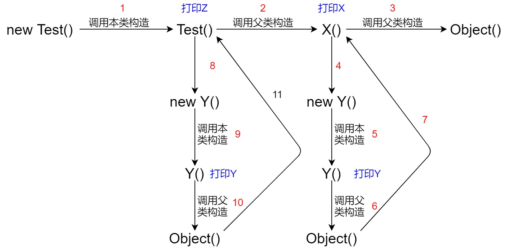

# 一、作业

```java
/**
 * @author Jonny Long
 * @date 2020/9/30 14:29
 */
class A {
    int m;

    int getM() {
        return m;
    }

    int seeM() {
        return m;
    }
}

class B extends A {
    int m;

    int getM() {
        return m + 10;
    }
}

public class Test {
    public static void main(String[] args) {
        B b = new B();
        b.m = 20;
        System.out.println(b.getM());
        A a = b;
        //上转型对象访问的是被隐藏的m
        a.m = -100;
        //调用子类重写的getM()方法
        System.out.println(a.getM());
        //子类继承的seeM()方法操作的m是被子类隐藏的m
        System.out.println(b.seeM());
    }
}
```

Output:



---

> 现学现卖，以下分析不一定完全正确

# 二、思考题

## 源程序

```java
/**
 * @author Jonny Long
 * @date 2020/10/03 19:29
 */
class X {
    Y b = new Y();

    X() {
        System.out.println("X");
    }
}

class Y {
    Y() {
        System.out.println("Y");
    }
}

public class Test extends X {
    Y y = new Y();

    Test() {
        System.out.println("Z");
    }

    public static void main(String[] args) {
        new Test();
    }
}

```

## 反编译

```bash
G:\TestJava\testpackage>javap -c *.class
Compiled from "Test.java"
public class Test extends X {
  Y y;

  Test();
    Code:
       0: aload_0
       1: invokespecial #1                  // Method X."<init>":()V
       4: aload_0
       5: new           #2                  // class Y
       8: dup
       9: invokespecial #3                  // Method Y."<init>":()V
      12: putfield      #4                  // Field y:LY;
      15: getstatic     #5                  // Field java/lang/System.out:Ljava/io/PrintStream;
      18: ldc           #6                  // String Z
      20: invokevirtual #7                  // Method java/io/PrintStream.println:(Ljava/lang/String;)V
      23: return

  public static void main(java.lang.String[]);
    Code:
       0: new           #8                  // class Test
       3: dup
       4: invokespecial #9                  // Method "<init>":()V
       7: pop
       8: return
}
Compiled from "Test.java"
class X {
  Y b;

  X();
    Code:
       0: aload_0
       1: invokespecial #1                  // Method java/lang/Object."<init>":()V
       4: aload_0
       5: new           #2                  // class Y
       8: dup
       9: invokespecial #3                  // Method Y."<init>":()V
      12: putfield      #4                  // Field b:LY;
      15: getstatic     #5                  // Field java/lang/System.out:Ljava/io/PrintStream;
      18: ldc           #6                  // String X
      20: invokevirtual #7                  // Method java/io/PrintStream.println:(Ljava/lang/String;)V
      23: return
}
Compiled from "Test.java"
class Y {
  Y();
    Code:
       0: aload_0
       1: invokespecial #1                  // Method java/lang/Object."<init>":()V
       4: getstatic     #2                  // Field java/lang/System.out:Ljava/io/PrintStream;
       7: ldc           #3                  // String Y
       9: invokevirtual #4                  // Method java/io/PrintStream.println:(Ljava/lang/String;)V
      12: return
}
```

## HotSpot字节码指令

解释下相关虚拟机字节码指令：

| 指令            | 含义                                                 |
| --------------- | ---------------------------------------------------- |
| `aload_0`       | 将第一个引用类型本地变量推送至栈顶                   |
| `astore_0`      | 将栈顶引用型数值存入第一个本地变量                   |
| `invokespecial` | 调用构造方法，实例初始化方法                         |
| `new`           | 创建类实例                                           |
| `dup`           | 复制栈顶数值并将复制值压入栈顶                       |
| `putfield`      | 为指定类的实例域赋值                                 |
| `getstatic`     | 获取类的静态域，并将其值压入栈顶                     |
| `idc`           | 将int, float或String型常量值从**常量池**中推送至栈顶 |
| `invokevirtual` | 调用实例方法                                         |

> 参考文章：https://www.cnblogs.com/kexianting/p/8523296.html

## 逐步分析

```bash
Compiled from "Test.java"
public class Test extends X {
  Y y;

  Test();
    Code:
       0: aload_0
       1: invokespecial #1                  // Method X."<init>":()V
       4: aload_0
       5: new           #2                  // class Y
       8: dup
       9: invokespecial #3                  // Method Y."<init>":()V
      12: putfield      #4                  // Field y:LY;
      15: getstatic     #5                  // Field java/lang/System.out:Ljava/io/PrintStream;
      18: ldc           #6                  // String Z
      20: invokevirtual #7                  // Method java/io/PrintStream.println:(Ljava/lang/String;)V
      23: return

  public static void main(java.lang.String[]);
    Code:
       0: new           #8                  // class Test
       3: dup
       4: invokespecial #9                  // Method "<init>":()V
       7: pop
       8: return
}
```

先看构造方法Test()：

```bash
0: aload_0
1: invokespecial #1                  // Method X."<init>":()V
4: aload_0
5: new           #2                  // class Y
8: dup
9: invokespecial #3                  // Method Y."<init>":()V
12: putfield     #4                  // Field y:LY;
```

> `#{num}`表示选用的常量池中的序号

发现在构造方法`Test()`中在没有创建对象前又调用了其他的构造方法，根据继承关系，首先调用的是构造方法`X()`，在new完对象后，又调用了构造方法`Y()`，最后`putfield`实现对对象Y实例域赋值，即`Y y = new Y();`

以下代码意思是调用IO，打印栈顶元素：

```bash
15: getstatic     #5                  // Field java/lang/System.out:Ljava/io/PrintStream;
18: ldc           #6                  // String Z
20: invokevirtual #7                  // Method java/io/PrintStream.println:(Ljava/lang/String;)V
23: return
```

即对应`Test.java`文件中的`System.out.println("Z");`

---

```bash
Compiled from "Test.java"
class X {
  Y b;

  X();
    Code:
       0: aload_0
       1: invokespecial #1                  // Method java/lang/Object."<init>":()V
       4: aload_0
       5: new           #2                  // class Y
       8: dup
       9: invokespecial #3                  // Method Y."<init>":()V
      12: putfield      #4                  // Field b:LY;
      15: getstatic     #5                  // Field java/lang/System.out:Ljava/io/PrintStream;
      18: ldc           #6                  // String X
      20: invokevirtual #7                  // Method java/io/PrintStream.println:(Ljava/lang/String;)V
      23: return
}
```

在构造方法`X()`中，发现又调用了两次构造函数，分别是谁呢？

先调用是`Object`类的构造方法，紧接着new完对象后调用了`Y()`的构造方法，最后`putfield`实现对对象Y实例域赋值，即`Y b = new Y();`，然后打印输出`System.out.println("X");`

---

```bash
Compiled from "Test.java"
class Y {
  Y();
    Code:
       0: aload_0
       1: invokespecial #1                  // Method java/lang/Object."<init>":()V
       4: getstatic     #2                  // Field java/lang/System.out:Ljava/io/PrintStream;
       7: ldc           #3                  // String Y
       9: invokevirtual #4                  // Method java/io/PrintStream.println:(Ljava/lang/String;)V
      12: return
}
```

Y的构造方法最好分析，调用了`Object`类的构造方法，然后打印输出`System.out.println("Y");`

> 在Java中，要想创建一个对象，必须调用这个该类的构造方法，并在这个构造方法中调用父类的构造方法，直到父类是`Object`时才会停止



由上图打印顺序显而易见，顺序是`Y X Y Z`

同时能看到Java代码的运行顺序：

1.静态块

2.父类构造器

3.本类中的块

4.本类的构造器

Java代码的编译顺序：

1.静态块

2.块

3.构造器

4.父类构造器

> 注：静态块只编译一次

# 三、作业的一些分析

> 以下将用同样的方式对向上转型进行分析

同样的先反编译：
```bash
G:\TestJava\testpackage>javap -c *.class
Compiled from "Test.java"
class A {
  int m;

  A();
    Code:
       0: aload_0
       1: invokespecial #1                  // Method java/lang/Object."<init>":()V
       4: return

  int getM();
    Code:
       0: aload_0
       1: getfield      #2                  // Field m:I
       4: ireturn

  int seeM();
    Code:
       0: aload_0
       1: getfield      #2                  // Field m:I
       4: ireturn
}
Compiled from "Test.java"
class B extends A {
  int m;

  B();
    Code:
       0: aload_0
       1: invokespecial #1                  // Method A."<init>":()V
       4: return

  int getM();
    Code:
       0: aload_0
       1: getfield      #2                  // Field m:I
       4: bipush        10
       6: iadd
       7: ireturn
}
Compiled from "Test.java"
public class Test {
  public Test();
    Code:
       0: aload_0
       1: invokespecial #1                  // Method java/lang/Object."<init>":()V
       4: return

  public static void main(java.lang.String[]);
    Code:
       0: new           #2                  // class B
       3: dup
       4: invokespecial #3                  // Method B."<init>":()V
       7: astore_1
       8: aload_1
       9: bipush        20
      11: putfield      #4                  // Field B.m:I
      14: getstatic     #5                  // Field java/lang/System.out:Ljava/io/PrintStream;
      17: aload_1
      18: invokevirtual #6                  // Method B.getM:()I
      21: invokevirtual #7                  // Method java/io/PrintStream.println:(I)V
      24: aload_1
      25: astore_2
      26: aload_2
      27: bipush        -100
      29: putfield      #8                  // Field A.m:I
      32: getstatic     #5                  // Field java/lang/System.out:Ljava/io/PrintStream;
      35: aload_2
      36: invokevirtual #9                  // Method A.getM:()I
      39: invokevirtual #7                  // Method java/io/PrintStream.println:(I)V
      42: getstatic     #5                  // Field java/lang/System.out:Ljava/io/PrintStream;
      45: aload_1
      46: invokevirtual #10                 // Method B.seeM:()I
      49: invokevirtual #7                  // Method java/io/PrintStream.println:(I)V
      52: return
}
```

主要是main方法中吧：

```java
B b = new B();
```

```bash
0: new           #2                  // class B
3: dup
4: invokespecial #3                  // Method B."<init>":()V
7: astore_1
```
```java
b.m = 20;
```
```bash
8: aload_1
9: bipush        20
11: putfield      #4                  // Field B.m:I
```

```java
System.out.println(b.getM());
```

```bash
14: getstatic     #5                  // Field java/lang/System.out:Ljava/io/PrintStream;
17: aload_1
18: invokevirtual #6                  // Method B.getM:()I
21: invokevirtual #7                  // Method java/io/PrintStream.println:(I)V
```

```java
A a = b;
```

```bash
24: aload_1
25: astore_2
```

```java
a.m=-100
```

```bash
26: aload_2
27: bipush        -100
29: putfield      #8                  // Field A.m:I
```

```java
System.out.println(a.getM());
```

```bash
32: getstatic     #5                  // Field java/lang/System.out:Ljava/io/PrintStream;
35: aload_2
36: invokevirtual #9                  // Method A.getM:()I
39: invokevirtual #7                  // Method java/io/PrintStream.println:(I)V
```

```java
System.out.println(b.seeM());
```

```bash
42: getstatic     #5                  // Field java/lang/System.out:Ljava/io/PrintStream;
45: aload_1
46: invokevirtual #10                 // Method B.seeM:()I
49: invokevirtual #7                  // Method java/io/PrintStream.println:(I)V
```

b被标为第二个引用类型本地变量（`astore_1`），a被标为第三个引用类型本地变量（`astore_2`），`A a = b;`就是把本地变量2推送到栈顶，之后从栈顶取出到本地变量3。

b是在B的实例域下的，a是在A的实例域下的因此可得：

`a.getM()`是对本地变量3操作了A实例域下的`getM()`方法，而A实例域下的m为20，故经过该方法后的函数返回值为30

`b.seeM()`是对本地变量2操作了B实例域下的`seeM()`方法，而B继承A，根据编译结果看出此时应该调用A的`seeM()`，而A实例域下的m为-100，因此打印出的`b.seeM()`值是-100

一个形象的比喻就是爸爸会两门手艺，分别为`getM()`和`seeM()`，儿子只学会了`getM()`，并且把这么手艺升级改造了。现在儿子要干活，通过手艺`getM()`成功制作了成品m，但是想要用`seeM()`却发现不会，只能去找爸爸，爸爸就根据自己是手艺`seeM()`制作的成品m，前后两个m虽然名称相同，却是两个完全不同的东西

