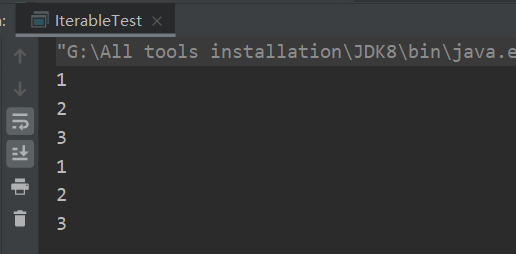

# Iterable

JDK描述：实现此接口允许对象成为“ for-each循环”语句的目标。

那么什么是“ for-each循环”：“ for-each循环”是Java提供的语法糖，实际上还是通过迭代器Iterator迭代遍历，如下例子：

```java
public static void main(String[] args) {
    List<Integer> list = new ArrayList<>(Arrays.asList(1, 2, 3));
    for (Integer i : list) {
        System.out.println(i);
    }
}
```

编译后的.class文件如下：

```java
public static void main(String[] args) {
    List<Integer> list = new ArrayList(Arrays.asList(1, 2, 3));
    Iterator var2 = list.iterator();

    while(var2.hasNext()) {
        Integer i = (Integer)var2.next();
        System.out.println(i);
    }

}
```

通过上面例子我们明白了“ for-each循环”的本质。言归正传，接下来看`Iterable`源码：

```java
public interface Iterable<T> {
    Iterator<T> iterator();
    default void forEach(Consumer<? super T> action) {
        Objects.requireNonNull(action);
        for (T t : this) {
            action.accept(t);
        }
    }
    default Spliterator<T> spliterator() {
        return Spliterators.spliteratorUnknownSize(iterator(), 0);
    }
}
```

`Iterable`中定义了三个函数，其中后面两个是1.8新加的，具体分析一下这三个函数：

- `iterator()`返回迭代器实例，通过这个实例来实现对元素的遍历。
- `forEach`对`Iterable`的每个元素执行给定的操作，具体指定的操作需要自己写Consumer接口通过accept方法回调出来。很简单，我们看一下例子就明白了。

```java
public static void main(String[] args) {
    List<Integer> list = new ArrayList<>(Arrays.asList(1, 2, 3));
    list.forEach(integer -> System.out.println(integer));
}
```

或者写的更明白一些

```java
public static void main(String[] args) {
        List<Integer> list = new ArrayList<>(Arrays.asList(1, 2, 3));
        list.forEach(new Consumer<Integer>() {
            @Override
            public void accept(Integer integer) {
                System.out.println(integer);
            }
        });
    }
123456789
```

输出结果为：



- `spliterator()`通过一个顺序遍历的Iterator对象获取一个并行遍历的`Spliterator`对象；

关于`Spliterator：Spliterator`（`splitable iterator`可分割迭代器）接口是Java为了并行遍历数据源中的元素而设计的迭代器，这个可以类比最早Java提供的顺序遍历迭代器Iterator，但一个是顺序遍历，一个是并行遍历。

对于`Spliterator`接口的设计思想，应该要提到的是Java7的Fork/Join(分支/合并)框架，总得来说就是用递归的方式把并行的任务拆分成更小的子任务，然后把每个子任务的结果合并起来生成整体结果。

关于`Spliterator`我们先了解这么多，毕竟不是这里要介绍的重点。

# Iterator

Iterator是顺序遍历迭代器，jdk中默认对集合框架中数据结构做了实现。
Iterator在实际应用中有一个比较好的点就是，可以一边遍历一遍删除元素。

```java
public interface Iterator<E> {
    boolean hasNext();
    E next();
    default void remove() {
        throw new UnsupportedOperationException("remove");
    }
    default void forEachRemaining(Consumer<? super E> action) {
        Objects.requireNonNull(action);
        while (hasNext())
            action.accept(next());
    }
}
```

前三个函数没什么好说的，注释已经说得很清楚了，那么我们来看一下最后一个函数`forEachRemaining`与我们刚才了解的`Iterable`中的`forEach`有什么区别呢？

- `forEachRemaining()`方法内部是通过使用迭代器`Iterator`遍历所有元素，`forEach()`方法内部使用的是增强for循环。
- `forEach()`方法可以多次调用，`forEachRemaining()`方法第二次调用不会做任何操作，因为不会有下一个元素。

# 迭代器应用

迭代器是一种设计模式，它是一个对象，它可以遍历并选择序列中的对象，而开发人员不需要了解该序列的底层结构。迭代器通常被称为“轻量级”对象，因为创建它的代价小。

Java中的`Iterator`功能比较简单，并且只能单向移动：

1. 使用方法`iterator()`要求容器返回一个`Iterator`。第一次调用`Iterator`的`next()`方法时，它返回序列的第一个元素。注意：`iterator()`方法是`java.lang.Iterable`接口，被`Collection`继承。
2. 使用`next()`获得序列中的下一个元素。
3. 使用`hasNext()`检查序列中是否还有元素。
4. 使用`remove()`将迭代器新返回的元素删除。

Iterator是Java迭代器最简单的实现，为List设计的`ListIterator`具有更多的功能，它可以从两个方向遍历List，也可以从List中插入和删除元素。

迭代器应用：

```java
ArrayList l = new ArrayList();
l.add("aa");
l.add("bb");
l.add("cc");
for (Iterator iter = l.iterator(): iter.hasNext()) {
    String str = (String)iter.next();
    System.out.println(str);
}
/*迭代器用于while循环
 Iterator iter = l.iterator();
 while(iter.hasNext()){
     String str = (String) iter.next();
     System.out.println(str);
 }
 */
```

Iterator的接口定义：

```java
public interface Iterator {  
　　boolean hasNext();  
　　Object next();  
　　void remove();  
}  
```

使用：

+ `Object next()`：返回迭代器刚越过的元素的引用，返回值是Object，需要强制转换成自己需要的类型
+ `boolean hasNext()`：判断容器内是否还有可供访问的元素
+ `void remove()`：删除迭代器刚越过的元素

迭代使用方法：（迭代其实可以简单地理解为遍历，是一个标准化遍历各类容器里面的所有对象的方法类）

```java
for(Iterator it = c.iterator(); it.hasNext(); ) {  
　　Object o = it.next();  
　　//do something  
}  
```

# Iterable和Iterator有什么关系

- `Iterator`是迭代器接口，实现此接口的实例可以对元素集合进行迭代遍历，而`Iterable`是为了只要实现该接口就可以使用`foreach`进行迭代
- `Iterable`中封装了`Iterator`接口，只要实现了`Iterable`接口的类，就可以使用`Iterator`迭代器了。
- 集合Collection、List、Set都是`Iterable`的实现类，所以他们及其他们的子类都可以使用`foreach`进行迭代。
- `Iterator`中和核心的方法`next()`、`hasnext()`、`remove()`,都是依赖当前位置，如果这些集合直接实现`Iterator`，则必须包括当前迭代位置的指针。当集合在方法间进行传递的时候，由于当前位置不可知，所以next()之后的值，也不可知。而当实现`Iterable`则不然，每次调用都返回一个从头开始的迭代器，各个迭代器之间互不影响。