# 分类
1.明确要操作的数据是数据源还是数据目的(要读还是要写)
源：`InputStream`、`Reader`
目的：`OutputStream`、`Writer`

2.明确要操作的设备上的数据是字节还是文本
**源：**
字节： `InputStream`
文本：` Reader`
**目的：**
字节： `OutputStream`
文本： `Writer`

3.明确数据所在的具体设备
**源设备：**
硬盘：文件 File开头
内存：数组，字符串
键盘：System.in
网络：Socket
**对应目的设备：**
硬盘：文件 File开头
内存：数组，字符串
屏幕：`System.out`
网络：`Socket`

4.明确是否需要额外功能
需要转换—— 转换流 `InputStreamReader` 、`OutputStreamWriter`
需要高效—— 缓冲流`Bufferedxxx`
多个源—— 序列流 `SequenceInputStream`
对象序列化—— `ObjectInputStream`、`ObjectOutputStream`
保证数据的输出形式—— 打印流`PrintStream `、`Printwriter`
操作基本数据，保证字节原样性——`DataOutputStream`、`DataInputStream`

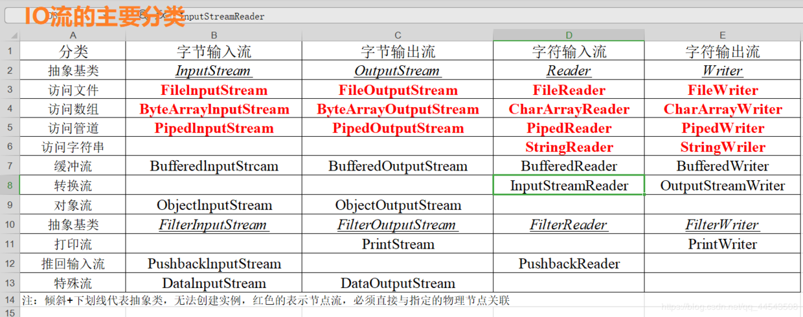


# File类
## 概述
1. `java.io.File`类是专门对文件进行操作的类，只能对文件本身进行操作，不能对文件内容进行操作。
2. `java.io.File`类是文件和目录路径名的抽象表示，主要用于文件和目录的创建、查找和删除等操作。

第一句就是说File跟流无关，File类不能对文件进行读和写也就是输入和输出！
第二句就是说File主要表示类似`D:\\文件目录1`与`D:\\文件目录1\\文件.txt`,前者是文件夹（Directory）后者则是文件(file)，而File类就是操作这两者的类。

## 构造方法
查到的API文档有：
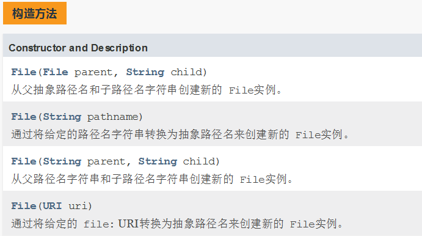


> File类的注意点：
> 一个File对象代表硬盘中实际存在的一个文件或者目录。File类构造方法不会给你检验这个文件或文件夹是否真实存在，因此**无论该路径下是否存在文件或者目录，都不影响File对象的创建。**
```java
public class Demo01 {
    public static void main(String[] args) {
        // ①
        File parent=new File("G:\\My Project\\Java基础学习");
        File f=new File(parent,"resources\\1.txt");
        System.out.println(f);
        // ②
        File f1=new File("G:\\My Project\\Java基础学习\\resources\\1.txt");
        System.out.println(f1);
        // ③
        File f2=new File("G:\\My Project\\Java基础学习","resources\\1.txt");
        System.out.println(f2);
    }
}
```
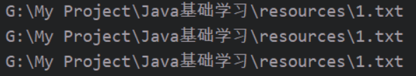

## 常用方法
### 访问文件名

| 方法                                   | 作用                                                         |
| -------------------------------------- | ------------------------------------------------------------ |
| `getName();`                           | 获取文件名                                                   |
| `getPath();`                           | 获取文件或文件夹路径，就是new File时写的路径，可以是相对路径 |
| `getAbsolutePath();`                   | 获取绝对路径                                                 |
| `getParent();`                         | 返回当前文件或文件夹的父路径                                 |
| `renameTo(new File("E:\test\1.txt"));` | 给文件或文件夹重写命名                                       |

### 文件检测

| 方法              | 作用                                 |
| ----------------- | ------------------------------------ |
| `exists();`       | 判断文件或文件夹是否存在             |
| `canWrite();`     | 是否可写                             |
| `canRead();`      | 是否可读                             |
| `isFile();`       | 是否是文件                           |
| `isDirectory();`  | 是否是文件夹/目录                    |
| `lastModified();` | 获取文件最后修改时间，返回一个毫秒数 |
| `length();`       | 返回文件长度，单位是字节数           |

### 文件操作相关
| 方法              | 作用     |
| ----------------- | -------- |
| `creatNewFile();` | 创建文件 |
| `delete();`       | 删除文件 |
### 目录相关操作
| 方法        | 作用                                 |
| ----------- | ------------------------------------ |
| `mkdirs();` | 创建多层目录                         |
| `list();`   | 返回当前文件夹的子集，包括目录和文件 |

# IO流
## 基本分类
|        | 输入流                   | 输出流                    |
| ------ | ------------------------ | ------------------------- |
| 字节流 | 字节输入流` InputStream` | 字节输出流` OutputStream` |
| 字符流 | 字符输入流 `Reader`      | 字符输出流 `Writer`       |

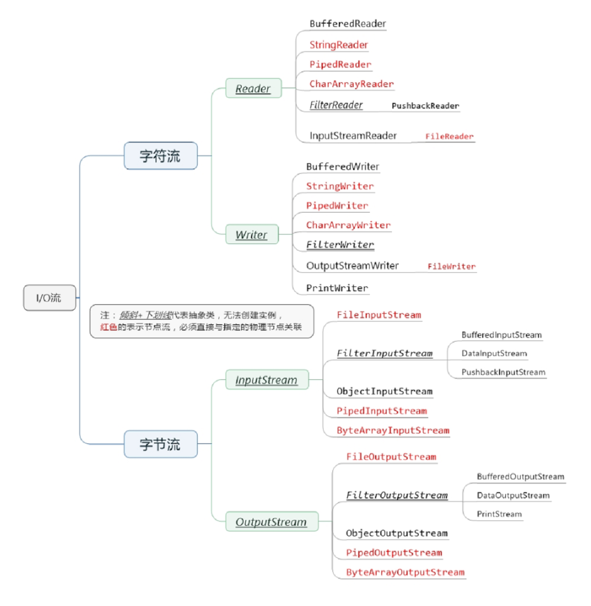

## IO流分向
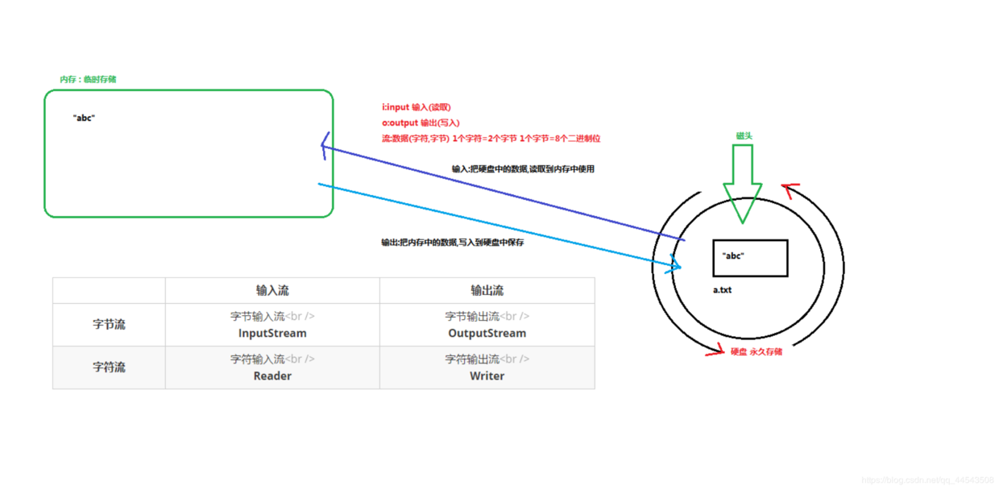
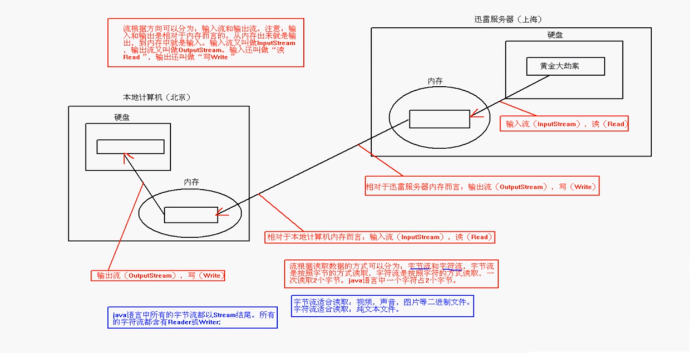

## 字节流
### FileOutputStream
1、` public void close() `：关闭此输出流并释放与此流相关联的任何系统资源。
2、` public void flush()` ：刷新此输出流并强制任何缓冲的输出字节被写出。
3、` public void write(byte[] b)`：将`b.length`个字节从指定的字节数组写入此输出流。
4、`public void write(byte[] b, int off, int len)` ：从指定的字节数组写入 `len`字节，从偏移量 off开始输出到此输出流。 也就是说从off个字节数开始读取一直到`len`个字节结束
5、`public abstract void write(int b) `：将指定的字节输出流。
**以上五个方法则是字节输出流都具有的方法，由父类`OutputStream`定义提供，子类都会共享以上方法**

`FileOutputStream`的构造方法：

+ `public FileOutputStream(File file)`：根据File对象为参数创建对象。
+ `public FileOutputStream(String name)`： 根据名称字符串为参数创建对象。

**这里推荐第二种方式开发**
```java
/*
完成了以下三步：
1. 创建文件abc.txt
2. 创建outputStream对象
3. 让对象指向文件
*/
FileOutputStream outputStream = new FileOutputStream("abc.txt");
```

### FileInputStream
1. `public void close() `：关闭此输入流并释放与此流相关联的任何系统资源。
2. `public abstract int read()`： 从输入流读取数据的下一个字节
3. `public int read(byte[] b)`： 该方法返回的int值代表的是读取了多少个字节，读到几个返回几个，读取不到返回-1

构造方法：**类比出与`FileOutputStream`一样**

### 综合应用
```java
public class Demo02{
    public static void main(String[] args) throws IOException {
        //输入流部分
        FileInputStream in=new FileInputStream("G:\\My Project\\Java基础学习\\resources\\1.txt");
        byte b[]=new byte[1024];
        int len=0;
        // read返回值是读入缓冲区的字节总数，如果因为已经到达文件末尾而没有更多的数据，则返回 -1
        while((len=in.read(b))!=-1){
            System.out.println(new String(b,0,len));
        }
        //输出流部分
        FileOutputStream ou = new FileOutputStream("G:\\My Project\\Java基础学习\\resources\\2.txt");
        String str= "Good good study,day day up";
        ou.write(str.getBytes());
        //ou.flush();
        ou.close();
        in.close();
    }
}
```
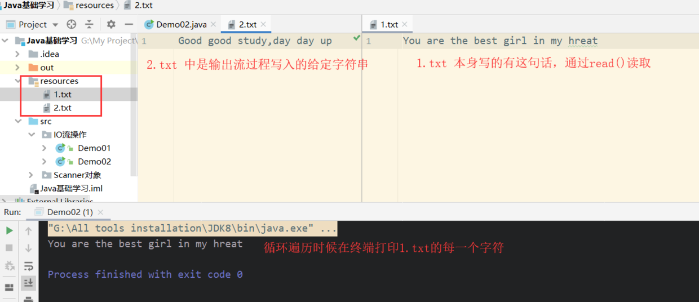

## 字符流
> **字符流 = 字节流 + 编码表**
> 字符流专门用于处理文本文件，**以字符为单位**处理数据。如果处理纯文本的数据优先考虑字符流，其他情况就只能用字节流了（图片、视频、等等只文本例外）。

### FileReader
1. `public void close() `：关闭此流并释放与此流相关联的任何系统资源
2. `public int read()`： 从输入流读取一个字符
3. `public int read(char[] cbuf)`： 从输入流中读取一些字符，并将它们存储到字符数组 cbuf中

构造方法：
1.  `FileReader(File file)`： 创建一个新的 FileReader ，给定要读取的File对象。
2. `FileReader(String fileName)`： 创建一个新的 FileReader ，给定要读取的文件的字符串名称。
### FileWriter
1. `void write(int c)` 写入单个字符。
2. `void write(char[] cbuf)`写入字符数组。
3. `abstract void write(char[] cbuf, int off, int len)`写入字符数组的某一部分,off数组的开始索引,len写的字符个数。
4. `void write(String str)`写入字符串。
5. `void write(String str, int off, int len)` 写入字符串的某一部分,off字符串的开始索引,len写的字符个数。
6. `void flush()`刷新该流的缓冲。
7. `void close()` 关闭此流，但要先刷新它。

构造方法：与`FileReader`类似

### 综合应用
```java
public class Demo03 {
    public static void main(String[] args) throws IOException {
        FileReader fr = new FileReader("G:\\My Project\\Java基础学习\\resources\\1.txt");
        //字符流以字符为单位，故这里用char
        char c[]=new char[100];
        int len;
        while ((len=fr.read(c))!=-1){
            // new String(c,0,len)意思是从0到len到数组转换为字符串
            System.out.println(new String(c,0,len));
        }
        FileWriter fw=new FileWriter("G:\\My Project\\Java基础学习\\resources\\3.txt");
        String str="纸上得来终觉浅，绝知此事要躬行";
        fw.write(str);
        fw.close();
        fr.close();
    }
}
```
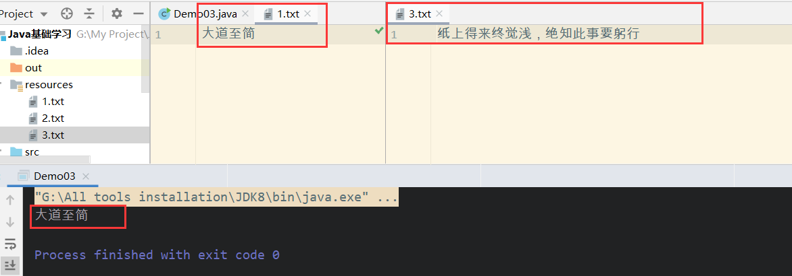

> 注意：关闭资源时，与`FileOutputStream`不同。**如果不关闭，数据只是保存到缓冲区，并未保存到文件。**
## flush和write
> java在使用流时，都会有一个缓冲区，按一种它认为比较高效的方法来发数据:把要发的数据先放到缓冲区，缓冲区放满以后再一次性发过去，而不是分开一次一次地发。
> 而**`flush()`表示强制将缓冲区中的数据发送出去，不必等到缓冲区满**。所以如果在用流的时候，没有用`flush()`这个方法，很多情况下会出现流的另一边读不到数据的问题，特别是在数据特别小的情况下。

# 缓冲流
在创建流对象时，会创建一个内置的默认大小的缓冲区数组，通过缓冲区读写，减少系统IO次数，从而提高读写的效率。缓冲书写格式为`BufferedXxx`，按照数据类型分类：
+ **字节缓冲流：`BufferedInputStream`，`BufferedOutputStream`**
+ **字符缓冲流：`BufferedReader`，`BufferedWriter`**
## 字节缓冲流
构造方法：
1. `public BufferedInputStream(InputStream in)` ：创建一个新的缓冲输入流，注意参数类型为`InputStream`。
2. `public BufferedOutputStream(OutputStream out)`： 创建一个新的缓冲输出流，注意参数类型为`OutputStream`。
```java
// 使用方式：
FileInputStream in = new FileInputStream("G:\\My Project\\Java基础学习\\resources\\1.txt");
BufferedInputStream br = new BufferedInputStream(in);

FileOutputStream out = new FileOutputStream("G:\\My Project\\Java基础学习\\resources\\4.txt");
BufferedOutputStream bo = new BufferedOutputStream(out);
```
下面通过实例感受缓冲流的快：
```java
public class Demo04 {
    public static void main(String[] args) throws Exception {
        long start =System.currentTimeMillis();
        BufferedInputStream bis = new BufferedInputStream(new FileInputStream("E:\\动物庄园.mp4"));
        BufferedOutputStream bos = new BufferedOutputStream(new FileOutputStream("G:\\动物庄园的输出测试.mp4"));
        byte[] b=new byte[1024*8];
        int len;
        while ((len=bis.read(b))!=-1){
            bos.write(b,0,len);
        }
        long end=System.currentTimeMillis();
        System.out.println("缓冲流复制时间："+(end-start)+"毫秒");

    }
}
```
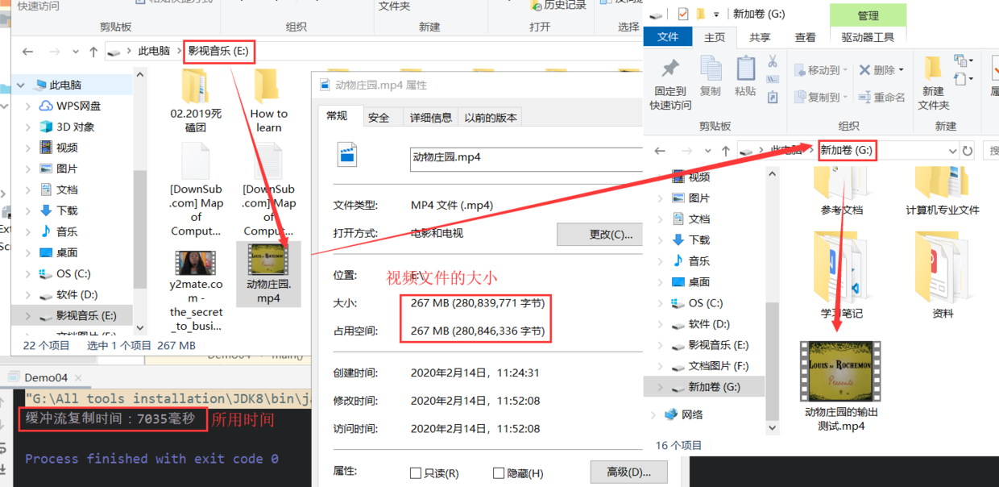

## 字符缓冲流
构造方法：
1. `public BufferedReader(Reader in)`：创建一个新的缓冲输入流，注意参数类型为`Reader`。
2. `public BufferedWriter(Writer out)`： 创建一个新的缓冲输出流，注意参数类型为`Writer`。

字符缓冲流的基本方法与普通字符流调用方式一致，这里不再阐述，我们来看字符缓冲流具备的**特有方法**。
1. `BufferedReader`：`public String readLine()`: 读一行数据。 读取到最后返回null
2. `BufferedWriter`：`public void newLine()`: 换行,由系统属性定义符号。

# 转换流
> **字符流 = 字节流 + 编码**


## 编码
> 编码：字符(能看懂的)-->字节(看不懂的)
> > String --> byte[]
> >
> > 解码：字节(看不懂的)-->字符(能看懂的)
> > byte[] --> String

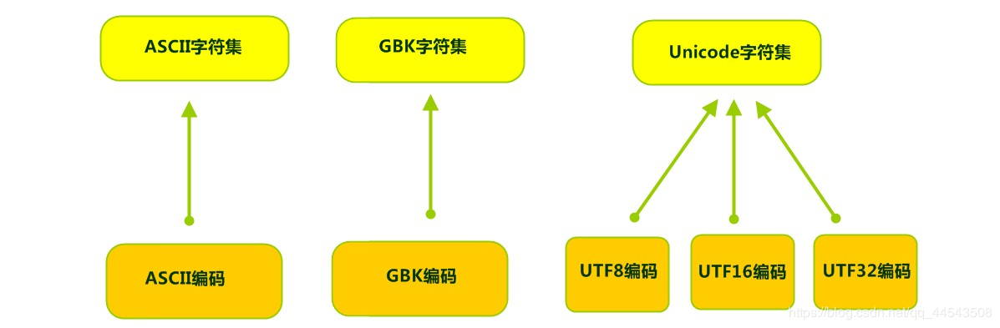


## InputStreamReader
**`InputStreamReader`类是`Reader`的子类**，是字节流到字符流的桥梁

构造方法：
1. `InputStreamReader(InputStream in)`: 创建一个使用默认字符集的字符流。
2. `InputStreamReader(InputStream in, String charsetName)`: 创建一个指定字符集的字符流。

```java
public class Demo05 {
    public static void main(String[] args) throws Exception {
        String FilePath="G:\\My Project\\Java基础学习\\resources\\1.txt";
        // 创建流对象，默认utf-8编码
        InputStreamReader isr = new InputStreamReader(new FileInputStream(FilePath));
        // 这里使用GBK码
        InputStreamReader isr2 = new InputStreamReader(new FileInputStream(FilePath),"GBK");
        char[] c=new char[20];
        int len;
        while ((len=isr.read(c))!=-1){
            System.out.println(new String(c,0,len));
        }
        while ((len=isr2.read(c))!=-1){
            System.out.println(new String(c,0,len));
        }
        isr2.close();
        isr.close();
    }
}
```
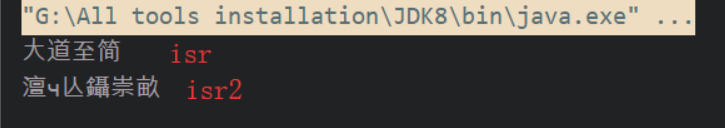


## OutputStreamWriter
**`OutputStreamWriter`是Writer的子类**，是字符流到字节流的桥梁
构造方法：与`InputStreamReader`类似

```java
public class Demo05 {
    public static void main(String[] args) throws Exception {
        String FilePath = "G:\\My Project\\Java基础学习\\resources\\3.txt";
        OutputStreamWriter osw = new OutputStreamWriter(new FileOutputStream(FilePath), "GBK");
        osw.write("你笑起来真好看");
        osw.close();
    }
}
```
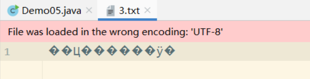
# 标准输入输出流
> `System.in`和`System.out`
>
> 将控制台输入的内容写入到txt文件中
```java
public class Demo06 {
    public static void main(String[] args) throws Exception {
        InputStreamReader is = new InputStreamReader(System.in, "utf-8");
        //把输入流放入到缓冲流
        BufferedReader br = new BufferedReader(is);
        BufferedWriter out = new BufferedWriter(new FileWriter("G:\\My Project\\Java基础学习\\resources\\3.txt"));
        String line="";
        while ((line = br.readLine()) != null) {
            if (line.equals("over"))
                break;
            out.write(line);
        }
        out.close();
        br.close();
        is.close();
    }
}
```
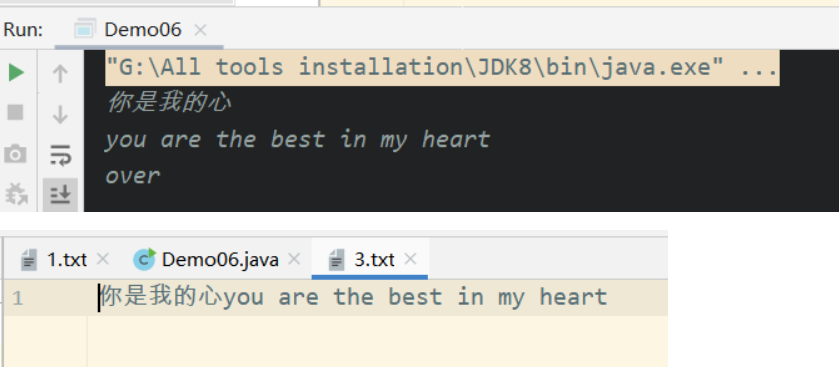

# 对象流
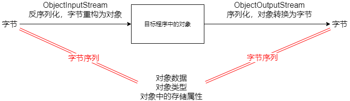
**序列化和反序列化要在同一个包中才能操作**

## ObjectOutputStream
构造方法：
1. `public ObjectOutputStream(OutputStream out)`： 创建一个指定`OutputStream`的`ObjectOutputStream`。

## ObjectInputStream
`ObjectInputStream`反序列化流，将之前使用`ObjectOutputStream`序列化的原始数据恢复为对象。
构造方法：

1. `public ObjectInputStream(InputStream in)`： 创建一个指定`InputStream`的`ObjectInputStream`。


**对于JVM可以反序列化对象，它必须是能够找到class文件的类。如果找不到该类的class文件，则抛出一个` ClassNotFoundException` 异常。**
## 综合应用
```java
public class Demo07 {
    public static void main(String[] args) throws Exception {
        //静态方法不用实例化就可以直接调用
        testSerialize();
        testDeserialize();
    }
    public static void testSerialize() throws Exception{
        ObjectOutputStream out = new ObjectOutputStream(new FileOutputStream("G:\\My Project\\Java基础学习\\resources\\2.txt"));
        Employee e=new Employee();
        e.name="Long";
        e.address="AHU";
        e.age=20;
        out.writeObject(e);
        out.flush();
        out.close();
    }
    public static void testDeserialize() throws Exception{
        //创建对象输入流对象，从指定文件中把对象序列化后的流读取出来
        ObjectInputStream in = new ObjectInputStream(new FileInputStream("G:\\My Project\\Java基础学习\\resources\\2.txt"));
        Object obj=in.readObject();
        Employee e=(Employee)obj;
        e.addressCheck();
        in.close();
    }
}

class Employee implements java.io.Serializable {
    public String name;
    public String address;
    public transient int age;  // transient瞬态修饰成员,不会被序列化
    public void addressCheck() {
        System.out.println("check : " + name + " -- " + address+ " -- " + age);
    }
}
```
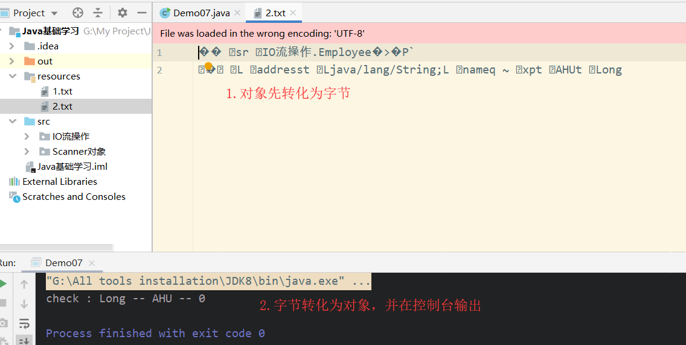

# 打印流
打印流分类：
+ 字节打印流`PrintStream`
+ 字符打印流`PrintWriter`

打印流特点：
1. 只操作目的地，不操作数据源
2. 可以操作任意类型的数据
3. 如果启用了自动刷新，在调用`println()`方法的时候，能够换行并刷新
4. 可以直接操作文件

哪些流可以直接操作文件呢?**如果该流的构造方法能够同时接收File和String类型的参数，一般都是可以直接操作文件的！**
`PrintStream`是`OutputStream`的子类，`PrintWriter`是Writer的子类，两者处于对等的位置上，所以它们的API是非常相似的。