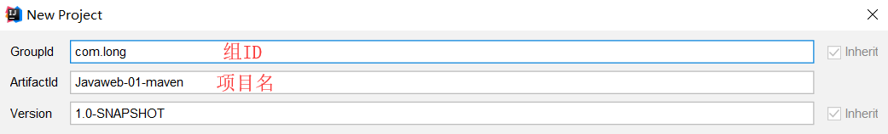

# 一、基本概念

## 1.1 Web应用程序

web应用程序：可以提供浏览器访问的程序;

- a.html、b.html……多个web资源，这些web资源可以被外界访问,对外界提供服务;
- 你们能访问到的任何一个页面或者资源，都存在于这个世界的某一个角落的计算机上。
- URL
- 这个统一的web资源会被放在同-一个文件夹下，web应用程序→Tomcat: 服务器
- 一个web应用由多部分组成(静态web,动态web)

- - html, CSS, is
  - jsp， servlet
  - Java程序
  - jar包
  - 配置文件(Properties)

web应用程序编写完毕后，若想提供给外界访问:需要-一个服务器来统-管理;

## 1.2 静态Web


静态页面缺点：

- web页面无法动态更新，所有用户看的是同一个页面
- 它无法和数据库交互（数据无法持久化，用户无法交互）

## 1.3 动态Web


缺点：**假如服务器动态web资源出现错误，那就要重新编写后台程序，重新发布**

# 二、web服务器

## 2.1 技术讲解

ASP：微软，国内最早流行，在HTML中嵌入VB脚本，ASP+COM

PHP：开发速度快，功能强大，跨平台，代码简单，但无法承载大量访问情况

JSP/Servlet：

B/S：浏览器和服务器

C/S：客户端和服务器

## 2.2 Tomcat

文件夹作用：


启动方式：


访问测试：http://localhost:8080/

可在server.xml文件中重新配置启动的端口号和主机名称：

- tomcat : 8080
- mysql : 3306
- http : 80
- https : 443


```xml
    <Connector executor="tomcatThreadPool"
               port="8080" protocol="HTTP/1.1"
               connectionTimeout="20000"
               redirectPort="8443" />
```

可配置主机名称：

- 默认主机名：localhost ->127.0.0.1
- 默认网站应用存放地址：webapps

```xml
<Host name="localhost"  appBase="webapps"
	  unpackWARs="true" autoDeploy="true">
```

## 2.3 网站是如何访问的?

1.输入一个域名，回车

2.检查本机的`C:\Windows\System32\drivers\etc\hosts`配置文件下有没有这个域名的映射

- 有：直接返回对应的IP地址，在这个地址中，有我们需要访问的web程序，可以直接访问

- 没有：去DNS服务器找，找到就返回页面，找不到返回下图


整个过程图解为：


3.可以配置环境变量（可选性）

## 2.4 发布网站

将自己写的网站放到服务器（Tomcat）中指定的web应用的文件夹（webapps）下就可以访问了

```
--webapps : Tomcat服务器web目录树
    - Root
    - Long ：网站目录名
        - WEB-INF
            - classes ：java程序
            - lib : web应用所依赖的jar包
            - web.xml  ：网站配置文件
        - index.html 默认首页
        - static
            -css
                -style.css
            -js
            -img
```

# 三、HTTP



这里只粗略的讲以下，HTTP具体见其他文章



HTTP协议（HyperText Transfer Protocol，超文本传输协议）是因特网上应用最为广泛的一种网络传输协议，所有的WWW文件都必须遵守这个标准。

HTTP是一个基于TCP/IP通信协议来传递数据（HTML 文件, 图片文件, 查询结果等）。


## 3.1 Http请求

客户端-->发送请求（Request）-->服务器

General：

```http
Request URL: https://www.baidu.com/       请求地址
Request Method: GET         get/post方法
Status Code: 200 OK         状态码:200
Remote（远程）Address: 183.232.231.174:443
```

## 3.2 Http响应

服务器-->响应-->客户端

1.Response Headers：

```http
Cache-Control: private    缓存控制
Connection: keep-alive    连接
Content-Encoding: gzip   编码
Content-Type: text/html;   类型
```

2.Request Headers：

```http
Accept: text/html     告述浏览器，它所支持的数据类型
Accept-Encoding: gzip, deflate, br     编码格式
Accept-Language: zh-CN,zh;q=0.9     语言环境
Cache-Control: max-age=0      缓存控制
Connection: keep-alive     请求完成是断开还是保持连接
Host: www.baidu.com      主机. . ./.
```

响应状态码：

200：请求响应成功

3xx：请求重定向（重新到我给的位置）

4xx：找不到资源

5xx：服务器代码错误（502：网关错误）

# 四、Maven

用来导入jar包

核心思想：**约定大于配置**

## 4.1 Maven配置环境变量


## 4.2 阿里云镜像

```xml
<mirrors>　
    <mirror>
         <id>alimaven</id>
        <name>aliyun maven</name>
        <url>http://maven.aliyun.com/nexus/content/groups/public/</url>
        <mirrorOf>central</mirrorOf>        
    </mirror>
</mirrors>
```

## 4.3 本地仓库

```xml
<localRepository>G:\All tools installation\Maven\apache-maven-3.6.3\repository</localRepository>
```


## 4.4 在IDEA中使用Maven





项目搭建成功：




在IDEA项目创建成功后要看一眼Maven的配置，以免之后出现问题




## 4.5 Maven页面

标准状况下：


Web程序：


## 4.6 在IDEA中配置Tomcat

1.打开Edit Configurations，创建`TomcatServer`


2.配置相关信息


3.解决警告问题：




**必须要配置：我们访问一个这样的网站，需要指定一个文件夹的名字**



4.启动项目


## 4.7 pox.xml

```xml
<?xml version="1.0" encoding="UTF-8"?>
<!--Maven版本和头文件-->
<project xmlns="http://maven.apache.org/POM/4.0.0" xmlns:xsi="http://www.w3.org/2001/XMLSchema-instance"
  xsi:schemaLocation="http://maven.apache.org/POM/4.0.0 http://maven.apache.org/xsd/maven-4.0.0.xsd">
  <modelVersion>4.0.0</modelVersion>

<!--  这里是我们刚才配置的GAV-->
  <groupId>com.long</groupId>
  <artifactId>Javaweb-01-maven</artifactId>
  <version>1.0-SNAPSHOT</version>
<!--  Packaging：项目的打包方式
    jar：jar应用
    war：javaweb应用
-->
  <packaging>war</packaging>

  <name>Javaweb-01-maven Maven Webapp</name>
  <!-- FIXME change it to the project's website -->
  <url>http://www.example.com</url>

<!--  配置-->
  <properties>
<!--  项目的默认构建编码-->
    <project.build.sourceEncoding>UTF-8</project.build.sourceEncoding>
<!--  编码版本-->
    <maven.compiler.source>1.7</maven.compiler.source>
    <maven.compiler.target>1.7</maven.compiler.target>
  </properties>

<!--项目依赖-->
  <dependencies>
    <!--具体jar包构建文件-->
    <dependency>
      <groupId>junit</groupId>
      <artifactId>junit</artifactId>
      <version>4.11</version>
    </dependency>
  </dependencies>
<!--项目构建用的东西-->
  <build>
    <finalName>Javaweb-01-maven</finalName>
    <pluginManagement><!-- lock down plugins versions to avoid using Maven defaults (may be moved to parent pom) -->
      <plugins>
        <plugin>
          <artifactId>maven-clean-plugin</artifactId>
          <version>3.1.0</version>
        </plugin>
        <!-- see http://maven.apache.org/ref/current/maven-core/default-bindings.html#Plugin_bindings_for_war_packaging -->
        <plugin>
          <artifactId>maven-resources-plugin</artifactId>
          <version>3.0.2</version>
        </plugin>
        <plugin>
          <artifactId>maven-compiler-plugin</artifactId>
          <version>3.8.0</version>
        </plugin>
        <plugin>
          <artifactId>maven-surefire-plugin</artifactId>
          <version>2.22.1</version>
        </plugin>
        <plugin>
          <artifactId>maven-war-plugin</artifactId>
          <version>3.2.2</version>
        </plugin>
        <plugin>
          <artifactId>maven-install-plugin</artifactId>
          <version>2.5.2</version>
        </plugin>
        <plugin>
          <artifactId>maven-deploy-plugin</artifactId>
          <version>2.8.2</version>
        </plugin>
      </plugins>
    </pluginManagement>
  </build>
</project>
```

## 4.8 Maven自身问题

**Maven由于它约定大于配置，之后可能遇到我们写的配置文件，无法导出或生效的问题**

解决方案：**在build中配置resources，来防止我们资源导出失败的问题**

```xml
<build>
      <resources>
        <resource>
            <directory>src/main/resources</directory>
            <excludes>
                <exclude>**/*.properties</exclude>
                <exclude>**/*.xml</exclude>
             </excludes>
            <filtering>false</filtering>
        </resource>
        <resource>
            <directory>src/main/java</directory>
            <includes>
                <include>**/*.properties</include>
                <include>**/*.xml</include>
            </includes>
            <filtering>false</filtering>
        </resource>
    </resources>
</build>
```

## 4.9 解决遇到的问题

IDEA中每次都要重复配置Maven
解决方案：在IDEA中全局默认配置中去配置


# 五、Servlet

## 5.1 HelloServlet

1.构建一个Maven项目，删除里面的src目录，之后在这个里面建立`modules`

```xml
<!-- servlet依赖的jar包start -->
<dependency>
    <groupId>javax.servlet</groupId>
    <artifactId>javax.servlet-api</artifactId>
    <version>4.0.1</version>
</dependency>

<!-- jsp依赖jar包start -->
<dependency>
    <groupId>javax.servlet.jsp</groupId>
    <artifactId>javax.servlet.jsp-api</artifactId>
    <version>2.3.3</version>
</dependency>
```

2.关于Maven父子工程的理解：

子项目继承了父项目，就跟Java中类的继承一样

> 这一步在子项目和父项目中pom.xml文件中查看

父项目中会多出：

```xml
<modules>
    <module>servlet-01</module>
</modules>
```

子项目中会多出：

```xml
<parent>
    <artifactId>javaweb-servlet</artifactId>
    <groupId>com.long</groupId>
    <version>1.0-SNAPSHOT</version>
</parent>
```

3.配置web.xml

```xml
<?xml version="1.0" encoding="UTF-8"?>
<web-app version="4.0" 
xmlns="http://xmlns.jcp.org/xml/ns/javaee" 
xmlns:xsi="http://www.w3.org/2001/XMLSchema-instance" 
xsi:schemaLocation="http://xmlns.jcp.org/xml/ns/javaee http://xmlns.jcp.org/xml/ns/javaee/web-app_4_0.xsd"
metadata-complete="true">
</web-app>
```

4.编写一个Servlet程序

- 编写一个普通类
- 实现Servlet接口，这里我们继承`HttpServlet`

```java
public class HelloServlet extends HttpServlet {
    @Override
    protected void doGet(HttpServletRequest req, HttpServletResponse resp) throws ServletException, IOException {
        PrintWriter writer = resp.getWriter();//响应流
        writer.print("Hello,Servlet");
    }

    @Override
    protected void doPost(HttpServletRequest req, HttpServletResponse resp) throws ServletException, IOException {
        super.doPost(req, resp);
    }
}
```

5.编写Servlet映射
我们写的是Java程序，但要通过浏览器访问，而浏览器需要连接web服务器，所以我们需要在web服务中注册我们写的Servlet，还需要给它一个浏览器能够访问的路径。

```xml
<!--注册Servlet-->
    <servlet>
        <servlet-name>hello</servlet-name>
        <servlet-class>com.HelloServlet</servlet-class>
    </servlet>
<!--Servlet请求路径-->
    <servlet-mapping>
        <servlet-name>hello</servlet-name>
        <url-pattern>/hello</url-pattern>
    </servlet-mapping>
```

6.配置Tomcat，注意发布的路径


7.启动测试，访问地址


## 5.2 Servlet原理


Servlet是由web服务器调用，web服务器接受到浏览器请求后，会：

## 5.3 Mapping原理

> **以下均在web.xml中操作**

1.一个Servlet可以指定**一个**映射路径：

```xml
<servlet-mapping>
    <servlet-name>hello</servlet-name>
    <url-pattern>/hello</url-pattern>
</servlet-mapping>
```

2.一个Servlet可以指定**多个**映射路径：

```xml
<servlet-mapping>
    <servlet-name>hello</servlet-name>
    <url-pattern>/hello</url-pattern>
</servlet-mapping>
<servlet-mapping>
    <servlet-name>hello</servlet-name>
    <url-pattern>/hello2</url-pattern>
</servlet-mapping><servlet-mapping>
    <servlet-name>hello</servlet-name>
    <url-pattern>/hello3</url-pattern>
</servlet-mapping>
```

3.一个Servlet可以指定**通用**映射路径：

```xml
<servlet-mapping>
    <servlet-name>hello</servlet-name>
    <url-pattern>/hello/*</url-pattern>
</servlet-mapping>
```

4.**默认请求路径**：

```xml
<servlet-mapping>
    <servlet-name>hello</servlet-name>
    <url-pattern>/*</url-pattern>
</servlet-mapping>
```

5.可以**自定义后缀**实现请求映射：

```xml
<!--自定义后缀请求映射时候, * 前面不能加映射路径-->
<servlet-mapping>
    <servlet-name>hello</servlet-name>
    <url-pattern>*.covid-19</url-pattern>
</servlet-mapping>
```


6.优先级问题：

指定了固有的映射路径优先级最高，如果找不到就会走默认的处理请求；

```xml
<!--hello-->
    <servlet>
        <servlet-name>hello</servlet-name>
        <servlet-class>com.HelloServlet</servlet-class>
    </servlet>
    <servlet-mapping>
        <servlet-name>hello</servlet-name>
        <url-pattern>/hello</url-pattern>
    </servlet-mapping>
<!--404-->
    <servlet>
       <servlet-name>error</servlet-name>
       <servlet-class>com.ErrorServlet</servlet-class>
    </servlet>
    <servlet-mapping>
        <servlet-name>error</servlet-name>
       <url-pattern>/*</url-pattern>
    </servlet-mapping>
```

## 5.4 ServletContext对象

web容器在启动的时候，它会为每个web程序都创建一个对应的`ServletContext`对象，它代表了当前的web应用；

### 共享数据

在争Servlet中保存的数据可以在另外一个Servlet拿到


```java
public class HelloServlet extends HttpServlet {
    @Override
    protected void doGet(HttpServletRequest req, HttpServletResponse resp) throws ServletException, IOException {
        ServletContext context = this.getServletContext();
        String username="郑宇";  //数据
        context.setAttribute("name",username);  //将一个数据保存在ServletContext中。key：name；value：username
    }
}
```

```java
public class GetServlet extends HttpServlet {
    @Override
    protected void doGet(HttpServletRequest req, HttpServletResponse resp) throws ServletException, IOException {
        ServletContext context = this.getServletContext();
        String name = (String) context.getAttribute("name");
        resp.setContentType("text/html");
        resp.setCharacterEncoding("utf-8");
        resp.getWriter().print("His name is "+name);
    }

    @Override
    protected void doPost(HttpServletRequest req, HttpServletResponse resp) throws ServletException, IOException {
        super.doPost(req, resp);
    }
}
```

```xml
<!--在web.xml中配置下列-->
    <servlet>
        <servlet-name>hello</servlet-name>
        <servlet-class>com.HelloServlet</servlet-class>
    </servlet>
    <servlet-mapping>
        <servlet-name>hello</servlet-name>
        <url-pattern>/hello</url-pattern>
    </servlet-mapping>
    
    <servlet>
        <servlet-name>getcontext</servlet-name>
        <servlet-class>com.GetServlet</servlet-class>
    </servlet>
    <servlet-mapping>
        <servlet-name>getcontext</servlet-name>
        <url-pattern>/getcontext</url-pattern>
    </servlet-mapping>
```

观察结果：

如果先访问 `http://localhost:8080/s2/getcontext` 的话，就无法显示信息


如果先访问 `http://localhost:8080/s2/hello` 再访问 `http://localhost:8080/s2/getcontext`  的话，显示传输的信息


### 获取初始化参数

```xml
<context-param>
    <param-name>url</param-name>
    <param-value>jdbc:mysql://localhost:3306/mybatis</param-value>
</context-param>
<!--注册servlet-->
<servlet>
    <servlet-name>gp</servlet-name>
    <servlet-class>com.ServletDemo03</servlet-class>
</servlet>
<servlet-mapping>
    <servlet-name>gp</servlet-name>
    <url-pattern>/gp</url-pattern>
</servlet-mapping>
```

```java
@Override
protected void doGet(HttpServletRequest req, HttpServletResponse resp) throws ServletException, IOException {
    ServletContext context = this.getServletContext();
    String url = context.getInitParameter("url");
    resp.getWriter().print(url);
}
```


### 请求转发（到另一个页面）

```xml
<servlet>
    <servlet-name>test</servlet-name>
    <servlet-class>com.ServletDemo04</servlet-class>
</servlet>
<servlet-mapping>
    <servlet-name>test</servlet-name>
    <url-pattern>/test</url-pattern>
</servlet-mapping>
```

```java
@Override
protected void doGet(HttpServletRequest req, HttpServletResponse resp) throws ServletException, IOException {
    ServletContext context = this.getServletContext();
    resp.setCharacterEncoding("utf-8");
    System.out.println("测试是否进入了这句话");
/*
    // 转发到请求路径
    RequestDispatcher requestDispatcher=context.getRequestDispatcher("test");
    //调用forward方法请求转发
    requestDispatcher.forward(req,resp);
*/
    context.getRequestDispatcher("/getcontext").forward(req,resp);
}
```


A想要请求C，而又不得不通过B，那么A有两种方式请求：

- **转发**：A请求B，B请求C，C传给B，B再传给A。整个过程A没有见过C。


- **重定向**：A请求B，B让A去请求C，A去请求C，C再请求A。B相当于只提供信息。


### 读取资源文件

在Resources目录下建立`db.properties`文件：

```properties
username=long
password=123456
```

```java
public class ServletDemo05 extends HttpServlet {
    @Override
    protected void doGet(HttpServletRequest req, HttpServletResponse resp) throws ServletException, IOException {
        InputStream is = this.getServletContext().getResourceAsStream("/WEB-INF/classes/db.properties");
        Properties prop=new Properties();
        prop.load(is);
        String user=prop.getProperty("username");
        String pwd=prop.getProperty("password");
        resp.getWriter().print(user+":"+pwd);
    }
}
```

```xml
<servlet>
    <servlet-name>db</servlet-name>
    <servlet-class>com.ServletDemo05</servlet-class>
</servlet>
<servlet-mapping>
    <servlet-name>db</servlet-name>
    <url-pattern>/db</url-pattern>
</servlet-mapping>
```


## 5.5 HttpServletResponse

web服务器接收到客户端的http请求，针对这个请求，分别创建一个代表请求的`HttpServletRequest`对象，代表相应的一个`HttpServletResponse`；

- 如果要获取客户端请求过来的参数：找`HttpServletRequest`
- 如果要给客户端响应一些信息：找`HttpServletResponse`

### 简单分类

**负责向浏览器发送数据的方法**：

```java
ServletOutputStream getOutputStream() throws IOException;

PrintWriter getWriter() throws IOException;
```

**负责向浏览器发送响应头的方法**：

```java
void setCharacterEncoding(String var1);

void setContentLength(int var1);

void setContentLengthLong(long var1);

void setContentType(String var1);

void setDateHeader(String var1, long var2);

void addDateHeader(String var1, long var2);

void setHeader(String var1, String var2);

void addHeader(String var1, String var2);

void setIntHeader(String var1, int var2);

void addIntHeader(String var1, int var2);
```

### 下载文件

1. 获取下载的文件路径
2. 获取下载的文件名
3. 设置想办法让浏览器能支持下载
4. 获取下载文件的输入流
5. 创建缓存区
6. 获取`OutputStream`对象
7. 将`FileOutputStream`流写入到buffer缓存区
8. 使用`OutputStream`将缓存区中的数据输出到客户端

这是最开始用的路径，发现找错了：


**对这句 `resp.setHeader("Content-Disposition", "attachment;filename="+ URLEncoder.encode(fileName,"utf-8"));`：**

- **这句里面注意`"attachment;filename="`中间是分号**
- `URLEncoder.encode(fileName,"utf-8"))`解决的是中文编码问题

```java
public class FileServlet extends HttpServlet {
    @Override
    protected void doGet(HttpServletRequest req, HttpServletResponse resp) throws ServletException, IOException {
        // 1. 获取下载的文件路径
        String realPath = "G:\\My Project\\javaweb-servlet\\response\\target\\classes\\面向对象.png";
        System.out.println("获取的文件下载路径："+realPath);
        // 2. 获取下载的文件名
        String fileName = realPath.substring(realPath.lastIndexOf("\\") + 1);
        // 3. 设置想办法让浏览器能支持Content-Disposition下载
        resp.setHeader("Content-Disposition", "attachment;filename="+ URLEncoder.encode(fileName,"utf-8"));
        // 4. 获取下载文件的输入流
        FileInputStream in = new FileInputStream(realPath);
        // 5. 创建缓存区
        int len=0;
        byte[] buffer = new byte[1024];
        // 6. 获取OutputStream对象
        ServletOutputStream out =resp.getOutputStream();
        // 7. 将FileOutputStream流写入到buffer缓存区,使用OutputStream将缓存区中的数据输出到客户端
        while ((len=in.read(buffer))>0){
            out.write(buffer,0,len);
        }
        in.close();
        out.close();
    }

    @Override
    protected void doPost(HttpServletRequest req, HttpServletResponse resp) throws ServletException, IOException {
        doGet(req, resp);
    }
}
```

最终结果：


### 验证码

```java
public class ImageServlet extends HttpServlet {
    @Override
    protected void doGet(HttpServletRequest req, HttpServletResponse resp) throws ServletException, IOException {
        // 如何让浏览器3秒刷新一次；
        resp.setHeader("refresh", "3");
        // 在内存中创建一个图片
        BufferedImage image = new BufferedImage(80, 20, BufferedImage.TYPE_INT_RGB);
        // 得到图片
        Graphics2D g = (Graphics2D) image.getGraphics();
        // 设置图片背景色
        g.setColor(Color.white);
        g.fillRect(0, 0, 80, 20);
        // 给图片写数据
        g.setColor(Color.BLUE);
        g.setFont(new Font(null,Font.BOLD,20));
        g.drawString(makeNum(),0,20);
        // 告述浏览器这个请求用图片的方式打开
        resp.setContentType("image/png");
        // 网站存在缓存，要清除
        resp.setDateHeader("expires",-1);
        resp.setHeader("Cache-Control","no-cache");
        resp.setHeader("Pragma","no-cache");
        // 把图片写给浏览器
        ImageIO.write(image,"jpg",resp.getOutputStream());
    }

    //生成随机数
    private String makeNum() {
        Random random = new Random();
        String num = random.nextInt(99999999) + "";
        StringBuffer sb = new StringBuffer();
        for (int i = 0; i < 7 - num.length(); i++) {
            sb.append("0");
        }
        num = sb.toString() + num;
        return num;

    }

    @Override
    protected void doPost(HttpServletRequest req, HttpServletResponse resp) throws ServletException, IOException {
        super.doPost(req, resp);
    }
}
```

结果如下：


### 重定向

```java
public class RedirectServlet extends HttpServlet {
    @Override
    protected void doGet(HttpServletRequest req, HttpServletResponse resp) throws ServletException, IOException {
        /**
         * resp.setHeader("Location","/response/image");
         * resp.setStatus(HttpServletResponse.SC_MOVED_TEMPORARILY);   //302
         */
        resp.sendRedirect("/response/image");
    }
```


## 5.6 HttpServletRequest

### 获取前端参数，请求转发


`LoginServlet.java` 中：

```java
public class LoginServlet extends HttpServlet {
    @Override
    protected void doGet(HttpServletRequest req, HttpServletResponse resp) throws ServletException, IOException {
        // 设置utf-8，能够识别中文编码
        req.setCharacterEncoding("utf-8");
        resp.setCharacterEncoding("utf-8");
        // 保存表单数据到对象username,pwd,hobbies中
        String username = req.getParameter("username");
        String pwd = req.getParameter("password");
        String[] hobbies = req.getParameterValues("hobbies");

        System.out.println("================");
        System.out.println(username);
        System.out.println(pwd);
        System.out.println(Arrays.toString(hobbies));
        System.out.println("================");
        //请求转发
        req.getRequestDispatcher("/success.jsp").forward(req,resp);

    }

    @Override
    protected void doPost(HttpServletRequest req, HttpServletResponse resp) throws ServletException, IOException {
        super.doPost(req, resp);
    }
}
```

`index.jsp`中：

```jsp
<%@ page contentType="text/html;charset=UTF-8" language="java" %>
<html>
<head>
    <title>登录</title>
</head>
<body>

<h1>登录：</h1>
<div style="text-align: center">
    <%--以post方式提交表单--%>
    <form action="${pageContext.request.contextPath}/login" method="get">
        用户名：<input type="text" name="username">
        密码：<input type="password" name="password">
        </br>
        爱好：
        <input type="checkbox" name="hobbies" value="女孩">女孩
        <input type="checkbox" name="hobbies" value="写代码">写代码
        <input type="checkbox" name="hobbies" value="睡大觉">睡大觉
        <input type="submit">
    </form>
</div>
</body>
</html>
```

`success.jsp` 中：

```jsp
<%@ page contentType="text/html;charset=UTF-8" language="java" %>
<html>
<head>
    <title>Title</title>
</head>
<body>
<h1>登录成功！</h1>
</body>
</html>
```

`web.xml`中：

```xml
<servlet>
    <servlet-name>LoginServlet</servlet-name>
    <servlet-class>com.LoginServlet</servlet-class>
</servlet>
<servlet-mapping>
    <servlet-name>LoginServlet</servlet-name>
    <url-pattern>/login</url-pattern>
</servlet-mapping>
```

表单填写：


提交表单后：


终端中查看：


## 5.7 Cookie和Session

会话：用户打开一个浏览器，点击超链接，访问多个web资源，关闭浏览器，这个过程称为会话。

cookie：客户端技术（响应，请求）

session：服务器技术，保存用户的会话信息，我们可以把信息存放在session中

### cookie

```java
/**
 * 1.从请求中拿到cookie信息
 * 2.服务器响应给客户端cookie
 */
// 保存用户上一次访问时间
public class CookieDemo01 extends HttpServlet {
    @Override
    protected void doGet(HttpServletRequest req, HttpServletResponse resp) throws ServletException, IOException {
        req.setCharacterEncoding("utf-8");
        // 这里是为了防止Chrome浏览器乱码
        resp.setContentType("text/html;charset=utf-8");
        PrintWriter out=resp.getWriter();
        //Cookie，服务端从客户端获得
        Cookie[] cookies=req.getCookies();  //使用数组，Cookie可能存在多个
        if(cookies!=null){
            out.write("上次访问时间为：");
            for (int i = 0; i < cookies.length; i++) {
                Cookie cookie =cookies[i];
                // 获取cookie的名字
                if(cookie.getName().equals("lastLoginTime")){
                    long lastLoginTime = Long.parseLong(cookie.getValue());
                    Date date = new Date(lastLoginTime);
                    out.write(date.toLocaleString());
                }
            }
        }else {
            out.write("This is your first time visiting this website");
        }
        // 服务端给客户端响应一个cookie
        resp.addCookie(new Cookie("lastLoginTime",System.currentTimeMillis()+""));
    }
```

cookie细节问题：

- 一个cookie只能保存一个信息
- 一个web站点可以给浏览器发送多个cookie，最多存放20个cookie
- cookie大小有限制 4kb
- 300个cookie浏览器上限

删除cookie：

- 不设置有效期，关闭浏览器，自动失败
- 设置有效期为0

**编码解码：**

```
URLEncoder.encode("安徽大学","utf-8")
URLDecoder.decode(cookie.getValue,"utf-8")
```

### session(重点)

使用步骤：

1.`HttpSession session = req.getSession();`

2.设定指定名字的属性的值，并将它添加到session会话范围内，如果这个属性是会话范围内存在，则更改该属性的值： `session.setAttribute("变量名", 值对象);`

3.获取指定名字的属性的值，此时取出来的是Object, **一般需要强转**：`session.getAttribute("变量名");`

4.删除指定名字的session属性：`session.removeAttribute("变量名");`

5.手动使session失效：`session.invalidate();`

**HttpSession是不能new出来的,要从HttpServletRequest中调用getSession方法得到.一般也就是req.getSession();**

```
public class SessionDemo01 extends HttpServlet {
    @Override
    protected void doGet(HttpServletRequest req, HttpServletResponse resp) throws ServletException, IOException {
        // 解决乱码问题
        req.setCharacterEncoding("utf-8");
        resp.setCharacterEncoding("utf-8");
        resp.setContentType("text/html;charset=utf-8");
        // 得到Session
        HttpSession session=req.getSession();
        // 给Session中存东西
        session.setAttribute("name","大佬");
        // 获取Session的ID
        String sessionId=session.getId();
        // 获取Session是不是新创建的
        if(session.isNew()){
            resp.getWriter().write("session创建成功,ID:"+sessionId);
        }else {
            resp.getWriter().write("session已经存在了,ID:"+sessionId);
        }
    }
}
```


session创建时候实际上是增加一个新的cookie对象并增加到cookie中，等价于：

```java
Cookie cookie = new Cookie("JSESSIONID",sessionId);
resp.addCookie(cookie);
```

这个得到的session实际上是可以取出来的：

```java
HttpSession session = req.getSession();
String name = (String) session.getAttribute("name");
System.out.println(name);
```

### 两者区别

1.Cookie是把用户的数据写给用户的服务器，浏览器保存（可以保存多个）

2.Session把用户的数据写到用户独占的Session中，服务端保存（保存重要信息，减少服务器资源的浪费）

3.Session对象由服务创建

### 设置Session默认失效时间

```xml
<session-config>
<!--以分钟为单位，一天为1440分钟 -->
    <session-timeout>1440</session-timeout>
</session-config>
```

# 六、MVC三层架构

MVC：Model（模型）、View（视图）、Controller（控制器）


Model：

- 业务处理：业务逻辑（Service）
- 数据持久层：CRUD（DAO）
  View：
- 展示数据
- 提供链接发起Servlet请求（a，form，img..）
  Controller（Servlet）：
- 接收用户的请求（req：请求参数、Session信息……）
- 交给业务层处理对应的代码
- 控制视图跳转



登录--->接收用户的登录请求--->处理用户请求（获取用户登录参数，username，password）--->交给业务层处理登录业务（判断用户名密码是否正确：事务）--->Dao层查询用户名和密码是否正确--->数据库



# 七、过滤器


`ShowServlet.java`文件中：

```java
public class ShowServlet extends HttpServlet {
    @Override
    protected void doGet(HttpServletRequest req, HttpServletResponse resp) throws ServletException, IOException {
        resp.getWriter().write("你好世界");
    }
    @Override
    protected void doPost(HttpServletRequest req, HttpServletResponse resp) throws ServletException, IOException {
        super.doPost(req, resp);
    }
}
```

`characterEncodingFilter.java`文件中：

```java
public class characterEncodingFilter implements Filter {
    //初始化：web服务器启动，就已经初始化了，随时等待对象的出现
    public void init(FilterConfig filterConfig) throws ServletException {

    }
    /**
     * 1. 过滤中的所有代码在经过过滤请求时候都会执行
     * 2. 必须要让过滤器同行
     * filterChain.doFilter(servletRequest,servletResponse);
     */
    public void doFilter(ServletRequest servletRequest, ServletResponse servletResponse, FilterChain filterChain) throws IOException, ServletException {
        servletRequest.setCharacterEncoding("utf-8");
        servletResponse.setCharacterEncoding("utf-8");
        servletResponse.setContentType("text/html;charset=utf-8");
        System.out.println("characterEncodingFilter执行前...");
        // 下面这句如果不写，程序到这里就会被拦截停止
        filterChain.doFilter(servletRequest,servletResponse);
        System.out.println("characterEncodingFilter执行后...");
    }
    //销毁：web服务器关闭时候，过滤器销毁
    public void destroy() {

    }
}
```

现在在`web.xml`文件中配置过滤器：

```xml
<!--配置java文件路径-->
<servlet>
    <servlet-name>ShowServlet</servlet-name>
    <servlet-class>com.ShowServlet</servlet-class>
</servlet>
<servlet-mapping>
    <servlet-name>ShowServlet</servlet-name>
    <url-pattern>/servlet/show</url-pattern>
</servlet-mapping>
<servlet-mapping>
    <servlet-name>ShowServlet</servlet-name>
    <url-pattern>/show</url-pattern>
</servlet-mapping>
<!--配置过滤器-->
<filter>
    <filter-name>characterEncodingFilter</filter-name>
    <filter-class>com.characterEncodingFilter</filter-class>
</filter>
<filter-mapping>
    <filter-name>characterEncodingFilter</filter-name>
    <!--目录/servlet下都会经过过滤器-->
    <url-pattern>/servlet/*</url-pattern>
</filter-mapping>
```


# 八、SMBMS(需要数据库)

## 8.1 项目搭建

1.搭建一个maven项目

2.配置Tomcat

3.测试项目是否能跑起来

4.导入依赖的jar包；`jsp,servlet,mysql驱动,jstl,stand...`

```xml
<!--pom.xml中导入的依赖-->
<dependency>
    <groupId>javax.servlet</groupId>
    <artifactId>javax.servlet-api</artifactId>
    <version>4.0.1</version>
</dependency>
<!-- jsp依赖jar包start -->
<dependency>
    <groupId>javax.servlet.jsp</groupId>
    <artifactId>javax.servlet.jsp-api</artifactId>
    <version>2.3.3</version>
</dependency>
<!--standard标准库-->
<dependency>
    <groupId>taglibs</groupId>
    <artifactId>standard</artifactId>
    <version>1.1.2</version>
</dependency>
<dependency>
    <groupId>mysql</groupId>
    <artifactId>mysql-connector-java</artifactId>
    <version>5.1.47</version>
</dependency>
<dependency>
    <groupId>javax.servlet.jsp.jstl</groupId>
    <artifactId>jstl-api</artifactId>
    <version>1.2</version>
</dependency>
```

5.连接数据库


6.编写实体类

ORM映射：表-类映射

7.编写基础公共类

数据库配置文件：

```properties
driver=com.mysql.jdbc.Driver
url=jdbc:mysql://localhost:3306/smbms?useSSL=true&useUnicode=true&characterEncoding=utf-8
username=root
password=lzy523024
```

编写数据库公共类

```java
package com.dao;

import java.io.IOException;
import java.io.InputStream;
import java.sql.*;
import java.util.Properties;

//操作数据库的公共类
public class BaseDao {
    private static String driver;
    private static String url;
    private static String username;
    private static String password;

    // 静态代码块，类加载时候就初始化了
    static {
        Properties properties = new Properties();
        // 通过类加载器读取对应资源
        InputStream is = BaseDao.class.getClassLoader().getResourceAsStream("db.properties");
        try {
            properties.load(is);
        } catch (IOException e) {
            e.printStackTrace();
        }

        driver = properties.getProperty("driver");
        url = properties.getProperty("url");
        username = properties.getProperty("username");
        password = properties.getProperty("password");
    }

    //获取数据库的链接
    public static Connection getConnection() {
        Connection connection = null;
        try {
            Class.forName(driver);
            connection = DriverManager.getConnection(url, username, password);
        } catch (Exception e) {
            e.printStackTrace();
        }
        return connection;
    }

    //编写查询公共方法
    public static ResultSet execute(Connection connection, String sql, Object[] params, ResultSet resultSet) throws SQLException {
        PreparedStatement preparedStatement = connection.prepareStatement(sql);
        for (int i = 0; i < params.length; i++) {
            preparedStatement.setObject(i + 1, params[i]);
        }
        resultSet = preparedStatement.executeQuery();
        return resultSet;
    }

    //编写增删改公共方法
    public static int execute(Connection connection, String sql, Object[] params, PreparedStatement preparedStatement) throws SQLException {
        preparedStatement = connection.prepareStatement(sql);
        for (int i = 0; i < params.length; i++) {
            //setObject，占位符从1开始，数组是从0开始
            preparedStatement.setObject(i + 1, params[i]);
        }
        int updateRows = preparedStatement.executeUpdate();
        return updateRows;
    }

    //释放资源
    public static boolean closeResource(Connection connection,PreparedStatement preparedStatement,ResultSet resultSet){
        boolean flag=true;
        if(resultSet!=null){
            try {
                resultSet.close();
                //GC回收
                resultSet=null;
            } catch (SQLException e) {
                e.printStackTrace();
                flag=false;
            }
        }
        if(preparedStatement!=null){
            try {
                preparedStatement.close();
                //GC回收
                preparedStatement=null;
            } catch (SQLException e) {
                e.printStackTrace();
                flag=false;
            }
        }
        if(connection!=null){
            try {
                connection.close();
                //GC回收
                connection=null;
            } catch (SQLException e) {
                e.printStackTrace();
                flag=false;
            }
        }
        return flag;
    }
}
```

编写字符编码过滤器：

```java
public class CharacterEncodingFilter implements Filter {
    public void init(FilterConfig filterConfig) throws ServletException {

    }
    public void doFilter(ServletRequest servletRequest, ServletResponse servletResponse, FilterChain filterChain) throws IOException, ServletException {
        servletRequest.setCharacterEncoding("utf-8");
        servletResponse.setCharacterEncoding("utf-8");
        filterChain.doFilter(servletRequest,servletResponse);
    }
    public void destroy() {

    }
}
```

8.导入静态资源


## 8.2 登录功能


1.编写前端页面

2.设置首页

```xml
<!--设置登录页面-->
<welcome-file-list>
    <welcome-file>login.jsp</welcome-file>
</welcome-file-list>
```

3.编写Dao层登录的接口

```java
public interface UserDao {
    // 得到登录用户
    public User getLoginUser(Connection connection,String userCode) throws SQLException;
}
```

4.编写Dao接口的实现类

```java
package com.dao.user;

import com.dao.BaseDao;
import com.pojo.User;

import java.sql.*;

public class UserDaoImpl implements UserDao {
    // 得到用户
    public User getLoginUser(Connection connection, String userCode) throws SQLException{
        PreparedStatement pstm = null;
        ResultSet rs = null;
        User user = null;

        if (connection != null) {
            String sql = "select * from smbms_user where userCode=?";
            Object[] params = {userCode};
            rs = BaseDao.execute(connection, pstm, rs, sql, params);
            if (rs.next()) {
                user = new User();
                user.setId(rs.getInt("id"));
                user.setUserCode(rs.getString("userCode"));
                user.setUserName(rs.getString("userName"));
                user.setUserPassword(rs.getString("userPassword"));
                user.setGender(rs.getInt("gender"));
                user.setBirthday(rs.getDate("birthday"));
                user.setPhone(rs.getString("phone"));
                user.setAddress(rs.getString("address"));
                user.setUserRole(rs.getInt("userRole"));
                user.setCreatedBy(rs.getInt("createdBy"));
                user.setCreationDate(rs.getTimestamp("creationDate"));
                user.setModifyBy(rs.getInt("modifyBy"));
                user.setModifyDate(rs.getTimestamp("modifyDate"));
            }
            BaseDao.closeResource(null, pstm, rs);
        }
        return user;
    }
}
```

5.业务层接口

```java
package com.service.user;

import com.pojo.User;

public interface UserService {
    public User login(String userCode,String password);
}
```

6.业务层实现类

```java
package com.service.user;

import com.dao.BaseDao;
import com.dao.user.UserDao;
import com.dao.user.UserDaoImpl;
import com.pojo.User;

import java.sql.Connection;
import java.sql.SQLException;

public class UserServiceImpl implements UserService {
    //业务层都会调用Dao层，所以要引入Dao层
    private UserDao userDao;
    public UserServiceImpl(){
        userDao=new UserDaoImpl();
    }
    public User login(String userCode, String password) {
        Connection connection=null;
        User user=null;
        try {
            connection = BaseDao.getConnection();
            userDao.getLoginUser(connection,userCode);
        } catch (SQLException e) {
            e.printStackTrace();
        }finally {
            BaseDao.closeResource(connection,null,null);
        }
        return user;
    }
}
```

7.编写Servlet

```java
public class LoginServlet extends HttpServlet {
    // Servlet控制层调用业务层代码
    @Override
    protected void doGet(HttpServletRequest req, HttpServletResponse resp) throws ServletException, IOException {
        System.out.println("LoginServlet--start...");
        // 获取用户名和密码
        String userCode = req.getParameter("userCode");
        String userPassword = req.getParameter("userPassword");
        // 和数据库中的密码进行对比，调用业务层
        UserServiceImpl userService = new UserServiceImpl();
        User user=userService.login(userCode,userPassword);
        if(user!=null){
            // 将用户信息放到Session中
            req.getSession().setAttribute(Constants.USER_SESSION,user);
            // 跳转到内部主页
            resp.sendRedirect("jsp/frame.jsp");
        }else {
            // 查无此人
            req.setAttribute("error","用户名或密码不正确");
            req.getRequestDispatcher("login.jsp").forward(req,resp);
        }
    }

    @Override
    protected void doPost(HttpServletRequest req, HttpServletResponse resp) throws ServletException, IOException {
        doGet(req, resp);
    }
}
```

8.注册Servlet

```xml
<servlet>
    <servlet-name>LoginServlet</servlet-name>
    <servlet-class>com.servlet.user.LoginServlet</servlet-class>
</servlet>
<servlet-mapping>
    <servlet-name>LoginServlet</servlet-name>
    <url-pattern>/login.do</url-pattern>
</servlet-mapping>
```

# 九、其他技术扩展

## 9.1 文件上传


文件上传注意事项：

1.为保障服务器安全，上传文件应放在外界无法直接访问的目录下，比如放于WEB-INF目录下。

2.为防止文件覆盖的现象发生，要为上传文件产生一个唯一的文件名。
`-时间戳  -uuid  -md5  -位运算算法`

3.要限制上传文件的容量。

4.可以限制上传文件类型，在收到上传文件名时，判断后最名是否合法。

> `ServletFileUpload`负责处理上传文件数据，并将表单中的每个输入项封装成一个`FielItem`对象，在使用`ServletFileUpload`对象解析请求时需要`DiskFileItemFactory`对象。所以，我们需要在镜像解析工作前就构造好`DiskFileItemFactory`对象，通过`ServletFileUpload`对象的构造方法或`setFileItemFactory()`方法设置`ServletFileUpload`对象的`fileItemFactory`属性

`FileServlet`：

```java
package com.servlet;

import org.apache.commons.fileupload.FileItem;
import org.apache.commons.fileupload.disk.DiskFileItemFactory;
import org.apache.commons.fileupload.servlet.ServletFileUpload;

import javax.servlet.ServletException;
import javax.servlet.http.*;
import java.io.*;
import java.util.List;
import java.util.UUID;

public class FileServlet extends HttpServlet {
    @Override
    protected void doPost(HttpServletRequest req, HttpServletResponse resp) throws ServletException, IOException {
        // 判断上传文件是普通表单还是带文件表单
        if (!ServletFileUpload.isMultipartContent(req)) {
            return; // 说明这是一个普通的表单
        }
        //消息提示
        String msg = "";

        try {
            // 创建上传文件的保存路径，建议在WEB-INF路径下，安全，用户无法直接访问上传的文件
            String uploadPath = this.getServletContext().getRealPath("/WEB-INF/upload");
            File uploadFile = new File(uploadPath);
            if (!uploadFile.exists()) {
                uploadFile.mkdir();  // 创建这个临时目录
            }
            // 缓存，临时文件
            // 临时路径，若文件超过了预期大小，就把它放到一个临时文件中，过几天删除或者提醒用户转存为永久
            String tmpPath = this.getServletContext().getRealPath("/WEB-INF/tmp");
            File file = new File(tmpPath);
            if (!file.exists()) {
                file.mkdir();
            }
            //1.创建DiskFileItemFactory对象，处理文件上传路径或者大小限制
            DiskFileItemFactory factory = new DiskFileItemFactory();

            /*
            //通过这个工厂设置一个缓冲区，当文件大于这个缓冲区时候，将他放到临时文件中
            factory.setSizeThreshold(1024*1024);  //缓冲区大小为1M
            factory.setRepository(file);  //临时保存目录，需要一个File
             */

            //2.获取ServletFileUpload
            ServletFileUpload upload = new ServletFileUpload(factory);

            /*
            //监听文件上传进度
            upload.setProgressListener(new ProgressListener() {
                @Override
                //pBytesRead:已经读到文件大小
                //pContentLength:文件大小
                public void update(long pBytesRead, long pContentLength, int pItem) {
                    System.out.println("总大小："+pContentLength+"已上传："+pBytesRead);
                }
            });

            //处理乱码问题
            upload.setHeaderEncoding("utf-8");
            //设置单个文件的最大值
            upload.setFileSizeMax(1024*1024*10);
            //设置总共能上传的文件大小
            upload.setSizeMax(1204*1024*10);
            */

            //3. 处理上传文件
            //把前端请求解析，封装长一个FileItem对象,需要从ServletFileUpload对象中获取
            List<FileItem> fileItems;
            fileItems = upload.parseRequest(req);
            for (FileItem fileItem : fileItems) {
                //如果fileitem中封装的是普通输入项的数据
                if (fileItem.isFormField()) {
                    String name = fileItem.getFieldName();
                    String value = fileItem.getString("UTF-8"); //解决普通输入项的数据的中文乱码问题
                    System.out.println(name + "=" + value);
                } else {
                    //======================处理文件======================//
                    String uploadFileName = fileItem.getName();
                    //可能存在文件名不合法的情况
                    if (uploadFileName.trim().equals("") || uploadFileName == null) {
                        continue;
                    }
                    //获取上传的文件名  /images/girl/oopxxx.png
                    String fileName = uploadFileName.substring(uploadFileName.lastIndexOf("/") + 1);
                    //获取文件后缀名
                    String fileExtName = uploadFileName.substring(uploadFileName.lastIndexOf(".") + 1);
                    System.out.println("文件："+fileName+"\n后缀："+fileExtName);
                    /*
                    如果文件后缀名为fileExtName 不是我们所需要的就直接return，不处理，告诉用户文件类型不对
                     */

                    // 可以使用UUID（唯一识别的通用码），保证文件名唯一
                    // UUID.randomUUID()，随机生成一个唯一识别的通用码

                    // 网络传输的东西都需要序列化
                    // POJO，实体类，如果想要在多个电脑上运行，传输--->需要把对象都序列化
                    // JNI = Java Native Interface
                    // implement Serializable：标记接口，JVM--->Java栈   本地方法栈  native--->C++
                    String uuidPath = UUID.randomUUID().toString();
                    //======================存放地址======================//
                    //存在哪？uploadPath
                    //文件真实存在的路径 realPath
                    String realPath = uploadPath + "/" + uuidPath;
                    //给每个文件创建一个对应的文件夹
                    File realPathFile = new File(realPath);
                    if (!realPathFile.exists()) {
                        realPathFile.mkdir();
                    }
                    //======================文件传输======================//
                    InputStream inputStream = fileItem.getInputStream();
                    //创建一个文件输出流
                    FileOutputStream fos = new FileOutputStream(realPath + "/" + fileName);
                    //创建一个缓冲区
                    byte[] buffer = new byte[1024 * 1024];
                    //判断输入流中的数据是否已经读完的标识
                    int len;
                    while ((len = inputStream.read(buffer))!=-1) {
                        //使用FileOutputStream输出流将缓冲区的数据写入到指定的目录(savePath + "\\" + filename)当中
                        fos.write(buffer, 0, len);
                    }
                    //关闭输入流
                    fos.close();
                    //关闭输出流
                    inputStream.close();
                    msg = "文件上传成功！";
                }
            }

        } catch (Exception e) {
            msg = "文件上传失败！";
            e.printStackTrace();
        }
        req.setAttribute("message",msg);
        req.getRequestDispatcher("/message.jsp").forward(req, resp);

    }

    @Override
    protected void doGet(HttpServletRequest req, HttpServletResponse resp) throws ServletException, IOException {
        super.doPost(req, resp);
    }
}
```

`web.xml`：

```xml
<?xml version="1.0" encoding="UTF-8"?>
<web-app xmlns="http://xmlns.jcp.org/xml/ns/javaee"
         xmlns:xsi="http://www.w3.org/2001/XMLSchema-instance"
         xsi:schemaLocation="http://xmlns.jcp.org/xml/ns/javaee http://xmlns.jcp.org/xml/ns/javaee/web-app_4_0.xsd"
         version="4.0">
    <servlet>
        <servlet-name>FileServlet</servlet-name>
        <servlet-class>com.servlet.FileServlet</servlet-class>
    </servlet>
    <servlet-mapping>
        <servlet-name>FileServlet</servlet-name>
        <url-pattern>/upload.do</url-pattern>
    </servlet-mapping>
</web-app>
```

`index.jsp`：

```jsp
<%@ page contentType="text/html;charset=UTF-8" language="java" %>
<html>
<head>
    <title>$Title$</title>
</head>
<body>
<%--必须要有 enctype="multipart/form-data"--%>
<%--pageContext.request.contextPath获取服务器路径，固定写法--%>
<form action="${pageContext.request.contextPath}/upload.do" method="post" enctype="multipart/form-data">
    <p><input type="file" name="file1"></p>
    <p><input type="file" name="file2"></p>
    <input type="submit"> | <input type="reset">
</form>
</body>
</html>
```