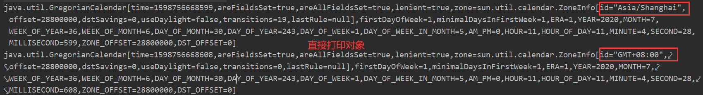

# Object

- Object就是这些对象的最高级别的，所有的Java对象都**隐式**地继承了Object对象(不用显示写`extends`继承)
- 所有的Java对象都**拥有Object默认的方法**。

方法：


| 方法                     | 说明                                                         |
| :----------------------- | :----------------------------------------------------------- |
| `Object clone()`         | 创建对象的副本                                               |
| `boolean equals(Object)` | 比较两个对象是否相等。默认比较的是地址值。                   |
| `void finalize()`        | 当垃圾回收器确定不存在对该对象的更多引用时，对象的圾回收器调用该方法 |
| `Class getClass()`       | 返回一个对象运行时的实例类（.class文件）                     |
| `int hashCode()`         | 返回该对象的散列码值                                         |
| `void notify()`          | 激活等待在该对象的监视器上的一个线程                         |
| `void notifyAll()`       | 激活等待在该对象的监视器上的全部线程                         |
| `String toString()`      | 返回该对象的字符串表示，默认返回运行时类名+@+对象的`hashCode`的16进制数 |
| `void wait()`            | 在其他线程调用此对象的 notify() 方法或 `notifyAll()` 方法前，导致当前线程等待 |

注意：

- 如果两个对象的哈希码值不同，那这两个对象一定不等；
- 如果两个对象的哈希码值相同，不能确保这两个对象一定相等。
- 克隆对象对应的类需要实现Cloneable接口，否则会报错：`java.lang.CloneNotSupportedException`

**如何获取类的字节码文件对象？**

1. `类名.class `： JVM将使用类装载器，将类装入内存(前提是类还没有装入内存)，不做类的初始化工作，返回Class的对象。
2. `Class.forName("类名字符串")` ：（注：类名字符串是包名+类名）装入类，并做类的静态初始化，返回Class的对象
3. `实例对象.getClass()`：对类进行静态初始化、非静态初始化； 返回引用o运行时真正所指的对象(因为:子对象的引用可能会赋给父对象的引用变量中) 所属的类的Class的对象

**常覆写Object类的3个方法：`toString(),equals(Object obj),hashCode()`**

> 以下部分属于多线程问题，还没学到这里

 **为什么notify(), wait()等函数定义在Object中，而不是Thread中?**

`Object`中的`wait()`,`notify()`等函数，和`synchronized`一样，会对“对象的同步锁”进行操作。

`wait()`会使“当前线程”等待，因为线程进入等待状态，所以线程应该释放它锁持有的“同步锁”，否则其它线程获取不到该“同步锁”而无法运行！
OK，线程调用`wait()`之后，会释放它锁持有的“同步锁”；而且，根据前面的介绍，我们知道：等待线程可以被`notify()`或`notifyAll()`唤醒。现在，请思考一个问题：`notify()`是依据什么唤醒等待线程的？或者说，`wait()`等待线程和`notify()`之间是通过什么关联起来的？答案是：依据“对象的同步锁”。

负责唤醒等待线程的那个线程(我们称为“**唤醒线程**”)，它只有在获取“该对象的同步锁”(**这里的同步锁必须和等待线程的同步锁是同一个**)，并且调用`notify()`或`notifyAll()`方法之后，才能唤醒等待线程。虽然，等待线程被唤醒；但是，它不能立刻执行，因为唤醒线程还持有“该对象的同步锁”。必须等到唤醒线程释放了“对象的同步锁”之后，等待线程才能获取到“对象的同步锁”进而继续运行。

总之，`notify()`, `wait()`依赖于“同步锁”，而“同步锁”是对象锁持有，并且每个对象有且仅有一个！这就是为什么`notify()`, `wait()`等函数定义在Object类，而不是`Thread类`中的原因。

# 包装类


所有的包装类都是`Nunber`的子类

| 包装类    | 基本数据类型 |
| :-------- | :----------- |
| Boolean   | boolean      |
| Byte      | byte         |
| Short     | short        |
| Integer   | int          |
| Long      | long         |
| Character | char         |
| Float     | float        |
| Double    | double       |

## 包装类、普通变量、String类互转

Java中包装类、普通变量、String类的相互转换如下：（非常重要！！！）


```java
public static void main(String[] args) {
    Integer integer = new Integer("123");
    System.out.println(integer+"    "+integer.getClass());
    int i=integer.intValue();
    System.out.println(i);

    float f=Float.parseFloat("0.52");
    System.out.println(f);
    String str=String.valueOf(f);
    System.out.println(f+"    "+str.getClass());
}
```


## 包装类的四则运算

> Float类不能像如下这样定义 

```java
public static void main(String[] args) {
    Integer num1=1;
    Integer num2=2;
    System.out.println(num1+num2);
    Short num3=3;
    System.out.println(num1+num3);
    Double num4=4.0;
    System.out.println((num1+num4)/num3);
}
```


**运算步骤是先开箱，用基本的数据类型进行计算，得到的计算结果再装箱**

## 包装类作为形参或返回值

```java
//包装类作为方法的形参、返回值
public static Integer intToInteger(int i) {
    return i;
}  
public static int integerToInt(Integer i) {
    return i;
}
```

## 空指针异常

```java
//注意包装类可能产生的空引用异常
Boolean flag1 = false;
System.out.println(flag1?"命题为真":"命题为假");
Boolean flag2 = null;
System.out.println(flag2?"命题为真":"命题为假");
Boolean flag3 = true;
```


这里只是简单演示空指针异常。平时使用时需要注意这一点，比如当Boolean的对象作为形参时，在方法执行体的头部需要做下null检测。

## 为何需要包装类

首先，Java语言是一个面向对象的语言，但是**Java中的基本数据类型却是不面向对象的**，将每个基本数据类型设计一个对应的类进行代表，这种方式增强了Java面向对象的性质。

其次，**如果仅仅有基本数据类型，那么在实际使用时将存在很多的不便，很多地方都需要使用对象而不是基本数据类型。**比如，在集合类中，我们是无法将`int 、double`等类型放进去的，因为集合的容器要求元素是Object类型。而包装类型的存在使得向集合中传入数值成为可能，包装类的存在弥补了基本数据类型的不足。

此外，包装类还为基本类型添加了属性和方法，丰富了基本类型的操作。如当我们想知道`int`取值范围的最小值，我们需要通过运算，有了包装类，我们可以直接使用`Integer.MAX_VALUE`即可。

比如定义在`Integer`类中的常量：


为什么要保留基本数据类型？

我们都知道在Java语言中，用**new关键字创建的对象是存储在堆里的，我们通过栈中的引用来使用这些对象，所以，对象本身来说是比较消耗资源的。**对于经常用到的类型，如`int`等，如果我们每次使用这种变量的时候都需要new一个对象的话，就会比较笨重了。所以，**Java提供了基本数据类型，这种数据的变量不需要使用new在堆上创建，而是直接在栈内存中存储，因此会更加高效。**

# String

## 构造方法

- `String()`：创建一个空的字符串
- `String(byte[] bys)`
- `String(char[] chs)`
- `String(byte[] bys,int offset,int length)`：通过字节数组一部分创建字符串
- `String(char[] chs,int offset,int length)`：通过字符数组一部分创建字符串
- `String(String original)`：通过字符串常量值创建字符串

## 成员方法

### 判断

+ `equals(Object obj)`：比较两个字符串是否相等
+ `equalsIngnoreCase(Object obj)`：忽略大小写比较两个字符串是否相等
+ `contains(String str)`：是否包含指定字符串
+ `startsWith(String str)`：是否以指定的字符串开头
+ `endWith(String str)`：是否以指定的字符串结尾
+ `isEmpty()`：是否为空
+ `matches(String regex)`：判断字符串是否匹配给定的正则表达式。

```java
public static void main(String[] args) {
    byte[] name=new byte[]{'H','e','l','l','o','A','l','i','c','e'};
    // 偏移量为offset=5，截取的字符串长度length=5
    String str1=new String(name,5,5);
    System.out.println(str1);

    String str2="alice";
    // 直接比较
    System.out.println(str1.equals(str2));
    // 忽略大小写比较
    System.out.println(str1.equalsIgnoreCase(str2));
    System.out.println(str1.contains("lic"));
    System.out.println(str1.startsWith("ice",2));
}
```


### 获取

- `length()`：获取长度
- `charAt(int index)`： 获取指定索引位置处的字符
- `indexOf(int ch)`：获取指定字符第一次出现的索引值(从0开始)
- `indexOf(int ch,int fromIndex)`：获取从指定索引位置开始，获取指定字符第一次出现的索引值
- `indexOf(String s)`：获取指定字符串第一次出现的索引值
- `indexOf(String s,int fromIndex)`：获取从指定索引位置开始，获取指定字符串第一次出现的索引值
- `lastIndexOf(int ch)`：获取指定字符最后一次出现的索引值
- `substring(int start)`：从指定位置开始一直截取到末尾
- `substring(int start,int end)`：截取[start,end-1]范围

```java
public static void main(String[] args) {
    String sentence = "You are the best in my heart.";
    System.out.println(sentence.length());
    // 获取指定下标位置的字符
    System.out.println(sentence.charAt(4));
    // 获取第一次出现的指定字符串的位置
    System.out.println(sentence.indexOf("the"));
    // 获取在下标为7之后最先一个字符e的位置
    System.out.println(sentence.indexOf('e', 7));
    // 获取在下标为12前最后一个字符e的位置
    System.out.println(sentence.lastIndexOf('e', 12));
    // 截取8~28的字符串
    System.out.println(sentence.substring(8,28));
}
```


### 转换

- `byte[] getBytes()`：将字符串转成字节数组
- `char[] toCharArray()`：将字符串转成字符数组
- `static valueOf(char[] chs)`：将`char[]`转成字符串
- `static valueOf(int num)`：将`int`类型转成字符串
- `static valueOf(Object obj)`：将任意类型转成字符串

> 关于基本变量类型、包装类、String类的转换详细见包装类里面的详细说明

- `toLowerCase()`：转成小写
- `toUpcase()`：转成大写
- `concat(String str)`：字符连接

### 其他
- `replace(char old,char new)`：将old字符替换成new字符
- `replace(String old,String new)`：将old字符串替换成new字符串
- `trim()`：去除两边空格
- `int compareTo(String s)`：**字典比较**，如果前面值小于后面值返回负数，否则返回正数，先比较第一个元素，如果相等再比较第二个元素……返回元素之间的差值；如果比较字符串有包含关系，返回的值是它们长度的差值
- `int compareToIgnoreCase(String s)`：**忽略大小写字典比较**

`compareTo`的源码如下：

```java
public int compareTo(String anotherString) {
    int len1 = value.length;
    int len2 = anotherString.value.length;
    int lim = Math.min(len1, len2);
    char v1[] = value;
    char v2[] = anotherString.value;

    int k = 0;
    while (k < lim) {
        char c1 = v1[k];
        char c2 = v2[k];
        if (c1 != c2) {
            return c1 - c2;
        }
        k++;
    }
    return len1 - len2;
}
```

> 以下四个方法均需要用到正则表达式

- `String replaceAll(String regex, String replacement)`：使用给定的 replacement 替换此字符串所有匹配给定的正则表达式的子字符串。
- `String replaceFirst(String regex, String replacement)`：使用给定的 replacement 替换此字符串匹配给定的正则表达式的第一个子字符串。
- `String[] split(String regex)`： 根据给定正则表达式的匹配拆分此字符串。
- `String[] split(String regex, int limit)`： 根据匹配给定的正则表达式来拆分此字符串。

测试代码：

```java
public class StringTest {
    public static void main(String[] args) {
        String sentence = " You are so ugly. ";
        // 用new更改old字符串的一部分
        System.out.println(sentence.replace("ugly","beautiful"));
        // 返回sentence去掉两边空格的字符串,trim方法并不改变字符串本身
        System.out.println(sentence.trim());
        /**
         * 若按照以下方式使用不会有改变
         * sentence.trim()
         * System.out.println(sentence);
         */
        System.out.println(sentence.compareTo(" you are so ugly. "));
    }
}
```


## StringBuffer

为何明明有`String`类了还要引入`StringBuilder`类？

String类是不可变类，即一旦一个String对象被创建以后，包含在这个对象中的字符序列是不可改变的，直至这个对象被销毁。

```java
String a = "123";
a = "456";
// 打印出来的a为456
System.out.println(a)
```


可以看出来，再次给a赋值时，并不是对原来堆中实例对象进行重新赋值，而是生成一个新的实例对象，并且指向“456”这个字符串，a则指向最新生成的实例对象，之前的实例对象仍然存在，如果没有被再次引用，则会被垃圾回收。

`StringBuffer`对象则代表一个字符序列可变的字符串，当一个`StringBuffer`被创建以后，通过`StringBuffer`提供的`append()、insert()、reverse()、setCharAt()、setLength()`等方法可以改变这个字符串对象的字符序列。一旦通过`StringBuffer`生成了最终想要的字符串，就可以调用它的`toString()`方法将其转换为一个`String`对象。

```java
StringBuffer b = new StringBuffer("123");
b.append("456");
// b打印结果为：123456
System.out.println(b);
```


成员方法：

- `int capacity()`：获取容量
- `int length()`：获取长度
- `append(int value)`：追加。可以追加多种类型
- `insert(int offset,String s)`：在指定的位置插入指定数据
- `deleteCharAt(int index)`：删除指定索引处的元素
- `delete(int start,int end)`：删除[start,start-1]范围内的元素
- `replace(int start,int end,String s)`：将[start,end-1]范围内的元素替换成指定字符串
- `reverse()`：元素反转
- `String subString(int start)`：截取指定位置一直到末尾
- `String subString(int start,int end)`：截取[start,end-1]范围

## StringBuilder

`StringBuilder`类也代表可变字符串对象。实际上，`StringBuilder`和`StringBuffer`基本相似，两个类的构造器和方法也基本相同。不同的是：**`StringBuffer`是线程安全的，而`StringBuilder`则没有实现线程安全功能，所以性能略高。**

那么`StringBuffer`是如何实现线程安全的呢？

`StringBuffer`类中实现的方法：

`StringBuffer`类中实现的方法：


`StringBuilder`类中实现的方法：


由此可见，`StringBuffer`类中的方法都添加了**`synchronized`关键字**，也就是给这个方法添加了一个锁，用来保证线程安全。

> **`String`、`StringBuilder`和`StringBuffer`的区别？**
>
> - `String`内容不可改变
> - `StringBuilder`和`StringBuffer`内容可变
> - `StringBuilder`是线程不安全的，不同步，效率高
> - `StringBuffer`是线程安全的，同步，效率低

# 日期时间类

## Date

`Date`类中很多方法被弃用了，尽量别使用


构造方法：

- `Date()`：以当前时间毫秒值创建Date对象
- `Date(long time)`：以指定的毫秒值创建Date对象

成员方法：

- `long getTime()`：获取Date对象的毫秒值
- `setTime(long time)`：设置Data对象的毫秒值
- `before(Date date)`：指定时间在date后返回true
- `after(Date date)`：指定时间在date前返回true

```java
public static void main(String[] args) {
    // 时间以1970 年 1 月 1 日 00:00:00 GMT 为基准来计算
    Date date = new Date(); //内部调用的是System的currentTimeMillis()方法
    Date d = new Date(1432356666666L); //某一时间的毫秒数
    System.out.println(date.toString());
    System.out.println(d.toString());
    System.out.println(System.currentTimeMillis()); // 当前系统时间的毫秒数
    System.out.println(date.getTime()); // 当前系统时间的毫秒数
    // 日期时间的比较
    System.out.println(date.after(d)); //true  date在指定时间之后则返回 true
    System.out.println(date.before(d));//false date在指定时间之前则返回 true
    System.out.println(date.equals(d));//false 比较两个日期的相等性

    System.out.println(date.compareTo(d)); // 1
    // 比较当调用此方法的Date对象和指定日期。
    // 两者相等时候返回0。
    // 调用对象在指定日期之前则返回负数。
    // 调用对象在指定日期之后则返回正数。
    System.out.println(date.toInstant());
}
```


## Calendar

常用的常量：

| 常量                     | 描述                         |
| ------------------------ | ---------------------------- |
| `Calendar.AM`            | 上午则返回1                  |
| `Calendar.PM`            | 下午则返回1                  |
| `Calendar.YEAR`          | 年份                         |
| `Calendar.MONTH`         | 月份                         |
| `Calendar.DATE`          | 日期                         |
| `Calendar.HOUR`          | 小时(12小时制)               |
| `Calendar.MINUTE`        | 分钟                         |
| `Calendar.SECOND`        | 秒                           |
| `Calendar.WEEK_OF_YEAR`  | 年内的某星期                 |
| `Calendar.WEEK_OF_MONTH` | 月内的某星期                 |
| `Calendar.DAY_OF_YEAR`   | 年内的某天                   |
| `Calendar.DAY_OF_MONTH`  | 月内的某天                   |
| `Calendar.DAY_OF_WEEK`   | 星期内的某天(从周日开始计算) |
| `Calendar.HOUR_OF_DAY`   | 小时(24小时制)               |

常见方法：

`static Calender getInstance()`：里面调用了**私有静态方法**`createCalendar()`，以默认时区和语言创建日历。

`int get(int field)`：获取指定字段的日历值

`set(int field,int value)`：给指定的日历字段设置指定的值

`set(int year,int month,int date)`：设置年月日

`Date getTime()`：获取日历对象的日期

`setTime(Date d)`：设置日历对象的日期

`add(int field,int amount)`：对指定的日历字段添加指定的值

> 至于这些方法内部源码通过调用其他方法的实现就不一一探究了

```java
// 获取当前时间的日历对象
Calendar c = Calendar.getInstance();
//获取东八区的日历实例对象
Calendar c1 = Calendar.getInstance(TimeZone.getTimeZone("GMT+08:00"));
System.out.println(c);
System.out.println(c1);
```



```java
public static void main(String[] args) {
    Calendar c = Calendar.getInstance(); // 获取当前时间的日历对象
    Calendar c1 = Calendar.getInstance(TimeZone.getTimeZone("GMT+08:00")); //获取东八区的日历实例对象
    System.out.println("年份："+c.get(Calendar.YEAR));
    System.out.println("月份："+(c.get(Calendar.MONTH)+1));// 月份,需要+1
    System.out.println("日期："+c.get(Calendar.DATE));
    System.out.println("AM="+c.get(Calendar.AM)+",PM="+c.get(Calendar.PM)+",AM_PM="+c.get(Calendar.AM_PM));
    System.out.println("时:"+c.get(Calendar.HOUR));
    System.out.println("分:"+c.get(Calendar.MINUTE));
    System.out.println("秒:"+c.get(Calendar.SECOND));
    System.out.println("毫秒:"+c.get(Calendar.MILLISECOND));
    //--------------------------------------------------------------------------
    System.out.println(c.getTime()); // 返回一个Date类型的时间 Sun Aug 30 11:04:28 CST 2020
    System.out.println(c.getTimeInMillis()); // 返回当前时间的毫秒数
    System.out.println(c.getTimeZone().getID()); // Asia/Shanghai 返回时区ID
}
```


## SimpleDateFormat

**`SimpleDateFormat`继承抽象类`DateFormat`。** 是一个以与语言环境有关的方式来格式化和解析日期的具体类，且**非线程安全**。它允许进行格式化（日期 -> 文本）、解析（文本 -> 日期）和规范化。使得可以选择任何用户定义的日期-时间格式的模式。
日期和时间的格式化编码：

| 字母 | 描述            | 表示              | 示例                    |
| ---- | --------------- | ----------------- | ----------------------- |
| y    | 年份            | Year              | 2018；18                |
| M    | 月份            | Month             | July; Jul; 07           |
| d    | 月内的日期      | Number            | 10                      |
| h    | 12小时制(1~12)  | Number            | 12                      |
| H    | 24小时制 (0~23) | Number            | 22                      |
| m    | 分钟数          | Number            | 30                      |
| s    | 秒数            | Number            | 55                      |
| S    | 毫秒数          | Number            | 234                     |
| E    | 星期几          | Text              | Tuesday                 |
| D    | 年内的天数      | Number            | 180                     |
| F    | 月内的星期      | Number            | 2 (second Wed. in July) |
| w    | 年内的周数      | Number            | 40                      |
| W    | 月内的周数      | Number            | 1                       |
| a    | AM/PM 标记      | Text              | PM                      |
| k    | 24小时制(1~24)  | Number            | 24                      |
| K    | 12小时制(0~11)  | Number            | 10                      |
| z    | 时区            | General time zone | Eastern Standard Time   |

上述的模式字母通常是重复的，其数量确定其精确表示：

- **Text**：格式化来说，字母数量大于等于4，则使用完全形式；否则，在可用的情况下使用短形式或缩写形式。解析来说，两种形式都是可接受的，与字母的数量无关
- **Number**：格式化来说，字母的数量是最小的数位，如果数位不够，则用 0 填充以达到此数量。解析来说，字母的数量被忽略，除非必须分开两个相邻字段。
- **Year**：格式器的 Calendar 是格里高利历，则应用以下规则:
   格式化来说，如果字母的数量为 2，则年份截取为 2 位数,否则将年份解释为 number。
   解析来说，如果字母的数量大于 2，则年份照字面意义进行解释，而不管数位是多少.
- **Month**: 如果字母的数量为 3 或大于 3，则将月份解释为 text；否则解释为 number。
- **General time zone**: 如果时区有名称，则将它们解释为 text。

构造方法：

`SimpleDateFormat()`：以默认模式创建对象

`SimpleDateFormat(String pattern)`：以指定模式创建对象

常用模式：
`yyyy:年    MM:月   dd:日`

`HH:时   mm:分   ss:秒`

常用成员方法：

`String format(Date date)`：格式化

`Date parse(String time)`：解析

```java
public static void main(String[] args) {
    // 假设不加Locale.ENGLISH，默认则以本系统语言(中文)显示
    Date d = new Date();
    // 年份，月份，日，星期，小时，分钟，秒全显示(数位不够，则用 0 填充)。
    SimpleDateFormat sdf = new SimpleDateFormat("yyyy/MM/dd a EEEE hh:mm:ss.SSS z ",Locale.ENGLISH);
    System.out.println(sdf.format(d));
    // 年份只取后两位，月份为Text且简写
    SimpleDateFormat sdf1 = new SimpleDateFormat("yy/M/d a E h:m:s.S z ", Locale.ENGLISH);
    System.out.println(sdf1.format(d));
    //使用printf()方法
    System.out.printf("%tc%n",d);
    System.out.printf("%tF%n",d);
    System.out.printf("%tD%n",d);
    System.out.printf("%tT%n",d);
    System.out.printf("%tr%n",d);
    System.out.printf("%tR%n",d);
}
```


# Random

构造方法：

`Random()`：以当前时间毫秒值作为种子，创建Random对象

`Random(long seed)`：以指定种子创建Random对象

成员方法：

`nextInt()`：生成1个`int`类型范围的随机数

`nextInt(int n)`：产生1个[0,n-1]范围内的随机数

生成0~n之间的数：

①`(int)Math.random()*(n+1)`

> `random()`方法是Math类下的，生成范围是[0.0,1.0]的随机数

②`Random r = new Random();`
`r.nextInt(m)`表示生成[0,m-1]之间的随机数，也就是说`random.nextInt(m+1)`，将生成[0,m]之间的随机整数。

生成n~m之间的随机数：

①`n+(int)(Math.random()*(m-n));`


②`Random r = new Random(); r.nextInt(m-n+1)+n;`


