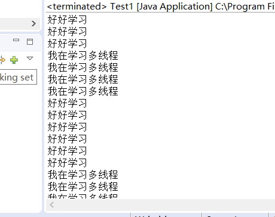
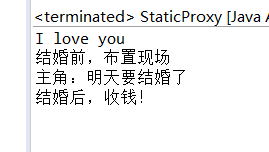
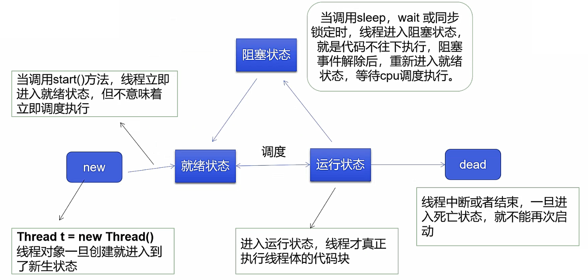
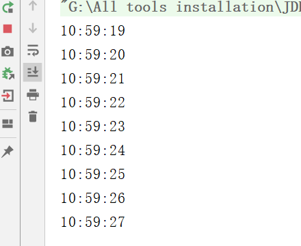
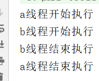
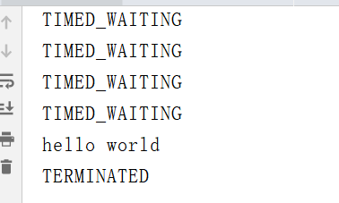

# Thread类常用的构造方法
```java
public Thread(Runnable target,String name);
```
target - 启动此线程时调用其run方法的对象。 如果null ，则调用此线程的run方法。 
name - 新线程的名称 


# 执行新线程的两种途径

## 声明为Thread类

1. 想要开启多线程的代码运行逻辑，就写到run()方法里面
2. 通过Thread对象的start()方法启动线程


```java
package testups;

//创建线程方式一：继承Threads类，重写run()方法，调用start开启线程
public class Test1 extends Thread {
	@Override
	public void run() {
		for (int i = 0; i < 1000; i++) {
			System.out.println("好好学习");
		}

	}
	public static void main(String[] args) {
		// main线程，主线程
		Test1 test1 = new Test1();
		test1.start();
		for (int i = 0; i <= 1000; i++) {
			System.out.println("我在学习多线程");
		}
	}
}
```



## Runnable接口

1. 定义`MyRunnable`类实现Runnable接口
2. 实现run()方法，编写线程执行体
3. 创建线程对象，调用start()方法启动线程

```java
package testups;

//创建方法2：实现runnable接口，重写run方法，执行线程需要丢入runnable接口实现类，调用start方法
public class Test2 implements Runnable {
    
    @Override
	public void run() {
		for (int i = 0; i < 100; i++) {
			System.out.println("好好学习" + i);
		}
	}
	public static void main(String[] args) {
		//创建Runnable接口实现类对象
		Test2 test2=new Test2();
		//创建线程对象，通过线程对象开启线程，代理
		Thread t =new Thread(test2);
		t.start();
		//以上两句可总结为：new Thread(test2).start();
		
		for (int i = 0; i < 2000; i++) {
			System.out.println("纸上得来终觉浅"+i);
		}
	}
}
```

## 两种方式的对比

| Thread类                            | Runnable接口                              |
| ----------------------------------- | ----------------------------------------- |
| 子类继承Thread类具备多线程能力      | 实现Runnable接口具备多线程能力            |
| 启动线程：子类对象.start()          | 启动线程：传入目标对象+Thread对象.start() |
| **不建议使用：避免OOP单继承局限性** | **建议使用：可以一个对象被多个线程使用**  |

# 静态代理

你：真实角色

婚庆公司：代理处理结婚的事

结婚：都实现结婚的接口

```java
package testups;

/**
 * 静态代理模式总结： 真实对象和代理对象都要实现同一个接口 代理对象要代理真实角色
 * 
 * 好处： 处理对象可以做很多真实对象做不了的事情 真实对象专注做自己的事情
 * 
 * @author asus
 *
 */


public class StaticProxy {
	public static void main(String[] args) {
		You you = new You();
		new Thread( () -> System.out.println("I love you")).start();
		new WeddingCampany(you).HappyMarry();
		
		/*
		 * WeddingCampany weddingCampany=new WeddingCampany(new You());
		 * weddingCampany.HappyMarry();
		 */
	}
}

interface Marry {
	void HappyMarry();
}

//真实角色，你去结婚
class You implements Marry {

	@Override
	public void HappyMarry() {
		System.out.println("主角：明天要结婚了");
	}
}

//代理角色，帮你结婚
class WeddingCampany implements Marry {
    //代理谁，->真实目标角色
	private Marry target;

	public WeddingCampany(Marry t) {
		this.target = t;
	}

	@Override
	public void HappyMarry() {
		Before();
		this.target.HappyMarry();  //这就是真实对象
		After();
	}

	private void Before() {
		System.out.println("结婚前，布置现场");
	}

	private void After() {
		System.out.println("结婚后，收钱！");
	}
}
```


# λ表达式

```java
new Thread( () -> System.out.println("I love you")).start();
```

## 啥是函数式接口？

1. 任何接口，如果只包含唯一抽象的方法，那么它就是函数式接口
2. 任何函数式接口，都可以通过λ表达式来创建该接口的对象

## λ表达式的演化过程

```java
package testups;

public class lamda {

	// 3.静态内部类
	static class Test2 implements Ilike {

		@Override
		public void Lambda() {
			System.out.println("I like lambda-2");

		}
	}

	public static void main(String[] args) {
		Ilike like = new Test();
		like.Lambda();

		like = new Test2();
		like.Lambda();

		// 4.局部内部类
		class Test3 implements Ilike {
			@Override
			public void Lambda() {
				System.out.println("I like lambda-3");
			}
		}

		like = new Test3();
		like.Lambda();

		// 5.匿名内部类
		like = new Ilike() {
			@Override
			public void Lambda() {
				System.out.println("I like lambda-4");
			}
		};
		like.Lambda();

		// 6.用lambda简化
		like = () -> {
			System.out.println("I like lambda-5");
		};
		like.Lambda();
	}

}

//1.定义函数式接口
interface Ilike {
	void Lambda();
}

//2.实现类
class Test implements Ilike {

	@Override
	public void Lambda() {

		System.out.println("I like lambda-1");
	}
}
```

## 带参数的λ表达式：

```java
public class Test1 {
    public static void main(String[] args) {
        Ilove love = (int a, String str) -> {
            System.out.println(str + "I love you " + a);
        };
        love.love(520, "小芳,");
    }

}

interface Ilove {
    void love(int a, String str);
}
```

# 线程状态



## 停止线程

1. 不推荐使用JDK提供的stop、destroy方法【已废弃】
2. 推荐线程自己停止下来
3. 建议使用一个标志位进行终止变量，当flag=false，则终止线程运行

```java
public class TestStop implements Runnable {
    //1.设置一个标示位
    private boolean flag = true;

    @Override
    public void run() {
        int i = 0;
        while (flag) {
            System.out.println("Tread...run" + i);
            i++;
        }
    }

    //2.设置公开方法停止线程，转换标志位
    public void stop() {
        this.flag = false;
    }

    public static void main(String[] args) {
        TestStop testStop = new TestStop();
        new Thread(testStop).start();
        for (int i = 0; i < 100; i++) {
            System.out.println("main线程");
            if (i == 90) {
                //调用stop方法切换标志位，停止线程
                testStop.stop();
                System.out.println("线程停止了。。。");
            }
        }
    }

}
```

## 线程阻塞

1. sleep(时间)指定当前线程阻塞的毫秒数
2. sleep存在异常`InterruptedException`
3. sleep时间达到后线程进入就绪状态
4. sleep可以模拟网络延时，倒计时等
5. **每一个对象都有一个锁，sleep不会释放锁**

```java
import java.text.SimpleDateFormat;
import java.util.Date;

public class TestSleep {
    public static void main(String[] args) {
        Date starttime=new Date(System.currentTimeMillis());//获取系统当前时间
        while (true){
            try {
                Thread.sleep(1000);
                System.out.println(new SimpleDateFormat("HH:mm:ss").format(starttime));
                starttime = new Date(System.currentTimeMillis());
            } catch (InterruptedException e) {
                e.printStackTrace();
            }
        }
    }
}
```



## 线程礼让

1. 让当前正执行的线程暂停，但不阻塞
2. 将线程从运行状态转为就绪状态
3. **让CPU重新调度，礼让不一定成功！**

```java
public class TestYield {
    public static void main(String[] args) {
        MyYield myYield=new MyYield();
        new Thread(myYield,"a").start();
        new Thread(myYield,"b").start();
    }
}

class MyYield implements Runnable {

    @Override
    public void run() {
        System.out.println(Thread.currentThread().getName() + "线程开始执行");
        Thread.yield();
        System.out.println(Thread.currentThread().getName() + "线程结束执行");
    }
}
```

礼让成功：



礼让未成功：


## 线程强制执行（插队）

```java
public class TestJoin implements Runnable{
    @Override
    public void run() {
        for (int i = 0; i < 5; i++) {
            System.out.println("线程插队"+i);
        }
    }

    public static void main(String[] args) throws InterruptedException {
        //启动线程
        TestJoin testJoin=new TestJoin();
        Thread thread=new Thread(testJoin);
        thread.start();
        //主线程
        for (int i = 0; i < 50; i++) {
            if (i==20)
                thread.join();
            System.out.println("主线程执行"+i);
        }
    }
}
```


## 观测线程状态

+ **线程一旦进入死亡状态就不能再启动了**

```java
//观察测试线程状态
public class TestState {
    public static void main(String[] args) throws InterruptedException {
        Thread thread = new Thread(() -> {
            for (int i = 0; i < 5; i++) {
                try {
                    Thread.sleep(1000);
                } catch (InterruptedException e) {
                    e.printStackTrace();
                }
                System.out.println("hello world");
            }
        });

        //观察状态
        Thread.State state = thread.getState();
        System.out.println(state); //NEW

        //观察启动后
        thread.start();
        state = thread.getState();
        System.out.println();

        while (state!=Thread.State.TERMINATED) {//只要线程不终止，就一直输出状态
            Thread.sleep(100);
            state = thread.getState(); //更新线程状态
            System.out.println(state); //输出状态
        }
    }
}
```


## 线程优先级

1. Java提供一个线程调度器来监控程序中启动后进入就绪状态的所有线程，线程调度器按照优先级决定应该调度哪个线程执行

2. 线程优先级用数字表示，范围是0~10

```java
Thread.MIN_PRIORITY=1;
Thread.MAX_PRIORITY=10;
Thread.MAX_PRIORITY=5;
```

3. 使用`getPriority().setPriority(int xxx)`改变或获取优先级
4. 优先级的设置最好在start()前

# 线程同步

## synchronized

```java
public class UnsafeBuyTickets {
    public static void main(String[] args) {
        Buytickets station = new Buytickets();
        new Thread(station, "苦逼的我").start();
        new Thread(station, "牛逼的你").start();
        new Thread(station, "可恶的黄牛党").start();
    }
}

class Buytickets implements Runnable {
    private int ticketsNum = 10;
    boolean flag = true;

    @Override
    public void run() {
        while (flag) {
            try {
                buy();
            } catch (InterruptedException e) {
                e.printStackTrace();
            }
        }
    }
    //synchronized同步方法，锁的是this
    private synchronized void buy() throws InterruptedException {
        if (ticketsNum <= 0) {
            flag = false;
            return;
        }
        Thread.sleep(100);
        System.out.println(Thread.currentThread().getName() + "拿到" + ticketsNum--);
    }
}
```

在并发编程中存在线程安全问题，主要原因有：

1. 存在共享数据

2. 多线程共同操作共享数据。

关键字synchronized可以保证在同一时刻，只有一个线程可以执行某个方法或某个代码块，同时synchronized可以保证一个线程的变化可见（可见性）。

Java中每一个对象都可以作为锁，这是synchronized实现同步的基础：

1. 普通同步方法（实例方法），锁是当前实例对象 ，进入同步代码前要获得当前实例的锁
2. 静态同步方法，锁是当前类的class对象 ，进入同步代码前要获得当前类对象的锁
3. 同步方法块，锁是括号里面的对象，对给定对象加锁，进入同步代码库前要获得给定对象的锁。