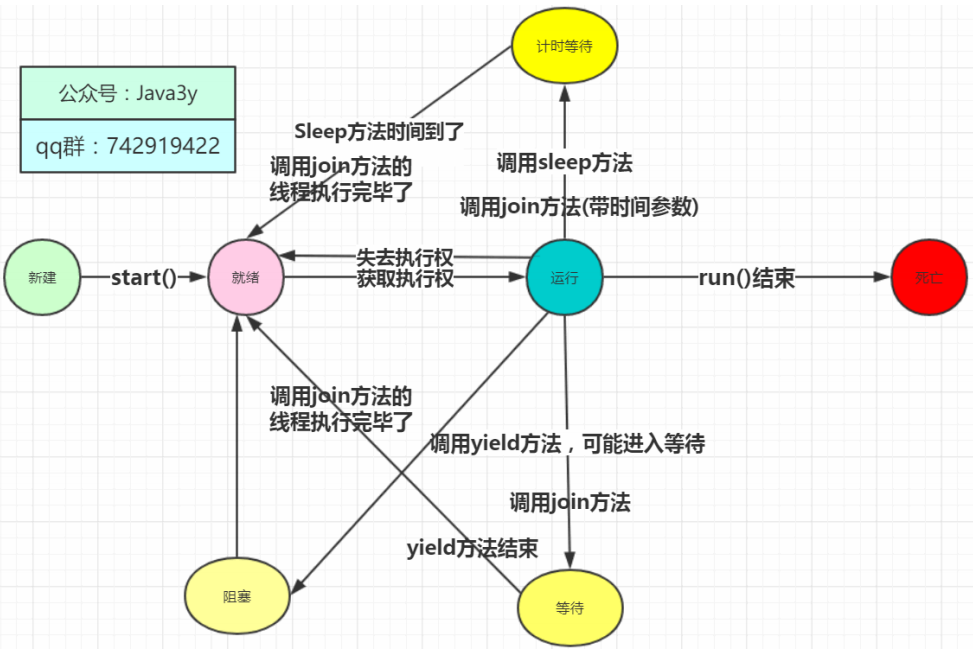
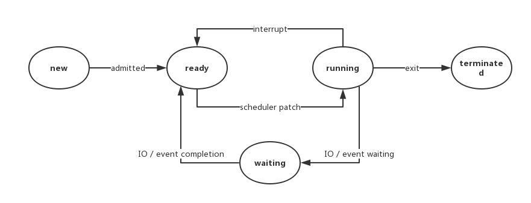
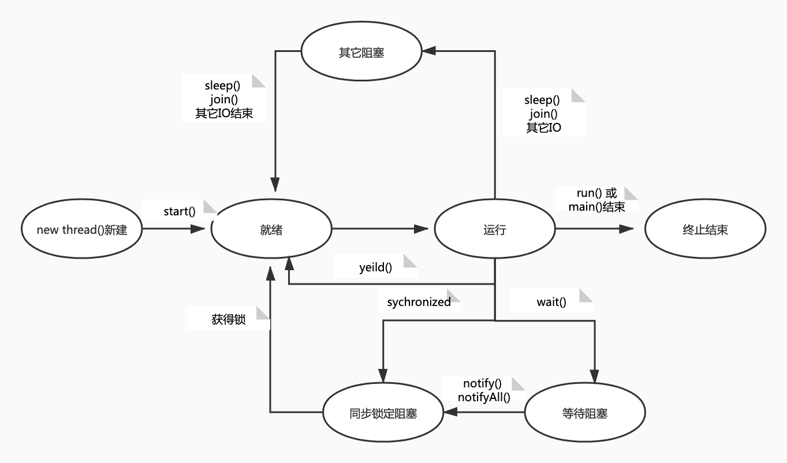
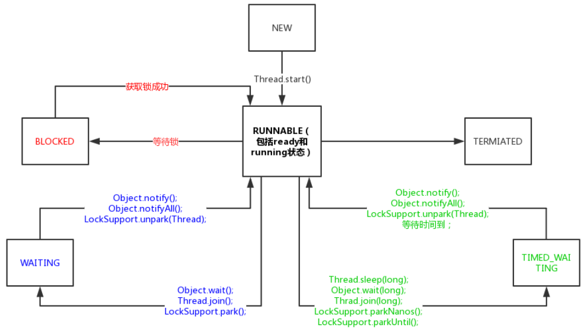
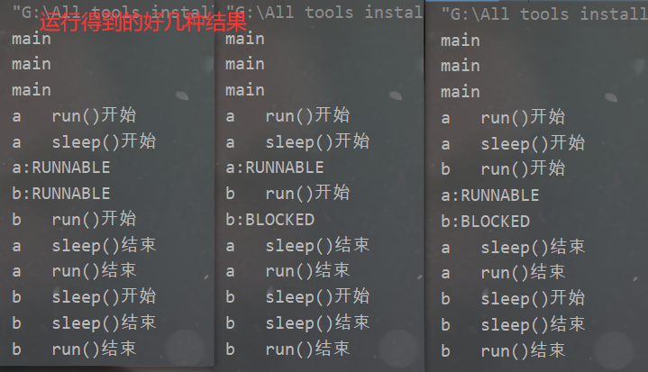

> 这篇文章写的不错，供作参考：https://blog.csdn.net/qq_35598736/article/details/108431422

# 一、多线程的基本使用

## 定义任务、创建和运行线程

定义任务

- 继承Thread类 （可以说是 将任务和线程合并在一起）
- 实现Runnable接口 （可以说是 将任务和线程分开了）
- 实现Callable接口（利用`FutureTask`执行任务）

Thread实现任务的局限性

- 任务逻辑写在Thread类的run方法中，有单继承的局限性
- 创建多线程时，每个任务有成员变量时不共享，必须加static才能做到共享

Runnable和Callable解决了Thread的局限性

但是Runnable相比Callable有以下的局限性

1. 任务没有返回值
2. 任务无法抛异常给调用方

如下代码，几种定义线程的方式：

```java
class T extends Thread {
    @Override
    public void run() {
        System.out.println("我是继承Thread的任务");
    }
}

class R implements Runnable {

    @Override
    public void run() {
        System.out.println("我是实现Runnable的任务");
    }
}

class C implements Callable<String> {

    @Override
    public String call() throws Exception {
        System.out.println("我是实现Callable的任务");
        return "success";
    }
}
```

创建线程的方式

1. 通过Thread类直接创建线程
2. 利用线程池内部创建线程

启动线程的方式

- 调用线程的start()方法

```java
// 启动继承Thread类的任务
new T().start();
// 启动继承Thread匿名内部类的任务 可用lambda优化
Thread t = new Thread(){
  @Override
  public void run() {
    System.out.println("我是Thread匿名内部类的任务");
  }
};


// 启动实现Runnable接口的任务
new Thread(new R()).start();
// 启动实现Runnable匿名实现类的任务
new Thread(new Runnable() {
    @Override
    public void run() {
        System.out.println("我是Runnable匿名内部类的任务");
    }
}).start();
// 启动实现Runnable的lambda简化后的任务
new Thread(() -> System.out.println("我是Runnable的lambda简化后的任务")).start();


// 启动实现了Callable接口的任务,结合FutureTask可以获取线程执行的结果
FutureTask<String> target = new FutureTask<>(new C());
new Thread(target).start();
System.out.println(target.get());
```

## Thread类

### 构造方法

查看`Thread`类源码的构造方法：

```java
// Thread类源码 

// 片段1 - init方法
private void init(ThreadGroup g, Runnable target, String name,
                      long stackSize, AccessControlContext acc,
                      boolean inheritThreadLocals)

// 片段2 - 构造函数调用init方法
public Thread(Runnable target) {
    init(null, target, "Thread-" + nextThreadNum(), 0);
}

// 片段3 - 使用在init方法里初始化AccessControlContext类型的私有属性
this.inheritedAccessControlContext = 
    acc != null ? acc : AccessController.getContext();

// 片段4 - 两个对用于支持ThreadLocal的私有属性
ThreadLocal.ThreadLocalMap threadLocals = null;
ThreadLocal.ThreadLocalMap inheritableThreadLocals = null;
```

我们挨个来解释一下`init`方法的这些参数：

- g：线程组，指定这个线程是在哪个线程组下；

- target：指定要执行的任务；

- name：线程的名字，多个线程的名字是可以重复的。如果不指定名字，见片段2；

- acc：见片段3，用于初始化私有变量`inheritedAccessControlContext`。

  > 这个变量有点神奇。它是一个私有变量，但是在`Thread`类里只有`init`方法对它进行初始化，在`exit`方法把它设为`null`。其它没有任何地方使用它。一般我们是不会使用它的，那什么时候会使用到这个变量呢？可以参考这个stackoverflow的问题：[Restrict permissions to threads which execute third party software](https://stackoverflow.com/questions/13516766/restrict-permissions-to-threads-which-execute-third-party-software)；

- inheritThreadLocals：可继承的`ThreadLocal`，见片段4，`Thread`类里面有两个私有属性来支持`ThreadLocal`，我们会在后面的章节介绍`ThreadLocal`的概念。

实际情况下，我们大多是直接调用下面两个构造方法：

```java
Thread(Runnable target)
Thread(Runnable target, String name)
```

### 常用方法

| 方法名称          | 是否static | 方法说明                                                     |
| ----------------- | ---------- | ------------------------------------------------------------ |
| start()           | 否         | 让线程启动，进入就绪状态，等待cpu分配时间片                  |
| run()             | 否         | 重写Runnable接口的方法，线程获取到cpu时间片时执行的具体逻辑  |
| yield()           | 是         | 线程的礼让，使得获取到cpu时间片的线程进入就绪状态，重新争抢时间片 |
| sleep(time)       | 是         | 线程休眠固定时间，进入阻塞状态，休眠时间完成后重新争抢时间片,休眠可被打断 |
| join()/join(time) | 否         | 调用线程对象的join方法，调用者线程进入阻塞,等待线程对象执行完或者到达指定时间才恢复，重新争抢时间片 |
| isInterrupted()   | 否         | 获取线程的打断标记，true：被打断，false：没有被打断。调用后不会修改打断标记 |
| interrupt()       | 否         | 打断线程，抛出InterruptedException异常的方法均可被打断，但是打断后不会修改打断标记，正常执行的线程被打断后会修改打断标记 |
| interrupted()     | 否         | 获取线程的打断标记，调用后会清空打断标记                     |
| stop()            | 否         | 停止线程运行，不推荐                                         |
| suspend()         | 否         | 挂起线程，不推荐                                             |
| resume()          | 否         | 恢复线程运行，不推荐                                         |
| currentThread()   | 是         | 获取当前线程                                                 |



## Object中与线程相关的方法

| 方法名称                  | 方法说明                               |
| ------------------------- | -------------------------------------- |
| wait()/wait(long timeout) | 获取到锁的线程进入阻塞状态             |
| notify()                  | 随机唤醒被wait()的一个线程             |
| notifyAll();              | 唤醒被wait()的所有线程，重新争抢时间片 |

# 二、线程组和线程优先级

## ThreadGroup

Java中用ThreadGroup来表示线程组，我们可以使用线程组对线程进行批量控制。

ThreadGroup和Thread的关系就如同他们的字面意思一样简单粗暴，每个Thread必然存在于一个ThreadGroup中，Thread不能独立于ThreadGroup存在。**执行main()方法线程的名字是main，如果在new Thread时没有显式指定，那么默认将父线程（当前执行new Thread的线程）线程组设置为自己的线程组。**

ThreadGroup管理着它下面的Thread，ThreadGroup是一个标准的**向下引用**的树状结构，这样设计的原因是**防止"上级"线程被"下级"线程引用而无法有效地被GC回收**。

## 线程的优先级

Java默认的线程优先级为5，线程的执行顺序由调度程序来决定，线程的优先级会在线程被调用之前设定。

通常情况下，高优先级的线程将会比低优先级的线程有**更高的几率**得到执行。我们使用方法`Thread`类的`setPriority()`实例方法来设定线程的优先级。

```java
Thread b = new Thread();
b.setPriority(10);
```

其实，这个优先级并不是特别可靠。。。

**Java程序中对线程所设置的优先级只是给操作系统一个建议，操作系统不一定会采纳。而真正的调用顺序，是由操作系统的线程调度算法决定的**。

守护进程：

> 守护进程是脱离于终端并且在后台运行的进程，脱离终端是为了避免在执行的过程中的信息在终端上显示，并且进程也不会被任何终端所产生的终端信息所打断。
>
> 如果某线程是守护线程，那如果所有的非守护线程结束，这个守护线程也会自动结束。
>
> 应用场景是：当所有非守护线程结束时，结束其余的子线程（守护线程）自动关闭，就免去了还要继续关闭子线程的麻烦。
>
> 一个线程默认是非守护线程，可以通过Thread类的setDaemon(boolean on)来设置。

```java
public static void main(String[] args) {
    ThreadGroup threadGroup = new ThreadGroup("t1");
    threadGroup.setMaxPriority(6);
    Thread thread = new Thread(threadGroup,"thread");
    thread.setPriority(9);
    System.out.println("我是线程组的优先级"+threadGroup.getMaxPriority());
    System.out.println("我是线程的优先级"+thread.getPriority());
}
```

线程优先级必须小于等于线程组的优先级

## ThreadGroup方法

`Thread.currentThread().getThreadGroup().getName()`【静态方法】：获取线程组的名字

`activeCount()`：返回此线程组及其子组中活动线程的数量的估计值

`enumerate(ThreadGroup list[]);`：复制线程组

线程组统一异常处理：

> 这个暂且看不懂在干啥

```java
package com.func.axc.threadgroup;

public class ThreadGroupDemo {
    public static void main(String[] args) {
        ThreadGroup threadGroup1 = new ThreadGroup("group1") {
            // 继承ThreadGroup并重新定义以下方法
            // 在线程成员抛出unchecked exception
            // 会执行此方法
            public void uncaughtException(Thread t, Throwable e) {
                System.out.println(t.getName() + ": " + e.getMessage());
            }
        };

        // 这个线程是threadGroup1的一员
        Thread thread1 = new Thread(threadGroup1, new Runnable() {
            public void run() {
                // 抛出unchecked异常
                throw new RuntimeException("测试异常");
            }
        });

        thread1.start();
    }
}
```

# 三、线程状态及转换方法

## 状态转化

操作系统中，有如下5状态模型：



## Java中的6个状态

!> 在Java中对状态进行的小修改

```java
// Thread.State 源码
public enum State {
    NEW,
    RUNNABLE,
    BLOCKED,
    WAITING,
    TIMED_WAITING,
    TERMINATED;
}
```

有如下测试代码，可以回答两个问题：

+ 反复调用同一个线程的start()方法是否可行？
+ 假如一个线程执行完毕（此时处于TERMINATED状态），再次调用这个线程的start()方法是否可行？

```java
public class Demo{
	public static void main(String[] args) {
        // 函数式编程，实现Runnable接口
        Thread thread = new Thread(() -> {
            System.out.println("启动~~~");
        });

        try {
            System.out.println(thread.getState()); // New
            thread.start(); // 第一次调用
            System.out.println(thread.getState()); // Runnable
            thread.start(); // 第二次调用
        }catch (IllegalThreadStateException e){
            System.out.println(thread.getState()); // Runnable
            e.printStackTrace();
            System.out.println(thread.getState()); // Terminated
        }
        System.out.println("执行完毕后的再次调用~~~~~~~~~~~");
        try{
            System.out.println(thread.getState()); // TERMINATED
            thread.start();
            System.out.println(thread.getState()); // 没有执行到
        }catch (IllegalThreadStateException e){
            System.out.println(thread.getState()); // TERMINATED
            e.printStackTrace();
            System.out.println(thread.getState()); // TERMINATED
        }
    }
}
```

两个问题的答案都是不可行。

> + 第二次调用已经start()的线程会报错IllegalThreadStateException
> + 执行完毕的线程无法被再次start()

**NEW：**

处于NEW状态的线程此时尚未启动。这里的尚未启动指的是还没调用Thread实例的start()方法。

**RUNNABLE：**

Java线程的**RUNNABLE**状态其实是包括了传统操作系统线程的**ready**和**running**两个状态的。

**BLOCKED：**

阻塞状态。处于BLOCKED状态的线程正等待锁的释放以进入同步区。

**WAITING：**

等待状态。处于等待状态的线程变成RUNNABLE状态需要其他线程唤醒。

> 实际上不用可以区分两者，因为两者都会暂停线程的执行，两者的区别是：**进入waiting状态是线程主动的，而进入blocked状态是被动的。**更进一步的说，进入blocked状态是在同步（synchronized代码之外），而进入waiting状态是在同步代码之内。

调用如下3个方法会使线程进入等待状态：

- `Object.wait()`：使当前线程处于等待状态直到另一个线程唤醒它；
- `Thread.join()`：等待线程执行完毕，底层调用的是Object实例的wait方法；
- `LockSupport.park()`：除非获得调用许可，否则禁用当前线程进行线程调度。

**TIMED_WAITING：**

超时等待状态。线程等待一个具体的时间，时间到后会被自动唤醒。

调用如下方法会使线程进入超时等待状态：

- `Thread.sleep(long millis)`：使当前线程睡眠指定时间；
- `Object.wait(long timeout)`：线程休眠指定时间，等待期间可以通过`notify()/notifyAll()`唤醒；
- `Thread.join(long millis)`：等待当前线程最多执行millis毫秒，如果millis为0，则会一直执行；
- `LockSupport.parkNanos(long nanos)`： 除非获得调用许可，否则禁用当前线程进行线程调度指定时间；
- `LockSupport.parkUntil(long deadline)`：同上，也是禁止线程进行调度指定时间；

**TERMINATED：**

终止状态。此时线程已执行完毕。

## 线程状态的转换





### BLOCKED与RUNNABLE

```java
public class Task{
    // 同步方法争夺锁
    private static synchronized void testMethod() {
        try {
            System.out.println(Thread.currentThread().getName()+"\tsleep()开始");
            Thread.sleep(2000L);
            System.out.println(Thread.currentThread().getName()+"\tsleep()结束");
        } catch (InterruptedException e) {
            e.printStackTrace();
        }
    }

    public static void main(String[] args) {
        Thread a = new Thread(new Runnable() {
            @Override
            public void run() {
                System.out.println(Thread.currentThread().getName()+"\trun()开始");
                testMethod();
                System.out.println(Thread.currentThread().getName()+"\trun()结束");
            }
        }, "a");
        Thread b = new Thread(new Runnable() {
            @Override
            public void run() {
                System.out.println(Thread.currentThread().getName()+"\trun()开始");
                testMethod();
                System.out.println(Thread.currentThread().getName()+"\trun()结束");
            }
        }, "b");
        System.out.println(Thread.currentThread().getName());
        a.start();
        System.out.println(Thread.currentThread().getName());
        b.start();
        System.out.println(Thread.currentThread().getName());
        System.out.println(a.getName() + ":" + a.getState()); // 输出？
        System.out.println(b.getName() + ":" + b.getState()); // 输出？
    }
}
```

初看之下，大家可能会觉得线程a会先调用同步方法，同步方法内又调用了Thread.sleep()方法，必然会输出TIMED_WAITING，而线程b因为等待线程a释放锁所以必然会输出BLOCKED。

其实不然，有两点需要值得大家注意，一是**在测试方法main()内还有一个main线程**，二是**启动线程后执行run方法还是需要消耗一定时间的**。



由运行结果所示，只要a还处于运行队列中，同时b也正运行，b就会发生阻塞（即执行了a的run()也执行了b的run()，但a的run()还没结束）

### WAITING状态与RUNNABLE

根据转换图我们知道有3个方法可以使线程从RUNNABLE状态转为WAITING状态。我们主要介绍下**Object.wait()**和**Thread.join()**。 

**Object.wait()：**

**调用wait()方法前线程必须持有对象的锁。**

线程调用wait()方法时，会释放当前的锁，直到有其他线程调用notify()/notifyAll()方法唤醒等待锁的线程。

需要注意的是，其他线程调用notify()方法只会唤醒单个等待锁的线程，如有有多个线程都在等待这个锁的话不一定会唤醒到之前调用wait()方法的线程。

同样，调用notifyAll()方法唤醒所有等待锁的线程之后，也不一定会马上把时间片分给刚才放弃锁的那个线程，具体要看系统的调度。

**Thread.join()：**

调用join()方法不会释放锁，会一直等待当前线程执行完毕（转换为TERMINATED状态）。

### TIMED_WAITING与RUNNABLE

TIMED_WAITING与WAITING状态类似，只是TIMED_WAITING状态等待的时间是指定的。

**Thread.sleep(long)：**

使当前线程睡眠指定时间。需要注意这里的“睡眠”只是暂时使线程停止执行，并不会释放锁。时间到后，线程会重新进入RUNNABLE状态。

**Object.wait(long)：**

wait(long)方法使线程进入TIMED_WAITING状态。这里的wait(long)方法与无参方法wait()相同的地方是，都可以通过其他线程调用notify()或notifyAll()方法来唤醒。

不同的地方是，有参方法wait(long)就算其他线程不来唤醒它，经过指定时间long之后它会自动唤醒，拥有去争夺锁的资格。

**Thread.join(long)：**

join(long)使当前线程执行指定时间，并且使线程进入TIMED_WAITING状态

### 线程中断

在某些情况下，我们在线程启动后发现并不需要它继续执行下去时，需要中断线程。目前在Java里还没有安全直接的方法来停止线程，但是Java提供了线程中断机制来处理需要中断线程的情况。

线程中断机制是一种协作机制。需要注意，通过中断操作并不能直接终止一个线程，而是通知需要被中断的线程自行处理。

简单介绍下Thread类里提供的关于线程中断的几个方法：

- `Thread.interrupt()`：中断线程。这里的中断线程并不会立即停止线程，而是设置线程的中断状态为true（默认是flase）；
- `Thread.interrupted()`：测试当前线程是否被中断。线程的中断状态受这个方法的影响，意思是调用一次使线程中断状态设置为true，连续调用两次会使得这个线程的中断状态重新转为false；
- `Thread.isInterrupted()`：测试当前线程是否被中断。与上面方法不同的是调用这个方法并不会影响线程的中断状态。

在线程中断机制里，当其他线程通知需要被中断的线程后，线程中断的状态被设置为true，但是具体被要求中断的线程要怎么处理，完全由被中断线程自己而定，可以在合适的实际处理中断请求，也可以完全不处理继续执行下去。

### 线程礼让

```java
public class YieldTest {
    public static void main(String[] args) {
        MyThread myThread = new MyThread();
        new Thread(myThread,"a").start();
        new Thread(myThread,"b").start();
    }
}

class MyThread implements Runnable{
    @Override
    public void run() {
        System.out.println(Thread.currentThread().getName() + "线程开始执行");
        Thread.yield();
        System.out.println(Thread.currentThread().getName() + "线程结束执行");
    }
}

/***************线程礼让成功
a线程开始执行
b线程开始执行
a线程结束执行
b线程结束执行
***************/
/***************线程礼让失败
a线程开始执行
a线程结束执行
b线程开始执行
b线程结束执行
***************/
```

# 四、Java线程通信

## 锁与同步

在Java中，锁的概念都是基于对象的，所以我们又经常称它为对象锁。**一个锁同一时间只能被一个线程持有。**

在我们的线程之间，有一个同步的概念。什么是同步呢，假如我们现在有2位正在抄暑假作业答案的同学：线程A和线程B。当他们正在抄的时候，老师突然来修改了一些答案，可能A和B最后写出的暑假作业就不一样。我们为了A,B能写出2本相同的暑假作业，我们就需要让老师先修改答案，然后A，B同学再抄。或者A，B同学先抄完，老师再修改答案。这就是线程A，线程B的线程同步。

可以以解释为：**线程同步是线程之间按照一定的顺序执行。**

为了达到线程同步，我们可以使用锁来实现它。

无锁：

```java
public class Lock {

    static class ThreadA implements Runnable {
        @Override
        public void run() {
            for (int i = 0; i < 100; i++) {
                System.out.println("Thread A " + i);
            }
        }
    }

    static class ThreadB implements Runnable {
        @Override
        public void run() {
            for (int i = 0; i < 100; i++) {
                System.out.println("Thread B " + i);
            }
        }
    }

    public static void main(String[] args) {
        new Thread(new ThreadA()).start();
        new Thread(new ThreadB()).start();
    }
}
```

执行这个程序，你会在控制台看到，线程A和线程B各自独立工作，输出自己的打印值。

那我现在有一个需求，我想等A先执行完之后，再由B去执行，怎么办呢？最简单的方式就是使用一个“对象锁”：

```java
public class Lock {
    private static final Object lock = new Object();

    static class ThreadA implements Runnable {
        @Override
        public void run() {
            synchronized (lock) {
                for (int i = 0; i < 100; i++) {
                    System.out.println("Thread A " + i);
                }
            }
        }
    }

    static class ThreadB implements Runnable {
        @Override
        public void run() {
            synchronized (lock) {
                for (int i = 0; i < 100; i++) {
                    System.out.println("Thread B " + i);
                }
            }
        }
    }

    public static void main(String[] args) throws InterruptedException {
        new Thread(new ThreadA()).start();
        new Thread(new ThreadB()).start();
    }
}
```

这里声明了一个名字为`lock`的对象锁。我们在`ThreadA`和`ThreadB`内需要同步的代码块里，都是用`synchronized`关键字加上了同一个对象锁`lock`。

上文我们说到了，根据线程和锁的关系，同一时间只有一个线程持有一个锁，那么线程B就会等线程A执行完成后释放`lock`，线程B才能获得锁`lock`。

## 等待/通知机制

Java多线程的等待/通知机制是基于`Object`类的`wait()`方法和`notify()`, `notifyAll()`方法来实现的。

> notify()方法会随机叫醒一个正在等待的线程，而notifyAll()会叫醒所有正在等待的线程。

```java
public class Lock {
    private static final Object lock = new Object();

    static class ThreadA implements Runnable {
        @Override
        public void run() {
            synchronized (lock) {
                for (int i = 0; i < 100; i++) {
                    try {
                        System.out.println("ThreadA: " + i);
                        lock.notify();
                        lock.wait();
                    } catch (InterruptedException e) {
                        e.printStackTrace();
                    }
                }
                lock.notify();
            }
        }
    }

    static class ThreadB implements Runnable {
        @Override
        public void run() {
            synchronized (lock) {
                for (int i = 0; i < 100; i++) {
                    try {
                        System.out.println("ThreadB: " + i);
                        lock.notify();
                        lock.wait();
                    } catch (InterruptedException e) {
                        e.printStackTrace();
                    }
                }
                lock.notify();
            }
        }
    }

    public static void main(String[] args) throws InterruptedException {
        new Thread(new ThreadA()).start();
        new Thread(new ThreadB()).start();
    }
}

/***********输出：
ThreadA: 0
ThreadB: 0
ThreadA: 1
ThreadB: 1
ThreadA: 2
ThreadB: 2
ThreadA: 3
ThreadB: 3
ThreadA: 4
ThreadB: 4
**************/
```

## 信号量

JDK提供了一个类似于“信号量”功能的类`Semaphore`。但本文不是要介绍这个类，而是介绍一种基于`volatile`关键字的自己实现的信号量通信。

> volitile关键字能够保证内存的可见性，如果用volitile关键字声明了一个变量，在一个线程里面改变了这个变量的值，那其它线程是立马可见更改后的值的。

```java
public class Signal {
    private static volatile int signal = 0;

    static class ThreadA implements Runnable {
        @Override
        public void run() {
            while (signal < 50) {
                if (signal % 2 == 0) {
                    System.out.println("threadA: " + signal);
                    synchronized (this) {
                        signal++;
                    }
                }
            }
        }
    }

    static class ThreadB implements Runnable {
        @Override
        public void run() {
            while (signal < 50) {
                if (signal % 2 == 1) {
                    System.out.println("threadB: " + signal);
                    synchronized (this) {
                        signal = signal + 1;
                    }
                }
            }
        }
    }

    public static void main(String[] args) throws InterruptedException {
        new Thread(new ThreadA()).start();
        new Thread(new ThreadB()).start();
    }
}

/***********输出：
threadA: 0
threadB: 1
threadA: 2
threadB: 3
threadA: 4
threadB: 5
threadA: 6
threadB: 7
**************/
```

我们可以看到，使用了一个`volatile`变量`signal`来实现了“信号量”的模型。这里需要注意的是，`volatile`变量需要进行原子操作。`signal++`并不是一个原子操作，所以我们需要使用`synchronized`给它“上锁”。

## 管道

```java
public class Pipe {
    static class ReaderThread implements Runnable{
        private PipedReader pipedReader;

        public ReaderThread(PipedReader pipedReader) {
            this.pipedReader = pipedReader;
        }

        @Override
        public void run() {
            System.out.println("this is reader");
            int receive = 0;
            try{
                while ((receive=pipedReader.read())!=-1){
                    System.out.print((char)receive+"\t");
                }
            } catch (IOException e) {
                e.printStackTrace();
            }
        }
    }

    static class WriterThread implements Runnable {

        private PipedWriter pipedWriter;

        public WriterThread(PipedWriter pipedWriter) {
            this.pipedWriter = pipedWriter;
        }

        @Override
        public void run() {
            System.out.println("this is writer");
            int receive = 0;
            try {
                pipedWriter.write("test");
            } catch (IOException e) {
                e.printStackTrace();
            } finally {
                try {
                    pipedWriter.close();
                } catch (IOException e) {
                    e.printStackTrace();
                }
            }
        }
    }

    public static void main(String[] args) throws IOException, InterruptedException {
        PipedWriter writer = new PipedWriter();
        PipedReader reader = new PipedReader();
        writer.connect(reader);
        new Thread(new ReaderThread(reader)).start();
        Thread.sleep(3000);
        new Thread(new WriterThread(writer)).start();
    }
}

/***********输出：
this is reader
this is writer
t	e	s	t	
************/
```

我们通过线程的构造函数，传入了`PipedWrite`和`PipedReader`对象。可以简单分析一下这个示例代码的执行流程：

1. 线程ReaderThread开始执行，
2. 线程ReaderThread使用管道reader.read()进入”阻塞“，
3. 线程WriterThread开始执行，
4. 线程WriterThread用writer.write("test")往管道写入字符串，
5. 线程WriterThread使用writer.close()结束管道写入，并执行完毕，
6. 线程ReaderThread接受到管道输出的字符串并打印，
7. 线程ReaderThread执行完毕。

# 五、重排序

## 重排序

> **如果程序是正确同步的，程序的执行将具有顺序一致性。** 即程序的执行结果和该程序在顺序一致性模型中执行的结果相同。

这里的同步包括了使用`volatile`、`final`、`synchronized`等关键字来实现**多线程下的同步**。

如果程序员没有正确使用`volatile`、`final`、`synchronized`，那么即便是使用了同步（单线程下的同步），JMM也不会有内存可见性的保证，可能会导致你的程序出错，并且具有不可重现性，很难排查。

正确使用同步：


没有使用同步：


**JMM的具体实现方针是：在不改变（正确同步的）程序执行结果的前提下，尽量为编译期和处理器的优化打开方便之门**。

## happens-before

happens-before关系的定义如下：

1.如果一个操作happens-before另一个操作，那么第一个操作的执行结果将对第二个操作可见，而且第一个操作的执行顺序排在第二个操作之前。

2.两个操作之间存在happens-before关系，并不意味着Java平台的具体实现必须要按照happens-before关系指定的顺序来执行。如果重排序之后的执行结果，与按happens-before关系来执行的结果一致，那么JMM也允许这样的重排序。

!> 如果操作A happens-before操作B，那么操作A在内存上所做的操作对操作B都是可见的，不管它们在不在一个线程。

在Java中，有以下天然的happens-before关系：

- 程序顺序规则：一个线程中的每一个操作，happens-before于该线程中的任意后续操作。
- 监视器锁规则：对一个锁的解锁，happens-before于随后对这个锁的加锁。
- volatile变量规则：对一个volatile域的写，happens-before于任意后续对这个volatile域的读。
- 传递性：如果A happens-before B，且B happens-before C，那么A happens-before C。
- start规则：如果线程A执行操作ThreadB.start()启动线程B，那么A线程的ThreadB.start（）操作happens-before于线程B中的任意操作、
- join规则：如果线程A执行操作ThreadB.join（）并成功返回，那么线程B中的任意操作happens-before于线程A从ThreadB.join()操作成功返回。

举例：

```java
int a = 1; // A操作
int b = 2; // B操作
int sum = a + b;// C 操作
System.out.println(sum);
```

根据以上介绍的happens-before规则，假如只有一个线程，那么不难得出：

```
1> A happens-before B 
2> B happens-before C 
3> A happens-before C
```

重排序有两类，JMM对这两类重排序有不同的策略：

- 会改变程序执行结果的重排序，比如 A -> C，JMM要求编译器和处理器都不许禁止这种重排序。
- 不会改变程序执行结果的重排序，比如 A -> B，JMM对编译器和处理器不做要求，允许这种重排序。

# 六、volatitle

