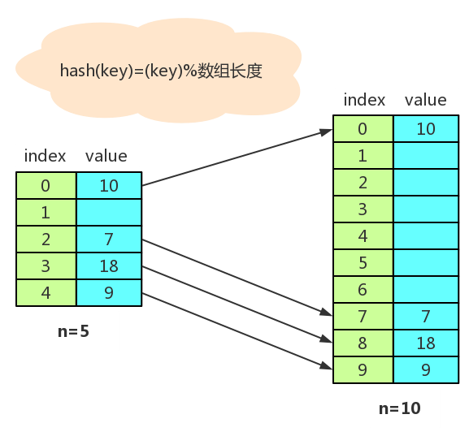
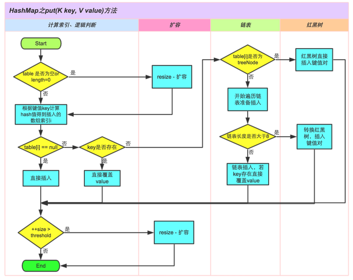

# 一、接口

## 容器类关系图解


## Collection

方法：

+ `add()`
+ `addAll()`
+ `clear()`
+ `remove()`
+ `removeAll()`
+ `contains()`
+ `containsAll()`
+ `isEmpty()`
+ `Iterator<E> iterator()`
+ `size()`
+ `retainAll()`：交集

## Iterator（迭代器）

遍历集合用的：

```java
while(c.hasNext()){
    c.next();
    // 对集合c的操作
}
```

+ `hasNext()`
+ `next()`
+ `remove()`

## List

列表，有序可重复

常用子类：

+ ArrayList：底层是数组，支持随机访问，线程不安全
+ Vector：底层是数组，线程不安全
+ LinkedList：底层是双向链表，只能顺序访问，线程不安全

## Set

数学集合，元素不可重复

常用子类：

+ HashSet：底层是哈希表，不支持有序操作
+ TreeSet：底层是红黑树，支持有序操作
+ LinkedHashSet：底层是由哈希表和链表组成

## Queue

常用子类：

- LinkedList：可以用它来实现双向队列。
- PriorityQueue：基于堆结构实现，可以用它来实现优先队列。

# 二、List集合

## ArrayList

### 概览

因为 ArrayList 是基于数组实现的，所以支持快速随机访问。RandomAccess 接口标识着该类支持快速随机访问。

```java
public class ArrayList<E> extends AbstractList<E>
        implements List<E>, RandomAccess, Cloneable, java.io.Serializable{
    ……
}
```

一些基本参数：

```java
// 初始容量为10
private static final int DEFAULT_CAPACITY = 10;
// 用户指定ArrayList容量为0时返回该空数组，用户指定容量为0
private static final Object[] EMPTY_ELEMENTDATA = {};
// 默认容量的空数组
private static final Object[] DEFAULTCAPACITY_EMPTY_ELEMENTDATA = {};
// 保存增加到ArrayList中的元素
transient Object[] elementData;
// 实际大小
private int size;
```


通过构造方法验证：


### add和扩容

添加元素时使用`ensureCapacityInternal()`方法来保证容量足够，如果不够时，需要使用`grow()`方法进行扩容，新容量的大小为 `oldCapacity + (oldCapacity >> 1)`，即`oldCapacity+oldCapacity/2`。其中`oldCapacity >> 1`需要取整，所以**新容量大约是旧容量的 1.5 倍左右。**

扩容操作需要调用 `Arrays.copyOf()` 把原数组整个复制到新数组中，这个操作代价很高，因此最好在创建ArrayList对象时就指定大概的容量大小，减少扩容操作的次数。

```java
public boolean add(E e) {
    ensureCapacityInternal(size + 1);
    elementData[size++] = e;
    return true;
}

private void ensureCapacityInternal(int minCapacity) {
    if (elementData == DEFAULTCAPACITY_EMPTY_ELEMENTDATA) {
        minCapacity = Math.max(DEFAULT_CAPACITY, minCapacity);
    }
    ensureExplicitCapacity(minCapacity);
}

private void ensureExplicitCapacity(int minCapacity) {
    modCount++;
    // overflow-conscious code
    if (minCapacity - elementData.length > 0)
        grow(minCapacity);
}

private void grow(int minCapacity) {
    // overflow-conscious code
    int oldCapacity = elementData.length;
    int newCapacity = oldCapacity + (oldCapacity >> 1);
    if (newCapacity - minCapacity < 0)
        newCapacity = minCapacity;
    if (newCapacity - MAX_ARRAY_SIZE > 0)
        newCapacity = hugeCapacity(minCapacity);
    // minCapacity is usually close to size, so this is a win:
    elementData = Arrays.copyOf(elementData, newCapacity);
}
```

### get

```java
// 检查⻆标
private void rangeCheck(int index) {
 if (index >= size)
 throw new IndexOutOfBoundsException(outOfBoundsMsg(index));
}
// 返回元素
E elementData(int index) {
 return (E) elementData[index];
}
```

### set

```java
public E set(int index, E element) {
    rangeCheck(index);

    E oldValue = elementData(index);
    elementData[index] = element;
    return oldValue;
}
```

### remove删除

需要调用`System.arraycopy()`将 index+1 后面的元素都复制到 index 位置上，该操作的时间复杂度为 O(N)，可以看到 ArrayList 删除元素的代价是非常高的。

```java
public E remove(int index) {
    rangeCheck(index);
    modCount++;
    E oldValue = elementData(index);
    int numMoved = size - index - 1;
    if (numMoved > 0)
        System.arraycopy(elementData, index+1, elementData, index, numMoved);
    elementData[--size] = null; // clear to let GC do its work
    return oldValue;
}
```

## Vector

Vector底层也是数组，与ArrayList最⼤的区别就是：同步（线程安全）

Vector是同步的，我们可以从⽅法上就可以看得出来

```java
public synchronized boolean add(E e) {
    modCount++;
    ensureCapacityHelper(elementCount + 1);
    elementData[elementCount++] = e;
    return true;
}

public synchronized E get(int index) {
    if (index >= elementCount)
        throw new ArrayIndexOutOfBoundsException(index);

    return elementData(index);
}
```

在要求⾮同步的情况下，我们⼀般都是使⽤ArrayList来替代Vector的了

如果想要ArrayList实现同步，可以使⽤Collections的⽅法：`List list = Collections.synchronizedList(new ArrayList(...));` ，就可以实现同步了

还有另⼀个区别：ArrayList在底层数组不够⽤时在原来的基础上扩展0.5倍，Vector是扩展1倍

## LinkedList


LinkedList底层是**双向链表**，从结构上，我们还看到了**LinkedList实现了Deque接⼝**，因此，我们可以操作LinkedList像操作队列和栈⼀样

```java
private static class Node<E> {
    E item;
    Node<E> next;
    Node<E> prev;
}
```

每个链表存储了 first 和 last 指针：

```java
transient Node<E> first;
transient Node<E> last;
```


ArrayList 基于动态数组实现，LinkedList 基于双向链表实现。ArrayList 和 LinkedList 的区别可以归结为数组和链表的区别：

- 数组支持随机访问，但插入删除的代价很高，需要移动大量元素；
- 链表不支持随机访问，但插入删除只需要改变指针。

# 三、Map

## 介绍

### Map特点

key-value键值对

特点：将键映射到值的对象，一个映射不能包含重复的键，每个键最多只能映射到一个值

Map和Collection的区别：①Map集合存储元素是成对出现的，Map的键是唯一的，值是可以重复的；②Collection集合存储元素是单独出现的，collection的儿子set是唯一的，List是可重复的

### 散列表

散列表**为每个对象计算出⼀个整数，称为散列码。**根据这些计算出来的整数（散列码）保存在对应的位置上！


如果散列表太满，是需要对散列表再散列，创建⼀个桶数更多的散列表，并将原有的元素插⼊到新表中，丢弃原来的表。

+ 装填因⼦（load factor）**决定了何时**对散列表再散列
+ 装填因⼦默认为0.75，如果表中**超过了75%的位置**已经填⼊了元素，那么这个表就会⽤双倍的桶数⾃动进⾏再散列



## HashMap

### 概览

```java
// 初始容量为16
static final int DEFAULT_INITIAL_CAPACITY = 1 << 4; 
// 最大容量为2^30
static final int MAXIMUM_CAPACITY = 1 << 30;
// 默认装载因子为0.75
static final float DEFAULT_LOAD_FACTOR = 0.75f;
// 如果一个桶中节点数量为TREEIFY_THRESHOLD，若果再添加一个元素，就转为树型结构
static final int TREEIFY_THRESHOLD = 8;
// 节点至多为UNTREEIFY_THRESHOLD转为链表结构
static final int UNTREEIFY_THRESHOLD = 6;
// 桶可能被转化为树型结构的最小容量
static final int MIN_TREEIFY_CAPACITY = 64;
```

### 拉链法的工作原理

```java
HashMap<String, String> map = new HashMap<>();
map.put("K1", "V1");
map.put("K2", "V2");
map.put("K3", "V3");
```

- 新建一个 HashMap，默认大小为 16；
- 插入 <K1,V1> 键值对，先计算 K1 的 hashCode 为 115，使用除留余数法得到所在的桶下标 115%16=3。
- 插入 <K2,V2> 键值对，先计算 K2 的 hashCode 为 118，使用除留余数法得到所在的桶下标 118%16=6。
- 插入 <K3,V3> 键值对，先计算 K3 的 hashCode 为 118，使用除留余数法得到所在的桶下标 118%16=6，插在 <K2,V2> 前面。

应该注意到链表的插入是以头插法方式进行的，例如上面的 <K3,V3> 不是插在 <K2,V2> 后面，而是插入在链表头部。

查找需要分成两步进行：

- 计算键值对所在的桶；
- 在链表上顺序查找，时间复杂度显然和链表的长度成正比。


### put



```java
public V put(K key, V value) {
    return putVal(hash(key), key, value, false, true);
}

/**
* Implements Map.put and related methods
*
* @param hash hash for key
* @param key the key
* @param value the value to put
* @param onlyIfAbsent if true, don't change existing value
* @param evict if false, the table is in creation mode.
* @return previous value, or null if none
*/
final V putVal(int hash, K key, V value, boolean onlyIfAbsent,
               boolean evict) {
    Node<K,V>[] tab; Node<K,V> p; int n, i;
    // 散列表为null时，调用resize()初始化散列表
    if ((tab = table) == null || (n = tab.length) == 0)
        n = (tab = resize()).length;
    // 没有发生碰撞时，直接添加元素到散列表中
    if ((p = tab[i = (n - 1) & hash]) == null)
        tab[i] = newNode(hash, key, value, null);
    else {
        Node<K,V> e; K k;
        // 要插入的元素，桶的hash和key都相等，记录下来
        if (p.hash == hash &&
            ((k = p.key) == key || (key != null && key.equals(k))))
            e = p;
        else if (p instanceof TreeNode)
            // 如果是红黑树结构，就调用树的插入方法
            e = ((TreeNode<K,V>)p).putTreeVal(this, tab, hash, key, value);
        else {
            // 链表结构，找到key映射的节点，就记录这个节点，退出循环；如果没有找到，在链表尾部插入节点
            // 插入后临界值大于TREEIFY_THRESHOLD就转化成红黑树
            for (int binCount = 0; ; ++binCount) {
                if ((e = p.next) == null) {
                    p.next = newNode(hash, key, value, null);
                    if (binCount >= TREEIFY_THRESHOLD - 1) // -1 for 1st
                        treeifyBin(tab, hash);
                    break;
                }
                if (e.hash == hash &&
                    ((k = e.key) == key || (key != null && key.equals(k))))
                    break;
                p = e;
            }
        }
        // 新值覆盖旧值，返回旧址
        if (e != null) {
            V oldValue = e.value;
            if (!onlyIfAbsent || oldValue == null)
                e.value = value;
            afterNodeAccess(e);
            return oldValue;
        }
    }
    ++modCount;
    if (++size > threshold)
        resize();
    afterNodeInsertion(evict);
    return null;
}
```

新值覆盖旧值，返回旧值测试：


### get

```java
public V get(Object key) {
    Node<K,V> e;
    // getNode传入key的哈希值和key
    return (e = getNode(hash(key), key)) == null ? null : e.value;
}

final Node<K,V> getNode(int hash, Object key) {
    Node<K,V>[] tab; Node<K,V> first, e; int n; K k;
    if ((tab = table) != null && (n = tab.length) > 0 &&
        (first = tab[(n - 1) & hash]) != null) {
        // 如果桶的首位可以找到就直接返回
        if (first.hash == hash &&
            ((k = first.key) == key || (key != null && key.equals(k))))
            return first;
        // 否则在红黑树中找或者查询链表
        if ((e = first.next) != null) {
            if (first instanceof TreeNode)
                return ((TreeNode<K,V>)first).getTreeNode(hash, key);
            do {
                if (e.hash == hash &&
                    ((k = e.key) == key || (key != null && key.equals(k))))
                    return e;
            } while ((e = e.next) != null);
        }
    }
    return null;
}
```

## LinkedHashMap

### 概览

继承HashMap，底层是散列表和双向链表，允许null不同步，插入元素顺序是有序的

accessOrder 决定了顺序，默认为 false，此时维护的是插入顺序。

```java
final boolean accessOrder;
```

LinkedHashMap 最重要的是以下用于维护顺序的函数，它们会在 put、get 等方法中调用。

```java
void afterNodeAccess(Node<K,V> p) { }
void afterNodeInsertion(boolean evict) { }
```

### afterNodeAccess()

当一个节点被访问时，如果 accessOrder 为 true，则会将该节点移到链表尾部。也就是说指定为 LRU 顺序之后，在每次访问一个节点时，会将这个节点移到链表尾部，保证链表尾部是最近访问的节点，那么链表首部就是最近最久未使用的节点。

```java
void afterNodeAccess(Node<K,V> e) { // move node to last
    LinkedHashMap.Entry<K,V> last;
    if (accessOrder && (last = tail) != e) {
        LinkedHashMap.Entry<K,V> p =
            (LinkedHashMap.Entry<K,V>)e, b = p.before, a = p.after;
        p.after = null;
        if (b == null)
            head = a;
        else
            b.after = a;
        if (a != null)
            a.before = b;
        else
            last = b;
        if (last == null)
            head = p;
        else {
            p.before = last;
            last.after = p;
        }
        tail = p;
        ++modCount;
    }
}
```

### afterNodeInsertion()

在 put 等操作之后执行，当 removeEldestEntry() 方法返回 true 时会移除最晚的节点，也就是链表首部节点 first。

evict 只有在构建 Map 的时候才为 false，在这里为 true。

```java
void afterNodeInsertion(boolean evict) { // possibly remove eldest
    LinkedHashMap.Entry<K,V> first;
    if (evict && (first = head) != null && removeEldestEntry(first)) {
        K key = first.key;
        removeNode(hash(key), key, null, false, true);
    }
}
```

removeEldestEntry() 默认为 false，如果需要让它为 true，需要继承 LinkedHashMap 并且覆盖这个方法的实现，这在实现 LRU 的缓存中特别有用，通过移除最近最久未使用的节点，从而保证缓存空间足够，并且缓存的数据都是热点数据。

```java
protected boolean removeEldestEntry(Map.Entry<K,V> eldest) {
    return false;
}
```

### LRU 缓存

以下是使用 LinkedHashMap 实现的一个 LRU 缓存：

- 设定最大缓存空间 MAX_ENTRIES 为 3；
- 使用 LinkedHashMap 的构造函数将 accessOrder 设置为 true，开启 LRU 顺序；
- 覆盖 removeEldestEntry() 方法实现，在节点多于 MAX_ENTRIES 就会将最近最久未使用的数据移除。

```java
class LRUCache<K, V> extends LinkedHashMap<K, V> {
    private static final int MAX_ENTRIES = 3;

    protected boolean removeEldestEntry(Map.Entry eldest) {
        return size() > MAX_ENTRIES;
    }

    LRUCache() {
        super(MAX_ENTRIES, 0.75f, true);
    }
}
public static void main(String[] args) {
    LRUCache<Integer, String> cache = new LRUCache<>();
    cache.put(1, "a");
    cache.put(2, "b");
    cache.put(3, "c");
    cache.get(1);
    cache.put(4, "d");
    System.out.println(cache.keySet());
}
[3, 1, 4]
```

## TreeMap


TreeMap实现了NavigableMap接⼝，⽽NavigableMap接⼝继承着SortedMap接⼝，致使我们的**TreeMap是有序的**

- TreeMap底层是红⿊树，它⽅法的时间复杂度都不会太⾼：log(n)
- key不能为null，为null为抛出NullPointException的
- 想要⾃定义⽐较，在构造⽅法中传⼊Co smparator对象，否则使⽤key的⾃然排序来进⾏⽐较
- TreeMap⾮同步的，想要同步可以使⽤Collections来进⾏封装