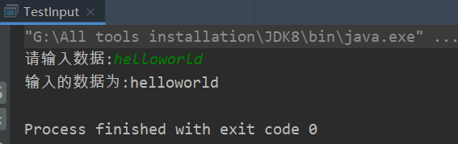
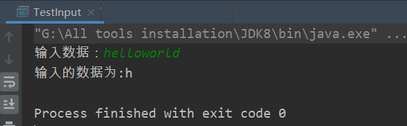
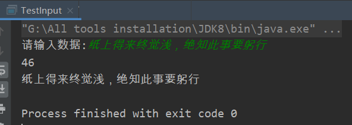
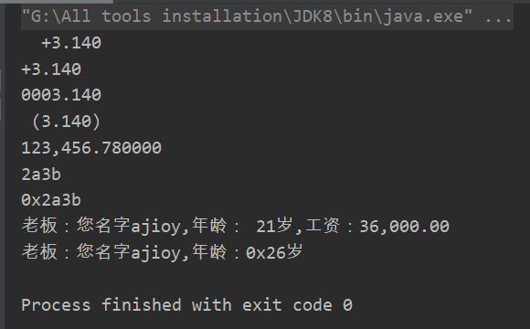

# 输入

## BufferedReader（繁琐）

```java
public static void main(String[] args) {
    try {
        BufferedReader br = new BufferedReader(new InputStreamReader(System.in));
        System.out.println(br.readLine());
    } catch (IOException e) {
        e.printStackTrace();
    }
}
```

## Scanner

```java
public static void main(String[] args) {
    System.out.print("请输入数据:");
    Scanner scan = new Scanner(System.in);
    String read = scan.nextLine();
    System.out.println("输入的数据为:"+read);
}
```



Java中的输入语句，并不像其他语言一样只是一个命令，而是需要通过对象获取输入内容。

代码第1行创建了一个Scanner类的对象，这个对象是用来输入的。后面的代码是从控制台的输入中取出一个值，赋值给对应的变量。

```java
Scanner scanner = new Scanner(System.in);
int i = scanner.nextInt();
btye b = scanner.nextByte();
short s = scanner.nextShort();
long l = scanner.nextLong();
double d = scanner.nextDouble();
String str = scanner.next();
```

## System.in

输入单个字符：

```java
public static void main(String[] args) {
    char read = '0';
    System.out.print("输入数据：");
    try {
        read = (char) System.in.read();
    }catch(Exception e){
        e.printStackTrace();
    }
    System.out.println("输入的数据为:"+read);
}
```



输入字符串：

```java
public static void main(String[] args) {
    System.out.print("请输入数据:");
    int i = 0;
    byte b[] = new byte[1024];
    try {
        i = System.in.read(b);
        //System.out.println(i);
    } catch (IOException e) {
        e.printStackTrace();
    }
    System.out.println(new String(b, 0, i-1));
}
```



# 输出

1.正常输出：

换行：`System.out.println("输出的内容： "+str);` 

不换行： `System.out.print("输出的内容： "+str);`

2.错误输出：`System.err.println("输出内容: "+str);`

3.格式化输入：`System.out.printf(format, args);`其中：`format`为指定的输出格式，`args`为参数。

```java
public static void main(String[] args) {
    //System.out.printf(format, args);format为指定的输出格式，args参数
    //"+"表示后面输出的数字会有正负号，正的+,负的- ;8.3f表示输出浮点数，宽度为8，小数点保持3位有效
    System.out.printf("%+8.3f\n", 3.14);
    //"-"表示靠左对齐
    System.out.printf("%+-8.3f\n", 3.14);
    //"0"8位宽度中自动补0
    System.out.printf("%08.3f\n", 3.14);
    //"("如果是负数，自动加上括号：()
    System.out.printf("%(8.3f\n", -3.14);
    //","金钱表示方法，每三位有一个逗号
    System.out.printf("%,f\n", 123456.78);
    //输出16进制数
    System.out.printf("%x\n", 0x2a3b);
    //输出带0x标识的16进制数
    System.out.printf("%#x\n", 0x2a3b);
    System.out.printf("老板：您名字%s,年龄：%3d岁,工资：%,-7.2f\n","ajioy",21,36000.00);
    //"n{1}quot;表示用第n个参数
    System.out.printf("老板：您名字%1$s,年龄：%2$#x岁\n","ajioy",38);
}
```




