# 一、基本程序设计

## 字符串

1.**不可变字符串String**

String类中没有提供用于修改字符串的方法，但可以通过`+`连接其他字符

2.`==`和`equals`：前者是对象相等判断，后者是字面量相等判断

当然也可以使用`compareTo`方法进行判断

```java
String greeting="Hello";
int compareTo = greeting.compareTo("Hello");	//为0
```

3.空串`""`也是对象，null是没有对象，常用判断`if (str != nu11 && str.length() != 0)`

4.码点和代码单元，比如一些特殊字符`𝕆`，在计算字符串长度时候会计算为2个，但算作1个码点

**码点**是指一个编码表中的某个字符对应的代码值。

## 其他

1.`BigInteger`和`BigDecimal`，大数值，是`java.math`包下的类

2.数组初始化

```java
// 下列两种初始化方式结果相同，前一种是简写，虽然没有new，但也创建类对象
int[] a={1,2,3,4,5,6};
int[] b=new int[]{1,2,3,4,5,6};
```

3.数组拷贝

```java
// 浅拷贝
int[] smallPrimes=new int[]{2,3,5,7,11,12};
int[] luckyNumbers=smallPrimes;
System.out.println("浅拷贝:"+(smallPrimes==luckyNumbers));
// 深拷贝
int[] copiedLuckyNumbers= Arrays.copyOf(smallPrimes,smallPrimes.length);
System.out.println("深拷贝:"+(copiedLuckyNumbers==smallPrimes));
```

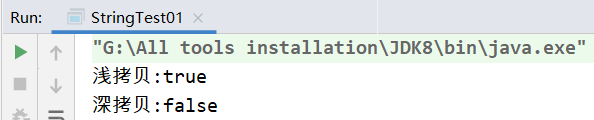

4.不规则数组

由于以下的存储结构，所以在Java中高维数组的每一维度的长度可以不同

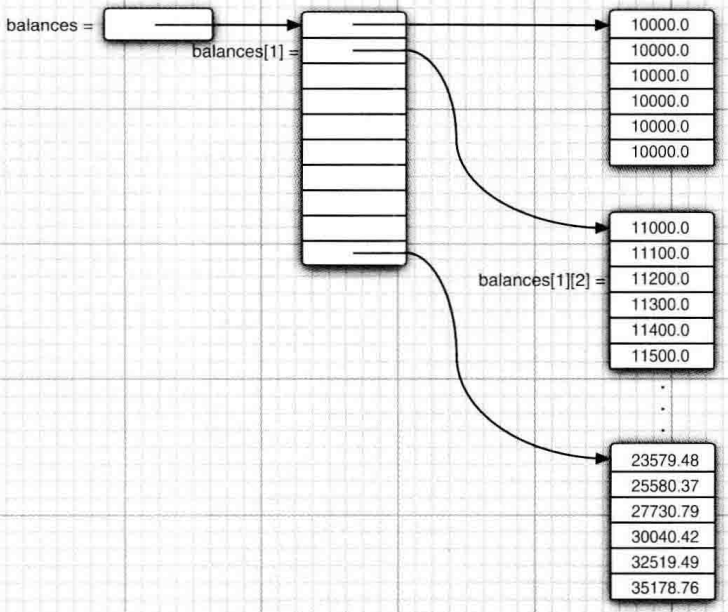

```java
// 不规则数组
int[][] x=new int[3][];
x[0]=new int[]{1};
x[1]=new int[]{1,2};
x[2]=new int[]{1,2,3};
for(int[] row:x){
    for (int col:row){
        System.out.print(col);
    }
    System.out.print("\n");
}

/************
1
12
123
*************/
```

# 二、类和对象

1.静态域

现在，每一个雇员对象都有一个自己的id域，但**这个类的所有实例将共享一个nextId域。**换句话说，如果有1000个Employee类的对象，则有1000个实例域id。但是，只有一个静态域nextld。**即使没有一个雇员对象，静态域nextld也存在。**它属于类，而不属于任何独立的对象。

```java
class Employee{
    private static int nextId=1;
    private int id;
    ……
}
```

静态常量：`public static final double PI=3.14159265258979323846`

静态方法：`public static double pow(double x,double a)`

一般静态域用于设定常量和封装工具类Utils

2.方法参数，以swap为例

```java
//******************
//Employee类下的静态方法
public static void swap(Employee x,Employee y){
    Employee temp=x;
    x=y;
    y=temp;
    System.out.println("x = "+x);
    System.out.println("y = "+y);
}
//***********************
public class ArgsTest {
    public static void main(String[] args) {
        Employee alice = new Employee("Alice", 2000);
        Employee bob = new Employee("Bob", 4000);
        Employee.swap(alice,bob);
        System.out.println(alice);
        System.out.println(bob);
    }
}
```

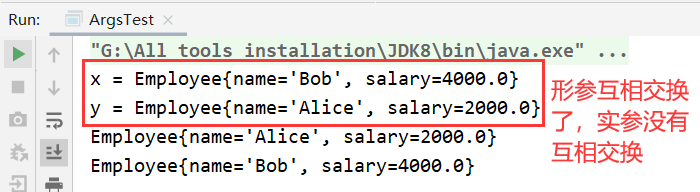

在Java中，对对象采用的不是引用调用，实际上，**对象引用是按照值传递的。**

下面总结一下Java中方法参数的使用情况：

- 一个方法不能修改一个基本数据类型的参数（即数值型或布尔型)。
- 一个方法可以改变一个对象参数的状态。
- 一个方法不能让对象参数引用一个新的对象。

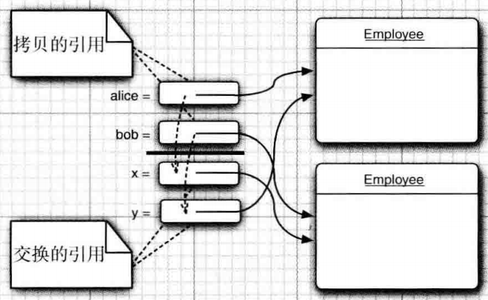

3.类中不自己编写构造器时候系统才给无参构造器，**如果类中编写的有参构造必须写无参构造。**

4.调用另外一个构造器：`this(…)`

5.包的静态引入`import static java.math.*`

```java
// 原先方式
Math.sqrt(Math.pow(x,2)+Math.pow(y,2))
// 导入静态包后的方式
sqrt(pow(x,2)+pow(y,2))
```

6.权限修饰符

| 修饰符    | 同类中 | 同一个包中(子类和无关类) | 不同包(子类) | 不同包(无关类) |
| --------- | ------ | ------------------------ | ------------ | -------------- |
| public    | Y      | Y                        | Y            | Y              |
| protected | Y      | Y                        | Y            | N              |
| 默认      | Y      | Y                        | N            | N              |
| private   | Y      | N                        | N            | N              |

7.类设计技巧摘要

+ 保证数据私有
+ 一定要对数据初始化
+ 不要在类中使用过多的基本类型
+ 不是所有的域都需要独立的域访问器和域更改器
+ 将职责过多的类进行分解
+ 类名和方法名要能够体现它们的职责
+ 优先使用不可变的类

# 三、继承

1.`this`和`super`

|         |                             |                                      |
| ------- | --------------------------- | ------------------------------------ |
| `this`  | 引用隐式参数                | 调用该类其他构造器                   |
| `super` | 调用父类方法`super.show();` | 调用父类构造器`super(name, salary);` |

2.多态：父类可以引用其子类的任何一个对象

3.在覆盖一个方法的时候，**子类方法不能低于超类方法的可见性。**特别是，**如果超类方法是public，子类方法一定要声明为public。**经常会发生这类错误:在声明子类方法的时候，遗漏了public修饰符。此时，编译器将会把它解释为试图提供更严格的访问权限。

4.对象的强制类型转化

```java
Employee bob = new Employee("Bob", 1999);
bob.show();
Manager e2= (Manager) bob;
e2.show();
```

会爆出如下异常`ClassCastException`：

```bash
Exception in thread "main" java.lang.ClassCastException: javabasic.forth.Employee cannot be cast to javabasic.forth.Manager
```

根据书上的讲解，要有设计习惯：在进行类型转换之前，先查看一下是否能够成功地转换。这个过程简单地使用`instanceof`操作符就可以实现。例如:

```java
Employee bob = new Employee("Bob", 1999);
bob.show();
if(bob instanceof Manager){
    Manager e2= (Manager) bob;
    e2.show();
}
```

5.抽象类

抽象方法**充当着占位**的角色，它们的具体实现在子类中。扩展抽象类可以有两种选择。一种是在抽象类中定义部分抽象类方法或不定义抽象类方法，这样就必须将子类也标记为抽象类；另一种是定义全部的抽象方法，这样一来，子类就不是抽象的了。

+ 类即使不含抽象方法，也可以将类声明为抽象类
+ **抽象类不能被实例化**，但可以创建一个具体子类的对象

+ **可以定义一个抽象累的对象变量，但它只能引用非抽象子类的对象**：`Person p=new Student();`

6.equals

```java
// Object类中的equals方法源码
public boolean equals(Object obj) {
    return (this == obj);
}
```

由源码可知，原生道德`equals`方法判断的是两个对象是否相等，即是否取自同一块内存空间（相同的引用）

根据书上的建议，编写equals有如下：

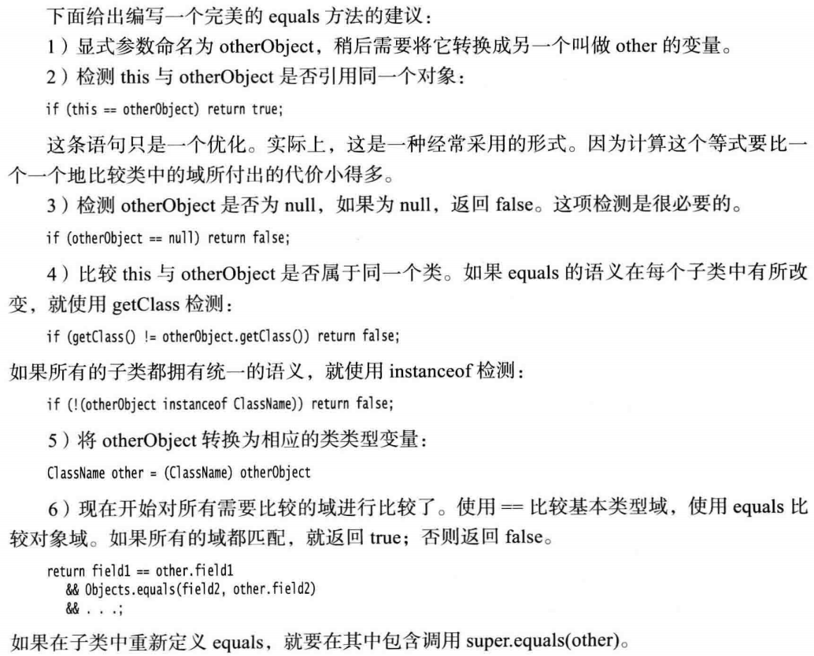

7.hashCode

每个对象都有一个默认的散列码，其值为对象的存储地址

**如果重新定义equals方法，就必须重新定义hashCode方法，以便用户可以将对象插到散列表中。**Equals 与 hashCode的定义必须一致：如果x.equals(y)返回true，那么x.hashCode()就必须与y.hashCode()具有相同的值。例如，如果用定义的Employee.equals 比较雇员的ID，那么hashCode方法就需要散列ID，而不是雇员的姓名或存储地址。

8.`toString`方法，一般在子类中需要重写

9.ArrayList数组列表`ArrayList<Object> list = new ArrayList<>();`

10.包装类

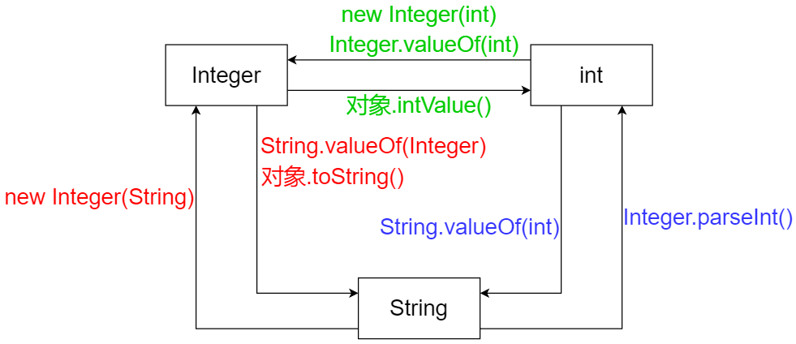

11.参数数量可变的方法

```java
public void show(double ... args){
    for (double v:args) {
        System.out.println(v);
    }
}

//************函数调用
ArgsTest argsTest = new ArgsTest();
argsTest.show(2,1.0,5,3.5,2.7);
```

12.枚举

定义枚举：

```java
public enum Size {
    SMALL("S"),MEDIUM("M"),LARGE("L");

    private String abbreviation;
    private Size(String abbreviation){this.abbreviation=abbreviation;}
    public String getAbbreviation(){return abbreviation;}

}
```

获取枚举元素的两种方式：

```java
// 方式一
Enum.valueOf(Size.class,"LARGE")
// 方式二
Size.LARGE
```

测试：

```java
Size size = Enum.valueOf(Size.class,"LARGE");
System.out.println(size);
System.out.println(size.getClass());
System.out.println(size.ordinal());
System.out.println(size.getAbbreviation());
System.out.println(Size.MEDIUM);
System.out.println(Size.MEDIUM.getClass());
System.out.println(Size.MEDIUM.ordinal());
System.out.println(Size.MEDIUM.getAbbreviation());
```

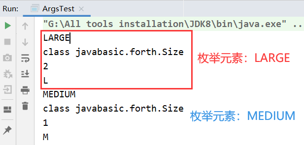

13.反射

> 见另外文档： [Java注解和反射.md](Java注解和反射.md) 

14.继承设计技巧

+ 将公共操作和域放在父类

+ 不要使用受保护(protected)的域
+ 使用继承实现“is-a”关系
+ 除非所有继承的方法都有意义，否则不要使用继承
+ 在覆盖方法时，不要改变语雀的行为
+ 使用多态，而非类型信息
+ 不要过多的使用反射：编译器很难帮助人们发现程序中的错误，因此只有在运行时才发现错误并导致异常。

# 四、接口、lambda表达式

1.接口不是类，不能new，但可以声明接口变量

```java
x = new Comparable(……);	// error
Comparable x;	// ok
```

2.在接口中可以定义常量、声明方法、default（Java8）、static（Java8）

```java
public interface HH {
    // 常量
    public static final int SIZE = 200;
    // 声明方法
    public void show(Integer id);
    // default
    public default void test1(){
        System.out.println("接口中的default");
    }
    // static
    public static void test2(){
        System.out.println("接口中的static");
    }
}

// 实现接口
public class ArgsTest implements HH{
    public static void main(String[] args) {
        ArgsTest argsTest = new ArgsTest();
        argsTest.show(20);
        argsTest.test1();
        HH.test2();
    }

    @Override
    public void show(Integer id) {
        System.out.println("实现接口,id="+id);
    }
}

/*****************输出结果
实现接口,id=20
接口中的default
接口中的static
******************/
```

3.接口默认方法冲突问题

+ 父类优先（父类方法和接口的默认方法冲突）
+ 接口重写覆盖（两个以上接口的默认方法冲突）

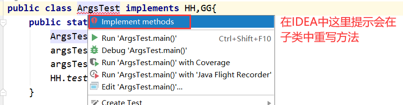

4.`clone()`的深拷贝和浅拷贝

```java
public class Employee implements Cloneable{
    // ……
    
    //重写clone方法，实现深拷贝
    @Override
    public Employee clone(){
        try {
            Employee clone = (Employee) super.clone();
            return clone;
        }catch (CloneNotSupportedException e){
            e.printStackTrace();
            return null;
        }
    }
}

// 测试调用
public class ArgsTest {
    public static void main(String[] args) {
        Employee original = new Employee("Alice", 5000);
        Employee copy1 = original;
        Employee copy2 = original.clone();
        System.out.println("浅拷贝:" + (original == copy1));
        System.out.println("深拷贝:" + (original == copy2));
    }
}
```

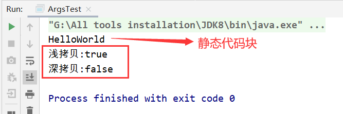

5.lambda表达式和内部类查看文档： [lambda表达式和内部类.md](lambda表达式和内部类.md) 

# 五、异常

1.异常分类

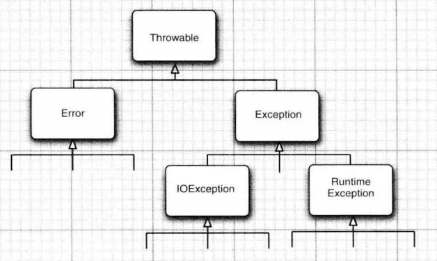

2.如果父类方法没有抛出任何受查异常，那么子类也不能抛出任何受查异常。

3.try…catch…finally流程

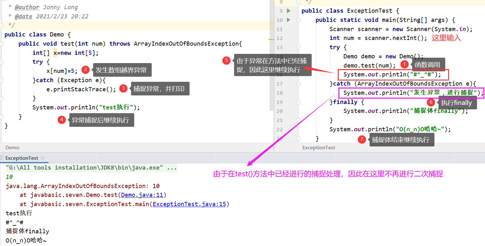