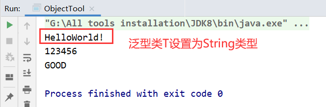
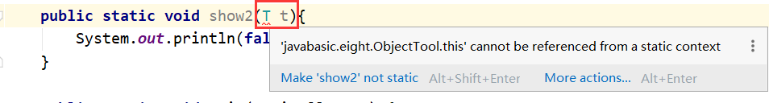
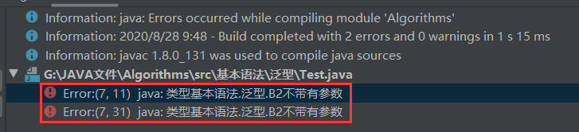
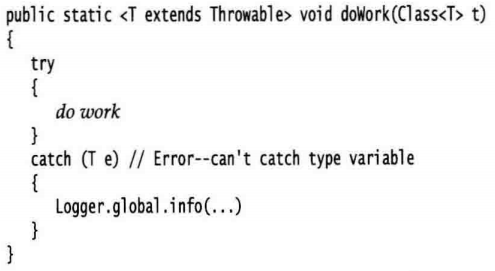

# 一、泛型

## 什么是泛型？

> **Java泛型设计原则：只要在编译时期没有出现警告，那么运行时期就不会出现`ClassCastException`异常**.

泛型：**把类型明确的工作推迟到创建对象或调用方法的时候才去明确的特殊的类型**

参数化类型:

- **把类型当作是参数一样传递**
- **`<数据类型>` 只能是引用类型**

相关术语：

- `ArrayList<E>`中的**E称为类型参数变量**
- `ArrayList<Integer>`中的**Integer称为实际类型参数**
- **整个称为`ArrayList<E>`泛型类型**
- **整个`ArrayList<Integer>`称为参数化的类型`ParameterizedType`**

首先，我们来试想一下：没有泛型，集合会怎么样

- Collection、Map集合对元素的类型是没有任何限制的。**本来我的Collection集合装载的是全部的Dog对象，但是外边把Cat对象存储到集合中，是没有任何语法错误的。**
- 把对象扔进集合中，集合是不知道元素的类型是什么的，仅仅知道是Object。因此在get()的时候，返回的是Object。**外边获取该对象，还需要强制转换**

有了泛型以后：

- 代码更加简洁【不用强制转换】
- 程序更加健壮【只要编译时期没有警告，那么运行时期就不会出现`ClassCastException`异常】
- 可读性和稳定性【在编写集合的时候，就限定了类型】

```java
//创建集合对象
ArrayList<String> list = new ArrayList<>();

list.add("hello");
list.add("world");
list.add("java");

//遍历,由于明确了类型.我们可以增强for
for (String s : list) {
    System.out.println(s);
}
```

## 泛型类

**泛型类就是把泛型定义在类上，用户使用该类的时候，才把类型明确下来**。这样的话，用户明确了什么类型，该类就代表着什么类型，用户在使用的时候就不用担心强转的问题，运行时转换异常的问题了。

> + **在类上定义的泛型，在类的方法中也可以使用！**
>
> + **同样的类，在new对象时指定泛型不同，之间不能互相赋值**

泛型定义：

1. 把泛型定义在类上
2. 类型变量定义在类上，方法中也可以使用

```java
public class ObjectTool<T> {
    private T obj;

    public T getObj() {
        return obj;
    }

    public void setObj(T obj) {
        this.obj = obj;
    }

    public <U> void show(U u){
        System.out.println(u);
    }

    public static void main(String[] args) {
        /**
         * 用户想要使用哪种类型，就在创建的时候指定类型。
         * 使用的时候，该类就会自动转换成用户想要使用的类型了。
         */
        ObjectTool<String> tool = new ObjectTool<>();
        tool.setObj(new String("HelloWorld!"));
        System.out.println(tool.getObj());

        tool.show(123456);
        tool.show("GOOD");
    }
}
```



## 泛型方法

前面已经介绍了泛型类了，在类上定义的泛型，在方法中也可以使用

现在呢，我们可能就仅仅在**某一个方法上需要使用泛型，外界仅仅是关心该方法，不关心类其他的属性**。这样的话，我们在整个类上定义泛型，未免就有些大题小作了。

定义泛型方法：**泛型是先定义后使用的**

> 其中前面这个`<U>`是类型参数声明，该类型参数声明部分在方法返回类型之前

```java
public <U> void show(U u){
    System.out.println(u);
}
```

在静态方法中，不能使用类定义泛型，若使用泛型，只能使用静态方法自己定义的泛型，如下所示：



## 泛型接口

+ 当子类不明确泛型类的类型参数变量时，**外界使用子类的时候，也需要传递类型参数变量进来，在实现类上需要定义出类型参数变量**

- **实现类的要是重写父类的方法，返回值的类型是要和父类一样的！**
- 类上声明的泛形**只对非静态成员有效**

`IB.java`中：

```java
public interface IB<T> {
    T test(T t);
}
class B1<T> implements IB<T>{

    @Override
    public T test(T t) {
        return t;
    }
}
class B2 implements IB<String>{

    @Override
    public String test(String s) {
        return null;
    }
}
```
`Test.java`文件：

```java
public class Test{
    public static void main(String[] args) {
        B1<Object> b1 = new B1<Object>();
        B1<String> b2 = new B1<String>();
        // 指定泛型反而错误，在已经实现的接口时确定为String类型
        //B2<String> b3 = new B2<String>();
        B2 b4 = new B2();
    }
}
```



## 泛型通配符

在不确定集合中元素具体数据类型，使用`?`表示所有类型，此处`?`是类型实参，而不是类型形参 。

```java
public void showKeyValue1(Generic<? extends Number> obj){
    Log.d("泛型测试","key value is " + obj.getKey());
}

//******************************************************
Generic<String> generic1 = new Generic<String>("11111");
Generic<Integer> generic2 = new Generic<Integer>(2222);
Generic<Float> generic3 = new Generic<Float>(2.4f);
Generic<Double> generic4 = new Generic<Double>(2.56);

//这一行代码编译器会提示错误，因为String类型并不是Number类型的子类
//showKeyValue1(generic1);

showKeyValue1(generic2);
showKeyValue1(generic3);
showKeyValue1(generic4);
```

有限制的通配符：

`<? extend Person>`：(无穷小,Person]，只允许Person及其子类引用调用

`<? super Person>`：[Person,无穷大)，只允许Person及其父类引用调用

## 通配符和泛型方法

**大多时候，我们都可以使用泛型方法来代替通配符的**

```java
//使用通配符
public static void test(List<?> list) {
}

//使用泛型方法
public <T> void  test2(List<T> t) {
}
```

上面这两个方法都是可以的，那么现在问题来了，我们使用通配符还是使用泛型方法呢？

原则：

- 如果**参数之间的类型有依赖关系**，或者**返回值是与参数之间有依赖关系**的。那么就使用**泛型方法**
- 如果**没有依赖关系**的，就使用**通配符**，通配符会**灵活一些.**

## 类型擦除

无论何时定义一个泛型类型，都自动提供了一个相应的原始类型(raw type)。原始类型的名字就是删去类型参数后的泛型类型名。擦除（erased)类型变量，并替换为限定类型(无限定的变量用Object)。

默认生成的是Object，比如：

```java
public class Main<T> {}
// 擦除类型：T更换为默认的Object
```

复杂情况：

```java
public class Main<T extends Serializable & Comparable> {
    private T first;
    private T second;

    public Main() {
    }

    public static void main(String[] args) {
        Main<? extends Serializable> main = new Main<>();
    }
}
```

用`Serializable`替换`T`，而编译器必要时向Comparable插入强制类型转化

## 泛型的约束和局限性

> 大都是由类型擦除引起的

+ 不能用基本类型实例化类型参数，`Pair<double>`错误，`Pair<Double>`错误
+ 类型查询只适用于原始类型

```java
ObjectTool<String> tool = new ObjectTool<>();
System.out.println(tool.getClass());
/*************
class javabasic.eight.ObjectTool
**************/
```

+ 不能创建参数化类型的数组

```java
// Error
Pair<String>[] table = new Pair<String>[10];
// 可以声明参数化的数组
Pair<String>[] p;
```

如果需要收集参数化类型对象，只有一种安全而有效的方法：使用`ArrayList<Pari<String>>`

+ Varags警告

两种注解：`@SuppressWarnings("unchecked")`、`@SafeVarags`。可以用来消除创建泛型数组的有关限制，不过程序隐藏危险，可能出现异常。

+ 不能实例化类型变量：`new T(……)`、`new T[……]`、`T.class`

+ 不能构造泛型数组
+ 泛型类的静态上下文中类型变量无效：`private static T singleInstance;`是无效的

+ 不能抛出或捕获泛型类的实例

```java
// Error--can't extend Throwable
public class Problem<T> extends Exception{/*……*/}
```



+ 可以消除对受查异常的检查