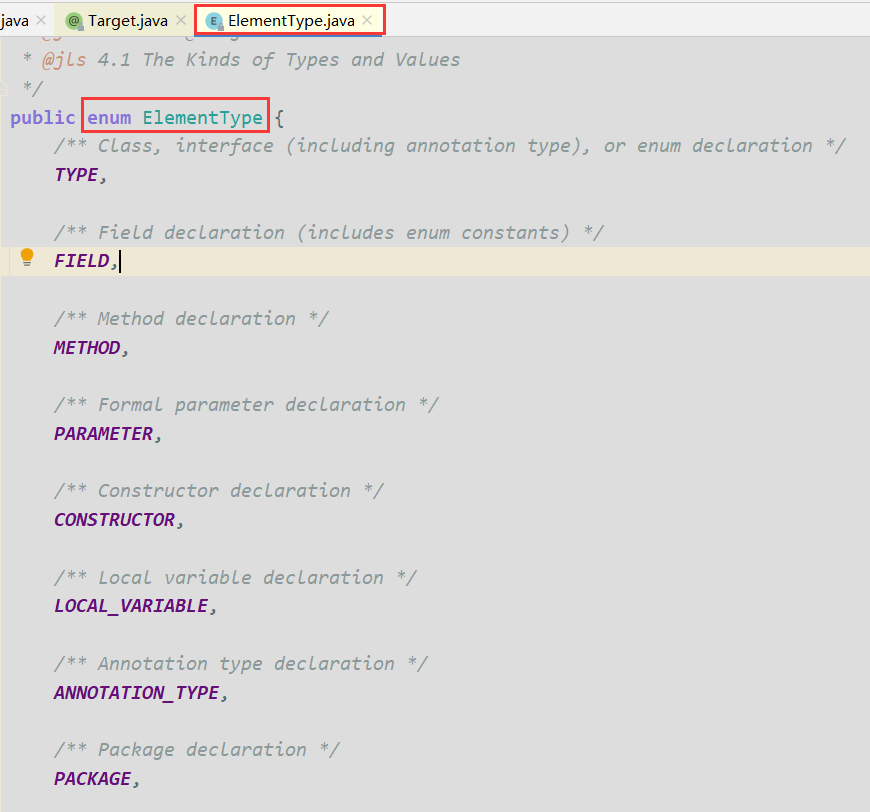
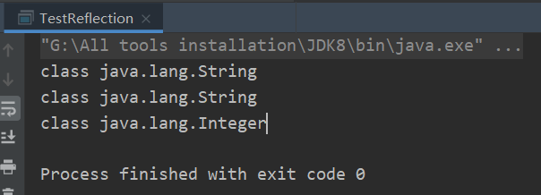
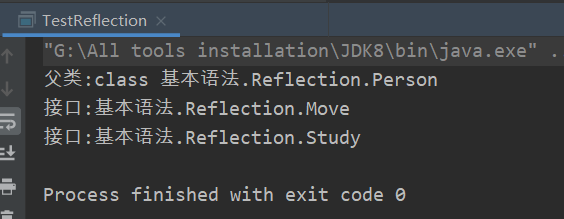
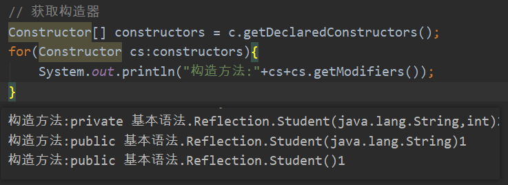
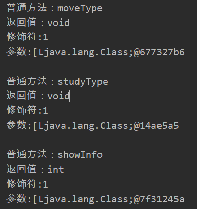
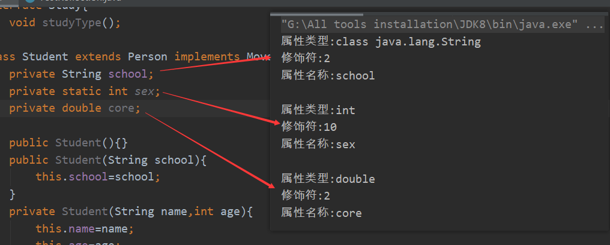
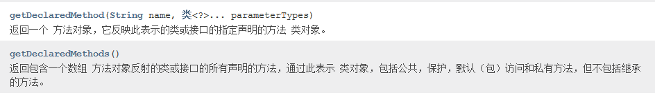
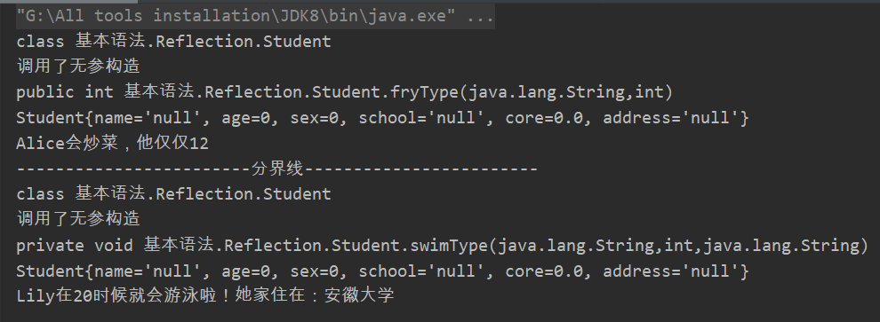
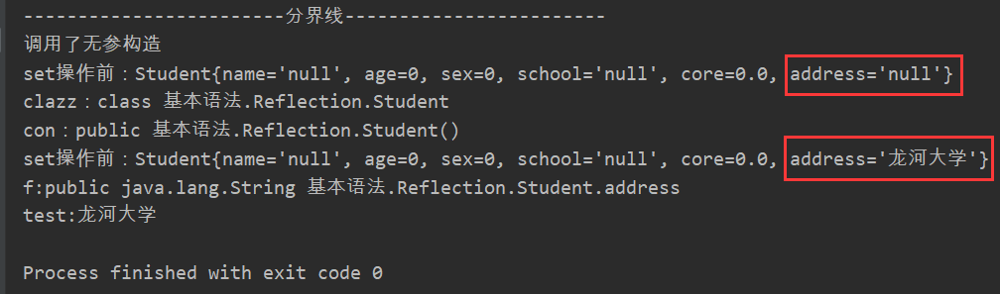

# 一、注解
## 1.1 内置注解
`@Overrride`：方法重写
`@Deprecated`：废弃方法，不推荐使用
`@SuppressWarnings()`：抑制编译时的警告信息
## 1.2 元注解
```java
@MyAnnotation
public class Test01 {
    public void test(){
    }
}

// @Target表示注解可以用在什么地方
@Target(value = {ElementType.METHOD,ElementType.TYPE})

// @Retention表示注解在什么地方有效
// runtime > class > sources
@Retention(value = RetentionPolicy.RUNTIME)

// @Documented表示是否将注解生成在Java文档中
@Documented

// @Inherited子类可以继承父类的注解
@Inherited
@interface MyAnnotation{

}
```

## 1.3 自定义注解
```java
public class Test02 {
    @MyAnnotation2(age = 22)
    public void test(){}
    
    // 如果注解参数只有一个，这时候可以写成默认的 value()，在使用注解的时候可以省略参数名
    @MyAnnotation3("LongSir")
    public void test2(){}
}

@Target({ElementType.TYPE,ElementType.METHOD})
@Retention(RetentionPolicy.RUNTIME)
@interface MyAnnotation2{
    // 注解参数： 参数类型+参数名 ();
    // default可以设置默认参数，如果没有默认值，就要给注解赋值
    String name() default "";
    String[] schools() default {"清华大学","北京大学"};
    int age();
}

@Target({ElementType.TYPE,ElementType.METHOD})
@Retention(RetentionPolicy.RUNTIME)
@interface MyAnnotation3{
    String value();
}
```

# 二、反射

## Class类

反射可以得到的信息：某个类的属性、方法和构造器、某个类到底实现了哪些接口。对于每个类而言，JRE都为其保留一个不变的Class类型的对象。一个Class对象包含了特定某个类的有关信息。

- Class本身也是一个类
- Class对象只能由系统建立对象
- **一个类在JVM中只会有一个Class实例**
- 一个Class对象对应的是一个加载到JVM中的一个`.class`文件
- 每个类的实例都会记得自己是由哪个Class实例所生成
- **通过Class可以完整地得到一个类中的完整结构**

Class类的常用方法：

| 方法名                                                      | 作用                                     |
| ----------------------------------------------------------- | ---------------------------------------- |
| `static Class forName(String name)`                         | 根据类的全类名（包名+类名）获取Class对象 |
| `isArray()`                                                 | 判定此 Class 对象是否表示一个数组类      |
| `Object newInstance()`                                      | 创建目标类对象                           |
| `getName()`                                                 | 获取全类名                               |
| `Class getSuperclass()`                                     | 获取所有的父类的Class对象                |
| `Class[] getInterfaces()`                                   | 获取所有实现的接口                       |
| `ClassLoader getClassLoader()`                              | 获取类加载器                             |
| `Constructor[] getConstructors()`                           | 获取所有的构造器                         |
| `Field[] getDeclaredFields()`                               | 获取所有的属性                           |
| `Method getMethod(String name, Class<?>... parameterTypes)` | 获取对应的方法                           |

实例化Class类对象的四种方法：

1.已知具体的类，通过类的class属性获取，这种方式最安全可靠，程序性能最高。

2.已知某个类的实例，通过`getClass()`来获取。

3.已知类的全类名，通过`static Class forName(String name)`获取，并处理异常。

4.通过类加载器`ClassLoader getClassLoader()`实现

```java
public static void main(String[] args) {
    /* 第1种和第3种较常用 */
    // 1.通过类的class属性获取
    Class c1=String.class;
    System.out.println(c1);
    // 2.通过getClass()来获取。
    Class c2="HelloWorld".getClass();
    System.out.println(c2);
    // 3.通过forName()静态方法得到
    try {
        Class c3 = Class.forName("java.lang.Integer");
        System.out.println(c3);
    } catch (ClassNotFoundException e) {
        e.printStackTrace();
    }
    // 4.第四种方式不常用
    //ClassLoader cl=this.getClass().getClassLoader();
    //Class c4=cl.loadClass("java.lang.Integer");
}
```



## 反射获取

### 获取父类和接口

获取父类：`c.getSuperclass();`

获取接口：`c.getInterfaces();`

`Person.java`：

```java
/**
 * @author Jonny Long
 * @date 2020/8/30 15:09
 */
public class Person {
    String name;
    int age;
}
interface Move{
    void moveType();
}
interface Study{
    void studyType();
}
class Student extends Person implements Move,Study{
    private String school;
    private static int sex;
    private double core;

    public Student(){}
    public Student(String school){
        this.school=school;
    }
    private Student(String name,int age){
        this.name=name;
        this.age=age;
    }
    public int showInfo() {
        System.out.println("学生信息是："+name+","+age+","+school);
        return -1;
    }

    @Override
    public void moveType() {
        System.out.println("Student类中的moveType方法");
    }

    @Override
    public void studyType() {
        System.out.println("Student类中的studyType方法");
    } 
}
```

测试文件：

```java
public class TestReflection {
    public static void main(String[] args) {
        Class c=Student.class;
        Class superclass = c.getSuperclass();
        System.out.println("父类:"+superclass);
        Class[] interfaces = c.getInterfaces();
        for (Class t:
             interfaces) {
            System.out.println("接口:"+t.getName());
        }
    }
}
```



### 获取构造方法

`c.getConstructors()`：获取修饰为`public`的构造方法

`c.getDeclaredConstructors()`：获取所有类型的构造方法

在`Constructor`类中：

- `cs.getModifiers()`：获取修饰符，都不加是0 ，`public`是1 ，`private` 是 2 ，`protected`是 4，`static`是 8 ，`final`是 16。
- `String getName()`：获取方法名称
- `Class<?>[] getParameterTypes()`：获取参数类型



### 获取普通方法

`privete Method[] getDeclaredMethods()`：返回此Class对象所表示的类或接口的全部方法

`private Method[] getMethods()`：返回此Class对象所表示的类或接口的public的方法

在`Method`类中：

- `public Class<?> getReturnlype()`：取得全部的返回值
- `public Class<?>[] getParameterTypes()`：取得全部的参数
- `public int getModifiers()`：取得修饰符

```java
Method[] methods = c.getDeclaredMethods();
for (Method m:methods) {
    System.out.println("普通方法："+m.getName());
    System.out.println("返回值："+m.getReturnType());
    System.out.println("修饰符:"+m.getModifiers());
    System.out.println("参数:"+m.getParameterTypes()+"\n");
}
```



### 获取Field

`privete Field[] getFields()`：返回此Class对象所表示的类或接口的public的Field。

`privete Field[] getDeclaredFields()`：返回此Class对象所表示的类或接口的全部Field。

Field方法中：

- `public int getModifiers()`：以整数形式返回此Field的修饰符
- `public Class<?> getType()`：得到Field的属性类型
- `public String getName()`：返回Field的名称。

```java
// getField
Field[] fields = c.getDeclaredFields();
for (Field f:fields) {
    System.out.println("属性类型:"+f.getType());
    System.out.println("修饰符:"+f.getModifiers());
    System.out.println("属性名称:"+f.getName()+"\n");
}
```



### 获取包

`getPackage()`和`getDeclaredPackage()`

## 指定调用

### 调用指定方法

通过反射，调用类中的方法，通过Method类完成。步骤：

1.通过Class类的`getMethod(String name,Class...parameterTypes)`方法取得一个Method对象，并设置此方法操作时所需要的参数类型。

2.之后使用`Object invoke(Object obj,Object[] args)`进行调用，并向方法中传递要设置的`obj`对象的参数信息。**`obj`是要实例化的对象，`args[]`是调用当前方法的实际参数。**

> 这里需要注意下`getDeclaredMethod`和`getDeclaredMethods`方法虽然同属于Class类下，但他们的作用不同，传入的形参也不同
>
> 

下面的Student类继承Person类，同时实现了Move和Study接口：
```java
/**
 * @author Jonny Long
 * @date 2020/8/30 15:09
 */
public class Person {
    String name;
    int age;
    int sex;
}
interface Move{
    void moveType();
}
interface Study{
    void studyType();
}
class Student extends Person implements Move,Study{
    private String school;
    private double core;
    private String address;

    public Student(){
        System.out.println("调用了无参构造");
    }
    public Student(String school, double core, String address) {
        this.school = school;
        this.core = core;
        this.address = address;
    }

    public String getSchool() {
        return school;
    }

    public void setSchool(String school) {
        this.school = school;
    }

    public double getCore() {
        return core;
    }

    public void setCore(double core) {
        this.core = core;
    }

    public String getAddress() {
        return address;
    }

    public void setAddress(String address) {
        this.address = address;
    }

    @Override
    public String toString() {
        return "Student{" +
                "name='" + name + '\'' +
                ", age=" + age +
                ", sex=" + sex +
                ", school='" + school + '\'' +
                ", core=" + core +
                ", address='" + address + '\'' +
                '}';
    }

    @Override
    public void moveType() {
        System.out.println("调用moveType方法");
    }

    @Override
    public void studyType() {
        System.out.println("在Student子类中，调用studyType方法");
    }

    public int fryType(String name,int age){
        System.out.println(name+"会炒菜，他仅仅"+age);
        return 1;
    }

    private void swimType(String name,int age,String address){
        System.out.println(name+"在"+age+"时候就会游泳啦！她家住在："+address);
    }
}
```

反射指定方法调用测试，分为public有参数型和private有参数型

其中private必须要有`sm.setAccessible(true);`这句话，其他与public类似

```java
import java.lang.reflect.Method;

/**
 * @author Jonny Long
 * @date 2020/8/30 14:55
 */
public class TestReflection {
    public static void main(String[] args) {
        // public有参型
        try {
            //Class c=Class.forName("java.lang.String");
            Class c=Student.class;
            System.out.println(c);
            Method m=c.getDeclaredMethod("fryType", String.class,int.class);
            // newInstance()：创建目标对象
            Student obj=(Student)c.newInstance();
            System.out.println(m);
            System.out.println(obj);
            m.invoke(obj,"Alice",12);

        } catch (Exception e) {
            e.printStackTrace();
        }
        System.out.println("------------------------分界线------------------------");
        // private有参型
        try {
            Class s=Student.class;
            System.out.println(s);
            Method sm=s.getDeclaredMethod("swimType", String.class, int.class, String.class);
            // setAccessible(),访问私有属性时，让这个属性可见
            sm.setAccessible(true);
            Student student= (Student) s.newInstance();
            System.out.println(sm);
            System.out.println(student);
            sm.invoke(student,"Lily",20,"安徽大学");
        } catch (Exception e){
            e.printStackTrace();
        }
    }
}
```



### 调用指定属性

在反射机制中，可以直接通过Field类操作类中的属性，通过Field类提供的set()种get()方法就可以完成设置和取得属性内容的操作。

`public Field getField(String name)`：返回此Class对象表示的类或接口的指定的public的Field。

`public Field getDeclaredFlield(String name)`：返回此Class对象表示的类或接口的指定的Field。

在Field中：

`public Object get(Object obj)`：取得指定对象`obj`上此Field的属性内容

`public void set(Object obj,Object value)`：设置指定对象`obj`上此Field的属性内容

> 注：在类中属性都设置为private的前提下，在使用set()和get()方法时，首先要使用Field类中的`setAccessible(true)`方法将需要操作的属性设置为可以被外部访问。

`public void setAccessible(true)`：**访问私有属性时，让这个属性可见。**

```java
// 反射创建一个对象
try {
    Class clazz=Student.class;
    Constructor con=clazz.getConstructor();
    Student stu=(Student)con.newInstance();
    Field f=clazz.getDeclaredField("address");
    System.out.println("set操作前："+stu);
    f.set(stu,"龙河大学");
    String test = (String) f.get(stu);

    System.out.println("clazz："+clazz);
    System.out.println("con："+con);
    System.out.println("set操作前："+stu);
    System.out.println("f:"+f);
    System.out.println("test:"+test);
} catch (Exception e) {
    e.printStackTrace();
}
```

