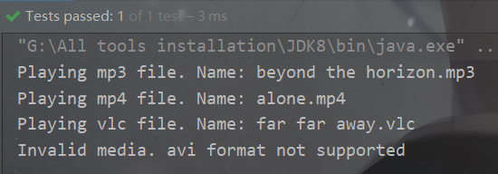

# 设计模式的六大原则

- 开闭原则：一个软件实体如类、模块和函数应该对修改封闭，对扩展开放。
- 单一职责原则：一个类只做一件事，一个类应该只有一个引起它修改的原因。
- 里氏替换原则：子类应该可以完全替换父类。也就是说在使用继承时，只扩展新功能，而不要破坏父类原有的功能。
- 依赖倒置原则：细节应该依赖于抽象，抽象不应依赖于细节。把抽象层放在程序设计的高层，并保持稳定，程序的细节变化由低层的实现层来完成。
- 迪米特法则：又名「最少知道原则」，一个类不应知道自己操作的类的细节，换言之，只和朋友谈话，不和朋友的朋友谈话。
- 接口隔离原则：客户端不应依赖它不需要的接口。如果一个接口在实现时，部分方法由于冗余被客户端空实现，则应该将接口拆分，让实现类只需依赖自己需要的接口方法。

# 创造型模式

## 工厂方法模式


```
└─factory
    │  ShapeFactory.java
    └─shape
        │  Shape.java
        └─impl
                Circle.java
                Rectangle.java
                Square.java
```
UML图：


定义接口：

```java
public interface Shape {
    void draw();
}
```

定义生产的产品：

```java
public class Rectangle implements Shape {
    @Override
    public void draw() {
        System.out.println("Inside Rectangle::draw() method.");
    }
}
```

```java
public class Circle implements Shape {
    @Override
    public void draw() {
        System.out.println("Inside Circle::draw() method.");
    }
}
```

```java
public class Square implements Shape {
    @Override
    public void draw() {
        System.out.println("Inside Square::draw() method.");
    }
}
```

定义工厂：

```java
public class ShapeFactory {
    //使用 getShape 方法获取形状类型的对象
    public Shape getShape(String shapeType){
        if(shapeType == null){
            return null;
        }
        if(shapeType.equalsIgnoreCase("CIRCLE")){
            return new Circle();
        } else if(shapeType.equalsIgnoreCase("RECTANGLE")){
            return new Rectangle();
        } else if(shapeType.equalsIgnoreCase("SQUARE")){
            return new Square();
        }
        return null;
    }
}
```

测试：

```java
@Test
public void factoryTest(){
    ShapeFactory shapeFactory = new ShapeFactory();
    Shape shape1 = shapeFactory.getShape("CIRCLE");
    shape1.draw();
    Shape shape2 = shapeFactory.getShape("RECTANGLE");
    shape2.draw();
    Shape shape3 = shapeFactory.getShape("SQUARE");
    shape3.draw();
}
```


## 抽象工厂模式


```
├─abstractfactory
   │  FactoryProducer.java
   ├─color
   │  │  Color.java
   │  └─impl
   │          Red.java
   │          Yellow.java
   ├─factory
   │      AbstractFactory.java
   │      ColorFactory.java
   │      ShapeFactory.java
   └─shape
       │  Shape.java
       └─impl
               Circle.java
               Rectangle.java
               Square.java
```

UML图：


定义产品接口：

```java
public interface Color {
    void fill();
}
```

```java
public interface Shape {
    void draw();
}
```

定义生产的产品：

```java
public class Rectangle implements Shape {
    @Override
    public void draw() {
        System.out.println("Inside Rectangle::draw() method.");
    }
}
```

```java
public class Circle implements Shape {
    @Override
    public void draw() {
        System.out.println("Inside Circle::draw() method.");
    }
}
```

```java
public class Square implements Shape {
    @Override
    public void draw() {
        System.out.println("Inside Square::draw() method.");
    }
}
```

```java
public class Red implements Color {
    @Override
    public void fill() {
        System.out.println("Inside Red::fill() method.");
    }
}
```

```java
public class Yellow implements Color {
    @Override
    public void fill() {
        System.out.println("Inside Yellow::fill() method.");
    }
}
```

定义抽象工厂：

```java
public abstract class AbstractFactory {
    public abstract Color getColor(String color);
    public abstract Shape getShape(String shapeType) ;
}
```

定义抽象工厂的实现：

```java
public class ColorFactory extends AbstractFactory {
    @Override
    public Color getColor(String color) {
        if(color == null){
            return null;
        }
        if(color.equalsIgnoreCase("RED")){
            return new Red();
        } else if(color.equalsIgnoreCase("YELLOW")){
            return new Yellow();
        }
        return null;
    }

    @Override
    public Shape getShape(String shapeType) {
        return null;
    }
}
```

```java
public class ShapeFactory extends AbstractFactory{

    @Override
    public Color getColor(String color) {
        return null;
    }

    @Override
    public Shape getShape(String shapeType) {
        if(shapeType == null){
            return null;
        }
        if(shapeType.equalsIgnoreCase("CIRCLE")){
            return new Circle();
        } else if(shapeType.equalsIgnoreCase("RECTANGLE")){
            return new Rectangle();
        } else if(shapeType.equalsIgnoreCase("SQUARE")){
            return new Square();
        }
        return null;
    }
}
```

创建一个工厂创造器/生成器类，通过传递形状或颜色信息来获取工厂：

```java
public class FactoryProducer {
    public static AbstractFactory getFactory(String choice){
        if(choice.equalsIgnoreCase("SHAPE")){
            return new ShapeFactory();
        } else if(choice.equalsIgnoreCase("COLOR")){
            return new ColorFactory();
        }
        return null;
    }
}
```

测试：

```java
@Test
public void abstractFactoryPatternTest(){
    //获取形状工厂
    AbstractFactory shapeFactory = FactoryProducer.getFactory("SHAPE");
    try{
        Shape shape1 = shapeFactory.getShape("CIRCLE");
        shape1.draw();
        Shape shape2 = shapeFactory.getShape("RECTANGLE");
        shape2.draw();
        Shape shape3 = shapeFactory.getShape("SQUARE");
        shape3.draw();
        //获取颜色工厂
        AbstractFactory colorFactory = FactoryProducer.getFactory("COLOR");
        Color color1 = colorFactory.getColor("RED");
        color1.fill();
        Color color2 = colorFactory.getColor("YELLOW");
        color2.fill();
    }catch (NullPointerException e){
        e.printStackTrace();
    }
}
```


## 单例模式

单例模式非常常见，**某个对象全局只需要一个实例时，就可以使用单例模式。**它的优点也显而易见：

- 它能够避免对象重复创建，节约空间并提升效率
- 避免由于操作不同实例导致的逻辑错误

### 懒汉式，线程不安全

**是否 Lazy 初始化：**是

**是否多线程安全：**否

**实现难度：**易

**描述：**这种方式是最基本的实现方式，这种实现最大的问题就是不支持多线程。因为没有加锁 synchronized，所以严格意义上它并不算单例模式。

这种方式 lazy loading 很明显，不要求线程安全，在多线程不能正常工作。

```java
public class Singleton {
    private static Singleton instance;
    private Singleton (){}

    public static Singleton getInstance() {
        if (instance == null) {
            instance = new Singleton();
        }
        return instance;
    }
}
```

### 懒汉式，线程安全

**是否 Lazy 初始化：**是

**是否多线程安全：**是

**实现难度：**易

**描述：**这种方式具备很好的 lazy loading，能够在多线程中很好的工作，但是，效率很低，99% 情况下不需要同步。

优点：第一次调用才初始化，避免内存浪费。

缺点：必须加锁 synchronized 才能保证单例，但加锁会影响效率。

`getInstance()`的性能对应用程序不是很关键（该方法使用不太频繁）。

> 跟上一种相比，多了个synchronized

```java
public class Singleton {  
    private static Singleton instance;  
    private Singleton (){}  
    public static synchronized Singleton getInstance() {  
    if (instance == null) {  
        instance = new Singleton();  
    }  
    return instance;  
    }  
}
```

### 饿汉式

**是否 Lazy 初始化：**否

**是否多线程安全：**是

**实现难度：**易

**描述：**这种方式比较常用，但容易产生垃圾对象。

优点：没有加锁，执行效率会提高。

缺点：类加载时就初始化，浪费内存。

它基于 classloader 机制避免了多线程的同步问题，不过，instance 在类装载时就实例化，虽然导致类装载的原因有很多种，在单例模式中大多数都是调用 getInstance 方法， 但是也不能确定有其他的方式（或者其他的静态方法）导致类装载，这时候初始化 instance 显然没有达到 lazy loading 的效果。

```java
public class Singleton {  
    private static Singleton instance = new Singleton();  
    private Singleton (){}  
    public static Singleton getInstance() {  
    	return instance;  
    }  
}
```

### 双检锁/双重校验锁

**JDK 版本：**JDK1.5 起

**是否 Lazy 初始化：**是

**是否多线程安全：**是

**实现难度：**较复杂

**描述：**这种方式采用双锁机制，安全且在多线程情况下能保持高性能。

getInstance() 的性能对应用程序很关键。

```java
public class Singleton {  
    private volatile static Singleton singleton;  
    private Singleton (){}  
    public static Singleton getSingleton() {  
    if (singleton == null) {  
        synchronized (Singleton.class) {  
            if (singleton == null) {  
                singleton = new Singleton();  
            }  
        }  
    }  
    return singleton;  
    }  
}
```

### 登记式/静态内部类

**是否 Lazy 初始化：**是

**是否多线程安全：**是

**实现难度：**一般

**描述：**这种方式能达到双检锁方式一样的功效，但实现更简单。对静态域使用延迟初始化，应使用这种方式而不是双检锁方式。这种方式只适用于静态域的情况，双检锁方式可在实例域需要延迟初始化时使用。

这种方式同样利用了 classloader 机制来保证初始化 instance 时只有一个线程，它跟第 3 种方式不同的是：第 3 种方式只要 Singleton 类被装载了，那么 instance 就会被实例化（没有达到 lazy loading 效果），而这种方式是 Singleton 类被装载了，instance 不一定被初始化。因为 SingletonHolder 类没有被主动使用，只有通过显式调用 getInstance 方法时，才会显式装载 SingletonHolder 类，从而实例化 instance。想象一下，如果实例化 instance 很消耗资源，所以想让它延迟加载，另外一方面，又不希望在 Singleton 类加载时就实例化，因为不能确保 Singleton 类还可能在其他的地方被主动使用从而被加载，那么这个时候实例化 instance 显然是不合适的。这个时候，这种方式相比第 3 种方式就显得很合理。

```java
public class Singleton {  
    private static class SingletonHolder {  
    	private static final Singleton INSTANCE = new Singleton();  
    }  
    private Singleton (){}  
    public static final Singleton getInstance() {  
    	return SingletonHolder.INSTANCE;  
    }  
}
```

### 枚举

**JDK 版本：**JDK1.5 起

**是否 Lazy 初始化：**否

**是否多线程安全：**是

**实现难度：**易

**描述：**这种实现方式还没有被广泛采用，但这是实现单例模式的最佳方法。它更简洁，自动支持序列化机制，绝对防止多次实例化。

这种方式是 Effective Java 作者 Josh Bloch 提倡的方式，它不仅能避免多线程同步问题，而且还自动支持序列化机制，防止反序列化重新创建新的对象，绝对防止多次实例化。不过，由于 JDK1.5 之后才加入 enum 特性，用这种方式写不免让人感觉生疏，在实际工作中，也很少用。

不能通过 reflection attack 来调用私有构造方法。

```java
public enum Singleton {  
    INSTANCE;  
    public void whateverMethod() {  
    }  
}
```

**经验之谈：**一般情况下，不建议使用第 1 种和第 2 种懒汉方式，建议使用第 3 种饿汉方式。只有在要明确实现 lazy loading 效果时，才会使用第 5 种登记方式。如果涉及到反序列化创建对象时，可以尝试使用第 6 种枚举方式。如果有其他特殊的需求，可以考虑使用第 4 种双检锁方式。

## 建造者模式

将一个复杂的构建与其表示相分离，使得同样的构建过程可以创建不同的表示。


- Builder：为创建一个Product对象的各个部件指定抽象接口
- ConcreteBuilder：实现Builder的接口以构造和装配该产品的各个部件，定义并明确它所创建的表示，提供一个检索产品的接口
- Director：构造一个使用Builder接口的对象
- Product：表示被构造的复杂对象。ConcreteBuilder创建该产品的内部表示并定义它的装配过程。包含定义组成部件的类，包括将这些部件装配成最终产品的接口

定义产品：

```java
public class Product {
    private List<String> parts = new LinkedList<>();

    public Product() {
    }

    public void add(String part) {
        parts.add(part);
    }

    public void show() {
        for (String s : parts) {
            System.out.println(s);
        }
    }
}
```

创建对象的接口Builder：

```java
public interface Builder {
    void BuildPartA();
    void BuildPartB();
    default Product getResult(){
        return null;
    }
}
```

实现接口，拼装零件的操作：

```java
public class ConcreteBuilderPlanA implements Builder{
    private Product product = new Product();
    @Override
    public void BuildPartA() {
        product.add("PlanA - 零件A");
    }

    @Override
    public void BuildPartB() {
        product.add("PlanA - 零件B");
    }

    public Product getResult(){
        return product;
    }
}
```

```java
public class ConcreteBuilderPlanB implements Builder {
    private Product product = new Product();
    @Override
    public void BuildPartA() {
        product.add("PlanB - 零件A");
    }

    @Override
    public void BuildPartB() {
        product.add("PlanB - 零件B");
    }

    @Override
    public Product getResult() {
        return product;
    }
}
```

指挥者类，将拼装零件的操作排好：

```java
public class Director {
    public void construct(Builder builder){
        builder.BuildPartA();
        builder.BuildPartB();
    }
}
```

测试：

```java
@Test
public void test(){
    Director director = new Director();
    ConcreteBuilderPlanA planA = new ConcreteBuilderPlanA();
    director.construct(planA);
    Product p1 = planA.getResult();
    p1.show();

    ConcreteBuilderPlanB planB = new ConcreteBuilderPlanB();
    director.construct(planB);
    Product p2 = planB.getResult();
    p2.show();
}
/************
PlanA - 零件A
PlanA - 零件B
PlanB - 零件A
PlanB - 零件B
************/
```

## 原型模式

主要是clone方法的实现，其他的不重要

WorkExperience：

```java
public class WorkExperience {
    private String workDate;
    private String company;

    public String getWorkDate() {
        return workDate;
    }

    public void setWorkDate(String workDate) {
        this.workDate = workDate;
    }

    public String getCompany() {
        return company;
    }

    public void setCompany(String company) {
        this.company = company;
    }

    public WorkExperience() {
    }

    public WorkExperience(String workDate, String company) {
        this.workDate = workDate;
        this.company = company;
    }

    public WorkExperience clone(){
        WorkExperience workExperience = new WorkExperience();
        workExperience.setWorkDate(this.workDate);
        workExperience.setCompany(this.company);
        return workExperience;
    }
}
```

Resume：

```java
public class Resume {
    private String name;
    private Integer age;
    private WorkExperience work;

    public String getName() {
        return name;
    }

    public void setName(String name) {
        this.name = name;
    }

    public Integer getAge() {
        return age;
    }

    public void setAge(Integer age) {
        this.age = age;
    }

    public WorkExperience getWork() {
        return work;
    }

    public void setWork(WorkExperience work) {
        this.work = work;
    }

    public Resume clone(){
        Resume resume = new Resume();
        resume.setAge(this.age);
        resume.setName(this.name);
        WorkExperience workClone = work.clone();
        resume.setWork(workClone);
        return resume;
    }

    @Override
    public String toString() {
        return "Resume{" +
                "name='" + name + '\'' +
                ", age=" + age +
                ", work=[workDate = " + work.getWorkDate() +
                ", company = "+work.getCompany() +"]"+
                '}';
    }
}
```

测试：

```java
@Test
public void test(){
    Resume resume1 = new Resume();
    resume1.setName("张三");
    resume1.setAge(30);
    WorkExperience workExperience = new WorkExperience("2021/04/24","阿里巴巴");
    resume1.setWork(workExperience);
    System.out.println(resume1);

    Resume resume2 = resume1.clone();
    resume2.setName("李四");
    resume2.setWork(new WorkExperience("2021/06/05","字节跳动"));
    System.out.println(resume2);

    Resume resume3 = resume1.clone();
    resume3.setName("王五");
    resume3.setAge(18);
    System.out.println(resume3);
}
/********************
Resume{name='张三', age=30, work=[workDate = 2021/04/24, company = 阿里巴巴]}
Resume{name='李四', age=30, work=[workDate = 2021/06/05, company = 字节跳动]}
Resume{name='王五', age=18, work=[workDate = 2021/04/24, company = 阿里巴巴]}
********************/
```

# 结构型模式

## 适配器模式


```
└─adapter
    │  AudioPlayer.java
    │  MediaAdapter.java
    │  MediaPlayer.java
    └─player
        │  AdvancedMediaPlayer.java
        └─impl
                Mp4Player.java
                VlcPlayer.java
```

UML：


适配后的播放器：

```java
public interface AdvancedMediaPlayer {
    void playVlc(String fileName);
    void playMp4(String fileName);
}
```

```java
public class VlcPlayer implements AdvancedMediaPlayer {
    @Override
    public void playVlc(String fileName) {
        System.out.println("Playing vlc file. Name: "+ fileName);
    }

    @Override
    public void playMp4(String fileName) {}
}
```

```java
public class Mp4Player implements AdvancedMediaPlayer {
    @Override
    public void playVlc(String fileName) {}

    @Override
    public void playMp4(String fileName) {
        System.out.println("Playing mp4 file. Name: "+ fileName);
    }
}
```

适配器：

```java
public class MediaAdapter implements MediaPlayer {
    AdvancedMediaPlayer advancedMusicPlayer;

    public MediaAdapter(String audioType) {
        if (audioType.equalsIgnoreCase("vlc")) {
            advancedMusicPlayer = new VlcPlayer();
        } else if (audioType.equalsIgnoreCase("mp4")) {
            advancedMusicPlayer = new Mp4Player();
        }
    }

    @Override
    public void play(String audioType, String fileName) {
        if (audioType.equalsIgnoreCase("vlc")) {
            advancedMusicPlayer.playVlc(fileName);
        } else if (audioType.equalsIgnoreCase("mp4")) {
            advancedMusicPlayer.playMp4(fileName);
        }
    }
}
```

适配前的播放器：

```java
public interface MediaPlayer {
    void play(String audioType, String fileName);
}
```

```java
public class AudioPlayer implements MediaPlayer {
    MediaAdapter mediaAdapter;

    @Override
    public void play(String audioType, String fileName) {
        //播放 mp3 音乐文件的内置支持
        if (audioType.equalsIgnoreCase("mp3")) {
            System.out.println("Playing mp3 file. Name: " + fileName);
        }
        //mediaAdapter 提供了播放其他文件格式的支持
        else if (audioType.equalsIgnoreCase("vlc")
                || audioType.equalsIgnoreCase("mp4")) {
            mediaAdapter = new MediaAdapter(audioType);
            mediaAdapter.play(audioType, fileName);
        } else {
            System.out.println("Invalid media. " +
                    audioType + " format not supported");
        }
    }
}
```

测试：

```java
@Test
public void adapterPatternTest(){
    AudioPlayer audioPlayer = new AudioPlayer();

    audioPlayer.play("mp3", "beyond the horizon.mp3");
    audioPlayer.play("mp4", "alone.mp4");
    audioPlayer.play("vlc", "far far away.vlc");
    audioPlayer.play("avi", "mind me.avi");
}
```



## 代理模式


```
└─proxy
        Image.java
        ProxyImage.java
        RealImage.java
```


接口：

```java
public interface Image {
    void display();
}
```

被代理：

```java
public class RealImage implements Image {
    private String fileName;

    public RealImage(String fileName){
        this.fileName = fileName;
        loadFromDisk(fileName);
    }

    @Override
    public void display() {
        System.out.println("Displaying " + fileName);
    }

    private void loadFromDisk(String fileName){
        System.out.println("Loading " + fileName);
    }
}
```

代理Proxy：

```java
public class ProxyImage implements Image {
    private RealImage realImage;
    private String fileName;

    public ProxyImage(String fileName){
        this.fileName = fileName;
    }

    @Override
    public void display() {
        if(realImage == null){
            realImage = new RealImage(fileName);
        }
        realImage.display();
    }
}
```

测试：

```java
@Test
public void proxyPatternTest(){
    Image image = new ProxyImage("test_10mb.jpg");

    // 图像将从磁盘加载
    image.display();
    System.out.println("--------------");
    // 图像不需要从磁盘加载
    image.display();
}
```


## 外观模式

封装内部，对外提供一个接口

```
├─facade
   │  ShapeMaker.java
   └─shape
       │  Shape.java
       └─impl
               Circle.java
               Rectangle.java
               Square.java
```

实例与工厂方法模式中相同，不同的是下面这个类的写法：

```java
public class ShapeMaker {
    private Shape circle;
    private Shape rectangle;
    private Shape square;

    public ShapeMaker() {
        circle = new Circle();
        rectangle = new Rectangle();
        square = new Square();
    }

    public void drawCircle(){
        circle.draw();
    }
    public void drawRectangle(){
        rectangle.draw();
    }
    public void drawSquare(){
        square.draw();
    }
}
```

测试：

```java
@Test
public void facadePatternTest(){
    ShapeMaker shapeMaker = new ShapeMaker();

    shapeMaker.drawCircle();
    shapeMaker.drawRectangle();
    shapeMaker.drawSquare();
}
```


## 桥接模式

**将形状和颜色分离，根据需要对形状和颜色进行组合**，这就是桥接模式的思想

> 桥接模式：将抽象部分与它的实现部分分离，使它们都可以独立地变化。它是一种对象结构型模式，又称为柄体模式或接口模式。

IColor接口及其实现类：

```java
public interface IColor {
    String getColor();
}
```

```java
public class Red implements IColor {
    @Override
    public String getColor() {
        return "Red";
    }
}
```

```java
public class Blue implements IColor {
    @Override
    public String getColor() {
        return "Blue";
    }
}
```

```java
public class Yellow implements IColor {
    @Override
    public String getColor() {
        return "Yellow";
    }
}
```

IShape及其实现类：

```java
public interface IShape {
    void draw();
}
```

```java
public class Rectangle implements IShape {
    private IColor color;

    public void setColor(IColor color) {
        this.color = color;
    }

    @Override
    public void draw() {
        System.out.println("绘制" + color.getColor() + "矩形");
    }
}
```

```java
public class Round implements IShape {
    private IColor color;

    public void setColor(IColor color) {
        this.color = color;
    }

    @Override
    public void draw() {
        System.out.println("绘制"+color.getColor()+"圆形");
    }
}
```

```java
public class Triangle implements IShape {
    private IColor color;

    public void setColor(IColor color) {
        this.color = color;
    }

    @Override
    public void draw() {
        System.out.println("绘制" + color.getColor() + "三角形");
    }
}
```

测试：

```java
@Test
public void bridgePatternTest(){
    Rectangle rectangle = new Rectangle();
    rectangle.setColor(new Red());
    rectangle.draw();

    Round round = new Round();
    round.setColor(new Yellow());
    round.draw();

    Triangle triangle = new Triangle();
    triangle.setColor(new Blue());
    triangle.draw();
}
```


# 行为型模式

## 模版模式

## 观察者模式