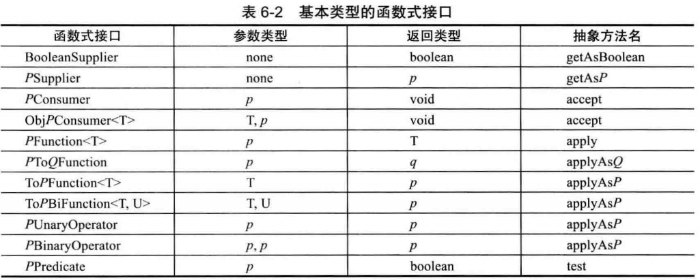

> 以下内容摘自Java核心技术1第六章和刘政怡课件

# 宏观了解

## 内部类

```java
class A{
	B b;
	class B{
	}
}
```

## 匿名类

匿名类有以下两种使用方式：

+ 作为子类，重写父类方法
+ 实现接口，实现接口声明方法

```java
public class ArgsTest {
    public static void main(String[] args) {
        // 重写接口方法
        HH hh = new HH() {
            @Override
            public void show(Integer id) {
                System.out.println("接口HH,匿名内部类" + id);
            }
        };
        hh.show(200);
        // 重写父类方法
        Employee e = new Employee() {
            @Override
            public void show() {
                System.out.println("内部类--show");
            }
        };
        e.show();
    }
}
```


## lambda表达式

**lambda表达式整体返回的是接口**

```java
HH hh = (id)->{System.out.println("接口HH,匿名内部类" + id);};
```

# 细说lambda表达式

## 函数式接口

书上写的常用函数式接口：




下面将举例说明函数式接口使用方式：

+ Java8中自带的函数式接口有`@FunctionalInterface`注解

以下是Java8中自带的`Predicate<T>`接口

```java
@FunctionalInterface
public interface Predicate<T> {
    boolean test(T t);
    default Predicate<T> and(Predicate<? super T> other) {
        Objects.requireNonNull(other);
        return (t) -> test(t) && other.test(t);
    }
    default Predicate<T> negate() {
        return (t) -> !test(t);
    }
    default Predicate<T> or(Predicate<? super T> other) {
        Objects.requireNonNull(other);
        return (t) -> test(t) || other.test(t);
    }
    static <T> Predicate<T> isEqual(Object targetRef) {
        return (null == targetRef)
                ? Objects::isNull
                : object -> targetRef.equals(object);
    }
}
```

使用案例：

通过lambda表达式实现接口中的方法，并将返回的接口对象传入到使用接口声明的方法中

+ lambda表达式实现了接口方法
+ **lambda表达式返回的是实现接口的匿名对象**
+ 方法形参接受接口声明，因此调用该方法时候可以直接使用接口对象的声明

```java
public class ArgsTest {
    public static void main(String[] args) {
        List<Integer> list = Arrays.asList(1, 2, 3, 4, 5, 6);
        System.out.println("输出所有偶数:");
        /*函数式编程的完整写法，与简写结果相同
        Predicate<Integer> predicate1 = n -> n % 2 == 0;
        eval(list, predicate1);
        */
        eval(list, n-> n%2 == 0 );
        System.out.println("输出大于 3 的所有数字:");
        /*函数式编程的完整写法，与简写结果相同
        Predicate<Integer> predicate2 = n -> n > 3;
        eval(list, predicate2);
        */
        eval(list, n-> n > 3 );
    }

    public static void eval(List<Integer> list, Predicate<Integer> predicate) {
        for(Integer n: list) {
            if(predicate.test(n)) {
                System.out.println(n + " ");
            }
        }
    }

}
```


## 引用

方法引用通过方法的名字来指向一个方法。

方法引用可以使语言的构造更紧凑简洁，减少冗余代码。

方法引用使用一对冒号 **::** 。

下面，我们在 Car 类中定义了 4 个方法作为例子来区分 Java 中 4 种不同方法的引用。

+ `object::instanceMethod`
+ `Class::staticMethod`
+ `Class::instanceMethod`

```java
@FunctionalInterface
public interface Supplier<T> {
    T get();
}
 
class Car {
    //Supplier是jdk1.8的接口，这里和lamda一起使用了
    public static Car create(final Supplier<Car> supplier) {
        return supplier.get();
    }
 
    public static void collide(final Car car) {
        System.out.println("Collided " + car.toString());
    }
 
    public void follow(final Car another) {
        System.out.println("Following the " + another.toString());
    }
 
    public void repair() {
        System.out.println("Repaired " + this.toString());
    }
}
```

- **构造器引用：**它的语法是Class::new，或者更一般的Class< T >::new实例如下：`final Car car = Car.create( Car::new ); final List< Car > cars = Arrays.asList( car );`
- **静态方法引用：**它的语法是Class::static_method，实例如下：`cars.forEach( Car::collide );`
- **特定类的任意对象的方法引用：**它的语法是Class::method实例如下：`cars.forEach( Car::repair );`
- **特定对象的方法引用：**它的语法是instance::method实例如下：`final Car police = Car.create( Car::new ); cars.forEach( police::follow );`

# 内部类

## 创建内部类

1.在外部类外部创建非静态内部类：

语法：`外部类.内部类 内部类对象 = new 外部类().new 内部类();`
举例：`Outer.Inner in = new Outer().new Inner();`

2.在外部类外部创建静态内部类：

语法：`外部类.内部类 内部类对象 = new 外部类.内部类();`
举例：`Outer.Inner in = new Outer.Inner();`

3.在外部类内部创建内部类：

在外部类内部创建内部类，就像普通对象一样直接创建：`Inner in = new Inner();`

```java
public class Outer {
    private String name;
    private Integer age;

    class Pets{
        private String petName;
        private Integer petAge;
        public void show(){
            System.out.println("Inner-show方法");
        }
    }

    static class Hobbies{
        private String hobbyName;
        public void show() {
            System.out.println("爱好是"+this.hobbyName);
        }

        public void setHobbyName(String hobbyName) {
            this.hobbyName = hobbyName;
        }
    }

    public void show(){
        System.out.println("Outer-show方法");
    }
}

// 测试
public class JavaTest {
    public static void main(String[] args) {
        // 外部类
        Outer outer = new Outer();
        outer.show();
        // 内部类
        Outer.Pets pets = new Outer().new Pets();
        pets.show();
        // 静态内部类
        Outer.Hobbies hobbies = new Outer.Hobbies();
        hobbies.setHobbyName("girls");
        hobbies.show();
    }
}
```


## 匿名内部类

```java
public void start(int interval){
    ActionListener listener = new ActionListener(){
        public void actionPerformed(ActionEcent event){
            System.out.println("HelloWorld"+new Date());
        }
    };
}
```

## 局部内部类

```java
//在局部位置，可以创建内部类对象，通过对象调用和内部类方法
class Outer {
    private int age = 20;
    public void method() {
        final int age2 = 30;
        class Inner {
            public void show() {
                System.out.println(age);
                //从内部类中访问方法内变量age2，需要将变量声明为最终类型。
                System.out.println(age2);
            }
        }

        Inner i = new Inner();
        i.show();
    }
}
```

## 为啥使用内部类

### 封装性

如果我们的内部类不想轻易被任何人访问，可以选择使用private修饰内部类，这样我们就无法通过创建对象的方法来访问，想要访问只需要在外部类中定义一个public修饰的方法，间接调用。

```java
public interface Demo {
    void show();
}

public class Outer {
    private String name;
    private Integer age;

    private class Inner implements Demo{
        @Override
        public void show() {
            System.out.println("Inner-show");
        }
    }

    public Demo getInner(){
        return new Inner();
    }
}

// 测试
public class JavaTest {
    public static void main(String[] args) {
        Outer outer = new Outer();
        Demo demo = outer.getInner();
        demo.show();
        System.out.println(demo.getClass());
    }
}
```


### 间接实现多继承

```java
public class Demo1 {
    public String name() {
        return "BWH_Steven";
    }
}

public class Demo2 {
    public String email() {
        return "xxx.@163.com";
    }
}

public class MyDemo {

    private class test1 extends Demo1 {
        public String name() {
            return super.name();
        }
    }

    private class test2 extends Demo2  {
        public String email() {
            return super.email();
        }
    }

    public String name() {
        return new test1().name();
    }

    public String email() {
        return new test2().email();
    }

    public static void main(String args[]) {
        MyDemo md = new MyDemo();
        System.out.println("我的姓名:" + md.name());
        System.out.println("我的邮箱:" + md.email());
    }
}
```

我们编写了两个待继承的类`Demo1`和`Demo2`，在`MyDemo`类中书写了两个内部类，`test1`和`test2`两者分别继承了`Demo1`和`Demo2`类，这样`MyDemo`中就间接的实现了多继承

### 接口回调

```java
public interface Demo {
    void show();
}

public class Outer {
    public void test(Demo demo){
        System.out.println("test method");
        demo.show();
    }
}

// 测试
public class JavaTest {
    public static void main(String[] args) {
        Outer outer = new Outer();
        outer.test(new Demo() {
            @Override
            public void show() {
                System.out.println("Demo接口实现");
            }
        });
    }
}
/************
test method
Demo接口实现
*************/
```


