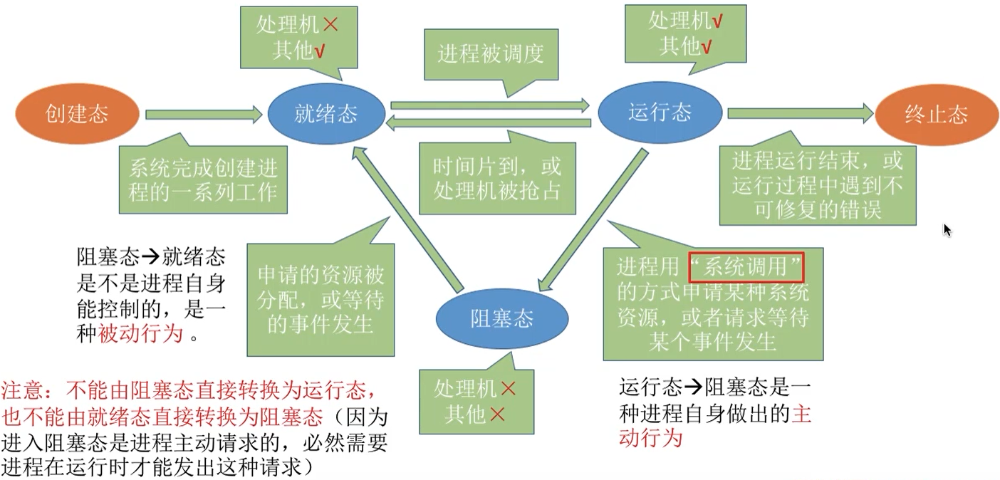
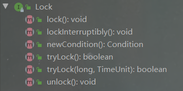

# 先导

!> 可以先看后面的，提到时候再回来看这部分

## 进程和线程

进程：

- 当一个程序被运行，就开启了一个进程， 比如启动了qq，word
- 程序由指令和数据组成，指令要运行，数据要加载，指令被cpu加载运行，数据被加载到内存，指令运行时可由cpu调度硬盘、网络等设备

线程：

- 一个进程内可分为多个线程
- 一个线程就是一个指令流，cpu调度的最小单位，由cpu一条一条执行指令


## happens-before

下面就来具体介绍下happens-before原则（先行发生原则）：

- 程序次序规则：一个线程内，按照代码顺序，书写在前面的操作先行发生于书写在后面的操作
- 锁定规则：一个unLock操作先行发生于后面对同一个锁额lock操作
- volatile变量规则：对一个变量的写操作先行发生于后面对这个变量的读操作
- 传递规则：如果操作A先行发生于操作B，而操作B又先行发生于操作C，则可以得出操作A先行发生于操作C
- 线程启动规则：Thread对象的start()方法先行发生于此线程的每个一个动作
- 线程中断规则：对线程interrupt()方法的调用先行发生于被中断线程的代码检测到中断事件的发生
- 线程终结规则：线程中所有的操作都先行发生于线程的终止检测，我们可以通过Thread.join()方法结束、Thread.isAlive()的返回值手段检测到线程已经终止执行
- 对象终结规则：一个对象的初始化完成先行发生于他的finalize()方法的开始

这8条原则摘自《深入理解Java虚拟机》。

这8条规则中，前4条规则是比较重要的，后4条规则都是显而易见的。

下面我们来解释一下前4条规则：

对于程序次序规则来说，我的理解就是一段程序代码的执行在单个线程中看起来是有序的。注意，虽然这条规则中提到“书写在前面的操作先行发生于书写在后面的操作”，这个应该是程序看起来执行的顺序是按照代码顺序执行的，因为虚拟机可能会对程序代码进行指令重排序。虽然进行重排序，但是最终执行的结果是与程序顺序执行的结果一致的，它只会对不存在数据依赖性的指令进行重排序。因此，在单个线程中，程序执行看起来是有序执行的，这一点要注意理解。事实上，这个规则是用来保证程序在单线程中执行结果的正确性，但无法保证程序在多线程中执行的正确性。

第二条规则也比较容易理解，也就是说无论在单线程中还是多线程中，同一个锁如果出于被锁定的状态，那么必须先对锁进行了释放操作，后面才能继续进行lock操作。

第三条规则是一条比较重要的规则，也是后文将要重点讲述的内容。直观地解释就是，如果一个线程先去写一个变量，然后一个线程去进行读取，那么写入操作肯定会先行发生于读操作。

第四条规则实际上就是体现happens-before原则具备传递性。

## JMM

Java内存模型（Java Memory Model）体现在以下三个方面

- 原子性：一段代码是一个整体，不可分割，要么不执行，要么全执行
- 可见性：当一个线程修改了共享变量时，另一个线程可以读取到这个修改后的值。
- 有序性：JVM在不影响程序正确性的情况下可能会调整语句的执行顺序，该情况也称为**指令重排序**

# 多线程的基本使用

## 定义任务、创建和运行线程

定义任务

- 继承Thread类 （可以说是 将任务和线程合并在一起）
- 实现Runnable接口 （可以说是 将任务和线程分开了）
- 实现Callable接口（利用`FutureTask`执行任务）

Thread实现任务的局限性

- 任务逻辑写在Thread类的run方法中，有单继承的局限性
- 创建多线程时，每个任务有成员变量时不共享，必须加static才能做到共享

Runnable和Callable解决了Thread的局限性

但是Runnable相比Callable有以下的局限性

1. 任务没有返回值
2. 任务无法抛异常给调用方

如下代码，几种定义线程的方式：

```java
class T extends Thread {
    @Override
    public void run() {
        System.out.println("我是继承Thread的任务");
    }
}

class R implements Runnable {

    @Override
    public void run() {
        System.out.println("我是实现Runnable的任务");
    }
}

class C implements Callable<String> {

    @Override
    public String call() throws Exception {
        System.out.println("我是实现Callable的任务");
        return "success";
    }
}
```

创建线程的方式

1. 通过Thread类直接创建线程
2. 利用线程池内部创建线程

启动线程的方式

- 调用线程的start()方法

```java
// 启动继承Thread类的任务
new T().start();
// 启动继承Thread匿名内部类的任务 可用lambda优化
Thread t = new Thread(){
  @Override
  public void run() {
    System.out.println("我是Thread匿名内部类的任务");
  }
};


// 启动实现Runnable接口的任务
new Thread(new R()).start();
// 启动实现Runnable匿名实现类的任务
new Thread(new Runnable() {
    @Override
    public void run() {
        System.out.println("我是Runnable匿名内部类的任务");
    }
}).start();
// 启动实现Runnable的lambda简化后的任务
new Thread(() -> System.out.println("我是Runnable的lambda简化后的任务")).start();


// 启动实现了Callable接口的任务,结合FutureTask可以获取线程执行的结果
FutureTask<String> target = new FutureTask<>(new C());
new Thread(target).start();
System.out.println(target.get());
```

## 上下文切换

cpu执行线程的任务时，会为线程分配时间片，以下几种情况会发生上下文切换。

- 线程的cpu时间片用完
- 垃圾回收
- 线程自己调用了`sleep、yield、wait、join、park、synchronized、lock`等方法

## 线程优先级

Java中线程优先级可以指定，范围是1~10。Java只是给操作系统一个优先级的**参考值**，线程最终**在操作系统的优先级**是多少还是由操作系统决定。

高优先级的线程将会比低优先级的线程有**更高的几率**得到执行。我们使用方法`Thread`类的`setPriority()`实例方法来设定线程的优先级。

```java
public class Demo {
    public static void main(String[] args) {
        Thread a = new Thread();
        System.out.println("我是默认线程优先级："+a.getPriority());
        Thread b = new Thread();
        b.setPriority(10);
        System.out.println("我是设置过的线程优先级："+b.getPriority());
    }
}

/*************
我是默认线程优先级：5
我是设置过的线程优先级：10
*************/
```

!> cpu比较忙时，优先级高的线程获取更多的时间片；cpu比较闲时，优先级设置基本没用

守护线程：**当所有的非守护线程都结束后，即使它没有执行完，也会强制结束。**默认的线程都是非守护线程。垃圾回收线程就是典型的守护线程。

## 线程相关方法

主要总结Thread类中的核心方法：

| 方法名称          | 是否static | 方法说明                                                     |
| ----------------- | ---------- | ------------------------------------------------------------ |
| start()           | 否         | 让线程启动，进入就绪状态，等待cpu分配时间片                  |
| run()             | 否         | 重写Runnable接口的方法，线程获取到cpu时间片时执行的具体逻辑  |
| yield()           | 是         | 线程的礼让，使得获取到cpu时间片的线程进入就绪状态，重新争抢时间片 |
| sleep(time)       | 是         | 线程休眠固定时间，进入阻塞状态，休眠时间完成后重新争抢时间片,休眠可被打断 |
| join()/join(time) | 否         | 调用线程执行完或者执行time时间，其他线程才能执行             |
| isInterrupted()   | 否         | 获取线程的打断标记，true：被打断，false：没有被打断。调用后不会修改打断标记 |
| interrupt()       | 否         | 打断线程，抛出InterruptedException异常的方法均可被打断，但是打断后不会修改打断标记，正常执行的线程被打断后会修改打断标记 |
| interrupted()     | 否         | 获取线程的打断标记，调用后会清空打断标记                     |
| stop()            | 否         | 停止线程运行，不推荐                                         |
| suspend()         | 否         | 挂起线程，不推荐                                             |
| resume()          | 否         | 恢复线程运行，不推荐                                         |
| currentThread()   | 是         | 获取当前线程                                                 |

Object中与线程相关方法：

| 方法名称                  | 方法说明                               |
| ------------------------- | -------------------------------------- |
| wait()/wait(long timeout) | 获取到锁的线程进入阻塞状态             |
| notify()                  | 随机唤醒被wait()的一个线程             |
| notifyAll();              | 唤醒被wait()的所有线程，重新争抢时间片 |

# 线程状态转换

## 转换模型

操作系统经典五状态转换模型：



Java中的六状态转换模型：


```java
// Thread.State 源码
public enum State {
    NEW,
    RUNNABLE,
    BLOCKED,
    WAITING,
    TIMED_WAITING,
    TERMINATED;
}
```

**NEW：**

处于NEW状态的线程此时尚未启动。这里的尚未启动指的是还没调用Thread实例的start()方法。

**RUNNABLE：**

Java线程的**RUNNABLE**状态其实是包括了传统操作系统线程的**ready**和**running**两个状态的。

**BLOCKED：**

阻塞状态。处于BLOCKED状态的线程正等待锁的释放以进入同步区。

**WAITING：**

等待状态。处于等待状态的线程变成RUNNABLE状态需要其他线程唤醒。

**TIMED_WAITING：**

超时等待状态。线程等待一个具体的时间，时间到后会被自动唤醒。

**TERMINATED：**

终止状态。此时线程已执行完毕。

!> waiting和blocked状态的区别：**进入waiting状态是线程主动的，而进入blocked状态是被动的。**更进一步的说，进入blocked状态是在同步（synchronized代码之外），而进入waiting状态是在同步代码之内。

## 状态转换实例

### 线程礼让

`yield()`方法会让运行中的线程切换到就绪状态，重新争抢cpu的时间片，争抢时是否获取到时间片看cpu的分配。

```java
public class YieldTest {
    public static void main(String[] args) {
        MyThread myThread = new MyThread();
        new Thread(myThread,"a").start();
        new Thread(myThread,"b").start();
    }
}

class MyThread implements Runnable{
    @Override
    public void run() {
        System.out.println(Thread.currentThread().getName() + "线程开始执行");
        Thread.yield();
        System.out.println(Thread.currentThread().getName() + "线程结束执行");
    }
}

/***************线程礼让成功
a线程开始执行
b线程开始执行
a线程结束执行
b线程结束执行
***************/
/***************线程礼让失败
a线程开始执行
a线程结束执行
b线程开始执行
b线程结束执行
***************/
```

### 线程阻塞

线程的阻塞可以分为好多种，从操作系统层面和java层面阻塞的定义可能不同，但是广义上使得线程阻塞的方式有下面几种

- BIO阻塞，即使用了阻塞式的io流
- `sleep(long time)`让线程休眠进入阻塞状态
- `a.join()`调用该方法的线程进入阻塞，等待a线程执行完恢复运行
- `sychronized`或`ReentrantLock`造成线程未获得锁进入阻塞状态 (同步锁章节细说)
- 获得锁之后调用`wait()`方法也会让线程进入阻塞状态 
- `LockSupport.park()`让线程进入阻塞状态

### 线程打断

```java
// 相关方法的定义
public void interrupt() {
}
public boolean isInterrupted() {
}
public static boolean interrupted() {
}
```

打断标记：线程是否被打断，true表示被打断了，false表示没有

isInterrupted() 获取线程的打断标记 ,调用后不会修改线程的打断标记

interrupt()方法用于中断线程

- 可以打断sleep,wait,join等显式的抛出InterruptedException方法的线程，但是打断后,线程的打断标记还是false
- 打断正常线程 ，线程不会真正被中断，但是线程的打断标记为true

interrupted() 获取线程的打断标记，调用后清空打断标记 即如果获取为true 调用后打断标记为false (不常用)

interrupt实例： 有个后台监控线程不停的监控，当外界打断它时，就结束运行。

# 同步锁

## 线程安全

- 一个程序运行多个线程本身是没有问题的
- 问题有可能出现在多个线程访问共享资源
  - 多个线程都是读共享资源也是没有问题的
  - 当多个线程读写共享资源时，如果发生指令交错，就会出现问题

临界区：一段代码如果对共享资源的多线程读写操作，这段代码就被称为临界区。

注意的是指令交错指的是 java代码在解析成字节码文件时，java代码的一行代码在字节码中可能有多行，在线程上下文切换时就有可能交错。

**线程安全指的是多线程调用同一个对象的临界区的方法时，对象的属性值一定不会发生错误**，这就是保证了线程安全。

## synchronized

同步锁也叫对象锁，是锁在对象上的，不同的对象就是不同的锁。

该关键字是用于**保证线程安全**的，是阻塞式的解决方案。

让同一个时刻最多只有一个线程能持有对象锁，其他线程在想获取这个对象锁就会被阻塞，不用担心上下文切换的问题。

!> 注意： 不要理解为一个线程加了锁 ，进入 synchronized代码块中就会一直执行下去。如果时间片切换了，也会执行其他线程，再切换回来会紧接着执行，只是不会执行到有竞争锁的资源，因为当前线程还未释放锁。

当一个线程执行完synchronized的代码块后 会唤醒正在等待的线程

synchronized实际上使用对象锁保证临界区的原子性 临界区的代码是不可分割的 不会因为线程切换所打断。

基本使用：

```java
// 加在方法上 实际是对this对象加锁
private synchronized void a() {
}

// 同步代码块,锁对象可以是任意的，加在this上和a()方法作用相同
private void b(){
    synchronized (this){

    }
}

// 加在静态方法上实际是对类对象加锁
private synchronized static void c() {

}

// 同步代码块实际是对类对象加锁和c()方法作用相同
private void d(){
    synchronized (TestSynchronized.class){
        
    }
}

// 上述b方法对应的字节码源码其中monitorenter就是加锁的地方
 0 aload_0
 1 dup
 2 astore_1
 3 monitorenter
 4 aload_1
 5 monitorexit
 6 goto 14 (+8)
 9 astore_2
10 aload_1
11 monitorexit
12 aload_2
13 athrow
14 return
```

线程安全的代码：

```java
public class Lock {
    private static int count=0;
    private static final Object lock = new Object();

    static class ThreadA implements Runnable {
        @Override
        public void run() {
            synchronized (lock) {
                System.out.println(lock);
                for (int i = 0; i < 10; i++) {
                    count++;
                    System.out.println("Thread A " + i);
                }
            }
        }
    }

    static class ThreadB implements Runnable {
        @Override
        public void run() {
            synchronized (lock) {
                System.out.println(lock);
                for (int i = 0; i < 10; i++) {
                    count++;
                    System.out.println("Thread B " + i);
                }
            }
        }
    }

    public static void main(String[] args) throws InterruptedException {
        Thread threadA = new Thread(new ThreadA(), "Thread A");
        Thread threadB = new Thread(new ThreadB(), "Thread B");
        threadA.start();
        threadB.start();
        System.out.println(Thread.currentThread().getName()+":"+Thread.currentThread().getState());
        threadB.join();
        System.out.println(Thread.currentThread().getName()+":"+Thread.currentThread().getState());
        threadA.join();
        System.out.println(Thread.currentThread().getName()+":"+Thread.currentThread().getState());
        System.out.println(count);
    }
}

/*****************
java.lang.Object@570ead58
Thread A 0
Thread A 1
Thread A 2
Thread A 3
Thread A 4
Thread A 5
Thread A 6
Thread A 7
main:RUNNABLE
Thread A 8
Thread A 9
java.lang.Object@570ead58
Thread B 0
Thread B 1
Thread B 2
Thread B 3
Thread B 4
Thread B 5
Thread B 6
Thread B 7
Thread B 8
Thread B 9
main:RUNNABLE
main:RUNNABLE
20
******************/
```

!> 重点：**加锁是加在对象上，一定要保证是同一对象，加锁才能生效**

解读：

线程ThreadA、ThreadB、main同属于main线程组，由于`synchronized (lock)`，因此ThreadA和ThreadB必然是互斥执行的，但main线程和它们并不是互斥执行的；

至于先执行A还是B这个看谁先进入ready态，A先启动，因此A有较大概率先执行（当然也有B先执行的）；

调用join()，就是要求在这个线程执行完毕后才能执行其他线程，这里是为了保证main线程不会抢占执行，让最后才会打印出20

## volatitle

> - 原子性：一段代码是一个整体，不可分割，要么不执行，要么全执行
> - 可见性：当一个线程修改了共享变量时，另一个线程可以读取到这个修改后的值。
> - 有序性：JVM在不影响程序正确性的情况下可能会调整语句的执行顺序，该情况也称为**指令重排序**

**关键字volatile的作用是强制从公共堆栈中取得变量的值，而不是从线程私有数据栈中取得变量值。**

该关键字**解决了可见性和有序性**，volatile通过内存屏障来实现的，但**不具备原子性**。

写屏障：

会在对象写操作之后加写屏障，会对写屏障的之前的数据都同步到主存，并且保证写屏障的执行顺序在写屏障之前

读屏障：

会在对象读操作之前加读屏障，会在读屏障之后的语句都从主存读，并保证读屏障之后的代码执行在读屏障之后

volatile应用场景：一个线程读取变量，另外的线程操作变量，加了该关键字后保证写变量后，读变量的线程可以及时感知。

**volatile和synchronized两者之间比较：**

1.关键字volatile是线程同步的轻量级实现，所以volatile性能肯定比synchronized要好；

2.volatile只能修饰变量，而synchronized可以修饰方法、代码块等。

3.多线程访问volatile不会发生阻塞，而synchronized会出现阻塞。

4.volatile能保证数据的可见性，但不能保证数据的原子性；而synchronized可以保证原子性，也可以间接保证可见性，因为它会将私有内存和公共内存中的数据做同步处理。

5.关键字volatile解决的是变量在多个线程之间的可见性；而synchronized关键字解决的是多个线程之间访问资源的同步性。

## Lock接口



```java
// 获取锁  
void lock()   
// 如果当前线程未被中断，则获取锁，可以响应中断 
void lockInterruptibly()   
// 返回绑定到此 Lock 实例的新 Condition 实例 
Condition newCondition()   
// 仅在调用时锁为空闲状态才获取该锁，可以响应中断  
boolean tryLock()   
// 如果锁在给定的等待时间内空闲，并且当前线程未被中断，则获取锁  
boolean tryLock(long time, TimeUnit unit) 
// 释放锁  
void unlock()
```

特点：

- Lock方式来获取锁支持中断、超时不获取、是非阻塞的
- 提高了语义化，哪里加锁，哪里解锁都得写出来
- Lock显式锁可以给我们带来很好的灵活性，但同时我们必须手动释放锁
- 支持Condition条件对象
- 允许多个读线程同时访问共享资源

?> 这里只是提到有这个东西，一般情况下是使用synchronized的，毕竟更方便，使用Lock要记得解锁，忘了就麻烦了

# Java线程通信

## 等待/通知机制

Java多线程的等待/通知机制是基于`Object`类的`wait()`方法和`notify()`, `notifyAll()`方法来实现的。

!> notify()方法会随机叫醒一个正在等待的线程，而notifyAll()会叫醒所有正在等待的线程。


# CAS

