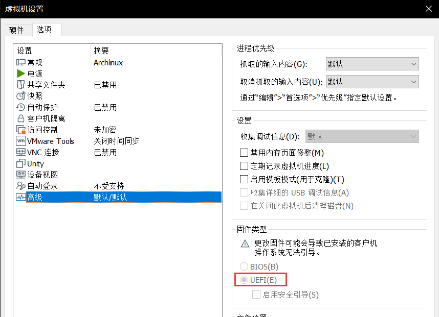
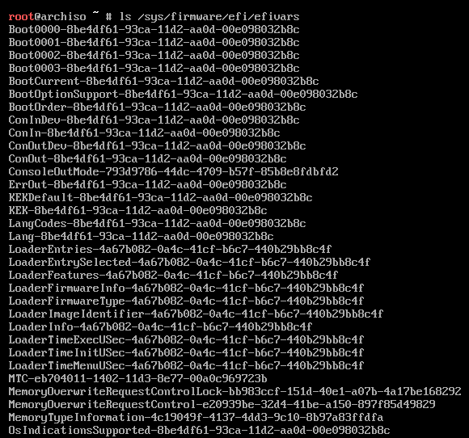
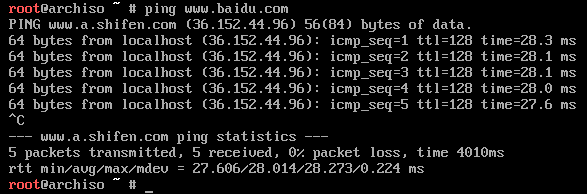
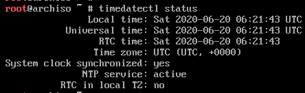
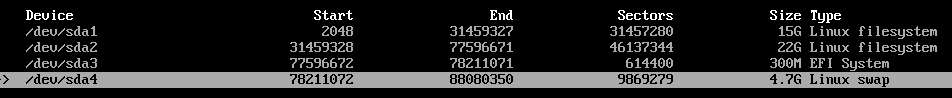
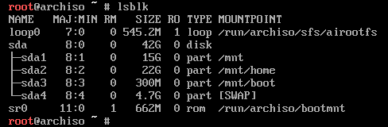
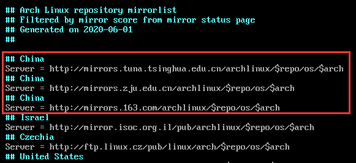
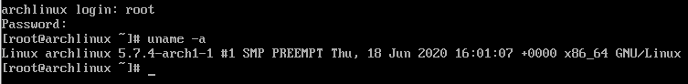

> 再好的个人教程也没有官方讲的全
>
> ArchWiki：[https://wiki.archlinux.org/index.php/Table_of_contents_(简体中文)](https://wiki.archlinux.org/index.php/Table_of_contents_(简体中文))

# 1.在VMware中安装

## 1.1 下载地址

下载地址：[https://www.archlinux.org/download/](https://www.archlinux.org/download/)

## 1.2 检查引导方式

这里可以手动设置为UEFI启动方式：



通过以下命令进行检查：

```bash
ls /sys/firmware/efi/efivars
```

若看到以下页面，就是UEFI启动方式



## 1.3 检查联网

在虚拟机中已经连好了，通过ping百度的方式检查



在实体机中，需要自己联网，如果是有线网并且路由器支持DHCP的话插上网线后先执行以下命令获取IP地址：

```bash
dhcpcd
```

如果你是无线网，请执行以下命令：

```bash
wifi-menu
```

## 1.4 更新系统时间

```bash
timedatectl set-ntp true
```

当然，这里也可以通过`timedatectl status`命令进行检查，发现下面的不是上海时间



## 1.5 分区

通过命令`cfdisk`建立`gpt`分区表，建立分区如下：



> 这里EFI分区建议是在260M~512M之间
>
> SWAP分区建议是在512M以上

分区结束后可以通过`fdisk -l`命令来查看

然后进行格式化与挂载

```bash
mkfs.vfat /dev/sda3
mkfs.ext4 /dev/sda1
mkfs.ext4 /dev/sda2
mkswap /dev/sda4
swapon /dev/sda4
# 挂载
mount /dev/sda1 /mnt
mkdir /mnt/home
mount /dev/sda2 /mnt/home
mkdir /mnt/boot
mount /dev/sda3 /mnt/boot
```

挂载完成后，可以通过`lsblk`命令进行检查：



## 1.6 选择镜像源

```bash
vim /etc/pacman.d/mirrorlist
```

找到标有`China`的镜像源，`normal`模式下按下`dd`可以剪切光标下的行，按`gg`回到文件首，按`P`（注意是大写的）将行粘贴到文件最前面的位置（优先级最高），选择中国的镜像后最后记得用`:wq`命令保存文件并退出。



保存后，执行下列语句进行同步：

```bash
pacman -Syy
```

## 1.7 导入密钥

导入archlinux相关的密钥，否则后面可能会报错：

```bash
pacman -S archlinux-keyring
```

## 1.8 安装基本包

```bash
pacstrap /mnt base base-devel linux linux-firmware dhcpcd
```

这个要等待很长时间，中间不要打断了

## 1.9 配置系统

```bash
genfstab -U /mnt >> /mnt/etc/fstab
arch-chroot /mnt
ln -sf /usr/share/zoneinfo/Asia/Shanghai /etc/localtime
hwclock --systohc
# 安装vim
pacman -S vim
```

## 1.10 设置locale

```bash
vim /etc/locale.gen
```

将系统 locale 设置为 `en_US.UTF-8`，系统的 Log 就会用英文显示，这样更容易问题的判断和处理。

设置语言：

```bash
locale-gen
vim /etc/locale.conf
```

增加下面这行：

```bash
LANG=en_US.UTF-B
```

这里先不添加`LANG=zh_CN.UTF-B`，否则后面会乱码

## 1.11 设置密码

```bash
passwd root
```

## 1.12 安装`Intel-ucode`

```bash
pacman -S intel-ucode
```

## 1.13 安装引导程序

```bash
pacman -S grub efibootmgr
grub-install --target=x86_64-efi --efi-directory=/boot --bootloader-id=grub
grub-mkconfig -o /boot/grub/grub.cfg
```

通过`vim /boot/grub/grub.cfg`命令进行检查

## 1.14 重启

```bash
exit
umount -R /mnt/boot
umount -R /mnt
reboot
```

重启后看到下面页面，表示安装成功了：



# 2.安装桌面

