# Linux目录结构

linux的文件系统是采用级层式的树状目录结构，在此结构中的最上层是根目录“/”，然后在此目录下再创建其他的目录。

记住一句经典的话：**在 Linux 世界里，一切皆文件。**

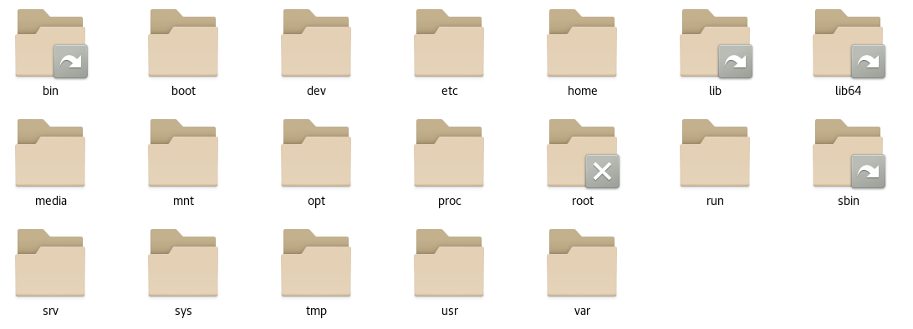

- `/bin：` 是Binary的缩写，这个目录存放着最经常使用的命令。
- `/sbin`：s就是Super User的意思，这里存放的是系统管理员使用的系统管理程序。
- `/home：`存放普通用户的主目录，在Linux中每个用户都有一个自己的目录，一般该目录名是以用户的账号命名的。
- `/root：`该目录为系统管理员，也称作超级权限者的用户主目录。
- `/lib`：系统开机所需要最基本的动态连接共享库，其作用类似于Windows里的DLL文件。几乎所有的应用程序都需要用到这些共享库。
- `/lost+found`：这个目录一般情况下是空的，当系统非法关机后，这里就存放了一些文件。
- `/etc`：所有的系统管理所需要的配置文件和子目录my.conf。
- `/usr/local`：这是一个非常重要的目录，用户的很多应用程序和文件都放在这个目录下，类似与windows下的program files目录。
- `/boot：`存放的是启动Linux时使用的一些核心文件，包括一些连接文件以及镜像文件。
- `/proc`：这个目录是一个虚拟的目录，它是系统内存的映射，访问这个目录来获取系统信息。
- `/srv`：service的缩写，该目录存放一些服务启动之后需要提供的数据。
- `/sys`：这是linux2.6内核的一个很大的变化。该目录下安装了2.6内核中新出现的一个文件系统sysfs。
- `/tmp`：这个目录是用来存放一些临时文件的。
- `/dev`：类似windows的设备管理器，把所有的硬件用文件的形式存储。
- `/media：`linux系统会自动识别一些设备，例如U盘光驱等等，当识别后，linux会把识别的设备挂载到这个目录下。
- `/mnt：`系统提供该目录是为了让用户临时挂载别的文件系统的，我们可以将外部的存储挂载在/mnt/上，然后进入该目录就可以查看里面的内容了。
- `/opt：`这是给主机额外安装软件所摆放的目录，如安装ORACLE数据库就可放到该目录下。默认为空。
- `/usr/local`：这是另一个给主机额外安装软件所安装的目录，一般是通过编译源码的方式安装的程序。
- `/var：`这个目录中存放着在不断扩充着的东西，习惯将经常被修改的目录放在这个目录下，包括各种日志文件。
- `/selinux`：SELinux是一种安全子系统，它能控制程序只能访问特定文件。

# Linux连接XShell

1.开启`sshd`服务

查看`sshd`服务的状态：`systemctl status sshd`

开启`sshd`服务：`systemctl start sshd`

停止`sshd`服务：`systemctl stop sshd`

重启`sshd`服务：`systemctl restart sshd`

2.在centos中终端中输入`ifconfig`查看主机地址

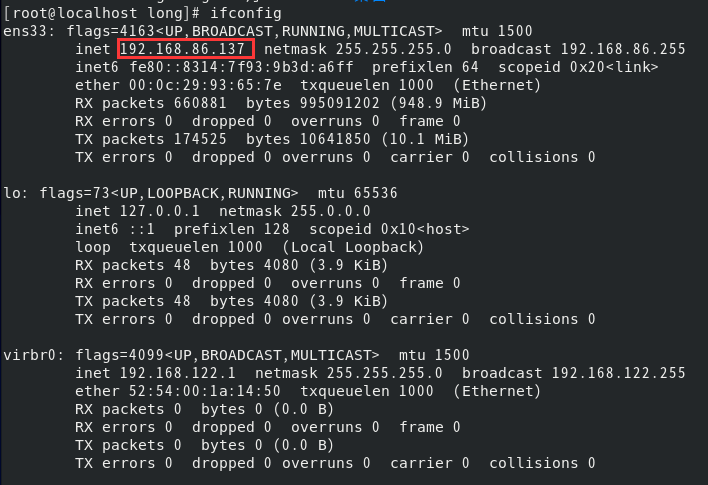

3.XShell连接，端口号一般为22

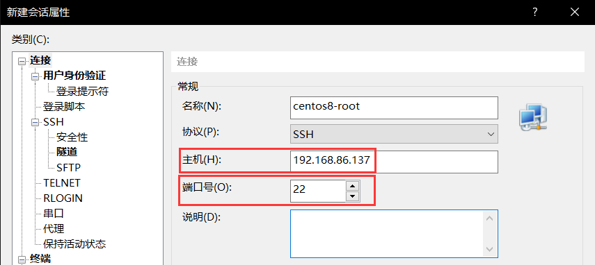

# 关机、重启和用户登录注销

shutdown

- shutdown -h now：表示立即关机
- shutdown -h 1：表示1分钟后关机
- shutdown -r now：立即重启

halt：直接使用，关机

reboot：重启系统

sync：把内存的数据同步到磁盘上

> 当我们关机或者重启时，都应该先执行一下sync，防止数据丢失。

用户登录注销

- 登录时少用root账号登录，以避免操作失误的损失
- 平时可登录普通账户，再用“su - 用户名”切换成管理员登录

logout：注销用户。在图形运行级别无效，在运行级别3有效。

# 用户与用户组

## 用户管理

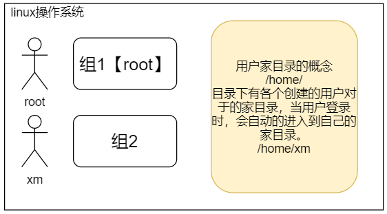

1.添加用户

参数说明：

- -c comment 指定一段注释性描述。
- -d 目录 指定用户主目录，如果此目录不存在，则同时使用-m选项，可以创建主目录。
- -g 用户组 指定用户所属的用户组。
- -G 用户组，用户组 指定用户所属的附加组。
- -s Shell文件 指定用户的登录Shell。
- -u 用户号 指定用户的用户号，如果同时有-o选项，则可以重复使用其他用户的标识号。
- -f [缓冲天数] 指定在密码过期后多少天即关闭该帐号。
- -e 有效期限 指定帐号的有效期限；
- -M：不要自动建立用户的登入目录；

实例：

`useradd –d /home/sam -m sam`：此命令创建了一个用户sam，其中-d和-m选项用来为登录名sam产生一个主目录 /home/sam（/home为默认的用户主目录所在的父目录）。

`useradd -s /bin/sh -g group –G adm,root gem`：新建了一个用户gem，该用户的登录Shell是 /bin/sh，它属于group用户组，同时又属于adm和root用户组，其中group用户组是其主组。

2.用户密码

参数说明：

- -l 锁定口令，即禁用账号。
- -u 口令解锁。
- -d 使账号无口令。
- -f 强迫用户下次登录时修改口令。

如果默认用户名，则修改当前用户的口令。假设当前用户是sam，则下面的命令修改该用户自己的口令：`passwd sam`

普通用户修改自己的口令时，`passwd`命令会先询问原口令，验证后再要求用户输入两遍新口令，如果两次输入的口令一致，则将这个口令指定给用户；

超级用户为用户指定口令时，就不需要知道原口令。

3.删除用户

`userdel 选项 用户名`

常用的选项是 -r，它的作用是把用户的主目录一起删除：`userdel -r sam`

4.查询用户信息

`id 账户`

5.命令测试

XShell中输入命令行：

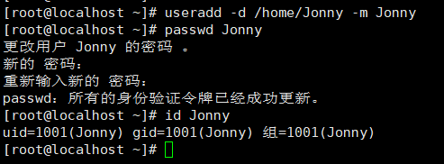

在虚拟机中查看：

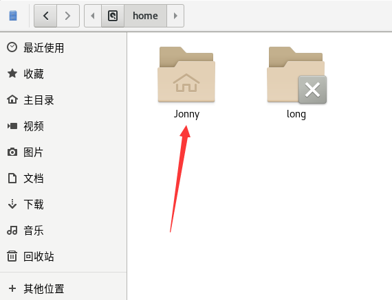

## 用户组

> 每个用户都有一个用户组，系统可以对一个用户组中的所有用户进行集中管理。不同Linux 系统对用户组的规定有所不同，如Linux下的用户属于与它同名的用户组，这个用户组在创建用户时同时创建。 用户组的管理涉及用户组的添加、删除和修改。组的增加、删除和修改实际上就是对`/etc/group`文件的更新。

1.增加用户组

`groupadd -g 101 group2`：向系统中增加了一个新组group1，新组的组标识号是在当前已有的最大组标识号的基础上加1。

2.修改用户组

`groupmod -g 102 group2`：将组group2的组标识号修改为102

## 系统文件

### /etc/passwd

> 用户（user）的配置文件，记录用户的各种信息。

每行含义：

1."用户名"是代表用户账号的字符串。

- 通常长度不超过8个字符，并且由大小写字母和/或数字组成。登录名中不能有冒号(:)，因为冒号在这里是分隔符。
- 为了兼容起见，登录名中最好不要包含点字符(.)，并且不使用连字符(-)和加号(+)打头。

2.“口令”一些系统中，存放着加密后的用户口令字。

- 虽然这个字段存放的只是用户口令的加密串，不是明文，但是由于/etc/passwd文件对所有用户都可读，所以这仍是一个安全隐患。因此，现在许多Linux 系统（如SVR4）都使用了shadow技术，把真正的加密后的用户口令字存放到/etc/shadow文件中，而在/etc/passwd文件的口令字段中只存放一个特殊的字符，例如“x”或者“*”。

3.“用户标识号”是一个整数，系统内部用它来标识用户。

- 一般情况下它与用户名是一一对应的。如果几个用户名对应的用户标识号是一样的，系统内部将把它们视为同一个用户，但是它们可以有不同的口令、不同的主目录以及不同的登录Shell等。
- 通常用户标识号的取值范围是0～65 535。0是超级用户root的标识号，1～99由系统保留，作为管理账号，普通用户的标识号从100开始。在Linux系统中，这个界限是500。

4.“组标识号”字段记录的是用户所属的用户组。

- 它对应着/etc/group文件中的一条记录。

5.“注释性描述”字段记录着用户的一些个人情况。

- 例如用户的真实姓名、电话、地址等，这个字段并没有什么实际的用途。在不同的Linux 系统中，这个字段的格式并没有统一。在许多Linux系统中，这个字段存放的是一段任意的注释性描述文字，用做finger命令的输出。

6.“主目录”，也就是用户的起始工作目录。

- 它是用户在登录到系统之后所处的目录。在大多数系统中，各用户的主目录都被组织在同一个特定的目录下，而用户主目录的名称就是该用户的登录名。各用户对自己的主目录有读、写、执行（搜索）权限，其他用户对此目录的访问权限则根据具体情况设置。

7.用户登录后，要启动一个进程，负责将用户的操作传给内核，这个进程是用户登录到系统后运行的命令解释器或某个特定的程序，即Shell。

- Shell是用户与Linux系统之间的接口。Linux的Shell有许多种，每种都有不同的特点。常用的有sh(Bourne Shell), csh(C Shell), ksh(Korn Shell), tcsh(TENEX/TOPS-20 type C Shell), bash(Bourne Again Shell)等。
- 系统管理员可以根据系统情况和用户习惯为用户指定某个Shell。如果不指定Shell，那么系统使用sh为默认的登录Shell，即这个字段的值为/bin/sh。
- 用户的登录Shell也可以指定为某个特定的程序（此程序不是一个命令解释器）。
- 利用这一特点，我们可以限制用户只能运行指定的应用程序，在该应用程序运行结束后，用户就自动退出了系统。有些Linux 系统要求只有那些在系统中登记了的程序才能出现在这个字段中。

8.系统中有一类用户称为伪用户（pseudo users）。

- 这些用户在/etc/passwd文件中也占有一条记录，但是不能登录，因为它们的登录Shell为空。它们的存在主要是方便系统管理，满足相应的系统进程对文件属主的要求。

```
用户名:口令(加密):用户id:祖id:注释:主目录:登录shell
```

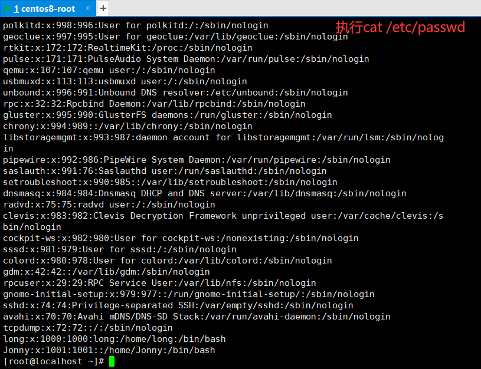

### /etc/shadow

每行的含义：

1."登录名"是与`/etc/passwd`文件中的登录名相一致的用户账号

2."口令"字段存放的是加密后的用户口令字，长度为13个字符。如果为空，则对应用户没有口令，登录时不需要口令；如果含有不属于集合 { ./0-9A-Za-z }中的字符，则对应的用户不能登录。

3."最后一次修改时间"表示的是从某个时刻起，到用户最后一次修改口令时的天数。时间起点对不同的系统可能不一样。例如在SCO Linux 中，这个时间起点是1970年1月1日。

4."最小时间间隔"指的是两次修改口令之间所需的最小天数。

5."最大时间间隔"指的是口令保持有效的最大天数。

6."警告时间"字段表示的是从系统开始警告用户到用户密码正式失效之间的天数。

7."不活动时间"表示的是用户没有登录活动但账号仍能保持有效的最大天数。

8."失效时间"字段给出的是一个绝对的天数，如果使用了这个字段，那么就给出相应账号的生存期。期满后，该账号就不再是一个合法的账号，也就不能再用来登录了。

```
登录名:加密口令:最后一次修改时间:最小时间间隔:最大时间间隔:警告时间:不活动时间:失效时间:标志
```

###  /etc/group

每行含义：

1."组名"是用户组的名称，由字母或数字构成。与/etc/passwd中的登录名一样，组名不应重复。

2."口令"字段存放的是用户组加密后的口令字。一般Linux 系统的用户组都没有口令，即这个字段一般为空，或者是*。

3."组标识号"与用户标识号类似，也是一个整数，被系统内部用来标识组。

4."组内用户列表"是属于这个组的所有用户的列表/b]，不同用户之间用逗号(,)分隔。这个用户组可能是用户的主组，也可能是附加组。

```
组名:口令:组标识号:组内用户列表
```

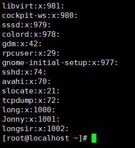

# 实用命令

Linux命令大全：https://www.runoob.com/linux/linux-command-manual.html

## 运行级别

- poweroff.target (相当于runlevel 0)：关闭电源
- rescue.target (相当于runlevel 1)：急救
- multi-user.target (相当于runlevel 3)：多用户命令行
- level 4：保留，未使用。
- graphical.target(相当于runlevel 5)：图形界面
- reboot.target(相当于runlevel 6)：重启

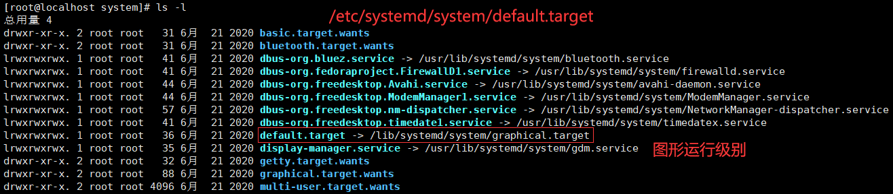

设置运行级别：`systemctl set-default multi-user.target`

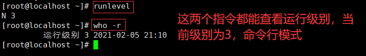

## 帮助指令

### man获得帮助信息

> man [命令或配置文件]

- 例如:man ls

### help指令

> help [命令或配置文件]

## 文件目录类指令

### 文件剪贴删除复制重名等

- pwd：Print Working Directory，显示当前工作目录的绝对路径。
- ls：-a：显示当前目录所有的文件和目录，包括隐藏的；
  - -l：以列表的方式显示信息。
- cd：cd ~：回到自己的家目录；cd …：回到当前目录的上一级目录。
- mkdir：创建目录；-p：创建多级目录。
- rmdir：删除空目录。rmdir不能删除非空的目录。如果需要删除非空的目录，需要使用rm -rf。
- cp：拷贝文件到指定目录；
  - -r：递归复制整个文件夹。强制覆盖不提示的方法：
  - cp命令改为\cp
- rm：移除文件或目录；
  - -r：递归删除整个文件夹；
  - -f：强制删除不提示。

```bash
# 删除java文件夹及其目录下的文件
rm -r java
```

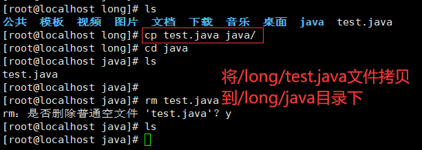

- mv：移动文件与目录或重命名，两种功能！

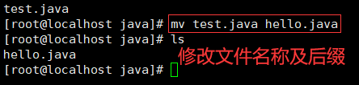

- touch：创建空文件。可以一次性创建多个文件
- ln 给文件创建一个软连接
  - 用法：`ln -s[源文件或目录][软连接名]`

### 文件查看

- cat：查看文件内容。只能浏览文件，而不能修改文件。
  - -n：显示行号。
  - 结尾加上 | more：分页显示，不会全部一下显示完。
- more：是一个基于VI编辑器的文本过滤器，它以全屏幕的方式按页显示文本文件的内容。more还内置了很多快捷键：
  - 空白键（Space）：向下翻一页
  - Enter：向下翻一行
  - q：立刻离开more，不再显示该文件内容
  - Ctrl + F：向下滚动一屏
  - Ctrl + B：返回上一屏
  - = :输出当前行的行号
  - :f 输出文件名和当前行的行号
- less：用来分屏查看文件内容，与more相似，但是更强大，支持各种显示终端。less指令在显示文件内容时，并不是一次将整个文件加载之后才显示，而是根据显示需要加载内容。对于显示大型文件具有较高的效率。

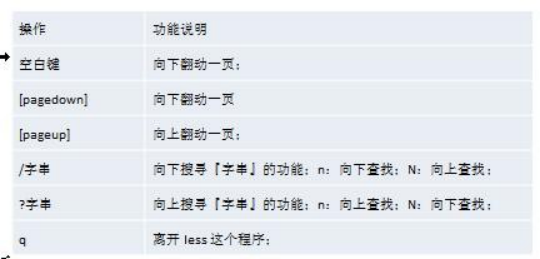

- head：显示文件的开头部分。-n 5：看前面5行内容。
- tail：输出文件中尾部的内容。
  - -n 5：看后面5行内容。
  - -f：时事追踪该文档的所有更新
- `>`指令：输出重定向。如果不存在会创建文件，否则会将原来的文件内容覆盖。

- `>>`指令：追加。如果不存在会创建文件，否则不会覆盖原来的文件内容，而是追加到文件的尾部。

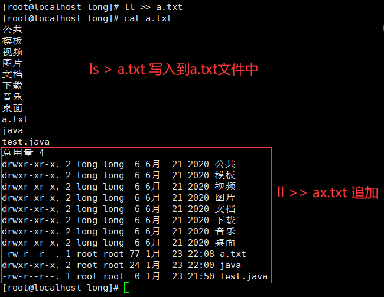

- echo：输出内容到控制台。

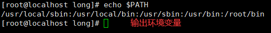

- history：查看历史指令

### 时间和日期

- date：显示当前日期和时间
  - date “+%Y”：显示当前年份
  - date “+%d”：显示当前月份
  - date “+%Y-%m-%d %H:%M:%S”：显示年-月-日 时：分：秒
  - 设置日期：date -s 字符串时间
- cal：查看日历指令；
  - cal [月] [年份]：显示某一年或月的日历

### 搜索查找类

- find：从指定目录向下递归的遍历其各个子目录，将满足条件的文件或者目录显示在终端。

  - find (搜索范围) -name (文件名)：按照指定的文件名查找模式查找文件。
  - find (搜索范围) -user (用户名)：按照指定的用户名查找模式查找文件。
  - find (搜索范围) -size (+多少/-多少/多少)：按照指定的文件大小查找模式查找文件（大于多少/小于多少/等于多少）


```bash
# 查找整个linux系统下大于 20m 的文件（+n大于 -n小于 n等于）
find / -size +20M
find / -size -20M
find / -size 20M
# 根据名称查找/home目录下的hello.txt文件
find /home -name hello.txt
# 查找/opt目录下，用户名称为nobody的文件
find /opt -user noboby
# 查询 /目录下所有.txt的文件
find / -name *.txt
```

- locate：locate (搜索文件)

  - 可以快速定位文件路径。locate指令利用事先建立的系统中所有文件名称及路径的locate数据库实现快速定位给定的文件。
  - locate指令无需遍历整个文件系统，查询速度较快。为了保证查询结果的准确度，管理员必须定期更新locate时刻。
  - **在第一次运行之前，必须使用updatedb指令创建locate数据库。**

- grep：过滤查找，表示将前一个命令的处理结果输出传递给后面的命令处理。经常跟管道一起使用。

  - grep [选项] 查找内容 源文件
  - -n：显示匹配行及行号。
  - -i：忽略大小写字母。

```bash
# 在hello.c文件中，查找"sum"所在行，并且显示行号
cat hello.c | grep -ni sum
```

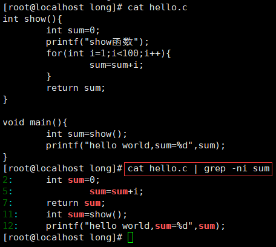

### 压缩和解压类

- gzip/gunzip：压缩文件/解压
  - gzip (文件)：压缩为.gz文件，原来文件不保留。
  - gunzip (文件)：解压缩，同样也不保留源文件。

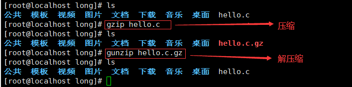

- zip/unzip：压缩文件/解压
  - zip [选项] (压缩后文件xxx.zip) (将要压缩的文件)
  - unzip [选项] (要解压的文件xxx.zip)
  - zip -r：递归压缩，即压缩目录
  - unzip -d (目录)：指定解压后的文件的存放目录

```bash
# 将/home下的所有文件进行压缩成mypackage.zip
zip -r mypackage.zip /home/
# 将mypackge.zip解压到/opt/tmp目录下
unzip -d /opt/tmp/ mypackage.zip
```

- tar：打包指令，最后打包后的文件是.tar.gz的文件
  - tar [选项] xxx.tar.gz (打包的内容)
  - -c：产生.tar打包文件
  - -v：显示详细信息
  - -f：指定压缩后的文件名
  - -z：打包同时压缩
  - -x：解压.tar文件
  - 压缩：tar -zcvf (压缩后文件名) (要压缩的文件)
  - 解压：tar -zxvf (要解压的文件)
  - 解压到指定目录：tar -zxvf (要解压的文件) -C (指定目录)，指定解压到的目录要存在。

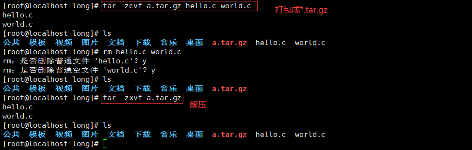

# 组管理和权限管理

## Linux组基本介绍

Linux中每个用户属于一个组，不能独立于组以外。所以在Linux中每个文件存在组的概念：

- 所有者
- 所在组
- 其他组
- 改变用户所在组

## 文件/目录所有者

> 一般为文件的创建者，谁创建了该文件，就自然的称为该文件的所有者。

- 查看文件所有者：`ls -ahl`
- 修改文件所有者：`chown (用户名) (文件名)`
- `修改文件所在组：chgrp (组名) (文件名)`

```bash
# 查看文件信息
ls -ahl
# 修改所有者
chown long a.tar.gz
# 修改所有组
chgrp long a.tar.gz
```

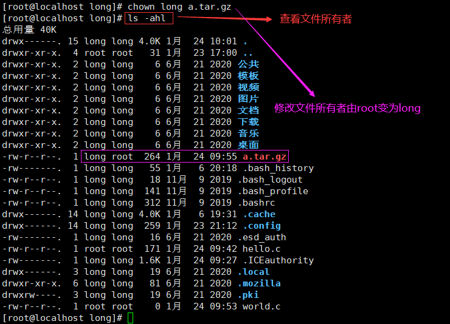

## 文件属性

### 文件权限


rwx组合：

+ r：可读
+ w：可写
+ x：可执行(execute)
+ -：无权限

### 修改权限

1.`+、-、=`变更权限

- u:所有者
- g:所有组
- o:其他人
- a:所有人(u、g、o 的总和)

```bash
chmod u=rwx,g=rx,o=x #文件目录名
chmod o+w #文件目录名
chmod a-x #文件目录名
```

2.通过数字变更权限

r=4 w=2 x=1；rwx=4+2+1=7 

```bash
#将hello.c文件的权限修改成rwxr-xr-x,使用给数字的方式实现
rwx = 4+2+1 = 7
r-x = 4+1=5
r-x = 4+1 =5
#命令行输入
chmod 751 hello.c
```

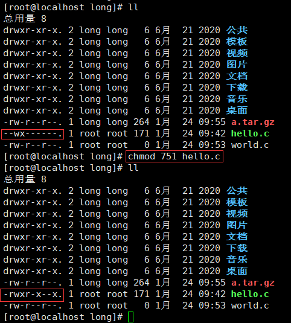

# 定时任务调度

## 使用

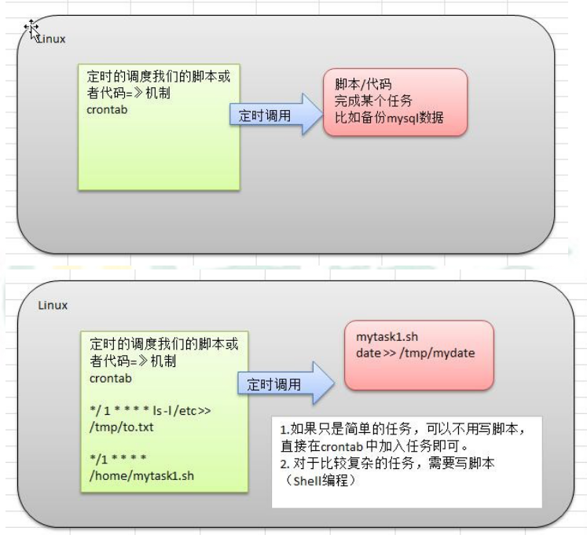

使用方法：crontab [选项]

- crontab [选项]
- -e：编辑crontab定时任务
- -i：查询crontab任务
- -r：删除当前用户所有的crontab任务
- -l：列出当前有哪些任务调度
- service crond restart：重启任务调度
- 当保存退出后就生效了
- 参数细节说明

| 项目      | 含义                 | 范围                    |
| --------- | -------------------- | ----------------------- |
| 第一个“*” | 一小时当中的第几分钟 | 0-59                    |
| 第二个“*” | 一天当中的第几小时   | 0-23                    |
| 第三个“*” | 一个月当中的第几天   | 1-31                    |
| 第四个“*” | 一年当中的第几月     | 1-12                    |
| 第五个“*” | 一周当中的星期几     | 0-7（0和7都代表星期日） |

特殊符号说明

- `\*：`代表任何时间。比如第一个*就代表一小时中每分钟都执行一次的意思。
- `,：`代表不连续的时间。比如“0 8,12,16 * * *命令”，就代表在每天的8点0分，12点0分，16点0分都执行一次命令。
- `-：`代表连续的时间范围。比如“0 5 * * 1-6命令”，代表在周一到周六的凌晨5点0分执行命令。
- `/n：`代表每隔多久执行一次。比如“*/10 * * * * 命令”，代表每隔10分钟就执行一遍命令。

## 案例

案例 1：每隔 1 分钟，就将当前的日期信息，追加到 /tmp/mydate  文件中

1.先编写一个文件`/home/mytask.sh`，编写内容如下：

```bash
date >> /tmp/mydate
```

2.给 mytask.sh  一个可以执行权限

`chmod 744 /home/mytask1.sh`

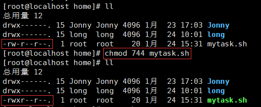

3.`crontab -e`

`*/1 * * * *	/home/mytask.sh`

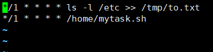

案例 2：每隔 1 分钟， 将当前日期和日历都追加到 /home/mycal  文件中

1.先编写一个文件`/home/mytask2.sh`

`date >> /tmp/mycal cal >> /tmp/mycal`

2.给 mytask1.sh 一个可以执行权限

`chmod 744 /home/mytask2.sh`

3.`crontab -e`

4.`*/1 * * * *	/home/mytask2.sh`

案例 3:	每天凌晨 2:00 将 mysql数据库 testdb  ，备份到文件中mydb.bak。

1.先编写一个文件`/home/mytask3.sh`

`/usr/local/mysql/bin/mysqldump -u root -proot testdb > /tmp/mydb.bak`

2.给 mytask3.sh 一个可以执行权限

`chmod 744 /home/mytask3.sh`

3.`crontab -e`

4.`0 2 * * *	/home/mytask3.sh`

# 分区与挂载

## 分区方式

- mbr分区
  - 最多支持四个主分区
  - 系统只能安装在主分区
  - 扩展分区要占一个主分区
  - MBR最大只支持2TB，但拥有最好的兼容性
- gpt分区
  - 支持无限多个主分区（但操作系统可能限制，比如windows下最多128个分区）
  - 最大支持18EB的大容量（1EB=1024PB，PB=1024TB）
  - windows7 64位以后支持gpt

## Linux分区

- Linux来说无论有几个分区，分给哪一个目录使用，它归根结底就只有一个根目录，一个独立且唯一的文件结构，Linux中每个分区都是用来组成整个文件系统的一部分。
- Linux采用了一种叫做“载入”的处理方法，它的整个文件系统中包含了一整套的文件和目录，且将一个分区和一个目录联系起来。这时要载入的一个分区将使它的存储空间在一个目录下获得。

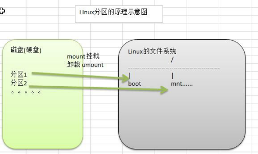

- Linux硬盘分IDE硬盘和SCSI硬盘，目前基本上是SCSI硬盘
- lsblk [-f]：查看当前系统的分区和挂载情况。（list block）

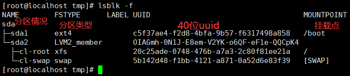

## 挂载硬盘

> 需求是给我们的Linux系统增加一个新的硬盘，并且挂载到`/home/newdisk`

1.添加硬盘

2.分区：`fdsk /dev/sdb`

3.格式化：`mkfs -t ext4 /dev/sdb1`

4.挂载：

新建目录：`mkdir /home/newdisk`；

挂载：`mount /dev/sdb1 /home/newdisk`

5.设置可以自动挂载（永久挂载）：重启系统后，仍然可以挂载。`vim etc/fstab`增加挂载信息。`mount -a`：生效

## 磁盘状况查询

- 磁盘情况查询：`df -lh`
- 查询指定目录的磁盘占用情况：du -h /目录，默认为当前目录：`du -ach --max-depth=1 /opt`
  - -s：指定目录占用大小汇总
  - -h：带计量单位
  - -a：含文件
  - –max-depth=1：子目录深度
  - -c：列出明细的同时，增加汇总值
- 磁盘情况-工作实用指令
  - 统计/home文件夹下文件的个数：`ls -l /home | grep "^-" | wc -l`
  - 统计/home文件夹下目录的个数：`ls -l /home | grep "^d" | wc -l`
  - 统计/home文件夹下文件的个数，包括子文件夹里的：`ls -lR /home | grep "^-" | wc -l`
  - 统计文件夹下目录的个数，包括子文件夹里的：`ls -lR /home | grep "^d" | wc -l`
  - 以树状显示目录结构：首先安装tree指令：`yum install tree`，`tree`

# 进程管理

## 进程管理基础

- 在Linux中，每个执行的**程序（代码）**都称为一个进程。每个进程都分配一个ID号
- 每一个进程，都会对应一个父进程，而这个父进程可以复制多个子进程。例如www服务器。
- 每个进程都可能以两种方式存在。前台和后台。
  - 前台进程：用户目前的屏幕上可以进行操作的。
  - 后台进程：实际在操作，但由于屏幕上无法看到的进程，通常使用后台方式执行。
- 一般系统的服务都是以后台进程的方式存在，而且都会常驻在系统中，直到关机才结束。

## 显示系统执行的进程

ps [选项]：查看目前系统中，有哪些正在执行，以及它们执行的状况

- ps -a：显示当前终端的所有进程信息。
- ps -u：以用户的格式显示进程信息。
- ps -x：显示后台进程运行的参数。
- ps -axu | grep xxx：过滤得到xxx的信息。
- ps -ef：以全格式显示当前所有的进程，查看进程的父进程。
- -e：显示所有进程。
- -f：全格式。

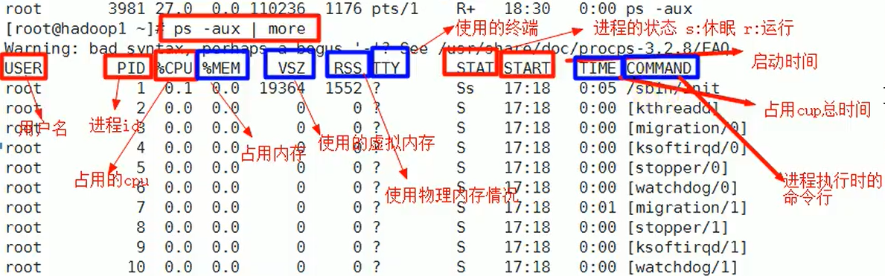

System V 展示风格：

| 字段    | 说明                                                         |
| ------- | ------------------------------------------------------------ |
| USER    | 用户说明                                                     |
| PID     | 进程识别号                                                   |
| %CPU    | 进程占用cpu百分比                                            |
| %MEM    | 进程占用物理内存百分比                                       |
| VSZ     | 进程占用虚拟内存大小(KB)                                     |
| RSS     | 进程占用物理内存大小(KB)                                     |
| TTY     | 终端机号                                                     |
| STAT    | 进程状态，S睡眠，s代表是会话的先导进程，N代表进程拥有比普通进程更高的优先级，R正在运行，D短期等待，Z僵死进程，T被跟踪或被停止 |
| STARTED | 进程启动的时间                                               |
| TIME    | 此进程所消耗的CPU时间                                        |
| COMMAND | 正在执行的命令或进程名                                       |

`ps -ef`显示信息解释：

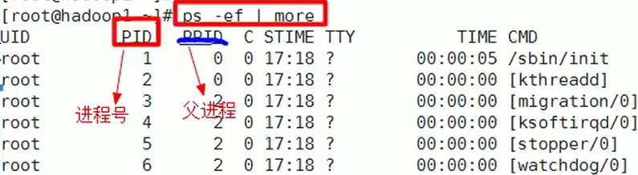

BSD展示风格：

| 字段  | 说明                                                         |
| ----- | ------------------------------------------------------------ |
| UID   | 用户id                                                       |
| PID   | 进程id                                                       |
| PPID  | 父进程                                                       |
| C     | CPU用于执行优先级的因子，数值越大，表明cpu密集型运算，执行优先级会降低，数值越小，表明是I/O密集运算，执行优先级会提高 |
| STIME | 进程启动时间                                                 |
| TTY   | 终端机号                                                     |
| TIME  | 此进程所消耗的CPU时间                                        |
| CMD   | 启动所用的命令和参数                                         |

## 终止进程

- kill [选项] 进程号：通过进程号杀死进程
  - -9：表示强迫进程立刻停止
- killall 进程名称：通过进程名称杀死进程，也支持通配符，这在系统因负载过大而变得很慢时很有用

## 查看进程树

查看进程树：pstree [选项]

- -p：显示进程的PID
- -u：显示进程的所属用户

## 服务(Service)管理

服务(Service)本质就是进程，但是是运行在后台的，通常都会监听某个端口，等待其它程序的请求，比如(mysql，sshd 防火墙等),因此我们又称为守护进程。


`systemctl [start|stop|restart|reload|status] 服务名 `

查看防火墙状况：


服务查看方式：`systemctl list-unit-files`

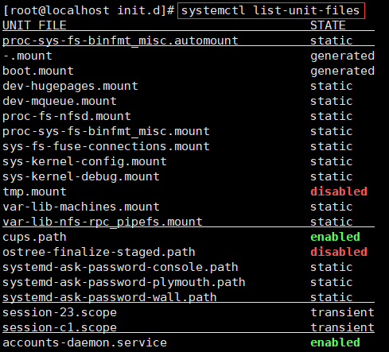

## 动态监控进程

top [选项]

- -d 秒数：指定top命令每隔几秒更新。默认是3秒。
- -i：使top不显示任何闲置或者僵死进程。
- -p：通过指定监控进程ID来仅仅监控某个进程的状态。

交互操作说明：

| 操作 | 功能                          |
| ---- | ----------------------------- |
| P    | 以CPU使用率排序，默认就是此项 |
| M    | 以内存的使用率排序            |
| N    | 以PID排序                     |
| q    | 退出top                       |

```bash
Help for Interactive Commands - procps-ng 3.3.15
Window 1:Def: Cumulative mode Off.  System: Delay 3.0 secs; Secure mode Off.

  Z,B,E,e   Global: 'Z' colors; 'B' bold; 'E'/'e' summary/task memory scale
  l,t,m     Toggle Summary: 'l' load avg; 't' task/cpu stats; 'm' memory info
  0,1,2,3,I Toggle: '0' zeros; '1/2/3' cpus or numa node views; 'I' Irix mode
  f,F,X     Fields: 'f'/'F' add/remove/order/sort; 'X' increase fixed-width

  L,&,<,> . Locate: 'L'/'&' find/again; Move sort column: '<'/'>' left/right
  R,H,V,J . Toggle: 'R' Sort; 'H' Threads; 'V' Forest view; 'J' Num justify
  c,i,S,j . Toggle: 'c' Cmd name/line; 'i' Idle; 'S' Time; 'j' Str justify
  x,y     . Toggle highlights: 'x' sort field; 'y' running tasks
  z,b     . Toggle: 'z' color/mono; 'b' bold/reverse (only if 'x' or 'y')
  u,U,o,O . Filter by: 'u'/'U' effective/any user; 'o'/'O' other criteria
  n,#,^O  . Set: 'n'/'#' max tasks displayed; Show: Ctrl+'O' other filter(s)
  C,...   . Toggle scroll coordinates msg for: up,down,left,right,home,end

  k,r       Manipulate tasks: 'k' kill; 'r' renice
  d or s    Set update interval
  W,Y       Write configuration file 'W'; Inspect other output 'Y'
  q         Quit
          ( commands shown with '.' require a visible task display window ) 
```

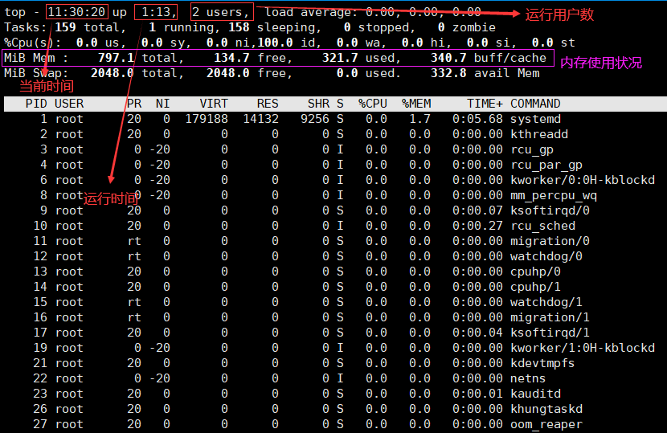

## 查看网络状况

`netstat [选项]`

- -an：按一定顺序排列输出
- -p：显示哪个进程在调用

查看所有的网络服务：`netstat -anp | more`

查看sshd的服务的信息：`netstat -anp | grep sshd`

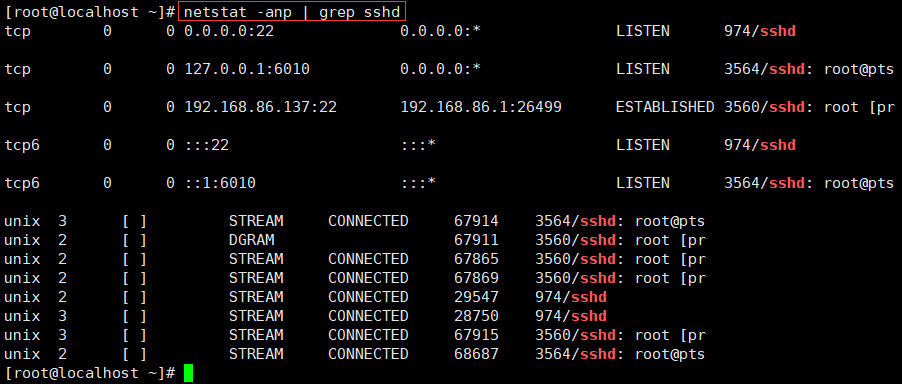

# 包管理工具

## RPM

RPM：RedHat Package Manager，红帽软件包管理工具。 Linuxd分发版本都有采用（suse,redhat，centos等）

RPM查询已安装的rpm列表：`rpm -qa | grep xx`

查询是否按照firefox：

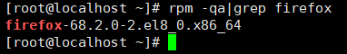

- `rpm -qa`：查询所安装的所有rpm软件包
- `rpm -qa | more`
- `rpm -qa | grep xx`
- `rpm -q xx`：查询xx软件包是否安装
- `rpm -qi xx`：查询软件包信息
- `rpm -ql xx`：查询软件包中的文件
- `rpm -qf 文件全路径名`：查询文件所属的软件包

卸载：

- 卸载rpm包：`rpm -e 软件包名称`
- 如果其他软件依赖于要卸载的包，删除时可能会发生依赖错误
- 忽视依赖强制删除的方法：`rpm -e --nodeps 软件包名称`可以强制删除，但不建议这样做，否则会导致程序无法运行

安装rpm包：`rpm -ivh 软件包全路径名称`

- i=install：安装
- v=verbose：提示
- h=hash：进度条

## YUM

yum（ Yellow dog Updater, Modified）是一个在Fedora和RedHat以及SUSE中的Shell前端软件包管理器。 基於RPM包管理，能够从指定的服务器自动下载RPM包并且安装，可以自动处理依赖性关系，并且一次安装所有依赖的软体包，无须繁琐地一次次下载、安装。

- `yum list | grep xx`：查询yum服务器是否有需要安装的软件
- `yum install xx`：安装指定的yum包
- `yum -y remove xx`：卸载指定的yum包

# 环境搭建

## jdk

### 查看是否已安装

看到下面结果，说明已经安装配置 jdk

```bash
[root@iZbp18up26t0rh2ezvjjpwZ ~]# java -version
java version "1.8.0_121"
Java(TM) SE Runtime Environment (build 1.8.0_121-b13)
Java HotSpot(TM) 64-Bit Server VM (build 25.121-b13, mixed mode)
```

### 卸载

查看系统是否自带 jdk

```bash
rpm -qa |grep java
rpm -qa |grep jdk
rpm -qa |grep gcj
```

如果有输出信息，批量卸载系统自带

```bash
rpm -qa | grep java | xargs rpm -e --nodeps
```

如果使用 yum 安装的 jdk，请使用下面命令卸载

```bash
yum -y remove java-1.8.0-openjdk-headless.x86_64
```

### 安装

检查 yum 中有没有 java1.8 包

```bash
yum list java-1.8*
```

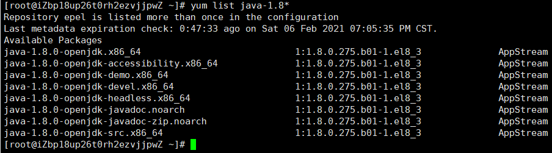

开始安装

```bash
yum install java-1.8.0-openjdk* -y
```

## Tomcat

1.打开防火墙端口

```bash
# 开启防火墙端口
firewall-cmd --zone=public --add-port=8080/tcp --permanent
# 重启防火墙服务
systemctl restart firewalld.service
# 列举防火墙服务
firewall-cmd --list-ports
```

命令含义:

+ `--zone`：作用域
+ `--add-port=80/tcp`：添加端口，格式为:端口/通讯协议
+ `--permanent`：永久生效，没有此参数重启后失效

2.解压文件

```bash
tar -zxvf apache-tomcat-10.0.2.tar.gz
```

3.启动tomcat测试

```bash
# 执行
./startup.sh
```


访问`http://115.29.208.129:8080`，得到如下效果

> **防火墙8080端口**开放且**阿里云安全组**也开放时才能访问

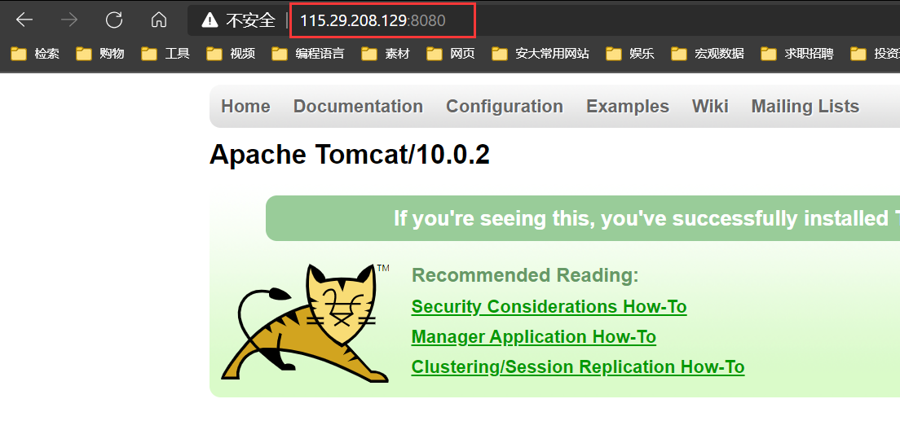
