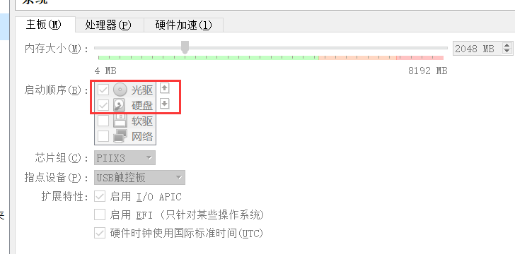
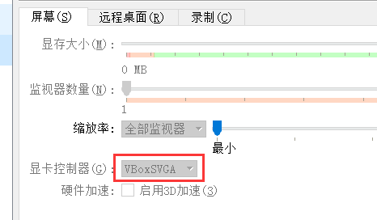

# 1.系统安装关键点

1.系统设置这里为光驱盒硬盘，且保证**光驱在硬盘上面**



2.这里的显卡控制器为`VBoxSVGA`



3.安装结束后不要点击重启，选择关机，之后**必须弹出光盘**，否则系统会再装一次

# 2.pacman命令

## 更新系统

| 命令          | 解释                                  |
| ------------- | ------------------------------------- |
| pacman -Syu   | 对整个系统进行更新                    |
| pacman -Syy   | 强制更新                              |
| pacman -Syudd | 对整个系统进行更新（-dd跳过所有检测） |

## 搜索包


# 3.国内镜像源

```bash
# 自动寻找最快的源
sudo pacman-mirrors -i -c China -m rank
# 更新源
sudo pacman -Sy
```


