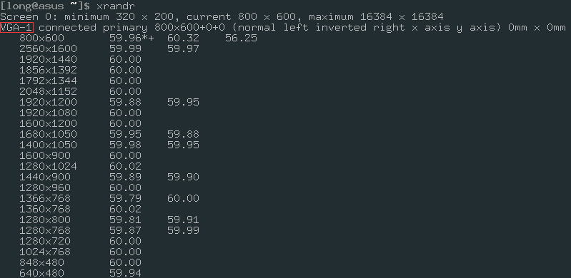
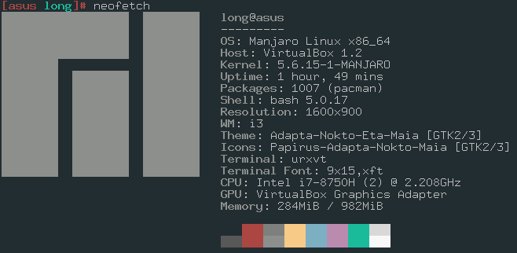
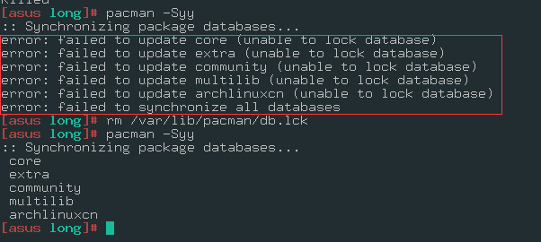

# 基本配置

## 1.配置镜像

```bash
pacman-mirrors -i -c China -m rank
# 强制刷新软件源
pacman -Syy
```

配置好的镜像可以通过`vim /etc/pacman.d/mirrorlist`来查看

配置`ArchlinuxCN`镜像：

```bash
vim /etc/pacman.conf
```

在文件末尾加入两行;

```bash
[archlinuxcn]
SigLevel = Never
Server = https://mirrors.tuna.tsinghua.edu.cn/archlinuxcn/$arch
```

然后：

```bash
pacman-key -S archlinux-keyring
```

## 2.设置分辨率

```bash
# 查看分辨率
xrandr
```



```bash
# 修改分辨率
vim ~/.i3/config
```
添加下面语句：

```bash
# 其中VGA-1是你自己机子的名字，安装图片显示的修改
exec_always no-startup-id xrandr --output VGA-1 --mode 1600x900
```

保存退出后，按下`Mod+Shift+R`键，进行刷新，发现分辨率发生了改变

## 3.字体

在`vim ~/.i3/config`文件中修改大小：

```bash
font xft:URWGothic-Book 16
```

## 4.安装AUR助手

```bash
sudo pacman -S yay
```

## 5.配置pacman-key

1.通过输入以下命令**删除旧（可能损坏）的密钥**：

```
sudo rm -r /etc/pacman.d/gnupg 
```

2.重新安装钥匙圈，包括最新的钥匙：

```
sudo pacman -Sy gnupg archlinux-keyring manjaro-keyring
```

3.初始化 `pacman`键环：

```
sudo pacman-key --init 
```

4.加载签名键：

```
sudo pacman-key --populate archlinux manjaro 
```

5.刷新和更新签名密钥：

```
sudo pacman-key --refresh-keys 
```

> 注意：keyserver如果是国外的更新很慢，以下是其他kerserker服务，可以指定更新服务器：`sudo pacman-key --refresh-keys --keyserver https://keyring.debian.org`

```bash
https://keys.openpgp.org
https://pgp.mit.edu
https://keyring.debian.org
https://keyserver.ubuntu.com
https://zimmermann.mayfirst.org
```

6.清除中止安装期间下载的软件包（可选）：

```
sudo pacman -Sc
```

## 6.常用包安装

> 这一步暂时不指向

安装火狐浏览器：

```bash
yay -S firefox
```

安装`neofetch`

```bash
pacman -S neofetch
```



安装VScode：

```bash
yay -S visual-studio-code-bin
```


# 踩坑记录

## 1."Unable to lock database" Error

在`pacman -Syy`时报错：`error: failed to update core (Unable to lock database)`

或者报这个错：`error: could not read db ' community' (gzip decompression failed)`

都是执行：

```bash
sudo rm /var/lib/pacman/db.lck
sudo pacman -Syy
```



## 2."failed to commit transaction"Error


看看`/var/cache/pacman/pkg`中是否有`*.part`结尾的文件，它们是没有完全下载的文件，删除它们并重新执行更新。这些程序一般是自定义的`XferCommand` 下载命令造成的。

## 3."could not read db 'core' (Damaged tar archive)"

更换镜像源顺序，重新执行镜像源的更新：`pacman -Syy`

## 4.error: PackageName: signature from "`User <email@archlinux.org>`" is invalid

有三种可能的情况导致这个问题：

- 过期的`archlinux-keyring` 包。
- 不正确的系统时间。
- 你的ISP屏蔽了用于导入 PGP keys 的端口。
- `pacman`缓存中包含之前的未签名软件包
- 未正确设置 `dirmngr`

这里我失误地方是时间问题，解决方法是：

```bash
# 查看本地时间
timedatectl
# timedatectl set-time "yyyy-MM-dd hh:mm:ss"设置时间
timedatectl set-time "2014-05-26 11:13:54"
```

