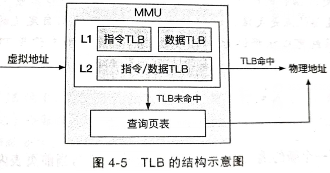

# 一、操作系统概述

## 1.1 操作系统接口

调用过程如下：

## 1.2 硬件结构

| 特权级 | 作用                                      |
| ------ | ----------------------------------------- |
| EL0    | 应用程序（用户态）                        |
| EL1    | 操作系统（内核态）                        |
| EL2    | 虚拟监控器                                |
| EL3    | TrustZone（负责普通世界和安全世界的切换） |

EL0→EL1的场景：

+ 系统调用
+ 指令触发异常
+ 外设的中断

保存异常状态→查询异常→解决异常→返回用户态

保存的异常状态：异常指令地址、异常原因、栈指针

缓存结构：

MMIO原理：指输入输出设备和物理内存放到同一个地址空间，为设备内部的内存和寄存器也分配相应的地址

轮询：让CPU不断通过MMIO查看UART是否输入

中断：UART获取输入后主动告知CPU，然后CPU再从UART获取输入

## 1.3 操作系统结构

MALH方法：

+ 模块化：高内聚、低耦合
+ 抽象：模块之间只需要通过抽象接口调用
+ 分层：不同模块间的层级
+ 层级：同类模块间的分层

宏内核：操作系统的核心模块（进程调度、内存管理、文件系统、设备驱动）均运行在内核态

微内核：服务之间是相互隔离的，单个功能或模块从内核中拆分出来，内核中保留极少功能

外核架构：安装不同应用领域的要求，将对硬件资源抽象模块化为一系列库

多核架构：在每个CPU核上运行一个独立的操作系统节点，节点间交互由操作系统节点之上的进程间通信来完成

# 二、内存管理

## 2.1 虚拟地址与物理地址

MMU：内存管理单元，负责虚拟地址到物理地址的转换

分段：短号——段内地址

分页：虚拟页号——页内偏移量

物理地址=某物理页起始地址+页内偏移量

虚拟页号和物理页号做哈希索引

多级页表：

TLB：转址旁路缓存，缓存了虚拟页号到物理页号到映射关系

## 2.2 换页

解决分配使用的虚拟页在页表中没有映射到物理页的问题

换页：物理容量不足时，保存物理页到磁盘上，去除虚拟页的映射

缺页异常：有虚拟页，无映射到的物理页

换入：为空虚拟页加物理页映射

页替换策略：根据该策略选择一个或一些物理页换出道磁盘以便让出空间

①FIFO策略

②MRU策略：优先选择最近未被访问的页

③LRU策略：优先选择最久未被访问的页

④Second Chance策略

## 2.3 虚拟内存功能

共享内存：允许同一个物理页在不同应用程序间共享

写时拷贝：

内存去重：操作系统可以定期地在内存中扫描具有相同内容的物理页，并找到映射这些物理页的虚拟页，然后只保留其中一个物理页

## 2.4 物理内存分配及管理

内存碎片：

+ 内部碎片：分配的内存大于实际使用的内存
+ 外部碎片：不同块分配内存间的间隙

伙伴系统：

SLUB分配机制（分配小内存）：

kmem_cache_cpu中的page指针指向当前的slub页，freelist指向该页的第一个空闲页

kmem_cache_node中的full指向全满的slub链表，partial指向有空闲的slub链表

分配：

+ page有空
  + 分配后不满：直接分配，freelist指针下移到下一个空闲页
  + 分配后满：该页整体放到full链表尾部
+ page无空
  + 从partial尾部取一页过来

!> 回收和分配过程正好相反

空闲链表的分配：常常用于用户态的堆分配器中

# 三、进程与线程

