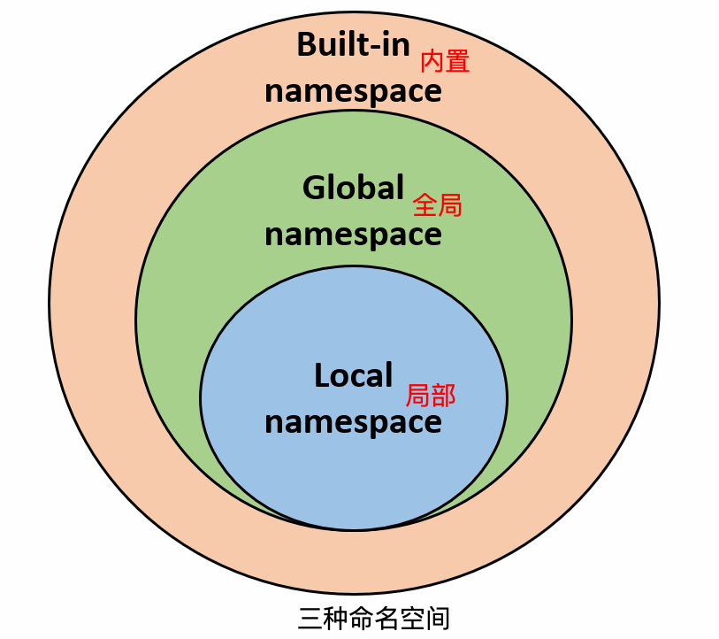

# 一、最基本知识

## 杂类

1.关键字：

```python
>>> import keyword
>>> keyword.kwlist
['False', 'None', 'True', '__peg_parser__', 'and', 'as', 'assert', 'async', 'await', 'break', 'class', 'continue', 'def', 'del', 'elif', 'else', 'except', 'finally', 'for', 'from', 'global', 'if', 'import', 'in', 'is', 'lambda', 'nonlocal', 'not', 'or', 'pass', 'raise', 'return', 'try', 'while', 'with', 'yield']
```

2.注释：

```python
# 第一个注释
'''
第二个注释
'''
"""
第三个注释
"""
```

3.缩进：Python中无`{}`，同一个代码块的语句必须包含相同的缩进空格数

4.多行语句

Python 通常是一行写完一条语句，但如果语句很长，我们可以使用反斜杠(\)来实现多行语句，例如：

```python
total = item_one + \
        item_two + \
        item_three
```

在 [], {}, 或 () 中的多行语句，不需要使用反斜杠(\)，例如：

```python
total = ['item_one', 'item_two', 'item_three',
        'item_four', 'item_five']
```

5.不换行输出

```python
print( x )				#换行输出
print(x, end=" " )		#不换行输出
```

6.导包

```python
from sys import argv,path  #  导入特定的成员
```

## 基本数据类型

Python3 中有六个标准的数据类型：

- Number（数字）
- String（字符串）
- List（列表）
- Tuple（元组）
- Set（集合）
- Dictionary（字典）

Python3 的六个标准数据类型中：

- **不可变数据（3 个）：**Number（数字）、String（字符串）、Tuple（元组）；
- **可变数据（3 个）：**List（列表）、Dictionary（字典）、Set（集合）。

### Number

**int、float、bool、complex（复数）**

```python
>>> a, b, c, d = 20, 5.5, True, 4+3j
>>> print(type(a), type(b), type(c), type(d))
<class 'int'> <class 'float'> <class 'bool'> <class 'complex'>
```

可以使用del语句删除一些对象引用。

```python
>>> var1=1;var2=2
>>> var1
1
>>> var2
2
>>> del var1
>>> var1
Traceback (most recent call last):
  File "<pyshell#15>", line 1, in <module>
    var1
NameError: name 'var1' is not defined
```

数值运算：

```python
>>> 5 + 4  # 加法
9
>>> 4.3 - 2 # 减法
2.3
>>> 3 * 7  # 乘法
21
>>> 2 / 4  # 除法，得到一个浮点数
0.5
>>> 2 // 4 # 除法，得到一个整数
0
>>> 17 % 3 # 取余
2
>>> 2 ** 5 # 乘方
32
```

在交互模式中，最后被输出的表达式结果被赋值给变量`_`。例如：

```python
>>> a=1
>>> b=2
>>> c=3
>>> c**b+1
10
>>> _
10
>>> 
```

### String

1.字符串

```python
str='Runoob'
 
print(str)                 # 输出字符串
print(str[0:-1])           # 输出第一个到倒数第二个的所有字符
print(str[0])              # 输出字符串第一个字符
print(str[2:5])            # 输出从第三个开始到第五个的字符
print(str[2:])             # 输出从第三个开始后的所有字符
print(str[1:5:2])          # 输出从第二个开始到第五个且每隔两个的字符
print(str * 2)             # 输出字符串两次
print(str + '你好')         # 连接字符串
 
print('------------------------------')
 
print('hello\nrunoob')      # 使用反斜杠(\)+n转义特殊字符
print(r'hello\nrunoob')     # 在字符串前面添加一个 r，表示原始字符串，不会发生转义
```

以上实例输出结果：

```
Runoob
Runoo
R
noo
noob
uo
RunoobRunoob
Runoob你好
------------------------------
hello
runoob
hello\nrunoob
```

2.格式化输出：

```python
>>> print ("我叫 %s 今年 %f 岁!" % ('小明', 10))
我叫 小明 今年 10.000000 岁!
```

3.三引号：

python三引号允许一个字符串跨多行，字符串中可以包含换行符、制表符以及其他特殊字符。

```python
para_str = """这是一个多行字符串的实例
多行字符串可以使用制表符
TAB ( \t )。
也可以使用换行符 [ \n ]。
"""
```

4.f-string

> 一种新方式，类似`Vue`里面那样，非常好用

```python
>>> w = {'name': 'Runoob', 'url': 'www.runoob.com'}
>>> f'{w["name"]}: {w["url"]}'
'Runoob: www.runoob.com'
```

### List


```python
list = [ 'abcd', 786 , 2.23, 'runoob', 70.2 ]
tinylist = [123, 'runoob']

print (list)            # 输出完整列表
print (list[0])         # 输出下标为0的元素
print (list[1:3])       # 输出下标为1~2的元素
print (list[2:])        # 输出下标为2后的所有元素
print (tinylist * 2)    # 输出两次
print (list + tinylist) # 连接
list[2:2]=['hello']		# 在下标2位置增加元素
print(list)				# ['abcd', 786, 'hello', 2.23, 'runoob', 70.2]
list[2:3]=[]			# 删除下标2的元素
del list[2]				# 删除下标2的元素
print(list)				# ['abcd', 786, 2.23, 'runoob', 70.2]
```

截取步长：

```python
>>> list[1:4:2]
[786, 'runoob']
>>> list[1:3:2]
[786]
>>> list[-4:-1:2]
[786, 'runoob']
>>> list[-3:-1:2]
[2.23]
```

转置：

```python
>>> list[-1::-1]
[70.2, 'runoob', 2.23, 786, 'abcd']
```

### Tuple

元组（tuple）与列表类似，不同之处在于元组的元素不能修改。元组写在小括号 `()`里，元素之间用逗号隔开。

基本使用方法与list类似，但修改元素操作是非法的：

```python
>>> tuple[1]=20
Traceback (most recent call last):
  File "<pyshell#32>", line 1, in <module>
    tuple[1]=20
TypeError: 'tuple' object does not support item assignment
```

### Set

使用大括号`{}`创建集合：

```python
sites = {'Google', 'Taobao', 'Runoob', 'Facebook', 'Zhihu', 'Baidu'}
```

使用`set()`创建集合：

```python
>>> a = set('abracadabra')
>>> b = set('alacazam')
>>> a
{'d', 'a', 'c', 'b', 'r'}
>>> b
{'l', 'a', 'c', 'z', 'm'}
>>> a-b		# 差集
{'b', 'r', 'd'}
>>> a|b		# 并集
{'l', 'd', 'c', 'a', 'z', 'b', 'm', 'r'}
>>> a&b		# 交集
{'a', 'c'}
>>> a^b		# 并集-交集
{'l', 'z', 'd', 'b', 'm', 'r'}
```

### Dictionary

1.它是一个无序的`键(key) : 值(value)`的集合。

```python
>>> tinydict = {'name': 'runoob','code':1, 'site': 'www.runoob.com'}
>>> tinydict.keys()		# 输出所有key
dict_keys(['name', 'code', 'site'])
>>> tinydict.values()	# 输出所有value
dict_values(['runoob', 1, 'www.runoob.com'])
>>> tinydict['site']	# 根据key输出value
'www.runoob.com'
```

构造函数`dict()`可以直接从键值对序列中构建字典如下：

```python
>>> dict([('Runoob', 1), ('Google', 2), ('Taobao', 3)])
{'Runoob': 1, 'Google': 2, 'Taobao': 3}
>>> {x: x**2 for x in (2, 4, 6)}
{2: 4, 4: 16, 6: 36}
>>> dict(Runoob=1, Google=2, Taobao=3)
{'Runoob': 1, 'Google': 2, 'Taobao': 3}
```

2.删除字典元素：

```python
dict = {'Name': 'Runoob', 'Age': 7, 'Class': 'First'}
 
del dict['Name'] # 删除键 'Name'
dict.clear()     # 清空字典
del dict         # 删除字典
```

3.两点注意事项

+ 不允许同一个键出现两次。创建时如果同一个键被赋值两次，后一个值会被记住

```python
>>> dict = {'Name': 'Runoob', 'Age': 7, 'Name': '小菜鸟'}
>>> print(dict['Name'])
小菜鸟
```

+ 键必须不可变，所以可以用数字，字符串或元组充当，而用列表就不行

```python
>>> dict = {['Name']: 'Runoob', 'Age': 7}
Traceback (most recent call last):
  File "<pyshell#17>", line 1, in <module>
    dict = {['Name']: 'Runoob', 'Age': 7}
TypeError: unhashable type: 'list'
```

## 运算符

与其他C语言相比有以下特例：

1.`:=`：海象运算符，可在表达式内部为变量赋值。

2.逻辑运算符

| C语言 | Python | 解释 |
| ----- | ------ | ---- |
| &&    | and    | 与   |
| \|\|  | or     | 或   |
| !     | not    | 非   |

3.成员运算符`in`、`not in`

```python
a = 10
b = 20
list = [1, 2, 3, 4, 5 ]
 
if ( a in list ):
   print ("1 - 变量 a 在给定的列表中 list 中")
else:
   print ("1 - 变量 a 不在给定的列表中 list 中")
```

4.身份运算符`is`、`is not`

`is`是判断两个标识符是不是引用自一个对象



注意：这里与Java是正好相反的，在Java中，`==`判断是否同一个对象，`equal()`判断是否值相等。在Python中，`==`判断是否值相等，`is`判断是否是同一个对象。



# 二、编程语法

## 条件与循环

1.`if……elif……else`

```python
if condition_1:
    statement_block_1
elif condition_2:
    statement_block_2
else:
    statement_block_3
```

2.while 循环使用 else 语句

在`while … else`在条件语句为 false 时执行 else 的语句块。

```python
count = 0
while count < 5:
   print (count, " 小于 5")
   count = count + 1
else:
   print (count, " 大于或等于 5")
```

3.`for……in`循环

```python
sites = ["Baidu", "Google","Runoob","Taobao"]
for site in sites:
    if site == "Runoob":
        print("菜鸟教程!")
        break
    print("循环数据 " + site)
else:
    print("没有循环数据!")
print("完成循环!")
# -----------------------
循环数据 Baidu
循环数据 Google
菜鸟教程!
完成循环!
```

4.`range()`函数

```python
>>> a = ['Google', 'Baidu', 'Runoob', 'Taobao', 'QQ']
>>> for i in range(len(a)):
	print(i,a[i])

	
0 Google
1 Baidu
2 Runoob
3 Taobao
4 QQ
```

5.`pass`语句

Python pass是空语句，是为了保持程序结构的完整性。pass 不做任何事情，一般用做占位语句。

## 函数

### 函数体结构

```python
def max(a, b):
    if a > b:
        return a
    else:
        return b
```

### 传入对象

python 中一切都是对象，严格意义我们不能说值传递还是引用传递，我们应该说传不可变对象和传可变对象。

传入不可变对象：在调用函数前后，形参和实参指向的是同一个对象（对象 id 相同），在函数内部修改形参后，形参指向的是不同的 id。

```python
>>> def change(a):
	print(id(a))
	a=10
	print(id(a))

>>> a=1
>>> print(id(a))
1685974051120
>>> change(a)
1685974051120
1685974051408
```

传入可变对象：传入函数的和在末尾添加新内容的对象用的是同一个引用。

```python
>>> def changeme(mylist):
	mylist.append([1,2,3,4,5])
	print("函数内部取值：",mylist)
	return

>>> mylist=[999,888,777]
>>> changeme(mylist)
函数内部取值： [999, 888, 777, [1, 2, 3, 4, 5]]
>>> print ("函数外取值: ", mylist)
函数外取值:  [999, 888, 777, [1, 2, 3, 4, 5]]
```

### 参数

1.基本参数

```python
>>> def printme(str):
	print(str)
	return

>>> printme()
Traceback (most recent call last):
  File "<pyshell#20>", line 1, in <module>
    printme()
TypeError: printme() missing 1 required positional argument: 'str'
>>> printme("HelloWorld")
HelloWorld
>>> printme(str="菜鸟教程")
菜鸟教程
```

2.默认参数

```python
>>> def printinfo(name,age=35):
	print("姓名：",name)
	print("年龄：",age)
	return

>>> printinfo("林黛玉")
姓名： 林黛玉
年龄： 35
>>> printinfo("林黛玉",23)
姓名： 林黛玉
年龄： 23
>>> printinfo(18,"林黛玉")
姓名： 18
年龄： 林黛玉
>>> printinfo(age=18,name="林黛玉")
姓名： 林黛玉
年龄： 18
>>> printinfo(name="林黛玉")
姓名： 林黛玉
年龄： 35
```

3.不定长参数

加了星号`*`的参数会以元组(tuple)的形式导入，存放所有未命名的变量参数。

```python
>>> def printinfo(arg,*vartuple):
	print(arg)
	print(vartuple)

>>> printinfo(100,200,300)
100
(200, 300)
>>> printinfo(100,200,300,400,500,600,700,800,900,1000)
100
(200, 300, 400, 500, 600, 700, 800, 900, 1000)
```

加了两个星号`**`的参数会以字典的形式导入。

```python
>>> def printinfo(arg,**vardict):
	print(arg)
	print(vardict)

>>> printinfo(1,a=2,b=3,c=4,d=5,e=6)
1
{'a': 2, 'b': 3, 'c': 4, 'd': 5, 'e': 6}
>>> printinfo(1,2,3,b=99)
Traceback (most recent call last):
  File "<pyshell#48>", line 1, in <module>
    printinfo(1,2,3,b=99)
TypeError: printinfo() takes 1 positional argument but 3 were given
```

### 匿名函数

```python
>>> sum=lambda arg1,arg2:arg1+arg2
>>> print("sum=",sum(10,30))
sum= 40
```

### 强制位置参数

在`/`左面的这些参数，只能是位置参数（不能是关键字参数）；单独出现星号`*`后的参数必须用关键字传入。

```python
>>> def f(a,b,/,c,d,*,e,f):
	print(a,b,c,d,e,f)

>>> f(10,20,30,d=40,e=50,f=60)
10 20 30 40 50 60
>>> f(10,20,c=30,d=40,e=50,f=60)
10 20 30 40 50 60
>>> f(10,b=20,30,d=40,e=50,f=60)
SyntaxError: positional argument follows keyword argument
```

## 迭代器和生成器

1.`iter()`和`next()`

```python
>>> list=[1,2,3,4]
>>> it=iter(list)
>>> for x in it:
	print(x,end=" ")

1 2 3 4 
```

```python
>>> list=[1,2,3,4]
>>> it=iter(list)
>>> print(next(it))
1
>>> print(next(it))
2
>>> print(next(it))
3
>>> print(next(it))
4
>>> print(next(it))
Traceback (most recent call last):
  File "<pyshell#71>", line 1, in <module>
    print(next(it))
StopIteration
```

## 模块

1.导入模块`fibo`中的`fib、fib2`函数

```python
from fibo import fib, fib2
```

2.`__name__`属性

一个模块被另一个程序第一次引入时，其主程序将运行。如果我们想在模块被引入时，模块中的某一程序块不执行，我们可以用`__name__`（双下划线）属性来使该程序块仅在该模块自身运行时执行。

```python
# Filename: using_name.py

if __name__ == '__main__':
   print('程序自身在运行')
else:
   print('我来自另一模块')
```

运行输出如下：

```bash
$ python using_name.py
程序自身在运行
$ python
>>> import using_name
我来自另一模块
```

## 输入输出

1.`str()`函数跟`repr()`函数的不同之处：

- `str()`函数致力于为终端用户创造字符串输出，而`repr()`函数的返回字符串主要是用于软件开发的debugging和developement；
- `str()`函数的返回字符串的目标的是可读性（readable），而`repr()`函数的返回的目标是准确和无歧义；
- `repr()`函数返回的字符串是正式地（offcially）代表某个对象，而`str()`返回的字符串是非正式地；
- `str()`函数调用的是对象的`__str__()`函数，`repr()`函数调用的是对象的`__repr__()`函数。

```python
>>> str('hello')
'hello'
>>> repr('hello')
"'hello'"
>>> str(3.1415)
'3.1415'
>>> repr(3.1415)
'3.1415'
>>> import datetime
>>> today=datetime.date.today()
>>> str(today)
'2020-12-10'
>>> repr(today)
'datetime.date(2020, 12, 10)'
```

2.`str.format()`

```python
>>> print('{1} 和 {0}'.format('Google', 'Runoob'))
Runoob 和 Google
>>> print('{name}网址： {site}'.format(name='菜鸟教程', site='www.runoob.com'))
菜鸟教程网址： www.runoob.com
```

3.`!a`使用`acii()`，`!s`使用`str()`，`!r`使用`repr()`

```python
>>> print('红楼梦又名{}'.format('石头记'))
红楼梦又名石头记
>>> print('红楼梦又名{!r}'.format('石头记'))
红楼梦又名'石头记'
>>> print('红楼梦又名{!s}'.format('石头记'))
红楼梦又名石头记
```

可选项`:`和格式标识符可以跟着字段名。 这就允许对值进行更好的格式化。 下面的例子将 Pi 保留到小数点后三位：

```python
>>> print('常量 PI 的值近似为 {mypi:.3f}。'.format(mypi=math.pi))
常量 PI 的值近似为 3.142。
```

4.如果你有一个很长的格式化字符串, 而你不想将它们分开, 那么在格式化时通过变量名而非位置会是很好的事情。

最简单的就是传入一个字典, 然后使用方括号`[]`来访问键值 :

```python
>>> table = {'Google': 1, 'Runoob': 2, 'Taobao': 3}
>>> print('Runoob: {0[Runoob]:d}; Google: {0[Google]:d}; Taobao: {0[Taobao]:d}'.format(table))
Runoob: 2; Google: 1; Taobao: 3
```

也可以通过在 table 变量前使用`**`来实现相同的功能：

```python
>>> table = {'Google': 1, 'Runoob': 2, 'Taobao': 3}
>>> print('Runoob: {Runoob:d}; Google: {Google:d}; Taobao: {Taobao:d}'.format(**table))
Runoob: 2; Google: 1; Taobao: 3
```

5.旧式字符串格式化

```python
>>> print('常量 PI 的值近似为：%5.3f。' % math.pi)
常量 PI 的值近似为：3.142。
```

6.`input`输入

```python
>>> str=input("请输入：")
请输入：菜鸟
>>> str
'菜鸟'
```

## 文件

```python
# 一般情况
open(file, mode='r')
# 完整格式
open(file, mode='r', buffering=-1, encoding=None, errors=None, newline=None, closefd=True, opener=None)
```

参数说明:

- file: 必需，文件路径（相对或者绝对路径）。
- mode: 可选，文件打开模式
- buffering: 设置缓冲
- encoding: 一般使用utf8
- errors: 报错级别
- newline: 区分换行符
- closefd: 传入的file参数类型
- opener: 设置自定义开启器，开启器的返回值必须是一个打开的文件描述符。

mode 参数有：

| 模式 | 描述                                                         |
| :--- | :----------------------------------------------------------- |
| t    | 文本模式 (默认)。                                            |
| x    | 写模式，新建一个文件，如果该文件已存在则会报错。             |
| b    | 二进制模式。                                                 |
| +    | 打开一个文件进行更新(可读可写)。                             |
| U    | 通用换行模式（**Python 3 不支持**）。                        |
| r    | 以只读方式打开文件。文件的指针将会放在文件的开头。这是默认模式。 |
| rb   | 以二进制格式打开一个文件用于只读。文件指针将会放在文件的开头。这是默认模式。一般用于非文本文件如图片等。 |
| r+   | 打开一个文件用于读写。文件指针将会放在文件的开头。           |
| rb+  | 以二进制格式打开一个文件用于读写。文件指针将会放在文件的开头。一般用于非文本文件如图片等。 |
| w    | 打开一个文件只用于写入。如果该文件已存在则打开文件，并从开头开始编辑，即原有内容会被删除。如果该文件不存在，创建新文件。 |
| wb   | 以二进制格式打开一个文件只用于写入。如果该文件已存在则打开文件，并从开头开始编辑，即原有内容会被删除。如果该文件不存在，创建新文件。一般用于非文本文件如图片等。 |
| w+   | 打开一个文件用于读写。如果该文件已存在则打开文件，并从开头开始编辑，即原有内容会被删除。如果该文件不存在，创建新文件。 |
| wb+  | 以二进制格式打开一个文件用于读写。如果该文件已存在则打开文件，并从开头开始编辑，即原有内容会被删除。如果该文件不存在，创建新文件。一般用于非文本文件如图片等。 |
| a    | 打开一个文件用于追加。如果该文件已存在，文件指针将会放在文件的结尾。也就是说，新的内容将会被写入到已有内容之后。如果该文件不存在，创建新文件进行写入。 |
| ab   | 以二进制格式打开一个文件用于追加。如果该文件已存在，文件指针将会放在文件的结尾。也就是说，新的内容将会被写入到已有内容之后。如果该文件不存在，创建新文件进行写入。 |
| a+   | 打开一个文件用于读写。如果该文件已存在，文件指针将会放在文件的结尾。文件打开时会是追加模式。如果该文件不存在，创建新文件用于读写。 |
| ab+  | 以二进制格式打开一个文件用于追加。如果该文件已存在，文件指针将会放在文件的结尾。如果该文件不存在，创建新文件用于读写。 |

默认为文本模式，如果要以二进制模式打开，加上 **b** 。

### file 对象

file 对象使用 open 函数来创建，下表列出了 file 对象常用的函数：

| 序号 | 方法及描述                                                   |
| :--- | :----------------------------------------------------------- |
| 1    | `file.close()`关闭文件。关闭后文件不能再进行读写操作。       |
| 2    | `file.flush()`刷新文件内部缓冲，直接把内部缓冲区的数据立刻写入文件, 而不是被动的等待输出缓冲区写入。 |
| 3    | `file.fileno()`返回一个整型的文件描述符(file descriptor FD 整型), 可以用在如os模块的read方法等一些底层操作上。 |
| 4    | `file.isatty()`如果文件连接到一个终端设备返回 True，否则返回 False。 |
| 5    | `file.next()`**Python 3 中的 File 对象不支持 next() 方法。**返回文件下一行。 |
| 6    | `file.read([size])`从文件读取指定的字节数，如果未给定或为负则读取所有。 |
| 7    | `file.readline([size]`读取整行，包括 "\n" 字符。             |
| 8    | `file.readlines([sizeint]`读取所有行并返回列表，若给定`sizeint>0`，返回总和大约为`sizeint`字节的行, 实际读取值可能比 `sizeint`较大, 因为需要填充缓冲区。 |
| 9    | `file.seek(offset[, whence]`移动文件读取指针到指定位置       |
| 10   | `file.tell()`返回文件当前位置。                              |
| 11   | `file.truncate([size])`从文件的首行首字符开始截断，截断文件为 size 个字符，无 size 表示从当前位置截断；截断之后后面的所有字符被删除，其中 windows 系统下的换行代表2个字符大小。 |
| 12   | `file.write(str)`将字符串写入文件，返回的是写入的字符长度。  |
| 13   | `file.writelines(sequence)`向文件写入一个序列字符串列表，如果需要换行则要自己加入每行的换行符。 |

## 异常

### 异常关键字

```python
try:
    runoob()
except AssertionError as error:
    print(error)
else:
    try:
        with open('file.log') as file:
            read_data = file.read()
    except FileNotFoundError as fnf_error:
        print(fnf_error)
finally:
    print('这句话，无论异常是否发生都会执行。')
```


| Java      | Python    | 解释                 |
| --------- | --------- | -------------------- |
| `try`     | `try`     | 执行代码             |
| `catch`   | `except`  | 异常时执行           |
| `finally` | `finally` | 不管有没有异常都执行 |
|           | `else`    | 没有异常时执行       |
| `throw`   | `raise`   | 创造异常             |
| `throws`  |           | 在方法后，抛出异常   |

### 预定义的清理行为

一些对象定义了标准的清理行为，无论系统是否成功的使用了它，一旦不需要它了，那么这个标准的清理行为就会执行。

这面这个例子展示了尝试打开一个文件，然后把内容打印到屏幕上：

```python
for line in open("myfile.txt"):
    print(line, end="")
```

以上这段代码的问题是，当执行完毕后，文件会保持打开状态，并没有被关闭。

关键词 with 语句就可以保证诸如文件之类的对象在使用完之后一定会正确的执行他的清理方法：

```python
with open("myfile.txt") as f:
    for line in f:
        print(line, end="")
```

以上这段代码执行完毕后，就算在处理过程中出问题了，文件 f 总是会关闭。

## 类

### 构造方法

在Python中构造方法写法是`__init__`

```python
#类定义
class people:
    #定义基本属性
    name = ''
    age = 0
    #定义私有属性,私有属性在类外部无法直接进行访问
    __weight = 0
    #定义构造方法
    def __init__(self,n,a,w):
        self.name = n
        self.age = a
        self.__weight = w
    def speak(self):
        print("%s 说: 我 %d 岁。" %(self.name,self.age))
 
# 实例化类
p = people('runoob',10,30)
p.speak()
```

类的方法与普通的函数只有一个特别的区别——它们必须有一个额外的**第一个参数名称**, 按照惯例它的名称是 self。self代表类的实例，而非类。

### 继承

> Python支持多继承

`Base1、Base2、Base3`是父类，`DerivedClassName`是子类

```python
class DerivedClassName(Base1, Base2, Base3):
```

### 方法重写

```python
class Parent:        # 定义父类
   def myMethod(self):
      print ('调用父类方法')
 
class Child(Parent): # 定义子类
   def myMethod(self):
      print ('调用子类方法')
 
c = Child()          # 子类实例
c.myMethod()         # 子类调用重写方法
super(Child,c).myMethod() #用子类对象调用父类已被覆盖的方法
```

### 类属性

1.在Python中用`__`加在变量、方法前，表示私有

2.类中的方法必须包括`self`

```python
class Site:
    def __init__(self, name, url):
        self.name = name       # public
        self.__url = url   # private
 
    def who(self):
        print('name  : ', self.name)
        print('url : ', self.__url)
 
    def __foo(self):          # 私有方法
        print('这是私有方法')
 
    def foo(self):            # 公共方法
        print('这是公共方法')
        self.__foo()
 
x = Site('菜鸟教程', 'www.runoob.com')
x.who()        # 正常输出
x.foo()        # 正常输出
x.__foo()      # 报错
```

### 专有方法

- `__init__`：构造函数，在生成对象时调用
- `__del__`：析构函数，释放对象时使用
- `__repr__ `：打印，转换
- `__setitem__`：按照索引赋值
- `__getitem__`：按照索引获取值
- `__len__`：获得长度
- `__cmp__`：比较运算
- `__call__`：函数调用
- `__add__`：加运算
- `__sub__`：减运算
- `__mul__`：乘运算
- `__truediv__`：除运算
- `__mod__`：求余运算
- `__pow__`：乘方

### 运算符重载

```python
>>> class Vector:
   def __init__(self, a, b):
      self.a = a
      self.b = b
 
   def __str__(self):
      return 'Vector (%d, %d)' % (self.a, self.b)
   
   def __add__(self,other):
      return Vector(self.a + other.a, self.b + other.b)

>>> v1=Vector(2,10)
>>> v1
<__main__.Vector object at 0x0000016323493670>
>>> v2=Vector(5,-2)
>>> v2
<__main__.Vector object at 0x00000163234AA790>
>>> print(v1+v2)
Vector (7, 8)
```

## 命名空间

一般有三种命名空间：

- **内置名称（built-in names**）， Python 语言内置的名称，比如函数名 abs、char 和异常名称 BaseException、Exception 等等。
- **全局名称（global names）**，模块中定义的名称，记录了模块的变量，包括函数、类、其它导入的模块、模块级的变量和常量。
- **局部名称（local names）**，函数中定义的名称，记录了函数的变量，包括函数的参数和局部定义的变量。（类中定义的也是）



命名空间的生命周期：

命名空间的生命周期取决于对象的作用域，如果对象执行完成，则该命名空间的生命周期就结束。

因此，我们无法从外部命名空间访问内部命名空间的对象。

```python
# var1 是全局名称
var1 = 5
def some_func():
 
    # var2 是局部名称
    var2 = 6
    def some_inner_func():
 
        # var3 是内嵌的局部名称
        var3 = 7
```

## 作用域

### 作用域范围


```python
g_count = 0  # 全局作用域
def outer():
    o_count = 1  # 闭包函数外的函数中
    def inner():
        i_count = 2  # 局部作用域
```

### global和nonlocal

当内部作用域想修改外部作用域的变量时，就要用到global和nonlocal关键字了。

`global`：提升作用域为全局

```python
>>> total=0
>>> def sum(arg1,arg2):
	global total
	total=arg1+arg2
	print("total：",total)
	return total

>>> total
0
# globla关键字修改sum函数内部的局部变量total为全局变量
>>> sum(10,90)
total： 100
100
>>> total
100
```

`nonlocal`：提升作用域为enclosing

```python
>>> def outer():
        num = 10
        def inner():
            nonlocal num   # nonlocal关键字声明
            num = 100
            print(num)
        inner()
        print(num)
# nonlocal修改函数内部局部变量num为闭包变量（enclosing）
>>> outer()
100
100
```

