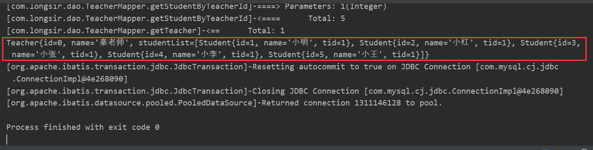

# 一、什么是MyBatis

MyBatis 是一款优秀的**持久层框架**，它支持自定义 SQL、存储过程以及高级映射。MyBatis 免除了几乎所有的 JDBC 代码以及设置参数和获取结果集的工作。MyBatis 可以通过简单的 XML 或注解来配置和映射原始类型、接口和 Java POJO（Plain Old Java Objects，普通老式 Java 对象）为数据库中的记录。

```xml
<dependency>
  <groupId>org.mybatis</groupId>
  <artifactId>mybatis</artifactId>
  <version>x.x.x</version>
</dependency>
```

# 二、第一个Mybatis程序

## 基本搭建

1.搭建数据库

```sql
CREATE TABLE `user`(
	`id` INT(20) NOT NULL PRIMARY KEY,
	`name` VARCHAR(30) DEFAULT NULL,
	`pwd` VARCHAR(30) DEFAULT NULL
)ENGINE=INNODB DEFAULT CHARSET=utf8;

INSERT INTO `user`(`id`,`name`,`pwd`) VALUES
(1,'Alice','123456'),
(2,'Bob','888888'),
(3,'John','987654'),
(4,'Lily','666666')
```

2.在IDEA中配置xml文件

```xml
<!--父工程-->
<groupId>com.longsir</groupId>
<artifactId>Mybatis-Study</artifactId>
<packaging>pom</packaging>
<version>1.0-SNAPSHOT</version>
<modules>
    <module>Mybatis-01</module>
</modules>

<dependencies>
    <dependency>
        <groupId>mysql</groupId>
        <artifactId>mysql-connector-java</artifactId>
        <version>8.0.21</version>
    </dependency>
    <dependency>
        <groupId>org.mybatis</groupId>
        <artifactId>mybatis</artifactId>
        <version>3.5.5</version>
    </dependency>
    <dependency>
        <groupId>junit</groupId>
        <artifactId>junit</artifactId>
        <version>4.13</version>
        <scope>test</scope>
    </dependency>
</dependencies>
```

3.连接数据库


4.配置`mybatis-config.xml`

```xml
<?xml version="1.0" encoding="UTF-8" ?>
<!DOCTYPE configuration
        PUBLIC "-//mybatis.org//DTD Config 3.0//EN"
        "http://mybatis.org/dtd/mybatis-3-config.dtd">
<configuration>
    <environments default="development">
        <environment id="development">
            <transactionManager type="JDBC"/>
            <dataSource type="POOLED">
                <!-- 注意这里原先的com.mysql.jdbc.Driver弃用了，这里进行了修改 -->
                <property name="driver" value="com.mysql.cj.jdbc.Driver"/>
                <property name="url" value="jdbc:mysql://localhost:3306/mybatis?useSSL=true&amp;useUnicode=true&amp;characterEncoding=UTF-8&amp;default-time-zone='+8:00'"/>
                <property name="username" value="root"/>
                <property name="password" value="root"/>
            </dataSource>
        </environment>
    </environments>
    <!--每一个Mapper.xml都需要在Mybatis核心配置文件中注册-->
    <mappers>
        <mapper resource="com/longsir/dao/UserMapper.xml"/>
    </mappers>
</configuration>
```

5.编写Mybatis工具类

```java
package com.longsir.utils;

import org.apache.ibatis.io.Resources;
import org.apache.ibatis.session.SqlSession;
import org.apache.ibatis.session.SqlSessionFactory;
import org.apache.ibatis.session.SqlSessionFactoryBuilder;

import java.io.IOException;
import java.io.InputStream;

/**
 * @author Jonny Long
 * @date 2020/10/4 20:58
 */
public class MybatisUtils {
    private static SqlSessionFactory sqlSessionFactory;
    static{

        try {
            // 获取SqlSessionFactory对象
            String resource = "mybatis-config.xml";
            // 根据resource指定的路径获取流
            InputStream inputStream = Resources.getResourceAsStream(resource);
            // 根据流建造sqlSessionFactory工厂
            sqlSessionFactory = new SqlSessionFactoryBuilder().build(inputStream);
        } catch (IOException e) {
            e.printStackTrace();
        }
    }
    /**
     * 既然有了 SqlSessionFactory，顾名思义，我们可以从中获得 SqlSession 的实例。
     * SqlSession 提供了在数据库执行 SQL 命令所需的所有方法。
     * 你可以通过 SqlSession 实例来直接执行已映射的 SQL 语句。
     */
    public static SqlSession getSqlSession(){
        // 从 SqlSessionFactory 中获取 SqlSession（生产）
        return sqlSessionFactory.openSession();
    }
}
```

6.编写相关代码

实体类

```java
package com.longsir.pojo;

/**
 * @author Jonny Long
 * @date 2020/10/4 21:15
 */
public class User {
    private int id;
    private String name;
    private String pwd;

    public User() {
    }

    public User(int id, String name, String pwd) {
        this.id = id;
        this.name = name;
        this.pwd = pwd;
    }

    public int getId() {
        return id;
    }

    public void setId(int id) {
        this.id = id;
    }

    public String getName() {
        return name;
    }

    public void setName(String name) {
        this.name = name;
    }

    public String getPwd() {
        return pwd;
    }

    public void setPwd(String pwd) {
        this.pwd = pwd;
    }

    @Override
    public String toString() {
        return "User{" +
                "id=" + id +
                ", name='" + name + '\'' +
                ", pwd='" + pwd + '\'' +
                '}';
    }
}
```

Dao接口：

```java
public interface UserMapper {
    // 查询全部用户
    List<User> getUserList();
}
```

接口实现类：

```xml
<?xml version="1.0" encoding="UTF-8" ?>
<!DOCTYPE mapper
        PUBLIC "-//mybatis.org//DTD Mapper 3.0//EN"
        "http://mybatis.org/dtd/mybatis-3-mapper.dtd">
<!--namespace命名空间绑定Mapper接口-->
<mapper namespace="com.longsir.dao.UserMapper">
    <!--
        id="getUserList"  指明要重写的方法
        resultType  返回类型，是User集合
    -->
    <select id="getUserList" resultType="com.longsir.pojo.User">
        select User.id,User.name,User.pwd from mybatis.user
    </select>
</mapper>
```

?> 将接口对应到映射器`<mapper></mapper>`中，并在相应的映射器中实现接口中的方法

7.测试

在目录`test/java/com/longsir/dao`下添加`UserMapperTest.java`测试文件：

```java
package com.longsir.dao;

import com.longsir.pojo.User;
import com.longsir.utils.MybatisUtils;
import org.apache.ibatis.session.SqlSession;
import org.junit.Test;

import java.util.List;

/**
 * @author Jonny Long
 * @date 2020/10/4 21:28
 */
public class UserMapperTest {
    @Test
    public void test(){
        // 获取sqlSession对象，SqlSession 提供了在数据库执行 SQL 命令所需的所有方法
        SqlSession sqlSession= MybatisUtils.getSqlSession();
        // UserMapper.class得到的是com.longsir.dao.UserMapper
        // 获取com.longsir.dao.UserMapper路径下的映射器，保存在userMapper中
        UserMapper userMapper = sqlSession.getMapper(UserMapper.class);
        // 将获取的数据库表保存在userList集合中
        List<User> userList=userMapper.getUserList();
        for (User user:userList) {
            System.out.println(user);
        }
        // 关闭流
        sqlSession.close();
    }
}
```

> 直接运行会报下面这个错误：


这里找不到`UserMapper.xml`文件

错误：源自maven的没有帮我们导入UserMapper.xml配置文件，因为maven只会导出resources下的配置文件，其他路径的xml配置文件并不会帮我们导出。

解决方法：给maven添加配置，`pom.xml`：

!> 注意这里面的`<filtering>false</filtering>`的为`false`时候表示对这些资源不过滤，表示有用

```xml
<build>
    <resources>
        <resource>
            <directory>src/main/java</directory>
            <includes>
                <include>**/*.xml</include>
                <include>**/*.properties</include>
            </includes>
            <filtering>false</filtering>
        </resource>
        <resource>
            <directory>src/main/resources</directory>
            <includes>
                <include>**/*.xml</include>
                <include>**/*.properties</include>
            </includes>
            <filtering>false</filtering>
        </resource>
    </resources>
</build>
```

最终运行，成功读取了数据库：


项目结构如下：


总结下上面用到的几个文件的作用：

`mybatis-config.xml`：连接数据库的相关配置，driver、url、username、password，还有`Mapper.xml`要在这里注册

`MybatisUtils.java`：根据`mybatis-config.xml`建造数据流工厂，从工厂中获取`SqlSession`实例

`User`：数据库对象对应的字段

`UserMapper.java`：获取数据库表单的接口

`UserMapper.xml`：实现接口，在里面写SQL语句

## CRUD

`UserMapper.java`

```java
package com.longsir.dao;

import com.longsir.pojo.User;

import java.util.List;

/**
 * @author Jonny Long
 * @date 2020/10/4 21:17
 */
public interface UserMapper {
    // 查询全部用户
    List<User> getUserList();

    // 根据Id查询用户
    List<User> getUserById(int id);

    // 插入用户
    void addUser(User user);

    // 删除用户
    void deleteUser(int id);

    // 更新用户
    void updateUser(User user);
}
```

`UserMapper.xml`

```xml
<?xml version="1.0" encoding="UTF-8" ?>
<!DOCTYPE mapper
        PUBLIC "-//mybatis.org//DTD Mapper 3.0//EN"
        "http://mybatis.org/dtd/mybatis-3-mapper.dtd">
<!--namespace命名空间绑定Mapper接口-->
<mapper namespace="com.longsir.dao.UserMapper">
    <!--
        id="getUserList"  指明要重写的方法
        resultType  返回类型，是User集合
    -->
    <select id="getUserList" resultType="com.longsir.pojo.User">
        select User.id,User.name,User.pwd from mybatis.user
    </select>

    <select id="getUserById" resultType="com.longsir.pojo.User" parameterType="int">
        select * from mybatis.user where id = #{id}
    </select>

    <!--对象中的属性可以直接取出来-->
    <insert id="addUser" parameterType="com.longsir.pojo.User">
        insert into mybatis.user (id,name,pwd) values (#{id},#{name},#{pwd});
    </insert>

    <delete id="deleteUser" parameterType="int">
        delete from mybatis.user where id = #{id}
    </delete>

    <update id="updateUser" parameterType="com.longsir.pojo.User">
        update mybatis.user set name = #{name} ,pwd = #{pwd} where id = #{id}
    </update>
</mapper>
```

Junit测试如下：

```java
package com.longsir.dao;

import com.longsir.pojo.User;
import com.longsir.utils.MybatisUtils;
import org.apache.ibatis.session.SqlSession;
import org.junit.Test;

import java.util.List;

/**
 * @author Jonny Long
 * @date 2020/10/4 21:28
 */
public class UserMapperTest {

    public void test(){
        // 获取sqlSession对象，SqlSession 提供了在数据库执行 SQL 命令所需的所有方法
        SqlSession sqlSession= MybatisUtils.getSqlSession();
        // UserMapper.class得到的是com.longsir.dao.UserMapper
        // 获取com.longsir.dao.UserMapper路径下的映射器，保存在userMapper中
        UserMapper userMapper = sqlSession.getMapper(UserMapper.class);
        // 将获取的数据库表保存在userList集合中
        List<User> userList=userMapper.getUserList();
        for (User user:userList) {
            System.out.println(user);
        }
        // 关闭流
        sqlSession.close();
    }


    public void getUserByIdTest(){
        SqlSession sqlSession = MybatisUtils.getSqlSession();
        UserMapper userMapper = sqlSession.getMapper(UserMapper.class);
        List<User> userList=userMapper.getUserById(2);
        System.out.println(userList);
        sqlSession.close();
    }


    public void addUserTest(){
        SqlSession sqlSession = MybatisUtils.getSqlSession();
        UserMapper userMapper = sqlSession.getMapper(UserMapper.class);
        userMapper.addUser(new User(5,"张三","000000"));
        sqlSession.commit();
        sqlSession.close();
    }

    public void deleteUserTest(){
        SqlSession sqlSession = MybatisUtils.getSqlSession();
        UserMapper userMapper = sqlSession.getMapper(UserMapper.class);
        userMapper.deleteUser(3);
        sqlSession.commit();
        sqlSession.close();
    }
    @Test
    public void updateUserTest(){
        SqlSession sqlSession = MybatisUtils.getSqlSession();
        UserMapper userMapper = sqlSession.getMapper(UserMapper.class);
        userMapper.updateUser(new User(4,"更新后的王五","194380"));
        sqlSession.commit();
        sqlSession.close();
    }
}
```

一波操作后的数据库表：


## 万能的Map

```java
// 使用Map的查询
void addUser2(Map<String,Object> map);
```

```xml
<!--传递map的Key-->
<insert id="addUser2" parameterType="map">
    insert into mybatis.user (id,name,pwd) values (#{userid},#{username},#{password});
</insert>
```

测试：

```java
@Test
public void addUser2Test(){
    SqlSession sqlSession = MybatisUtils.getSqlSession();
    UserMapper userMapper = sqlSession.getMapper(UserMapper.class);
    Map<String,Object> map =new HashMap<String ,Object>();
    map.put("userid",8);
    map.put("username","Carol");
    map.put("password","root");
    userMapper.addUser2(map);
    sqlSession.commit();
    sqlSession.close();
}
```


Map传递参数，直接在sql中取出key即可【`parameterType="map"`】

对象传递参数，直接在sql中取对象的属性即可【`parameterType="Object"`】

只有一个基本类型参数的情况下，可以直接在sql中取到!

多个参数用Map，或者注解!

## 模糊查询

1.Java代码执行的时候，传递通配符`%`和`*`

```java
List<User> userList = mapper.getuserLike("%李%");
```

2.在sql拼接中使用通配符!

```sql
select * from mybatis.user where name like "%""#{value]"%"
```

# 三、配置

## 核心配置文件

即`mabatis-config.xml`文件

- properties（属性）
- settings（设置）
- typeAliases（类型别名）
- typeHandlers（类型处理器）
- objectFactory（对象工厂）
- plugins（插件）
- environments（环境配置）
  - environment（环境变量）
    - transactionManager（事务管理器）
    - dataSource（数据源）
- databaseIdProvider（数据库厂商标识）
- mappers（映射器）

## 环境配置（environments）

MyBatis 可以配置成适应多种环境

**不过要记住：尽管可以配置多个环境，但每个 SqlSessionFactory 实例只能选择一种环境。**

Mybatis默认的实务管理器是JDBC，连接池：POOLED

## 属性（properties）

这些属性可以在外部进行配置，并可以进行动态替换。你既可以在典型的 Java 属性文件中配置这些属性，也可以在 properties 元素的子元素中设置。

!> 注意`url`里面的连接符要用`&`，而不是xml文件中的`&amp`

```properties
driver=com.mysql.cj.jdbc.Driver
#jdbc:mysql://localhost:3306/mybatis?useSSL=true&amp;useUnicode=true&amp;characterEncoding=UTF-8&amp;default-time-zone='+8:00'
url=jdbc:mysql://localhost:3306/mybatis?useSSL=true&useUnicode=true&characterEncoding=UTF-8&default-time-zone='+8:00'
username=root
password=root
```

## 类型别名（typeAliases）

类型别名可为 Java 类型设置一个缩写名字。 它仅用于 XML 配置，意在降低冗余的全限定类名书写。

1.使用`typeAlias`：

```xml
<typeAliases>
  <typeAlias alias="Author" type="domain.blog.Author"/>
  <typeAlias alias="Blog" type="domain.blog.Blog"/>
  <typeAlias alias="Comment" type="domain.blog.Comment"/>
  <typeAlias alias="Post" type="domain.blog.Post"/>
  <typeAlias alias="Section" type="domain.blog.Section"/>
  <typeAlias alias="Tag" type="domain.blog.Tag"/>
</typeAliases>
```

2.使用`package`：

```xml
<typeAliases>
    <package name="com.longsir.pojo"/>
</typeAliases>
```

每一个在包 `domain.blog` 中的 Java Bean，在没有注解的情况下，会使用 Bean 的首字母小写的非限定类名来作为它的别名。 比如 `domain.blog.Author` 的别名为 `author`；若有注解，则别名为其注解值。见下面的例子：

```java
@Alias("hello")
public class User {
    private int id;
    private String name;
    private String pwd;
    ……
}
```

在需要的地方使用它的别名：


## 映射器（mappers）

方式一：

```xml
<!-- 使用相对于类路径的资源引用 -->
<mappers>
  <mapper resource="org/mybatis/builder/AuthorMapper.xml"/>
  <mapper resource="org/mybatis/builder/BlogMapper.xml"/>
  <mapper resource="org/mybatis/builder/PostMapper.xml"/>
</mappers>
```
方式二：

```xml
<!-- 使用映射器接口实现类的完全限定类名 -->
<mappers>
  <mapper class="org.mybatis.builder.AuthorMapper"/>
  <mapper class="org.mybatis.builder.BlogMapper"/>
  <mapper class="org.mybatis.builder.PostMapper"/>
</mappers>
```

方式三：

```xml
<!-- 将包内的映射器接口实现全部注册为映射器 -->
<mappers>
  <package name="org.mybatis.builder"/>
</mappers>
```

对应方式二、三，需要注意：

- 接口和它的Mapper配置文件必须同名
- 接口和它的Mapper配置文件必须在同一包下

## 生命周期和作用域

生命周期，和作用域，是至关重要的，因为错误的使用会导致非常严重的**并发问题**。

`sqlSessionFactoryBuilder`：

- 一旦创建了`SqlSessionFactory`，就不再需要它了
- 局部变量

`sqlsessionFactory`：

- 说白了就是可以想象为:数据库连接池
- `SqlSessionFactory`一旦被创建就应该在应用的运行期间一直存在，没有任何理由丢弃它或重新创建另一个实例。
- 因此`SqlSessionFactory`的最佳作用域是应用作用域。
- 最简单的就是使用单例模式或者静态单例模式。

`sqlSession`：

- 连接到连接池的一个请求!
- `SqlSession`的实例不是线程安全的，因此是不能被共享的，所以它的最佳的作用域是请求或方法作用域。
- 用完之后需要赶紧关闭，否则资源被占用！


每一个Mapper就是一个具体的业务！

## resultMap

首先修改了`com.longsir.dao.pojo`包下的`User`类

```java
public class User {
    private int id;
    private String username;
    private String password;
    ……
}
```

结果做map映射

```
数据库  User
id-------id
name----username
pwd-----password
```

```xml
<resultMap id="UserMap" type="User">
    <result column="id" property="id"></result>
    <result column="name" property="username"></result>
    <result column="pwd" property="password"></result>
</resultMap>
<select id="getUserById" resultMap="UserMap" parameterType="int">
    select * from mybatis.user where id = #{id}
</select>
```

- `ResultMap`的设计思想是，对简单的语句做到零配置，对于复杂一点的语句，只需要描述语句之间的关系就行了。
- Resu1tMap最优秀的地方在于，虽然你已经对它相当了解了，但是根本就不需要显式地用到他们。

# 四、日志

## 日志工厂

`logImpl`：指定`MyBatis`所用日志的具体实现，未指定时将自动查找。

```
SLF4J | LOG4J | LOG4J2 | JDK_LOGGING | COMMONS_LOGGING | STDOUT_LOGGING | NO_LOGGING
```

```xml
<settings>
    <setting name="logImpl" value="STDOUT_LOGGING"/>
</settings>
```


## LOG4J

1.导入log4j依赖

```xml
<dependency>
    <groupId>log4j</groupId>
    <artifactId>log4j</artifactId>
    <version>1.2.17</version>
</dependency>
```

2.`log4j.properties`：

```properties
#将等级为DEBUG的日志信息输出到console和file这两个目的地，console和file的定义在下面的代码
log4j.rootLogger=DEBUG,console,file

#控制台输出的相关设置
log4j.appender.console = org.apache.log4j.ConsoleAppender
log4j.appender.console.Target = System.out
log4j.appender.console.Threshold=DEBUG
log4j.appender.console.layout = org.apache.log4j.PatternLayout
log4j.appender.console.layout.ConversionPattern=[%c]-%m%n

#文件输出的相关设置
log4j.appender.file = org.apache.log4j.RollingFileAppender
log4j.appender.file.File=./log/TestOut.log
log4j.appender.file.MaxFileSize=10mb
log4j.appender.file.Threshold=DEBUG
log4j.appender.file.layout=org.apache.log4j.PatternLayout
log4j.appender.file.layout.ConversionPattern=[%p][%d{yy-MM-dd}][%c]%m%n

#日志输出级别
log4j.logger.org.mybatis=DEBUG
log4j.logger.java.sql=DEBUG
log4j.logger.java.sql.Statement=DEBUG
log4j.logger.java.sql.ResultSet=DEBUG
log4j.logger.java.sql.PreparedStatement=DEBUG
```

3.在`mybatis-config.xml`文件中进行相关设置

```xml
<settings>
    <setting name="logImpl" value="LOG4J"/>
</settings>
```

!> 注意这里要区分大小写，是大写的就不能用小写表示，而且不能有多余的符号或者空格

4.进行测试

!> 注意这里导入的包是：`import org.apache.log4j.Logger;`

```java
package com.longsir.dao;

import com.longsir.pojo.User;
import com.longsir.utils.MybatisUtils;
import org.apache.ibatis.session.SqlSession;
import org.apache.log4j.Logger;
import org.junit.Test;

import java.util.List;

public class UserMapperTest {
    @Test
    public void log4jTest(){
        Logger logger = Logger.getLogger(UserMapperTest.class);
        logger.info("info:进入到log4jTest");
        logger.debug("debug:进入到log4jTest");
        logger.error("error:进入到log4jTest");
    }
}
```


# 五、分页

## Limit

```sql
-- select * from mybatis.user limit startIndex，pageSize
-- 从1开始查，每页显示3个
select * from mybatis.user limit 1,3
```


```java
public interface UserMapper {
    List<User> getUserByLimit(Map<String,Object> map);
}
```

`UserMapper.xml`中：

```xml
<mapper namespace="com.longsir.dao.UserMapper">
    <resultMap id="UserMaps" type="User">
        <result column="id" property="id"></result>
        <result column="name" property="username"></result>
        <result column="pwd" property="password"></result>
    </resultMap>

    <select id="getUserByLimit" parameterType="map" resultMap="UserMaps">
         select * from mybatis.user limit #{startIndex},#{pageSize}
    </select>
</mapper>
```

测试：

```java
public class UserMapperTest {
    @Test
    public void getUserByLimitTest(){
        SqlSession sqlSession = MybatisUtils.getSqlSession();
        UserMapper mapper = sqlSession.getMapper(UserMapper.class);
        HashMap<String, Object> map = new HashMap<String, Object>();
        map.put("startIndex",0);
        map.put("pageSize",2);
        List<User> userList = mapper.getUserByLimit(map);
        for (User user:userList){
            System.out.println(user);
        }
        sqlSession.close();
    }
}
```


---

这里如果报以下错：


说明是下面代码中`resultMap`写成了`resultType`，导致resultMap映射时候出现问题

```xml
<select id="getUserByLimit" parameterType="map" resultMap="UserMaps">
     select * from mybatis.user limit #{startIndex},#{pageSize}
</select>
```

## RowBounds

不使用SQL实现分页，这种并方式不常用

```java
public interface UserMapper {
    List<User> getUserByLimit2();
}
```

`UserMapper.xml`

```xml
<select id="getUserByLimit2" resultMap="UserMap">
	select * from mybatis.user
</select>
```

测试：

```java
public class UserMapperTest {
    @Test
    public void getUserByLimitTest(){
        SqlSession sqlSession = MybatisUtils.getSqlSession();
        List<User> userList=sqlSession.selectList("com.longsir.dao.UserMapper.getUserByLimit2",null,rowBounds)
        for (User user:userList){
            System.out.println(user);
        }
        sqlSession.close();
    }
}
```

## 分页插件

MyBatis 分页插件PageHelper：https://pagehelper.github.io/

# 六、Mybatis执行流程


# 七、复杂查询

## 多对一处理

从学生视角看是多对一，多个学生对应一个老师

### 基本环境搭建

```sql
CREATE TABLE `teacher` (
  `id` INT(10) NOT NULL,
  `name` VARCHAR(30) DEFAULT NULL,
  PRIMARY KEY (`id`)
) ENGINE=INNODB DEFAULT CHARSET=utf8

INSERT INTO teacher(`id`, `name`) VALUES (1, '秦老师'); 

CREATE TABLE `student` (
  `id` INT(10) NOT NULL,
  `name` VARCHAR(30) DEFAULT NULL,
  `tid` INT(10) DEFAULT NULL,
  PRIMARY KEY (`id`),
  KEY `fktid` (`tid`),
  CONSTRAINT `fktid` FOREIGN KEY (`tid`) REFERENCES `teacher` (`id`)
) ENGINE=INNODB DEFAULT CHARSET=utf8

INSERT INTO `student` (`id`, `name`, `tid`) VALUES ('1', '小明', '1');
INSERT INTO `student` (`id`, `name`, `tid`) VALUES ('2', '小红', '1'); 
INSERT INTO `student` (`id`, `name`, `tid`) VALUES ('3', '小张', '1'); 
INSERT INTO `student` (`id`, `name`, `tid`) VALUES ('4', '小李', '1'); 
INSERT INTO `student` (`id`, `name`, `tid`) VALUES ('5', '小王', '1');
```

1.建立工厂，生成sqlSession

2.配置`mybatis-config.xml`文件

```xml
<?xml version="1.0" encoding="UTF-8" ?>
<!DOCTYPE configuration
        PUBLIC "-//mybatis.org//DTD Config 3.0//EN"
        "http://mybatis.org/dtd/mybatis-3-config.dtd">
<configuration>
    <environments default="development">
        <environment id="development">
            <transactionManager type="JDBC"/>
            <dataSource type="POOLED">
                <!-- 注意这里原先的com.mysql.jdbc.Driver弃用了，这里进行了修改 -->
                <property name="driver" value="com.mysql.cj.jdbc.Driver"/>
                <property name="url" value="jdbc:mysql://localhost:3306/mybatis?useSSL=true&amp;useUnicode=true&amp;characterEncoding=UTF-8&amp;default-time-zone='+8:00'"/>
                <property name="username" value="root"/>
                <property name="password" value="root"/>
            </dataSource>
        </environment>
    </environments>
</configuration>
```

3.新建实体类Teacher、Student

4.建立Mapper接口

5.建立`Mapper.xml`文件

这个在目录`/resources/com/longsir/dao`目录下创建

6.在核心配置文件中绑定注册我们的Mapper接口或者文件

```xml
<mappers>
    <mapper class="com.longsir.dao.TeacherMapper"></mapper>
    <mapper class="com.longsir.dao.StudentMapper"></mapper>
</mappers>
```

7.测试查询是否能够成功

```java
public class MyTest {
    @Test
    public void getTeacherByIdTest(){
        SqlSession sqlSession = MybatisUtils.getSqlSession();
        TeacherMapper teacherMapper = sqlSession.getMapper(TeacherMapper.class);
        Teacher teacher = teacherMapper.getTeacherById(1);
        System.out.println(teacher);
        sqlSession.close();
    }
}
```

项目结构如下：


### 按照查询嵌套处理

实体类：

```java
package com.longsir.pojo;

public class Student {
    int id;
    String name;
    Teacher ids;
    ……
}
```

```java
package com.longsir.pojo;

public class Teacher {
    int id;
    String name;
    ……
}
```

`StudentMapper`中的接口：

```java
package com.longsir.dao;

import com.longsir.pojo.Student;
import java.util.List;

public interface StudentMapper {
    List<Student> getStudent();
}
```

`StudentMapper.xml`：

```xml
<?xml version="1.0" encoding="UTF-8" ?>
<!DOCTYPE mapper
        PUBLIC "-//mybatis.org//DTD Mapper 3.0//EN"
        "http://mybatis.org/dtd/mybatis-3-mapper.dtd">
<mapper namespace="com.longsir.dao.StudentMapper">
    <select id="getStudent" resultMap="StudentTeacher">
        select * from mybatis.student
    </select>

    <resultMap id="StudentTeacher" type="com.longsir.pojo.Student">
        <result property="id" column="id"></result>
        <result property="name" column="name"></result>
        <!--  复杂的属性，需要单独处理
            对象： association
            集合： collection
          -->
        <association property="ids" column="tid" javaType="com.longsir.pojo.Teacher" select="getTeacher"></association>
    </resultMap>

    <select id="getTeacher" resultType="com.longsir.pojo.Teacher">
        select * from mybatis.teacher where id = #{id}
    </select>
</mapper>
```

`javaType`：把sql语句查询出的结果集封装给某个类的对象

`property`：注入给实体类的某个属性

`select`：嵌套执行的sql语句

`column`：在上次查询的结果集中，用哪些列值作为条件去执行下一条sql语句


?> 另外日志是个好东西，这里错误最后就是在日志运行中找到的

### 按照查询结果处理

```xml
<!--  按结果映射  -->
<select id="getStudent" resultMap="StudentTeacher">
    select s.id sid,s.name sname,t.name tname
    from student s,teacher t
    where s.tid=t.id;
</select>
<resultMap id="StudentTeacher" type="com.longsir.pojo.Student">
    <result property="id" column="sid"></result>
    <result property="name" column="sname"></result>
    <association property="ids" javaType="com.longsir.pojo.Teacher">
        <result property="name" column="tname"></result>
    </association>
</resultMap>
```


## 一对多处理

从老师视角看是一对多，一个老师对应多个学生

实体类：

```java
public class Student {
    private int id;
    private String name;
    private int tid;
    ……
}
```

```java
public class Teacher {
    private int id;
    private String name;
    // 一个老师对应多个学生
    private List<Student> studentList;
    ……
}
```

`TeacherMapper`接口编写：

```java
public interface TeacherMapper {
    // 获取指定老师下的所有学生及老师信息
    Teacher getTeacher(int id);
}
```

### 按照结果嵌套处理

编写Mapper文件：

```xml
<mapper namespace="com.longsir.dao.TeacherMapper">
    <select id="getTeacher" resultMap="TeacherStudent">
        select s.id sid, s.name sname,t.name tname,t.id tid
        from student s,teacher t
        where s.tid=t.id and t.id=#{id}
    </select>

    <resultMap id="TeacherStudent" type="com.longsir.pojo.Teacher">
        <result property="name" column="tname"></result>
        <collection property="studentList" ofType="com.longsir.pojo.Student">
            <result property="id" column="sid"></result>
            <result property="name" column="sname"></result>
            <result property="tid" column="tid"></result>
        </collection>
    </resultMap>
</mapper>
```

测试：

```java
public class MyTest {
    @Test
    public void getTeacherByIdTest(){
        SqlSession sqlSession = MybatisUtils.getSqlSession();
        TeacherMapper mapper = sqlSession.getMapper(TeacherMapper.class);
        Teacher teacher=mapper.getTeacher(1);
        System.out.println(teacher);
        sqlSession.close();
    }
}
```

结果如下：


### 按照查询嵌套处理

```xml
<mapper namespace="com.longsir.dao.TeacherMapper">
    <select id="getTeacher" resultMap="TeacherStudent">
        select * from teacher where id = #{id}
    </select>
    <resultMap id="TeacherStudent" type="com.longsir.pojo.Teacher">
        <!--column是一对多的外键 , 写的是一的主键的列名-->
        <collection property="studentList" javaType="ArrayList" ofType="Student" column="id" select="getStudentByTeacherId"/>
    </resultMap>
    <select id="getStudentByTeacherId" resultType="com.longsir.pojo.Student">
        select * from student where tid = #{id}
    </select>
</mapper>
```

测试代码不变

结果如下：



## 小结

1.关联——`association`

2.集合——`collection`

3.所以`association`是用于一对一和多对一，而`collection`是用于一对多的关系

4.`JavaType`和`ofType`都是用来指定对象类型的

- JavaType是用来指定pojo中属性的类型
- ofType指定的是映射到list集合属性中pojo的类型。

**注意说明：**

1.保证SQL的可读性，尽量通俗易懂

2.根据实际要求，尽量编写性能更高的SQL语句

3.注意属性名和字段不一致的问题

4.注意一对多和多对一 中：字段和属性对应的问题

5.尽量使用Log4j，通过日志来查看自己的错误

# 八、动态SQL

官网地址：https://mybatis.org/mybatis-3/zh/dynamic-sql.html

**动态SQL指的是根据不同的查询条件 , 生成不同的Sql语句**

```
-------------------------------
- if
- choose (when, otherwise)
- trim (where, set)
- foreach
-------------------------------
```

## sql和include

sql标签定义SQL片段，include标签引用，可以复用SQL片段

```xml
<sql id="WithDept_Column_List">
    e.emp_id, e.emp_name, e.gender, e.email, e.d_id, d.dept_id, d.dept_name
</sql>
```

include标签引用，可以复用SQL片段
```xml
<include refid="WithDept_Column_List" />
```

## if

```xml
<!--
根据作者名字和博客名字来查询博客！
如果作者名字为空，那么只根据博客名字查询，反之，则根据作者名来查询
select * from blog where title = #{title} and author = #{author}
-->
<select id="queryBlogIf" parameterType="map" resultType="com.longsir.pojo.Blog">
  select * from blog where
   <if test="title != null">
      title = #{title}
   </if>
   <if test="author != null">
      and author = #{author}
   </if>
</select>
```

这样写我们可以看到，如果author等于null，那么查询语句为`select * from user where title=#{title}`，但是如果title为空呢？那么查询语句为`select * from user where and author=#{author}`，这是错误的 SQL 语句，如何解决呢？请看下面的 where 语句！

## choose、when、otherwise

```xml
<select id="findActiveBlogLike"
     resultType="Blog">
  SELECT * FROM BLOG WHERE state = ‘ACTIVE’
  <choose>
    <when test="title != null">
      AND title like #{title}
    </when>
    <when test="author != null and author.name != null">
      AND author_name like #{author.name}
    </when>
    <otherwise>
      AND featured = 1
    </otherwise>
  </choose>
</select>
```

类似与C语言中的`switch…case`语句

```
switch --- <choose>
case --- <when>
default --- <otherwise>
```

## Where

```xml
<select id="queryBlogIf" parameterType="map" resultType="com.longsir.pojo.Blog">
  select * from blog
   <where>
       <if test="title != null">
          title = #{title}
       </if>
       <if test="author != null">
          and author = #{author}
       </if>
   </where>
</select>
```

这个`where`标签会知道如果它包含的标签中有返回值的话，它就插入一个`where`。此外，如果标签返回的内容是以AND或OR开头的，则它会剔除掉。

## Set

用于动态更新语句的类似解决方案叫做 *set*。*set* 元素可以用于动态包含需要更新的列，忽略其它不更新的列。

```xml
<update id="updateAuthorIfNecessary">
  update Author
    <set>
      <if test="username != null">username=#{username},</if>
      <if test="password != null">password=#{password},</if>
      <if test="email != null">email=#{email},</if>
      <if test="bio != null">bio=#{bio}</if>
    </set>
  where id=#{id}
</update>
```

这个例子中，*set* 元素会动态地在行首插入 SET 关键字，并会删掉额外的逗号（这些逗号是在使用条件语句给列赋值时引入的）。

## foreach

动态 SQL 的另一个常见使用场景是对集合进行遍历（尤其是在构建 IN 条件语句的时候）。比如：

```xml
<select id="selectPostIn" resultType="domain.blog.Post">
  SELECT *
  FROM POST P
  WHERE ID in
  <foreach item="item" index="index" collection="list"
      open="(" separator="," close=")">
        #{item}
  </foreach>
</select>
```

> 你可以将任何可迭代对象（如`List、Set`等）、`Map`对象或者数组对象作为集合参数传递给`foreach`。当使用可迭代对象或者数组时，`index `是当前迭代的序号，`item`的值是本次迭代获取到的元素。当使用`Map`对象（或者`Map.Entry`对象的集合）时，`index`是键，`item`是值。

