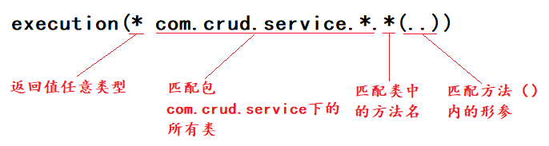

# Mybatis

## Mapper.xml

### CRUD

```xml
<select id="selectPerson" parameterType="int" resultType="hashmap">
  SELECT * FROM PERSON WHERE ID = #{id}
</select>
```

```xml
<resultMap id="UserMap" type="User">
    <result column="id" property="id"></result>
    <result column="name" property="username"></result>
    <result column="pwd" property="password"></result>
</resultMap>
<select id="getUserById" resultMap="UserMap" parameterType="int">
    select * from mybatis.user where id = #{id}
</select>
```

+ `id="selectPerson"`：命名空间中唯一的标识符对，应接口中声明的方法名`ElemTyspe electPerson(){}`

+ `parameterType="int"`：传入语句的类型

+ `resultType="hashmap"`：返回结果类型

+ `resultMap`：返回一个Map映射关系，使用这个常常是因为数据库中的字段和实体类字段不同

```
数据库  User
id-------id
name----username
pwd-----password
```

+ `keyProperty`：（仅适用于 insert 和 update）指定能够唯一识别对象的属性
+ `keyColumn`：（仅适用于 insert 和 update）设置生成键值在表中的列名

### sql

```xml
<sql id="userColumns"> ${alias}.id,${alias}.username,${alias}.password </sql>
```

```xml
<select id="selectUsers" resultType="map">
  select
    <include refid="userColumns"><property name="alias" value="t1"/></include>
  from t1
</select>
```

上面的sql标签语句代入到select标签语句中，翻译过来如下：

```sql
select t1.id,t1.username,ti.password from t1
```

### #{}内的参数

以上传入的是基本参数，下面有一个传入对象的例子：

```xml
<insert id="insertUser" parameterType="User">
  insert into users (id, username, password)
  values (#{id}, #{username}, #{password})
</insert>
```

如果 User 类型的参数对象传递到了语句中，会查找 id、username 和 password 属性，然后将它们的值传入预处理语句的参数中。

```
#{age,javaType=int,jdbcType=NUMERIC,typeHandler=MyTypeHandler}
#{height,javaType=double,jdbcType=NUMERIC,numericScale=2}
#{department, mode=OUT, jdbcType=CURSOR, javaType=ResultSet, resultMap=departmentResultMap}
```

+ `javaType`：显式确定传入age的数据类型
+ `jdbcType`：详细见这篇文章https://blog.csdn.net/loongshawn/article/details/50496460
+ `numericScale`：设置小数位数

这三个是常用参数，其他不常用暂且不说

### 字符串替换

```java
@Select("select * from user where ${column} = #{value}")
User findByColumn(@Param("column") String column, @Param("value") String value);
```

其中 `${column}` 会被直接替换，而 `#{value}` 会使用 `?` 预处理。 这样，就能完成同样的任务：

```java
User userOfId1 = userMapper.findByColumn("id", 1L);
User userOfNameKid = userMapper.findByColumn("name", "kid");
User userOfEmail = userMapper.findByColumn("email", "noone@nowhere.com");
```

等价于如下代码：

```java
@Select("select * from user where id = #{id}")
User findById(@Param("id") long id);

@Select("select * from user where name = #{name}")
User findByName(@Param("name") String name);

@Select("select * from user where email = #{email}")
User findByEmail(@Param("email") String email);
```

### 结果映射

```xml
<!-- 非常复杂的结果映射 -->
<resultMap id="detailedBlogResultMap" type="Blog">
  <constructor>
    <idArg column="blog_id" javaType="int"/>
  </constructor>
  <result property="title" column="blog_title"/>
  <association property="author" javaType="Author">
    <id property="id" column="author_id"/>
    <result property="username" column="author_username"/>
    <result property="password" column="author_password"/>
    <result property="email" column="author_email"/>
    <result property="bio" column="author_bio"/>
    <result property="favouriteSection" column="author_favourite_section"/>
  </association>
  <collection property="posts" ofType="Post">
    <id property="id" column="post_id"/>
    <result property="subject" column="post_subject"/>
    <association property="author" javaType="Author"/>
    <collection property="comments" ofType="Comment">
      <id property="id" column="comment_id"/>
    </collection>
    <collection property="tags" ofType="Tag" >
      <id property="id" column="tag_id"/>
    </collection>
    <discriminator javaType="int" column="draft">
      <case value="1" resultType="DraftPost"/>
    </discriminator>
  </collection>
</resultMap>
```

**association是用于一对一和多对一，而collection是用于一对多的关系**

+ `constructor`：用于在实例化类时，注入结果到构造方法中
  + `idArg`：ID 参数；标记出作为 ID 的结果可以帮助提高整体性能
  + `arg`：将被注入到构造方法的一个普通结果
+ `id`：一个 ID 结果；标记出作为 ID 的结果可以帮助提高整体性能
+ `result`：注入到字段或 JavaBean 属性的普通结果
+ `association`：一个复杂类型的关联；许多结果将包装成这种类型
  + 嵌套结果映射：关联可以是 `resultMap` 元素，或是对其它结果映射的引用
+ `collection`：一个复杂类型的集合
  + 嵌套结果映射：集合可以是 `resultMap` 元素，或是对其它结果映射的引用
+ `discriminator` – 使用结果值来决定使用哪个 `resultMap`
  + `case` – 基于某些值的结果映射
  + 嵌套结果映射 – `case` 也是一个结果映射，因此具有相同的结构和元素；或者引用其它的结果映射

## Mybatis-config.xml

- properties（属性）
- settings（设置）
- typeAliases（类型别名）
- typeHandlers（类型处理器）
- objectFactory（对象工厂）
- plugins（插件）
- environments（环境配置）
  - environment（环境变量）
    - transactionManager（事务管理器）
    - dataSource（数据源）
- databaseIdProvider（数据库厂商标识）
- mappers（映射器）

### properties

`database.properties`：

```properties
driver=com.mysql.cj.jdbc.Driver
#jdbc:mysql://localhost:3306/mybatis?useSSL=true&amp;useUnicode=true&amp;characterEncoding=UTF-8&amp;default-time-zone='+8:00'
url=jdbc:mysql://localhost:3306/mybatis?useSSL=true&useUnicode=true&characterEncoding=UTF-8&default-time-zone='+8:00'
username=root
password=root
```

引入使用properties标签引入`database.properties`：

```xml
<configuration>
    <properties resource="database.properties"/>
    <environments default="development">
        <environment id="development">
            <transactionManager type="JDBC"/>
                <dataSource type="POOLED">
                  <property name="driver" value="${driver}"/>
                  <property name="url" value="${url}"/>
                  <property name="username" value="${username}"/>
                  <property name="password" value="${password}"/>
                </dataSource>
        </environment>
    </environments>
</configuration>
```

### settings

常用的就是这个驼峰命名

| 设置名                     | 描述                                                         | 有效值        | 默认值 |
| :------------------------- | :----------------------------------------------------------- | :------------ | :----- |
| `mapUnderscoreToCamelCase` | 是否开启驼峰命名自动映射，即从经典数据库列名 `A_COLUMN`映射到经典 Java 属性名 `aColumn`。 | true \| false | False  |

```xml
<settings>
    <setting name="mapUnderscoreToCamelCase" value="false"/>
</settings>
```

### typeAliases

1.使用`typeAliases`

```xml
<typeAliases>
  <typeAlias alias="Author" type="domain.blog.Author"/>
  <typeAlias alias="Blog" type="domain.blog.Blog"/>
</typeAliases>
```

2.使用`package`

指定一个包名，MyBatis会在包名下面搜索需要的 Java Bean

```xml
<typeAliases>
    <package name="com.longsir.pojo"/>
</typeAliases>
```
下面是一些为常见的 Java 类型内建的类型别名。它们都是不区分大小写的，注意，为了应对原始类型的命名重复，采取了特殊的命名风格。

| 别名       | 映射的类型 |
| :--------- | :--------- |
| _byte      | byte       |
| _long      | long       |
| _short     | short      |
| _int       | int        |
| _integer   | int        |
| _double    | double     |
| _float     | float      |
| _boolean   | boolean    |
| string     | String     |
| byte       | Byte       |
| long       | Long       |
| short      | Short      |
| int        | Integer    |
| integer    | Integer    |
| double     | Double     |
| float      | Float      |
| boolean    | Boolean    |
| date       | Date       |
| decimal    | BigDecimal |
| bigdecimal | BigDecimal |
| object     | Object     |
| map        | Map        |
| hashmap    | HashMap    |
| list       | List       |
| arraylist  | ArrayList  |
| collection | Collection |
| iterator   | Iterator   |

### environments

MyBatis 可以配置成适应多种环境

**不过要记住：尽管可以配置多个环境，但每个 SqlSessionFactory 实例只能选择一种环境。**

Mybatis默认的实务管理器是JDBC，连接池：POOLED

### mappers

方式一：

```xml
<!-- 使用相对于类路径的资源引用 -->
<mappers>
  <mapper resource="org/mybatis/builder/AuthorMapper.xml"/>
  <mapper resource="org/mybatis/builder/BlogMapper.xml"/>
  <mapper resource="org/mybatis/builder/PostMapper.xml"/>
</mappers>
```

方式二：

```xml
<!-- 使用映射器接口实现类的完全限定类名 -->
<mappers>
  <mapper class="org.mybatis.builder.AuthorMapper"/>
  <mapper class="org.mybatis.builder.BlogMapper"/>
  <mapper class="org.mybatis.builder.PostMapper"/>
</mappers>
```

方式三：

```xml
<!-- 将包内的映射器接口实现全部注册为映射器 -->
<mappers>
  <package name="org.mybatis.builder"/>
</mappers>
```

对应方式二、三，需要注意：

- 接口和它的Mapper配置文件必须同名
- 接口和它的Mapper配置文件必须在同一包下

# Spring

## IOC

实体类：

```java
@Data
@NoArgsConstructor
@AllArgsConstructor
public class Hello {
    private String str;
}
```

对应的bean：

```xml
<bean id="hello" class="com.longsir.pojo.Hello">
    <property name="str" value="Spring"></property>
</bean>
```

根据`com.longsir.pojo.Hello`类创建对象hello，并给对象中的成员变量str赋予初值Spring

## DI

### Set注入

实体类：

```java
public class Address {
    private String address;
}
```

```java
public class Student {
    private String username;
    private Address address;
    private String[] books;
    private List<String> hobbies;
    private Map<String,String> card;
    private Set<String> games;
    private String wife;
    private Properties info;
}
```

依赖注入的各种方式：

```xml
<?xml version="1.0" encoding="UTF-8"?>
<beans xmlns="http://www.springframework.org/schema/beans"
       xmlns:xsi="http://www.w3.org/2001/XMLSchema-instance"
       xsi:schemaLocation="http://www.springframework.org/schema/beans http://www.springframework.org/schema/beans/spring-beans.xsd">

    <bean id="addr" class="com.longsir.pojo.Address">
        <property name="address" value="安徽大学"></property>
    </bean>

    <bean id="student" class="com.longsir.pojo.Student">
        <!--普通值注入-->
        <property name="username" value="贾宝玉"></property>
        <!--Bean注入-->
        <property name="address" ref="addr"></property>
        <!--数组注入-->
        <property name="books">
            <array>
                <value>林黛玉</value>
                <value>史湘云</value>
                <value>薛宝钗</value>
                <value>贾探春</value>
            </array>
        </property>
        <!--List-->
        <property name="hobbies">
            <list>
                <value>琴</value>
                <value>棋</value>
                <value>书</value>
                <value>画</value>
            </list>
        </property>
        <!--Map-->
        <property name="card">
            <map>
                <entry key="银行卡" value="472189759817894212"></entry>
                <entry key="身份证" value="40298759983749151X"></entry>
            </map>
        </property>
        <!--set-->
        <property name="games">
            <set>
                <value>全面战争</value>
                <value>维多利亚</value>
                <value>文明</value>
            </set>
        </property>
        <!--null-->
        <property name="wife">
            <null></null>
        </property>
        <!--properties-->
        <property name="info">
            <props>
                <prop key="学号">Y0114110</prop>
                <prop key="性别">男</prop>
                <prop key="url">https://jonnylong.gitee.io/</prop>
            </props>
        </property>
    </bean>
</beans>
```

### p、c命名空间

```java
@Data
@NoArgsConstructor
@AllArgsConstructor
public class User {
    private String name;
    private int age;
}
```

使用命名空间时候必须导入以下：

`xmlns:p="http://www.springframework.org/schema/p"`

`xmlns:c="http://www.springframework.org/schema/c"`

```xml
<!--P(属性: properties)命名空间 , 属性依然要设置set方法-->
<bean id="user" class="com.longsir.pojo.User" p:name="晴雯" p:age="18"></bean>

<!--C(构造: Constructor)命名空间 , 属性依然要设置set方法-->
<bean id="user2" class="com.longsir.pojo.User" c:name="袭人" c:age="19"></bean>
```

## 自动装配

### XML

手动装配：

```xml
<bean id="cat" class="com.longsir.pojo.Cats"></bean>
<bean id="dog" class="com.longsir.pojo.Dogs"></bean>

<bean id="people" class="com.longsir.pojo.People">
    <property name="name" value="JonnyLong"></property>
    <property name="cat" ref="cat"></property>
    <property name="dog" ref="dog"></property>
</bean>
```

转换成自动装配后如下：

```xml
<bean id="cat" class="com.longsir.pojo.Cats"></bean>
<bean id="dog" class="com.longsir.pojo.Dogs"></bean>
<bean id="people" class="com.longsir.pojo.People" autowire="byName">
    <property name="name" value="JonnyLong"></property>
</bean>
```

```xml
<bean id="cat" class="com.longsir.pojo.Cats"></bean>
<bean id="dog" class="com.longsir.pojo.Dogs"></bean>
<bean id="people" class="com.longsir.pojo.People" autowire="byType">
    <property name="name" value="JonnyLong"></property>
</bean>
```

`byName`：会自动在容器上下文中查找，和自己对象set方法后面的值对应的`beanid`！

`byType`：会自动在容器上下文中查找，和自己对象属性类型相同的bean！

### 注解

#### @Autowired

添加注解支持：

```xml
<context:annotation-config/>
<bean id="cat" class="com.longsir.pojo.Cats"></bean>
<bean id="dog" class="com.longsir.pojo.Dogs"></bean>

<bean id="people" class="com.longsir.pojo.People"></bean>
```
对上述代码：

```java
public class People {
    @Autowired
    private Cats cat;
    @Autowired
    private Dogs dog;
    private String name;
}
```

#### @Qualifier

`@Autowired`是根据类型自动装配的，加上`@Qualifier`则可以根据`byName`的方式自动装配

`@Qualifier`不能单独使用。

```xml
<bean id="dog1" class="com.longsir.pojo.Dog"/>
<bean id="dog2" class="com.longsir.pojo.Dog"/>
<bean id="cat1" class="com.longsir.pojo.Cat"/>
<bean id="cat2" class="com.longsir.pojo.Cat"/>
```

```java
@Autowired
@Qualifier(value = "cat2")
private Cat cat;
@Autowired
@Qualifier(value = "dog2")
private Dog dog;
```

### @Resource

- @Resource如有指定的name属性，先按该属性进行`byName`方式查找装配；
- 其次再进行默认的`byName`方式进行装配；
- 如果以上都不成功，则按`byType`的方式自动装配。
- 都不成功，则报异常。

```java
public class User {
   //如果允许对象为null，设置required = false,默认为true
   @Resource(name = "cat2")
   private Cat cat;
   @Resource
   private Dog dog;
   private String str;
}
```

## AOP

### 常规方式

SpringAOP中，通过Advice定义横切逻辑，Spring中支持5种类型的Advice：

| 通知类型     | 连接点               | 实现接口                                          |
| ------------ | -------------------- | ------------------------------------------------- |
| 前置通知     | 方法方法前           | `org.springframework.aop.MethodBeforeAdvice`      |
| 后置通知     | 方法后               | `org.springframework.aop.AfterReturningAdvice`    |
| 异常抛出通知 | 方法抛出通知         | `org.springframework.aop.ThrowsAdvice`            |
| 环绕通知     | 方法前后             | `org.aopalliance.intercept.MethodInterceptor`     |
| 引介通知     | 类中增加新的方法属性 | `org.springframework.aop.IntroductionInterceptor` |

```java
public class Log implements MethodBeforeAdvice {
    /**
     *
     * @param method：要执行的目标对象的方法
     * @param objects：参数
     * @param target：目标对象
     * @throws Throwable
     */
    @Override
    public void before(Method method, Object[] objects, Object target) throws Throwable {
        System.out.println("切入到方法前-------------------------------------------------"+method.getName());
        System.out.println(target.getClass().getName()+"的"+method.getName()+"被执行了！");
    }
}
```
```java
public class AfterLog implements AfterReturningAdvice {
    @Override
    public void afterReturning(Object returnValue, Method method, Object[] objects, Object target) throws Throwable {
        System.out.println("切入到方法后-------------------------------------------------"+method.getName());
        System.out.println("执行了"+method.getName()+"方法，返回结果为："+returnValue);
    }
}
```

```xml
<!--配置AOP-->
<aop:config>
    <!--切入点 expression:表达式匹配要执行的方法-->
    <aop:pointcut id="pointcut" expression="execution(* com.crud.service.*.*(..))"/>
    <!--执行环绕; advice-ref执行方法 . pointcut-ref切入点-->
    <aop:advisor advice-ref="log" pointcut-ref="pointcut"></aop:advisor>
    <aop:advisor advice-ref="afterLog" pointcut-ref="pointcut"></aop:advisor>
</aop:config>
```



### 注解

```java
@Aspect
public class AnnotationPointcut {
   @Before("execution(* com.longsir.service.UserServiceImpl.*(..))")
   public void before(){
       System.out.println("---------方法执行前---------");
  }

   @After("execution(* com.longsir.service.UserServiceImpl.*(..))")
   public void after(){
       System.out.println("---------方法执行后---------");
  }

   @Around("execution(* com.longsir.service.UserServiceImpl.*(..))")
   public void around(ProceedingJoinPoint jp) throws Throwable {
       System.out.println("环绕前");
       System.out.println("签名:"+jp.getSignature());
       //执行目标方法proceed
       Object proceed = jp.proceed();
       System.out.println("环绕后");
       System.out.println(proceed);
  }
}
```

在Spring配置文件中，注册bean，并增加支持注解的配置：

```xml
<!--第三种方式:注解实现-->
<bean id="annotationPointcut" class="com.longsir.config.AnnotationPointcut"/>
<aop:aspectj-autoproxy/>
```

# SpringMVC

## springmvc-servlet.xml

SpringMVC必须配置的三大件：**处理器映射器、处理器适配器、视图解析器**。

**处理器映射器**和**处理器适配器**只需要开启**注解驱动**即可，省去了大段的xml配置

```xml
<!-- 自动扫描包，让指定包下的注解生效,由IOC容器统一管理 -->
<context:component-scan base-package="com.longsir.controller"/>
<!-- 让Spring MVC不处理静态资源 -->
<mvc:default-servlet-handler />
<!-- 支持mvc注解驱动 -->
<mvc:annotation-driven />

<!-- 视图解析器 -->
<bean class="org.springframework.web.servlet.view.InternalResourceViewResolver"
      id="internalResourceViewResolver">
    <!-- 前缀 -->
    <property name="prefix" value="/WEB-INF/jsp/" />
    <!-- 后缀 -->
    <property name="suffix" value=".jsp" />
</bean>
```

## web.xml

```xml
<!--1.注册DispatcherServlet-->
<servlet>
    <servlet-name>springmvc</servlet-name>
    <servlet-class>org.springframework.web.servlet.DispatcherServlet</servlet-class>
    <!--关联一个springmvc的配置文件:【servlet-name】-servlet.xml-->
    <init-param>
        <param-name>contextConfigLocation</param-name>
        <param-value>classpath:springmvc-servlet.xml</param-value>
    </init-param>
    <!--启动级别-1-->
    <load-on-startup>1</load-on-startup>
</servlet>

<!--/ 匹配所有的请求；（不包括.jsp）-->
<!--/* 匹配所有的请求；（包括.jsp）-->
<servlet-mapping>
    <servlet-name>springmvc</servlet-name>
    <url-pattern>/</url-pattern>
</servlet-mapping>
```

在`web.xml`中配置，SpringMVC自带的过滤器！

```xml
<filter>
   <filter-name>encoding</filter-name>
   <filter-class>org.springframework.web.filter.CharacterEncodingFilter</filter-class>
   <init-param>
       <param-name>encoding</param-name>
       <param-value>utf-8</param-value>
   </init-param>
</filter>
<filter-mapping>
   <filter-name>encoding</filter-name>
   <url-pattern>/*</url-pattern>
</filter-mapping>
```

# 整合SSM

## Mybatis.xml

```xml
<?xml version="1.0" encoding="UTF-8" ?>
<!DOCTYPE configuration
        PUBLIC "-//mybatis.org//DTD Config 3.0//EN"
        "http://mybatis.org/dtd/mybatis-3-config.dtd">
<configuration>
    <typeAliases>
        <package name="com.crud.pojo"/>
    </typeAliases>
    <mappers>
        <mapper class="com.crud.dao.BookDao"/>
    </mappers>
</configuration>
```

## Spring-dao.xml

```xml
<context:property-placeholder location="classpath:database.properties"/>
<bean id="dataSource" class="com.mchange.v2.c3p0.ComboPooledDataSource">
    <!-- 配置连接池属性 -->
    <property name="driverClass" value="${jdbc.driver}"/>
    <property name="jdbcUrl" value="${jdbc.url}"/>
    <property name="user" value="${jdbc.username}"/>
    <property name="password" value="${jdbc.password}"/>

    <!-- c3p0连接池的私有属性 -->
    <property name="maxPoolSize" value="30"/>
    <property name="minPoolSize" value="10"/>
    <!-- 关闭连接后不自动commit -->
    <property name="autoCommitOnClose" value="false"/>
    <!-- 获取连接超时时间 -->
    <property name="checkoutTimeout" value="10000"/>
    <!-- 当获取连接失败重试次数 -->
    <property name="acquireRetryAttempts" value="2"/>
</bean>

<bean id="sqlSessionFactory" class="org.mybatis.spring.SqlSessionFactoryBean">
    <property name="dataSource" ref="dataSource"/>
    <property name="configLocation" value="classpath:mybatis-config.xml"/>
</bean>

<!-- 配置扫描Dao接口包，动态实现Dao接口注入到spring容器中 -->
<bean class="org.mybatis.spring.mapper.MapperScannerConfigurer">
    <!-- 注入sqlSessionFactory -->
    <property name="sqlSessionFactoryBeanName" value="sqlSessionFactory"/>
    <!-- 给出需要扫描Dao接口包 -->
    <property name="basePackage" value="com.crud.dao"/>
</bean>
```

## spring-service.xml

```xml
<!-- 扫描service相关的bean -->
<context:component-scan base-package="com.crud.service" />

<!--BookServiceImpl注入到IOC容器中-->
<bean id="BookServiceImpl" class="com.crud.service.BookServiceImpl">
    <property name="bookDao" ref="bookDao"/>
</bean>

<!-- 配置事务管理器 -->
<bean id="transactionManager" class="org.springframework.jdbc.datasource.DataSourceTransactionManager">
    <property name="dataSource" ref="dataSource" />
</bean>
```

## spring-mvc.xml

```xml
<mvc:annotation-driven />
<mvc:default-servlet-handler/>
<bean class="org.springframework.web.servlet.view.InternalResourceViewResolver">
    <property name="viewClass" value="org.springframework.web.servlet.view.JstlView" />
    <property name="prefix" value="/WEB-INF/jsp/" />
    <property name="suffix" value=".jsp" />
</bean>
<context:component-scan base-package="com.crud.controller" />
```

## applicationContext.xml

```xml
<?xml version="1.0" encoding="UTF-8"?>
<beans xmlns="http://www.springframework.org/schema/beans"
       xmlns:xsi="http://www.w3.org/2001/XMLSchema-instance"
       xsi:schemaLocation="http://www.springframework.org/schema/beans
       http://www.springframework.org/schema/beans/spring-beans.xsd">

    <import resource="spring-dao.xml"/>
    <import resource="spring-service.xml"/>
    <import resource="spring-mvc.xml"/>
</beans>
```

# Maven

## 常用依赖

```xml
<!--JUnit-->
<dependency>
    <groupId>junit</groupId>
    <artifactId>junit</artifactId>
    <version>4.13.1</version>
    <scope>test</scope>
</dependency>
<!--数据库驱动-->
<dependency>
    <groupId>mysql</groupId>
    <artifactId>mysql-connector-java</artifactId>
    <version>8.0.22</version>
</dependency>
<!--数据库连接池-->
<dependency>
    <groupId>com.mchange</groupId>
    <artifactId>c3p0</artifactId>
    <version>0.9.5.5</version>
</dependency>
<!--Servlet、JSP-->
<dependency>
    <groupId>javax.servlet</groupId>
    <artifactId>javax.servlet-api</artifactId>
    <version>4.0.1</version>
    <scope>provided</scope>
</dependency>
<dependency>
    <groupId>javax.servlet.jsp</groupId>
    <artifactId>jsp-api</artifactId>
    <version>2.2</version>
</dependency>
<dependency>
    <groupId>javax.servlet</groupId>
    <artifactId>jstl</artifactId>
    <version>1.2</version>
</dependency>
<!--Mybatis-->
<dependency>
    <groupId>org.mybatis</groupId>
    <artifactId>mybatis</artifactId>
    <version>3.5.2</version>
</dependency>
<dependency>
    <groupId>org.mybatis</groupId>
    <artifactId>mybatis-spring</artifactId>
    <version>2.0.2</version>
</dependency>
<!--Spring-->
<dependency>
    <groupId>org.springframework</groupId>
    <artifactId>spring-webmvc</artifactId>
    <version>5.1.9.RELEASE</version>
</dependency>
<dependency>
    <groupId>org.springframework</groupId>
    <artifactId>spring-jdbc</artifactId>
    <version>5.1.9.RELEASE</version>
</dependency>
```

## 资源过滤设置

```xml
<build>
    <resources>
        <resource>
            <directory>src/main/java</directory>
            <includes>
                <include>**/*.properties</include>
                <include>**/*.xml</include>
            </includes>
            <filtering>false</filtering>
        </resource>
        <resource>
            <directory>src/main/resources</directory>
            <includes>
                <include>**/*.properties</include>
                <include>**/*.xml</include>
            </includes>
            <filtering>false</filtering>
        </resource>
    </resources>
</build>
```

