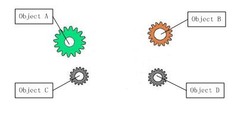
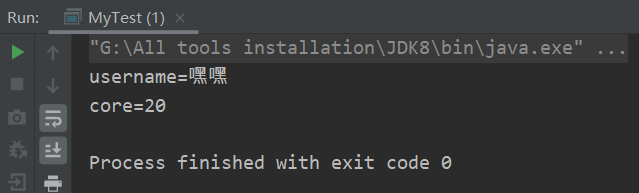
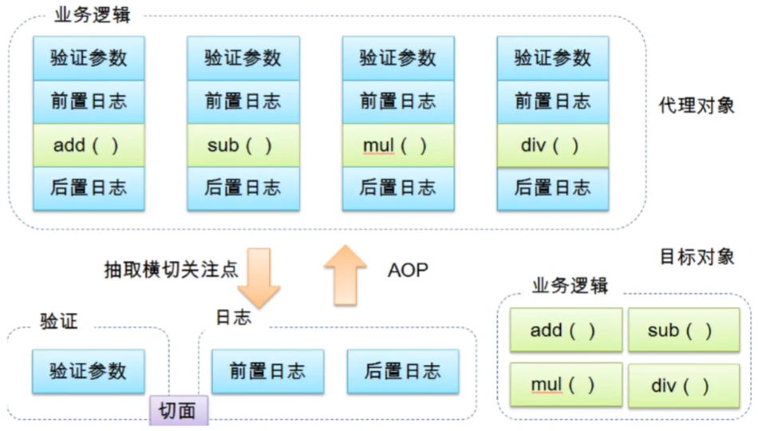

# 一、Spring

Spring的三大基石：

+ IOC
+ DI
+ AOP

## 简介

Spring : 春天 --->给软件行业带来了春天

2002年，Rod Jahnson首次推出了Spring框架雏形interface21框架。

2004年3月24日，Spring框架以interface21框架为基础，经过重新设计，发布了1.0正式版。

很难想象Rod Johnson的学历 , 他是悉尼大学的博士，然而他的专业不是计算机，而是音乐学。

Spring理念 : 使现有技术更加实用 . 本身就是一个大杂烩 , 整合现有的框架技术

官网 : http://spring.io/

官方文档：https://docs.spring.io/spring-framework/docs/5.2.9.RELEASE/spring-framework-reference/core.html#resources

网友翻译的中文文档：https://www.docs4dev.com/

GitHub : https://github.com/spring-projects

导入依赖：

```xml
<!-- https://mvnrepository.com/artifact/org.springframework/spring-webmvc -->
<dependency>
    <groupId>org.springframework</groupId>
    <artifactId>spring-webmvc</artifactId>
    <version>5.2.9.RELEASE</version>
</dependency>
<!-- https://mvnrepository.com/artifact/org.springframework/spring-jdbc -->
<dependency>
    <groupId>org.springframework</groupId>
    <artifactId>spring-jdbc</artifactId>
    <version>5.2.9.RELEASE</version>
</dependency>
```

1、Spring是一个开源免费的框架 , 容器  .

2、Spring是一个轻量级的框架 , 非侵入式的 .

**3、控制反转 IoC  , 面向切面 Aop**

4、对事物的支持 , 对框架的支持

.......

一句话概括：

**Spring是一个轻量级的控制反转(IoC)和面向切面(AOP)的容器（框架）。**

# 二、IOC

## 理论推导

```java
public interface UserDao {
    void getUser();
}
```

实现接口：

```java
public class UserDaoImpl implements UserDao {
    public void getUser() {
        System.out.println("默认获取用户数据");
    }
}
```

```java
public class UserDaoMySqlImpl implements UserDao {
    public void getUser() {
        System.out.println("Mysql获取用户数据");
    }
}
```

```java
public class UserDaoOracleImpl implements UserDao {
    public void getUser() {
        System.out.println("Oracle获取用户数据！");
    }
}
```

在`service`包下实现`UserService`接口，并使用：

```java
public interface UserService {
    void getUser();
}
```

```java
public class UserServiceImpl implements UserService {
    private UserDao userDao;
    public void setUserDao(UserDao userDao) {
        this.userDao = userDao;
    }

    public void getUser() {
        userDao.getUser();
    }
}
```

Test：

?> 根本是多态性，面向接口编程！

```java
import com.longsir.dao.UserDaoImpl;
import com.longsir.dao.UserDaoMySqlImpl;
import com.longsir.dao.UserDaoOracleImpl;
import com.longsir.service.UserServiceImpl;

/**
 * @author Jonny Long
 * @date 2020/10/13 16:17
 */
public class MyTest {
    public static void main(String[] args) {
        UserServiceImpl service = new UserServiceImpl();
        /**
         * 多态，面向接口编程
         */
        service.setUserDao( new UserDaoImpl() );
        service.getUser();
        //那我们现在又想用Mysql去实现呢
        service.setUserDao( new UserDaoMySqlImpl() );
        service.getUser();
        //那我们现在又想用Oracle去实现呢
        service.setUserDao( new UserDaoOracleImpl() );
        service.getUser();
    }
}
```


之前，程序是主动创建对象！控制权在程序猿手上！

使用了set注入后，程序不再具有主动性，而是变成了被动的接受对象!

这种思想，从本质上解决了问题，我们程序猿不用再去管理对象的建了。系统的耦合性大大降低，可以更加专注的在业务的实现上!这是IOC的原型！

## 本质

**控制反转IoC(Inversion of Control)，是一种设计思想，DI(依赖注入)是实现IoC的一种方法**，也有人认为DI只是IoC的另一种说法。没有IoC的程序中 , 我们使用面向对象编程 , 对象的创建与对象间的依赖关系完全硬编码在程序中，对象的创建由程序自己控制，控制反转后将对象的创建转移给第三方，个人认为所谓控制反转就是：获得依赖对象的方式反转了。




**IoC是Spring框架的核心内容**，使用多种方式完美的实现了IoC，可以使用XML配置，也可以使用注解，新版本的Spring也可以零配置实现IoC。

Spring容器在初始化时先读取配置文件，根据配置文件或元数据创建与组织对象存入容器中，程序使用时再从Ioc容器中取出需要的对象。


采用XML方式配置Bean的时候，Bean的定义信息是和实现分离的，而采用注解的方式可以把两者合为一体，Bean的定义信息直接以注解的形式定义在实现类中，从而达到了零配置的目的。

**控制反转是一种通过描述（XML或注解）并通过第三方去生产或获取特定对象的方式。在Spring中实现控制反转的是IoC容器，其实现方法是依赖注入（Dependency Injection,DI）。**

# 三、快速上手Spring

## HelloSpring

创建实例类：

```java
package com.longsir.pojo;

/**
 * @author Jonny Long
 * @date 2020/10/14 20:24
 */
public class Hello {
    private String str;

    @Override
    public String toString() {
        return "Hello{" +
                "str='" + str + '\'' +
                '}';
    }

    public String getStr() {
        return str;
    }

    public void setStr(String str) {
        this.str = str;
    }
}
```

配置`beans.xml`文件：

```xml
<?xml version="1.0" encoding="UTF-8"?>
<beans xmlns="http://www.springframework.org/schema/beans"
       xmlns:xsi="http://www.w3.org/2001/XMLSchema-instance"
       xsi:schemaLocation="http://www.springframework.org/schema/beans
       http://www.springframework.org/schema/beans/spring-beans.xsd">

    <!--使用spring来创建对象，在Spring这些都称作bean
    Java写法：
        类型 变量名 = new 类型();
        Hello hello = new Hello();
    Spring写法：
        id = 变量名
        class = new 的对象的路径
        property 相当于给对象中的属性设置一个值
    -->
    <bean id="hello" class="com.longsir.pojo.Hello">
        <property name="str" value="Spring"></property>
    </bean>

</beans>
```

测试：

```java
public class MyTest {
    public static void main(String[] args) {
        //解析beans.xml文件，获取Spring的上下文对象
        ApplicationContext context = new ClassPathXmlApplicationContext("beans.xml");
        //我们对象现在都在Spring中管理了，要使用直接去里面取出来即可
        Hello hello = (Hello)context.getBean("hello");
        System.out.println(hello.toString());
    }
}
```


## 对案例一的修改

`dao`和`service`都不修改，增添`beans.xml`文件：

```xml
<?xml version="1.0" encoding="UTF-8"?>
<beans xmlns="http://www.springframework.org/schema/beans"
       xmlns:xsi="http://www.w3.org/2001/XMLSchema-instance"
       xsi:schemaLocation="http://www.springframework.org/schema/beans http://www.springframework.org/schema/beans/spring-beans.xsd">

    <bean id="userDaoImpl" class="com.longsir.dao.UserDaoImpl"></bean>
    <bean id="userDaoMySqlImpl" class="com.longsir.dao.UserDaoMySqlImpl"></bean>
    <bean id="userDaoOracleImpl" class="com.longsir.dao.UserDaoOracleImpl"></bean>

    <!--
        ref: 引用Spring容器中创建好的对象
        value: 具体的值，基本数据类型
    -->
    <bean id="userServiceImpl" class="com.longsir.service.UserServiceImpl">
        <property name="userDao" ref="userDaoMySqlImpl"></property>
    </bean>
</beans>
```

测试：

```java
public class MyTest {
    public static void main(String[] args) {
        ApplicationContext context = new ClassPathXmlApplicationContext("beans.xml");
        UserServiceImpl userServiceImpl = (UserServiceImpl) context.getBean("userServiceImpl");
        userServiceImpl.getUser();
    }
}
```


## IOC创建对象的方式

> 通过无参构造方法来创建

`User.java`：

```java
public class User {

   private String name;

   public User() {
       System.out.println("user无参构造方法");
  }

   public void setName(String name) {
       this.name = name;
  }

   public void show(){
       System.out.println("name="+ name );
  }
}
```

`beans.xml`：

```xml
<?xml version="1.0" encoding="UTF-8"?>
<beans xmlns="http://www.springframework.org/schema/beans"
      xmlns:xsi="http://www.w3.org/2001/XMLSchema-instance"
      xsi:schemaLocation="http://www.springframework.org/schema/beans
       http://www.springframework.org/schema/beans/spring-beans.xsd">

   <bean id="user" class="com.longsir.pojo.User">
       <property name="name" value="kuangshen"/>
   </bean>
</beans>
```

测试类：

```java
@Test
public void test(){
   ApplicationContext context = new ClassPathXmlApplicationContext("beans.xml");
   //在执行getBean的时候, user已经创建好了 , 通过无参构造
   User user = (User) context.getBean("user");
   //调用对象的方法 .
   user.show();
}
```

结果可以发现，在调用show方法之前，User对象已经通过无参构造初始化了！

> 通过有参构造方法来创建

`UserT.java`：

```java
package com.longsir.pojo;

/**
 * @author Jonny Long
 * @date 2020/10/14 21:13
 */
public class UserT {
    private String username;
    private int core;

    public UserT(String username, int core) {
        this.username = username;
        this.core = core;
    }

    public void show(){
        System.out.println("username="+ username );
        System.out.println("core="+ core );
    }

    public String getUsername() {
        return username;
    }

    public void setUsername(String username) {
        this.username = username;
    }

    public int getCore() {
        return core;
    }

    public void setCore(int core) {
        this.core = core;
    }
}
```

`beans.xml`有三种方式编写：

```java
<!-- 第一种根据index参数下标设置 -->
<bean id="userT" class="com.longsir.pojo.UserT">
    <constructor-arg index="0" value="嘿嘿"/>
    <constructor-arg index="1" value="20"/>
</bean>
```
```java
<!-- 第二种根据参数名字设置 -->
<bean id="userT" class="com.longsir.pojo.UserT">
    <!-- name指参数名 -->
    <constructor-arg name="username" value="jonnylong"/>
    <constructor-arg name="core" value="18"/>
</bean>
```
```java
<!-- 第三种根据参数类型设置 -->
<bean id="userT" class="com.longsir.pojo.UserT">
    <constructor-arg type="java.lang.String" value="啊哈"/>
    <constructor-arg type="int" value="22"/>
</bean>
```

测试：

```java
@Test
public void testT(){
   ApplicationContext context = new ClassPathXmlApplicationContext("beans.xml");
   UserT user = (UserT) context.getBean("userT");
   user.show();
}
```



**结论：在配置文件加载的时候。其中管理的对象都已经初始化了！**

## Spring配置

### 别名

alias 设置别名 , 为bean设置别名 , 可以设置多个别名

```xml
<!--设置别名：在获取Bean的时候可以使用别名获取-->
<alias name="userT" alias="userNew"/>
```

### Bean的配置

`id`：bean的唯一标识符，也就是对象名

`class`：bean对象所对应的全限定名；包名+类名

`name`：也是别名，而且name可以取多个别名

如果不配置id和name，可以根据`applicationContext.getBean(.class)`获取对象;

```xml
<!--bean就是java对象,由Spring创建和管理-->
<bean id="hello" name="hello2 h2,h3;h4" class="com.longsir.pojo.Hello">
   <property name="name" value="Spring"/>
</bean>
```

### import

团队的合作通过import来导入各个开发配置的`beans.xml`：

```xml
<import resource="{path}/beans.xml"/>
```

# 四、DI（Dependency Injection）

`Dependency`：bean对象的创建依赖于容器

`Injection`：bean对象中所有的属性，由容器来注入

## Set注入

`Address.java`：

```java
public class Address {
    private String address;

    @Override
    public String toString() {
        return "Address{" +
                "address='" + address + '\'' +
                '}';
    }

    public String getAddress() {
        return address;
    }

    public void setAddress(String address) {
        this.address = address;
    }
}
```

`Student.java`：

```java
import java.util.*;
public class Student {
    private String username;
    private Address address;
    private String[] books;
    private List<String> hobbies;
    private Map<String,String> card;
    private Set<String> games;
    private String wife;
    private Properties info;

    @Override
    public String toString() {
        return "Student{" +
                "username='" + username + '\'' +
                ", address=" + address.toString() +
                ", books=" + Arrays.toString(books) +
                ", hobbies=" + hobbies +
                ", card=" + card +
                ", games=" + games +
                ", wife='" + wife + '\'' +
                ", info=" + info +
                '}';
    }

    public String getUsername() {
        return username;
    }

    public void setUsername(String username) {
        this.username = username;
    }

    public Address getAddress() {
        return address;
    }

    public void setAddress(Address address) {
        this.address = address;
    }

    public String[] getBooks() {
        return books;
    }

    public void setBooks(String[] books) {
        this.books = books;
    }

    public List<String> getHobbies() {
        return hobbies;
    }

    public void setHobbies(List<String> hobbies) {
        this.hobbies = hobbies;
    }

    public Map<String, String> getCard() {
        return card;
    }

    public void setCard(Map<String, String> card) {
        this.card = card;
    }

    public Set<String> getGames() {
        return games;
    }

    public void setGames(Set<String> games) {
        this.games = games;
    }

    public String getWife() {
        return wife;
    }

    public void setWife(String wife) {
        this.wife = wife;
    }

    public Properties getInfo() {
        return info;
    }

    public void setInfo(Properties info) {
        this.info = info;
    }
}
```

`ApplicationContext.xml`各种注入方式汇总：

```xml
<?xml version="1.0" encoding="UTF-8"?>
<beans xmlns="http://www.springframework.org/schema/beans"
       xmlns:xsi="http://www.w3.org/2001/XMLSchema-instance"
       xsi:schemaLocation="http://www.springframework.org/schema/beans http://www.springframework.org/schema/beans/spring-beans.xsd">

    <bean id="addr" class="com.longsir.pojo.Address">
        <property name="address" value="安徽大学"></property>
    </bean>

    <bean id="student" class="com.longsir.pojo.Student">
        <!--普通值注入-->
        <property name="username" value="贾宝玉"></property>
        <!--Bean注入-->
        <property name="address" ref="addr"></property>
        <!--数组注入-->
        <property name="books">
            <array>
                <value>林黛玉</value>
                <value>史湘云</value>
                <value>薛宝钗</value>
                <value>贾探春</value>
            </array>
        </property>
        <!--List-->
        <property name="hobbies">
            <list>
                <value>琴</value>
                <value>棋</value>
                <value>书</value>
                <value>画</value>
            </list>
        </property>
        <!--Map-->
        <property name="card">
            <map>
                <entry key="银行卡" value="472189759817894212"></entry>
                <entry key="身份证" value="40298759983749151X"></entry>
            </map>
        </property>
        <!--set-->
        <property name="games">
            <set>
                <value>全面战争</value>
                <value>维多利亚</value>
                <value>文明</value>
            </set>
        </property>
        <!--null-->
        <property name="wife">
            <null></null>
        </property>
        <!--properties-->
        <property name="info">
            <props>
                <prop key="学号">Y0114110</prop>
                <prop key="性别">男</prop>
                <prop key="url">https://jonnylong.gitee.io/</prop>
            </props>
        </property>
    </bean>
</beans>
```

测试：

```java
public class MyTest {
    public static void main(String[] args) {
        ApplicationContext context = new ClassPathXmlApplicationContext("ApplicationContext.xml");
        Student student = (Student) context.getBean("student");
        System.out.println(student.toString());
    }
}
```
输出结果如下：

```
Student{
	username='贾宝玉', 
	address=Address{address='安徽大学'}, 
	books=[林黛玉, 史湘云, 薛宝钗, 贾探春], 
	hobbies=[琴, 棋, 书, 画], 
	card={
		银行卡=472189759817894212, 
		身份证=40298759983749151X
	}, 
	games=[全面战争, 维多利亚, 文明], 
	wife='null', 
	info={
		学号=Y0114110, 
		性别=男, 
		url=https://jonnylong.gitee.io/
    }
}
```

## p、c命名空间

实体类，**如果用c命名空间，必须要有构造方法，而且包括有参和无参**

```java
public class User {
    private String name;
    private int age;

    public User() {
    }

    public User(String name, int age) {
        this.name = name;
        this.age = age;
    }

    @Override
    public String toString() {
        return "User{" +
                "name='" + name + '\'' +
                ", age=" + age +
                '}';
    }

    public String getName() {
        return name;
    }

    public void setName(String name) {
        this.name = name;
    }

    public int getAge() {
        return age;
    }

    public void setAge(int age) {
        this.age = age;
    }
}
```

使用命名空间时候必须导入以下：

`xmlns:p="http://www.springframework.org/schema/p"`

`xmlns:c="http://www.springframework.org/schema/c"`

```xml
<!--P(属性: properties)命名空间 , 属性依然要设置set方法-->
<bean id="user" class="com.longsir.pojo.User" p:name="晴雯" p:age="18"></bean>

<!--C(构造: Constructor)命名空间 , 属性依然要设置set方法-->
<bean id="user2" class="com.longsir.pojo.User" c:name="袭人" c:age="19"></bean>
```

测试：

```java
public class MyTest {
    public static void main(String[] args) {
        ApplicationContext context = new ClassPathXmlApplicationContext("UserBean.xml");
        User user = context.getBean("user2", User.class);
        System.out.println(user);
    }
}
```


## bean的作用域

| Scope                                                        | Description                                                  |
| :----------------------------------------------------------- | :----------------------------------------------------------- |
| [singleton](https://docs.spring.io/spring-framework/docs/5.2.9.RELEASE/spring-framework-reference/core.html#beans-factory-scopes-singleton) | (Default) Scopes a single bean definition to a single object instance for each Spring IoC container. |
| [prototype](https://docs.spring.io/spring-framework/docs/5.2.9.RELEASE/spring-framework-reference/core.html#beans-factory-scopes-prototype) | Scopes a single bean definition to any number of object instances. |
| [request](https://docs.spring.io/spring-framework/docs/5.2.9.RELEASE/spring-framework-reference/core.html#beans-factory-scopes-request) | Scopes a single bean definition to the lifecycle of a single HTTP request. That is, each HTTP request has its own instance of a bean created off the back of a single bean definition. Only valid in the context of a web-aware Spring `ApplicationContext`. |
| [session](https://docs.spring.io/spring-framework/docs/5.2.9.RELEASE/spring-framework-reference/core.html#beans-factory-scopes-session) | Scopes a single bean definition to the lifecycle of an HTTP `Session`. Only valid in the context of a web-aware Spring `ApplicationContext`. |
| [application](https://docs.spring.io/spring-framework/docs/5.2.9.RELEASE/spring-framework-reference/core.html#beans-factory-scopes-application) | Scopes a single bean definition to the lifecycle of a `ServletContext`. Only valid in the context of a web-aware Spring `ApplicationContext`. |
| [websocket](https://docs.spring.io/spring-framework/docs/5.2.9.RELEASE/spring-framework-reference/web.html#websocket-stomp-websocket-scope) | Scopes a single bean definition to the lifecycle of a `WebSocket`. Only valid in the context of a web-aware Spring `ApplicationContext`. |

### Singleton

```xml
<bean id="ServiceImpl" class="cn.csdn.service.ServiceImpl" scope="singleton">
```

### Prototype

```xml
<bean id="account" class="com.foo.DefaultAccount" scope="prototype"/>  
  或者
 <bean id="account" class="com.foo.DefaultAccount" singleton="false"/>
```

### 其他

其余的request、session、application、这些个只能在web开发中使用到!

# 五、自动装配

## 基本机制

- 自动装配是使用spring满足bean依赖的一种方法
- spring会在应用上下文中为某个bean寻找其依赖的bean。

Spring中bean有三种装配机制，分别是：

1. 在xml中显式配置；
2. 在java中显式配置；
3. 隐式的bean发现机制和自动装配。

这里我们主要讲第三种：自动化的装配bean。

Spring的自动装配需要从两个角度来实现，或者说是两个操作：

1. 组件扫描(component scanning)：spring会自动发现应用上下文中所创建的bean；
2. 自动装配(autowiring)：spring自动满足bean之间的依赖，也就是我们说的IoC/DI；

组件扫描和自动装配组合发挥巨大威力，使得显示的配置降低到最少。

**推荐不使用自动装配xml配置，而使用注解**

## 环境搭建

实体类：

```java
public class Cats {
    public void shout() {
        System.out.println("miao~");
    }
}
```

```java
public class Dogs {
    public void shout() {
        System.out.println("wang~");
    }
}
```

```java
public class People {
    private Cats cat;
    private Dogs dog;
    private String name;

    @Override
    public String toString() {
        return "People{" +
                "cat=" + cat +
                ", dog=" + dog +
                ", name='" + name + '\'' +
                '}';
    }

    public Cats getCat() {
        return cat;
    }

    public void setCat(Cats cat) {
        this.cat = cat;
    }

    public Dogs getDog() {
        return dog;
    }

    public void setDog(Dogs dog) {
        this.dog = dog;
    }

    public String getName() {
        return name;
    }

    public void setName(String name) {
        this.name = name;
    }
}
```

`beans.xml`文件：

```xml
<?xml version="1.0" encoding="UTF-8"?>
<beans xmlns="http://www.springframework.org/schema/beans"
       xmlns:xsi="http://www.w3.org/2001/XMLSchema-instance"
       xsi:schemaLocation="http://www.springframework.org/schema/beans http://www.springframework.org/schema/beans/spring-beans.xsd">

    <bean id="cat" class="com.longsir.pojo.Cats"></bean>
    <bean id="dog" class="com.longsir.pojo.Dogs"></bean>

    <bean id="people" class="com.longsir.pojo.People">
        <property name="name" value="JonnyLong"></property>
        <property name="cat" ref="cat"></property>
        <property name="dog" ref="dog"></property>
    </bean>
</beans>
```

测试：

```java
import com.longsir.pojo.People;
import org.springframework.context.ApplicationContext;
import org.springframework.context.support.ClassPathXmlApplicationContext;

/**
 * @author Jonny Long
 * @date 2020/10/17 21:49
 */
public class MyTest {
    public static void main(String[] args) {
        ApplicationContext context = new ClassPathXmlApplicationContext("beans.xml");
        People poeple = context.getBean("people", People.class);
        poeple.getCat().shout();
        poeple.getDog().shout();
    }
}
```

## bean自动装配

### byName

!> 注意这里byName的自动装配区分大小写，书写错误会报空指针异常

```xml
<bean id="cat" class="com.longsir.pojo.Cats"></bean>
<bean id="dog" class="com.longsir.pojo.Dogs"></bean>
<bean id="people" class="com.longsir.pojo.People" autowire="byName">
    <property name="name" value="JonnyLong"></property>
</bean>
```

小结：

当一个bean节点带有`autowire byName`的属性时。

1.将查找其类中所有的set方法名，例如setCat，获得将set去掉并且首字母小写的字符串，即cat。

2.去spring容器中寻找是否有此字符串名称id的对象。

3.如果有，就取出注入；如果没有，就报空指针异常。

### byType

`byName`：会自动在容器上下文中查找，和自己对象set方法后面的值对应的`beanid`！

`byType`：会自动在容器上下文中查找，和自己对象属性类型相同的bean！

```xml
<bean id="cat" class="com.longsir.pojo.Cats"></bean>
<bean id="dog" class="com.longsir.pojo.Dogs"></bean>

<bean id="people" class="com.longsir.pojo.People" autowire="byType">
    <property name="name" value="JonnyLong"></property>
</bean>
```

## 注解自动装配

### 相关约束

The introduction of annotation-based configuration raised the question of whether this approach is “better” than XML.

1.导入约束：context约束

2.配置注解的支持：`<context:annotation-config/>`

```xml
<?xml version="1.0" encoding="UTF-8"?>
<beans xmlns="http://www.springframework.org/schema/beans"
    xmlns:xsi="http://www.w3.org/2001/XMLSchema-instance"
    xmlns:context="http://www.springframework.org/schema/context"
    xsi:schemaLocation="http://www.springframework.org/schema/beans
        https://www.springframework.org/schema/beans/spring-beans.xsd
        http://www.springframework.org/schema/context
        https://www.springframework.org/schema/context/spring-context.xsd">

    <context:annotation-config/>

</beans>
```

### @Autowired

使用`@Autowired`就相当于把指定类型的Bean注入到指定的字段中。和XML配置相比，`@Autowired`大幅简化了注入，因为它不但可以写在`set()`方法上，还可以直接写在字段上，甚至可以写在构造方法中。

我们一般把`@Autowired`写在字段上，通常使用package权限的字段，便于测试。

实体类：

```java
public class People {
    @Autowired
    private Cats cat;
    @Autowired
    private Dogs dog;
    private String name;

    @Override
    public String toString() {
        return "People{" +
                "cat=" + cat +
                ", dog=" + dog +
                ", name='" + name + '\'' +
                '}';
    }

    public Cats getCat() {
        return cat;
    }

    public void setCat(Cats cat) {
        this.cat = cat;
    }

    public Dogs getDog() {
        return dog;
    }

    public void setDog(Dogs dog) {
        this.dog = dog;
    }

    public String getName() {
        return name;
    }

    public void setName(String name) {
        this.name = name;
    }
}
```

`beans.xml`文件：

```xml
<?xml version="1.0" encoding="UTF-8"?>
<beans xmlns="http://www.springframework.org/schema/beans"
       xmlns:xsi="http://www.w3.org/2001/XMLSchema-instance"
       xmlns:context="http://www.springframework.org/schema/context"
       xsi:schemaLocation="http://www.springframework.org/schema/beans
        https://www.springframework.org/schema/beans/spring-beans.xsd
        http://www.springframework.org/schema/context
        https://www.springframework.org/schema/context/spring-context.xsd">

    <!-- 开启注解支持 -->
    <context:annotation-config/>

    <bean id="cat" class="com.longsir.pojo.Cats"></bean>
    <bean id="dog" class="com.longsir.pojo.Dogs"></bean>

    <bean id="people" class="com.longsir.pojo.People"></bean>
</beans>
```

在使用`@Autowired`时，首先在容器中查询对应类型的bean

- 如果查询结果刚好为一个，就将该bean装配给`@Autowired`指定的数据
- 如果查询的结果不止一个，那么`@Autowired`会根据名称来查找。
- 如果查询的结果为空，那么会抛出异常。解决方法时，使用`required=false`

### @Qualifier

`@Autowired`是根据类型自动装配的，加上`@Qualifier`则可以根据`byName`的方式自动装配

`@Qualifier`不能单独使用。

```xml
<bean id="dog1" class="com.longsir.pojo.Dog"/>
<bean id="dog2" class="com.longsir.pojo.Dog"/>
<bean id="cat1" class="com.longsir.pojo.Cat"/>
<bean id="cat2" class="com.longsir.pojo.Cat"/>
```

```java
@Autowired
@Qualifier(value = "cat2")
private Cat cat;
@Autowired
@Qualifier(value = "dog2")
private Dog dog;
```

### @Resource

- @Resource如有指定的name属性，先按该属性进行byName方式查找装配；
- 其次再进行默认的byName方式进行装配；
- 如果以上都不成功，则按byType的方式自动装配。
- 都不成功，则报异常。

实体类：

```java
public class User {
   //如果允许对象为null，设置required = false,默认为true
   @Resource(name = "cat2")
   private Cat cat;
   @Resource
   private Dog dog;
   private String str;
}
```

`beans.xml`：

```xml
<bean id="dog" class="com.longsir.pojo.Dog"/>
<bean id="cat1" class="com.longsir.pojo.Cat"/>
<bean id="cat2" class="com.longsir.pojo.Cat"/>

<bean id="user" class="com.longsir.pojo.User"/>
```

测试：结果OK

配置文件2：beans.xml ， 删掉cat2

```xml
<bean id="dog" class="com.longsir.pojo.Dog"/>
<bean id="cat1" class="com.longsir.pojo.Cat"/>
```

实体类上只保留注解

```java
@Resource
private Cat cat;
@Resource
private Dog dog;
```

结果：OK

结论：先进行byName查找，失败；再进行byType查找，成功。

### 小结

@Autowired与@Resource异同：

1、@Autowired与@Resource都可以用来装配bean。都可以写在字段上，或写在setter方法上。

2、@Autowired默认按类型装配（属于spring规范），默认情况下必须要求依赖对象必须存在，如果要允许null 值，可以设置它的required属性为false，如：@Autowired(required=false) ，如果我们想使用名称装配可以结合@Qualifier注解进行使用

3、@Resource（属于J2EE复返），默认按照名称进行装配，名称可以通过name属性进行指定。如果没有指定name属性，当注解写在字段上时，默认取字段名进行按照名称查找，如果注解写在setter方法上默认取属性名进行装配。当找不到与名称匹配的bean时才按照类型进行装配。但是需要注意的是，如果name属性一旦指定，就只会按照名称进行装配。

它们的作用相同都是用注解方式注入对象，但执行顺序不同。@Autowired先byType，@Resource先byName。

# 六、使用注解开发

在spring4之后，想要使用注解形式，必须得要引入aop的包


## 属性注入

配置xml文件，`ApplicationContext.xml`：

```xml
<?xml version="1.0" encoding="UTF-8"?>
<beans xmlns="http://www.springframework.org/schema/beans"
       xmlns:xsi="http://www.w3.org/2001/XMLSchema-instance"
       xmlns:context="http://www.springframework.org/schema/context"
       xsi:schemaLocation="http://www.springframework.org/schema/beans
        https://www.springframework.org/schema/beans/spring-beans.xsd
        http://www.springframework.org/schema/context
        https://www.springframework.org/schema/context/spring-context.xsd">

    <context:component-scan base-package="com.longsir.pojo"/>
    <context:annotation-config/>
</beans>
```

实例类：

```java
/**
 * 等价于 <bean id="user" class="com.longsir.pojo.User"></bean>
 * Component: 组件
  */
@Component("user")
public class User {
    /**
     * 相当于 <property name="name" value="林黛玉"></property>
     * Value: 值，也可以放在setter方法上
     */
    @Value("林黛玉")
    public String name;
}
```

测试结果打印出：林黛玉

## 衍生注解

**@Component三个衍生注解**

为了更好的进行分层，Spring可以使用其它三个注解，功能一样，目前使用哪一个功能都一样。

- `@Controller`：web层
- `@Service`：service层
- `@Repository`：dao层

`@scope` 作用域：

singleton：默认的，Spring会采用单例模式创建这个对象。关闭工厂 ，所有的对象都会销毁。

prototype：多例模式。关闭工厂 ，所有的对象不会销毁。内部的垃圾回收机制会回收

```java
@Controller("user")
@Scope("prototype")
public class User {
   @Value("林黛玉")
   public String name;
}
```

**XML与注解比较**

- XML可以适用任何场景 ，结构清晰，维护方便
- 注解不是自己提供的类使用不了，开发简单方便

**xml与注解整合开发** ：推荐最佳实践

- xml管理Bean
- 注解完成属性注入
- 使用过程中， 可以不用扫描，扫描是为了类上的注解

```xml
<context:component-scan base-package="com.longsir.pojo"/>
<context:annotation-config/>
```

## JavaConfig

编写实体类：

```java
package com.longsir.pojo;

import org.springframework.beans.factory.annotation.Value;
import org.springframework.stereotype.Component;

/**
 * @author Jonny Long
 * @date 2020/10/18 20:47
 */
@Component
public class User {
    @Value("贾宝玉")
    private String name;
    @Value("林黛玉")
    private String wife;

    @Override
    public String toString() {
        return "User{" +
                "name='" + name + '\'' +
                ", wife='" + wife + '\'' +
                '}';
    }

    public void setName(String name) {
        this.name = name;
    }
    
    public void setWife(String wife) {
        this.wife = wife;
    }
}
```

编写Java配置类：

```java
package com.longsir.config;

import com.longsir.pojo.User;
import org.springframework.context.annotation.Bean;
import org.springframework.context.annotation.Configuration;

/**
 * @Configuration也会被Spring容器托管，注册到容器中，因为它本身就是一个@Component
 * @Configuration代表这是一个配置类，就是之前的beans.xml类似作用
 */
@Configuration
public class MyConfig {
    /**
     * 注册一个bean，就相当于之前写的bean标签
     * 这个方法的名字，相当于bean标签的id属性
     * 这个方法的返回值，相当于bean标签的class属性
     */
    @Bean
    public User MyService(){
        return new User();
    }
}
```

测试：

```java
public class HHTest {
    public static void main(String[] args) {
        /**
         * 如果完全使用了配置类方式去做，我们就只能通过AnnotationConfig 上下文来获取容器，通过配置类的class对象加载!
         */
        ApplicationContext context = new AnnotationConfigApplicationContext(MyConfig.class);
        User user = context.getBean("MyService", User.class);
        System.out.println(user);
    }
}
```


# 七、AOP

## AOP概述

AOP（Aspect Oriented Programming）意为：面向切面编程，通过预编译方式和运行期动态代理实现程序功能的统一维护的一种技术。AOP是OOP的延续，是软件开发中的一个热点，也是Spring框架中的一个重要内容，是函数式编程的一种衍生范型。利用AOP可以对业务逻辑的各个部分进行隔离，从而使得业务逻辑各部分之间的耦合度降低，提高程序的可重用性，同时提高了开发的效率。

> **在运行时，动态地将代码切入到类的指定方法、指定位置上的编程思想就是面向切面的编程。**



提供声明式事务；允许用户自定义切面

以下名词需要了解下：

- 横切关注点：跨越应用程序多个模块的方法或功能。即是，与我们业务逻辑无关的，但是我们需要关注的部分，就是横切关注点。如日志 , 安全 , 缓存 , 事务等等……
- 切面（Aspect）：横切关注点 被模块化 的特殊对象。即，它是一个类。
- 通知（Advice）：切面必须要完成的工作。即，它是类中的一个方法。
- 目标（Target）：被通知对象。
- 代理（Proxy）：向目标对象应用通知之后创建的对象。
- 切入点（PointCut）：切面通知 执行的 “地点”的定义。
- 连接点（JointPoint）：与切入点匹配的执行点。


SpringAOP中，通过Advice定义横切逻辑，Spring中支持5种类型的Advice：

| 通知类型     | 连接点               | 实现接口                                          |
| ------------ | -------------------- | ------------------------------------------------- |
| 前置通知     | 方法方法前           | `org.springframework.aop.MethodBeforeAdvice`      |
| 后置通知     | 方法后               | `org.springframework.aop.AfterReturningAdvice`    |
| 异常抛出通知 | 方法抛出通知         | `org.springframework.aop.ThrowsAdvice`            |
| 环绕通知     | 方法前后             | `org.aopalliance.intercept.MethodInterceptor`     |
| 引介通知     | 类中增加新的方法属性 | `org.springframework.aop.IntroductionInterceptor` |

即 Aop 在 不改变原有代码的情况下 , 去增加新的功能

## 通过Spring使用AOP

```xml
<!-- https://mvnrepository.com/artifact/org.aspectj/aspectjweaver -->
<dependency>
    <groupId>org.aspectj</groupId>
    <artifactId>aspectjweaver</artifactId>
    <version>1.9.6</version>
    <scope>runtime</scope>
</dependency>
```

### 通过 Spring API 实现

目录结构如下：


```java
public interface UserService {
    void add();
    void delete();
    void update();
    void search();
}
```

```java
/**
 * @author Jonny Long
 * @date 2020/10/24 21:23
 */
public class UserServiceImpl implements UserService{

    @Override
    public void add() {
        System.out.println("add方法");
    }

    @Override
    public void delete() {
        System.out.println("add方法");
    }

    @Override
    public void update() {
        System.out.println("update方法");
    }

    @Override
    public void search() {
        System.out.println("sea方法");
    }
}
```

`Log.java`：

```java
public class Log implements MethodBeforeAdvice {
    /**
     *
     * @param method：要执行的目标对象的方法
     * @param objects：参数
     * @param target：目标对象
     * @throws Throwable
     */
    @Override
    public void before(Method method, Object[] objects, Object target) throws Throwable {
        System.out.println("切入到方法前-------------------------------------------------"+method.getName());
        System.out.println(target.getClass().getName()+"的"+method.getName()+"被执行了！");
    }
}
```

`AfterLog.java`：

```java
public class AfterLog implements AfterReturningAdvice {

    @Override
    public void afterReturning(Object returnValue, Method method, Object[] objects, Object target) throws Throwable {
        System.out.println("切入到方法后-------------------------------------------------"+method.getName());
        System.out.println("执行了"+method.getName()+"方法，返回结果为："+returnValue);
    }
}
```

配置的xml文件，`ApplicationContext.xml`：

```xml
<?xml version="1.0" encoding="UTF-8"?>
<beans xmlns="http://www.springframework.org/schema/beans"
       xmlns:xsi="http://www.w3.org/2001/XMLSchema-instance"
       xmlns:aop="http://www.springframework.org/schema/aop"
       xsi:schemaLocation="http://www.springframework.org/schema/beans
        https://www.springframework.org/schema/beans/spring-beans.xsd
        http://www.springframework.org/schema/aop
        https://www.springframework.org/schema/aop/spring-aop.xsd">

    <!--注册AOP-->
    <bean id="userService" class="com.longsir.service.UserServiceImpl"></bean>
    <bean id="log" class="com.longsir.log.Log"></bean>
    <bean id="afterLog" class="com.longsir.log.AfterLog"></bean>

    <!--配置AOP-->
    <aop:config>
        <!--切入点 expression:表达式匹配要执行的方法-->
        <aop:pointcut id="pointcut" expression="execution(* com.longsir.service.UserServiceImpl.*(..))"/>
        <!--执行环绕; advice-ref执行方法 . pointcut-ref切入点-->
        <aop:advisor advice-ref="log" pointcut-ref="pointcut"></aop:advisor>
        <aop:advisor advice-ref="afterLog" pointcut-ref="pointcut"></aop:advisor>
    </aop:config>
</beans>
```

测试：

```java
/**
 * @author Jonny Long
 * @date 2020/10/24 21:42
 */
public class Test {
    public static void main(String[] args) {
        ApplicationContext context = new ClassPathXmlApplicationContext("ApplicationContext.xml");
        //UserService userService = (UserService) context.getBean("userService");
        UserService userService = context.getBean("userService", UserService.class);
        userService.add();
        userService.delete();
        userService.update();
        userService.search();
    }
}
```


Aop的重要性：很重要一定要理解其中的思路 , 主要是思想的理解这一块。

Spring的Aop就是将公共的业务（日志、安全等）和领域业务结合起来，当执行领域业务时，将会把公共业务加进来实现公共业务的重复利用，领域业务更纯粹，程序猿专注领域业务，其本质还是动态代理。

### 自定义类来实现Aop

目标业务类不变依旧是userServiceImpl

第一步 : 写我们自己的一个切入类

```java
public class DiyPointcut {
   public void before(){
       System.out.println("---------方法执行前---------");
  }
   public void after(){
       System.out.println("---------方法执行后---------");
  }
}
```

去spring中配置

```xml
<bean id="diy" class="com.longsir.log.DiyPointcut"></bean>
<aop:config>
    <aop:aspect ref="diy">
        <aop:pointcut id="DiyPointcut" expression="execution(* com.longsir.service.UserServiceImpl.*(..))"/>
        <aop:before method="before" pointcut-ref="DiyPointcut"></aop:before>
        <aop:after method="after" pointcut-ref="DiyPointcut"></aop:after>
    </aop:aspect>
</aop:config>
```

不修改测试类，输出测试结果：


### 使用注解实现

第一步：编写一个注解实现的增强类

```java
package com.longsir.config;

import org.aspectj.lang.ProceedingJoinPoint;
import org.aspectj.lang.annotation.After;
import org.aspectj.lang.annotation.Around;
import org.aspectj.lang.annotation.Aspect;
import org.aspectj.lang.annotation.Before;

@Aspect
public class AnnotationPointcut {
   @Before("execution(* com.longsir.service.UserServiceImpl.*(..))")
   public void before(){
       System.out.println("---------方法执行前---------");
  }

   @After("execution(* com.longsir.service.UserServiceImpl.*(..))")
   public void after(){
       System.out.println("---------方法执行后---------");
  }

   @Around("execution(* com.longsir.service.UserServiceImpl.*(..))")
   public void around(ProceedingJoinPoint jp) throws Throwable {
       System.out.println("环绕前");
       System.out.println("签名:"+jp.getSignature());
       //执行目标方法proceed
       Object proceed = jp.proceed();
       System.out.println("环绕后");
       System.out.println(proceed);
  }
}
```

第二步：在Spring配置文件中，注册bean，并增加支持注解的配置

```xml
<!--第三种方式:注解实现-->
<bean id="annotationPointcut" class="com.longsir.config.AnnotationPointcut"/>
<aop:aspectj-autoproxy/>
```

`aop:aspectj-autoproxy`：说明

通过aop命名空间的`<aop:aspectj-autoproxy />`声明自动为spring容器中那些配置`@aspectJ`切面的bean创建代理，织入切面。当然，spring 在内部依旧采用`AnnotationAwareAspectJAutoProxyCreator`进行自动代理的创建工作，但具体实现的细节已经被`<aop:aspectj-autoproxy />`隐藏起来了

`<aop:aspectj-autoproxy />`有一个proxy-target-class属性，默认为false，表示使用jdk动态代理织入增强，当配为`<aop:aspectj-autoproxy  poxy-target-class="true"/>`时，表示使用CGLib动态代理技术织入增强。不过即使proxy-target-class设置为false，如果目标类没有声明接口，则spring将自动使用CGLib动态代理。

# 八、整合Mybatis

## 导入相关jar包

junit

```xml
<!-- https://mvnrepository.com/artifact/junit/junit -->
<dependency>
    <groupId>junit</groupId>
    <artifactId>junit</artifactId>
    <version>4.13.1</version>
    <scope>test</scope>
</dependency>
```

mybatis

```xml
<dependency>
    <groupId>org.mybatis</groupId>
    <artifactId>mybatis</artifactId>
    <version>3.5.6</version>
</dependency>
```

mysql-connector-java

```xml
<dependency>
    <groupId>mysql</groupId>
    <artifactId>mysql-connector-java</artifactId>
    <version>8.0.22</version>
</dependency>
```

spring相关

```xml
<dependency>
    <groupId>org.springframework</groupId>
    <artifactId>spring-web</artifactId>
    <version>5.2.9.RELEASE</version>
</dependency>
<dependency>
    <groupId>org.springframework</groupId>
    <artifactId>spring-jdbc</artifactId>
    <version>5.2.9.RELEASE</version>
</dependency>
```

aspectJ AOP 织入器

```xml
<dependency>
    <groupId>org.aspectj</groupId>
    <artifactId>aspectjweaver</artifactId>
    <version>1.9.6</version>
    <scope>runtime</scope>
</dependency>
```

mybatis-spring整合包 【重点】

```xml
<dependency>
   <groupId>org.mybatis</groupId>
   <artifactId>mybatis-spring</artifactId>
   <version>2.0.5</version>
</dependency>
```

配置Maven静态资源过滤问题！

```xml
<build>
   <resources>
       <resource>
           <directory>src/main/java</directory>
           <includes>
               <include>**/*.properties</include>
               <include>**/*.xml</include>
           </includes>
           <filtering>true</filtering>
       </resource>
   </resources>
</build>
```

## Mybatis-Spring

官网地址：http://mybatis.org/spring/zh/index.html

| MyBatis-Spring | MyBatis | Spring 框架 | Spring Batch | Java    |
| :------------- | :------ | :---------- | :----------- | :------ |
| 2.0            | 3.5+    | 5.0+        | 4.0+         | Java 8+ |
| 1.3            | 3.4+    | 3.2.2+      | 2.1+         | Java 6+ |

MyBatis-Spring 会帮助你将 MyBatis 代码无缝地整合到 Spring 中。它将允许 MyBatis 参与到 Spring 的事务管理之中，创建映射器 mapper 和 `SqlSession` 并注入到 bean 中，以及将 Mybatis 的异常转换为 Spring 的 `DataAccessException`。最终，可以做到应用代码不依赖于MyBatis，Spring或MyBatis-Spring。

## 整合一

实体类`User.java`：

```java
package com.longsir.pojo;

/**
 * @author Jonny Long
 * @date 2020/10/27 16:08
 */
public class User {
    private int id;
    private String name;
    private String pwd;

    @Override
    public String toString() {
        return "User{" +
                "id=" + id +
                ", name='" + name + '\'' +
                ", pwd='" + pwd + '\'' +
                '}';
    }

    public User() {
    }

    public User(int id, String name, String pwd) {
        this.id = id;
        this.name = name;
        this.pwd = pwd;
    }

    public int getId() {
        return id;
    }

    public void setId(int id) {
        this.id = id;
    }

    public String getName() {
        return name;
    }

    public void setName(String name) {
        this.name = name;
    }

    public String getPwd() {
        return pwd;
    }

    public void setPwd(String pwd) {
        this.pwd = pwd;
    }
}
```

`UserMapper.java`接口，及其配置的`UserMapper.xml`文件：

```java
public interface UserMapper {
    List<User> selectUser();
}
```

```xml
<?xml version="1.0" encoding="UTF-8" ?>
<!DOCTYPE mapper
        PUBLIC "-//mybatis.org//DTD Mapper 3.0//EN"
        "http://mybatis.org/dtd/mybatis-3-mapper.dtd">
<mapper namespace="com.longsir.mapper.UserMapper">
    <select id="selectUser" resultType="User">
        select * from user
   </select>
</mapper>
```

mybatis的配置文件`mybatis-config.xml`：

```xml
<?xml version="1.0" encoding="UTF-8" ?>
<!DOCTYPE configuration
        PUBLIC "-//mybatis.org//DTD Config 3.0//EN"
        "http://mybatis.org/dtd/mybatis-3-config.dtd">
<configuration>
    <!--<settings>-->
    <!--    <setting name="logImpl" value="LOG4J"/>-->
    <!--</settings>-->
    <typeAliases>
        <package name="com.longsir.pojo"/>
    </typeAliases>
    <!--每一个Mapper.xml都需要在Mybatis核心配置文件中注册-->
    <!--<mappers>-->
    <!--    <mapper class="com.longsir.mapper.UserMapper"/>-->
    <!--</mappers>-->
</configuration>
```

在`ApplicationContext.xml`文件中做以下事情：

+ 设置`dataSource`数据源，这个原先是放在`mybatis-config.xml`文件中的，这里用Spring整合
+ 创建`SqlSessionFactory`类的实例，传入相关参数，对应原先mybatis中的创建工厂过程
  + 引入数据源`dataSource`
  + 设置SQL映射器`mapperLocations`
  + mybatis相关设置`configLocation`
+ 注册`sqlSessionTemplate` , 关联`sqlSessionFactory`，注入上一步的`SqlSessionFactory`实例
+ 注册bean实现userMapper

```xml
`SqlSessionFactory`<?xml version="1.0" encoding="UTF-8"?>
<beans xmlns="http://www.springframework.org/schema/beans"
       xmlns:xsi="http://www.w3.org/2001/XMLSchema-instance"
       xmlns:aop="http://www.springframework.org/schema/aop"
       xsi:schemaLocation="http://www.springframework.org/schema/beans
        https://www.springframework.org/schema/beans/spring-beans.xsd
        http://www.springframework.org/schema/aop
        https://www.springframework.org/schema/aop/spring-aop.xsd">

    <!--
        DataSource: 使用Spring的数据源替换Mybatis的配置  c3p0 dbcp druid
        我们这里使川Spring提供的JDBC: org.springframework.jdbc.datasource
    -->
    <bean id="dataSource" class="org.springframework.jdbc.datasource.DriverManagerDataSource">
        <property name="driverClassName" value="com.mysql.cj.jdbc.Driver"/>
        <property name="url" value="jdbc:mysql://localhost:3306/mybatis?useSSL=true&amp;useUnicode=true&amp;characterEncoding=UTF-8&amp;default-time-zone='+8:00'"/>
        <property name="username" value="root"/>
        <property name="password" value="root"/>
    </bean>

    <!--SqlSessionFactory-->
    <bean id="sqlSessionFactory" class="org.mybatis.spring.SqlSessionFactoryBean">
        <property name="dataSource" ref="dataSource" />
        <!--绑定mybatis-->
        <property name="mapperLocations" value="classpath:com/longsir/mapper/*.xml"></property>
        <property name="configLocation" value="classpath:mybatis-config.xml"></property>
    </bean>

    <!--注册sqlSessionTemplate , 关联sqlSessionFactory-->
    <bean id="sqlSession" class="org.mybatis.spring.SqlSessionTemplate">
        <!--利用构造器注入-->
        <constructor-arg index="0" ref="sqlSessionFactory"/>
    </bean>
    
    <!--创建UserMapperImpl类的实例，UserMapperImpl见下方-->
    <bean id="userMapper" class="com.longsir.mapper.UserMapperImpl">
        <property name="sqlSession" ref="sqlSession"></property>
    </bean>
</beans>
```

增加Dao接口的实现类；私有化`sqlSessionTemplate`

```java
public class UserMapperImpl implements UserMapper {
    //我们的所有操作，都使川sqLlSession来执行，在原来，现在都使川SqLSessionTemplate;
    private SqlSessionTemplate sqlSession;

    public void setSqlSession(SqlSessionTemplate sqlSession) {
        this.sqlSession = sqlSession;
    }
    @Override
    public List<User> selectUser() {
        UserMapper mapper = sqlSession.getMapper(UserMapper.class);
        return mapper.selectUser();
    }
}
```

最后进行测试：

```java
public class MyTest {
    @Test
    public void test(){
        ApplicationContext context = new ClassPathXmlApplicationContext("ApplicationContext.xml");
        UserMapper mapper = context.getBean("userMapper", UserMapper.class);
        List<User> user = mapper.selectUser();
        System.out.println(user);
    }
}
```

查询到到数据库结果如下：


以下错误需要注意：`ApplicationContext.xml`文件和`mybatis-config.xml`文件中不能重复映射mapper


就是以下两块不能同时使用：


## 整合二

dao继承Support类，直接利用`getSqlSession()`获得，然后直接注入`SqlSessionFactory`。比起方式1，不需要管理`SqlSessionTemplate`，而且对事务的支持更加友好，可跟踪源码查看

官方文档是这样讲的，网址：http://mybatis.org/spring/zh/sqlsession.html


```java
public class UserMapperImpl extends SqlSessionDaoSupport implements UserMapper {
    public List<User> selectUser() {
        UserMapper mapper = getSqlSession().getMapper(UserMapper.class);
        return mapper.selectUser();
    }
}
```

修改bean的配置：

```xml
<bean id="userMapper" class="com.longsir.mapper.UserMapperImpl">
    <property name="sqlSessionFactory" ref="sqlSessionFactory" />
</bean>
```

**总结 : 整合到spring以后可以完全不要mybatis的配置文件，除了这些方式可以实现整合之外，我们还可以使用注解来实现，这个等我们后面学习SpringBoot的时候还会测试整合！**

# 九、声明事务

## 事务

- 事务在项目开发过程非常重要，涉及到数据的一致性的问题，不容马虎！
- 事务管理是企业级应用程序开发中必备技术，用来确保数据的完整性和一致性。

事务就是把一系列的动作当成一个独立的工作单元，这些动作要么全部完成，要么全部不起作用。

**事务四个属性ACID**：

1.原子性（atomicity）

事务是原子性操作，由一系列动作组成，事务的原子性确保动作要么全部完成，要么完全不起作用

2.一致性（consistency）

一旦所有事务动作完成，事务就要被提交。数据和资源处于一种满足业务规则的一致性状态中

3.隔离性（isolation）

可能多个事务会同时处理相同的数据，因此每个事务都应该与其他事务隔离开来，防止数据损坏

4.持久性（durability）

事务一旦完成，无论系统发生什么错误，结果都不会受到影响。通常情况下，事务的结果被写到持久化存储器中

## 测试代码

在之前的案例中，在UserMapper接口新增两个方法：

```java
public interface UserMapper {
    List<User> selectUser();
    int addUser(User user);
    int deleteUser(int id);
}
```

对应的Mapper文件：

```xml
<?xml version="1.0" encoding="UTF-8" ?>
<!DOCTYPE mapper
        PUBLIC "-//mybatis.org//DTD Mapper 3.0//EN"
        "http://mybatis.org/dtd/mybatis-3-mapper.dtd">
<mapper namespace="com.longsir.mapper.UserMapper">
    <select id="selectUser" resultType="User">
        select * from user
   </select>

    <insert id="addUser" parameterType="User">
        insert into user (id,name,pwd) values (#{id},#{name},#{pwd})
    </insert>

    <delete id="deleteUser" parameterType="int">
        delete from user where id = #{id}
    </delete>
</mapper>
```

接口实现类`UserMapperImpl.java`：

```java
public class UserMapperImpl extends SqlSessionDaoSupport implements UserMapper {
    public List<User> selectUser() {
        UserMapper mapper = getSqlSession().getMapper(UserMapper.class);
        return mapper.selectUser();
    }

    public int addUser(User user){
        UserMapper mapper = getSqlSession().getMapper(UserMapper.class);
        return mapper.addUser(user);
    }

    public int deleteUser(int id) {
        UserMapper mapper = getSqlSession().getMapper(UserMapper.class);
        return mapper.deleteUser(id);
    }
}
```

## Spring事务管理

Spring在不同的事务管理API之上定义了一个抽象层，使得开发人员不必了解底层的事务管理API就可以使用Spring的事务管理机制。Spring支持编程式事务管理和声明式的事务管理。

编程式事务管理

- 将事务管理代码嵌到业务方法中来控制事务的提交和回滚
- 缺点：必须在每个事务操作业务逻辑中包含额外的事务管理代码

声明式事务管理

- 一般情况下比编程式事务好用。
- 将事务管理代码从业务方法中分离出来，以声明的方式来实现事务管理。
- 将事务管理作为横切关注点，通过aop方法模块化。Spring中通过Spring AOP框架支持声明式事务管理。

使用Spring管理事务，注意头文件的约束导入 : tx

```xml
xmlns:tx="http://www.springframework.org/schema/tx"

http://www.springframework.org/schema/tx
http://www.springframework.org/schema/tx/spring-tx.xsd"
```

事务管理器

- 无论使用Spring的哪种事务管理策略（编程式或者声明式）事务管理器都是必须的。
- 就是 Spring的核心事务管理抽象，管理封装了一组独立于技术的方法。

JDBC事务

```xml
<bean id="txManager" class="org.springframework.jdbc.datasource.DataSourceTransactionManager">
    <property name="dataSource" ref="dataSource"></property>
</bean>
```

配置事务通知：

```xml
<!--结合AOP实现事务的注入-->
<!--配置事务通知-->
<tx:advice id="txAdvice" transaction-manager="txManager">
    <!--给哪些方法配置事务-->
    <!--配置事务的特性，new propagation-->
    <tx:attributes>
        <tx:method name="add" propagation="REQUIRED"/>
        <tx:method name="delete" propagation="REQUIRED"/>
        <tx:method name="update" propagation="REQUIRED"/>
        <tx:method name="search*" propagation="REQUIRED"/>
        <tx:method name="get" read-only="true"/>
        <tx:method name="*" propagation="REQUIRED"/>
    </tx:attributes>
</tx:advice>
```

spring事务传播特性：

事务传播行为就是多个事务方法相互调用时，事务如何在这些方法间传播。spring支持7种事务传播行为：

- propagation_requierd：如果当前没有事务，就新建一个事务，如果已存在一个事务中，加入到这个事务中，这是最常见的选择。
- propagation_supports：支持当前事务，如果没有当前事务，就以非事务方法执行。
- propagation_mandatory：使用当前事务，如果没有当前事务，就抛出异常。
- propagation_required_new：新建事务，如果当前存在事务，把当前事务挂起。
- propagation_not_supported：以非事务方式执行操作，如果当前存在事务，就把当前事务挂起。
- propagation_never：以非事务方式执行操作，如果当前事务存在则抛出异常。
- propagation_nested：如果当前存在事务，则在嵌套事务内执行。如果当前没有事务，则执行与propagation_required类似的操作

Spring 默认的事务传播行为是 PROPAGATION_REQUIRED，它适合于绝大多数的情况。

配置AOP：

```xml
<!--配置事务切入-->
<aop:config>
    <aop:pointcut id="txPointcut" expression="execution(* com.longsir.mapper.*.*(..))"/>
    <aop:advisor advice-ref="txAdvice" pointcut-ref="txPointcut"/>
</aop:config>
```

测试：

```java
@Test
public void test(){
    ApplicationContext context = new ClassPathXmlApplicationContext("ApplicationContext.xml");
    UserMapper mapper = context.getBean("userMapper", UserMapper.class);
    //Object sqlSession = context.getBean("sqlSession");
    mapper.addUser(new User(7, "司棋", "987654"));
    mapper.addUser(new User(8, "金钏", "000000"));
    mapper.deleteUser(7);
    List<User> user = mapper.selectUser();
    for (User i: user){
        System.out.println(i);
    }
}
```


