> SpringBoot官网：https://spring.io/projects/spring-boot#learn
>

# 一、HelloWorld

## 项目创建

Spring官方提供了非常方便的工具让我们快速构建应用

Spring Initializr：https://start.spring.io/

**项目创建方式一：**使用Spring Initializr 的 Web页面创建项目

1、打开  https://start.spring.io/

2、填写项目信息

3、点击”Generate Project“按钮生成项目；下载此项目

4、解压项目包，并用IDEA以Maven项目导入，一路下一步即可，直到项目导入完毕。

5、如果是第一次使用，可能速度会比较慢，包比较多、需要耐心等待一切就绪。

**项目创建方式二：**使用 IDEA 直接创建项目

1、创建一个新项目

2、选择spring initalizr ， 可以看到默认就是去官网的快速构建工具那里实现

3、填写项目信息

4、选择初始化的组件（初学勾选 Web 即可）

5、填写项目路径

6、等待项目构建成功

**项目结构分析：**

通过上面步骤完成了基础项目的创建。就会自动生成以下文件。

1、程序的主启动类

2、一个 application.properties 配置文件

3、一个 测试类

4、一个 pom.xml

```xml

<!-- 父依赖 -->
<parent>
    <groupId>org.springframework.boot</groupId>
    <artifactId>spring-boot-starter-parent</artifactId>
    <version>2.4.1</version>
    <relativePath/>
</parent>

<dependencies>
    <!-- web场景启动器 -->
    <dependency>
        <groupId>org.springframework.boot</groupId>
        <artifactId>spring-boot-starter-web</artifactId>
    </dependency>
    <!-- springboot单元测试 -->
    <dependency>
        <groupId>org.springframework.boot</groupId>
        <artifactId>spring-boot-starter-test</artifactId>
        <scope>test</scope>
        <!-- 剔除依赖 -->
        <exclusions>
            <exclusion>
                <groupId>org.junit.vintage</groupId>
                <artifactId>junit-vintage-engine</artifactId>
            </exclusion>
        </exclusions>
    </dependency>
</dependencies>

<build>
    <plugins>
        <!-- 打包插件 -->
        <plugin>
            <groupId>org.springframework.boot</groupId>
            <artifactId>spring-boot-maven-plugin</artifactId>
        </plugin>
    </plugins>
</build>
```

## 编写一个http接口

1.在主程序的同级目录下，新建一个controller包，**一定要在同级目录下，否则识别不到**

2.在包中新建一个HelloController类

```java
@RestController
public class HelloController {
    @RequestMapping("/hello")
    public String hello() {
        return "Hello World";
    }
}
```

3.编写完毕后，从主程序启动项目，浏览器发起请求，看页面返回；控制台输出了 Tomcat 访问的端口号！

## 打包成jar

如果遇到以上错误，可以配置打包时 跳过项目运行测试用例：

```xml
<!--
    在工作中,很多情况下我们打包是不想执行测试用例的
    可能是测试用例不完事,或是测试用例会影响数据库数据
    跳过测试用例执
    -->
<plugin>
    <groupId>org.apache.maven.plugins</groupId>
    <artifactId>maven-surefire-plugin</artifactId>
    <configuration>
        <!--跳过项目运行测试用例-->
        <skipTests>true</skipTests>
    </configuration>
</plugin>
```

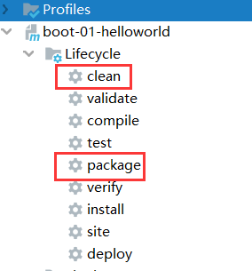

# 二、运行原理初探

## pom.xml

### 父依赖

其中它主要是依赖一个父项目，主要是管理项目的资源过滤及插件！

```xml
<parent>
    <groupId>org.springframework.boot</groupId>
    <artifactId>spring-boot-starter-parent</artifactId>
    <version>2.4.1</version>
    <relativePath/> <!-- lookup parent from repository -->
</parent>
```

点进去，发现还有一个父依赖

```xml
<parent>
    <groupId>org.springframework.boot</groupId>
    <artifactId>spring-boot-dependencies</artifactId>
    <version>2.4.1</version>
    <relativePath>../../spring-boot-dependencies</relativePath>
</parent>
```

这里才是真正管理SpringBoot应用里面所有依赖版本的地方，SpringBoot的版本控制中心；

**以后我们导入依赖默认是不需要写版本；但是如果导入的包没有在依赖中管理着就需要手动配置版本了；**

### 启动器spring-boot-starter

```xml
<dependency>
    <groupId>org.springframework.boot</groupId>
    <artifactId>spring-boot-starter-web</artifactId>
</dependency>
```

`springboot-boot-starter-xxx`：就是spring-boot的场景启动器

`spring-boot-starter-web`：帮我们导入了web模块正常运行所依赖的组件；

SpringBoot将所有的功能场景都抽取出来，做成一个个的starter （启动器），只需要在项目中引入这些starter即可，所有相关的依赖都会导入进来 ， 我们要用什么功能就导入什么样的场景启动器即可 ；我们未来也可以自己自定义 starter；

## 主启动类

分析完了 pom.xml 来看看这个启动类

### 默认的主启动类

```java
//@SpringBootApplication 来标注一个主程序类
//说明这是一个Spring Boot应用
@SpringBootApplication
public class SpringbootApplication {
   public static void main(String[] args) {
     //以为是启动了一个方法，没想到启动了一个服务
      SpringApplication.run(SpringbootApplication.class, args);
   }
}
```

但是**一个简单的启动类并不简单！**我们来分析一下这些注解都干了什么

### @SpringBootApplication

作用：标注在某个类上说明这个类是SpringBoot的主配置类 ， SpringBoot就应该运行这个类的main方法来启动SpringBoot应用；

进入这个注解：可以看到上面还有很多其他注解！

```java

@SpringBootConfiguration
@EnableAutoConfiguration
@ComponentScan(
    excludeFilters = {@Filter(
    type = FilterType.CUSTOM,
    classes = {TypeExcludeFilter.class}
), @Filter(
    type = FilterType.CUSTOM,
    classes = {AutoConfigurationExcludeFilter.class}
)}
)
public @interface SpringBootApplication {
    // ......
}
```

### @ComponentScan

这个注解在Spring中很重要 ,它对应XML配置中的元素。

作用：自动扫描并加载符合条件的组件或者bean ， 将这个bean定义加载到IOC容器中

### @SpringBootConfiguration

作用：SpringBoot的配置类 ，标注在某个类上 ， 表示这是一个SpringBoot的配置类；

我们继续进去这个注解查看

```java
// 点进去得到下面的 @Component
@Configuration
public @interface SpringBootConfiguration {}

@Component
public @interface Configuration {}
```

这里的 @Configuration，说明这是一个配置类 ，配置类就是对应Spring的xml 配置文件；

里面的 @Component 这就说明，启动类本身也是Spring中的一个组件而已，负责启动应用！

我们回到 SpringBootApplication 注解中继续看。

### @EnableAutoConfiguration

`@EnableAutoConfiguration`：开启自动配置功能

以前我们需要自己配置的东西，而现在SpringBoot可以自动帮我们配置 ；@EnableAutoConfiguration告诉SpringBoot开启自动配置功能，这样自动配置才能生效；

点进注解接续查看：

``@AutoConfigurationPackage`：自动配置包

```java
@Import({Registrar.class})
public @interface AutoConfigurationPackage {
}
```

`@import` ：Spring底层注解@import ， 给容器中导入一个组件

Registrar.class 作用：将主启动类的所在包及包下面所有子包里面的所有组件扫描到Spring容器 ；

这个分析完了，退到上一步，继续看

`@Import({AutoConfigurationImportSelector.class})` ：给容器导入组件 ；

AutoConfigurationImportSelector ：自动配置导入选择器，那么它会导入哪些组件的选择器呢？我们点击去这个类看源码：

1、这个类中有一个这样的方法

```java
// 获得候选的配置
protected List<String> getCandidateConfigurations(AnnotationMetadata metadata, AnnotationAttributes attributes) {
    //这里的getSpringFactoriesLoaderFactoryClass（）方法
    //返回的就是我们最开始看的启动自动导入配置文件的注解类；EnableAutoConfiguration
    List<String> configurations = SpringFactoriesLoader.loadFactoryNames(this.getSpringFactoriesLoaderFactoryClass(), this.getBeanClassLoader());
    Assert.notEmpty(configurations, "No auto configuration classes found in META-INF/spring.factories. If you are using a custom packaging, make sure that file is correct.");
    return configurations;
}
```

2、这个方法又调用了`SpringFactoriesLoader`类的静态方法！我们进入`SpringFactoriesLoader`类`loadFactoryNames()`方法

```java
public static List<String> loadFactoryNames(Class<?> factoryClass, @Nullable ClassLoader classLoader) {
    String factoryClassName = factoryClass.getName();
    //这里它又调用了 loadSpringFactories 方法
    return (List)loadSpringFactories(classLoader).getOrDefault(factoryClassName, Collections.emptyList());
}
```

3、我们继续点击查看`loadSpringFactories`方法

```java

private static Map<String, List<String>> loadSpringFactories(@Nullable ClassLoader classLoader) {
    //获得classLoader ， 我们返回可以看到这里得到的就是EnableAutoConfiguration标注的类本身
    MultiValueMap<String, String> result = (MultiValueMap)cache.get(classLoader);
    if (result != null) {
        return result;
    } else {
        try {
            //去获取一个资源 "META-INF/spring.factories"
            Enumeration<URL> urls = classLoader != null ? classLoader.getResources("META-INF/spring.factories") : ClassLoader.getSystemResources("META-INF/spring.factories");
            LinkedMultiValueMap result = new LinkedMultiValueMap();

            //将读取到的资源遍历，封装成为一个Properties
            while(urls.hasMoreElements()) {
                URL url = (URL)urls.nextElement();
                UrlResource resource = new UrlResource(url);
                Properties properties = PropertiesLoaderUtils.loadProperties(resource);
                Iterator var6 = properties.entrySet().iterator();

                while(var6.hasNext()) {
                    Entry<?, ?> entry = (Entry)var6.next();
                    String factoryClassName = ((String)entry.getKey()).trim();
                    String[] var9 = StringUtils.commaDelimitedListToStringArray((String)entry.getValue());
                    int var10 = var9.length;

                    for(int var11 = 0; var11 < var10; ++var11) {
                        String factoryName = var9[var11];
                        result.add(factoryClassName, factoryName.trim());
                    }
                }
            }

            cache.put(classLoader, result);
            return result;
        } catch (IOException var13) {
            throw new IllegalArgumentException("Unable to load factories from location [META-INF/spring.factories]", var13);
        }
    }
}
```

4、发现一个多次出现的文件：spring.factories，全局搜索它

### spring.factories

我们根据源头打开spring.factories ， 看到了很多自动配置的文件；这就是自动配置根源所在！

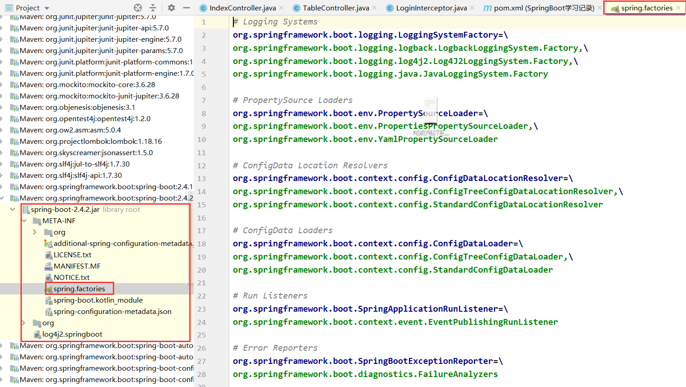

WebMvcAutoConfiguration：

我们在上面的自动配置类随便找一个打开看看，比如 ：`WebMvcAutoConfiguration`

可以看到这些一个个的都是JavaConfig配置类，而且都注入了一些Bean，可以找一些自己认识的类，看着熟悉一下！

所以，自动配置真正实现是从classpath中搜寻所有的META-INF/spring.factories配置文件 ，并将其中对应的 `org.springframework.boot.autoconfigure`. 包下的配置项，通过反射实例化为对应标注了 @Configuration的JavaConfig形式的IOC容器配置类 ， 然后将这些都汇总成为一个实例并加载到IOC容器中。

**结论：**

1. SpringBoot在启动的时候从类路径下的META-INF/spring.factories中获取EnableAutoConfiguration指定的值
2. 将这些值作为自动配置类导入容器 ， 自动配置类就生效 ， 帮我们进行自动配置工作；
3. 整个J2EE的整体解决方案和自动配置都在springboot-autoconfigure的jar包中；
4. 它会给容器中导入非常多的自动配置类 （xxxAutoConfiguration）, 就是给容器中导入这个场景需要的所有组件 ， 并配置好这些组件 ；
5. 有了自动配置类 ， 免去了我们手动编写配置注入功能组件等的工作；

## SpringApplication

### 不简单的方法

```java
@SpringBootApplication
public class SpringbootApplication {
    public static void main(String[] args) {
        SpringApplication.run(SpringbootApplication.class, args);
    }
}
```

`SpringApplication.run`分析：分析该方法主要分两部分，一部分是SpringApplication的实例化，二是run方法的执行；

### SpringApplication

**这个类主要做了以下四件事情：**

1、推断应用的类型是普通的项目还是Web项目

2、查找并加载所有可用初始化器 ， 设置到initializers属性中

3、找出所有的应用程序监听器，设置到listeners属性中

4、推断并设置main方法的定义类，找到运行的主类

查看构造器：

```java
public SpringApplication(ResourceLoader resourceLoader, Class... primarySources) {
    // ......
    this.webApplicationType = WebApplicationType.deduceFromClasspath();
    this.setInitializers(this.getSpringFactoriesInstances();
    this.setListeners(this.getSpringFactoriesInstances(ApplicationListener.class));
    this.mainApplicationClass = this.deduceMainApplicationClass();
}
```

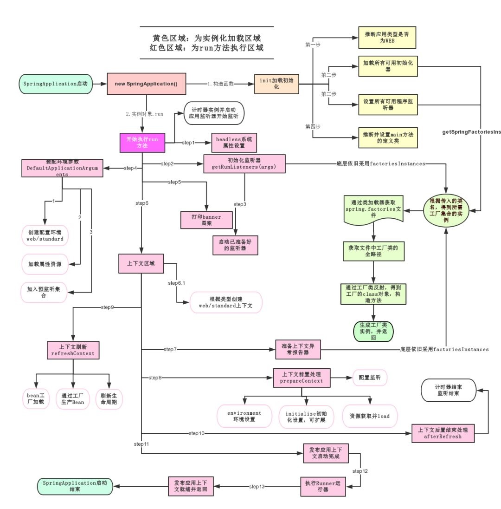

# 三、Yaml

## Yaml语法学习

### 配置文件

SpringBoot使用一个全局的配置文件 ， 配置文件名称是固定的

- `application.properties`：语法结构 ：key=value
- `application.yml`：语法结构 ：key：空格 value

**配置文件的作用 ：**修改SpringBoot自动配置的默认值，因为SpringBoot在底层都给我们自动配置好了；

比如我们可以在配置文件中修改Tomcat 默认启动的端口号！测试一下！

```
server.port=8081
```

### yaml基础语法

说明：语法要求严格！

1、空格不能省略

2、以缩进来控制层级关系，只要是左边对齐的一列数据都是同一个层级的。

3、属性和值的大小写都是十分敏感的。

**字面量：普通的值  [ 数字，布尔值，字符串  ]**

字面量直接写在后面就可以 ， 字符串默认不用加上双引号或者单引号；

```
k: v
```

注意：

- “ ” 双引号，不会转义字符串里面的特殊字符 ， 特殊字符会作为本身想表示的意思；

  比如 ：name: "kuang \n shen"  输出 ：kuang  换行  shen

- '' 单引号，会转义特殊字符 ， 特殊字符最终会变成和普通字符一样输出

  比如 ：name: ‘kuang \n shen’  输出 ：kuang  \n  shen

**对象、Map（键值对）**

```
#对象、Map格式k:     v1:    v2:
```

在下一行来写对象的属性和值得关系，注意缩进；比如：

```
student:    name: qinjiang    age: 3
```

行内写法

```
student: {name: qinjiang,age: 3}
```

**数组（ List、set ）**

用 - 值表示数组中的一个元素,比如：

```
pets: - cat - dog - pig
```

行内写法

```
pets: [cat,dog,pig]
```

**修改SpringBoot的默认端口号**

配置文件中添加，端口号的参数，就可以切换端口；

```
server:  port: 8082
```

注入配置文件

yaml文件更强大的地方在于，他可以给我们的实体类直接注入匹配值！

## 注入配置文件

### yaml注入配置文件

1、在springboot项目中的resources目录下新建一个文件 application.yml

2、编写一个实体类 Dog；

```java
package com.kuang.springboot.pojo;

@Component  //注册bean到容器中
public class Dog {
    private String name;
    private Integer age;
    
    //有参无参构造、get、set方法、toString()方法  
}
```

3、思考，我们原来是如何给bean注入属性值的！@Value，给狗狗类测试一下：

```java
@Component //注册bean
public class Dog {
    @Value("阿黄")
    private String name;
    @Value("18")
    private Integer age;
}
```

4、在SpringBoot的测试类下注入狗狗输出一下；

```java
@SpringBootTest
class DemoApplicationTests {

    @Autowired //将狗狗自动注入进来
    Dog dog;

    @Test
    public void contextLoads() {
        System.out.println(dog); //打印看下狗狗对象
    }

}
```

结果成功输出，@Value注入成功，这是我们原来的办法对吧。

5、我们在编写一个复杂一点的实体类：Person 类

```java
@Component //注册bean到容器中
public class Person {
    private String name;
    private Integer age;
    private Boolean happy;
    private Date birth;
    private Map<String,Object> maps;
    private List<Object> lists;
    private Dog dog;
    
    //有参无参构造、get、set方法、toString()方法  
}
```

6、我们来使用yaml配置的方式进行注入，大家写的时候注意区别和优势，我们编写一个yaml配置！

```yaml
person:
  name: qinjiang
  age: 3
  happy: false
  birth: 2000/01/01
  maps: {k1: v1,k2: v2}
  lists:
   - code
   - girl
   - music
  dog:
    name: 旺财
    age: 1
```

7、我们刚才已经把person这个对象的所有值都写好了，我们现在来注入到我们的类中！

```java

/*
@ConfigurationProperties作用：
将配置文件中配置的每一个属性的值，映射到这个组件中；
告诉SpringBoot将本类中的所有属性和配置文件中相关的配置进行绑定
参数 prefix = “person” : 将配置文件中的person下面的所有属性一一对应
*/
@Component //注册bean
@ConfigurationProperties(prefix = "person")
public class Person {
    private String name;
    private Integer age;
    private Boolean happy;
    private Date birth;
    private Map<String,Object> maps;
    private List<Object> lists;
    private Dog dog;
}
```

8、IDEA 提示，springboot配置注解处理器没有找到，让我们看文档，我们可以查看文档，找到一个依赖！

```xml
<!-- 导入配置文件处理器，配置文件进行绑定就会有提示，需要重启 -->
<dependency>
  <groupId>org.springframework.boot</groupId>
  <artifactId>spring-boot-configuration-processor</artifactId>
  <optional>true</optional>
</dependency>
```

9、确认以上配置都OK之后，我们去测试类中测试一下：

```java
@SpringBootTest
class DemoApplicationTests {

    @Autowired
    Person person; //将person自动注入进来

    @Test
    public void contextLoads() {
        System.out.println(person); //打印person信息
    }
}
```

### 加载指定的配置文件

`@PropertySource` ：加载指定的配置文件；

`@configurationProperties`：默认从全局配置文件中获取值；

1、我们去在resources目录下新建一个**person.properties**文件

```properties
name=kuangshen
```

2、然后在我们的代码中指定加载person.properties文件

```java

@PropertySource(value = "classpath:person.properties")
@Component //注册bean
public class Person {

    @Value("${name}")
    private String name;

    ......  
}
```

3、再次输出测试一下：指定配置文件绑定成功！

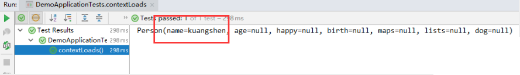

### 配置文件占位符

配置文件还可以编写占位符生成随机数

```yaml
person:
    name: qinjiang${random.uuid} # 随机uuid
    age: ${random.int}  # 随机int
    happy: false
    birth: 2000/01/01
    maps: {k1: v1,k2: v2}
    lists:
      - code
      - girl
      - music
    dog:
      name: ${person.hello:other}_旺财
      age: 1
```

### 回顾properties配置

我们上面采用的yaml方法都是最简单的方式，开发中最常用的；也是springboot所推荐的！那我们来唠唠其他的实现方式，道理都是相同的；写还是那样写；配置文件除了yml还有我们之前常用的properties ， 我们没有讲，我们来唠唠！

【注意】properties配置文件在写中文的时候，会有乱码 ， 我们需要去IDEA中设置编码格式为UTF-8；

settings-->FileEncodings 中配置；

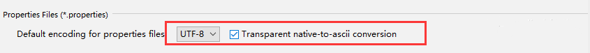

1、新建实体类User

```java
@Component //注册bean
public class User {
    private String name;
    private int age;
    private String sex;
}
```

2、编辑配置文件 user.properties

```properties
user1.name=kuangshen
user1.age=18
user1.sex=男
```

3、我们在User类上使用@Value来进行注入！

```java
@Component //注册bean
@PropertySource(value = "classpath:user.properties")
public class User {
    //直接使用@value
    @Value("${user.name}") //从配置文件中取值
    private String name;
    @Value("#{9*2}")  // #{SPEL} Spring表达式
    private int age;
    @Value("男")  // 字面量
    private String sex;
}
```

4、Springboot测试

```java
@SpringBootTest
class DemoApplicationTests {

    @Autowired
    User user;

    @Test
    public void contextLoads() {
        System.out.println(user);
    }

}
```

结果正常输出：

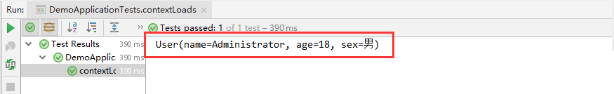

### 对比总结

@Value这个使用起来并不友好！我们需要为每个属性单独注解赋值，比较麻烦；

|                | @ConfigurationProperties | @Value     |
| -------------- | ------------------------ | ---------- |
| 功能           | 批量注入配置文件中的属性 | 一个个指定 |
| 松散绑定       | 支持                     | 不支持     |
| SpEL           | 不支持                   | 支持       |
| JSR303数据校验 | 支持                     | 不支持     |
| 复杂类型封装   | 支持                     | 不支持     |

1、@ConfigurationProperties只需要写一次即可 ， @Value则需要每个字段都添加

2、松散绑定：这个什么意思呢? 比如我的yml中写的last-name，这个和lastName是一样的， - 后面跟着的字母默认是大写的。这就是松散绑定。可以测试一下

3、JSR303数据校验 ， 这个就是我们可以在字段是增加一层过滤器验证 ， 可以保证数据的合法性

4、复杂类型封装，yml中可以封装对象 ， 使用value就不支持

**结论：**

配置yml和配置properties都可以获取到值 ， 强烈推荐 yml；

如果我们在某个业务中，只需要获取配置文件中的某个值，可以使用一下 @value；

如果说，我们专门编写了一个JavaBean来和配置文件进行一一映射，就直接@configurationProperties，不要犹豫！

# 四、JSR303和环境切换

## JSR303数据校验

### 使用

Springboot中可以用`@validated`来校验数据，如果数据异常则会统一抛出异常，方便异常中心统一处理。我们这里来写个注解让我们的name只能支持Email格式；

```java
@Component //注册bean
@ConfigurationProperties(prefix = "person")
@Validated  //数据校验
public class Person {

    @Email(message="邮箱格式错误") //name必须是邮箱格式
    private String name;
}
```

运行结果 会报错：default message [不是一个合法的电子邮件地址]；

### 常见参数

```
@NotNull(message="名字不能为空")
private String userName;
@Max(value=120,message="年龄最大不能查过120")
private int age;
@Email(message="邮箱格式错误")
private String email;

空检查
@Null       验证对象是否为null
@NotNull    验证对象是否不为null, 无法查检长度为0的字符串
@NotBlank   检查约束字符串是不是Null还有被Trim的长度是否大于0,只对字符串,且会去掉前后空格.
@NotEmpty   检查约束元素是否为NULL或者是EMPTY.
    
Booelan检查
@AssertTrue     验证 Boolean 对象是否为 true  
@AssertFalse    验证 Boolean 对象是否为 false  
    
长度检查
@Size(min=, max=) 验证对象（Array,Collection,Map,String）长度是否在给定的范围之内  
@Length(min=, max=) string is between min and max included.

日期检查
@Past       验证 Date 和 Calendar 对象是否在当前时间之前  
@Future     验证 Date 和 Calendar 对象是否在当前时间之后  
@Pattern    验证 String 对象是否符合正则表达式的规则

.......等等
除此以外，我们还可以自定义一些数据校验规则
```

源码位置：

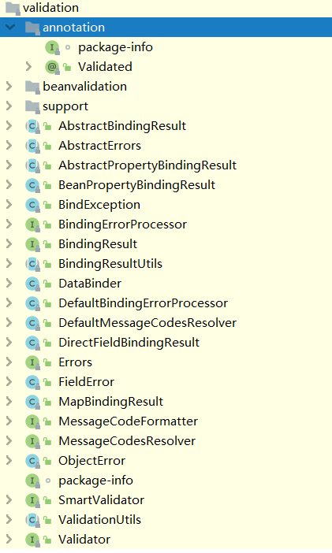

## 环境切换

### 多配置文件

我们在主配置文件编写的时候，文件名可以是 application-{profile}.properties/yml , 用来指定多个环境版本；

**例如：**

`application-test.properties`：代表测试环境配置

`application-dev.properties`：代表开发环境配置

但是Springboot并不会直接启动这些配置文件，它**默认使用application.properties主配置文件**；

我们需要通过一个配置来选择需要激活的环境：

```yaml
#比如在配置文件中指定使用dev环境，我们可以通过设置不同的端口号进行测试；
#我们启动SpringBoot，就可以看到已经切换到dev下的配置了；
spring.profiles.active=dev
```

### yaml的多文档块

和properties配置文件中一样，但是使用yml去实现不需要创建多个配置文件，更加方便了！

```yaml
server:
  port: 8081
#选择要激活那个环境块
spring:
  profiles:
    active: prod

---
server:
  port: 8083
spring:
  profiles: dev #配置环境的名称


---

server:
  port: 8084
spring:
  profiles: prod  #配置环境的名称
```

**注意：如果yml和properties同时都配置了端口，并且没有激活其他环境 ， 默认会使用properties配置文件的！**

### 配置文件加载位置

外部加载配置文件的方式十分多，我们选择最常用的即可，在开发的资源文件中进行配置！

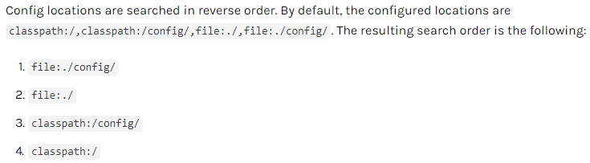

springboot启动会扫描以下位置的`application.properties`或者`application.yml`文件作为Spring boot的默认配置文件：

```
优先级1：项目路径下的config文件夹配置文件
优先级2：项目路径下配置文件
优先级3：资源路径下的config文件夹配置文件
优先级4：资源路径下配置文件
```

优先级由高到底，高优先级的配置会覆盖低优先级的配置；

**SpringBoot会从这四个位置全部加载主配置文件；互补配置；**

我们在最低级的配置文件中设置一个项目访问路径的配置来测试互补问题；

 ```properties
#配置项目的访问路径
server.servlet.context-path=/kuang
 ```

### 拓展，运维小技巧

指定位置加载配置文件

我们还可以通过`spring.config.location`来改变默认的配置文件位置

项目打包好以后，我们可以使用命令行参数的形式，启动项目的时候来指定配置文件的新位置；这种情况，一般是后期运维做的多，相同配置，外部指定的配置文件优先级最高

```bash
java -jar spring-boot-config.jar --spring.config.location=F:/application.properties
```

# 五、自动配置原理

## 例子

我们以**HttpEncodingAutoConfiguration（Http编码自动配置）**为例解释自动配置原理；

 ```java
//表示这是一个配置类，和以前编写的配置文件一样，也可以给容器中添加组件；
@Configuration 
//启动指定类的ConfigurationProperties功能；
  //进入这个HttpProperties查看，将配置文件中对应的值和HttpProperties绑定起来；
  //并把HttpProperties加入到ioc容器中
@EnableConfigurationProperties({HttpProperties.class}) 

//Spring底层@Conditional注解
  //根据不同的条件判断，如果满足指定的条件，整个配置类里面的配置就会生效；
  //这里的意思就是判断当前应用是否是web应用，如果是，当前配置类生效
@ConditionalOnWebApplication(
    type = Type.SERVLET
)

//判断当前项目有没有这个类CharacterEncodingFilter；SpringMVC中进行乱码解决的过滤器；
@ConditionalOnClass({CharacterEncodingFilter.class})

//判断配置文件中是否存在某个配置：spring.http.encoding.enabled；
  //如果不存在，判断也是成立的
  //即使我们配置文件中不配置pring.http.encoding.enabled=true，也是默认生效的；
@ConditionalOnProperty(
    prefix = "spring.http.encoding",
    value = {"enabled"},
    matchIfMissing = true
)

public class HttpEncodingAutoConfiguration {
    //他已经和SpringBoot的配置文件映射了
    private final Encoding properties;
    //只有一个有参构造器的情况下，参数的值就会从容器中拿
    public HttpEncodingAutoConfiguration(HttpProperties properties) {
        this.properties = properties.getEncoding();
    }
    
    //给容器中添加一个组件，这个组件的某些值需要从properties中获取
    @Bean
    @ConditionalOnMissingBean //判断容器没有这个组件？
    public CharacterEncodingFilter characterEncodingFilter() {
        CharacterEncodingFilter filter = new OrderedCharacterEncodingFilter();
        filter.setEncoding(this.properties.getCharset().name());
        filter.setForceRequestEncoding(this.properties.shouldForce(org.springframework.boot.autoconfigure.http.HttpProperties.Encoding.Type.REQUEST));
        filter.setForceResponseEncoding(this.properties.shouldForce(org.springframework.boot.autoconfigure.http.HttpProperties.Encoding.Type.RESPONSE));
        return filter;
    }
    //。。。。。。。
}
 ```

**一句话总结 ：根据当前不同的条件判断，决定这个配置类是否生效！**

- 一但这个配置类生效；这个配置类就会给容器中添加各种组件；
- 这些组件的属性是从对应的properties类中获取的，这些类里面的每一个属性又是和配置文件绑定的；
- 所有在配置文件中能配置的属性都是在xxxxProperties类中封装着；
- 配置文件能配置什么就可以参照某个功能对应的这个属性类

 ```java
//从配置文件中获取指定的值和bean的属性进行绑定
@ConfigurationProperties(prefix = "spring.http") 
public class HttpProperties {
    // .....
}
 ```

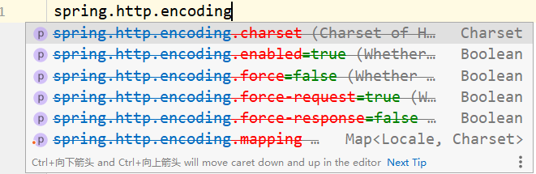

## 精髓

1、SpringBoot启动会加载大量的自动配置类

2、我们看我们需要的功能有没有在SpringBoot默认写好的自动配置类当中；

3、我们再来看这个自动配置类中到底配置了哪些组件；（只要我们要用的组件存在在其中，我们就不需要再手动配置了）

4、给容器中自动配置类添加组件的时候，会从properties类中获取某些属性。我们只需要在配置文件中指定这些属性的值即可；

`xxxxAutoConfigurartion`：自动配置类；给容器中添加组件

`xxxxProperties`：封装配置文件中相关属性；

## @Conditional

了解完自动装配的原理后，我们来关注一个细节问题，**自动配置类必须在一定的条件下才能生效；**

**@Conditional派生注解（Spring注解版原生的@Conditional作用）**

作用：必须是@Conditional指定的条件成立，才给容器中添加组件，配置配里面的所有内容才生效；

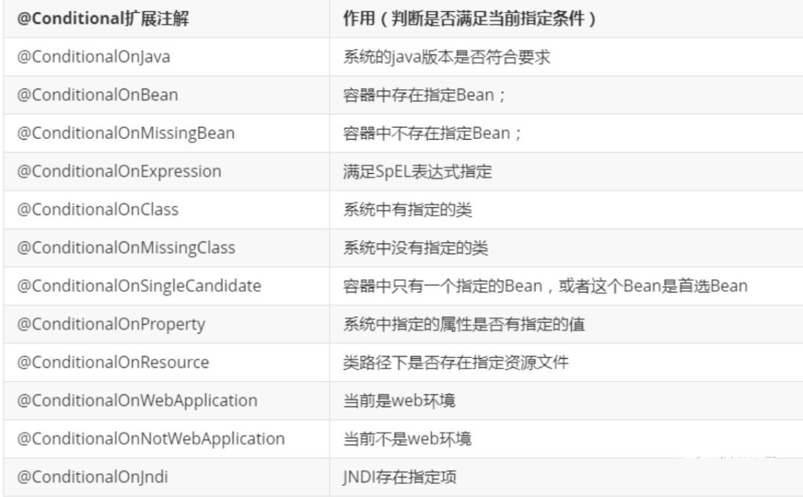

**那么多的自动配置类，必须在一定的条件下才能生效；也就是说，我们加载了这么多的配置类，但不是所有的都生效了。**

我们怎么知道哪些自动配置类生效？

**我们可以通过启用 debug=true属性；来让控制台打印自动配置报告，这样我们就可以很方便的知道哪些自动配置类生效；**

```yaml
#开启springboot的调试类
debug=true
```

**Positive matches:（自动配置类启用的：正匹配）**

**Negative matches:（没有启动，没有匹配成功的自动配置类：负匹配）**

**Unconditional classes: （没有条件的类）**

# 六、静态资源

## 静态资源处理

### 映射规则

首先，我们搭建一个普通的SpringBoot项目，回顾一下HelloWorld程序！

写请求非常简单，那我们要引入我们前端资源，我们项目中有许多的静态资源，比如css，js等文件，这个SpringBoot怎么处理呢？

如果我们是一个web应用，我们的main下会有一个webapp，我们以前都是将所有的页面导在这里面的，对吧！但是我们现在的pom呢，打包方式是为jar的方式，那么这种方式SpringBoot能不能来给我们写页面呢？当然是可以的，但是SpringBoot对于静态资源放置的位置，是有规定的！

我们先来聊聊这个静态资源映射规则：

SpringBoot中，SpringMVC的web配置都在`WebMvcAutoConfiguration`这个配置类里面；

我们可以去看看`WebMvcAutoConfigurationAdapter`中有很多配置方法；

有一个方法：`addResourceHandlers`添加资源处理

```java
@Override
public void addResourceHandlers(ResourceHandlerRegistry registry) {
    if (!this.resourceProperties.isAddMappings()) {
        // 已禁用默认资源处理
        logger.debug("Default resource handling disabled");
        return;
    }
    // 缓存控制
    Duration cachePeriod = this.resourceProperties.getCache().getPeriod();
    CacheControl cacheControl = this.resourceProperties.getCache().getCachecontrol().toHttpCacheControl();
    // webjars 配置
    if (!registry.hasMappingForPattern("/webjars/**")) {
        customizeResourceHandlerRegistration(registry.addResourceHandler("/webjars/**")
                                             .addResourceLocations("classpath:/META-INF/resources/webjars/")
                                             .setCachePeriod(getSeconds(cachePeriod)).setCacheControl(cacheControl));
    }
    // 静态资源配置
    String staticPathPattern = this.mvcProperties.getStaticPathPattern();
    if (!registry.hasMappingForPattern(staticPathPattern)) {
        customizeResourceHandlerRegistration(registry.addResourceHandler(staticPathPattern)
                                             .addResourceLocations(getResourceLocations(this.resourceProperties.getStaticLocations()))
                                             .setCachePeriod(getSeconds(cachePeriod)).setCacheControl(cacheControl));
    }
}
```

读一下源代码：比如所有的`/webjars/**`， 都需要去`classpath:/META-INF/resources/webjars/`找对应的资源；

### webjars

Webjars本质就是以jar包的方式引入我们的静态资源 ， 我们以前要导入一个静态资源文件，直接导入即可。

使用SpringBoot需要使用Webjars，我们可以去搜索一下：

网站：https://www.webjars.org 

要使用jQuery，我们只要要引入jQuery对应版本的pom依赖即可！

```xml
<dependency>
    <groupId>org.webjars</groupId>
    <artifactId>jquery</artifactId>
    <version>3.4.1</version>
</dependency>
```

访问：只要是静态资源，SpringBoot就会去对应的路径寻找资源，我们这里访问：`http://localhost:8080/webjars/jquery/3.4.1/jquery.js`

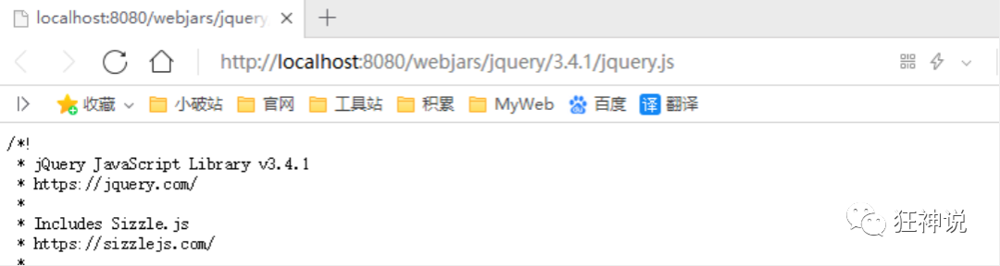

### 第二种静态资源映射规则

那我们项目中要是使用自己的静态资源该怎么导入呢？我们看下一行代码；

我们去找`staticPathPattern`发现第二种映射规则 ：`/**` , 访问当前的项目任意资源，它会去找`resourceProperties`这个类，我们可以点进去看一下分析：

```java
// 进入方法
public String[] getStaticLocations() {
    return this.staticLocations;
}
// 找到对应的值
private String[] staticLocations = CLASSPATH_RESOURCE_LOCATIONS;
// 找到路径
private static final String[] CLASSPATH_RESOURCE_LOCATIONS = { 
    "classpath:/META-INF/resources/",
  "classpath:/resources/", 
    "classpath:/static/", 
    "classpath:/public/" 
};
```

`ResourceProperties`可以设置和我们静态资源有关的参数；这里面指向了它会去寻找资源的文件夹，即上面数组的内容。

所以得出结论，以下四个目录存放的静态资源可以被我们识别：

```bash
"classpath:/META-INF/resources/"
"classpath:/resources/"
"classpath:/static/"
"classpath:/public/"
```

我们可以在resources根目录下新建对应的文件夹，都可以存放我们的静态文件；

比如我们访问`http://localhost:8080/1.js`, 他就会去这些文件夹中寻找对应的静态资源文件；

### 自定义静态资源路径

我们也可以自己通过配置文件来指定一下，哪些文件夹是需要我们放静态资源文件的，在`application.properties`中配置；

```
spring.resources.static-locations=classpath:/coding/,classpath:/long/
```

一旦自己定义了静态文件夹的路径，原来的自动配置就都会失效了！

## 首页处理

静态资源文件夹说完后，我们继续向下看源码！可以看到一个欢迎页的映射，就是我们的首页！

```java
@Bean
public WelcomePageHandlerMapping welcomePageHandlerMapping(ApplicationContext applicationContext,
                                                           FormattingConversionService mvcConversionService,
                                                           ResourceUrlProvider mvcResourceUrlProvider) {
    WelcomePageHandlerMapping welcomePageHandlerMapping = new WelcomePageHandlerMapping(
        new TemplateAvailabilityProviders(applicationContext), applicationContext, getWelcomePage(), // getWelcomePage 获得欢迎页
        this.mvcProperties.getStaticPathPattern());
    welcomePageHandlerMapping.setInterceptors(getInterceptors(mvcConversionService, mvcResourceUrlProvider));
    return welcomePageHandlerMapping;
}
```

点进去继续看

```java
private Optional<Resource> getWelcomePage() {
    String[] locations = getResourceLocations(this.resourceProperties.getStaticLocations());
    // ::是java8 中新引入的运算符
    // Class::function的时候function是属于Class的，应该是静态方法。
    // this::function的funtion是属于这个对象的。
    // 简而言之，就是一种语法糖而已，是一种简写
    return Arrays.stream(locations).map(this::getIndexHtml).filter(this::isReadable).findFirst();
}
// 欢迎页就是一个location下的的 index.html 而已
private Resource getIndexHtml(String location) {
    return this.resourceLoader.getResource(location + "index.html");
}
```

欢迎页，静态资源文件夹下的所有 index.html 页面；被 /** 映射。

比如我访问`http://localhost:8080/`，就会找静态资源文件夹下的 index.html

新建一个 index.html ，在我们上面的3个目录中任意一个；然后访问测试  http://localhost:8080/  看结果！

**关于网站图标说明**：

与其他静态资源一样，Spring Boot在配置的静态内容位置中查找 favicon.ico。如果存在这样的文件，它将自动用作应用程序的favicon。

1、关闭SpringBoot默认图标

 ```yaml
#关闭默认图标
spring.mvc.favicon.enabled=false
 ```

2、自己放一个图标在静态资源目录下，我放在 public 目录下

3、清除浏览器缓存！刷新网页，发现图标已经变成自己的了！

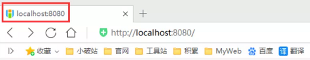

# 七、Thymeleaf

## 语法

Thymeleaf is a modern server-side Java template engine for both web and standalone environments, capable of processing HTML, XML, JavaScript, CSS and even plain text.

**现代化、服务端Java模板引擎**

### 基本语法

1.表达式

| 表达式名字 | 语法   | 用途                               |
| ---------- | ------ | ---------------------------------- |
| 变量取值   | ${...} | 获取请求域、session域、对象等值    |
| 选择变量   | *{...} | 获取上下文对象值                   |
| 消息       | #{...} | 获取国际化等值                     |
| 链接       | @{...} | 生成链接                           |
| 片段表达式 | ~{...} | jsp:include 作用，引入公共页面片段 |

2.字面量

文本值: **'one text'** **,** **'Another one!'** **,…**数字: **0** **,** **34** **,** **3.0** **,** **12.3** **,…**布尔值: **true** **,** **false**

空值: **null**

变量： one，two，.... 变量不能有空格

3.文本操作

字符串拼接: **+**

变量替换: **|The name is ${name}|** 

4.数学运算

运算符: + , - , * , / , %

5.布尔运算

运算符:  and , or

一元运算：! , not 

6.比较运算：

`>, < , >= , <= ( gt , lt , ge , le )  == , != ( eq , ne ) `

7.条件运算

If-then: **(if) ? (then)**

If-then-else: **(if) ? (then) : (else)**

Default: **(value) ?: (defaultvalue)** 

### 设置属性值-th:attr

设置单个值

```html
<form action="subscribe.html" th:attr="action=@{/subscribe}">
  <fieldset>
    <input type="text" name="email"/>
    <input type="submit" value="Subscribe!" th:attr="value=#{subscribe.submit}"/>
  </fieldset>
</form>
```

设置多个值

```html

```

以上两个的代替写法 th:xxxx

```html
<input type="submit" value="Subscribe!" th:value="#{subscribe.submit}"/>
<form action="subscribe.html" th:action="@{/subscribe}">
```

所有h5兼容的标签写法

https://www.thymeleaf.org/doc/tutorials/3.0/usingthymeleaf.html#setting-value-to-specific-attributes

### 迭代

```html
<tr th:each="prod : ${prods}">
        <td th:text="${prod.name}">Onions</td>
        <td th:text="${prod.price}">2.41</td>
        <td th:text="${prod.inStock}? #{true} : #{false}">yes</td>
</tr>
```

```html
<tr th:each="prod,iterStat : ${prods}" th:class="${iterStat.odd}? 'odd'">
  <td th:text="${prod.name}">Onions</td>
  <td th:text="${prod.price}">2.41</td>
  <td th:text="${prod.inStock}? #{true} : #{false}">yes</td>
</tr>
```

### 条件运算

```html
<a href="comments.html"
th:href="@{/product/comments(prodId=${prod.id})}"
th:if="${not #lists.isEmpty(prod.comments)}">view</a>
```

```html
<div th:switch="${user.role}">
  <p th:case="'admin'">User is an administrator</p>
  <p th:case="#{roles.manager}">User is a manager</p>
  <p th:case="*">User is some other thing</p>
</div>
```

### 属性优先级

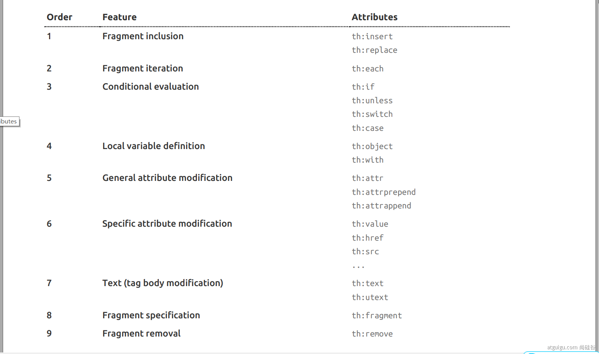

## 使用

### 引入Starter

```xml
<dependency>
    <groupId>org.springframework.boot</groupId>
    <artifactId>spring-boot-starter-thymeleaf</artifactId>
</dependency>
```

### 自动配置好了thymeleaf

`ThymeleafAutoConfiguration`类：

```java
@Configuration(
    proxyBeanMethods = false
)
@EnableConfigurationProperties({ThymeleafProperties.class})
@ConditionalOnClass({TemplateMode.class, SpringTemplateEngine.class})
@AutoConfigureAfter({WebMvcAutoConfiguration.class, WebFluxAutoConfiguration.class})
public class ThymeleafAutoConfiguration {}
```

自动配好的策略

- 1、所有thymeleaf的配置值都在`ThymeleafProperties`
- 2、配置好了`SpringTemplateEngine`
- 3、配好了 `ThymeleafViewResolver `
- 4、我们只需要直接开发页面

在`ThymeleafProperties`类中：

```java
public static final String DEFAULT_PREFIX = "classpath:/templates/";

public static final String DEFAULT_SUFFIX = ".html";  //xxx.html
```

### 页面开发

```html
<!DOCTYPE html>
<html lang="en" xmlns:th="http://www.thymeleaf.org">
<head>
    <meta charset="UTF-8">
    <title>Title</title>
</head>
<body>
<h1 th:text="${msg}">哈哈</h1>
<h2>
    <a href="www.atguigu.com" th:href="${link}">去百度</a>  <br/>
    <a href="www.atguigu.com" th:href="@{link}">去百度2</a>
</h2>
</body>
</html>
```

```java
@GetMapping("/test")
public String test(Model model){
    model.addAttribute("msg","纸上得来终觉浅，绝知此事要躬行");
    model.addAttribute("link","http://www.baidu.com");
    return "test";
}
```

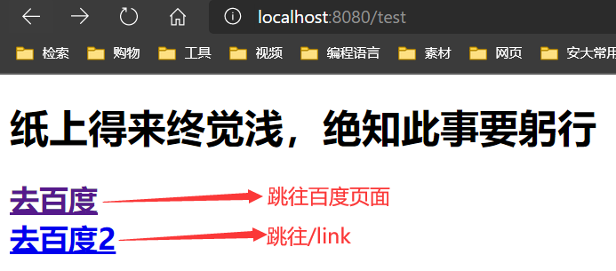

# 八、MVC自动配置原理

官方文档：https://docs.spring.io/spring-boot/docs/current/reference/html/spring-boot-features.html#boot-features-spring-mvc-auto-configuration

#### Spring MVC Auto-configuration

Spring Boot provides auto-configuration for Spring MVC that works well with most applications.

The auto-configuration adds the following features on top of Spring’s defaults:

- Inclusion of `ContentNegotiatingViewResolver` and `BeanNameViewResolver` beans.
- Support for serving static resources, including support for WebJars
- Automatic registration of `Converter`, `GenericConverter`, and `Formatter` beans.
- Support for `HttpMessageConverters`
- Automatic registration of `MessageCodesResolver`
- Static `index.html` support.
- Automatic use of a `ConfigurableWebBindingInitializer` bean

If you want to keep those Spring Boot MVC customizations and make more MVC customizations (interceptors, formatters, view controllers, and other features), you can add your own `@Configuration` class of type `WebMvcConfigurer` but **without**`@EnableWebMvc`.

# 九、整合数据库

## 整合JDBC

### 建立工程与配置

1.建立工程

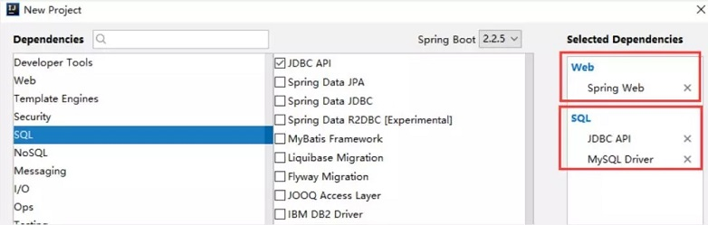

2.对应依赖

```xml
<dependencies>
    <dependency>
        <groupId>org.springframework.boot</groupId>
        <artifactId>spring-boot-starter-web</artifactId>
    </dependency>
    <dependency>
        <groupId>org.springframework.boot</groupId>
        <artifactId>spring-boot-starter-jdbc</artifactId>
    </dependency>

    <dependency>
        <groupId>mysql</groupId>
        <artifactId>mysql-connector-java</artifactId>
        <scope>runtime</scope>
    </dependency>
    <dependency>
        <groupId>org.springframework.boot</groupId>
        <artifactId>spring-boot-starter-test</artifactId>
        <scope>test</scope>
    </dependency>
</dependencies>
```

3.配置yaml文件

```yaml
spring:
  datasource:
    username: root
    password: root
    url: jdbc:mysql://localhost:3306/mybatis?useSSL=true&useUnicode=true&characterEncoding=UTF-8&default-time-zone='+8:00'
    driver-class-name: com.mysql.cj.jdbc.Driver
```

### JDBCTemplate

在Controller中引入jdbcTemplate对象，使用原生的JDBC操纵数据库

```java
@RestController
public class JDBCController {
    @Autowired
    JdbcTemplate jdbcTemplate;

    @RequestMapping("userList")
    public List<Map<String,Object>> userList(){
        String sql="select * from user";
        List<Map<String, Object>> list_maps = jdbcTemplate.queryForList(sql);
        return list_maps;
    }

    @RequestMapping("add")
    public String addUser(){
        String sql="insert into mybatis.user(id,name,pwd) values(3,'入画','lzy523024')";
        jdbcTemplate.update(sql);
        return "Add-OK";
    }

    //修改用户信息
    @GetMapping("/update/{id}")
    public String updateUser(@PathVariable("id") int id){
        //插入语句
        String sql = "update mybatis.user set name=?,pwd=? where id="+id;
        //数据
        Object[] objects = new Object[2];
        objects[0] = "Long";
        objects[1] = "24736743@sina.com";
        jdbcTemplate.update(sql,objects);
        //查询
        return "updateOk";
    }

    //删除用户
    @GetMapping("/delete/{id}")
    public String delUser(@PathVariable("id") int id){
        //插入语句
        String sql = "delete from mybatis.user where id=?";
        jdbcTemplate.update(sql,id);
        //查询
        return "deleteOk";
    }
}
```

执行后的数据库发生了修改：

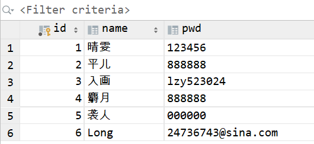

## 整合Druid

### 配置数据源

1.增加Druid数据源依赖

```xml
<!-- https://mvnrepository.com/artifact/com.alibaba/druid -->
<dependency>
    <groupId>com.alibaba</groupId>
    <artifactId>druid</artifactId>
    <version>1.2.4</version>
</dependency>
```

2.切换数据源

```yaml
spring:
  datasource:
    username: root
    password: 123456
    url: jdbc:mysql://localhost:3306/springboot?serverTimezone=UTC&useUnicode=true&characterEncoding=utf-8
    driver-class-name: com.mysql.cj.jdbc.Driver
    type: com.alibaba.druid.pool.DruidDataSource # 自定义数据源
```

3.切换成功！既然切换成功，就可以设置数据源连接初始化大小、最大连接数、等待时间、最小连接数 等设置项；可以查看源码

```yaml
spring:
  datasource:
    username: root
    password: 123456
    url: jdbc:mysql://localhost:3306/springboot?serverTimezone=UTC&useUnicode=true&characterEncoding=utf-8
    driver-class-name: com.mysql.cj.jdbc.Driver
    type: com.alibaba.druid.pool.DruidDataSource # 自定义数据源

    #Spring Boot 默认是不注入这些属性值的，需要自己绑定
    #druid 数据源专有配置
    initialSize: 5
    minIdle: 5
    maxActive: 20
    maxWait: 60000
    timeBetweenEvictionRunsMillis: 60000
    minEvictableIdleTimeMillis: 300000
    validationQuery: SELECT 1 FROM DUAL
    testWhileIdle: true
    testOnBorrow: false
    testOnReturn: false
    poolPreparedStatements: true

    #配置监控统计拦截的filters，stat:监控统计、log4j：日志记录、wall：防御sql注入
    #如果允许时报错  java.lang.ClassNotFoundException: org.apache.log4j.Priority
    #则导入 log4j 依赖即可，Maven 地址：https://mvnrepository.com/artifact/log4j/log4j
    filters: stat,wall,log4j
    maxPoolPreparedStatementPerConnectionSize: 20
    useGlobalDataSourceStat: true
    connectionProperties: druid.stat.mergeSql=true;druid.stat.slowSqlMillis=500
```

4.添加DruidDataSource组件到容器中

```java
@Configuration
public class DruidConfig {

    /*
       将自定义的 Druid数据源添加到容器中，不再让 Spring Boot 自动创建
       绑定全局配置文件中的 druid 数据源属性到 com.alibaba.druid.pool.DruidDataSource从而让它们生效
       @ConfigurationProperties(prefix = "spring.datasource")：作用就是将 全局配置文件中
       前缀为 spring.datasource的属性值注入到 com.alibaba.druid.pool.DruidDataSource 的同名参数中
     */
    @Bean
    @ConfigurationProperties(prefix = "spring.datasource")
    public DataSource dataSource(){
        return new DruidDataSource();
    }
}
```

5.去测试类中测试一下

```java
@SpringBootTest
class Boot04DataApplicationTests {

    @Autowired
    DataSource dataSource;

    @Test
    void contextLoads() throws SQLException {
        //看一下默认数据源
        System.out.println(dataSource.getClass());
        //获得连接
        Connection connection =   dataSource.getConnection();
        System.out.println(connection);

        DruidDataSource druidDataSource = (DruidDataSource) dataSource;
        System.out.println("druidDataSource 数据源最大连接数：" + druidDataSource.getMaxActive());
        System.out.println("druidDataSource 数据源初始化连接数：" + druidDataSource.getInitialSize());

        //关闭连接
        connection.close();
    }

}
```

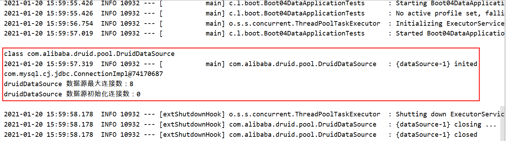

### 配置Druid数据源监控

```java
@Configuration
public class DruidConfig {

    @Bean
    @ConfigurationProperties(prefix = "spring.datasource")
    public DataSource dataSource(){
        return new DruidDataSource();
    }

    //配置 Druid 监控管理后台的Servlet；
    //内置 Servlet 容器时没有web.xml文件，所以使用 Spring Boot 的注册 Servlet 方式
    @Bean
    public ServletRegistrationBean statViewServlet() {
        ServletRegistrationBean bean = new ServletRegistrationBean(new StatViewServlet(), "/druid/*");
        // 这些参数可以在 com.alibaba.druid.support.http.StatViewServlet
        // 的父类 com.alibaba.druid.support.http.ResourceServlet 中找到
        Map<String, String> initParams = new HashMap<>();
        initParams.put("loginUsername", "admin"); //后台管理界面的登录账号
        initParams.put("loginPassword", "123456"); //后台管理界面的登录密码
        //后台允许谁可以访问
        //initParams.put("allow", "localhost")：表示只有本机可以访问
        //initParams.put("allow", "")：为空或者为null时，表示允许所有访问
        initParams.put("allow", "");
        
        //设置初始化参数
        bean.setInitParameters(initParams);
        return bean;
    }

    //配置 Druid 监控 之  web 监控的 filter
    //WebStatFilter：用于配置Web和Druid数据源之间的管理关联监控统计
    @Bean
    public FilterRegistrationBean webStatFilter() {
        FilterRegistrationBean bean = new FilterRegistrationBean();
        bean.setFilter(new WebStatFilter());
        //exclusions：设置哪些请求进行过滤排除掉，从而不进行统计
        Map<String, String> initParams = new HashMap<>();
        initParams.put("exclusions", "*.js,*.css,/druid/*,/jdbc/*");
        bean.setInitParameters(initParams);
        //"/*" 表示过滤所有请求
        bean.setUrlPatterns(Arrays.asList("/*"));
        return bean;
    }
}
```

访问：`http://localhost:8080/druid`

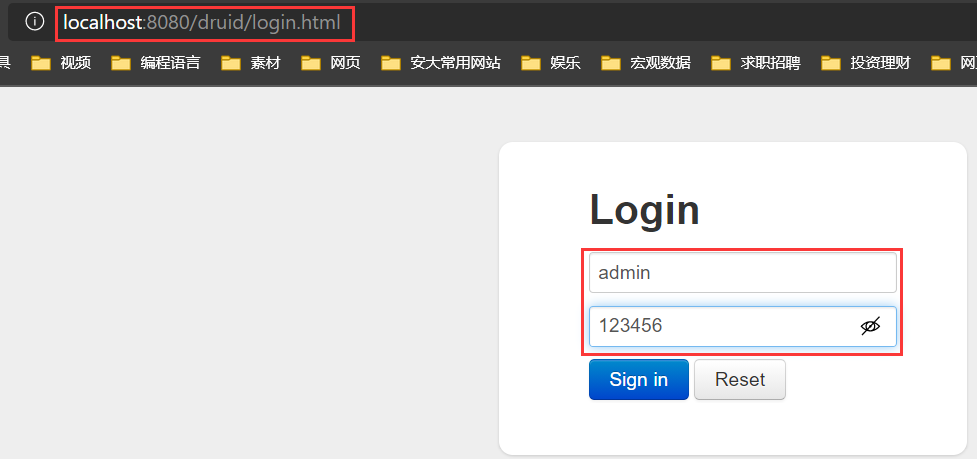

登录后进入`Druid Monitor`页面：

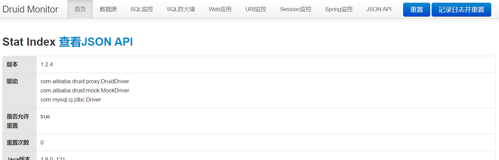

## 整合Mybatis

1.导入依赖

```xml
<dependency>
    <groupId>org.mybatis.spring.boot</groupId>
    <artifactId>mybatis-spring-boot-starter</artifactId>
    <version>2.1.4</version>
</dependency>
```

2.实体类

```java
@Data
@NoArgsConstructor
@AllArgsConstructor
public class User {
    private Integer id;
    private String name;
    private String pwd;
}
```

3.`UserMapper`接口

!> 注意：这里的`@Mapper`、`@Repository`注解缺一不可

```java
@Mapper
@Repository
public interface UserMapper {
    List<User> queryUserList();

    User queryUserById(Integer id);
}
```

4.配置`UserMapper.xml`

```xml
<?xml version="1.0" encoding="UTF-8" ?>
<!DOCTYPE mapper
        PUBLIC "-//mybatis.org//DTD Mapper 3.0//EN"
        "http://mybatis.org/dtd/mybatis-3-mapper.dtd">
<mapper namespace="com.longstudy.boot.mapper.UserMapper">
    <select id="queryUserList" resultType="User">
        select * from mybatis.user
    </select>
    <select id="queryUserById" parameterType="int" resultType="User">
        select * from mybatis.user where id=${id}
    </select>
</mapper>
```

5.Mybatis配置文件

```yaml
mybatis:
  mapper-locations: classpath:mybatis/mapper/*.xml
  type-aliases-package: com.longstudy.boot.pojo
```

6.Controller层进行展示

```java
@RestController
public class UserMapperController {
    @Autowired
    UserMapper userMapper;

    @GetMapping("/queryUserList")
    public List<User> queryUserList(){
        List<User> userList = userMapper.queryUserList();
        return userList;
    }

    @GetMapping("/queryUserById/{id}")
    public User queryUserById(@PathVariable("id")Integer id){
        User user = userMapper.queryUserById(id);
        return user;
    }
}
```

访问链接`http://localhost:8080/queryUserList`，得到如下：

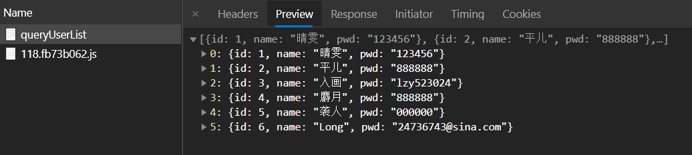

项目结构如下：

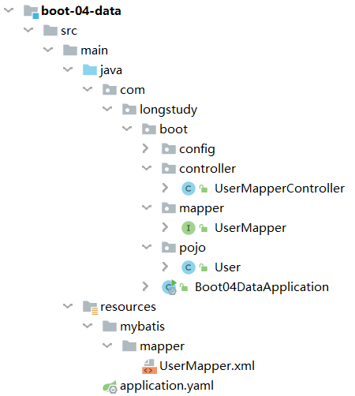

# 十、SpringSecurity

## 认识SpringSecurity

Spring Security 是针对Spring项目的安全框架，也是Spring Boot底层安全模块默认的技术选型，他可以实现强大的Web安全控制，对于安全控制，我们仅需要引入 spring-boot-starter-security 模块，进行少量的配置，即可实现强大的安全管理！

记住几个类：

- WebSecurityConfigurerAdapter：自定义Security策略
- AuthenticationManagerBuilder：自定义认证策略
- @EnableWebSecurity：开启WebSecurity模式

Spring Security的两个主要目标是 “认证” 和 “授权”（访问控制）。

**“认证”（Authentication）**

身份验证是关于验证您的凭据，如用户名/用户ID和密码，以验证您的身份。

身份验证通常通过用户名和密码完成，有时与身份验证因素结合使用。

 **“授权” （Authorization）**

授权发生在系统成功验证您的身份后，最终会授予您访问资源（如信息，文件，数据库，资金，位置，几乎任何内容）的完全权限。

这个概念是通用的，而不是只在Spring Security 中存在。

## 认证、授权、注销

1.引入Spring Security依赖

```xml
<dependency>
   <groupId>org.springframework.boot</groupId>
   <artifactId>spring-boot-starter-security</artifactId>
</dependency>
```

2.认证与授权

重写configure方法

源码中给出的使用方法，在`WebSecurityConfigurerAdapter`类中：

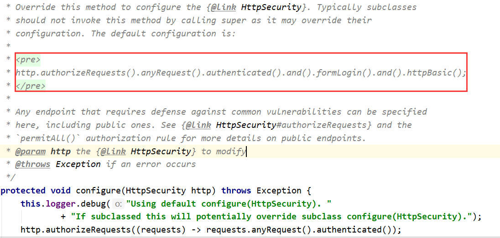

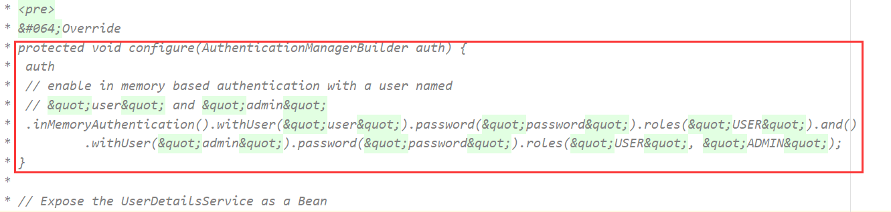

```java
@EnableWebSecurity
public class SecurityConfig extends WebSecurityConfigurerAdapter {
    //授权
    @Override
    protected void configure(HttpSecurity http) throws Exception {
        //首页所有人可以访问，功能页只有对应权限的人才能访问
        //请求授权的规则
        http.authorizeRequests()
                .antMatchers("/").permitAll()
                .antMatchers("/level1/**").hasRole("vip1")
                .antMatchers("/level2/**").hasRole("vip2")
                .antMatchers("/level3/**").hasRole("vip3");
        //没有权限会自动到登录页面，需要开启登录页面
        http.formLogin();
        http.logout().logoutSuccessUrl("/");
    }

    //认证
    //密码编码：PasswordEncoder
    @Override
    protected void configure(AuthenticationManagerBuilder auth) throws Exception {
        auth.inMemoryAuthentication().passwordEncoder(new BCryptPasswordEncoder())
                .withUser("admin")
                .password(new BCryptPasswordEncoder().encode("123456"))
                .roles("vip2","vip3")
                .and()
                .withUser("root")
                .password(new BCryptPasswordEncoder().encode("123456"))
                .roles("vip1","vip2","vip3")
                .and()
                .withUser("guest")
                .password(new BCryptPasswordEncoder().encode("666666"))
                .roles("vip1");
    }
}
```

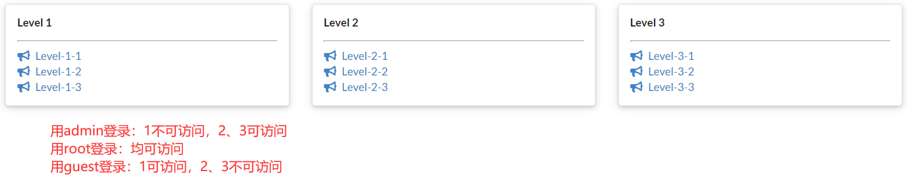

## 记住我

```java
//定制请求的授权规则
@Override
protected void configure(HttpSecurity http) throws Exception {
//。。。。。。。。。。。
   //记住我
   http.rememberMe();
}
```

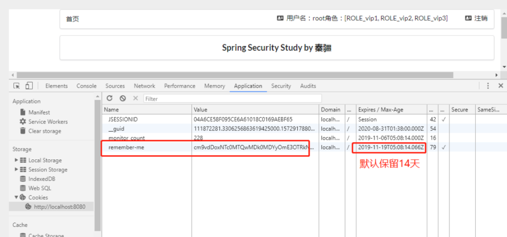

登录成功后，将cookie发送给浏览器保存，以后登录带上这个cookie，只要通过检查就可以免登录了。如果点击注销，则会删除这个cookie。

## 定制登录页

1、在刚才的登录页配置后面指定 loginpage

```java
http.formLogin().loginPage("/toLogin");
```

2、然后前端也需要指向我们自己定义的 login请求

```xml
<a class="item" th:href="@{/toLogin}">
   <i class="address card icon"></i> 登录
</a>
```

3、我们登录，需要将这些信息发送到哪里，我们也需要配置，login.html 配置提交请求及方式，方式必须为post

```xml
<form th:action="@{/login}" method="post">
   <div class="field">
       <label>Username</label>
       <div class="ui left icon input">
           <input type="text" placeholder="Username" name="username">
           <i class="user icon"></i>
       </div>
   </div>
   <div class="field">
       <label>Password</label>
       <div class="ui left icon input">
           <input type="password" name="password">
           <i class="lock icon"></i>
       </div>
   </div>
   <input type="submit" class="ui blue submit button"/>
</form>
```

4、这个请求提交上来，我们还需要验证处理，怎么做呢？我们可以查看formLogin()方法的源码！我们配置接收登录的用户名和密码的参数！

```java
http.formLogin()
  .usernameParameter("username")
  .passwordParameter("password")
  .loginPage("/toLogin")
  .loginProcessingUrl("/login"); // 登陆表单提交请求
```

5、在登录页增加记住我的多选框

```xml
<input type="checkbox" name="remember"> 记住我
```

6、后端验证处理！

```java
//定制记住我的参数！
http.rememberMe().rememberMeParameter("remember");
```

# 十一、SpringBoot集成Swagger

> Swagger官方文档：https://swagger.io/

## 配置Swagger

1.新建SpringBoot工程，导入以下依赖

Swagger版本不宜过高，否则后面的页面无法显示

```xml
<!-- https://mvnrepository.com/artifact/io.springfox/springfox-swagger2 -->
<dependency>
    <groupId>io.springfox</groupId>
    <artifactId>springfox-swagger2</artifactId>
    <version>2.9.2</version>
</dependency>
<!-- https://mvnrepository.com/artifact/io.springfox/springfox-swagger-ui -->
<dependency>
    <groupId>io.springfox</groupId>
    <artifactId>springfox-swagger-ui</artifactId>
    <version>2.9.2</version>
</dependency>
```

2.编写HelloController，测试确保运行成功！

3.要使用Swagger，我们需要编写一个配置类-SwaggerConfig来配置 Swagger

```java
@Configuration
@EnableSwagger2
public class SwaggerConfig {

}
```

4.访问测试：`http://localhost:8080/swagger-ui.html`

## 配置扫描接口

构建Docket时通过select()方法配置怎么扫描接口

```java
@Configuration
@EnableSwagger2
public class SwaggerConfig {
    //Swagger实例Bean是Docket，所以通过配置Docket实例来配置Swaggger。
    @Bean
    public Docket docket() {
        return new Docket(DocumentationType.SWAGGER_2)
                .apiInfo(myInfo())
                // 通过.select()方法，去配置扫描接口,RequestHandlerSelectors配置如何扫描接口
                .select()
                /**
                 * RequestHandlerSelectors：配置要扫描的接口方式
                 * basePackage：配置要扫描的包
                 * any()：扫描全部
                 * none()：不扫描
                 * withClassAnnotation：扫描类上的注解，参数是一个注解的反射对象
                 * withMethodAnnotation：扫描方法上的注解
                 * paths()：过滤什么路径
                 */
                .apis(RequestHandlerSelectors.basePackage("com.longstudy.boot.controller"))
                .build();
    }

    //配置文档信息
    private ApiInfo myInfo() {
        //作者信息
        Contact contact = new Contact("JonnyLong", "https://jonnylong.gitee.io", "sylzy66sina@163.com");
        return new ApiInfo(
                "Swagger API文档", // 标题
                "纸上得来终觉浅，绝知此事要躬行", // 描述
                "v1.2", // 版本
                "https://jonnylong.gitee.io", // 组织链接
                contact, // 联系人信息
                "Apache 2.0", // 许可
                "http://www.apache.org/licenses/LICENSE-2.0", // 许可连接
                new ArrayList()// 扩展
        );
    }
}

```

可选值还有：

```java
any() // 任何请求都扫描
none() // 任何请求都不扫描
regex(final String pathRegex) // 通过正则表达式控制
ant(final String antPattern) // 通过ant()控制
```

## Swagger分组

```java
@Configuration
@EnableSwagger2
public class SwaggerConfig {
    @Bean
    public Docket docket1(){
        return new Docket(DocumentationType.SWAGGER_2).groupName("Group 1").apiInfo(myInfo());
    }
    @Bean
    public Docket docket2(){
        return new Docket(DocumentationType.SWAGGER_2).groupName("Group 2");
    }
    @Bean
    public Docket docket3(){
        return new Docket(DocumentationType.SWAGGER_2).groupName("Group 3");
    }

    //配置文档信息
    private ApiInfo myInfo() {
        //作者信息
        Contact contact = new Contact("JonnyLong", "https://jonnylong.gitee.io", "sylzy66sina@163.com");
        return new ApiInfo(
                "Swagger API文档", // 标题
                "纸上得来终觉浅，绝知此事要躬行", // 描述
                "v1.2", // 版本
                "https://jonnylong.gitee.io", // 组织链接
                contact, // 联系人信息
                "Apache 2.0", // 许可
                "http://www.apache.org/licenses/LICENSE-2.0", // 许可连接
                new ArrayList()// 扩展
        );
    }
}

```

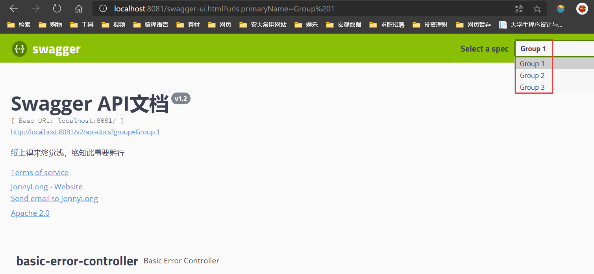

## 实体配置

1.新建实体类

```java
@ApiModel("用户实体类")
public class User {
    @ApiModelProperty("用户名")
    private String username;
    @ApiModelProperty("密码")
    private String password;
    @ApiModelProperty("性别")
    private Integer gender;
}
```

2.新建接口

```java
@GetMapping("/getUser")
public User getUser(){
    return new User();
}
```

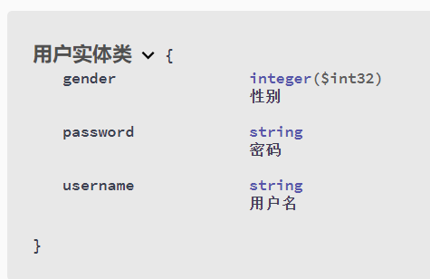

## 常用注解

| Swagger注解                                              | 简单说明                                             |
| -------------------------------------------------------- | ---------------------------------------------------- |
| `@Api(tags = "xxx模块说明")`                             | 作用在模块类上                                       |
| `@ApiOperation("xxx接口说明")`                           | 作用在接口方法上                                     |
| `@ApiModel("xxxPOJO说明")`                               | 作用在模型类上：如VO、BO                             |
| `@ApiModelProperty(value = "xxx属性说明",hidden = true)` | 作用在类方法和属性上，hidden设置为true可以隐藏该属性 |
| `@ApiParam("xxx参数说明")`                               | 作用在参数、方法和字段上，类似`@ApiModelProperty`    |

Swagger是个优秀的工具，现在国内已经有很多的中小型互联网公司都在使用它，相较于传统的要先出Word接口文档再测试的方式，显然这样也更符合现在的快速迭代开发行情。当然了，提醒下大家在正式环境要记得关闭Swagger，一来出于安全考虑二来也可以节省运行时内存。