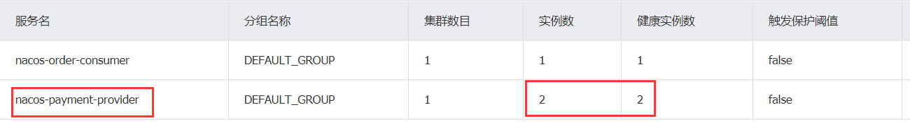

# 一、SpringCloud Alibaba

SpringCloud Alibaba文档：https://spring-cloud-alibaba-group.github.io/github-pages/hoxton/en-us/index.html

github：https://github.com/alibaba/spring-cloud-alibaba

```xml
<dependencyManagement>
    <dependencies>
        <dependency>
            <groupId>com.alibaba.cloud</groupId>
            <artifactId>spring-cloud-alibaba-dependencies</artifactId>
            <version>2.2.4.RELEASE</version>
            <type>pom</type>
            <scope>import</scope>
        </dependency>
    </dependencies>
</dependencyManagement>
```

# 二、Nacos

## 简介

Nacos：Dynamic Naming and Configuration Service

Nacos=注册中心+配置中心=Eureka+Config+Bus

单机启动Nacos：`startup.cmd -m standalone`

访问http://localhost:8848/nacos/

Nacos支持AP和CP模式的切换：
一般来说，如果不需要存储服务级别的信息且服务实例是通过nacos-client注册，并能够保持心跳上报，那么就可以选择AP模式。当前主流的服务如 Spring cloud 和Dubo服务，都五用于AP模式，AP模式为了服务的可能性而减弱了一致性，因此AP模式下只支持注册临时实例。

如果需要在服务级别编辑或者存储配置信息，那么CP是必须，K8S服务和DNS服务则适用于CP模式。CP模式下则支持注册持久化实例，此时则是以Raft协议为集群运行模式，该模式下注册实例之前必须先注册服务，如果服务不存在，则会返回错误。

```bash
curl -X PUT '$NACOS_SERVER:8848/nacos/v1/ns/operator/switches?entry=serverMode&value=CP'
```

## Nacos作服务注册中心

### 服务提供者注册

1.新建两个Moudle，`cloudalibaba-provider-payment9001`和`cloudalibaba-provider-payment9002`

2.依赖

```xml
<dependencies>
    <dependency>
        <groupId>com.alibaba.cloud</groupId>
        <artifactId>spring-cloud-starter-alibaba-nacos-discovery</artifactId>
    </dependency>
    <dependency>
        <groupId>org.springframework.boot</groupId>
        <artifactId>spring-boot-starter-web</artifactId>
    </dependency>
    <dependency>
        <groupId>org.springframework.boot</groupId>
        <artifactId>spring-boot-starter-actuator</artifactId>
    </dependency>
</dependencies>
```

3.Yaml文件

```yaml
server:
  port: 9001

spring:
  application:
    name: provider-payment9001
  cloud:
    nacos:
      discovery:
        server-addr: localhost:8848
management:
  endpoints:
    web:
      exposure:
        include: "*"

```

4.主启动类

```java
@EnableDiscoveryClient
@SpringBootApplication
public class AlibabaPaymentMain9001 {
    public static void main(String[] args) {
        SpringApplication.run(AlibabaPaymentMain9001.class,args);
    }
}
```

5.nacos查看结果


### 服务消费者注册

1.新建`cloudalibaba-consumer-nacos-order93`

2.配置Yaml

```yaml
server:
  port: 83

spring:
  application:
    name: nacos-order-consumer
  cloud:
    nacos:
      discovery:
        server-addr: localhost:8848

#消费者将要去访问的微服务名称(注册成功进nacos的微服务提供者)，可以不配置
service-url:
  nacos-user-service: http://nacos-payment-provider
```

3.配置类，加入负载均衡。注意`@LoadBalanced`

```java
@Configuration
public class ApplicationContextConfig {
    @Bean
    @LoadBalanced
    public RestTemplate getRestTemplate(){
        return new RestTemplate();
    }
}
```

4.Controller层

```java
@RestController
public class OrderNacosController {
    @Value("${service-url.nacos-user-service}")
    private String serverURL;
    @Resource
    private RestTemplate restTemplate;

    @GetMapping("/consumer/payment/nacos/{id}")
    public String paymentInfo(@PathVariable("id")Integer id){
        return restTemplate.getForObject(serverURL+"/payment/nacos/"+id,String.class);
    }
}
```

5.访问测试`http://localhost:83/consumer/payment/nacos/13`




## Nacos作服务配置中心

### 基础配置

只要使用nacos就把下面恋歌依赖同时导入，方便使用

```xml
<!--nacos-config-->
<dependency>
    <groupId>com.alibaba.cloud</groupId>
    <artifactId>spring-cloud-starter-alibaba-nacos-config</artifactId>
</dependency>
<!--nacos-discovery-->
<dependency>
    <groupId>com.alibaba.cloud</groupId>
    <artifactId>spring-cloud-starter-alibaba-nacos-discovery</artifactId>
</dependency>
```

在 Nacos Spring Cloud 中，`dataId` 的完整格式如下：

```plain
${prefix}-${spring.profiles.active}.${file-extension}
```

- `prefix` 默认为 `spring.application.name` 的值，也可以通过配置项 `spring.cloud.nacos.config.prefix`来配置。
- `spring.profiles.active` 即为当前环境对应的 profile，详情可以参考 [Spring Boot文档](https://docs.spring.io/spring-boot/docs/current/reference/html/boot-features-profiles.html#boot-features-profiles)。 **注意：当 `spring.profiles.active` 为空时，对应的连接符 `-` 也将不存在，dataId 的拼接格式变成 `${prefix}.${file-extension}`**
- `file-exetension` 为配置内容的数据格式，可以通过配置项 `spring.cloud.nacos.config.file-extension` 来配置。目前只支持 `properties` 和 `yaml` 类型。

1.新建Moudle，`cloudalbaba-config-nacos-client3377`

2.配置两个Yaml文件

`bootstrap.yaml`：

```yaml
server:
  port: 3377

spring:
  application:
    name: nacos-config-client
  cloud:
    nacos:
      discovery:
        server-addr: localhost:8848
      config:
        server-addr: localhost:8848
        file-extension: yaml #指定yaml格式的配置

# ${spring.application.name}-${spring.profile.active}.${ spring.cLoud.nacos.config.file-extension}
# nacos-config-client-dev.yaml
```

`application.yaml`：

```yaml
spring:
  profiles:
    active: dev #开发环境
```

得到的DataId如下：


3.在nacos中配置并保存


4.Controller层，注意`@RefreshScope`注解不能掉

```java
@RestController
//支持naocs动态刷新功能
@RefreshScope
public class ConfigClientController {
    @Value("${config.info}")
    private String configInfo;

    @GetMapping("/config/info")
    public String getConfigInfo(){
        return configInfo;
    }
}
```

5.访问`http://localhost:3377/config/info`得到配置结果


### 分类配置

Namespace+Group+Data ID三者关系：

类似Java里面的package名和类名。最外层的namespace是可以用于区分部署环境的，Group和DataID逻辑上区分两个目标对象。


默认情况：Namespace=public，Group=DEFAULT_GROUP，默认Cluster是DEFAULT

Nacos默认的命名空间是public，Namespace主要用来实现隔离。比方说我们现在有三个环境：开发、测试、生产环境，我们就可以创建三个Namespace，不同的Namespace之间是隔离的。

Group默认是DEFAULT_GROUP，Group可以把不同的微服务划分到同一个分组里面去。

Sevice就是微服务；一个Service可以包含多个Cluster (集群)，Nacos默认Cluster是DEFAULT，Cluster是对指定微服务的一个虚拟划分。比方说为了容灾，将Service微服务分别部署在了杭州机房和广州机房，这时就可以给杭州机房的Service微服务起一个集群名称(HZ) ，给广州机房的Service微服务起一个集群名称(GZ)，还可以尽量让同一个机房的微服务互相调用，以提升性能。

最后是Instance，就是微服务的实例。


## Nacos集群和持久化配置

### 基本说明


默认Nacos使用嵌入式数据库实现数据的存储。所以，如果启动多个默认配置下的Nacos节点，数据存储是存在一致性问题的，为了解决这个问题，**Nacos采用了集中式存储的方式来支持集群化部署，目前只支持MySQL的存储。**

### 持久化配置

切换derby到mysql配置步骤：

1.`nacos-server-1.1;4\nacos\conf`录下找到sql脚本：`nacos-mysql.sql`

2.修改conf/application.properties文件，增加支持mysql数据源配置（目前只支持mysql），添加mysql数据源的url、用户名和密码。

```properties
spring.datasource.platform=mysql

db.num=1
db.url.0=jdbc:mysql://127.0.0.1:3306/nacos_devtest?characterEncoding=utf8&connectTimeout=1000&socketTimeout=3000&autoReconnect=true&default-time-zone='+8:00'
db.user=root
db.password=root
```

## Linux版Nacos+Mysql

> 这里没有环境，暂且跳过

# 三、Sentinel

## Sentinel 是什么？

随着微服务的流行，服务和服务之间的稳定性变得越来越重要。Sentinel 以流量为切入点，从流量控制、熔断降级、系统负载保护等多个维度保护服务的稳定性。

Sentinel 具有以下特征:

- **丰富的应用场景**：Sentinel 承接了阿里巴巴近 10 年的双十一大促流量的核心场景，例如秒杀（即突发流量控制在系统容量可以承受的范围）、消息削峰填谷、集群流量控制、实时熔断下游不可用应用等。
- **完备的实时监控**：Sentinel 同时提供实时的监控功能。您可以在控制台中看到接入应用的单台机器秒级数据，甚至 500 台以下规模的集群的汇总运行情况。
- **广泛的开源生态**：Sentinel 提供开箱即用的与其它开源框架/库的整合模块，例如与 Spring Cloud、Dubbo、gRPC 的整合。您只需要引入相应的依赖并进行简单的配置即可快速地接入 Sentinel。
- **完善的 SPI 扩展点**：Sentinel 提供简单易用、完善的 SPI 扩展接口。您可以通过实现扩展接口来快速地定制逻辑。例如定制规则管理、适配动态数据源等。

Sentinel 的主要特性：


Sentinel 分为两个部分:

- 核心库（Java 客户端）不依赖任何框架/库，能够运行于所有 Java 运行时环境，同时对 Dubbo / Spring Cloud 等框架也有较好的支持。
- 控制台（Dashboard）基于 Spring Boot 开发，打包后可以直接运行，不需要额外的 Tomcat 等应用容器。

## 初始化工程

1.新建`cloudalibaba-sentinel-service8401`

```xml
<dependencies>
    <!--sentinel-->
    <dependency>
        <groupId>com.alibaba.cloud</groupId>
        <artifactId>spring-cloud-starter-alibaba-sentinel</artifactId>
    </dependency>
    <!--sentinel-datasource-nacos-->
    <dependency>
        <groupId>com.alibaba.csp</groupId>
        <artifactId>sentinel-datasource-nacos</artifactId>
    </dependency>
    <!--nacos-config-->
    <dependency>
        <groupId>com.alibaba.cloud</groupId>
        <artifactId>spring-cloud-starter-alibaba-nacos-config</artifactId>
    </dependency>
    <!--nacos-discovery-->
    <dependency>
        <groupId>com.alibaba.cloud</groupId>
        <artifactId>spring-cloud-starter-alibaba-nacos-discovery</artifactId>
    </dependency>
    <dependency>
        <groupId>org.springframework.boot</groupId>
        <artifactId>spring-boot-starter-web</artifactId>
    </dependency>
    <dependency>
        <groupId>org.springframework.boot</groupId>
        <artifactId>spring-boot-starter-actuator</artifactId>
    </dependency>
    <dependency>
        <groupId>org.projectlombok</groupId>
        <artifactId>lombok</artifactId>
        <optional>true</optional>
    </dependency>
</dependencies>
```

2.配置Yaml

```yaml
server:
  port: 8401

spring:
  application:
    name: cloudalibaba-sentinel-service
  cloud:
    nacos:
      discovery:
        #nacos服务注册中心地址
        server-addr: localhost:8848
    sentinel:
      transport:
        #默认sentinel dashboard地址
        dashboard: localhost:8080
        #默认8919端口，如果被占用自动从8719开始依次+1扫描，知道找到未被找到的端口
        port: 8719

management:
  endpoints:
    web:
      exposure:
        include: "*"
```

3.主启动类和Controller

```java
@EnableDiscoveryClient
@SpringBootApplication
public class MainApp8401 {
    public static void main(String[] args) {
        SpringApplication.run(MainApp8401.class,args);
    }
}
```

```java
@RestController
public class FlowLimitController {
    @GetMapping("/testA")
    public String testA(){
        return "testA";
    }

    @GetMapping("/testB")
    public String testB(){
        return "testB";
    }
}
```

4.由于sentinel是懒加载机制，直接查看不会显示，需要访问下`http://localhost:8402/testB`后再次刷新才会显示


## 流控规则

### 说明

- 资源名：唯一名称，默认请求路径
- 针对来源：Sentinel可以针对调用者进行限流，填写微服务名，默认default(不区分来源)
- 阈值类型/单机阈值：
  - QPS(每秒钟的请求数量)∶当调用该api的QPS达到阈值的时候，进行限流。
  - 线程数:当调用该api的线程数达到阈值的时候，进行限流
- 是否集群：不需要集群
- 流控模式：
  - 直接：api达到限流条件时，直接限流
  - 关联：当关联的资源达到阈值时，就限流自己
  - 链路：只记录指定链路上的流量（指定资源从入口资源进来的流量，如果达到阈值，就进行限流)【api级别的针对来源】
- 流控效果：
  - 快速失败：直接失败，抛出异常
  - Warm Up：根据codeFactor（冷加载因子，默认3）的值，从阈值/codeFactor，经过预热时长，才达到设置的QPS阈值
  - 排队等待：匀速排队，让请求以匀速通过，阈值类型必须设置为QPS，否则无效

### 流控模式

1.表示1秒钟内查询1次就是OK，若超过次数1，就直接-快速失败，报默认错误


2.当关联资源/testB的qps阀值超过1时，就限流/testA的Rest访问地址，当关联资源到阈值后限制配置好的资源名


### 流控效果

1.Warm Up

Warm Up（`RuleConstant.CONTROL_BEHAVIOR_WARM_UP`）方式，即预热/冷启动方式。当系统长期处于低水位的情况下，当流量突然增加时，直接把系统拉升到高水位可能瞬间把系统压垮。通过"冷启动"，让通过的流量缓慢增加，在一定时间内逐渐增加到阈值上限，给冷系统一个预热的时间，避免冷系统被压垮。

`阈值/coldFactor(默认值为3)`，经过预热时长后才会达到阈值


系统初始化的阀值为10/3约等于3，即阀值刚开始为3；然后过了5秒后阀值才慢慢升高恢复到10。


2.匀速排队

设置含义：/testA每秒1次请求，超过的话就排队等待，等待的超时时间为20000毫秒。


## 降级规则

- 慢调用比例 (`SLOW_REQUEST_RATIO`)：选择以慢调用比例作为阈值，需要设置允许的慢调用 RT（即最大的响应时间），请求的响应时间大于该值则统计为慢调用。当单位统计时长（`statIntervalMs`）内请求数目大于设置的最小请求数目，并且慢调用的比例大于阈值，则接下来的熔断时长内请求会自动被熔断。经过熔断时长后熔断器会进入探测恢复状态（HALF-OPEN 状态），若接下来的一个请求响应时间小于设置的慢调用 RT 则结束熔断，若大于设置的慢调用 RT 则会再次被熔断。
- 异常比例 (`ERROR_RATIO`)：当单位统计时长（`statIntervalMs`）内请求数目大于设置的最小请求数目，并且异常的比例大于阈值，则接下来的熔断时长内请求会自动被熔断。经过熔断时长后熔断器会进入探测恢复状态（HALF-OPEN 状态），若接下来的一个请求成功完成（没有错误）则结束熔断，否则会再次被熔断。异常比率的阈值范围是 `[0.0, 1.0]`，代表 0% - 100%。
- 异常数 (`ERROR_COUNT`)：当单位统计时长内的异常数目超过阈值之后会自动进行熔断。经过熔断时长后熔断器会进入探测恢复状态（HALF-OPEN 状态），若接下来的一个请求成功完成（没有错误）则结束熔断，否则会再次被熔断。

## 热点Key限流

