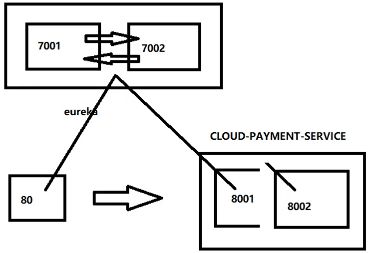
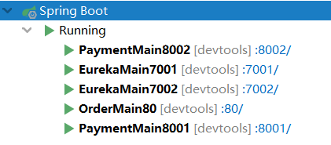
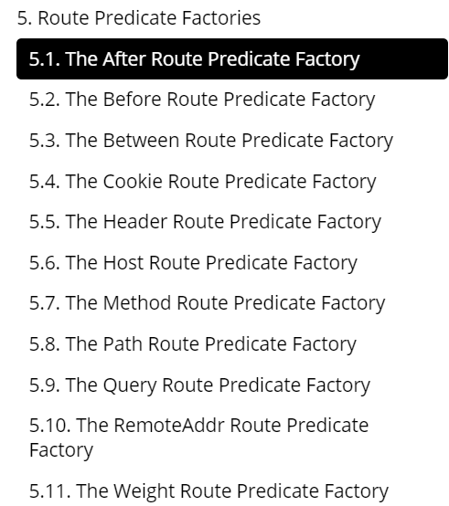
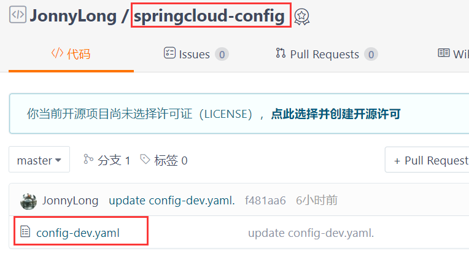

# 一、SpringCloud基本说明

## 工程版本确定

程序员工具：https://tool.lu/

查看不同版本的SpringCloud对应的SpringBoot：https://start.spring.io/actuator/info

SpringCould Hoxton.SR9：https://docs.spring.io/spring-cloud/docs/Hoxton.SR9/reference/html/


## SpringCloud组件停更说明


# 二、微服务架构编码构建

## 父工程

处理字符编码：


注解支持：


配置pom.xml文件：

```xml
<?xml version="1.0" encoding="UTF-8"?>

<project xmlns="http://maven.apache.org/POM/4.0.0" xmlns:xsi="http://www.w3.org/2001/XMLSchema-instance"
         xsi:schemaLocation="http://maven.apache.org/POM/4.0.0 http://maven.apache.org/xsd/maven-4.0.0.xsd">
    <modelVersion>4.0.0</modelVersion>

    <groupId>com.longstudy.springcloud</groupId>
    <artifactId>cloud2021</artifactId>
    <version>1.0-SNAPSHOT</version>
    <modules>
        <module>cloud-provider-payment8001</module>
    </modules>
    <packaging>pom</packaging>
    <!--统一管理jar包版本-->
    <properties>
        <project.build.sourceEncoding>UTF-8</project.build.sourceEncoding>
        <maven.compiler.source>12</maven.compiler.source>
        <maven.compiler.target>12</maven.compiler.target>
        <junit.version>4.12</junit.version>
        <lombok.version>1.18.10</lombok.version>
        <log4j.version>1.2.17</log4j.version>
        <mysql.version>8.0.18</mysql.version>
        <druid.version>1.1.16</druid.version>
        <mybatis.spring.boot.version>2.1.1</mybatis.spring.boot.version>
    </properties>

    <dependencyManagement>
        <dependencies>
            <dependency>
                <groupId>org.springframework.boot</groupId>
                <artifactId>spring-boot-dependencies</artifactId>
                <version>2.3.5.RELEASE</version>
                <type>pom</type>
                <scope>import</scope>
            </dependency>
            <dependency>
                <groupId>org.springframework.cloud</groupId>
                <artifactId>spring-cloud-dependencies</artifactId>
                <version>Hoxton.SR9</version>
                <type>pom</type>
                <scope>import</scope>
            </dependency>


            <!--mysql-->
            <dependency>
                <groupId>mysql</groupId>
                <artifactId>mysql-connector-java</artifactId>
                <version>${mysql.version}</version>
                <scope>runtime</scope>
            </dependency>
            <!-- druid-->
            <dependency>
                <groupId>com.alibaba</groupId>
                <artifactId>druid</artifactId>
                <version>${druid.version}</version>
            </dependency>
            <!--mybatis-->
            <dependency>
                <groupId>org.mybatis.spring.boot</groupId>
                <artifactId>mybatis-spring-boot-starter</artifactId>
                <version>${mybatis.spring.boot.version}</version>
            </dependency>
            <!--junit-->
            <dependency>
                <groupId>junit</groupId>
                <artifactId>junit</artifactId>
                <version>${junit.version}</version>
            </dependency>
            <!--log4j-->
            <dependency>
                <groupId>log4j</groupId>
                <artifactId>log4j</artifactId>
                <version>${log4j.version}</version>
            </dependency>
        </dependencies>
    </dependencyManagement>

    <build>
        <plugins>
            <plugin>
                <groupId>org.springframework.boot</groupId>
                <artifactId>spring-boot-maven-plugin</artifactId>
                <configuration>
                    <fork>true</fork>
                    <addResources>true</addResources>
                </configuration>
            </plugin>
        </plugins>
    </build>

</project>
```

## 支付模块

1.创建子Moudle，命名为`cloud-provider-payment8001`

```xml
<dependencies>
    <dependency>
        <groupId>org.springframework.boot</groupId>
        <artifactId>spring-boot-starter-web</artifactId>
    </dependency>
    <dependency>
        <groupId>org.springframework.boot</groupId>
        <artifactId>spring-boot-starter-actuator</artifactId>
    </dependency>
    <dependency>
        <groupId>org.mybatis.spring.boot</groupId>
        <artifactId>mybatis-spring-boot-starter</artifactId>
    </dependency>
    <dependency>
        <groupId>com.alibaba</groupId>
        <artifactId>druid-spring-boot-starter</artifactId>
        <version>1.1.10</version>
    </dependency>
    <!--mysql-connector-java-->
    <dependency>
        <groupId>mysql</groupId>
        <artifactId>mysql-connector-java</artifactId>
    </dependency>
    <!--jdbc-->
    <dependency>
        <groupId>org.springframework.boot</groupId>
        <artifactId>spring-boot-starter-jdbc</artifactId>
    </dependency>
    <dependency>
        <groupId>org.springframework.boot</groupId>
        <artifactId>spring-boot-devtools</artifactId>
        <scope>runtime</scope>
        <optional>true</optional>
    </dependency>
    <dependency>
        <groupId>org.projectlombok</groupId>
        <artifactId>lombok</artifactId>
        <optional>true</optional>
    </dependency>
    <dependency>
        <groupId>org.springframework.boot</groupId>
        <artifactId>spring-boot-starter-test</artifactId>
        <scope>test</scope>
    </dependency>
</dependencies>
```

2.配置Yaml文件

```yaml
server:
  port: 8001

spring:
  application:
    name: cloud-payment-service
  datasource:
    type: com.alibaba.druid.pool.DruidDataSource
    driver-class-name: com.mysql.cj.jdbc.Driver
    url: jdbc:mysql://localhost:3306/db2021?useSSL=true&useUnicode=true&characterEncoding=UTF-8&default-time-zone='+8:00'
    username: root
    password: root

mybatis:
  mapper-locations: classpath:mapper/*.xml
  type-aliases-package: com.longstudy.springcloud.pojo
```

3.构建项目结构

具体类的内容这里略写，按顺序依次写如下：

+ pojo包下的实体类
+ dao接口--->mapper.xml文件
+ service层
  + service接口
  + serviceImpl
+ controller层


## Devtools

1.添加依赖和插件

```xml
<dependency>
    <groupId>org.springframework.boot</groupId>
    <artifactId>spring-boot-devtools</artifactId>
    <scope>runtime</scope>
    <optional>true</optional>
</dependency>
```

```xml
    <build>
        <plugins>
            <plugin>
                <groupId>org.springframework.boot</groupId>
                <artifactId>spring-boot-maven-plugin</artifactId>
                <configuration>
                    <fork>true</fork>
                    <addResources>true</addResources>
                </configuration>
            </plugin>
        </plugins>
    </build>
```

3.IDEA设置


4.在IDEA中按下`Ctrl+shift+alt+/`，进入Registry中对下面两项打勾

- `compiler.automake.allow.when.app.running`
- `actionSystem.assertFocusAccessFromEdt`

## 消费者订单模块

目录结构如下：


其中`ApplicationContextConfig`配置了`RestTemplate`

```java
@Configuration
public class ApplicationContextConfig {
    @Bean
    public RestTemplate getRestTemplate(){
        return new RestTemplate();
    }
}
```

`OrderController`：

```java
@RestController
@Slf4j
public class OrderController {
    public static final String PAYMENT_URL="http://localhost:8001";
    @Resource
    private RestTemplate restTemplate;

    @PostMapping("/consumer/payment/create")
    public CommonResult<Payment> create(Payment payment){
        System.out.println(payment);
        return restTemplate.postForObject(PAYMENT_URL+"/payment/create",payment,CommonResult.class);
    }

    @GetMapping("/consumer/payment/get/{id}")
    public CommonResult<Payment> getPayment(@PathVariable("id")Long id){
        return restTemplate.getForObject(PAYMENT_URL+"/payment/get/"+id,CommonResult.class);
    }
}
```

## 工程重构

```xml
<dependencies>
    <dependency>
        <groupId>org.springframework.boot</groupId>
        <artifactId>spring-boot-devtools</artifactId>
        <scope>runtime</scope>
        <optional>true</optional>
    </dependency>
    <dependency>
        <groupId>org.projectlombok</groupId>
        <artifactId>lombok</artifactId>
        <optional>true</optional>
    </dependency>
    <dependency>
        <groupId>cn.hutool</groupId>
        <artifactId>hutool-all</artifactId>
        <version>5.1.0</version>
    </dependency>
</dependencies>
```

2.将实体类单独提出出来，删除支付模块和消费者订单模块中的pojo


3.在支付模块和消费者订单模块引入该模块

```xml
<dependency>
    <groupId>com.longstudy.springcloud</groupId>
    <artifactId>cloud-api-commons</artifactId>
    <!--1.0-SNAPSHOT-->
    <version>${project.version}</version>
</dependency>
```

# 三、Eureka

## Eureka基础知识

当服务很多时，单靠代码手动管理是很麻烦的，需要一个公共组件，统一管理多服务，包括服务是否正常运行，等Eureka用于**服务注册**，目前官网**已经停止更新**。

服务治理：

Spring Cloud封装了Netflix公司开发的Eureka模块来实现服务治理。在传统的rpc远程调用框架中，管理每个服务与服务之间依赖关系比较复杂，管理比较复杂，所以需要使用服务治理，管理服务于服务之间依赖关系，可以实现服务调用、负载均衡、容错等，实现服务发现与注册。

服务注册与发现：

Eureka采用了CS的设计架构，Eureka Server作为服务注册功能的服务器，它是服务注册中心。而系统中的其他微服务，使用Eureka的客户端连接到EFureka Seve并维持心跳连接。这样系统的维护人员就可以通过Eureka Server 来监控系统中各个微服务是否正常运行。在服务注册与发现中，有一个注册中心。当服务器启动的时候，会把当前自己服务器的信息比如服务地址通讯地址等以别名方式注册到注册中心上。另一方(消费者服务提供者)，以该别名的方式去注册中心上获取到实际的服务通讯地址，然后再实现本地RPC调用RPC远程调用框架核心设计思想:在于注册中心，因为使用注册中心管理每个服务与服务之间的一个依赖关系(服务治理概念)。在任何rpc远程框架中，都会有一个注册中心(存放服务地址相关信息(接口地址))


Eureka包含两个组件：**Eureka Server和Eureka Client**

Eureka Server提供服务注册服务。各个微服务节点通过配置启动后，会在EurekaServer中进行注册，这样EurekaServer中的服务注册表中将会存储所有可用服务节点的信息，服务节点的信息可以在界面中直观看到。

EurekaClient通过注册中心访问。是一个Java客户端，用于简化Eureka Server的交互，客户端同时也具备一个内置的、使用轮询(round-robin)负载算法的负载均衡器。在应用启动后，将会向Eureka Server发送心跳(默认周期为30秒)。如果Eureka Server在多个心跳周期内没有接收到某个节点的心跳，EurekaServer将会从服务注册表中把这个服务节点移除（默认90秒)

## 单机Eureka构建步骤

1.新建Moudle


2.Eureka依赖

```xml
<!--server端-->
<dependency>
    <groupId>org.springframework.cloud</groupId>
    <artifactId>spring-cloud-starter-netflix-eureka-server</artifactId>
</dependency>
<!--client端-->
<dependency>
    <groupId>org.springframework.cloud</groupId>
    <artifactId>spring-cloud-starter-netflix-eureka-client</artifactId>
</dependency>
```

3.`cloud-eureka-server7001`中的`application.yaml`

```yaml
server:
  port: 7001

eureka:
  instance:
    hostname: localhost
  client:
    register-with-eureka: false
    fetch-registry: false
    service-url:
      defaultZone: http://${eureka.instance.hostname}:${server.port}/eureka
```

4.`cloud-consumer-order80`和`cloud-provider-payment8001`增加配置：

```yaml
eureka:
  client:
    # 表示是否将自己注册进EurekaServer，默认为true
    register-with-eureka: true
    # 是否从EurekaServer抓去已有的注册信息，默认为true。单节点无所谓，集群必须设置为true才能配合ribbon使用负载均衡
    fetch-registry: true
    service-url:
      defaultZone: http://localhost:7001/eureka
```

5.在Springboot入口类中添加注解`@EnableEurekaServer`或`@EnableEurekaClient`

6.启动所有Moudle，访问`http://localhost:7001/`


## 集群Eureka构建步骤


### 基本搭建

1.新建Moudle，命名为`cloud-eureka-server7002`

2.修改映射文件：


添加以下两句：

```
127.0.0.1       eureka7001.com
127.0.0.1       eureka7002.com
```

3.修改`cloud-eureka-server7001`和`cloud-eureka-server7002`的Yaml文件

```yaml
server:
  port: 7001

eureka:
  instance:
    hostname: eureka7001.com #Eureka服务端实例名称
  client:
    register-with-eureka: false
    fetch-registry: false
    service-url:
      defaultZone: http://eureka7002.com:7002/eureka
```

```yaml
server:
  port: 7002

eureka:
  instance:
    hostname: eureka7002.com
  client:
    register-with-eureka: false
    fetch-registry: false
    service-url:
      defaultZone: http://eureka7001.com:7001/eureka
```

4.启动两个Moudle，访问`http://eureka7002.com:7002/`


5.修改`cloud-provider-payment8001`和`cloud-consumer-order80`中defaulttZone配置：

```yaml
eureka:
  client:
    register-with-eureka: true
    fetch-registry: true
    service-url:
      #defaultZone: http://localhost:7001/eureka
      defaultZone: http://eureka7001.com:7001/eureka,http://eureka7001.com:7001/eureka #集群版
```

### 支付微服务集群配置

1.创建新Moudle，配置端口为8002



2.在payment的Controller中如果要显示端口，对原先进行修改

```java
public class PaymentController {
    @Resource
    private PaymentService paymentService;
    @Value("${server.port}")
    private String serverPort;
}
```

3.在consumer的Controller进行修改，`http://CLOUD-PAYMENT-SERVICE`

```java
public class OrderController {
    //public static final String PAYMENT_URL="http://localhost:8001";
    public static final String PAYMENT_URL="http://CLOUD-PAYMENT-SERVICE";
    @Resource
    private RestTemplate restTemplate;
}
```

4.对`cloud-consumer-order80`中的配置类加入`@LoadBalanced`注解，**这步非常重要**，否则只会访问集群中的一个


5.启动项目组，下面的端口是随机访问的


## actuator微服务信息完善

服务名称修改和显示IP，必须先要有以下两个依赖

```xml
<dependency>
    <groupId>org.springframework.boot</groupId>
    <artifactId>spring-boot-starter-web</artifactId>
</dependency>
<dependency>
    <groupId>org.springframework.boot</groupId>
    <artifactId>spring-boot-starter-actuator</artifactId>
</dependency>
```

配置Yaml文件：

```yaml
eureka:
    instance:
		instance-id: payment8001
		prefer-ip-address: true #访问路径可以显示IP地址
```

## 服务发现Discovery

1.修改PaymentController

```java
@RestController
@Slf4j
public class PaymentController {
    @Resource
    private PaymentService paymentService;
    @Value("${server.port}")
    private String serverPort;
    @Resource
    private DiscoveryClient discoveryClient;

    @GetMapping(value = "/payment/discovery")
    public Object discovery(){
        List<String> services = discoveryClient.getServices();
        for (String element:services) {
            log.info("************services=="+element);
        }
        List<ServiceInstance> instances = discoveryClient.getInstances("CLOUD-PAYMENT-SERVICE");
        for (ServiceInstance e:instances) {
            log.info(e.getServiceId()+"\t"+e.getHost()+"\t"+e.getPort()+"\t"+e.getUri());
        }
        return this.discoveryClient;
    }
}
```

2.标注`@EnableDiscoveryClient`注解


3.访问`http://localhost:8001/payment/discovery`


## 三种注册中心的异同点


CAP Theorem：


- C：Consistency（强一致性）
- A：Availability（可用性）
- P：Partition（分区容错性）

CAP理论的核心是：一个分布式系统不可能同时很好的满足一致性，可用性和分区容错性这三个需求，因此，根据CAP原理将NoSQL数据库分成了满足CA原则、满足CP原则和满足AP原则三大类：

- CA-单点集群，满足一致性，可用性的系统，通常在可扩展性上不太强大。
- CP-满足一致性，分区容忍必的系统，通常性能不是特别高。
- AP–满足可用性，分区容忍性的系统，通常可能对一致性要求低一些。

AP：


CP：


# 四、Ribbon

## Ribbon介绍

Spring Cloud Ribbon是基于Netflix Ribbon实现的—套客户端负载均衡的工具。

简单的说，Ribbon是Netflix发布的开源项目，主要功能是提供客户端的软件负载均衡算法和服务调用。Ribbon客户端组件提供一系列完善的配置项如连接超时，重试等。简单的说，就是在配置文件中列出Load Balancer(简称LB)后面所有的机器，Ribbon会自动的帮助你基于某种规则(如简单轮询，随机连接等）去连接这些机器。我们很容易使用Ribbon实现自定义的负载均衡算法。

LB负载均衡(Load Balance)是什么？

简单的说就是将用户的请求平摊的分配到多个服务上，从而达到系统的HA(高可用)。常见的负载均衡有软件Nginx、LVS、硬件F5等。

Ribbon本地负载均衡客户端VS Nginx服务端负载均衡区别？

Nginx是服务器负载均衡，客户端所有请求都会交给nginx，然后由nginx实现转发请求。即负载均衡是由服务端实现的。

Ribbon本地负载均衡，在调用微服务接口时候，会在注册中心上获取注册信息服务列表之后缓存到JVM本地，从而在本地实现RPC远程服务调用技术。

集中式LB：即在服务的消费方和提供方之间使用独立的LB设施（可以是硬件，如F5，也可以是软件，如nginx），由该设施负责把访问请求通过某种策略转发至服务的提供方；

进程内LB：将LB逻辑集成到消费方，消费方从服务注册中心获知有哪些地址可用，然后自己再从这些地址中选择出一个合适的服务器。Ribbon就属于进程内LB，它只是一个类库，集成于消费方进程，消费方通过它来获取到服务提供方的地址。

Ribbon其实就是一个软负载均衡的客户端组件，他可以和其他所需请求的客户端结合使用，和eureka结合只是其中的一个实例。

Ribbon在工作时分成两步：

第—步先选择EurekaServer ,它优先选择在同一个区域内负载较少的server

第二步再根据用户指定的策略，在从server取到的服务注册列表中选择一个地址。其中Ribbon提供了多种策略：比如轮询、随机和根据响应时间加权。

Eureka中集成了Ribbon，可以不单独引入：


## IRule


根据特定算法中从服务列表中选取一个要访问的服务：


1.在`@ComponentScan`扫描不到的目录下面新建包和类


2.将要使用的服务选择方式注入到容器中

```java
@Configuration
public class MySelfRule {
    @Bean
    public IRule myRule(){
        return new RandomRule();
    }
}
```

3.在主启动类上加`@RibbonClient`注解

```java
@RibbonClient(name = "CLOUD-PAYMENT-SERVICE",configuration = MySelfRule.class)
```


## 负载均衡算法

负载均衡算法：rest接口第几次请求数%服务器集群总数量=实际调用服务器位置下标，每次服务重启动后rest接口计数从1开始

```java
List<ServiceInstance> instances = discoveryClient.getInstances("CLOUD-PAYMENT-SERVICE");
```

List [0] instances = 127.0.0.1:8002

List [1] instances = 127.0.0.1:8001

当总请求数为1时：1%2=1对应下标位置为1，则获得服务地址为127.0.0.1:8001

当总请求数位2时：2%2=0对应下标位置为0，则获得服务地址为127.0.0.1:8002

当总请求数位3时：3%2=1对应下标位置为1，则获得服务地址为127.0.0.1:8001

当总请求数位4时：4 %2=О对应下标位置为0，则获得服务地址为127.0.0.1:8002

如此类推......

# 五、OpenFeign

## Feign

Feign能干啥？

Feign旨在使编写Java Http客户端变得更容易。前面在使用Ribbon+RestTemplate时，利用RestTemplate对http请求的封装处理，形成了一套模版化的调用方法。但是在实际开发中，由于对服务依赖的调用可能不止一处，**往往一个接口会被多处调用，所以通常都会针对每个微服务自行封装一些客户端类来包装这些依赖服务的调用。**所以，Feign在此基础上做了进一步封装，由他来帮助我们定义和实现依赖服务接口的定义。在Feign的实现下，**我们只需创建一个接口并使用注解的方式来配置它(以前是Dao接口上面标注Mapper注解,现在是一个微服务接口上面标注一个Feign注解即可)**，即可完成对服务提供方的接口绑定，简化了使用Spring cloud Ribbon时，自动封装服务调用客户端的开发量。

Feign集成类Ribbon：利用Ribbon维护了Payment的服务列表信息，并且通过轮询实现了客户端的负载均衡。而与Ribbon不同的是，通过feign只需要定义服务绑定接口且以声明式的方法，优雅而简单的实现了服务调用。

## 服务调用

1.新建Moudle`cloud-consumer-feign-order80`，一系列初始化后进行以下操作


2.给主启动类标注`@EnableFeignClients`


3.新建Service层

```java
@Component
@FeignClient(value = "CLOUD-PAYMENT-SERVICE")
public interface PaymentFeignService {
    @GetMapping(value = "/payment/get/{id}")
    public CommonResult<Payment> getPaymentById(@PathVariable("id")Long id);
}
```

4.新建Controller层

```java
@RestController
public class OrderFeignController {
    @Resource
    private PaymentFeignService paymentFeignService;

    @GetMapping(value = "/consumer/payment/get/{id}")
    public CommonResult<Payment> getPaymentById(@PathVariable("id")Long id){
        return paymentFeignService.getPaymentById(id);
    }
}
```

5.启动如下服务，访问`http://localhost/consumer/payment/get/31`，发现serverPort是轮询的


6.映射关系如下，远程调用其他服务的Controller


## 超时控制

默认Feign客户端只等待一秒钟，但是服务端处理需要超过1秒钟，导致Feign客户端不想等待了，直接返回报错。为了避免这样的情况，有时候我们需要设置Feign客户端的超时控制。


配置Yaml可以控制客户端超时时间：

```yaml
#设置feign客户端超时时间(OpenFeign默认支持ribbon)
ribbon:
	#建立连接所用的时间，适用于网络状况正常的情况下，两端连接所用的时间
	ReadTimeout: 5000
	#建立连接后从服务器读取可用资源所用的时间
	ConnectTimeout: 5000
```

## 日志增强

NONE：默认的，不显示任何日志;

BASIC：仅记录请求方法、URL、响应状态码及执行时间;

HEADERS：除了BASIC中定义的信息之外，还有请求和响应的头信息;

FULL：除了HEADERS 中定义的信息之外，还有请求和响应的正文及元数据。

1.写Config配置类

```java
import feign.Logger;
@Configuration
public class FeignConfig{
    @Bean
    Logger.Level feignLoggerLevel(){
        return Logger.Level.Full;
    }
}
```

2.Yaml配置文件

```yaml
logging:
	level:
		#feign日志以什么级别监控哪个接口
		com.longstudy.springcloud.service.PaymentFeignService: debug
```

# 六、Hystrix

## 概要

Hystrix是一个用于处理分布式系统的延迟和容错的开源库，在分布式系统里，许多依赖不可避免的会调用失败，比如超时、异常等，Hystrix能够保证在一个依赖出问题的情况下，不会导致整体服务失败，避免级联故障，以提高分布式系统的弹性。

"断路器”本身是一种开关装置，当某个服务单元发生故障之后，通过断路器的故障监控（类似熔断保险丝)，向调用方返回一个符合预期的、可处理的备选响应（FallBack)，而不是长时间的等待或者抛出调用方无法处理的异常，这样就保证了服务调用方的线程不会被长时间、不必要地占用，从而避免了故障在分布式系统中的蔓延，乃至雪崩。

- 服务降级：服务器忙，请稍后再试，不让客户端等待并立刻返回一个友好提示，fallback
  - 程序运行异常
  - 超时
  - 服务熔断触发服务降级
  - 线程池/信号量打满也会导致服务降级
- 服务熔断
  - 类比保险丝达到最大服务访问后，直接拒绝访问，拉闸限电，然后调用服务降级的方法并返回友好提示
  - 服务的降级--->进而熔断--->恢复调用链路
- 服务限流：秒杀高并发等操作，严禁一窝蜂的过来拥挤，大家排队，一秒钟N个，有序进行

## 服务降级

### 支付侧


1.主启动类

```java
@SpringBootApplication
@EnableEurekaClient
@EnableCircuitBreaker
public class PaymentHystrixMain8002 {
    public static void main(String[] args) {
        SpringApplication.run(PaymentHystrixMain8002.class,args);
    }
}
```

2.service层，包含服务降级

```java
@Service
public class PaymentService {
    public String paymentInfo_OK(Integer id){
        return "线程池:"+Thread.currentThread().getName()+" paymentInfo_OK,id="+id+"\tO(∩_∩)O哈哈~";
    }

    /**
     * @param id
     * @return
     * 如果执行异常，服务降级，根据@HystrixCommand注解兜底执行paymentInfo_TimeOutHandler
     * 1、int timeout=10/0 程序计算异常
     * 2、timeout>5 超时异常
     * 这两种情况都会触发服务降级机制
     */
    @HystrixCommand(fallbackMethod = "paymentInfo_TimeOutHandler",commandProperties = {
            @HystrixProperty(name = "execution.isolation.thread.timeoutInMilliseconds",value = "3000")
    })
    public String paymentInfo_TimeOut(Integer id){
        try {
            TimeUnit.SECONDS.sleep(5);
        } catch (InterruptedException e) {
            e.printStackTrace();
        }
        return "线程池:"+Thread.currentThread().getName()+" paymentInfo_TimeOut8002,id="+id+"\tO(∩_∩)O哈哈~"+"耗时3s";
    }

    public String paymentInfo_TimeOutHandler(Integer id){
        return "线程池:"+Thread.currentThread().getName()+" paymentInfo_TimeOutHandler,id="+id+"\tT_T";
    }
}
```

3.Controller层

```java
@RestController
public class PaymentController {
    @Resource
    private PaymentService paymentService;

    @Value("${server.port}")
    private String serverPort;

    @GetMapping("/payment/hystrix/ok/{id}")
    public String paymentInfo_OK(@PathVariable("id") Integer id){
        String result=paymentService.paymentInfo_OK(id);
        return result;
    }

    @GetMapping("/payment/hystrix/timeout/{id}")
    public String paymentInfo_TimeOut(@PathVariable("id")Integer id){
        String result=paymentService.paymentInfo_TimeOut(id);
        return result;
    }
}
```

### 订单侧

1.Yaml配置

> 注意`feign`的配置

```yaml
server:
  port: 80


eureka:
  client:
    register-with-eureka: true
    service-url:
      defaultZone: http://eureka7001.com:7001/eureka

feign:
  hystrix:
    enabled: true

spring:
  application:
    name: cloud-consumer-feign-hystrix-order
```

2.主启动类

```java
@SpringBootApplication
@EnableFeignClients
//@EnableHystrix自带@EnableCircuitBreaker注解
@EnableHystrix
public class OrderHystrixMain80 {
    public static void main(String[] args) {
        SpringApplication.run(OrderHystrixMain80.class,args);
    }
}
```

3.通过`PaymentHystrixService`接口映射`cloud-provider-hystrix-payment8002`的Controller，这是Feign的标准写法

```java
@Component
@FeignClient(value = "CLOUD-PROVIDER-HYSTRIX-PAYMENT")
public interface PaymentHystrixService {

    @GetMapping("/payment/hystrix/ok/{id}")
    public String paymentInfo_OK(@PathVariable("id") Integer id);

    @GetMapping("/payment/hystrix/timeout/{id}")
    public String paymentInfo_Timeout(@PathVariable("id") Integer id);

}
```

4.Controller层服务降级

```java
@RestController
public class OrderController {
    @Resource
    private PaymentHystrixService paymentHystrixService;

    @GetMapping("/consumer/payment/hystrix/ok/{id}")
    public String paymentInfo_OK(@PathVariable("id") Integer id){
        String result = paymentHystrixService.paymentInfo_OK(id);
        return result;
    }

    @GetMapping("/consumer/payment/hystrix/timeout/{id}")
    @HystrixCommand(fallbackMethod = "paymentInfo_TimeoutFallbackMethod",commandProperties = {
            @HystrixProperty(name = "execution.isolation.thread.timeoutInMilliseconds",value = "15000")
    })
    public String paymentInfo_Timeout(@PathVariable("id") Integer id){
        String result = paymentHystrixService.paymentInfo_Timeout(id);
        return  result;
    }
    public String paymentInfo_TimeoutFallbackMethod(@PathVariable("id") Integer id) {
        return "/(ToT)/我是消费者80，调用8001支付系统繁忙，请10秒钟后重新尝试、\t"+id;
    }
}
```


有个地方需要注意，就是兜底方法与原先方法的**参数必须对应**：


Eureka中显示的关系：


### 全局服务降级

1.在Controller写兜底发全局降级方法

```java
// 下面是全局fallback方法
public String paymentInfo_Global_FallbackMethod() {
    return "Global异常处理信息，请稍后再试， /(ToT)/";
}
```

2.在Controller的类上加以下标签

```java
//全局Fallback使用，添加@DefaultProperties标签
@DefaultProperties(defaultFallback = "paymentInfo_Global_FallbackMethod")
```


3.在相应需要服务降级的方法上加上`@HystrixCommand`标签

### 通配服务降级

1.专门写一个`PaymentFallbackService`实现`PaymentHystrixService`接口

```java
@Component
public class PaymentFallbackService implements PaymentHystrixService {
    @Override
    public String paymentInfo_OK(Integer id) {
        return "PaymentFallbackService-fall-paymentInfo_OK";
    }

    @Override
    public String paymentInfo_Timeout(Integer id) {
        return "PaymentFallbackService-fall-paymentInfo_Timeout";
    }
}

```

2.在`@FeignClient`标签这里进行标注

```java
@FeignClient(value = "CLOUD-PROVIDER-HYSTRIX-PAYMENT",fallback = PaymentFallbackService.class)
```


3.在8002服务宕机后访问80端口，显示如下：


## 服务熔断

服务熔断参考论文：https://martinfowler.com/bliki/CircuitBreaker.html

熔断机制是应对雪崩效应的一种微服务链路保护机制。当扇出链路的某个微服务出错不可用或者响应时间太长时，会进行服务的降级，进而熔断该节点微服务的调用，快速返回错误的响应信息。

当检测到该节点微服务调用响应正常后，恢复调用链路。

在Spring Cloud框架里，熔断机制通过Hystrix实现。Hystrix会监控微服务间调用的状况，当失败的调用到一定阈值，缺省是5秒内20次调用失败，就会启动熔断机制。熔断机制的注解是`@HystrixCommand`。


- 熔断打开：请求不再进行调用当前服务，内部设置时钟一般为MTTR(平均故障处理时间)，当打开时长达到所设时钟则进入半熔断状态。
- 熔断关闭：熔断关闭不会对服务进行熔断。
- 熔断半开：部分请求根据规则调用当前服务，如果请求成功且符合规则则认为当前服务恢复正常，关闭熔断。

1.在`cloud-provider-hystrix-payment8002`上进行修改，添加以下代码

```java
/**
* 服务熔断。通过类HystrixCommandProperties可以查看以下参数
* circuitBreaker.enabled：自动开启断路器
* circuitBreaker.requestVolumeThreshold：请求次数
* circuitBreaker.sleepWindowInMilliseconds：时间窗口期
* circuitBreaker.errorThresholdPercentage：失败率达到多少后跳闸
*/
@HystrixCommand(fallbackMethod = "paymentCircuitBreaker_fallback",commandProperties = {
    @HystrixProperty(name = "circuitBreaker.enabled", value = "true"),              //是否开启断路器
    @HystrixProperty(name = "circuitBreaker.requestVolumeThreshold", value = "10"),    //请求数达到后才计算
    @HystrixProperty(name = "circuitBreaker.sleepWindowInMilliseconds", value = "10000"), //休眠时间窗
    @HystrixProperty(name = "circuitBreaker.errorThresholdPercentage", value = "60"),  //错误率达到多少跳闸
})
public String paymentCircuitBreaker(@PathVariable("id") Integer id) {
    if(id < 0){
        throw  new RuntimeException("****id 不能为负数");
    }
    //随机生成UUID
    String serialNumber = IdUtil.simpleUUID();
    return  Thread.currentThread().getName() + "\t" + "调用成功，流水号：" + serialNumber;
}

public String paymentCircuitBreaker_fallback(@PathVariable("id") Integer id){
    return "id 不能为负数,请稍后再试， o(╥﹏╥)o id: " + id;
}
```

2.编写Controller进行测试

```java
@GetMapping("/payment/circuit/{id}")
public String paymentCircuitBreaker(@PathVariable("id") Integer id) {
    String result = paymentService.paymentCircuitBreaker(id);
    System.out.println("result="+result);
    return result;
}
```


断路器在什么条件下起作用：

涉及到断路器的三个重要参数：快照时间窗、请求总数阀值、错误百分比阀值。

1.快照时间窗:断路器确定是否打开需要统计一些请求和错误数据，而统计的时间范围就是快照时间窗，默认为最近的10秒。

2.请求总数阀值:在快照时间窗内，必须满足请求总数阀值才有资格熔断。默认为20，意味着在10秒内，如果该hystrix命令的调用次数不足20次,即使所有的请求都超时或其他原因失败，断路器都不会打开。

3.错误百分比阀值:当请求总数在快照时间窗内超过了阀值，比如发生了30次调用，如果在这30次调用中，有15次发生了超时异常，也就是超过50%的错误百分比，在默认设定50%阀值情况下，这时候就会将断路器打开。 I

断路器开启和关闭的条件：

1.当满足一定的阀值的时候（默认10秒内超过20个请求次数)

2.当失败率达到一定的时候（默认10秒内超过50%的请求失败)

3.到达以上阀值，断路器将会开启

4.当开启的时候，所有请求都不会进行转发

5.一段时间之后（默认是5秒)，这个时候断路器是半开状态，会让其中一个请求进行转发。如果成功，断路器会关闭，若失败，继续开启。重复4和5。

# 七、Gateway

## 概述

Spring Cloud Gateway：https://docs.spring.io/spring-cloud-gateway/docs/2.2.6.RELEASE/reference/html/

This project provides an API Gateway built on top of the Spring Ecosystem, including: Spring 5, Spring Boot 2 and Project Reactor. Spring Cloud Gateway aims to provide a simple, yet effective way to route to APIs and provide cross cutting concerns to them such as: security, monitoring/metrics, and resiliency.

能干嘛：

- 反向代理
- 鉴权
- 流量控制
- 熔断
- 日志监控


Spring Cloud Gateway具有如下特性：

- 基于Spring Framework 5, Project Reactor和Spring Boot 2.0进行构建;动态路由:能够匹配任何请求属性；
- 可以对路由指定Predicate(断言）和Filter (过滤器);集成Hystrix的断路器功能；
- 集成 Spring Cloud服务发现功能；
- 易于编写的Predicate(断言）和Filter (过滤器);请求限流功能；
- 支持路径重写

三大基本概念：

- 路由：构建网关的基本模块，它由ID，目标URI，一系列的断言和过滤器组成，如果断言为true则匹配该路由
- 断言：开发人员可以匹配HTTP请求中的所有内容(例如请求头或请求参数)，如果请求与断言相匹配则进行路由
- 过滤：参考的是Java8的`java.util.function.Predicate`，Spring框架中GatewayFilter的实例，使用过滤器，可以在请求被路由前或者之后对请求进行修改。

核心逻辑：路由转发+执行过滤器链

工作流程：


Clients make requests to Spring Cloud Gateway. If the Gateway Handler Mapping determines that a request matches a route, it is sent to the Gateway Web Handler. This handler runs the request through a filter chain that is specific to the request. The reason the filters are divided by the dotted line is that filters can run logic both before and after the proxy request is sent. All “pre” filter logic is executed. Then the proxy request is made. After the proxy request is made, the “post” filter logic is run.

## 网关配置

导入依赖

```xml
<dependency>
    <groupId>org.springframework.cloud</groupId>
    <artifactId>spring-cloud-starter-gateway</artifactId>
</dependency>
```

### 方式一：Yaml

```yaml
server:
  port: 9527

spring:
  application:
    name: cloud-gateway
  cloud:
    gateway:
      routes:
        - id: payment_routh   #路由前id，没有固定规则但要求唯一，建议配合服务名
          uri: http://localhost:8001    #匹配后提供服务的路由地址
          predicates:
            - Path=/payment/get/**    #断言，路径相匹配的进行路由
        - id: payment_routh2
          uri: http://localhost:8001
          predicates:
            - Path=/payment/lb/**

eureka:
  instance:
    hostname: cloud-gateway-service
  client:
    register-with-eureka: true
    fetch-registry: true
    service-url:
      defaultZone: http://eureka7001.com:7001/eureka
```

### 方式二：Config类

```java
@Configuration
public class GatewayConfig {
    @Bean
    public RouteLocator customRouteLocator(RouteLocatorBuilder routeLocatorBuilder){
        RouteLocatorBuilder.Builder routes = routeLocatorBuilder.routes();
        routes.route("path_route_longstudy",
                r->r.path("/guonei")
                        .uri("http://news.baidu.com/guonei")).build();
        return routes.build();
    }
}
```


## 动态路由

默认情况下Gateway会根据注册中心注册的服务列表，以注册中心上微服务名为路径创建动态路由进行转发，从而实现动态路由的功能

```yaml
#要使用动态路由必须打开下面这个
spring:
  cloud:
    gateway:
      discovery:
        locator:
          enabled: true #开启从注册中心动态创建路由的功能，利用微服务名进行路由
```


另外对routes还需要部分修改，结果如下：

```yaml
spring:
  application:
    name: cloud-gateway
  cloud:
    gateway:
      discovery:
        locator:
          enabled: true #开启从注册中心动态创建路由的功能，利用微服务名进行路由
      routes:
        - id: payment_routh   #路由前id，没有固定规则但要求唯一，建议配合服务名
          #uri: http://localhost:8001    #匹配后提供服务的路由地址
          uri: lb://cloud-payment-service
          predicates:
            - Path=/payment/get/**    #断言，路径相匹配的进行路由
        - id: payment_routh2
          #uri: http://localhost:8001
          uri: lb://cloud-payment-service
          predicates:
            - Path=/payment/lb/**
```

访问`http://localhost:9527/payment/lb`，发现得到的端口号8001、8002轮询

## Predicate使用

Spring Cloud Gateway将路由匹配作为Spring WebFlux HandlerMapping基础架构的一部分

Spring Cloud Gateway包括许多内置的Route Predicate工厂。所有这些Predicate都与HTTP请求的不同属性匹配。多个`RoutePredicate`工厂可以进行组合

Spring Cloud Gateway创建Route对象时，使用`RoutePredicateFactory`创建 Predicate对象，Predicate对象可以赋值给Route。Spring Cloud Gateway包含许多内置的Route Predicate Factories。

所有这些谓词都匹配HTTP请求的不同属性。多种谓词工厂可以组合，并通过逻辑and。



这里见SpringCloud Gateway官网：https://docs.spring.io/spring-cloud-gateway/docs/current/reference/html/#gateway-request-predicates-factories

1.After、Before、Between：

在这儿时间点前网关不允许访问

```yaml
After=2021-01-30T15:10:03.685+08:00[Asia/Shanghai]
```

2.Cookie：

```yaml
predicates:
- Path=/payment/lb/**
- Cookie=username,longsir
```

带上cookie进行访问


3.Header

```yaml
predicates:
- Path=/payment/lb/**
- Header=X Request- Id, \d+ #请求头 要有X- Request- Id属性并且值为整数的正则表达
```

4.Host

```yaml
- Host=**.atguigu.com
```

输入命令`curl http://localhost:9527/payment/lb -H "Host: www.atguigu.com"`进行访问

5.Method

```yaml
- Method=GET,POST
```

## Filter

这里可参考SpringCloud官网，有自带的过滤器，也可以自定义过滤器

生命周期：pre、post

种类：GatewayFilter、GlobalFilter

```yaml
spring:
  cloud:
    gateway:
      routes:
      - id: add_request_header_route
        uri: https://example.org
        filters:
        - AddRequestHeader=X-Request-red, blue
```

自定义Filter，实现`MyLogGatewayFilter`接口

```java
@Component
public class MyLogGatewayFilter implements GlobalFilter {
    @Override
    public Mono<Void> filter(ServerWebExchange exchange, GatewayFilterChain chain) {
        System.out.println("*******come in MyLogGatewayFilter*********");
        String uname = exchange.getRequest().getQueryParams().getFirst("uname");
        if(uname==null){
            System.out.println("*******非法用户，null******");
            exchange.getResponse().setStatusCode(HttpStatus.NOT_ACCEPTABLE);
            return exchange.getResponse().setComplete();
        }
        return chain.filter(exchange);
    }
}
```

# 八、Config

## 概述

官网：https://docs.spring.io/spring-cloud-config/docs/current/reference/html/


SpringCloud Config分为服务端和客户端两部分。

服务端也称为分布式配置中心，它是一个独立的微服务应用， 用来连接配置服务器并为客户端提供获取配置信息，加密/解密信息等访问接口。

客户端则是通过指定的配置中心来管理应用资源，以及与业务相关的配置内容,并在启动的时候从配置中心获取和加载配置信息配置服务器默认采用git来存储配置信息，这样就有助于对环境配置进行版本管理，并粗可以通过git客户端工具来方便的管理和访问配置内容。

## 配置总控中心

配置格式有以下五种：

```
/{application}/{profile}[/{label}]
/{application}-{profile}.yml
/{label}/{application}-{profile}.yml
/{application}-{profile}.properties
/{label}/{application}-{profile}.properties
```

1.新建Moudle模块`cloud-config-center3344`

2.Yaml配置

```yaml
server:
  port: 3344

eureka:
  client:
    fetch-registry: true
    service-url:
      defaultZone: http://eureka7001.com:7001/eureka

spring:
  application:
    name: cloud-config-center
  cloud:
    config:
      server:
        git:
          uri: https://gitee.com/jonnylong/springcloud-config.git
          search-paths:
            -  springcloud-config
      label: master
```

3.主启动类增加`@EnableConfigServer`注解


4.windows下修改hosts文件增加映射`127.0.0.1 config-3344.com`

5.在码云上创建配置仓库`springcloud-config`



6.启动3344服务，查看读取结果`http://config-3344.com:3344/master/config-dev.yaml`


## 配置客户端

`applicaiton. yml`是用户级的资源配置项

`bootstrap. yml`是系统级的，优先级更加高

Spring Cloud会创建一个“Bootstrap Context”，作为Spring应用的ApplicationContext的父上下文。初始化的时候，Bootstrap
Context负责从外部源加载配置属性并解析配置。这两个上下文共享一个从外部获取的Environment。

Bootstrap属性有高优先级，默认情况下，它们不会被本地配置覆盖。Bootstrap context和Application Context有着不同的约定
所以新增了一个bootstrap.ymI文件, 保证Bootstrap Context和Application Context配置的分离。

**要将Client模块下的application.yml文件改为bootstrap.yml，这是很关键的。**

因为bootstrap.yml是比application.yml先加载的。**bootstrap.ymI优先级高 于application.ym|**

1.新建Moudle，新建主启动类

```java
@SpringBootApplication
@EnableEurekaClient
public class ConfigClientMain3355 {
    public static void main(String[] args) {
        SpringApplication.run(ConfigClientMain3355.class,args);
    }
}
```

2.编写`bootstrap.yaml`，不是`application.yaml`，这个需要注意，解释在上面

```yaml
server:
  port: 3355

spring:
  application:
    name: config-client
  cloud:
    config:
      label: master
      name: config
      profile: dev
      uri: http://config-3344.com:3344

eureka:
  client:
    service-url:
      defaultZone: http://eureka7001.com:7001/eureka
```

3.编写Controller

```java
@RestController
public class ConfigClientController {
    @Value("${config.info}")
    private String configInfo;

    @Value("${server.port}")
    private String serverPort;

    @GetMapping("configInfo")
    public String getConfigInfo(){
        return "configInfo:"+configInfo+"serverPort:"+serverPort;
    }
}
```

4.访问3355，和访问3344得到的结果一样


## 客户端动态刷新

Linux运维修改GitHub.上的配置文件内容做调整，刷新3344，发现ConfigServer配置中心立刻响应，刷新3355，发现ConfigClient客户端没有任何响应，3355没有变化除非自己重启或者重新加载

避免每次更新配置都要重启客户端微服务3355

1.在`bootstrap.yaml`文件后加上相关配置

```yaml
#暴露监控端点
management:
  endpoints:
    web:
      exposure:
        include: "*"
```

2.在Controller上加`@RefreshScope`注解


3.修改Gitee上的文件内容

4.发送POST请求，否则不会生效


# 九、Bus和Stream

## 概述

Spring Cloud Bus配合Spring Cloud Config使用可以实现配置的动态刷新。


Spring Cloud Bus是用来将分布式系统的节点与轻量级消息系统链接起来的框架，它整合了Java的事件处理机制和消息中间件的功能。Spring Clud Bus目前支持RabbitMQ和Kafka。

什么是总线：

在微服务架构的系统中，通常会使用轻量级的消息代理来构建一 个共用的消息主题，并让系统中所有微服务实例都连接上来。由于该主题中产生的消息会被所有实例监听和消费，所以称它为消息总线。在总线上的各个实例，都可以方便地广播-些需要让其他连接在该主题上的实例都知道的消息。

基本原理：

ConfigClient实例都监听MQ中同一个topic(默认是springCloudBus)。 当-个服务刷新数据的时候，它会把这个信息放入到Topic中,这样其它监听，同一Topic的服务就能得到通知,然后去更新自身的配置。

#### 由于不会RabbitMQ，这里准备学完Docker后，在Docker上安装RabbitMQ，然后测试


