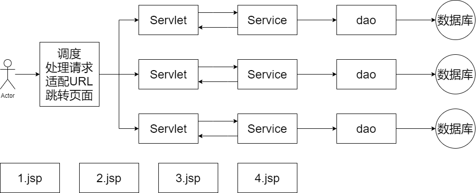

# 一、MVC

## MVC三层架构

- MVC是模型(Model)、视图(View)、控制器(Controller)的简写，是一种软件设计规范。
- 是将业务逻辑、数据、显示分离的方法来组织代码。
- MVC主要作用是**降低了视图与业务逻辑间的双向偶合**。
- MVC不是一种设计模式，**MVC是一种架构模式**。当然不同的MVC存在差异。


**Model（模型）：**数据模型，提供要展示的数据，因此包含数据和行为，可以认为是领域模型或JavaBean组件（包含数据和行为），不过现在一般都分离开来：Value Object（数据Dao） 和 服务层（行为Service）。也就是模型提供了模型数据查询和模型数据的状态更新等功能，包括数据和业务。

**View（视图）：**负责进行模型的展示，一般就是我们见到的用户界面，客户想看到的东西。

**Controller（控制器）：**接收用户请求，委托给模型进行处理（状态改变），处理完毕后把返回的模型数据返回给视图，由视图负责展示。也就是说控制器做了个调度员的工作。

## SpringMVC

官方文档：https://docs.spring.io/spring-framework/docs/current/reference/html/web.html#spring-web



Spring的web框架围绕`DispatcherServlet`设计。`DispatcherServlet`的作用是将请求分发到不同的处理器。从Spring 2.5开始，使用Java 5或者以上版本的用户可以采用基于注解的controller声明方式。

Spring MVC框架像许多其他MVC框架一样, **以请求为驱动，围绕一个中心Servlet分派请求及提供其他功能，`DispatcherServlet`是一个实际的Servlet (它继承自`HttpServlet`基类)**。


# 二、第一个SpringMVC程序

## XML

1.新建一个Moudle，添加web支持，并导入相关依赖


2.配置`web.xml`，注册`DispatcherServlet`

```xml
<?xml version="1.0" encoding="UTF-8"?>
<web-app xmlns="http://xmlns.jcp.org/xml/ns/javaee"
         xmlns:xsi="http://www.w3.org/2001/XMLSchema-instance"
         xsi:schemaLocation="http://xmlns.jcp.org/xml/ns/javaee http://xmlns.jcp.org/xml/ns/javaee/web-app_4_0.xsd"
         version="4.0">

    <!--1.注册DispatcherServlet-->
    <servlet>
        <servlet-name>springmvc</servlet-name>
        <servlet-class>org.springframework.web.servlet.DispatcherServlet</servlet-class>
        <!--关联一个springmvc的配置文件:【servlet-name】-servlet.xml-->
        <init-param>
            <param-name>contextConfigLocation</param-name>
            <param-value>classpath:springmvc-servlet.xml</param-value>
        </init-param>
        <!--启动级别-1-->
        <load-on-startup>1</load-on-startup>
    </servlet>

    <!--/ 匹配所有的请求；（不包括.jsp）-->
    <!--/* 匹配所有的请求；（包括.jsp）-->
    <servlet-mapping>
        <servlet-name>springmvc</servlet-name>
        <url-pattern>/</url-pattern>
    </servlet-mapping>
</web-app>
```

3.MVC配置文件`springmvc-servlet.xml`：

```xml
<?xml version="1.0" encoding="UTF-8"?>
<beans xmlns="http://www.springframework.org/schema/beans"
       xmlns:xsi="http://www.w3.org/2001/XMLSchema-instance"
       xsi:schemaLocation="http://www.springframework.org/schema/beans
       http://www.springframework.org/schema/beans/spring-beans.xsd">

    <!--配置映射器-->
    <bean class="org.springframework.web.servlet.handler.BeanNameUrlHandlerMapping"/>
    <!--配置适配器-->
    <bean class="org.springframework.web.servlet.mvc.SimpleControllerHandlerAdapter"/>
    <!--视图解析器-->
    <bean id="internalResourceViewResolver" class="org.springframework.web.servlet.view.InternalResourceViewResolver">
        <!--路径前缀-->
        <property name="prefix" value="/WEB-INF/test/"/>
        <!--路径后缀-->
        <property name="suffix" value=".jsp"/>
    </bean>

    <!--配置控制器-->
    <bean id="/hello" class="com.longsir.controller.HelloController"></bean>
    <bean id="/hilong" class="com.longsir.controller.HelloController"></bean>
</beans>
```

4.编写操作业务的Controller：

```java
package com.longsir.controller;

import org.springframework.web.servlet.ModelAndView;
import org.springframework.web.servlet.mvc.Controller;

import javax.servlet.http.HttpServletRequest;
import javax.servlet.http.HttpServletResponse;

/**
 * @author Jonny Long
 * @date 2020/11/6 11:37
 */
// 注意要实现Controller接口
public class HelloController implements Controller {
    public ModelAndView handleRequest(HttpServletRequest httpServletRequest, HttpServletResponse httpServletResponse) throws Exception {
        ModelAndView mv1 = new ModelAndView();
        mv1.addObject("msg","HelloMVC!");
        mv1.setViewName("hello");
        return mv1;
    }
}
```

5.写要跳转的jsp页面

```jsp
<%@ page contentType="text/html;charset=UTF-8" language="java" %>
<html>
<head>
    <title>LongSir</title>
</head>
<body>

<h1>HELLO MVC</h1>
${msg}
</body>
</html>
```

6.配置Tomcat，启动项目


## ★注解开发

1.新建Module，不改变`web.xml`文件

2.编写操作业务的Controller：

```java
@Controller
@RequestMapping("/HelloController")
public class HelloController {
    //真实访问映射路径: 项目名/HelloController/hello
    @RequestMapping("/hello")
    public String sayHello(Model model){
        //Spring MVC会自动实例化一个Model对象用于向视图中传值
        //向模型中添加属性msg与值，可以在JSP页面中取出并渲染
        model.addAttribute("msg","hello,SpringMVC   World");
        //返回视图位置: WEB-INF/jsp/hello.jsp
        return "hello";
    }

    @RequestMapping("/hh")
    public String sayHH(Model model){
        String str="小兔子乖乖，把门开开";
        model.addAttribute("msg",str);
        model.addAttribute("msg2","Good Life");
        return "hh";
    }
}
```

3.编写`springmvc-servlet.xml`文件：



必须要有`<mvc:annotation-driven/>`，注解驱动，否则会显示404



```xml
<?xml version="1.0" encoding="UTF-8"?>
<beans xmlns="http://www.springframework.org/schema/beans"
       xmlns:xsi="http://www.w3.org/2001/XMLSchema-instance"
       xmlns:context="http://www.springframework.org/schema/context"
       xmlns:mvc="http://www.springframework.org/schema/mvc"
       xsi:schemaLocation="http://www.springframework.org/schema/beans
       http://www.springframework.org/schema/beans/spring-beans.xsd
       http://www.springframework.org/schema/context
       https://www.springframework.org/schema/context/spring-context.xsd
       http://www.springframework.org/schema/mvc
       https://www.springframework.org/schema/mvc/spring-mvc.xsd">

    <!-- 自动扫描包，让指定包下的注解生效,由IOC容器统一管理 -->
    <context:component-scan base-package="com.longsir.controller"/>
    <!-- 让Spring MVC不处理静态资源 -->
    <mvc:default-servlet-handler />
    <!--
    支持mvc注解驱动
        在spring中一般采用@RequestMapping注解来完成映射关系
        要想使@RequestMapping注解生效
        必须向上下文中注册DefaultAnnotationHandlerMapping
        和一个AnnotationMethodHandlerAdapter实例
        这两个实例分别在类级别和方法级别处理。
        而annotation-driven配置帮助我们自动完成上述两个实例的注入。
     -->
    <mvc:annotation-driven />

    <!-- 视图解析器 -->
    <bean class="org.springframework.web.servlet.view.InternalResourceViewResolver"
          id="internalResourceViewResolver">
        <!-- 前缀 -->
        <property name="prefix" value="/WEB-INF/jsp/" />
        <!-- 后缀 -->
        <property name="suffix" value=".jsp" />
    </bean>

</beans>
```

4.jsp页面

```jsp
<%@ page contentType="text/html;charset=UTF-8" language="java" %>
<html>
<head>
    <title>SpringMVC</title>
</head>
<body>
${msg}
</body>
</html>
```

5.运行得到结果


## springMVC必须配置的三大件

**处理器映射器、处理器适配器、视图解析器**

通常，我们只需要**手动配置视图解析器**，而**处理器映射器**和**处理器适配器**只需要开启**注解驱动**即可，而省去了大段的xml配置


# 三、RestFul 风格

**概念**

Restful就是一个资源定位及资源操作的风格。不是标准也不是协议，只是一种风格。基于这个风格设计的软件可以更简洁，更有层次，更易于实现缓存等机制。

**功能**

资源：互联网所有的事物都可以被抽象为资源

资源操作：使用POST、DELETE、PUT、GET，使用不同方法对资源进行操作。

分别对应 添加、 删除、修改、查询。

**传统方式操作资源**  ：通过不同的参数来实现不同的效果！方法单一，post 和 get

`http://127.0.0.1/item/queryItem.action?id=1`：查询,GET

`http://127.0.0.1/item/saveItem.action`：新增,POST

`http://127.0.0.1/item/updateItem.action`：更新,POST

`http://127.0.0.1/item/deleteItem.action?id=1`：删除,GET或POST

**使用RESTful操作资源** ：可以通过不同的请求方式来实现不同的效果！如下：请求地址一样，但是功能可以不同！

`http://127.0.0.1/item/1`：查询,GET

`http://127.0.0.1/item`：新增,POST

`http://127.0.0.1/item`：更新,PUT

`http://127.0.0.1/item/1`：删除,DELETE

```java
@Controller
public class RestfulController {
    // 映射访问路径
    @RequestMapping("/commit/{p1}/{p2}")
    public String index(@PathVariable int p1, @PathVariable int p2, Model model){
        int result = p1+p2;
        //Spring MVC会自动实例化一个Model对象用于向视图中传值
        model.addAttribute("msg", "结果："+result);
        //返回视图位置
        return "hello";
    }

    // 映射访问路径,必须是POST请求
    @RequestMapping(value = "/hello",method = {RequestMethod.GET})
    public String index2(Model model){
        model.addAttribute("msg", "hello!");
        return "hello";
    }
}
```

页面`hello.jsp`：

```jsp
<%@ page contentType="text/html;charset=UTF-8" language="java" %>
<html>
<head>
    <title>Hello RestfulController</title>
</head>
<body>
<h2>Hello RestfulController</h2>
${msg}
</body>
</html>
```


Spring MVC 的`@RequestMapping`注解能够处理 HTTP 请求的方法, 比如GET, PUT, POST, DELETE 以及 PATCH。

**所有的地址栏请求默认都会是 HTTP GET 类型的。**

方法级别的注解变体有如下几个：组合注解

```java
@GetMapping
@PostMapping
@PutMapping
@DeleteMapping
@PatchMapping
```

`@GetMapping`是一个组合注解，平时使用的会比较多！

它所扮演的是`@RequestMapping(method =RequestMethod.GET)`的一个快捷方式。

# 四、数据处理和跳转

## 结果跳转方式

项目结构如下：


`index.jsp`如下：

```jsp
<%@ page contentType="text/html;charset=UTF-8" language="java" %>
<html>
  <head>
    <title>index Test</title>
  </head>
  <body>
  <h2>index Test</h2>
  <h3>${msg}</h3>
  </body>
</html>
```

`web/WEB-INF/jsp/test.jsp`如下：

```jsp
<%@ page contentType="text/html;charset=UTF-8" language="java" %>
<html>
<head>
    <title>jsp/index</title>
</head>
<body>

<h2>jsp/index</h2>
<h3>${msg}</h3>

</body>
</html>
```

### ModelAndView

设置`ModelAndView`对象 , 根据view的名称 , 和视图解析器跳到指定的页面 .

页面：`{视图解析器前缀} + viewName +{视图解析器后缀}`

```xml
<bean id="/hello" class="com.longsir.controller.ControllerTest"></bean>
```

```java
public class ControllerTest implements Controller {
    public ModelAndView handleRequest(HttpServletRequest httpServletRequest, HttpServletResponse httpServletResponse) throws Exception {
        ModelAndView mv = new ModelAndView();
        mv.addObject("msg","Controller by ModelAndView");
        mv.setViewName("test");
        return mv;
    }
}
```


### Restful

```java
@Controller
public class RestfulGo {
    @RequestMapping("/result/t1")
    public void test1(HttpServletRequest req, HttpServletResponse rsp) throws IOException {
        rsp.getWriter().println("Hello,Spring BY servlet API");
    }

    @RequestMapping("/result/t2")
    public void test2(HttpServletRequest req, HttpServletResponse rsp) throws IOException {
        rsp.sendRedirect("/index.jsp");
    }

    @RequestMapping("/result/t3")
    public void test3(HttpServletRequest req, HttpServletResponse rsp) throws Exception {
        //转发
        req.setAttribute("msg","/result/t3");
        req.getRequestDispatcher("/WEB-INF/jsp/test.jsp").forward(req,rsp);
    }
}
```


### RequestMapping

```java
@Controller
public class ResultSpringMVC {
    @RequestMapping("/rsm/t1")
    public String test1(){
        //转发
        return "index";
    }

    @RequestMapping("/rsm/t2")
    public String test2(){
        //转发二
        return "forward:/index.jsp";
    }

    @RequestMapping("/rsm/t3")
    public String test3(){
        //重定向
        return "redirect:/index.jsp";
    }
}
```


## 数据处理

1、提交的域名称和处理方法的参数名一致

提交数据：`http://localhost:8080/hello?name=longsir`

处理方法：

```java
@RequestMapping("/hello")
public String hello1(String name){
    System.out.println(name);
    return "test";
}
```

2.提交的域名称和处理方法的参数名不一致

提交数据：`http://localhost:8080/hello?username=longsir`

```java
@RequestMapping("/hello")
public String hello2(@RequestParam("username") String name){
    System.out.println(name);
    return "test";
}
```

3.提交的是一个对象

```java
public class User {
    private int id;
    private String name;
    private int age;
}
```

提交数据：`http://localhost:8081/hello?age=15&id=3&name=jonnylong`

```java
@RequestMapping("/hello")
public String hello3(User user){
    System.out.println("ID="+user.getId());
    System.out.println("Name="+user.getName());
    System.out.println("Age="+user.getAge());
    return "test";
}
```




以上三种方式不能同时使用，否则会报错505



## 数据显示到前端

**第一种 : 通过ModelAndView**

```java
public class ControllerTest1 implements Controller {

   public ModelAndView handleRequest(HttpServletRequest httpServletRequest, HttpServletResponse httpServletResponse) throws Exception {
       //返回一个模型视图对象
       ModelAndView mv = new ModelAndView();
       mv.addObject("msg","ControllerTest1");
       mv.setViewName("test");
       return mv;
  }
}
```

**第二种 : 通过ModelMap**

```java
@RequestMapping("/hello")
public String hello(@RequestParam("username") String name, ModelMap model){
   //封装要显示到视图中的数据
   //相当于req.setAttribute("name",name);
   model.addAttribute("name",name);
   System.out.println(name);
   return "hello";
}
```

**第三种 : 通过Model**

```java
@RequestMapping("/ct2/hello")
public String hello(@RequestParam("username") String name, Model model){
   //封装要显示到视图中的数据
   //相当于req.setAttribute("name",name);
   model.addAttribute("msg",name);
   System.out.println(name);
   return "test";
}
```

就对于新手而言简单来说使用区别就是：

- Model 只有寥寥几个方法只适合用于储存数据，简化了新手对于Model对象的操作和理解；

- ModelMap 继承了 LinkedMap ，除了实现了自身的一些方法，同样的继承 LinkedMap 的方法和特性；

- ModelAndView 可以在储存数据的同时，可以进行设置返回的逻辑视图，进行控制展示层的跳转。

当然更多的以后开发考虑的更多的是性能和优化，就不能单单仅限于此的了解。

**请使用80%的时间打好扎实的基础，剩下18%的时间研究框架，2%的时间去学点英文，框架的官方文档永远是最好的教程。**

## 乱码

### SpringMVC自带的过滤器

在`web.xml`中配置，修改了xml文件需要重启服务器！

```xml
<filter>
   <filter-name>encoding</filter-name>
   <filter-class>org.springframework.web.filter.CharacterEncodingFilter</filter-class>
   <init-param>
       <param-name>encoding</param-name>
       <param-value>utf-8</param-value>
   </init-param>
</filter>
<filter-mapping>
   <filter-name>encoding</filter-name>
   <url-pattern>/*</url-pattern>
</filter-mapping>
```

### 自定义过滤器

处理方法 :

1.修改tomcat配置文件 ：设置编码！

```xml
<Connector URIEncoding="utf-8" port="8080" protocol="HTTP/1.1"
          connectionTimeout="20000"
          redirectPort="8443" />
```

2.自定义过滤器

```java
package com.kuang.filter;

import javax.servlet.*;
import javax.servlet.http.HttpServletRequest;
import javax.servlet.http.HttpServletRequestWrapper;
import javax.servlet.http.HttpServletResponse;
import java.io.IOException;
import java.io.UnsupportedEncodingException;
import java.util.Map;

/**
* 解决get和post请求 全部乱码的过滤器
*/
public class GenericEncodingFilter implements Filter {

   @Override
   public void destroy() {
  }

   @Override
   public void doFilter(ServletRequest request, ServletResponse response, FilterChain chain) throws IOException, ServletException {
       //处理response的字符编码
       HttpServletResponse myResponse=(HttpServletResponse) response;
       myResponse.setContentType("text/html;charset=UTF-8");

       // 转型为与协议相关对象
       HttpServletRequest httpServletRequest = (HttpServletRequest) request;
       // 对request包装增强
       HttpServletRequest myrequest = new MyRequest(httpServletRequest);
       chain.doFilter(myrequest, response);
  }

   @Override
   public void init(FilterConfig filterConfig) throws ServletException {
  }

}

//自定义request对象，HttpServletRequest的包装类
class MyRequest extends HttpServletRequestWrapper {

   private HttpServletRequest request;
   //是否编码的标记
   private boolean hasEncode;
   //定义一个可以传入HttpServletRequest对象的构造函数，以便对其进行装饰
   public MyRequest(HttpServletRequest request) {
       super(request);// super必须写
       this.request = request;
  }

   // 对需要增强方法 进行覆盖
   @Override
   public Map getParameterMap() {
       // 先获得请求方式
       String method = request.getMethod();
       if (method.equalsIgnoreCase("post")) {
           // post请求
           try {
               // 处理post乱码
               request.setCharacterEncoding("utf-8");
               return request.getParameterMap();
          } catch (UnsupportedEncodingException e) {
               e.printStackTrace();
          }
      } else if (method.equalsIgnoreCase("get")) {
           // get请求
           Map<String, String[]> parameterMap = request.getParameterMap();
           if (!hasEncode) { // 确保get手动编码逻辑只运行一次
               for (String parameterName : parameterMap.keySet()) {
                   String[] values = parameterMap.get(parameterName);
                   if (values != null) {
                       for (int i = 0; i < values.length; i++) {
                           try {
                               // 处理get乱码
                               values[i] = new String(values[i]
                                      .getBytes("ISO-8859-1"), "utf-8");
                          } catch (UnsupportedEncodingException e) {
                               e.printStackTrace();
                          }
                      }
                  }
              }
               hasEncode = true;
          }
           return parameterMap;
      }
       return super.getParameterMap();
  }

   //取一个值
   @Override
   public String getParameter(String name) {
       Map<String, String[]> parameterMap = getParameterMap();
       String[] values = parameterMap.get(name);
       if (values == null) {
           return null;
      }
       return values[0]; // 取回参数的第一个值
  }

   //取所有值
   @Override
   public String[] getParameterValues(String name) {
       Map<String, String[]> parameterMap = getParameterMap();
       String[] values = parameterMap.get(name);
       return values;
  }
}
```

这个也是我在网上找的一些大神写的，一般情况下，`SpringMVC`默认的乱码处理就已经能够很好的解决了！

**然后在`web.xml`中配置这个过滤器即可！**

乱码问题，需要平时多注意，在尽可能能设置编码的地方，都设置为统一编码 UTF-8！

# 五、JSON

> 这部分在前端那里学过，详细可以跳转查看

## Controller返回Json数据

1.创建Module项目，导入Jackson依赖包

```xml
<!-- https://mvnrepository.com/artifact/com.fasterxml.jackson.core/jackson-databind -->
<dependency>
    <groupId>com.fasterxml.jackson.core</groupId>
    <artifactId>jackson-databind</artifactId>
    <version>2.11.3</version>
</dependency>
```

2.配置`web.xml`

```xml
<?xml version="1.0" encoding="UTF-8"?>
<web-app xmlns="http://xmlns.jcp.org/xml/ns/javaee"
         xmlns:xsi="http://www.w3.org/2001/XMLSchema-instance"
         xsi:schemaLocation="http://xmlns.jcp.org/xml/ns/javaee http://xmlns.jcp.org/xml/ns/javaee/web-app_4_0.xsd"
         version="4.0">
    <!--1.注册servlet-->
    <servlet>
        <servlet-name>SpringMVC</servlet-name>
        <servlet-class>org.springframework.web.servlet.DispatcherServlet</servlet-class>
        <!--通过初始化参数指定SpringMVC配置文件的位置，进行关联-->
        <init-param>
            <param-name>contextConfigLocation</param-name>
            <param-value>classpath:springmvc-servlet.xml</param-value>
        </init-param>
        <!-- 启动顺序，数字越小，启动越早 -->
        <load-on-startup>1</load-on-startup>
    </servlet>

    <!--所有请求都会被springmvc拦截 -->
    <servlet-mapping>
        <servlet-name>SpringMVC</servlet-name>
        <url-pattern>/</url-pattern>
    </servlet-mapping>

    <filter>
        <filter-name>encoding</filter-name>
        <filter-class>org.springframework.web.filter.CharacterEncodingFilter</filter-class>
        <init-param>
            <param-name>encoding</param-name>
            <param-value>utf-8</param-value>
        </init-param>
    </filter>
    <filter-mapping>
        <filter-name>encoding</filter-name>
        <url-pattern>/</url-pattern>
    </filter-mapping>

</web-app>
```

配置`springmvc-servlet.xml`

```xml
<?xml version="1.0" encoding="UTF-8"?>
<beans xmlns="http://www.springframework.org/schema/beans"
       xmlns:xsi="http://www.w3.org/2001/XMLSchema-instance"
       xmlns:context="http://www.springframework.org/schema/context"
       xmlns:mvc="http://www.springframework.org/schema/mvc"
       xsi:schemaLocation="http://www.springframework.org/schema/beans
       http://www.springframework.org/schema/beans/spring-beans.xsd
       http://www.springframework.org/schema/context
       https://www.springframework.org/schema/context/spring-context.xsd
       http://www.springframework.org/schema/mvc
       https://www.springframework.org/schema/mvc/spring-mvc.xsd">

    <!-- 自动扫描指定的包，下面所有注解类交给IOC容器管理 -->
    <context:component-scan base-package="com.longsir.controller"/>

    <!-- 视图解析器 -->
    <bean class="org.springframework.web.servlet.view.InternalResourceViewResolver"
          id="internalResourceViewResolver">
        <!-- 前缀 -->
        <property name="prefix" value="/WEB-INF/jsp/" />
        <!-- 后缀 -->
        <property name="suffix" value=".jsp" />
    </bean>

</beans>
```

3.实体类

```java
public class User {
    private int id;
    private String name;
    private int age;
}
```

4.`UserController`

配置`produces = "application/json;charset=utf-8"`可以避免中文乱码解析

```java
/**
 * @author Jonny Long
 * @date 2020/11/20 21:22
 */
@Controller
public class UserController {
    @RequestMapping(value = "/json1",produces = "application/json;charset=utf-8")
    @ResponseBody
    public String json1() throws JsonProcessingException {
        ObjectMapper mapper = new ObjectMapper();
        User user = new User("Long", 20, "男");
        String s = mapper.writeValueAsString(user);
        return s;
    }
}
```


## 代码优化

上一种方法比较麻烦，如果项目中有许多请求则每一个都要添加，可以通过Spring配置统一指定，这样就不用每次都去处理了！

我们可以在`springmvc`的配置文件上添加一段消息`StringHttpMessageConverter`转换配置！

```xml
<mvc:annotation-driven>
   <mvc:message-converters register-defaults="true">
       <bean class="org.springframework.http.converter.StringHttpMessageConverter">
           <constructor-arg value="UTF-8"/>
       </bean>
       <bean class="org.springframework.http.converter.json.MappingJackson2HttpMessageConverter">
           <property name="objectMapper">
               <bean class="org.springframework.http.converter.json.Jackson2ObjectMapperFactoryBean">
                   <property name="failOnEmptyBeans" value="false"/>
               </bean>
           </property>
       </bean>
   </mvc:message-converters>
</mvc:annotation-driven>
```


```java
//@Controller
@RestController
public class UserController {
    @RequestMapping("/json1")
    //@ResponseBody
    public String json1() throws JsonProcessingException {
        ObjectMapper mapper = new ObjectMapper();
        User user1 = new User("林黛玉", 20, "女");
        User user2 = new User("薛宝钗", 20, "女");
        User user3 = new User("贾探春", 20, "女");
        User user4 = new User("史湘云", 20, "女");
        List<User> userList=new ArrayList<>();
        userList.add(user1);
        userList.add(user2);
        userList.add(user3);
        userList.add(user4);
        String s = mapper.writeValueAsString(userList);
        return s;
    }

    @RequestMapping("/json2")
    public String json2() throws JsonProcessingException {
        ObjectMapper mapper = new ObjectMapper();
        Date date = new Date();
        SimpleDateFormat sdf = new SimpleDateFormat("yyyy-MM-dd HH:mm:ss");
        return mapper.writeValueAsString(sdf.format(date));
    }
}
```


## 使用工具类进行优化

```java
public class JsonUtils {
    public static String getJson(Object object){
        return getJson(object,"yyyy-MM-dd HH:mm:ss");
    }
    public static String getJson(Object object,String dataFormat){
        ObjectMapper mapper = new ObjectMapper();
        SimpleDateFormat sdf = new SimpleDateFormat(dataFormat);
        try {
            return mapper.writeValueAsString(sdf.format(object));
        } catch (JsonProcessingException e) {
            e.printStackTrace();
        }
        return null;
    }
}
```

```java
@RequestMapping("/json2")
public String json2() throws JsonProcessingException {
    Date date = new Date();
    return JsonUtils.getJson(date);
}
```

最终得到的是一样的结果，但这种方式降低了代码的耦合性

# 六、SSM整合

## 项目结构

> 还有`pom.xml`文件没有截图进去

服务端：


web端：


## 基本环境搭建

1.创建一个存放书籍数据的数据库表

```sql
CREATE DATABASE `ssmbuild`;

USE `ssmbuild`;

DROP TABLE IF EXISTS `books`;

CREATE TABLE `books` (
`bookID` INT(10) NOT NULL AUTO_INCREMENT COMMENT '书id',
`bookName` VARCHAR(100) NOT NULL COMMENT '书名',
`bookCounts` INT(11) NOT NULL COMMENT '数量',
`detail` VARCHAR(200) NOT NULL COMMENT '描述',
KEY `bookID` (`bookID`)
) ENGINE=INNODB DEFAULT CHARSET=utf8

INSERT  INTO `books`(`bookID`,`bookName`,`bookCounts`,`detail`)VALUES
(1,'Java',1,'从入门到放弃'),
(2,'MySQL',10,'从删库到跑路'),
(3,'Linux',5,'从进门到进牢');
```

2.导入相关的pom依赖

```xml
<!--JUnit-->
<dependency>
    <groupId>junit</groupId>
    <artifactId>junit</artifactId>
    <version>4.13.1</version>
    <scope>test</scope>
</dependency>
<!--数据库驱动-->
<dependency>
    <groupId>mysql</groupId>
    <artifactId>mysql-connector-java</artifactId>
    <version>8.0.22</version>
</dependency>
<!--数据库连接池-->
<dependency>
    <groupId>com.mchange</groupId>
    <artifactId>c3p0</artifactId>
    <version>0.9.5.5</version>
</dependency>
<!--Servlet、JSP-->
<dependency>
    <groupId>javax.servlet</groupId>
    <artifactId>javax.servlet-api</artifactId>
    <version>4.0.1</version>
    <scope>provided</scope>
</dependency>
<dependency>
    <groupId>javax.servlet.jsp</groupId>
    <artifactId>jsp-api</artifactId>
    <version>2.2</version>
</dependency>
<dependency>
    <groupId>javax.servlet</groupId>
    <artifactId>jstl</artifactId>
    <version>1.2</version>
</dependency>
<!--Mybatis-->
<dependency>
    <groupId>org.mybatis</groupId>
    <artifactId>mybatis</artifactId>
    <version>3.5.2</version>
</dependency>
<dependency>
    <groupId>org.mybatis</groupId>
    <artifactId>mybatis-spring</artifactId>
    <version>2.0.2</version>
</dependency>
<!--Spring-->
<dependency>
    <groupId>org.springframework</groupId>
    <artifactId>spring-webmvc</artifactId>
    <version>5.1.9.RELEASE</version>
</dependency>
<dependency>
    <groupId>org.springframework</groupId>
    <artifactId>spring-jdbc</artifactId>
    <version>5.1.9.RELEASE</version>
</dependency>
```

3.Maven过滤设置

```xml
<build>
    <resources>
        <resource>
            <directory>src/main/java</directory>
            <includes>
                <include>**/*.properties</include>
                <include>**/*.xml</include>
            </includes>
            <filtering>false</filtering>
        </resource>
        <resource>
            <directory>src/main/resources</directory>
            <includes>
                <include>**/*.properties</include>
                <include>**/*.xml</include>
            </includes>
            <filtering>false</filtering>
        </resource>
    </resources>
</build>
```

## Mybatis层

1,数据库配置文件 `database.properties`

```properties
jdbc.driver=com.mysql.jdbc.Driver
jdbc.url=jdbc:mysql://localhost:3306/ssmbuild?useSSL=true&useUnicode=true&characterEncoding=utf8
jdbc.username=root
jdbc.password=123456
```

2.编写MyBatis的核心配置文件`mybatis-config.xml`

```xml
<?xml version="1.0" encoding="UTF-8" ?>
<!DOCTYPE configuration
        PUBLIC "-//mybatis.org//DTD Config 3.0//EN"
        "http://mybatis.org/dtd/mybatis-3-config.dtd">
<configuration>
    <typeAliases>
        <package name="com.crud.pojo"/>
    </typeAliases>
    <mappers>
        <mapper class="com.crud.dao.BookDao"/>
    </mappers>
</configuration>
```

3.编写实例

```java
public class Books {
    private int bookID;
    private String bookName;
    private int bookCounts;
    private String detail;
}
```

4.编写Mapper接口`BookDao.java`

```java
public interface BookDao {
    //增加一个Book
    int addBook(Books book);

    //根据id删除一个Book
    int deleteBookById(int id);

    //更新Book
    int updateBook(Books books);

    //根据id查询,返回一个Book
    Books queryBookById(int id);

    //查询全部Book,返回list集合
    List<Books> queryAllBook();
}
```

5.编写Mapper接口对应的xml文件

```xml
<?xml version="1.0" encoding="UTF-8" ?>
<!DOCTYPE mapper
        PUBLIC "-//mybatis.org//DTD Mapper 3.0//EN"
        "http://mybatis.org/dtd/mybatis-3-mapper.dtd">

<mapper namespace="com.crud.dao.BookDao">

    <!--增加一个Book-->
    <insert id="addBook" parameterType="Books">
      insert into ssmbuild.books(bookName,bookCounts,detail)
      values (#{bookName}, #{bookCounts}, #{detail})
   </insert>

    <!--根据id删除一个Book-->
    <delete id="deleteBookById" parameterType="int">
      delete from ssmbuild.books where bookID=#{bookID}
   </delete>

    <!--更新Book-->
    <update id="updateBook" parameterType="Books">
      update ssmbuild.books
      set bookName = #{bookName},bookCounts = #{bookCounts},detail = #{detail}
      where bookID = #{bookID}
   </update>

    <!--根据id查询,返回一个Book-->
    <select id="queryBookById" resultType="Books">
      select * from ssmbuild.books
      where bookID = #{bookID}
   </select>

    <!--查询全部Book-->
    <select id="queryAllBook" resultType="Books">
      SELECT * from ssmbuild.books
   </select>

</mapper>
```

6.编写Service接口`BookService.java`

```java
public interface BookService {
    //增加一个Book
    int addBook(Books book);

    //根据id删除一个Book
    int deleteBookById(int id);

    //更新Book
    int updateBook(Books books);

    //根据id查询,返回一个Book
    Books queryBookById(int id);

    //查询全部Book,返回list集合
    List<Books> queryAllBook();
}
```

7.编写实现类`BookServiceImpl.java`，并实现`BookService`接口

```java
public class BookServiceImpl implements BookService {

    //调用dao层的操作，设置一个set接口，方便Spring管理
    private BookDao bookDao;

    public void setBookDao(BookDao bookDao) {
        this.bookDao = bookDao;
    }

    public int addBook(Books book) {
        return bookDao.addBook(book);
    }

    public int deleteBookById(int id) {
        return bookDao.deleteBookById(id);
    }

    public int updateBook(Books books) {
        return bookDao.updateBook(books);
    }

    public Books queryBookById(int id) {
        return bookDao.queryBookById(id);
    }

    public List<Books> queryAllBook() {
        return bookDao.queryAllBook();
    }
}
```

## Spring层

1.配置**Spring整合MyBatis**，我们这里数据源使用c3p0连接池；

2.我们去编写Spring整合Mybatis的相关的配置文件：`spring-dao.xml`

```xml
<?xml version="1.0" encoding="UTF-8"?>
<beans xmlns="http://www.springframework.org/schema/beans"
       xmlns:xsi="http://www.w3.org/2001/XMLSchema-instance"
       xmlns:context="http://www.springframework.org/schema/context"
       xsi:schemaLocation="http://www.springframework.org/schema/beans
       http://www.springframework.org/schema/beans/spring-beans.xsd
       http://www.springframework.org/schema/context
       https://www.springframework.org/schema/context/spring-context.xsd">

    <!-- 配置整合mybatis -->
    <!-- 1.关联数据库文件 -->
    <context:property-placeholder location="classpath:database.properties"/>

    <!-- 2.数据库连接池 -->
    <!--数据库连接池
        dbcp 半自动化操作 不能自动连接
        c3p0 自动化操作（自动的加载配置文件 并且设置到对象里面）
    -->
    <bean id="dataSource" class="com.mchange.v2.c3p0.ComboPooledDataSource">
        <!-- 配置连接池属性 -->
        <property name="driverClass" value="${jdbc.driver}"/>
        <property name="jdbcUrl" value="${jdbc.url}"/>
        <property name="user" value="${jdbc.username}"/>
        <property name="password" value="${jdbc.password}"/>

        <!-- c3p0连接池的私有属性 -->
        <property name="maxPoolSize" value="30"/>
        <property name="minPoolSize" value="10"/>
        <!-- 关闭连接后不自动commit -->
        <property name="autoCommitOnClose" value="false"/>
        <!-- 获取连接超时时间 -->
        <property name="checkoutTimeout" value="10000"/>
        <!-- 当获取连接失败重试次数 -->
        <property name="acquireRetryAttempts" value="2"/>
    </bean>

    <!-- 3.配置SqlSessionFactory对象 -->
    <bean id="sqlSessionFactory" class="org.mybatis.spring.SqlSessionFactoryBean">
        <!-- 注入数据库连接池 -->
        <property name="dataSource" ref="dataSource"/>
        <!-- 配置MyBaties全局配置文件:mybatis-config.xml -->
        <property name="configLocation" value="classpath:mybatis-config.xml"/>
    </bean>

    <!-- 4.配置扫描Dao接口包，动态实现Dao接口注入到spring容器中 -->
    <bean class="org.mybatis.spring.mapper.MapperScannerConfigurer">
        <!-- 注入sqlSessionFactory -->
        <property name="sqlSessionFactoryBeanName" value="sqlSessionFactory"/>
        <!-- 给出需要扫描Dao接口包 -->
        <property name="basePackage" value="com.crud.dao"/>
    </bean>
</beans>
```

3.整合service层

```xml
<?xml version="1.0" encoding="UTF-8"?>
<beans xmlns="http://www.springframework.org/schema/beans"
       xmlns:xsi="http://www.w3.org/2001/XMLSchema-instance"
       xmlns:context="http://www.springframework.org/schema/context"
       xsi:schemaLocation="http://www.springframework.org/schema/beans
   http://www.springframework.org/schema/beans/spring-beans.xsd
   http://www.springframework.org/schema/context
   http://www.springframework.org/schema/context/spring-context.xsd">

    <!-- 扫描service相关的bean -->
    <context:component-scan base-package="com.crud.service" />

    <!--BookServiceImpl注入到IOC容器中-->
    <bean id="BookServiceImpl" class="com.crud.service.BookServiceImpl">
        <property name="bookDao" ref="bookDao"/>
    </bean>

    <!-- 配置事务管理器 -->
    <bean id="transactionManager" class="org.springframework.jdbc.datasource.DataSourceTransactionManager">
        <!-- 注入数据库连接池 -->
        <property name="dataSource" ref="dataSource" />
    </bean>
</beans>
```

## SpringMVC层

1.配置`web.xml`

```xml
<?xml version="1.0" encoding="UTF-8"?>
<web-app xmlns="http://xmlns.jcp.org/xml/ns/javaee"
         xmlns:xsi="http://www.w3.org/2001/XMLSchema-instance"
         xsi:schemaLocation="http://xmlns.jcp.org/xml/ns/javaee http://xmlns.jcp.org/xml/ns/javaee/web-app_4_0.xsd"
         version="4.0">

    <!--DispatcherServlet-->
    <servlet>
        <servlet-name>DispatcherServlet</servlet-name>
        <servlet-class>org.springframework.web.servlet.DispatcherServlet</servlet-class>
        <init-param>
            <param-name>contextConfigLocation</param-name>
            <!--一定要注意:我们这里加载的是总的配置文件，之前被这里坑了！-->
            <param-value>classpath:applicationContext.xml</param-value>
        </init-param>
        <load-on-startup>1</load-on-startup>
    </servlet>
    <servlet-mapping>
        <servlet-name>DispatcherServlet</servlet-name>
        <url-pattern>/</url-pattern>
    </servlet-mapping>

    <!--encodingFilter-->
    <filter>
        <filter-name>encodingFilter</filter-name>
        <filter-class>
            org.springframework.web.filter.CharacterEncodingFilter
        </filter-class>
        <init-param>
            <param-name>encoding</param-name>
            <param-value>utf-8</param-value>
        </init-param>
    </filter>
    <filter-mapping>
        <filter-name>encodingFilter</filter-name>
        <url-pattern>/*</url-pattern>
    </filter-mapping>

    <!--Session过期时间-->
    <session-config>
        <session-timeout>15</session-timeout>
    </session-config>

</web-app>
```

2.`spring-mvc.xml`

```xml
<?xml version="1.0" encoding="UTF-8"?>
<beans xmlns="http://www.springframework.org/schema/beans"
       xmlns:xsi="http://www.w3.org/2001/XMLSchema-instance"
       xmlns:context="http://www.springframework.org/schema/context"
       xmlns:mvc="http://www.springframework.org/schema/mvc"
       xsi:schemaLocation="http://www.springframework.org/schema/beans
   http://www.springframework.org/schema/beans/spring-beans.xsd
   http://www.springframework.org/schema/context
   http://www.springframework.org/schema/context/spring-context.xsd
   http://www.springframework.org/schema/mvc
   https://www.springframework.org/schema/mvc/spring-mvc.xsd">

    <!-- 配置SpringMVC -->
    <!-- 1.开启SpringMVC注解驱动 -->
    <mvc:annotation-driven />
    <!-- 2.静态资源默认servlet配置-->
    <mvc:default-servlet-handler/>

    <!-- 3.配置jsp 显示ViewResolver视图解析器 -->
    <bean class="org.springframework.web.servlet.view.InternalResourceViewResolver">
        <property name="viewClass" value="org.springframework.web.servlet.view.JstlView" />
        <property name="prefix" value="/WEB-INF/jsp/" />
        <property name="suffix" value=".jsp" />
    </bean>

    <!-- 4.扫描web相关的bean -->
    <context:component-scan base-package="com.crud.controller" />

</beans>
```

3.引入spring配置文件到`applicationContext.xml`中

```xml
<?xml version="1.0" encoding="UTF-8"?>
<beans xmlns="http://www.springframework.org/schema/beans"
       xmlns:xsi="http://www.w3.org/2001/XMLSchema-instance"
       xsi:schemaLocation="http://www.springframework.org/schema/beans
       http://www.springframework.org/schema/beans/spring-beans.xsd">

    <import resource="spring-dao.xml"/>
    <import resource="spring-service.xml"/>
    <import resource="spring-mvc.xml"/>
</beans>
```

## 编写Controller

```java
@Controller
@RequestMapping("/book")
public class BookController {
    @Autowired
    @Qualifier("BookServiceImpl")
    private BookService bookService;

    @RequestMapping("/allBook")
    public String list(Model model){
        List<Books> list=bookService.queryAllBook();
        model.addAttribute("list",list);
        return "allBook";
    }

    @RequestMapping("/toAddBook")
    public String toAddPaper() {
        return "addBook";
    }

    @RequestMapping("/addBook")
    public String addPaper(Books books) {
        System.out.println(books);
        bookService.addBook(books);
        return "redirect:/book/allBook";
    }

    @RequestMapping("/toUpdateBook")
    public String toUpdateBook(Model model, int id) {
        Books books = bookService.queryBookById(id);
        System.out.println(books);
        model.addAttribute("book",books );
        return "updateBook";
    }

    @RequestMapping("/updateBook")
    public String updateBook(Model model, Books book) {
        System.out.println(book);
        bookService.updateBook(book);
        Books books = bookService.queryBookById(book.getBookID());
        model.addAttribute("books", books);
        return "redirect:/book/allBook";
    }

    @RequestMapping("/del/{bookId}")
    public String deleteBook(@PathVariable("bookId") int id) {
        bookService.deleteBookById(id);
        return "redirect:/book/allBook";
    }
}
```

## 编写视图层（.jsp）

1.`index.jsp`

```jsp
<%@ page language="java" contentType="text/html; charset=UTF-8" pageEncoding="UTF-8" %>
<!DOCTYPE HTML>
<html>
<head>
    <title>首页</title>
    <style type="text/css">
        a {
            text-decoration: none;
            color: black;
            font-size: 18px;
        }
        h3 {
            width: 180px;
            height: 38px;
            margin: 100px auto;
            text-align: center;
            line-height: 38px;
            background: deepskyblue;
            border-radius: 4px;
        }
    </style>
</head>
<body>

<h3>
    <a href="${pageContext.request.contextPath}/book/allBook">点击进入列表页</a>
</h3>
</body>
</html>
```

2.`allBook.jsp`

```jsp
<%@ taglib prefix="c" uri="http://java.sun.com/jsp/jstl/core" %>
<%@ page contentType="text/html;charset=UTF-8" language="java" %>
<html>
<head>
    <title>书籍列表</title>
    <meta name="viewport" content="width=device-width, initial-scale=1.0">
    <!-- 引入 Bootstrap -->
    <link href="https://cdn.bootcss.com/bootstrap/3.3.7/css/bootstrap.min.css" rel="stylesheet">
</head>
<body>

<div class="container">

    <div class="row clearfix">
        <div class="col-md-12 column">
            <div class="page-header">
                <h1>
                    <small>书籍列表 —— 显示所有书籍</small>
                </h1>
            </div>
        </div>
    </div>

    <div class="row">
        <div class="col-md-4 column">
            <a class="btn btn-primary" href="${pageContext.request.contextPath}/book/toAddBook">新增</a>
        </div>
    </div>

    <div class="row clearfix">
        <div class="col-md-12 column">
            <table class="table table-hover table-striped">
                <thead>
                <tr>
                    <th>书籍编号</th>
                    <th>书籍名字</th>
                    <th>书籍数量</th>
                    <th>书籍详情</th>
                    <th>操作</th>
                </tr>
                </thead>

                <tbody>
                <c:forEach var="book" items="${requestScope.get('list')}">
                    <tr>
                        <td>${book.getBookID()}</td>
                        <td>${book.getBookName()}</td>
                        <td>${book.getBookCounts()}</td>
                        <td>${book.getDetail()}</td>
                        <td>
                            <a href="${pageContext.request.contextPath}/book/toUpdateBook?id=${book.getBookID()}">更改</a> |
                            <a href="${pageContext.request.contextPath}/book/del/${book.getBookID()}">删除</a>
                        </td>
                    </tr>
                </c:forEach>
                </tbody>
            </table>
        </div>
    </div>
</div>
```

3.`addBook.jsp`

```jsp
<%@ taglib prefix="c" uri="http://java.sun.com/jsp/jstl/core" %>
<%@ page contentType="text/html;charset=UTF-8" language="java" %>

<html>
<head>
    <title>新增书籍</title>
    <meta name="viewport" content="width=device-width, initial-scale=1.0">
    <!-- 引入 Bootstrap -->
    <link href="https://cdn.bootcss.com/bootstrap/3.3.7/css/bootstrap.min.css" rel="stylesheet">
</head>
<body>
<div class="container">

    <div class="row clearfix">
        <div class="col-md-12 column">
            <div class="page-header">
                <h1>
                    <small>新增书籍</small>
                </h1>
            </div>
        </div>
    </div>
    <form action="${pageContext.request.contextPath}/book/addBook" method="post">
        书籍名称：<input type="text" name="bookName"><br><br><br>
        书籍数量：<input type="text" name="bookCounts"><br><br><br>
        书籍详情：<input type="text" name="detail"><br><br><br>
        <input type="submit" value="添加">
    </form>

</div>
```

4.`updateBook.jsp`

```jsp
<%@ taglib prefix="c" uri="http://java.sun.com/jsp/jstl/core" %>
<%@ page contentType="text/html;charset=UTF-8" language="java" %>
<html>
<head>
    <title>修改信息</title>
    <meta name="viewport" content="width=device-width, initial-scale=1.0">
    <!-- 引入 Bootstrap -->
    <link href="https://cdn.bootcss.com/bootstrap/3.3.7/css/bootstrap.min.css" rel="stylesheet">
</head>
<body>
<div class="container">

    <div class="row clearfix">
        <div class="col-md-12 column">
            <div class="page-header">
                <h1>
                    <small>修改信息</small>
                </h1>
            </div>
        </div>
    </div>

    <form action="${pageContext.request.contextPath}/book/updateBook" method="post">
        <input type="hidden" name="bookID" value="${book.getBookID()}"/>
        书籍名称：<input type="text" name="bookName" value="${book.getBookName()}"/>
        书籍数量：<input type="text" name="bookCounts" value="${book.getBookCounts()}"/>
        书籍详情：<input type="text" name="detail" value="${book.getDetail() }"/>
        <input type="submit" value="提交"/>
    </form>

</div>
```

整合结果如下：


# 七、Ajax

## 什么是Ajax

**AJAX = Asynchronous JavaScript and XML（异步的 JavaScript 和 XML）。**

AJAX 是一种在无需重新加载整个网页的情况下，能够更新部分网页的技术。

**Ajax 不是一种新的编程语言，而是一种用于创建更好更快以及交互性更强的Web应用程序的技术。**

在 2005 年，Google 通过其 Google Suggest 使 AJAX 变得流行起来。Google Suggest能够自动帮你完成搜索单词。

Google Suggest 使用 AJAX 创造出动态性极强的 web 界面：当您在谷歌的搜索框输入关键字时，JavaScript 会把这些字符发送到服务器，然后服务器会返回一个搜索建议的列表。

就和国内百度的搜索框一样!

传统的网页(即不用ajax技术的网页)，想要更新内容或者提交一个表单，都需要重新加载整个网页。

使用ajax技术的网页，通过在后台服务器进行少量的数据交换，就可以实现异步局部更新。

使用Ajax，用户可以创建接近本地桌面应用的直接、高可用、更丰富、更动态的Web用户界面。

## jQuery.ajax

纯JS原生实现Ajax我们不去讲解这里，直接使用jquery提供的，方便学习和使用，避免重复造轮子，有兴趣的同学可以去了解下JS原生XMLHttpRequest ！

Ajax的核心是XMLHttpRequest对象(XHR)。XHR为向服务器发送请求和解析服务器响应提供了接口。能够以异步方式从服务器获取新数据。

jQuery 提供多个与 AJAX 有关的方法。

通过 jQuery AJAX 方法，您能够使用 HTTP Get 和 HTTP Post 从远程服务器上请求文本、HTML、XML 或 JSON – 同时您能够把这些外部数据直接载入网页的被选元素中。

jQuery 不是生产者，而是大自然搬运工。

jQuery Ajax本质就是 XMLHttpRequest，对他进行了封装，方便调用！

```
jQuery.ajax(...)
      部分参数：
            url：请求地址
            type：请求方式，GET、POST（1.9.0之后用method）
        headers：请求头
            data：要发送的数据
    contentType：即将发送信息至服务器的内容编码类型(默认: "application/x-www-form-urlencoded; charset=UTF-8")
          async：是否异步
        timeout：设置请求超时时间（毫秒）
      beforeSend：发送请求前执行的函数(全局)
        complete：完成之后执行的回调函数(全局)
        success：成功之后执行的回调函数(全局)
          error：失败之后执行的回调函数(全局)
        accepts：通过请求头发送给服务器，告诉服务器当前客户端可接受的数据类型
        dataType：将服务器端返回的数据转换成指定类型
          "xml": 将服务器端返回的内容转换成xml格式
          "text": 将服务器端返回的内容转换成普通文本格式
          "html": 将服务器端返回的内容转换成普通文本格式，在插入DOM中时，如果包含JavaScript标签，则会尝试去执行。
        "script": 尝试将返回值当作JavaScript去执行，然后再将服务器端返回的内容转换成普通文本格式
          "json": 将服务器端返回的内容转换成相应的JavaScript对象
        "jsonp": JSONP 格式使用 JSONP 形式调用函数时，如 "myurl?callback=?" jQuery 将自动替换 ? 为正确的函数名，以执行回调函数
```

## Ajax使用

下面将写4个页面，每个页面对应一个Ajax请求，分别为`/a1`、`/a2`、`/a3`、百度搜索

### 配置文件

`pom.xml`：

```xml
<dependencies>
    <dependency>
        <groupId>junit</groupId>
        <artifactId>junit</artifactId>
        <version>4.12</version>
    </dependency>
    <dependency>
        <groupId>org.springframework</groupId>
        <artifactId>spring-webmvc</artifactId>
        <version>5.1.9.RELEASE</version>
    </dependency>
    <dependency>
        <groupId>javax.servlet</groupId>
        <artifactId>javax.servlet-api</artifactId>
        <version>4.0.1</version>
        <scope>provided</scope>
    </dependency>
    <dependency>
        <groupId>com.fasterxml.jackson.core</groupId>
        <artifactId>jackson-databind</artifactId>
        <version>2.11.3</version>
    </dependency>
    <dependency>
        <groupId>com.fasterxml.jackson.core</groupId>
        <artifactId>jackson-annotations</artifactId>
        <version>2.11.3</version>
    </dependency>
</dependencies>
```

`spring-mvc.xml`：

```xml
<?xml version="1.0" encoding="UTF-8"?>
<beans xmlns="http://www.springframework.org/schema/beans"
       xmlns:xsi="http://www.w3.org/2001/XMLSchema-instance"
       xmlns:context="http://www.springframework.org/schema/context"
       xmlns:mvc="http://www.springframework.org/schema/mvc"
       xsi:schemaLocation="http://www.springframework.org/schema/beans
       http://www.springframework.org/schema/beans/spring-beans.xsd
       http://www.springframework.org/schema/context
       https://www.springframework.org/schema/context/spring-context.xsd
       http://www.springframework.org/schema/mvc
       https://www.springframework.org/schema/mvc/spring-mvc.xsd">

    <context:component-scan base-package="com.ajax.controller"/>
    <mvc:default-servlet-handler />
    <mvc:annotation-driven />

    <mvc:annotation-driven>
        <mvc:message-converters>
            <bean class="org.springframework.http.converter.StringHttpMessageConverter">
                <constructor-arg value="UTF-8"/>
            </bean>
            <bean class="org.springframework.http.converter.json.MappingJackson2HttpMessageConverter">
                <property name="objectMapper">
                    <bean class="org.springframework.http.converter.json.Jackson2ObjectMapperFactoryBean">
                        <property name="failOnEmptyBeans" value="false"/>
                    </bean>
                </property>
            </bean>
        </mvc:message-converters>
    </mvc:annotation-driven>

    <bean id="internalResourceViewResolver" class="org.springframework.web.servlet.view.InternalResourceViewResolver">
        <!--路径前缀-->
        <property name="prefix" value="/WEB-INF/jsp/"/>
        <!--路径后缀-->
        <property name="suffix" value=".jsp"/>
    </bean>

</beans>
```

`web.xml`：

```xml
<servlet>
    <servlet-name>springmvc</servlet-name>
    <servlet-class>org.springframework.web.servlet.DispatcherServlet</servlet-class>
    <init-param>
        <param-name>contextConfigLocation</param-name>
        <param-value>classpath:springmvc.xml</param-value>
    </init-param>
    <load-on-startup>1</load-on-startup>
</servlet>

<servlet-mapping>
    <servlet-name>springmvc</servlet-name>
    <url-pattern>/</url-pattern>
</servlet-mapping>

<filter>
    <filter-name>encoding</filter-name>
    <filter-class>org.springframework.web.filter.CharacterEncodingFilter</filter-class>
    <init-param>
        <param-name>encoding</param-name>
        <param-value>utf-8</param-value>
    </init-param>
</filter>
<filter-mapping>
    <filter-name>encoding</filter-name>
    <url-pattern>/*</url-pattern>
</filter-mapping>
```

### Controller

```java
@RestController
public class AjaxController {
    @RequestMapping("/a1")
    public void ajax1(String name , HttpServletResponse response) throws IOException {
        response.setCharacterEncoding("utf-8");
        response.setContentType("text/json; charset=utf-8");
        if ("admin".equals(name)){
            response.getWriter().print("true");
        }else{
            response.getWriter().print("false");
        }
    }

    @RequestMapping("/a2")
    public List<User> ajax2() {
        List<User> list = new ArrayList<User>();
        list.add(new User("1号",77,"男"));
        list.add(new User("2号",88,"女"));
        list.add(new User("3号",100,"男"));
        return list;
    }

    @RequestMapping(value = "/a3")
    public String ajax3(String name,String pwd){
        String msg = "";
        //模拟数据库中存在数据
        System.out.println("name:"+name+"\n"+"pwd:"+pwd);
        if (name!=null){
            if ("admin".equals(name)){
                msg = "OK";
            }else {
                msg = "用户名输入错误";
            }
        }
        if (pwd!=null){
            if ("123456".equals(pwd)){
                msg = "OK";
            }else {
                msg = "密码输入有误";
            }
        }
        // 由于@RestController注解，将msg转成json格式返回
        return msg;
    }
}
```

### /a1

`index.jsp`：

```jsp
<%@ page contentType="text/html;charset=UTF-8" language="java" %>
<html>
<head>
    <title>$Title$</title>
    <%--<script src="https://code.jquery.com/jquery-3.1.1.min.js"></script>--%>
    <script src="${pageContext.request.contextPath}/static/jquery-3.5.1.js"></script>
    <script>
        function a1(){
            $.post({
                url:"${pageContext.request.contextPath}/a1",
                data:{'name':$("#txtName").val()},
                success:function (data,status) {
                    alert(data);
                    console.log(status);
                }
            });
        }
    </script>
</head>
<body>

<%--onblur：失去焦点触发事件--%>
用户名:<input type="text" id="txtName" onblur="a1()"/>

</body>
</html>
```


### /a2

`test.jsp`：

```jsp
<%@ page contentType="text/html;charset=UTF-8" language="java" %>
<html>
<head>
    <title>Title</title>
</head>
<body>
<input type="button" id="btn" value="获取数据"/>
<table width="80%" align="center">
    <tr>
        <td>姓名</td>
        <td>年龄</td>
        <td>性别</td>
    </tr>
    <tbody id="content">
    </tbody>
</table>

<script src="${pageContext.request.contextPath}/static/jquery-3.5.1.js"></script>
<script>

    $(function () {
        $("#btn").click(function () {
            $.post("${pageContext.request.contextPath}/a2",function (data) {
                console.log(data)
                var html="";
                for (var i = 0; i <data.length ; i++) {
                    html+= "<tr>" +
                        "<td>" + data[i].name + "</td>" +
                        "<td>" + data[i].age + "</td>" +
                        "<td>" + data[i].sex + "</td>" +
                        "</tr>"
                }
                $("#content").html(html);
            });
        })
    })
</script>
</body>
</html>
```


### /a3

`login.jsp`：

```jsp
<%@ page contentType="text/html;charset=UTF-8" language="java" %>
<html>
<head>
    <title>ajax</title>
    <script src="${pageContext.request.contextPath}/static/jquery-3.5.1.js"></script>
    <script>

        function a1(){
            $.post({
                url:"${pageContext.request.contextPath}/a3",
                data:{'name':$("#name").val()},
                success:function (data) {
                    console.log(data);
                    if (data.toString()=='OK'){
                        $("#userInfo").css("color","green");
                    }else {
                        $("#userInfo").css("color","red");
                    }
                    $("#userInfo").html(data);
                }
            });
        }
        function a2(){
            $.post({
                url:"${pageContext.request.contextPath}/a3",
                data:{'pwd':$("#pwd").val()},
                success:function (data) {
                    console.log(data);
                    if (data.toString()=='OK'){
                        $("#pwdInfo").css("color","green");
                    }else {
                        $("#pwdInfo").css("color","red");
                    }
                    $("#pwdInfo").html(data);
                }
            });
        }

    </script>
</head>
<body>
<p>
    用户名:<input type="text" id="name" onblur="a1()"/>
    <span id="userInfo"></span>
</p>
<p>
    密码:<input type="text" id="pwd" onblur="a2()"/>
    <span id="pwdInfo"></span>
</p>
</body>
</html>
```


也可以手动输入：http://localhost:8080/a3?name=admin&pwd=123456来直接访问接口，得到如下，Response得到OK


注意这里的**乱码处理**是在spring-mvc.xml文件中进行相关配置：

```xml
<mvc:annotation-driven>
    <mvc:message-converters>
        <bean class="org.springframework.http.converter.StringHttpMessageConverter">
            <constructor-arg value="UTF-8"/>
        </bean>
        <bean class="org.springframework.http.converter.json.MappingJackson2HttpMessageConverter">
            <property name="objectMapper">
                <bean class="org.springframework.http.converter.json.Jackson2ObjectMapperFactoryBean">
                    <property name="failOnEmptyBeans" value="false"/>
                </bean>
            </property>
        </bean>
    </mvc:message-converters>
</mvc:annotation-driven>
```

### 百度搜索

```jsp
<!DOCTYPE HTML>
<html>
<head>
    <meta http-equiv="Content-Type" content="text/html; charset=utf-8">
    <title>JSONP-baidu search</title>
    <style>
        #q{
            width: 500px;
            height: 30px;
            border:1px solid #ddd;
            line-height: 30px;
            display: block;
            margin: 0 auto;
            padding: 0 10px;
            font-size: 14px;
        }
        #ul{
            width: 520px;
            list-style: none;
            margin: 0 auto;
            padding: 0;
            border:1px solid #ddd;
            margin-top: -1px;
            display: none;
        }
        #ul li{
            line-height: 30px;
            padding: 0 10px;
        }
        #ul li:hover{
            background-color: #f60;
            color: #fff;
        }
    </style>
    <script>

        // 2.步骤二
        // 定义demo函数 (分析接口、数据)
        function demo(data){
            var Ul = document.getElementById('ul');
            var html = '';
            // 如果搜索数据存在 把内容添加进去
            if (data.s.length) {
                // 隐藏掉的ul显示出来
                Ul.style.display = 'block';
                // 搜索到的数据循环追加到li里
                for(var i = 0;i<data.s.length;i++){
                    html += '<li>'+data.s[i]+'</li>';
                }
                // 循环的li写入ul
                Ul.innerHTML = html;
            }
        }

        // 1.步骤一
        window.onload = function(){
            // 获取输入框和ul
            var Q = document.getElementById('q');
            var Ul = document.getElementById('ul');

            // 事件鼠标抬起时候
            Q.onkeyup = function(){
                // 如果输入框不等于空
                if (this.value != '') {
                    // ☆☆☆☆☆☆☆☆☆☆☆☆☆☆☆☆☆☆JSONPz重点☆☆☆☆☆☆☆☆☆☆☆☆☆☆☆☆☆☆☆☆
                    // 创建标签
                    var script = document.createElement('script');
                    //给定要跨域的地址 赋值给src
                    //这里是要请求的跨域的地址 我写的是百度搜索的跨域地址
                    script.src = 'https://sp0.baidu.com/5a1Fazu8AA54nxGko9WTAnF6hhy/su?wd='+this.value+'&cb=demo';
                    // 将组合好的带src的script标签追加到body里
                    document.body.appendChild(script);
                }
            }
        }
    </script>
</head>

<body>
<input type="text" id="q" />
<ul id="ul">

</ul>
</body>
</html>
```


# 八、拦截器

## 自定义拦截器

1.新建Moudule，配置`web.xml`文件和`springmvc.xml`

2.在`springmvc.xml`中增加拦截器设置：

```xml
<!--关于拦截器的配置-->
<mvc:interceptors>
    <mvc:interceptor>
        <!--/** 包括路径及其子路径-->
        <!--/admin/* 拦截的是/admin/add等等这种 , /admin/add/user不会被拦截-->
        <!--/admin/** 拦截的是/admin/下的所有-->
        <mvc:mapping path="/**"/>
        <!--bean配置的就是拦截器-->
        <bean class="com.longsir.interceptor.MyInterceptor"/>
    </mvc:interceptor>
</mvc:interceptors>
```

3.编写一个拦截器类，实现`HandlerInterceptor`接口：

```java
public class MyInterceptor implements HandlerInterceptor {
    // 在请求处理的方法之前执行
    // 如果返回true执行下一个拦截器
    // 如果返回false就不执行下一个拦截器
    public boolean preHandle(HttpServletRequest httpServletRequest, HttpServletResponse httpServletResponse, Object o) throws Exception {
        System.out.println("------------处理前------------");
        return true;
    }

    // 在请求处理方法执行之后执行
    public void postHandle(HttpServletRequest httpServletRequest, HttpServletResponse httpServletResponse, Object o, ModelAndView modelAndView) throws Exception {
        System.out.println("------------处理后------------");
    }

    // 在dispatcherServlet处理后执行,做清理工作.
    public void afterCompletion(HttpServletRequest httpServletRequest, HttpServletResponse httpServletResponse, Object o, Exception e) throws Exception {
        System.out.println("------------清理------------");
    }
}
```

4.编写Controller

```java
@RestController
public class InterceptorController {
    @GetMapping("/t1")
    public String testFunction() {
        System.out.println("控制器中的方法执行了");
        return "OK";
    }
}
```

5.配置Tomcat，启动，访问http://localhost:8080/t1

6.看到拦截器作用结果，三个方法均调用了


## 登录验证

### 编写页面

`index.jsp`：

```jsp
<%@ page contentType="text/html;charset=UTF-8" language="java" %>
<html>
<head>
    <title>$Title$</title>
</head>
<body>
<h1>首页</h1>
<hr>
<%--登录--%>
<a href="${pageContext.request.contextPath}/user/jumplogin">登录</a>
<a href="${pageContext.request.contextPath}/user/jumpSuccess">成功页面</a>
</body>
</html>
```

`login.jsp`：

```jsp
<%@ page contentType="text/html;charset=UTF-8" language="java" %>
<html>
<head>
    <title>Title</title>
</head>

<h1>登录页面</h1>
<hr>

<body>
<form action="${pageContext.request.contextPath}/user/login">
    用户名：<input type="text" name="username"> <br>
    密码：<input type="password" name="pwd"> <br>
    <input type="submit" value="提交">
</form>
</body>
</html>
```

`success.jsp`：

```jsp
<%@ page contentType="text/html;charset=UTF-8" language="java" %>
<html>
<head>
    <title>Title</title>
</head>
<body>

<h1>登录成功页面</h1>
<hr>

${user}
<a href="${pageContext.request.contextPath}/user/logout">注销</a>
</body>
</html>
```

### Controller

```java
@Controller
@RequestMapping("/user")
public class UserController {
    //跳转到登陆页面
    @RequestMapping("/jumplogin")
    public String jumpLogin() throws Exception {
        return "login";
    }

    //跳转到成功页面
    @RequestMapping("/jumpSuccess")
    public String jumpSuccess() throws Exception {
        return "success";
    }

    //登陆提交
    @RequestMapping("/login")
    public String login(HttpSession session, String username, String pwd) throws Exception {
        // 向session记录用户身份信息
        System.out.println("接收前端==="+username);
        session.setAttribute("user", username);
        return "success";
    }

    //退出登陆
    @RequestMapping("logout")
    public String logout(HttpSession session) throws Exception {
        // session 过期
        session.invalidate();
        return "login";
    }
}
```

### 拦截器

```java
public class LoginInterceptor implements HandlerInterceptor {
    public boolean preHandle(HttpServletRequest request, HttpServletResponse response, Object handler) throws ServletException, IOException {
        // 如果是登陆页面则放行
        System.out.println("uri: " + request.getRequestURI());
        if (request.getRequestURI().contains("login")) {
            return true;
        }

        HttpSession session = request.getSession();

        // 如果用户已登陆也放行
        if(session.getAttribute("user") != null) {
            return true;
        }

        // 用户没有登陆跳转到登陆页面
        request.getRequestDispatcher("/WEB-INF/jsp/login.jsp").forward(request, response);
        return false;
    }

    public void postHandle(HttpServletRequest httpServletRequest, HttpServletResponse httpServletResponse, Object o, ModelAndView modelAndView) throws Exception {

    }

    public void afterCompletion(HttpServletRequest httpServletRequest, HttpServletResponse httpServletResponse, Object o, Exception e) throws Exception {

    }
}
```

### 配置拦截器

```xml
<mvc:interceptors>
    <mvc:interceptor>
        <!--/** 包括路径及其子路径-->
        <!--/admin/* 拦截的是/admin/add等等这种 , /admin/add/user不会被拦截-->
        <!--/admin/** 拦截的是/admin/下的所有-->
        <mvc:mapping path="/**"/>
        <!--bean配置的就是拦截器-->
        <bean class="com.longsir.interceptor.LoginInterceptor" id="loginInterceptor"/>
    </mvc:interceptor>
</mvc:interceptors>
```

