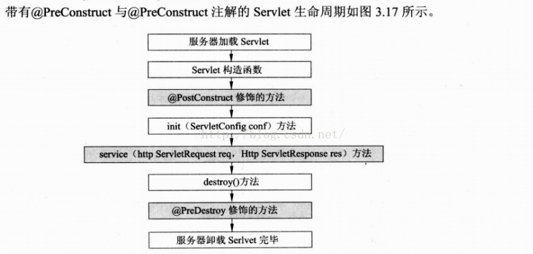
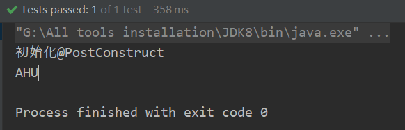

# @Bean 和@Configuration

Spring 的新 Java 配置支持中的主要工件是`@Configuration`注解 的类和`@Bean`注解 的方法。

`@Bean`注解 用于指示方法实例化，配置和初始化要由 Spring IoC 容器 Management 的新对象。对于熟悉 Spring 的`<beans/>` XML 配置的人来说，`@Bean`注解 与`<bean/>`元素具有相同的作用。您可以对任何 Spring `@Component`使用`@Bean`注解 的方法。但是，它们最常与`@Configuration` bean 一起使用。

用`@Configuration`注解 类表示该类的主要目的是作为 Bean 定义的来源。此外，`@Configuration`类通过调用同一类中的其他`@Bean`方法来定义 Bean 间的依赖关系。最简单的`@Configuration`类的内容如下：

```java
@Configuration
public class AppConfig {

    @Bean
    public MyService myService() {
        return new MyServiceImpl();
    }
}
```

用`<context:component-scanbase-package=”XXX”/>`扫描该类最终我们可以在程序里用`@AutoWired`或`@Resource`注解取得用`@Bean`注解的bean，和用xml先配置bean然后在程序里自动注入一样。目的是减少xml里配置。

上面的`AppConfig`类等效于下面的 Spring `<beans/>` XML：

```xml
<beans>
    <bean id="myService" class="com.acme.services.MyServiceImpl"/>
</beans>
```

# @Value

`@Value`只能放在**变量名或者setter方法上**，用于对变量对赋值，常常与`@Controller, @Service, @Repository,@Component`连用

```java
@Component
public class Student {
    @Value("薛宝钗")
    private String name;
    private int age;

    public Student(String name, int age) {
        this.name = name;
        this.age = age;
    }

    public Student() {
    }


    public void setName(String name) {
        this.name = name;
    }

    @Value("20")
    public void setAge(int age) {
        this.age = age;
    }

    public String getName() {
        return name;
    }

    public int getAge() {
        return age;
    }
}
```

# @PostConstruct和@PreDestroy

`@PostConstruct`：在构造方法和`init()`方法（如果有的话）之间得到调用，且只会执行一次。

`@PreDestory`：注解的方法在`destory()`方法调用后得到执行。



被`@PostConstruct`修饰的方法会在服务器加载Servlet的时候运行，并且只会被服务器调用一次，类似于Servlet的`init()`方法，`PostConstruct`从字面上将有“在构造函数之后运行”的意思，事实上,被`@PostConstruct`修饰的方法构造函数之后、`init()`方法之前运行。

被`@PreDestory`修饰的方法会在服务器卸载Servlet的时候运行，并且之后被服务器调用一次，类似于Servlet中的`destory()`方法，虽然PreDestory字面意思是在`destory`之前运行，但是被`@PreDestory`修饰的方法会在destory方法运行之后运行，在Servlet被彻底卸载之前，`PreDestory`里的Destory指的是Servlet的销毁，而不是`destory()`方法。

```java
@Component
public class ServiceTest {
    @Value("AHU")
    private String address;

    @PostConstruct
    public void init(){
        System.out.println("初始化@PostConstruct");
    }

    @PreDestroy
    public void destory(){
        System.out.println("销毁@PreDestroy");
    }

    public String getAddress() {
        return address;
    }

    public void setAddress(String address) {
        this.address = address;
    }
}
```

测试：

```java
@Test
public void test2(){
    ApplicationContext context = new ClassPathXmlApplicationContext("beans.xml");
    ServiceTest serviceTest = context.getBean("serviceTest", ServiceTest.class);
    System.out.println(serviceTest.getAddress());
}
```



引深一点，Spring 容器中的 Bean 是有生命周期的，Spring 允许在 Bean 在初始化完成后以及 Bean 销毁前执行特定的操作，常用的设定方式有以下三种：

1.通过实现`InitializingBean/DisposableBean`接口来定制初始化之后/销毁之前的操作方法；

2.通过 `<bean> `元素的`init-method/destroy-method`属性指定初始化之后 /销毁之前调用的操作方法；

3.在指定方法上加上`@PostConstruct`或`@PreDestroy`注解来制定该方法是在初始化之后还是销毁之前调用。

但他们之前并不等价。即使3个方法都用上了，也有先后顺序：

**Constructor > @PostConstruct >InitializingBean > init-method**

# @Controller, @Service, @Repository,@Component

目前4种注解意思是一样，并没有什么区别，区别只是名字不同。使用方法：

1.使用`<context:component-scanbase-package=”XXX”/>`扫描被注解的类

2.在类上写注解，同时还可以手动设置value值：

```java
@Component(value = "service")
public class ServiceTest{}
```
对应改变的就是bean的id

```java
@Test
public void test2(){
    ApplicationContext context = new ClassPathXmlApplicationContext("beans.xml");
    ServiceTest serviceTest = context.getBean("service", ServiceTest.class);
    System.out.println(serviceTest.getAddress());
}
```

# @Autowired

Autowired默认先按byType，如果发现找到多个bean，则，又按照byName方式比对，如果还有多个，则报出异常。

1.可以手动指定按byName方式注入，使用`@Qualifier`。

```java
//通过此注解完成从spring配置文件中查找满足Fruit的bean
//然后按@Qualifier指定pean
@Autowired
@Qualifier(“pear”)
public Fruit fruit;
```

2.如果要允许null 值，可以设置它的required属性为false，如：

```java
@Autowired(required=false) 
public Fruit fruit;
```

# @Resource

默认按 byName自动注入,如果找不到再按byType找bean,如果还是找不到则抛异常，无论按byName还是byType如果找到多个，则抛异常。

可以手动指定bean，它有2个属性分别是name和type，使用name属性，则使用byName的自动注入，而使用type属性时则使用byType自动注入。

```java
@Resource(name=”bean名字”)
```

或

```java
@Resource(type=”bean的class”)
```

**这个注解是属于J2EE的，减少了与spring的耦合。**

# @RequestBody

