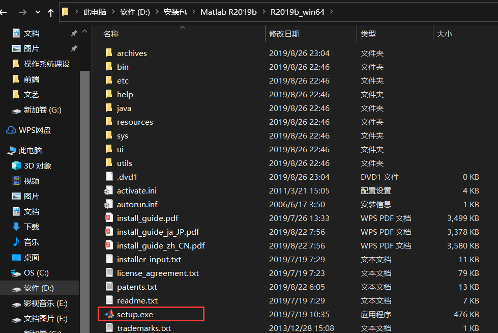
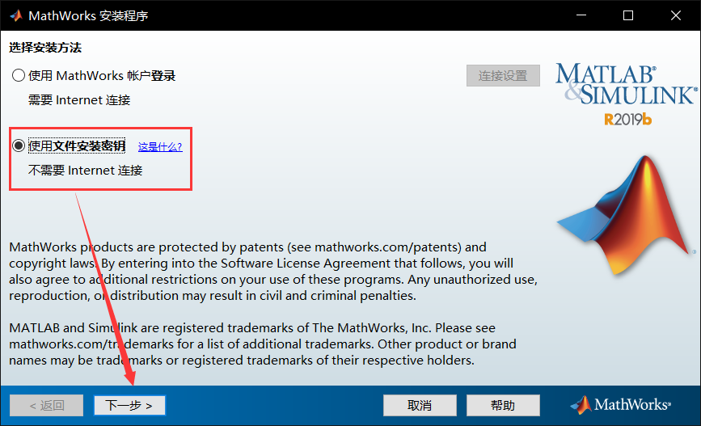
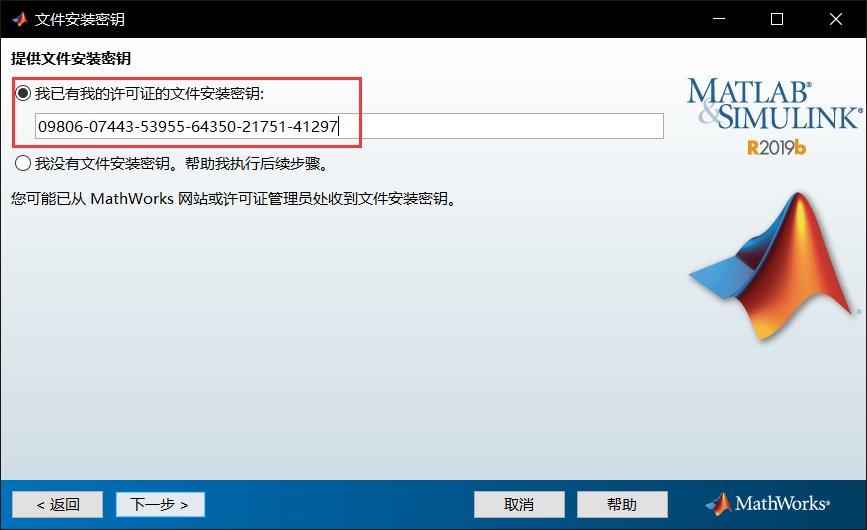
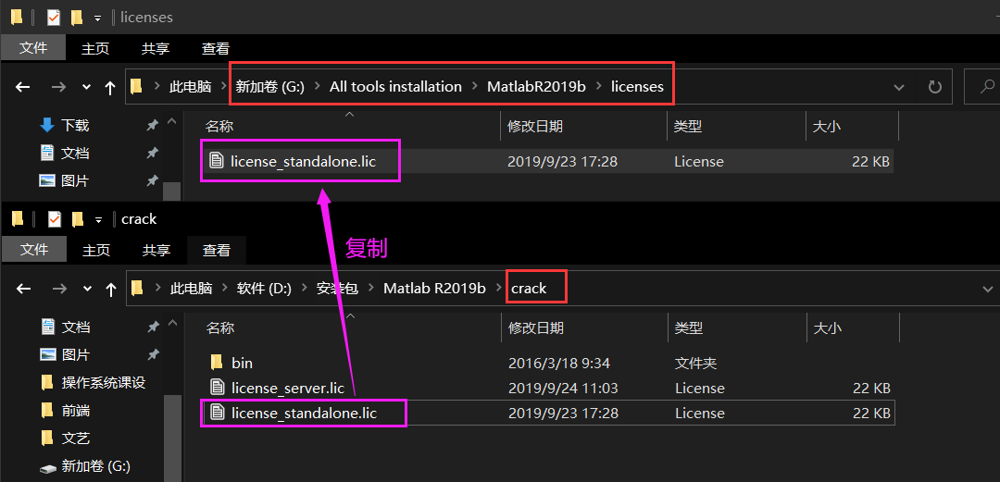
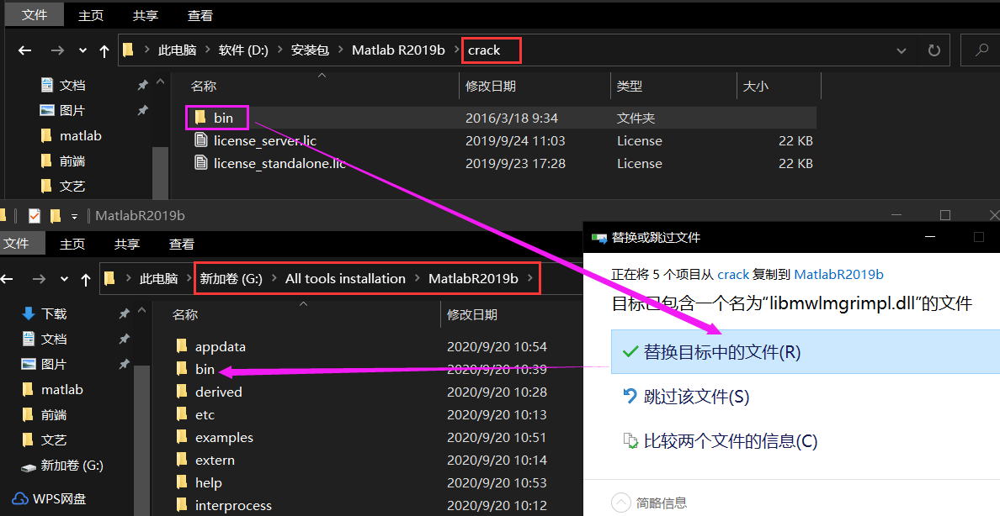

1.解压后点击`setup.exe`进行安装：

2.使用文件安装密钥，点击下一步，接受协议

3.输入文件安装密钥，点击下一步

4.选择自己需要的安装包和安装位置，点击下一步进行安装

5.复制`creck`目录下的`license_standalone.lic`文件到安装目录下的`licenses`文件夹里面，如果这步没有`licenses`文件夹需要自己创建

6.同样复制`bin`目录过来，并替换相关文件

7.最后打开`bin`目录下的`matlab.exe`文件，第一次打开等待时间较长