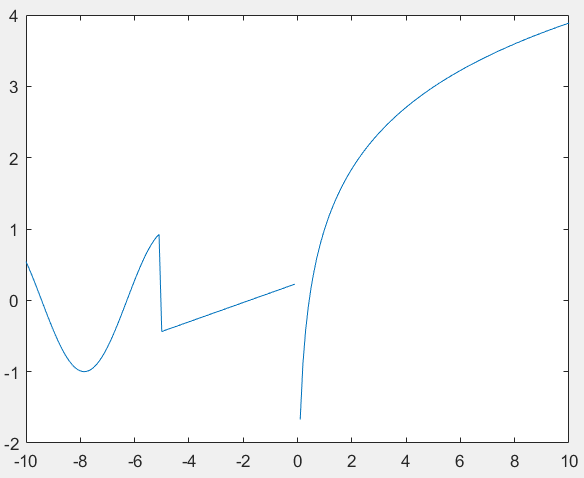
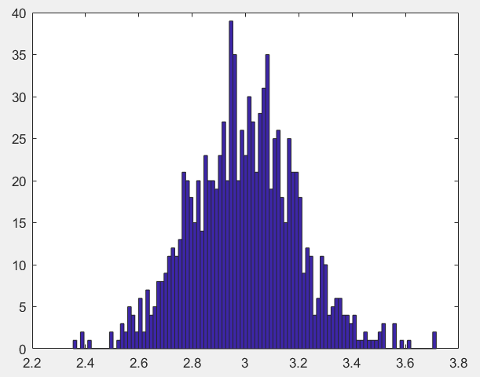
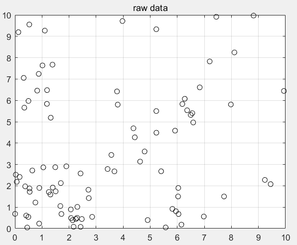
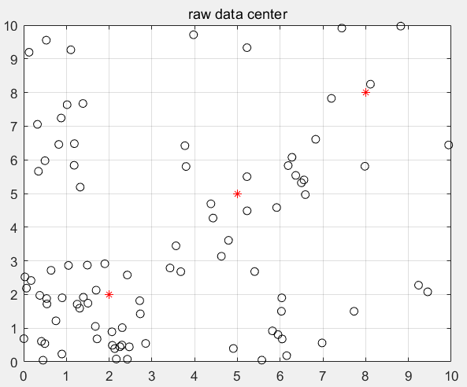
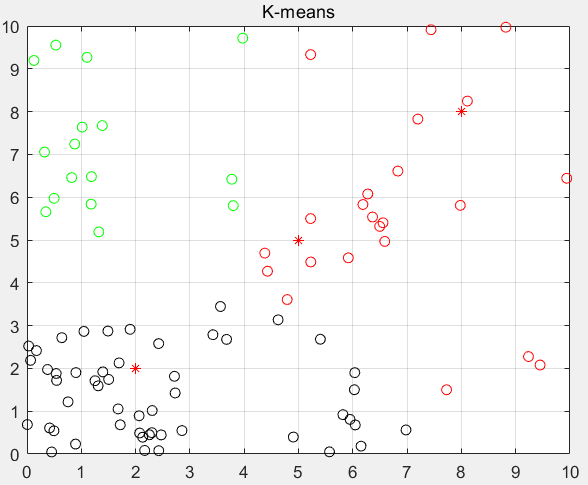

# 一

1.新建自定义函数`func.m`文件：

```matlab
function f=func(x)
f=sin(x).*(x>=-10 & x<-5)+(x+sqrt(pi))/exp(2).*(x>=-5 & x<=0)+(log(x)+x.^0.2).*(x>0 & x<=10);
end
```

2.调用该函数

```matlab
>> x=-10:0.1:10
>> y=func(x)
>> plot(x,y)
```

得到函数图像，区间为[-10,10]



3.求最大值

根据观察应该横坐标在`10`位置左右，而matlab中没有自带直接求最大的相关函数，因此这里**先求函数负值，再找到新函数的最小值，再讲最小值求负就是最大值。**

```matlab
>> [m,f_min]=fminbnd(@func,9,10)
m =
    9.9999
f_min =
   -3.8875
>> f_max=-f_min
f_max =
    3.8875
```

# 二

1.绘图

```matlab
>> D=normrnd(3,0.2,[1,1000])
>> hist(D,100)
```



2.求平均值、方差、最大值、最小值

```matlab
>> mean(D)
ans =
    2.9935
>> max(D)
ans =
    3.7157
>> min(D)
ans =
    2.3536
>> var(D)
ans =
    0.0399
```

# 三

1.K_means函数如下：

```matlab
function [label] = K_means (X, c)
len = length(X);
label= zeros(len,1);
C1 = c(1,:);
C2 = c(2,:);
C3 = c(3,:);
for i_for=1:100
    for i=1:len
        x_temp=X(i,:);
        d1=norm(x_temp-C1);
        d2=norm(x_temp-C2);
        d3=norm(x_temp-C3);
        d=[d1;d2;d3];
        [~,id]=min(d);
        label(i)=id;
    end
    L1=X(label==1,:);
    L2=X(label==2,:);
    L3=X(label==3,:);
    C1=mean(L1);
    C2=mean(L2);
    C3=mean(L3);
end
```

2.测试代码`main.m`文件如下：

```matlab
% 1.随机生成数据
a=rand(30,2)*3;
b=rand(30,2)*7;
c=rand(30,2)*10;
figure
plot(a(:,1),a(:,2),'ko');hold on;
plot(b(:,1),b(:,2),'ko');
plot(c(:,1),c(:,2),'ko');hold off;
grid on;
title('raw data');
% 2.初始化聚类中心
X=[a;b;c];
xstart=[2,2;5,5;8,8];
figure
plot(X(:,1),X(:,2),'ko');hold on;
plot(xstart(:,1),xstart(:,2),'r*');hold off;
grid on;
title('raw data center');
% 3.k-means
[label]=K_means(X,xstart);
figure
plot(X(label==1,1),X(label==1,2),'ko');hold on;
plot(X(label==2,1),X(label==2,2),'go');
plot(X(label==3,1),X(label==3,2),'ro');
plot(xstart(:,1),xstart(:,2),'r*');hold off;
grid on;
title('K-means');
```

原始数据：



确定聚类中心：

> 仔细观察图中可以发现有三个聚类中心，为红色`*`号



适用`[label]=K_means(X,xstart);`后得到结果如下：

