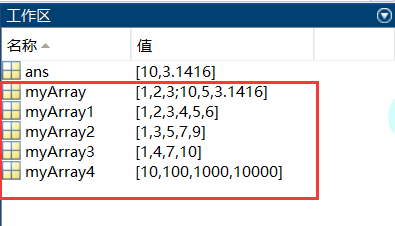

# 程序设计基础

## 运算符

MATLAB常用的运算符和特殊字符如下表所示：

| 运算符 |               目的               |
| :----: | :------------------------------: |
|   +    |          加；加法运算符          |
|   -    |          减；减法运算符          |
|   *    |       标量和矩阵乘法运算符       |
|   .*   |          数组乘法运算符          |
|   ^    |       标量和矩阵求幂运算符       |
|   .^   |          数组求幂运算符          |
|   \    |             矩阵左除             |
| **/**  |             矩阵右除             |
|   .\   |             阵列左除             |
|   ./   |             阵列右除             |
|   :    |        向量生成；子阵提取        |
|  ( )   |        下标运算；参数定义        |
|  [ ]   |             矩阵生成             |
|   .    | 点乘运算，常与其他运算符联合使用 |
|   …    |      续行标志；行连续运算符      |
|   ,    |     分行符（该行结果不显示）     |
|   ;    | 语句结束；分行符（该行结果显示） |
|   %    |             注释标志             |
|   _    |       引用符号和转置运算符       |
|   ._   |         非共轭转置运算符         |
|   =    |            赋值运算符            |

## 常量

`ans`：保存运算结果

`pi`：π

`inf`：无穷大，1/0

`eps`：系统运算时能确定的最小值

`NaN`：Not a Number，0/0

`i`或`j`：虚数单位

`realmax`：最大正实数

`realmin`：最小正实数

`tic`：秒表开始执行

`toc`：秒表停止

## 变量

### 显示格式

| format命令格式   | 例子                   |
| ---------------- | ---------------------- |
| `format`         | 3.1416                 |
| `format short`   | 3.1416                 |
| `format short e` | 3.1416e+000            |
| `format long`    | 3.141592653589793      |
| `format long e`  | 3.141592653589793e+000 |
| `format rat`     | 355/133                |
| `format bank`    | 3.14                   |

### 存取

`save filename`：保存所有变量到`filename.mat`文件中

`save filename 变量列表 -append` ：补充变量列表到`filename.mat`文件中


`load filename`：导入`filename.mat`文件中的全部变量

`load filename 变量列表 `：导入`filename.mat`文件中的变量列表中的变量

### 清除

`clear`：清除所有变量，释放内存

`clear all`：清除内存中所有变量、函数、MEX文件，使工作区变空；清除M文件的断点，并重新初始化永久变量。

## 数组

### 创建

1.一维数组

```matlab
clear
myArray1=[1,2,3,4,5,6]
myArray2=1:2:10
myArray3=linspace(1,10,4)
myArray4=logspace(1,4,4)
```

`linspace(a,b,N)`：起点为a，终点为b，构成数量为N的等差数列

`logspace(a,b,N)`：起点为$a^{10}$，终点为$b^{10}$，构成数量为N的等比数列

2.二维数组

```matlab
>> myArray=[1,2,3;sqrt(100),10-5,abs(-pi)]
myArray =
    1.0000    2.0000    3.0000
   10.0000    5.0000    3.1416
```



### 引用

1.一维数组

```matlab
% 取全部
>> myArray1
myArray1 =
     1     2     3     4     5     6
% 取2~4
>> myArray2(2:4)
ans =
     3     5     7
% 取位置为：1,4,5
>> myArray2([1 4 5])
ans =
     1     7     9
```

2.二维数组

> 注意：`matlab`中数组是从1开始，与C++/Java不同

```matlab
% 第2行第3列元素
>> myArray(2,3)
ans =
    3.1416
% 第2行中1~3列元素
>> myArray(2,1:3)
ans =
   10.0000    5.0000    3.1416
% 第2行中第1,3列元素
>> myArray(2,[1 3])
ans =
   10.0000    3.1416
```

# 线性代数

## 矩阵

矩阵运算：

- 转置——`M'`
- 矩阵的行列式——`det(M)`
- 矩阵的秩——`rank(M)`
- 逆矩阵——`inv(M)`
- 矩阵的迹——`trace(M)`
- 矩阵元素个数——`numel(M)`
- 矩阵的特征值——`eig(M)`
- A的n次幂——`M^n`
- 矩阵A和B里的元素相乘——`A .\* B`
- 选择A的第i行生成一个行向量——`ai=A(i，：)`
- 选择A的第j列生成一个列向量——`aj=A(：，j)`
- 生成n阶零矩阵——`zeros(n)`
- 生成n阶单位矩阵——`eye(n)`
- 两个向量的内积——`a1*a2'`

+ 取整：
  + `floor`：向下取整
  + `ceil`：向上取整；
  + `round`：四舍五入；
  + `fix`：去尾法
+ 变成有理数形式——`[n,d]=rat(M)`
+ 取余数——`R=rem(M,3)`
+ 形式改变
  + 左右翻转——`fliplr(M)`
  + 上下翻转——`flipud(M)`
  + 按指定维度翻转——`flipdim(M,dim)`
  + 逆时针旋转——`rot(M,k)`（表示逆时针旋转$k\times90^{\circ} ,k=\pm1,\pm2,...$）
  + 平铺矩阵——`repmat(M,m,n)`（表示得到的矩阵由$m\times n$块M矩阵平铺而成）

- 将非奇异矩阵A正交化为Q——`Q = orth(A)`   (Q' \* Q = 单位矩阵)
- 由已定义的矩阵A，E，O，A作为矩阵的子块，生成矩阵B——`B = [A，E；O，A]`
- 矩阵A的列向量组的极大线性无关组——`rref(A)`
- 条件数——`c = cond(A)`  默认为2条件数；p条件数：`c = cond(A，p)`

其他命令：

- 存储工作空间变量——`save 文件名 变量名`
- 查询函数的用法——`help 函数名`
- 列出所有变量的详细资料——`whos`
- 演示程序demo——`demo`

特殊矩阵：

- 全一矩阵——`y = ones(n)`、`y = ones(m，n)`
- 均匀分布随机矩阵——`y = rand(n)`、`y = rand(m，n)`
- 正态分布随机矩阵——`y = randn(n)`、`y = randn(m，n)`
- 线性等分向量——`y = linspace(a，b)`  默认100等分  %n等分： `y = linspace(a，b，n)`
- 对数等分向量——`y = logspace(a，b)`  默认50等分   %n等分：`y = logspace(a，b，n)`
- 矩阵A中元素的个数——`n = numel(A)`
- 以输入元素为对角线元素的矩阵——`out = blkdiag(a,b,c...)`
- n阶Hadamard矩阵——`H = hadamard(n)`
- Hankel矩阵——`H = hankel(c)`  第一列元素为c，反三角以下元素为0
- n阶Hilbert矩阵——`H = hilb(n)` 、`H(i，j) = 1/(i+j-1)`
- n阶逆Hilbert矩阵——`H = invhilb(n)`
- n阶魔方矩阵——`M = magic(n)`

向量的范数——`n = norm(X)` 

矩阵的范数——`n = norm(A)` 

> 数学定义为矩阵A的条件数等于A的范数与A的逆的范数的乘积，即`cond(A) = ‖ A ‖·‖ A逆 ‖`

LU = A——`[L，U] = lu(A)`

LU = PA——`[L，U，P] = lu(A)`

> U为上三角阵，L为下三角阵或其变换形式，P为单位矩阵的行变换矩阵

$$
\begin{bmatrix}
{a_{11}}&{a_{12}}&{\cdots}&{a_{1n}}\\\\
{a_{21}}&{a_{22}}&{\cdots}&{a_{2n}}\\\\
{\vdots}&{\vdots}&{\ddots}&{\vdots}\\\\
{a_{m1}}&{a_{m2}}&{\cdots}&{a_{mn}}\\\\
\end{bmatrix}
$$

# 附：matlab命令

### MATLAB管理会话的命令

MATLAB提供管理会话的各种命令。如下表所示：

|  命令   |        目的/作用         |
| :-----: | :----------------------: |
|   clc   |      清除命令窗口。      |
|  clear  |    从内存中删除变量。    |
|  exist  |  检查存在的文件或变量。  |
| global  |     声明变量为全局。     |
|  help   |      搜索帮助主题。      |
| lookfor |   搜索帮助关键字条目。   |
|  quit   |       停止MATLAB。       |
|   who   |      列出当前变量。      |
|  whos   | 列出当前变量（长显示）。 |

### MATLAB的系统命令

使用MATLAB的时候有一些系统命令可以方便我们的操作，如在当前的工作区中可以使用系统命令保存为一个文件、加载文件、显示日期、列出目录中的文件和显示当前目录等。

下表列举了一些MATLAB常用的系统相关的命令：

|  命令   |            目的/作用             |
| :-----: | :------------------------------: |
|   cd    |          改变当前目录。          |
|  date   |          显示当前日期。          |
| delete  |          删除一个文件。          |
|  diary  |     日记文件记录开/关切换。      |
|   dir   |    列出当前目录中的所有文件。    |
|  load   |  负载工作区从一个文件中的变量。  |
|  path   |          显示搜索路径。          |
|   pwd   |          显示当前目录。          |
|  save   |  保存在一个文件中的工作区变量。  |
|  type   |       显示一个文件的内容。       |
|  what   | 列出所有MATLAB文件在当前目录中。 |
| wklread |      读取.wk1电子表格文件。      |

### MATLAB输入和输出命令

MATLAB提供了以下输入和输出相关的命令：

|  命令   |          作用/目的           |
| :-----: | :--------------------------: |
|  disp   | 显示一个数组或字符串的内容。 |
| fscanf  |    阅读从文件格式的数据。    |
| format  |     控制屏幕显示的格式。     |
| fprintf | 执行格式化写入到屏幕或文件。 |
|  input  |     显示提示并等待输入。     |
|    ;    |       禁止显示网版印刷       |

fscanf和fprintf命令的行为像C scanf和printf函数。他们支持格式如下代码：

| 格式代码 |                 目的/作用                  |
| :------: | :----------------------------------------: |
|  **%s**  |                 输出字符串                 |
|  **%d**  |                  输出整数                  |
|  **%f**  |                 输出浮点数                 |
|  **%e**  |             显示科学计数法形式             |
|  **%g**  | %f 和%e 的结合，根据数据选择适当的显示方式 |

用于数字显示格式的函数有以下几种形式：

|   Format函数   |      最多可显示      |
| :------------: | :------------------: |
|  format short  | 四位十进制数（默认） |
|  format long   |     15位定点表示     |
| format short e |     五位浮点表示     |
| format long e  |     15位浮点表示     |
|  format bank   |    两个十进制数字    |
|    format +    |      正，负或零      |
|   format rat   |      有理数近似      |
| format compact |   变量之间没有空行   |
|  format loose  |    变量之间有空行    |

### MATLAB向量，矩阵和阵列命令

下表列出了MATLAB用于工作数组、矩阵和向量的各种命令：

|   命令   |           作用/目的            |
| :------: | :----------------------------: |
|   cat    |            连接数组            |
|   find   |       查找非零元素的索引       |
|  length  |          计算元素数量          |
| linspace |          创建间隔向量          |
| logspace |        创建对数间隔向量        |
|   max    |          返回最大元素          |
|   min    |          返回最小元素          |
|   prod   |      计算数组元素的连乘积      |
| reshape  | 重新调整矩阵的行数、列数、维数 |
|   size   |          计算数组大小          |
|   sort   |           排序每个列           |
|   sum    |            每列相加            |
|   eye    |        创建一个单位矩阵        |
|   ones   |          生成全1矩阵           |
|  zeros   |           生成零矩阵           |
|  cross   |        计算矩阵交叉乘积        |
|   dot    |          计算矩阵点积          |
|   det    |        计算数组的行列式        |
|   inv    |          计算矩阵的逆          |
|   pinv   |         计算矩阵的伪逆         |
|   rank   |          计算矩阵的秩          |
|   rref   |       将矩阵化成行最简形       |
|   cell   |          创建单元数组          |
| celldisp |          显示单元数组          |
| cellplot |     显示单元数组的图形表示     |
| num2cell |    将数值阵列转化为异质阵列    |
|   deal   |       匹配输入和输出列表       |
|  iscell  |       判断是否为元胞类型       |

### MATLAB绘图命令

MATLAB提供了大量的命令绘制图表。下表列出了一些常用的命令绘制：

|   命令    |         作用/目的          |
| :-------: | :------------------------: |
|   axis    |     人功选择坐标轴尺寸     |
|   fplot   |        智能绘图功能        |
|   grid    |         显示网格线         |
|   plot    |          生成XY图          |
|   print   |      打印或绘图到文件      |
|   title   |       把文字置于顶部       |
|  xlabel   |    将文本标签添加到x轴     |
|  ylabel   |    将文本标签添加到y轴     |
|   axes    |         创建轴对象         |
|   close   |       关闭当前的绘图       |
| close all |        关闭所有绘图        |
|  figure   |    打开一个新的图形窗口    |
|   gtext   |  通过鼠标在指定位置放注文  |
|   hold    |        保持当前图形        |
|  legend   |        鼠标放置图例        |
|  refresh  |    重新绘制当前图形窗口    |
|    set    |    指定对象的属性，如轴    |
|  subplot  |      在子窗口中创建图      |
|   text    |        在图上做标记        |
|    bar    |         创建条形图         |
|  loglog   |        创建双对数图        |
|   polar   |       创建极坐标图像       |
| semilogx  | 创建半对数图（对数横坐标） |
| semilogy  | 创建半对数图（对数纵坐标） |
|  stairs   |         创建阶梯图         |
|   stem    |         创建针状图         |