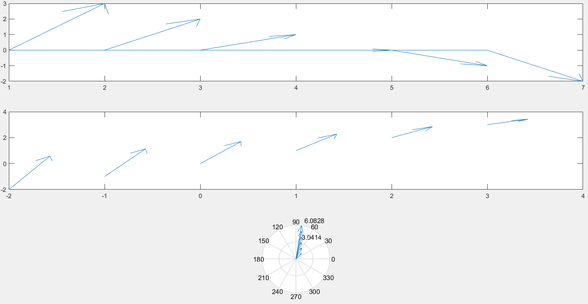

# 窗口

1.`figure`：创建单个窗口

2.`subplot`：创建多重子窗口

`subplot(m,n,p)`：创建$m\times n$个子窗口，p代表子窗口的序号

```matlab
>> clear
>> clf
>> x=0:0.01:2*pi
>> y1=sin(x);y2=sin(2*x);y3=sin(3*x);y4=sin(4*x)
>> a=subplot(2,2,1);plot(x,y1)
>> b=subplot(2,2,2);plot(x,y2)
>> c=subplot(2,2,3);plot(x,y3)
>> d=subplot(2,2,4);plot(x,y4)
```


# 二维绘图

1.`plot(x,y)`：以x元素为橫坐标值，以y元素为纵坐标值

`plot(x,y1,x,y2,x,y3,x,y4……,x,yn)`：以x元素为橫坐标值，以`y1,y2,……yn`元素值为纵坐标值绘制曲线

```matlab
>> x=[1,2,3,4,5]
>> y=[0,2,4,0,10]
>> plot(x,y)
```


2.`hist(x,y)`：以向量y的各个元素值为统计范围，绘制x的分布图

```matlab
>> x=randn(10000,1)
>> y=-4:0.2:4
>> hist(x,y)
```


3.`bar(y)`：绘制柱状图，默认x=1：size(y)，y是向量

`bar(x,y)`：x必须单调递增或递减，y为$m\times n$矩阵

```matlab
>> y=[1,2,3,4;2,3,4,5;5,6,7,8];
>> subplot(3,1,1);bar(y)
% 宽度为0.1
>> subplot(3,1,2);bar(y,0.1,'grouped')
% 将垂直柱叠加起来
>> subplot(3,1,3);barh(y,'stack')
```


4.`pie(x)`：绘制饼图

`pie(x,explode)`：分离非零部分

```matlab
>> x=[32,58,27,21,16]
>> subplot(1,3,1);pie(x);
>> explode=[0,0,1,0,1]
>> subplot(1,3,2);pie(x,explode);
>> subplot(1,3,3);pie(x,{'林黛玉','薛宝钗','贾探春','史湘云','贾惜春'});
```


5.`area(x,y)`：在plot基础上填充x轴和y轴

```matlab
>> x=0:0.1:2*pi
>> subplot(1,2,1);area(x,y)
>> subplot(1,2,2);plot(x,y)
```


6.`stem(x,y)`：针状图

7.`stairs()`：阶梯图

8.向量图


```matlab
>> subplot(3,1,1);feather(u,x)
>> subplot(3,1,2);quiver(x,y,u,v)
>> subplot(3,1,3);compass(u,v)
```



# 图形修饰

1.获取鼠标位置

```matlab
>> [x,y]=ginput(5);plot(x,y);
```


2.图形格式设置


```matlab
>> x=0:pi/10:2*pi;
>> y1=sin(x);y2=cos(x);
>> plot(x,y1,'r+-',x,y2,'K*:');
```


3.坐标轴定义和设置

`axis([xmin,xmax,ymin,ymax])`：指定坐标轴范围

`axis equal`：x轴和y轴比例尺相同

`axis square`：坐标图框成正方形

`axis off`：清除坐标刻度

4.图例

```matlab
>> x=0:pi/10:2*pi
>> subplot(2,1,1);plot(x,y1,x,y2);
>> subplot(2,1,2);plot(x,y1,x,y2);legend('sin(x)','cos(x)');
```


5.文字及标题设置

```matlab
>> x=0:pi/10:2*pi
>> plot(x,y)
>> text(3.5,0,'sin(x)')
% gtext是由鼠标选中位置的
>> gtext('sin(x)实例查看')
>> title('Long的sin(x)图像')
>> xlabel('x axis');ylabel('y axis');
```


6.增加图片元素

`hold on`：保持窗口不变

`hold off`：释放已绘制的图形，使新图覆盖旧图

`hold`：在`hold on`和`hold off`命令切换

7.get和set

得到或设置图形句柄信息，如坐标轴或曲线信息

# 三维绘图

1.`plot3(x1,y1,z1,x2,y2,z2,……,xn,yn,zn)`

```matlab
>> t=0:pi/10:2*pi;
>> y1=sin(t);y2=cos(t);
>> subplot(1,2,1);plot3(y1,y2,t);
>> subplot(1,2,2);plot3(y1,y2,t);grid on;
>> xlabel('依赖变量Y1');
>> ylabel('依赖变量Y2');
>> zlabel('依赖变量X');
>> title('Sin and Cos Curve');
```


2.曲面图

`mesh(X,Y,Z)`：三维网格曲面图，X、Y、Z都是二维矩阵值

`meshc(X,Y,X)`：三维网格曲面图，增加等值线

`meshz(X,Y,X)`：三维网格曲面图，增加零平面

`surf(X,Y,Z)`：三维曲面图

`surfc(X,Y,X)`：三维曲面图，增加等值线

3.三维柱状图

`bar3(x,mode)`

```matlab
>> x=[1,4,7]
>> subplot(2,2,1);bar3(y);
>> subplot(2,2,2);bar3(x,y);
>> subplot(2,2,3);bar3(x,y,'stack');
>> subplot(2,2,4);bar3h(x,y);
```

