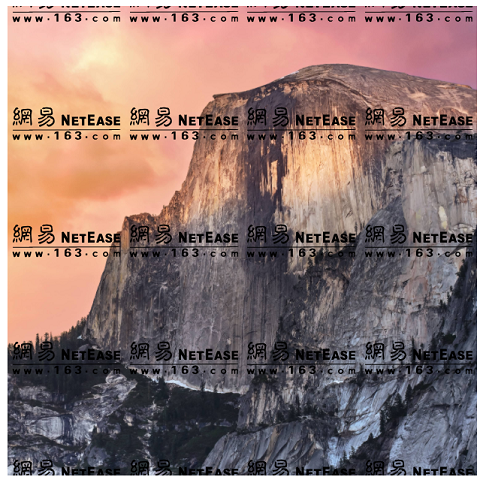

# background

## 属性详解

-  background-color：颜色
  - `transparent`：透明(`默认`)
  - `Keyword`：颜色关键字
  - `HEX`：十六进制色彩模式
  - `RGB`或`RGBA`：RGB/A色彩模式
  - `HSL`或`HSLA`：HSL/A色彩模式
  - `Color1/Color2`：覆盖颜色，背景颜色可能是`Color1`，若背景图像无效则使用`Color2`代替`Color1`
-  background-image：图像
  - `none`：无图像(`默认`)
  - `url()`：图像路径
-  background-repeat：图像平铺方式
  - `repeat`：图像在水平方向和垂直方向重复(`默认`)
  - `repeat-x`：图像在水平方向重复
  - `repeat-y`：图像在垂直方向重复
  - `no-repeat`：图像仅重复一次
  - `space`：图像以相同间距平铺且填充整个节点
  - `round`：图像自动缩放直到适应且填充整个节点
-  background-attachment：图像依附方式
  - `scroll`：图像随页面滚动而移动(`默认`)
  - `fixed`：图像不会随页面滚动而移动
-  background-position：图像起始位置
  - `Position`：位置，可用任何长度单位，第二个位置(Y轴)不声明默认是`50%`(默认`0% 0%`)
  - `Keyword`：位置关键字`left、right、top、bottom、center`，可单双使用，第二个关键字不声明默认是`center`
-  background-size：图像尺寸模式
  - `auto`：自动设置尺寸(`默认`)
  - `cover`：图像扩展至足够大，使其完全覆盖整个区域，图像某些部分也许无法显示在区域中
  - `contain`：图像扩展至最大尺寸，使其宽度和高度完全适应整个区域
  - `Size`：尺寸，可用任何长度单位，第二个尺寸(高)不声明默认是`auto`
-  background-origin：定位区域(与`background-position`结合使用)
  - `padding-box`：图像相对填充定位(`默认`)
  - `border-box`：图像相对边框定位
  - `content-box`：图像相对内容定位
-  background-clip：绘制区域
  - `border-box`：图像被裁剪到边框与边距的交界处(`默认`)
  - `padding-box`：图像被裁剪到填充与边框的的交界处
  - `content-box`：图像被裁剪到内容与填充的交界处
-  background-blend-mode：混合模式
  - `normal`：正常(`默认`)
  - `color-burn`：颜色加深
  - `color-dodge`：颜色减淡
  - `color`：颜色
  - `darken`：变暗
  - `difference`：差值
  - `exclusion`：排除
  - `hard-light`：强光
  - `hue`：色相
  - `lighten`：变亮
  - `luminosity`：亮度
  - `multiply`：正片叠底
  - `overlay`：叠加
  - `saturation`：饱和度
  - `screen`：滤色
  - `soft-light`：柔光

总体来说，`background`简单易用，以下三点可能需加注意。

- `repeat`和`position`包含后缀为`-x`和`-y`这两个子属性，若单独声明使用`x`或`y`即可
- `position`的`x`和`y`允许负值，当赋值`x`时正值向右负值向左，当赋值`y`时正值向下负值向上
- `background`声明多个图像路径时，若不声明`position`，那么首个图像定位在节点最顶部，剩余图像依次顺序显示
- 对于兼容性比较低的浏览器，`size`不能在`background`中连写，需单独编写

## 贴顶背景

```html
<style>
    .pasted-bg{
        display:flex;
        justify-content:center;
        align-items:center;
        height: 500px;
        /* 背景颜色 背景图像 仅重复一次 起始位置(center,top) 尺寸 */
        background: #000 url('https://static.yangzw.vip/codepen/mountain.jpg') no-repeat center center/auto 500px;
        font-weight: bold;
        font-size: 50px;
        color: #fff;
    }
</style>
<div class="pasted-bg">Background</div>
```


## 多重背景

CSS3的`background`不仅仅增加了`size`、`origin`和`clip`这三个子属性，还增加了`多重背景`这个强大功能。多重背景可从上到下从左到右拼接背景图像，也可叠加背景图像。

```html
<style>
    .overlying-bg {
        margin-left: 20px;
        width: 400px;
        height: 400px;
        background-image: url("https://static.yangzw.vip/codepen/logo.svg"), url("https://static.yangzw.vip/codepen/mountain.jpg");
        background-repeat: repeat, no-repeat;
        background-position: left, center;
        background-size: auto 100px, auto 400px;
    }
</style>
<div class="overlying-bg"></div>
```

声明顺序靠前的背景图像的层叠等级比较高，叠加背景图像时，靠前的背景图像尽量使用`png`格式才能让靠后的背景图像显示，否则可能遮挡靠后的背景图像。



## 渐变

CSS渐变分为三种，每一种都有自身的特点。

-  **线性渐变**：沿着指定方向从起点到终点逐渐改变颜色，渐变形状是一条`直线`
-  **径向渐变**：沿着任意方向从圆心往外面逐渐改变颜色，渐变形状是一个`圆形`或`椭圆形`
-  **锥形渐变**：沿着顺时针方向从圆心往外面逐渐改变颜色，渐变形状是一个`圆锥体`


