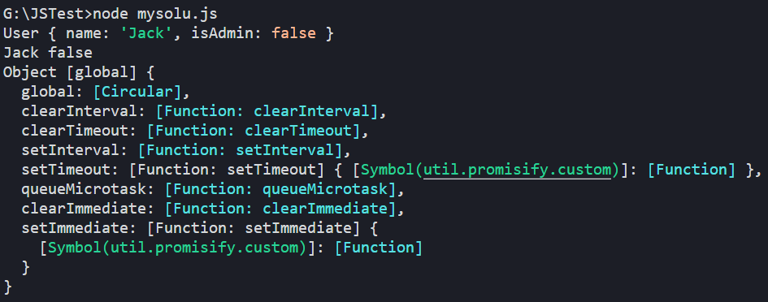
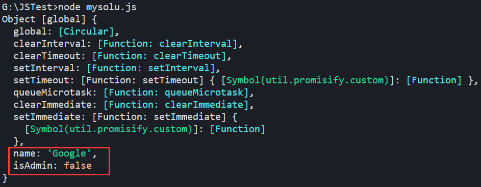
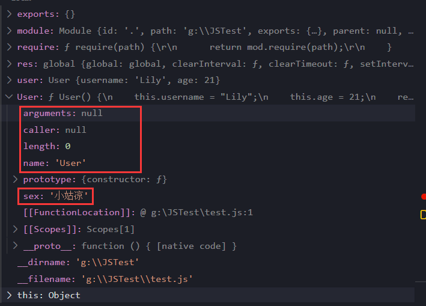
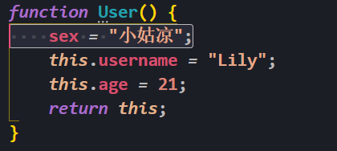
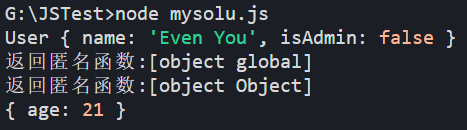
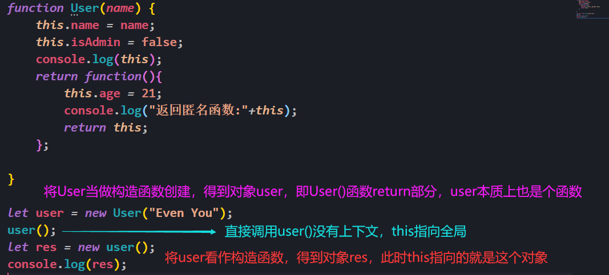

# 普通函数和构造函数的区别

```js
// 构造器的使用方法
function User(name) {
    // this = {};（隐式创建）
    // 给构造器添加属性
    this.name = name;
    this.isAdmin = false;
    console.log(this);
    // return this;（隐式返回）
}
// 给User本身附加sex属性
User.sex = "小姑凉";
function Admin() {
    console.log(this);
}
let user = new User("Jack");
console.log(user.name + " "+user.isAdmin);
Admin();
```

输出：



在上面中User()构造函数，但Admin()是普通函数，**区别看它是直接调用还是new出来**

+ 直接调用，this指向全局
+ new，这时候当做构造函数，this指向new出来的对象

```js
// this指向全局，因此这里是给全局附加name和isAdmin
function User(name) {
    this.name = name;
    this.isAdmin = false;
    console.log(this);
}
User("Google");
```



# 函数属性与构造属性区别

```js
function User() {
    this.username = "Lily";
    this.age = 21;
    return this;
}

User.sex = "小姑凉";

let res = User();
console.log(res);

let user = new User();
console.log(user)
```

这段代码中：

- `User.sex = "小姑凉";`是函数属性
- `this.username = "Lily";`是构造属性

直接调用`User()`，this指向全局，这时给this指向的全局附加`    this.username = "Lily"; this.age = 21;`，返回this

`new User()`调用，this指向User，附加属性后返回this

整个过程中sex并没有参与，那到哪去了？



从图中可以看出，sex变成了和arguments、caller、name、prototype一类的属性，那么访问方式就相同了：

```js
console.log(User.name+" "+User.sex);
```

还有一种写法，如下：



这种写法啥反应都没有，也不是局部变量，是冗余代码

# 构造函数与闭包

```js
function User(name) {
    this.name = name;
    this.isAdmin = false;
    console.log(this);
    return function(){
        this.age = 21;
        console.log("返回匿名函数:"+this);
        return this;
    };

}

let user = new User("Even You");
user(); // 不new对象，直接调用函数
let res = new user(); // new对象方式调用函数
console.log(res);
```

上面这段代码运行结果如下：



代码执行：



# 函数绑定问题

```js
let user = {
    firstName: "John",
    sayHi() {
        console.log(`Hello,${this.firstName}`);
    }
}

user.sayHi(); 	// Hello,John
setTimeout(user.sayHi, 1000); 	// Hello,undefined
```

浏览器中的 `setTimeout` 方法有些特殊：它为函数调用设定了 `this=window`。因此无法获得`this.firstName`

**解决方案一：包装器**

```js
setTimeout(function () {
    user.sayHi();
}, 1000); 	// Hello,John
```

**解决方案二：bind**

使用bind手动绑定this的对象

```js
setTimeout(user.sayHi.bind(user), 1000); 	// Hello,John
```

# 数组、类数组对象和可迭代对象

Iterable：如上所述，是实现了 `Symbol.iterator` 方法的对象。

Array-like：有索引和 `length` 属性的对象，所以它们看起来很像数组。

> 所有的可迭代对象都能`for(let … of …)`

```js
// 可迭代对象
let range = {
    from: 1,
    to: 5,
    [Symbol.iterator](){
        return {
            current: this.from,
            last: this.to,
            next() {
                if (this.current <= this.last) {
                    return { done: false, value: this.current++ };
                } else {
                    return { done: true };
                }
            }
        };
    }
};
// 调用[Symbol.iterator]函数，return的是一个对象
let iterator = range[Symbol.iterator]();
while (true) {
    // 调用返回对象的next()方法，进行手动迭代
    // 得到的result也是一个对象
    let result = iterator.next();
    if (result.done) {
        break;
    }
    // 访问result中的value
    console.log(result.value);
}
```

```js
// 类数组对象
let arrayLike = { // 有索引和 length 属性 => 类数组对象
    0: "Hello",
    1: "World",
    length: 2
};

// Error (no Symbol.iterator)
for (let item of arrayLike) {}
```

可迭代对象和类数组对象通常都 **不是数组**，它们没有 `push` 和 `pop` 等方法。

`Array.from(range);`：将类数组对象和可迭代对象转换为数组

+ 可迭代对象：调用迭代器将结果装入到一个数组中
+ 类数组对象：取属性装入到数组

```js
let arrayLike = {
    0: "Hello",
    1: "World",
    length: 2
};

console.log(arrayLike); // { '0': 'Hello', '1': 'World', length: 2 }
let arr = Array.from(arrayLike);
console.log(arr); // [ 'Hello', 'World' ]
```

| 对象种类   | 特点                                                         | 是否可迭代 |
| ---------- | ------------------------------------------------------------ | ---------- |
| 可迭代对象 | 可用`[Symbol.iterator]函数`和`next()`迭代                    | √          |
| 类数组对象 | 有索引和 `length` 属性                                       | ×          |
| 数组       | 既可以迭代又可以索引，另外可以`pop()、push()、shift()、unshift()` | √          |


