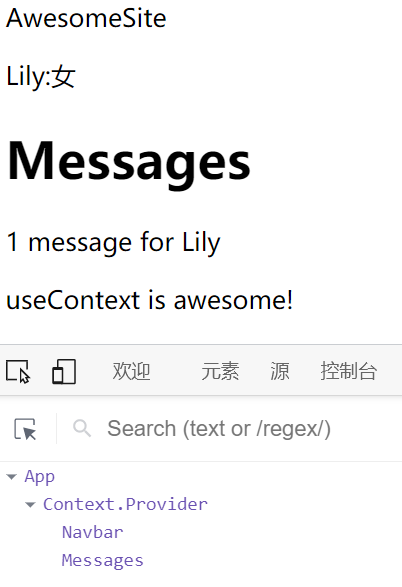

# 组件类的缺点

- 大型组件很难拆分和重构，也很难测试。
- 业务逻辑分散在组件的各个方法之中，导致重复逻辑或关联逻辑。
- 组件类引入了复杂的编程模式，比如 render props 和高阶组件。

# Hook

```jsx
function Welcome(props) {
    return <h1>Hello, {props.name}</h1>;
}
```

**React Hooks 的设计目的，就是加强版函数组件，完全不使用"类"，就能写出一个全功能的组件。组件尽量写成纯函数，如果需要外部功能和副作用，就用钩子把外部代码"钩"进来。** 

React 默认提供的四个最常用的钩子：

- useState()
- useContext()
- useReducer()
- useEffect()

# useState()：状态钩子

```jsx
import React, { useState } from "react";

export default function  Button()  {
    const [buttonText, setButtonText] = useState("Click me,please");

    function handleClick()  {
        return setButtonText("Thanks, been clicked!");
    }

    return  <button  onClick={handleClick}>{buttonText}</button>;
}
```

`const [buttonText, setButtonText] = useState("Click me,please");`：定义一个state变量`buttonText`，赋初值为`"Click me,please"`，同时为它定义一个setter函数

# useContext()：共享状态钩子

- 使用 React Context API，在组件外部建立一个 Context。
- `AppContext.Provider`提供了一个 Context 对象，这个对象可以被子组件共享。
- `useContext()`钩子函数用来引入 Context 对象，从中获取`username`属性。

```jsx
import React, { useContext } from "react";
import ReactDOM from "react-dom";

// 创建共享状态钩子
const AppContext = React.createContext({});

const Navbar = () => {
    const { username, sex } = useContext(AppContext)
    return (
        <div className="navbar">
            <p>AwesomeSite</p>
            <p>{username + ':' + sex}</p>
        </div>
    )
}

const Messages = () => {
    const { username } = useContext(AppContext)
    return (
        <div className="messages">
            <h1>Messages</h1>
            <p>1 message for {username}</p>
            <p className="message">这是一条消息!</p>
        </div>
    )
}

// AppContext.Provider提供了一个 Context 对象，这个对象可以被子组件共享。
function App() {
    let people = {
        username: 'Lily',
        sex: '女'
    }
    return (
        <AppContext.Provider value={people}>
            <div className="App">
                <Navbar />
                <Messages />
            </div>
        </AppContext.Provider>
    );
}

const rootElement = document.getElementById("root");
ReactDOM.render(<App />, rootElement);
```



# useReducer()：action 钩子

Redux 的核心概念是，组件发出 action 与状态管理器通信。状态管理器收到 action 以后，使用 Reducer 函数算出新的状态，Reducer 函数的形式是`(state, action) => newState`。

`useReducers()`钩子用来引入 Reducer 功能。

```jsx
import React, { useReducer } from "react";
import ReactDOM from "react-dom";

// 用于计算状态的 Reducer函数
const myReducer = (state, action) => {
    switch (action.type) {
        case ('countUp'):
            return {
                ...state,
                count: state.count + 1
            }
        default:
            return state
    }
}

function App() {
    // 引入Reducer功能
    // 数组的第一个成员是状态的当前值，第二个成员是发送action的dispatch函数。
    const [state, dispatch] = useReducer(myReducer, { count: 0 })

    return (
        <div className="App">
            <button onClick={() => dispatch({ type: 'countUp' })}>
                +1
      </button>
            <p>Count: {state.count}</p>
        </div>
    );
}

const rootElement = document.getElementById("root");
ReactDOM.render(<App />, rootElement);
```

由于 Hooks 可以提供共享状态和 Reducer 函数，所以它在这些方面可以取代 Redux。但是，它没法提供中间件（middleware）和时间旅行（time travel），如果你需要这两个功能，还是要用 Redux。

# useEffect()：副作用钩子

`useEffect()`用来引入具有副作用的操作，最常见的就是向服务器请求数据。以前，放在`componentDidMount`里面的代码，现在可以放在`useEffect()`。

`useEffect()`接受两个参数。第一个参数是一个函数，异步操作的代码放在里面。第二个参数是一个数组，用于给出 Effect 的依赖项，只要这个数组发生变化，`useEffect()`就会执行。第二个参数可以省略，这时每次组件渲染时，就会执行`useEffect()`。


