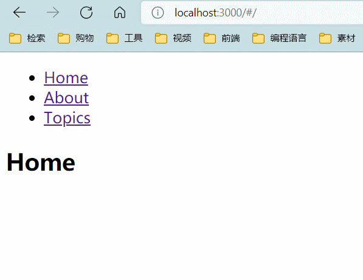

# React Router基本认知

## 安装

```bash
# 全局安装create-react-app脚手架
npm install -g create-react-app
# 建立一个react项目
create-react-app react-router-demo
# 进入项目目录
cd react-router-demo
# 安装react-router-dom
npm install --save react-router-dom
```

## 三要素

根据官网，主要是下面三个：

- routers, like `<BrowserRouter>` and `<HashRouter>`，核心路由组件，必须要有的
- route matchers, like `<Route>` and `<Switch>`，路由匹配器，用于根据路径匹配到相应的组件
- and navigation, like `<Link>`, `<NavLink>`, and `<Redirect>`，导航作用

## 常用依赖

`react-router` React Router 核心

`react-router-dom` 用于 DOM 绑定的 React Router

`react-router-native` 用于 React Native 的 React Router

`react-router-redux` React Router 和 Redux 的集成

`react-router-config` 静态路由配置的小助手

# 举例分析

## 例1

这个官网的例子：

```jsx
import React from "react";
import {
    HashRouter as Router,
    Switch,
    Route,
    Link,
    useRouteMatch,
    useParams
} from "react-router-dom";
export default function App() {
    return (
        <Router>
            <div>
                <ul>
                    <li>
                        <Link to="/">Home</Link>
                    </li>
                    <li>
                        <Link to="/about">About</Link>
                    </li>
                    <li>
                        <Link to="/topics">Topics</Link>
                    </li>
                </ul>

                <Switch>
                    <Route path="/about">
                        <About />
                    </Route>
                    <Route path="/topics">
                        <Topics />
                    </Route>
                    <Route path="/">
                        <Home />
                    </Route>
                </Switch>
            </div>
        </Router>
    );
}
function Home() {
    return <h2>Home</h2>;
}
function About() {
    return <h2>About</h2>;
}
function Topics() {
    let match = useRouteMatch();
    console.log(match);
    return (
        <div>
            <h2>Topics</h2>
            <ul>
                <li>
                    <Link to={`${match.url}/components`}>Components</Link>
                </li>
                <li>
                    <Link to={`${match.url}/props-v-state`}>
                        Props v. State
                    </Link>
                </li>
            </ul>
            <Switch>
                <Route path={`${match.path}/:topicId`}>
                    <Topic />
                </Route>
                <Route path={match.path}>
                    <h3>Please select a topic.</h3>
                </Route>
            </Switch>
        </div>
    );
}

function Topic() {
    let { topicId } = useParams();
    console.log(topicId);
    return <h3>Requested topic ID: {topicId}</h3>;
}
```

这是一个二级路由，`<BrowserRouter>`是代表这个标签内部路由生效，`<Switch>`和`<Route>`表示路径切换的匹配，`<Link>`表示跳转到这个url，类似于常规标签里面的链接。



## 例2

```js
const routes = [
    {
        path: "/",
        component: Home,
        routes: [
            {
                path: "/",
                exact: true,
                render: () => <Redirect to={"/recommend"} />
            },
            {
                path: "/recommend",
                component: Recommend
            },
            {
                path: "/singers",
                component: Singers
            },
            {
                path: "/rank",
                component: Rank
            }
        ]
    }
]
export default routes;
```

```jsx
// 路由模块
import { HashRouter } from 'react-router-dom';
// renderRoutes读取路由配置转化为Route标签
import { renderRoutes } from 'react-router-config';
import routes from './routes/index.js';

export default function App() {
    return (
        <HashRouter>
            {renderRoutes(routes)}
        </HashRouter>
    );
}
```

这个来自音乐网站项目，将路由路径单独提出来，配合`react-router-config`插件，`renderRoutes(routes)`将路径展开成`<Switch>`和`<Route>`，进行路径匹配

# 标签常用配置

## BrowserRouter

浏览器路径，直接url匹配

```jsx
<BrowserRouter
    basename={optionalString}
    forceRefresh={optionalBool}
    getUserConfirmation={optionalFunc}
    keyLength={optionalNumber}
>
    <App />
</BrowserRouter>
```

1.`basename: String`

配置基准

```jsx
<BrowserRouter basename="/calendar">
    <Link to="/today"/> 	{// renders <a href="/calendar/today">}
    <Link to="/tomorrow"/> 	{// renders <a href="/calendar/tomorrow">}
    ...
</BrowserRouter>
```

2.`forceRefresh: bool`

当为true时，页面跳转时会强制刷新

3.`keyLength: number`

`location.key`的长度，默认是6。

4.`children: node`

渲染唯一子元素。作为一个 Reac t组件，天生自带 children 属性。

## HashRouter


