# 5.1 Vuex基本使用

1. 创建工程
2. 导入vuex依赖包

```js
import Vuex from 'vuex'
Vue.use(Vuex)
```

3. 创建store对象

```js
export default new Vuex.Store({
  state: {
  },
  mutations: {
  },
  actions: {
  },
  modules: {
  }
})
```

4. 将store对象挂载到vue实例中

```js
import Vue from 'vue'
import App from './App.vue'
import store from './store'
Vue.config.productionTip = false
new Vue({
  store,
  render: h => h(App)
}).$mount('#app')
```

# 5.2 案例：计数器

1.配置 `.prettierrc` 文件

```json
{
    "semi": false,
    "singleQuote" :true
}
```

2.创建`Addition.vue`和`Subtraction.vue`组件

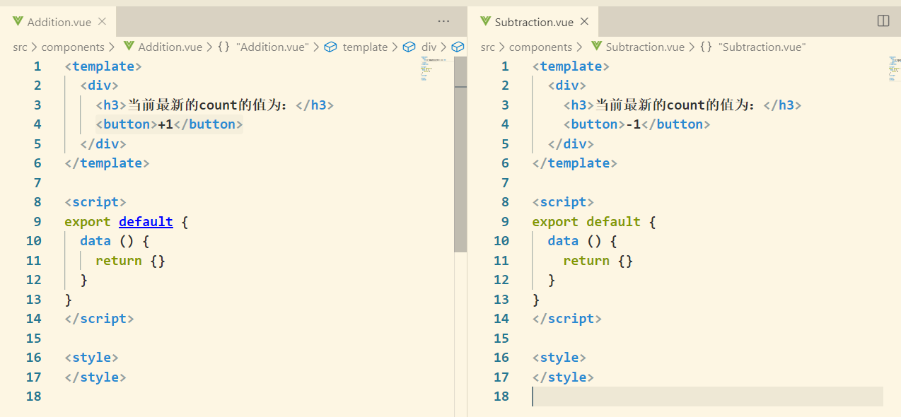

3.在`App.vue`中引入及使用

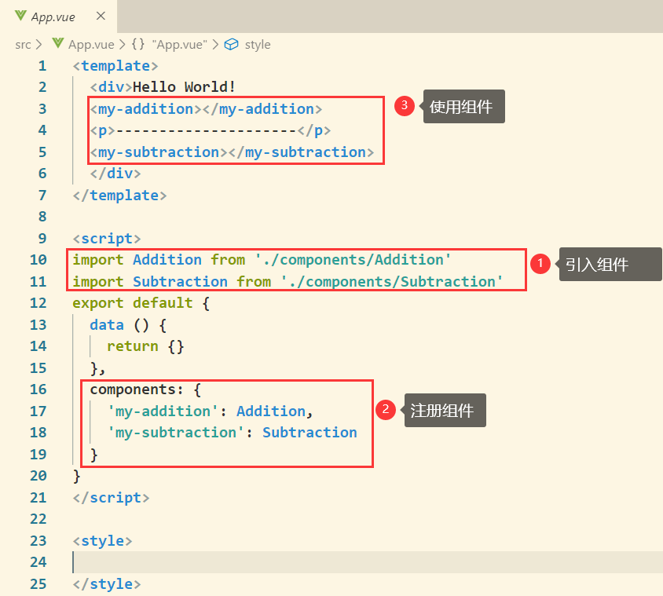

4.运行结果

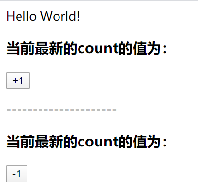

# 5.3 State

State提供唯一公共数据源，所有共享的数据都要统一放到Store的State中进行存储

## 第一种方式

1.设置全局属性

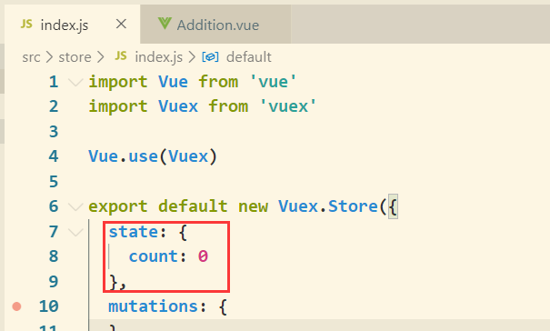

2.在组件中通过 `this.$store.state.count` 引用

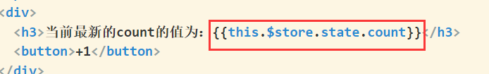

## 第二种方式

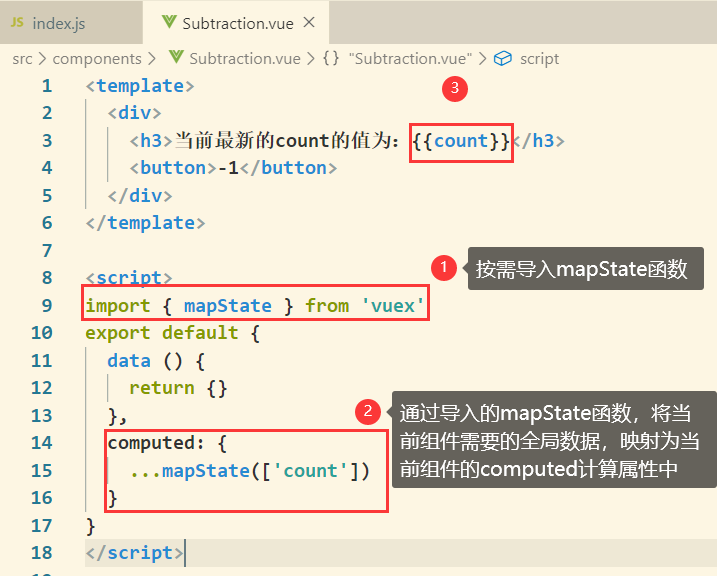

# 5.4 Mutation

通过Mutation用于修改store中的数据，不要直接修改store中的数据

## 第一种方式

1.定义Mutation

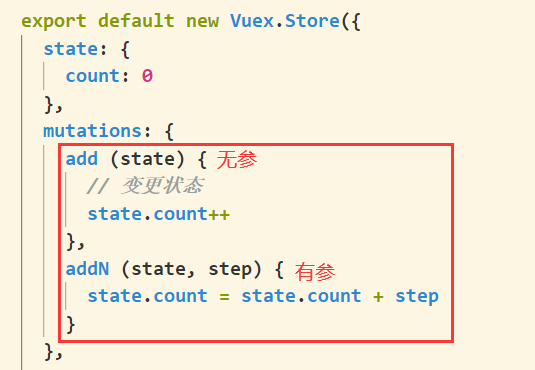

2.触发Mutation

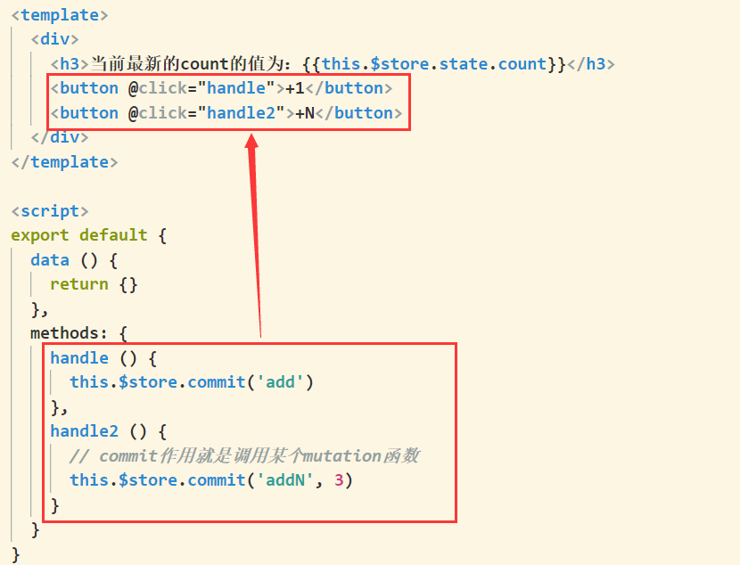

## 第二种方式

1.定义Mutation

```vue
mutations: {
    sub (state) {
      state.count--
    }
  }
```

2.按需导入`mapMutations`函数，并映射到methods方法

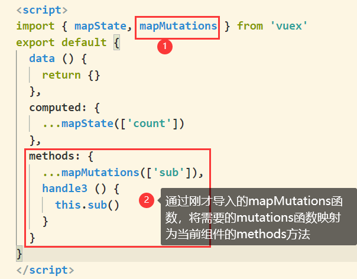

# 5.5 Action

Action用于处理异步任务
如果通过异步操作变更数据，必须通过Action，而不能通过使用Mutation，但是在Action中还是要通过舒服Mutation方式间接变更数据。

## 第一种方式

store文件夹下的`index.js`文件：

```js
export default new Vuex.Store({
  state: {
    count: 0
  },
  mutations: {
    add (state) {
      // 变更状态
      state.count++
    },
  actions: {
    addAsync (context) {
      setTimeout(() => {
        // 在action中不能直接修改state中的数据
        // 必须通过context.commit() 触发某个mutation才行
        context.commit('add')
      }, 1000)
    }
  },
  modules: {
  }
})
```

`Addtion.vue`文件：

```html
<template>
  <div>
    <h3>当前最新的count的值为：{{this.$store.state.count}}</h3>
    <button @click="handle3">+1 Async</button>
  </div>
</template>
<script>
export default {
  data () {
    return {}
  },
  methods: {
    handle3 () {
      // 这里的dispatch函数，专门用来触发action
      this.$store.dispatch('addAsync')
    }
  }
}
</script>
<style>
</style>
```

## 第二种方式

1. 从`Vuex`中导入`mapActions`函数

```js
import { mapActions } from 'vuex'
```

2. 将指定的actions函数映射为当前组件的methods函数

```js
methods: {
    ...mapActions(['addAsync','addNAsync'])
}
```

# 5.6 Getter

## 第一种方式

1.在`index.js`中定义

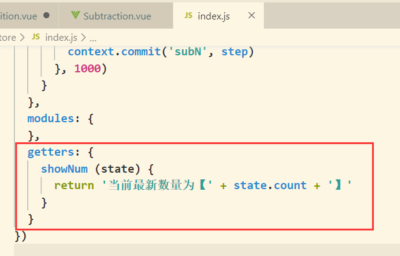

2.通过`this.$store.getters.showNum`使用

```html
<h3>{{this.$store.getters.showNum}}</h3>
```

## 第二种方式

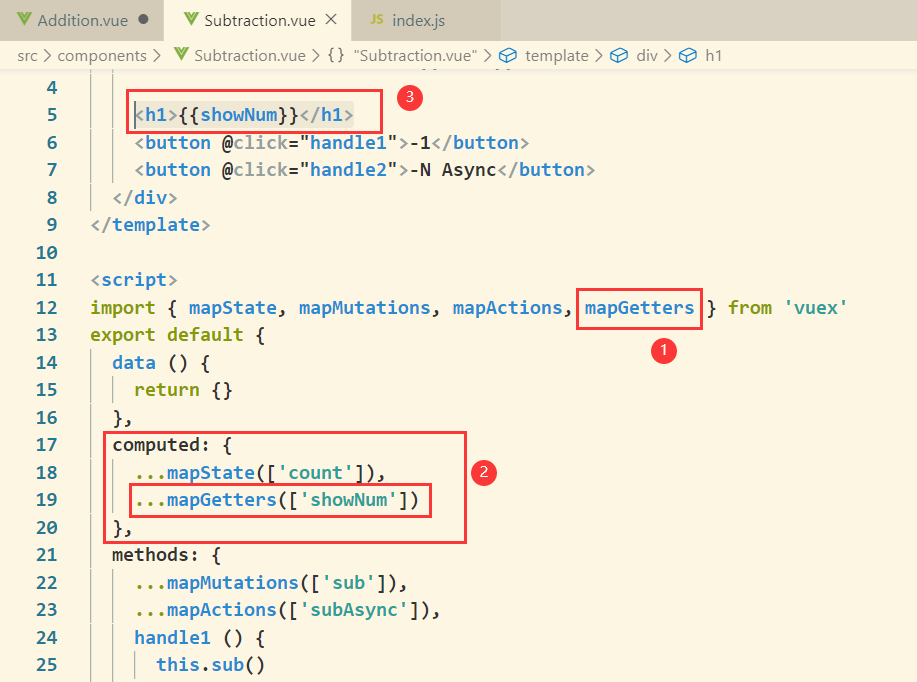

# 5.7 Vue工程的创建

## 命令行

1.通过`vue -V`查看安装的`vue/cli`版本，若没有安装，则执行`npm install -g @vue/cli`进行安装

2.`vue create day08-Todos`，创建工程

3.检查项目所需的功能

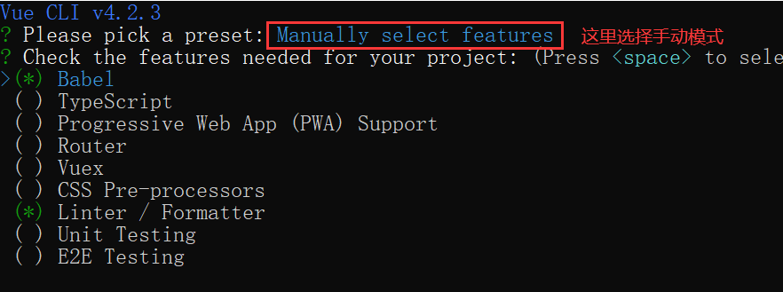

| 功能                   | 解释                                                         |
| ---------------------- | ------------------------------------------------------------ |
| **Babel**              | 一个 JavaScript 编译器，可以将新版本的Javascript标准转换成兼容于旧版本Javascript语言。 |
| TypeScript             | 一种由微软开发的开源、跨平台的编程语言。它是JavaScript的超集，最终会被编译为JavaScript代码。 |
| PWA                    | 渐进式WEB应用，是 Google 在 2015 年提出                      |
| **Router**             | 路由                                                         |
| **Vuex**               |                                                              |
| **CSS Pre-processors** | css预处理                                                    |
| **Linter / Formatter** | 拼写检查，一般是默认选中的                                   |
| Unit Testing           | *站在程序员的角度测试*。unit测试是把代码看成是一个个的组件。从而实现每一个组件的单独测试，测试内容主要是组件内每一个函数的返回结果是不是和期望值一样。 |
| E2E Testing            | *站在用户角度的测试*。e2e测试是把我们的程序堪称是一个黑盒子，我不懂你内部是怎么实现的，我只负责打开<u>浏览器</u>，把测试内容在页面上输入一遍，看是不是我想要得到的结果。 |

4.询问路由和CSS预设

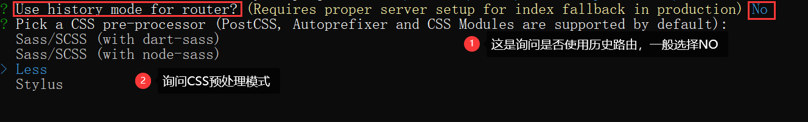

5.ESLint，一般用标准模式

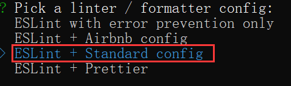

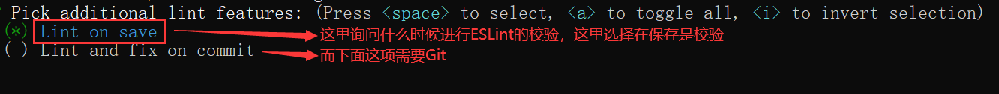

6.询问文件设置

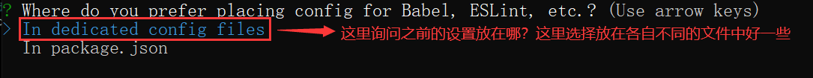

7.所有的选择

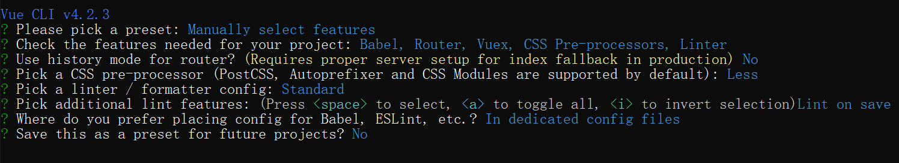

## 图形界面

`vue-ui`

# 5.8 案例：Todos

1.项目初始化
这里vuex已经安装过了，再安装以下
`npm install axios -S`
`npm install ant-design-vue -S`
在main.js中：

```js
import Vue from 'vue'
import App from './App.vue'
import router from './router'
import store from './store'
// 导入ant-design-vue组件库
import Antd from 'ant-design-vue'
// 导入组件库的样式表
import 'ant-design-vue/dist/antd.css'
Vue.config.productionTip = false
Vue.use(Antd)
new Vue({
  router,
  store,
  render: h => h(App)
}).$mount('#app')
```

2.设置格式标准

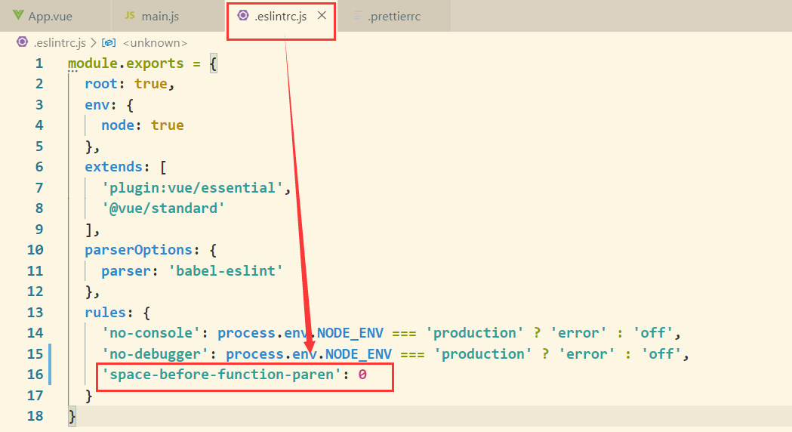

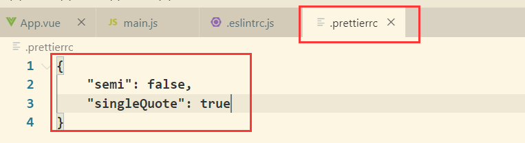

```json
{
    "semi": false,
    "singleQuote": true
}
```