# 4.1 ES6模块化规范

Node 中默认支持 CommonJS 这个服务器端模块化规范，但是对 ES6 的模块化支持并不是太友好，所以需要通过 babel 这个第三方插件在 Node 中来体验高级的 ES6 特性，babel 相当于一个语法转换工具，可以把高级的、有兼容性的 Javascript 代码转换成为低级的、没有兼容性的 Javascript 代码

## Node.js 中通过 babel 体验 ES6 模块化

1. `npm install --save-dev @babel/core @babel/cli @babel/preset-env @babel/node`
2. `npm install --save @babel/polyfill`
3. 项目跟目录创建文件 `babel.config.js`

```js
const presets = [ 
    ["@babel/env", { 
      targets: { 
        edge: "17", 
        firefox: "60", 
        chrome: "67", 
        safari: "11.1" 
      } 
    }]
  ]; 
module.exports = { presets }; 
```

4. 通过` npx babel-node index.js`执行代码 

## 导入和导出

m1.js文件中：

```js
let a=10;
let c=20;
let d=30;
function show(){
    console.log('Hello')
}
// 默认导出
export default{
    a,
    c,
    show
}
// 按需导出
export let s1='aaa';
export let s2='bbb';
export let s3='ccc';
export function say(){
    console.log('Hello China');
}
```

index.js文件中：

```js
// m1是默认导入，{s1,s3 as test2,say}是按需导入
import m1,{s1,s3 as test2,say} from './m1'
console.log(m1)

console.log(s1)
console.log(test2)
console.log(say)
```

**注意：每个模块中，只允许使用唯一的一次`export default`，否则会报错；但可以使用多次按需导出，同时可以通过as取别名**

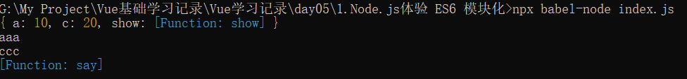

# 4.2 webpack基本使用

## 创建项目

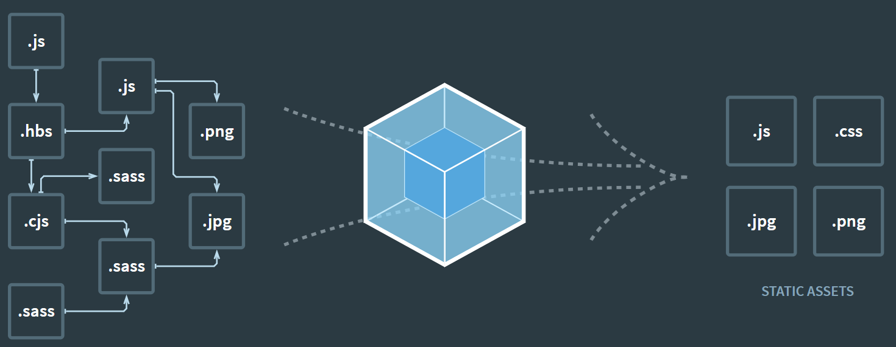

1.新建项目空白目录，并运行 `npm init –y` 命令，初始化包管理配置文件 `package.json`

2.新建`src`源代码目录

3.新建`src -> index.html`首页

4.初始化首页基本的结构

5.运行`npm install jquery –S` 命令，安装 jQuery

6.通过模块化的形式，实现列表隔行变色效果 

## 安装和配置 webpack 

1.运行 `npm install webpack webpack-cli –D`命令，安装`webpack`相关的包

2.在项目根目录中，创建名为 `webpack.config.js` 的`webpack`配置文件

3.在`webpack`的配置文件`webpack.config.js`中，初始化如下基本配置：

```js
module.exports ={
    // 编译模式
    mode:'development' // development production
}
```

4.在`package.json`配置文件中的`scripts`节点下，新增`dev`脚本如下：

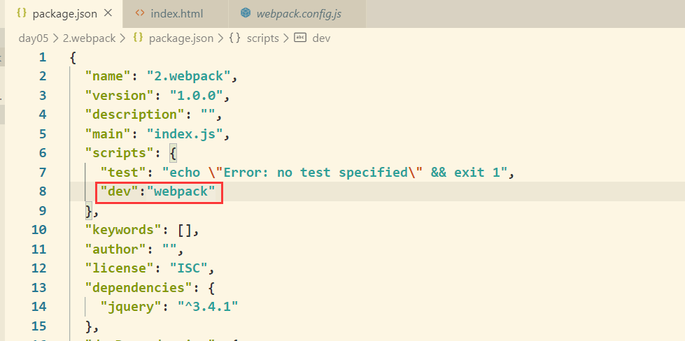

5.在终端中运行`npm run dev`命令，启动`webpack`进行项目打包。

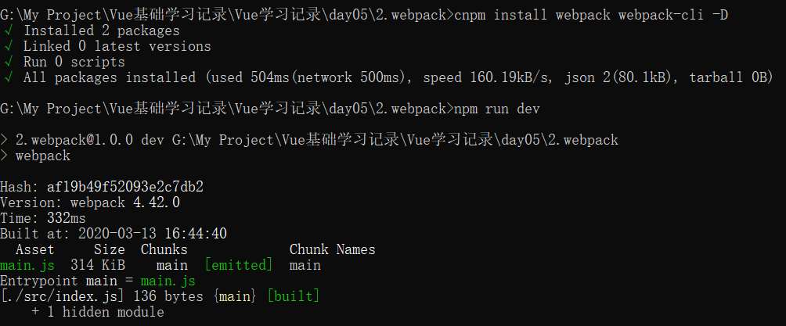

## 配置打包的入口和出口

1. 在webpack.config.js中输入以下

```js
const path = require('path')
module.exports = {
    // 编译模式
    mode: 'development', // development production
    // 打包入口文件路径
    entry: path.join(__dirname, './src/index.js'),
    output: {
        // 输出文件路径
        path: path.join(__dirname, './dist'),
        // 输出文件名
        filename: 'bundle.js'
    }
}
```

2. 在index,html文件中引入bundle.js文件

```html
<script src="../dist/bundle.js"></script>
```

3. 在终端中运行`npm run dev`命令，启动 webpack 进行项目打包

## 配置自动打包功能(热更新)

1.运行 `npm install webpack-dev-server –D `命令，安装支持项目自动打包的工具

2.修改`package.json -> scripts`中的 dev 命令如下：

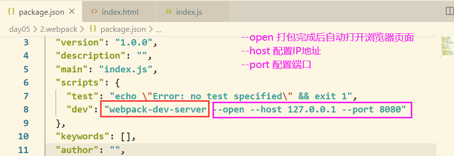

3.将`src -> index.html`中，`script`脚本的引用路径，修改为`"/bundle.js"`

```html
<script src="/bundle.js"></script>
```

4.运行 `npm run dev` 命令，重新进行打包

5.在浏览器中访问` http://localhost:8080 `地址，查看自动打包效果

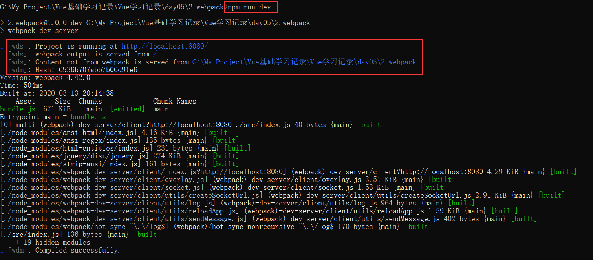

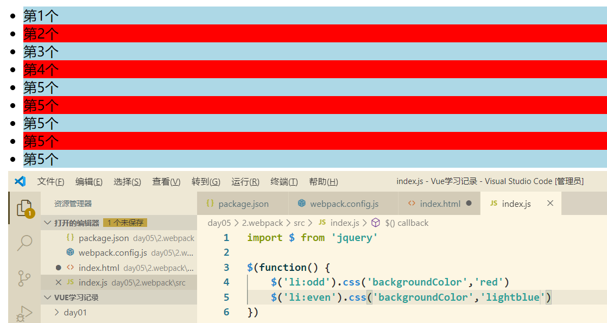

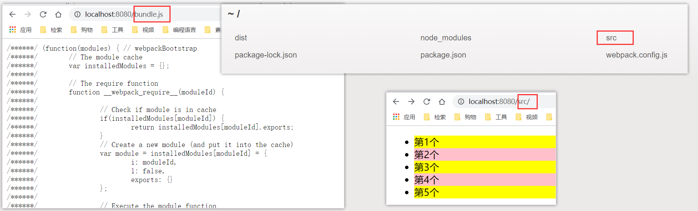

注意：

+ `webpack-dev-server `会启动一个实时打包的 http 服务器
+ `webpack-dev-server` 打包生成的输出文件，默认放到了项目根目录中，而且是虚拟的、看不见的

## 配置 html-webpack-plugin

1.运行 `npm install html-webpack-plugin –D `命令，安装生成预览页面的插件

2.修改 webpack.config.js 文件头部区域，添加如下配置信息：

```js
// 导入生成预览页面的插件，得到一个构造函数
const HtmlWebpackPlugin = require('html-webpack-plugin')
const htmlPlugin = new HtmlWebpackPlugin({
    // 创建插件的实例对象  
    template: './src/index.html', // 指定要用到的模板文件  
    filename: 'index.html' // 指定生成的文件的名称，该文件存在于内存中，在目录中不显示 
})
```

3.修改 webpack.config.js 文件中向外暴露的配置对象，新增如下配置节点：

```js
module.exports = {
    plugins:[htmlPlugin]
}
```

这下打开`http://localhost:8080/`显示的不再是目录了，而是渲染出来的页面

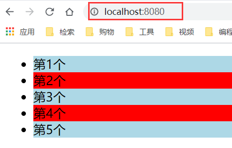

# 4.3 webpack中的加载器

## 通过loader打包非js模块

在实际开发过程中，webpack 默认只能打包处理以 .js 后缀名结尾的模块，其他**非 .js 后缀名结 尾的模块**，webpack 默认处理不了，**需要调用 loader 加载器才可以正常打包**，否则会报错！ 
loader 加载器可以协助 webpack 打包处理特定的文件模块，比如：

+ less-loader 可以打包处理 .less 相关的文件
+ sass-loader 可以打包处理 .scss 相关的文件
+ url-loader  可以打包处理 css 中与 url 路径相关的文件

调用过程：

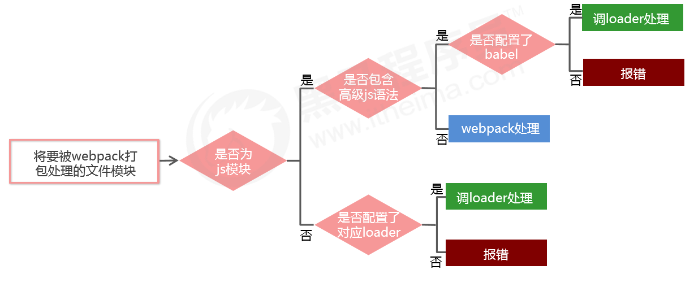

没有安装的话会报错：

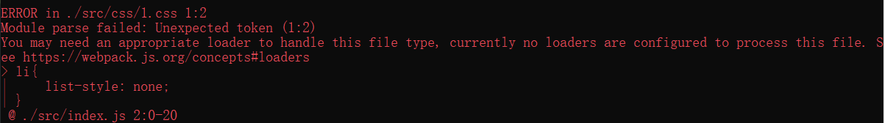

## 打包处理css/less/scss文件

1.根据不同情况使用对应命令

```
npm i style-loader css-loader -D    【css】
npm i less-loader less -D   【less】
npm i sass-loader node-sass -D  【scss】
```

2.在`webpack.config.js`的`module -> rules`数组中，添加 规则如下：

```js
// css
module: {
    rules: [
        { test: /\.css$/, use: ['style-loader', 'css-loader'] }
    ]
}
// less
module: { 
    rules: [ 
        { test: /\.less$/, use: ['style-loader', 'css-loader', 'less-loader'] } 
    ] 
}
// scss
module: { 
    rules: [ 
        { test: /\.scss$/, use: ['style-loader', 'css-loader', 'sass-loader'] } 
    ] 
}
```

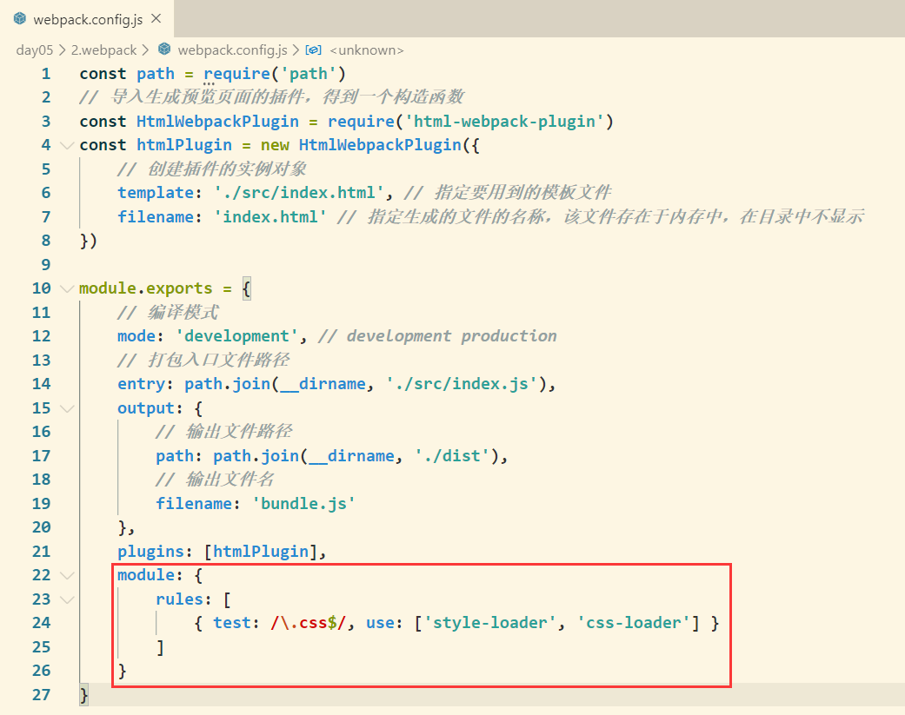

其中，test 表示匹配的文件类型，use 表示对应要调用的loader 注意：

+ use 数组中指定的 loader 顺序是固定的
+ 多个 loader 的调用顺序是：从后往前调用

## 配置 postCSS 自动添加 css 的兼容前缀 

1.运行`npm i postcss-loader autoprefixer -D`命令

2.在项目根目录中创建`postcss`的配置文件`postcss.config.js`，并初始化如下配置：

```js
const autoprefixer = require('autoprefixer') // 导入自动添加前缀的插件  
module.exports = {
    plugins: [autoprefixer] // 挂载插件   
}
```

3.在`webpack.config.js`的`module -> rules`数组中，修改`css`的 `loader`规则如下：

```js
module: { 
    rules: [ 
        { test:/\.css$/, use: ['style-loader', 'css-loader', 'postcss-loader'] } 
    ] 
}
```

##  打包样式表中的图片和字体文件

1. 运行 `npm i url-loader file-loader -D `命令
2. 在`webpack.config.js`的`module -> rules`数组中，添加`loader`规则如下： 

```js
module: {
    rules: [    
        { test: /\.jpg|png|gif|bmp|ttf|eot|svg|woff|woff2$/, use: 'url-loader?limit=312307' }
    ]
}
```

其中 ? 之后的是 loader 的参数项。 limit 用来指定图片的大小，单位是字节(byte)，**只有小于 limit 大小的图片，才会被转为 base64 图片**

## 打包处理 js 文件中的高级语法

1. 安装babel转换器相关的包：`npm i babel-loader @babel/core @babel/runtime -D`
2. 安装babel语法插件相关的包：`

```
npm install --save-dev @babel/preset-env @babel/plugin-proposal-class-properties @babel/plugin-transform-runtime
```

3. 在项目根目录中，创建 babel 配置文件 babel.config.js 并初始化基本配置如下：

```js
module.exports = {
    presets: ['@babel/preset-env'],
    plugins: ['@babel/plugin-transform-runtime', '@babel/plugin-proposal-class-properties']
}
```

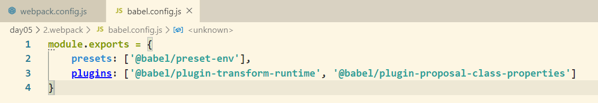

4.在`webpack.config.js`的`module -> rules`数组中，添加 loader 规则如下：

```js
module: {
    rules: [
        { test: /\.js$/, use: 'babel-loader', exclude: /node_modules/ }
    ]
}
```

# 4.4 Vue单文件组件

1.运行`npm install vue-loader vue-template-compiler --save-dev`命令

2.在`webpack.config.js`配置文件中，添加`vue-loader`的配置项如下：

```js
const VueLoaderPlugin = require('vue-loader/lib/plugin')
module.exports = {
    plugins: [htmlPlugin, new VueLoaderPlugin],
    module: {
        rules: [
            { test: /\.vue$/, use: 'vue-loader' }
        ]
    }
```

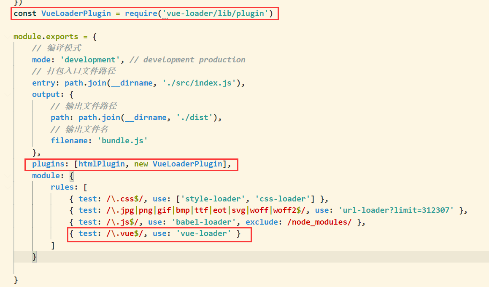

3.运行`npm install vue` 安装vue

4.在`src -> index.js`入口文件中，通过` import Vue from 'vue' `来导入 vue 构造函数

5.创建 vue 的实例对象，并指定要控制的 el 区域

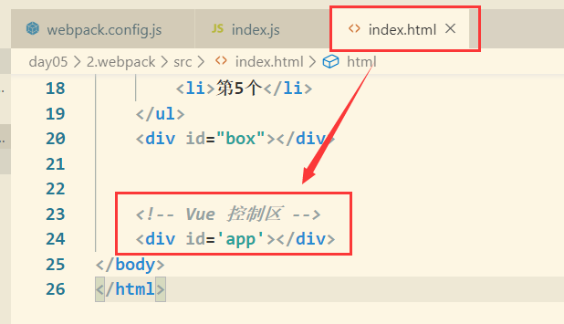

6.通过`render`函数，把指定的组件渲染到 el 区域中 

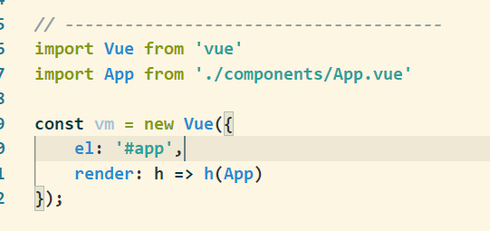

7.通过 `package.json` 文件配置打包命令：

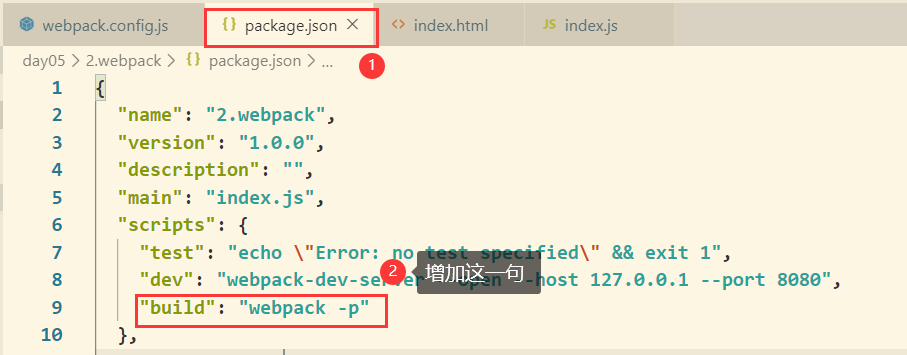

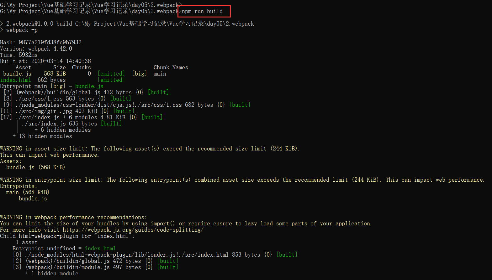

# 4.5 Vue脚手架

脚手架安装：`npm install -g @vue/cli`
脚手架创建：`vue creat my-project`或`vue ui`
单独的配置文件配置项目：

1. 在项目的跟目录创建文件 vue.config.js 
2. 在该文件中进行相关配置，从而覆盖默认配置：

```js
 // vue.config.js 
  module.exports = { 
    devServer: { 
      port: 8888 
    } 
  }
```