> `<script src="https://cdn.jsdelivr.net/npm/vue/dist/vue.js"></script>`

# 1.1 基本使用

```html
<div id="app">
<!-- {{msg}}是插值表达式 -->
    <div>{{msg}}</div>
</div>
<script type="text/javascript" src="../vue.js"></script>
<script type="text/javascript">
    var vm =new Vue({
        el:'#app',
        data:{
            msg:'Hello Vue'
        }
    });
</script>
```

# 1.2 指令

## 指令概览

| v-指令  | 作用                         |
| ------- | ---------------------------- |
| v-clock | 填充CSS样式                  |
| v-text  | 填充纯文本                   |
| v-html  | 填充html代码                 |
| v-once  | 填充不可响应文本             |
| v-model | 双向绑定页面和数据           |
| v-on    | 绑定函数                     |
| v-bind  | 绑定属性                     |
| v-if    | 类似CSS中的`visibility:`属性 |
| v-show  | 类似CSS中的`display:`属性    |
| v-for   | 迭代方式访问数组             |

## v-clock

使用方法：

1.提供样式

2.在插值表达式所在的标签中添加v-clock指令

```html
<head>
    <style type="text/css">
        [v-clock]{
            display: none;
        }
    </style>
</head>
<body>
    <div id="app">
        <div v-clock>{{msg}}</div>
    </div>
    <script type="text/javascript" src="../vue.js"></script>
    <script type="text/javascript">
        var vm =new Vue({
            el:'#app',
            data:{
                msg:'Hello Vue'
            }
        });
    </script>
</body>
```

## v-text

**填充纯文本**，相比插值表达式更加简洁

```html
<div v-text="msg"></div>
```

## v-html

填充HTML片段

① 存在安全问题 

② 本网站内部数据可以使用，来自第三方的数据不可以用

```html
<div v-html="msgs"></div>
```

```html
<script type="text/javascript">
        var vm =new Vue({
            el:'#app',
            data:{
                msg:'Hello Vue',
                msgs:'<h1>HTML</h1>'
            }
        });
    </script>
```

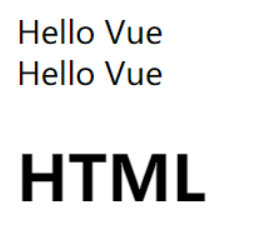

## v-once

如何理解响应式：

① html5中的响应式（屏幕尺寸的变化导致样式的变化）

② 数据的响应式（数据的变化导致页面内容的变化）

数据绑定：将数据填充到标签中 

**v-once ，只编译一次，显示内容之后不再具有响应式功能**

```html
<!-- 如果显示信息之后不需要修改，可以使用v-once,提高性能 -->
<div v-once>{{info}}</div>
```

```html
<script type="text/javascript">
    var vm =new Vue({
        el:'#app',
        data:{
            msg:'Hello Vue',
            info:'你好'
        }
    });
</script>
```

## v-model

双向绑定：页面和数据相互绑定同时改变

```html
<div id="app">
    <div>{{msg}}</div>
    <div>
        <input type="text" v-model='msg'>
    </div>
</div>
```

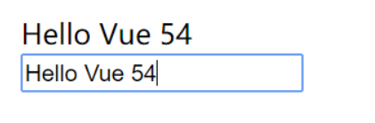

MVVM设计思想：

① M（model）

② V（view）

③ VM（view-model）
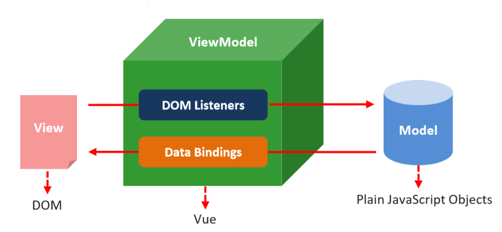

**v-model的低层实现原理分析：**`<input v-bind:value="msg" v-on:input="msg=$event.target.value">`

## v-on

1.基本使用

```html
<div id="app">
    <div>{{num}}</div>
    <div>
        <!-- 以下这四种方式均正确 -->
        <button v-on:click='num++'>点击</button>
        <button @click='num++'>点击2</button>
        <button @click='handle()'>点击3</button>
        <button @click='handle'>点击4</button>
    </div>
</div>
<script type="text/javascript">
    var vm = new Vue({
        el: '#app',
        data: {
            num: 0
        },
        methods: {   // 这里的methods 不要忘了's'
            handle: function () {
                // 这里的 this 是 Vue 的实例对象
                this.num++;
            }
        }
    });
</script>
```

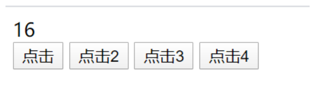

2.事件函数参数传递

```html
<div id="app">
    <div>{{num}}</div>
    <div>
        <!-- 如果事件直接绑定函数名称，那么默认会传递事件对象作为事件函数的第一个参数 -->
        <button v-on:click='handle1'>点击1</button>
        <!-- 2、如果事件绑定函数调用，那么事件对象必须作为后一个参数显示传递，并且事件对象的名称必须是$event -->
        <button v-on:click='handle2(123, 456, $event)'>点击2</button> </div>
</div>
<script type="text/javascript">
    var vm = new Vue({
        el: '#app',
        data: {
            num: 0
        },
        methods: {
            handle1: function (event) {
                console.log(event.target.innerHTML)
            },
            handle2: function (p, p1, event) {
                console.log(p, p1)
                console.log(event.target.innerHTML)
                this.num++;
            }
        }
    });
</script>
```

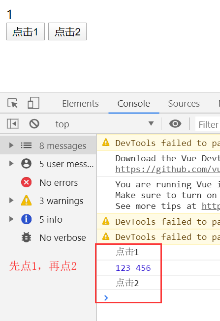

3.按键修饰符

`v-on:keyup.delete='clear()'`，按删除键就能调用`clear()`方法

`v-on:keyup.enter='handleSunmit()'`，按回车键就能调用`handleSunmit()`方法

```html
<div id="app">
    <div>
        用户名：
        <input type="text" v-on:keyup.delete='clear()' v-model='username'>
    </div>
    <div>
        密码：
        <input type="password" v-on:keyup.enter='handleSunmit()' v-model='pwd'>
    </div>
    <div>
        <input type="submit" v-on:click='handleSunmit()' value="表单提交">
    </div>
</div>
<script type="text/javascript">
    var vm = new Vue({
        el: '#app',
        data: {
            username:'',
            pwd:''
        },
        methods: {
            handleSunmit:function(){
                console.log(this.username+this.pwd)
            },
            clear:function(){
                this.username=''
            }
        }
    });
</script>
```

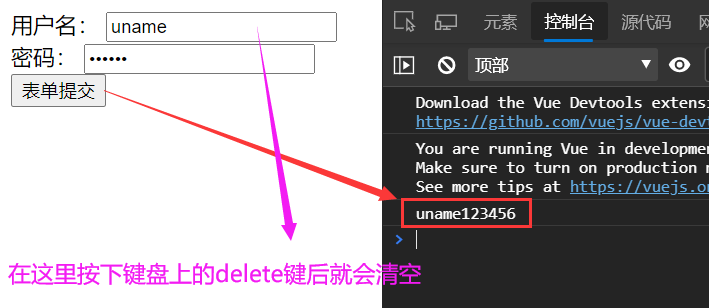

4.自定义按键修饰符

全局`config.keyCodes`对象

```js
Vue.config.keyCodes.F1 = 112
```

## 案例：加法计算器

> `v-model='a'`：给输入的文本作为对象a
>
> `v-on:click='addition'`：点击触发addtion函数
>
> `v-text='result'`：填充result结果

```html
<div id="app">
    a=<span v-text='a'></span><br>
    b=<span v-text='b'></span><br>
    <input type="text" v-model='a'>
    <input type="text" v-model='b'>
    <br>
    add=<span v-text='add'></span><br>
    <button type="button" v-on:click="addition">加和运算</button>
    <br>
    sub=<span v-text='sub'></span><br>
    <button type="button" v-on:click="subtraction">减法运算</button>
</div>

<script>
    new Vue({
        el: "#app",
        data: {
            a: '',
            b: '',
            add: '',
            sub: ''
        },
        methods: {
            addition: function(){
                this.add=parseInt(this.a)+parseInt(this.b);
            },
            subtraction: function(){
                this.sub=parseInt(this.a)-parseInt(this.b);
            }
        }
    });
</script>
```

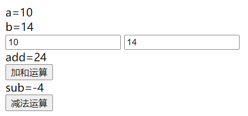

## v-bind

1.属性绑定

```html
<div id="app">
<!--   
        简写方式：
        <a :href='url'>百度</a>
-->
    <a v-bind:href='url'>百度</a>
    <button @click='handle'>切换</button>
</div>
<script type="text/javascript">
    var vm = new Vue({
        el: '#app',
        data: {
            url:'http://www.baidu.com'
        },
        methods: {
            handle:function(){
                this.url='https://www.zhihu.com'
            }
        }
    });
</script>
```

2.class样式绑定

```html
<style type="text/css">
    .active {
        border:1px solid red;
        width:100px;
        height:100px;
    }
    .error {
        background-color: coral;
    }
</style>
```

对象形式：`<div v-bind:class="{ active: isActive }"></div> `

```html
<div id="app">
    <div v-bind:class="{active: isActive,error:isError}">测试样式</div>
    <button @click='handle'>切换</button>
</div>
<script type="text/javascript">
    var vm = new Vue({
        el: '#app',
        data: {
            isActive:true,
            isError:false
        },
        methods: {
            handle:function(){
                // 控制 isActive在true和false间切换
                this.isActive=!this.isActive
                this.isError=!this.isError
            }
        }
    });
</script>
```

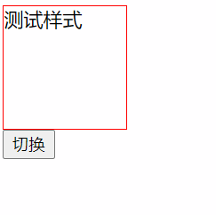

**数组形式：`<div v-bind:class="[activeClass, errorClass]"></div>`**

```html
<div id="app">
    <div v-bind:class='[activeClass,errorClass]'>测试样式</div>
    <button @click='handle'>切换</button>
</div>
<script type="text/javascript">
    var vm = new Vue({
        el: '#app',
        data: {
            activeClass:'active',
            errorClass:'error'
        },
        methods: {
            handle:function(){
                this.activeClass='';
                this.errorClass='';
            }
        }
    });
</script>
```

3.style样式绑定

```html
<div id="app">
    <div v-bind:style="styleObject">绑定样式对象</div>
    <div v-bind:style="{ color: activeColor, fontSize: fontSize }">内联样式 </div>
    <!--组语法可以将多个样式对象应用到同一个元素 -->
    <div v-bind:style="[styleObj1, styleObj2]">styleObj1和styleObj2</div>
</div>
<script>
    new Vue({
        el: '#app',
        data: {
            styleObject: {
                color: 'green',
                fontSize: '30px',
                background: 'red'
            },
            activeColor: 'green',
            fontSize: "50px",
            styleObj1: {
                color: 'red'
            },
            styleObj2: {
                fontSize: '30px'
            }
        }
    });
</script>
```

## v-if 和 v-show

v-show 和 v-if的区别：

+ **v-show本质就是标签display设置为none，控制隐藏** 。v-show控制元素是否显示（已经渲染到页面上了）
+ v-if控制元素是否渲染到页面

```html
<div id="app">
    <div v-if='score>=90'>优秀</div>
    <div v-else-if='score>=60 && score<90'>良好</div>
    <div v-else='score<60'>垃圾</div>

    <!-- v-show原理：控制元素是否显示 display:none -->
    <div v-show='flag'>测试v-show</div>
    <button v-on:click='handle'>切换</button>
</div>
<script>
    new Vue({
        el: '#app',
        data: {
            score: 80,
            flag: false
        },
        methods: {
            handle: function () {
                this.flag = !this.flag
            }
        }
    });
</script>
```

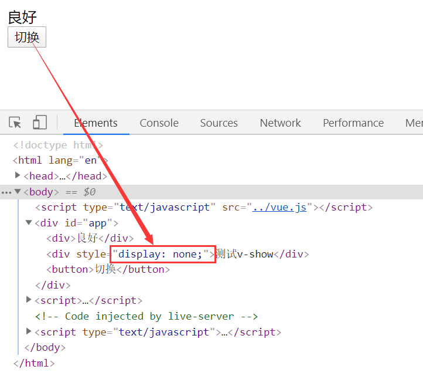

## v-for

```html
<div id="app">
    <h1>水果列表</h1>
    <ul>
        <li v-for='item in fruits'>{{item}}</li>
        <li v-for='(item,index) in fruits'>{{item+"----"+index}}</li>
        
        <li v-for='item in myFruits'>
            <span>{{item.ename}}</span>
            <span>***********</span>
            <span>{{item.cname}}</span>
        </li>
    </ul>
</div>
<script type="text/javascript">
    new Vue({
        el: '#app',
        data: {
            fruits:['apple','banana','orange'],
            myFruits:[{
                ename:'pear',
                cname:'梨'
            },{
                ename:'cherry',
                cname:'樱桃'
            },{
                ename:'strawberry',
                cname:'草莓'
            }]
        },
        methods: {
        }
    });
</script>
```

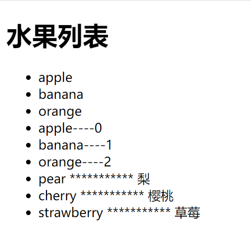

## 案例：Tab选项卡

```html
<!DOCTYPE html>
<html lang="en">
<head>
    <meta charset="UTF-8">
    <title>Tab选项卡</title>
    <script src="https://cdn.jsdelivr.net/npm/vue/dist/vue.js"></script>
    <style type="text/css">
        .tab ul {
            overflow: hidden;
            padding: 0;
            margin: 0;
        }
        .tab ul li {
            box-sizing: border-box;
            padding: 0;
            float: left;
            width: 100px;
            height: 45px;
            line-height: 45px;
            list-style: none;
            text-align: center;
            border-top: 1px solid blue;
            border-right: 1px solid blue;
            /* cursor:none; */
        }
        .tab ul li:first-child {
            border-left: 1px solid blue;
        }
        .tab ul li.active {
            background-color: orange;
        }
        .tab div {
            width: 500px;
            height: 300px;
            display: none;
            text-align: center;
            font-size: 30px;
            line-height: 300px;
            border: 1px solid blue;
            border-top: 0px;
        }
        .tab div.current {
            display: block;
        }
    </style>
</head>
<body>
    <script type="text/javascript" src="../vue.js"></script>
    <div id="app">
        <div class="tab">
            <ul>
                <li v-on:click='change(index)' :class='currentIndex==index?"active":""' :key='item.id'
                    v-for='(item,index) in list'>{{item.title}}</li>
            </ul>
            <div :class='currentIndex==index?"current":""' :key='item.id' v-for='(item, index) in list'>
                
            </div>
        </div>
    </div>
    <script type="text/javascript">
        var vm = new Vue({
            el: '#app',
            data: {
                currentIndex: 0, // 选项卡当前的索引
                list: [{
                    id: 1,
                    title: 'fluid',
                    path: './favicon.png'
                }, {
                    id: 2,
                    title: 'leetcode',
                    path: './leetcode.png'
                }, {
                    id: 3,
                    title: '语雀',
                    path: './语雀.png'
                }]
            },
            methods: {
                change: function (index) {
                    // 在这里实现选项卡切换操作：本质就是操作类名
                    // 如何操作类名？就是通过currentIndex
                    this.currentIndex = index;
                }
            }
        });
    </script>
</body>
</html>
```

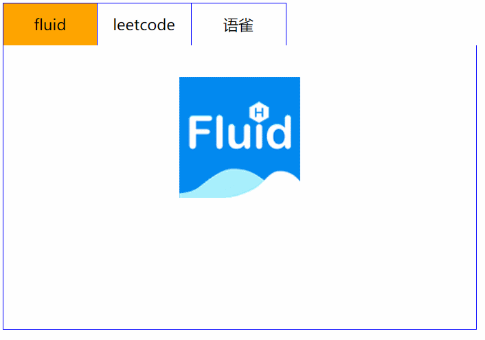

# 1.3 表单操作

## 基于Vue的表单操作

+ Input  单行文本

```html
<input type="text" v-model='uname'>
```

+ textarea  多行文

```html
<textarea v-model='desc'></textarea>
```

+ select  下拉多选

```html
<select v-model='occupation' multiple>
<option value="0">请选择职业...</option>
<option value="1">教师</option>
<option value="2">软件工程师</option>
<option value="3">律师</option> 
</select>
```

+ radio  单选框

```html
<input type="radio" id="male" value="1" v-model='gender'>
<label for="male">男</label>
<input type="radio" id="female" value="2" v-model='gender'>
<label for="female">女</label>
```

+ checkbox  多选框

```html
<input type="checkbox" id="ball" value="1" v-model='hobby'>
<label for="ball">篮球</label>
<input type="checkbox" id="sing" value="2" v-model='hobby'>
<label for="sing">唱歌</label>
```

总代码如下：

```html
<body>
    <div id="app">
        <form action="http://www.baidu.com">
            <div>
                <span>姓名：</span>
                <span>
                    <!-- 单行文本 -->
                    <input type="text" v-model='uname'>
                </span>
            </div>
            <div>
                <span>性别：</span>
                <span>
                    <!-- 单选框 -->
                    <input type="radio" id="male" value="1" v-model='gender'>
                    <label for="male">男</label>
                    <input type="radio" id="female" value="2" v-model='gender'>
                    <label for="female">女</label>
                </span>
            </div>
            <div>
                <span>爱好：</span>
                <!-- 多选框 -->
                <input type="checkbox" id="ball" value="1" v-model='hobby'>
                <label for="ball">篮球</label>
                <input type="checkbox" id="sing" value="2" v-model='hobby'>
                <label for="sing">唱歌</label>
                <input type="checkbox" id="code" value="3" v-model='hobby'>
                <label for="code">写代码</label>
            </div>
            <div>
                <span>职业：</span>
                <!-- 下拉多选 -->
                <select v-model='occupation' multiple>
                    <option value="0">请选择职业...</option>
                    <option value="1">教师</option>
                    <option value="2">软件工程师</option>
                    <option value="3">律师</option>
                </select>
            </div>
            <div>
                <span>个人简介：</span>
                <!-- 多行文本 -->
                <textarea v-model='desc'></textarea>
            </div>
            <div>
                <input type="submit" value="提交" @click.prevent='handle'>
            </div>
        </form>
    </div>
    
    <script type="text/javascript">
        var vm = new Vue({
            el: '#app',
            data: {
                uname: 'Long',
                gender: 2,
                hobby: ['2', '3'],
                // occupation: 3,
                occupation: ['1', '3'],
                desc: 'hello'
            },
            methods: {
                handle: function () {
                    console.log(this.uname)
                    console.log(this.gender)
                    console.log(this.hobby.toString())
                    console.log(this.occupation)
                    console.log(this.desc)
                }
            }
        });
    </script>
</body>
```

表单的CSS代码为：

```css
form div {
    height: 40px;
    line-height: 40px;
}
form div:nth-child(4) {
    height: auto;
}
form div span:first-child {
    display: inline-block;
    width: 100px;
}
```

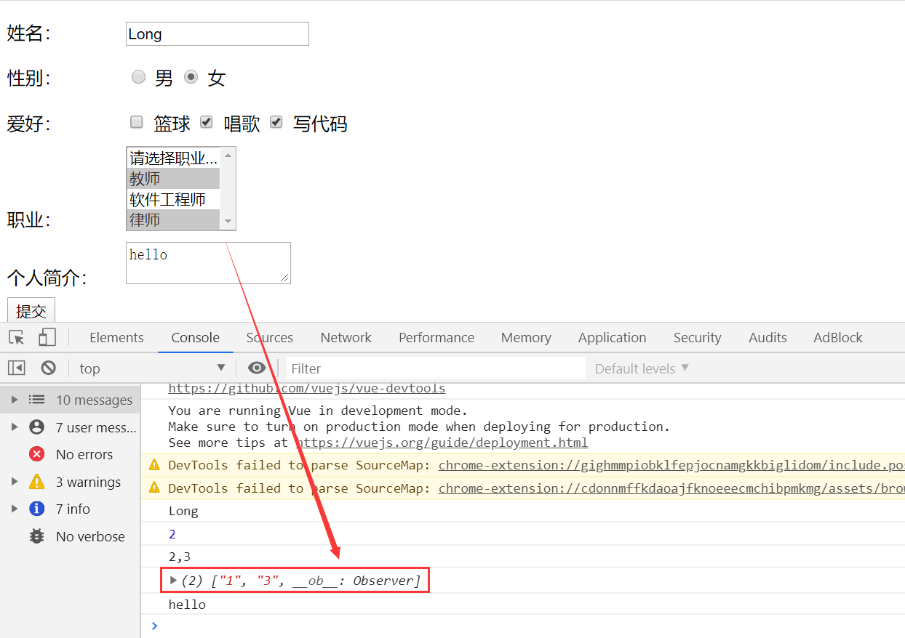

## 表单修饰符

`.lazy`：

在默认情况下，`v-model` 在每次 `input` 事件触发后将输入框的值与数据进行同步 。你可以添加 `lazy` 修饰符，从而转为在 `change` 事件之后进行同步：

```html
<!-- 在“change”时而非“input”时更新 -->
<input v-model.lazy="msg">
```

`.number`：

如果想自动将用户的输入值转为数值类型，可以给 `v-model` 添加 `number` 修饰符：

```html
<input v-model.number="age" type="number">
```

这通常很有用，因为即使在 `type="number"` 时，HTML 输入元素的值也总会返回字符串。如果这个值无法被 `parseFloat()` 解析，则会返回原始的值。

`.trim`：

如果要自动过滤用户输入的**首尾空白字符**，中间的空格去不掉，可以给 `v-model` 添加 `trim` 修饰符：

```html
<input v-model.trim="msg">
```

看如下程序：

```html
<div id="app">
    <input type="text" v-model.number='age'>
    <input type="text" v-model.trim='info'>
    <input type="text" v-model.lazy='msg'>
    <div>{{msg}}</div>
    <button @click='handle'>点击</button>
</div>
<script type="text/javascript">
    var vm = new Vue({
        el: '#app',
        data: {
            age:'',
            info:'',
            msg:''
        },
        methods: {
            handle:function(){
                console.log(this.age+100)
                console.log(this.info.length)
            }
        }
    });
</script>
```


# 1.4 自定义指令（directives）

1.无参

```html
<!-- Vue官方案例 -->
<div id="app">
    <input type="text">
    <input type="text" v-focus>
</div>
<script type="text/javascript">
    Vue.directive('focus',{
        inserted:function(el){
            el.focus();
        }
    })
    var vm = new Vue({
        el: '#app',
    });
    </script>
```

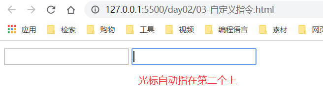

2.有参

```html
<div id="app">
    <input type="text" v-color='{color:"red"}'>
</div>
<script type="text/javascript">
    Vue.directive('color',{
        inserted:function(el,b){
            el.style.backgroundColor=b.value.color
        }
    })
    var vm = new Vue({
        el: '#app',
    });
</script>
```


3.局部指令

```html
<div id="app">
    <input type="text" v-color='msg'>
    <input type="text" v-focus>
</div>
<script type="text/javascript">
    var vm = new Vue({
        el: '#app',
        data: {
            msg: {
                color: 'red'
            }
        },
        directives: {
            color: {
                bind: function (el, b) {
                    el.style.backgroundColor = b.value.color
                }
            },
            focus: {
                inserted: function (el) {
                    el.focus();
                }
            }
        }
    });
</script>
```

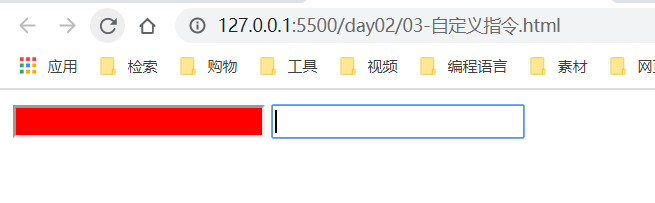

# 1.5 计算属性（computed）

表达式的计算逻辑可能会比较复杂，使用计算属性可以使模板内容更加简洁
计算属性与方法的区别：

+ 计算属性是基于它们的依赖进行缓存的
+ 方法不存在缓存

```html
<div id="app">
    <div>{{reverseString}}</div>
    <div>{{reverseString}}</div>
    <div>{{reverseMessage()}}</div>
    <div>{{reverseMessage()}}</div>
</div>
<script type="text/javascript">
    var vm = new Vue({
        el: '#app',
        data: {
            msg: 'Hello World'
        },
        methods: {
            reverseMessage: function () {
                console.log('methods');
                return this.msg.split('').reverse().join('');
            }
        },
        computed: {
            reverseString: function () {
                console.log('computed');
                return this.msg.split('').reverse().join('');
            }
        }
    });
</script>
```

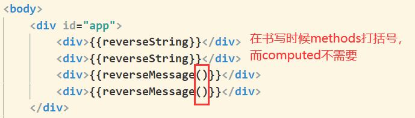

页面显示结果如下：

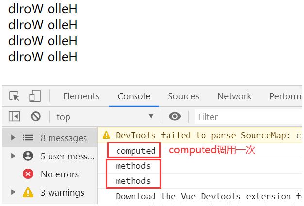


# 1.6 侦听器（watch）

+ 使用watch来响应数据的变化
+ 一般用于异步或者开销较大的操作
+ watch中的属性一定是data中已经存在的数据
+ **当需要监听一个对象的改变时，普通的watch方法无法监听到对象内部属性的改变，只有data中的数据才能够监听到变化，此时就需要deep属性对对象进行深度监听**

```html
<!DOCTYPE html>
<html lang="en">
<head>
    <meta charset="UTF-8">
    <meta name="viewport" content="width=device-width, initial-scale=1.0">
    <title>Document</title>
    <script src="https://cdn.jsdelivr.net/npm/vue/dist/vue.js"></script>
</head>
<body>
    <div id="app">
        <div>
            <span>用户名：</span>
            <span>
                <input type="text" v-model.lazy='uname'>
            </span>
        </div>
        <span>{{tip}}</span>
    </div>
    <script type="text/javascript">
        /*      
            侦听器：
            1、采用侦听器监听用户名的变化
            2、调用后台接口进行验证
            3、根据验证的结果调整提示信息
        */
        var vm = new Vue({
            el: '#app',
            data: {
                uname: '',
                tip: ''
            },
            methods: {
                checkName: function (uname) {
                    var that = this;
                    // 使用定时任务的方式模拟后台接口,2s后调用函数
                    setTimeout(function () {
                        if (uname === 'admin') {
                            that.tip = '用户名已经存在，请重新申请账户'
                        } else {
                            that.tip = '用户名可以使用'
                        }
                    }, 200);
                }
            },
            watch: {
                uname: function (val) {
                    // 调用后台接口验证
                    this.checkName(val);
                    // 修改提示信息
                    this.tip = '正在验证...';
                }
            }
        });
    </script>
</body>
</html>
```

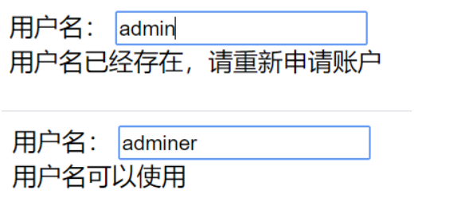

# 1.7 过滤器（filter）

这里的过滤器与Java中意思一样

```html
<div id="app">
    <input type="text" v-model='msg'>
    <div>{{msg|upper}}</div>
    <div>{{msg|upperAll}}</div>
    <div v-bind:abc='msg | upper'>测试数据</div>
</div>
<script type="text/javascript">
    Vue.filter('upper',function(val){
        return val.charAt(0).toUpperCase()+val.slice(1)
    })
    var vm = new Vue({
        el: '#app',
        data: {
            msg:''
        },
        // 注意：局部过滤器这里要用 filter要加s
        filters:{
            'upperAll':function(val){
                return val.toUpperCase();
            }
        }
    });
</script>
```

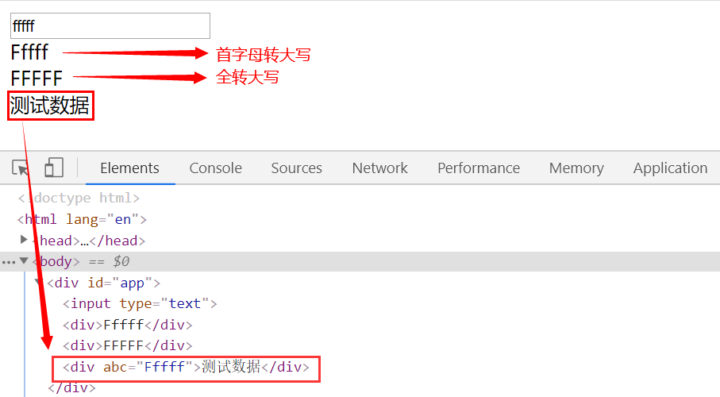

# 1.8 生命周期

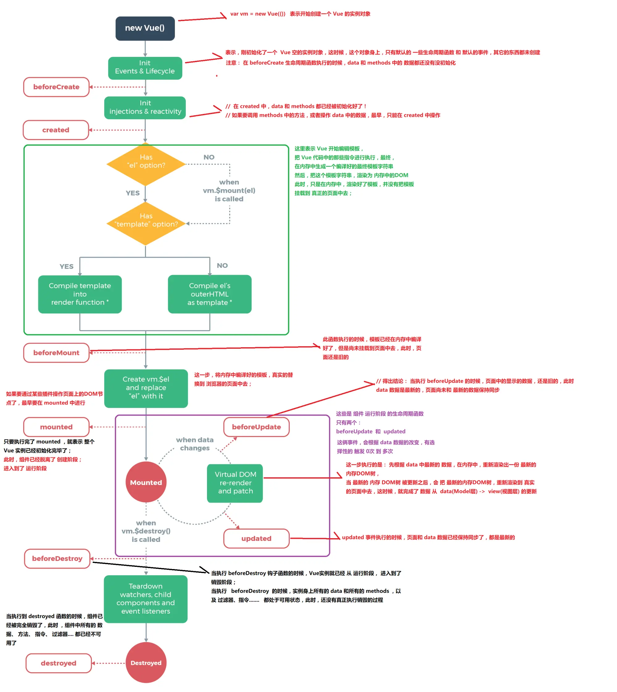

1.挂载（初始化相关属性）

① beforeCreate 

② created 

③ beforeMount 

④ mounted 

2.更新（元素或组件的变更操作） 

① beforeUpdate 

② updated

3.销毁（销毁相关属性） 

① beforeDestroy

② destroyed

# 1.9 数组API

### 数组变异方法（修改原有数据）

在 Vue 中，直接修改对象属性的值无法触发响应式。当你直接修改了对象属性的值，你会发现，只有数据改了，但是页面内容并没有改变
变异数组方法即**保持数组方法原有功能不变的前提下对其进行功能拓展**

| 方法        | 解释                                                         |
| ----------- | ------------------------------------------------------------ |
| `push()`    | 往数组最后面添加一个元素，成功返回当前数组的长度             |
| `pop()`     | 删除数组的最后一个元素，成功返回删除元素的值                 |
| `shift()`   | 删除数组的第一个元素，成功返回删除元素的值                   |
| `unshift()` | 往数组最前面添加一个元素，成功返回当前数组的长度             |
| `splice()`  | 有三个参数，第一个是想要删除的元素的下标（必选），第二个是想要删除的个数（必选），第三个是删除后想要在原位置替换的值 |
| `sort()`    | sort()  使数组按照字符编码默认从小到大排序,成功返回排序后的数组 |
| `reverse()` | reverse()  将数组倒序，成功返回倒序后的数组                  |

## 替换数组（生成新的数组）

不会改变原始数组，但总是返回一个新数组

| 方法   | 解释                                                         |
| ------ | ------------------------------------------------------------ |
| filter | filter() 方法创建一个新的数组，新数组中的元素是通过检查指定数组中符合条件的所有元素。 |
| concat | concat() 方法用于连接两个或多个数组。该方法不会改变现有的数组 |
| slice  | slice() 方法可从已有的数组中返回选定的元素。该方法并不会修改数组，而是返回一个子数组 |

## 修改响应式数据

`Vue.set(vm.items, indexOfItem, newValue) vm.$set(vm.items, indexOfItem, newValue) `

① 参数一表示要处理的数组名称 

② 参数二表示要处理的数组的索引 

③ 参数三表示要处理的数组的值

```html
<div id="app">
    <ul>
        <li v-for='itme in list'>{{itme}}</li>
    </ul>
    <div>
        <span>{{info.name}}</span>
        <span>{{info.age}}</span>
        <span>{{info.gender}}</span>
    </div>
</div>
<script type="text/javascript">
    var vm = new Vue({
        el: '#app',
        data: {
            list: ['apple', 'banana', 'orange'],
            info:{
                name:'Lisa',
                age:'20',
            }
        }
    });
    Vue.set(vm.list,1,'lemon');
    vm.$set(vm.list,2,'strawberry');  // vm是实例化对象，所以set前面加 $ 符号
    // 注意：以下两行不能同时存在
    // vm.info.gender = 'male';  // 这个是非响应式的
    vm.$set(vm.info,'gender','女')
</script>
```

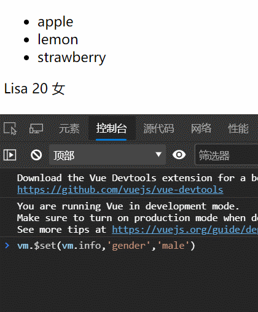

